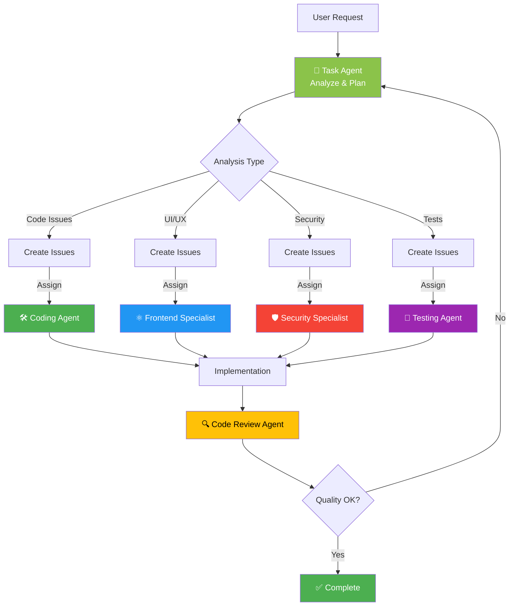

# 🤖 Black Trigram Agent Capabilities Matrix

This document provides a comprehensive overview of all custom agents available for Black Trigram (흑괘) development, their capabilities, and when to use each agent.

## 🔑 Essential Context for All Agents

All agents should reference these key files to understand the project environment:

1. **Setup & Environment**: `.github/workflows/copilot-setup-steps.yml`
   - Available build tools and dependencies (Node.js 24, npm, TypeScript)
   - Environment setup and cache configuration
   - Workflow permissions and capabilities

2. **MCP Configuration**: `.github/copilot-mcp.json`
   - Available MCP servers (GitHub, Filesystem, Git, Memory, Playwright, AWS)
   - Server capabilities and configurations
   - Disabled/optional servers and their activation requirements

3. **Project Context**: `README.md`
   - Project overview and architecture
   - Korean martial arts philosophy and theming
   - Technology stack and combat mechanics
   - Development guidelines and documentation links

## 📊 Quick Reference Matrix

| Agent | Primary Role | Key Capabilities | MCP Servers | Best For |
|-------|-------------|------------------|-------------|----------|
| 🎯 **Task Agent** | Product Orchestrator | Issue creation, quality analysis, ISMS compliance, agent delegation | GitHub, Playwright, AWS | Product management, quality oversight, issue tracking |
| 🛠️ **Coding Agent** | Full-Stack Developer | Feature implementation, bug fixes, Korean theming, PixiJS integration | Standard | General development tasks, new features |
| ⚛️ **Frontend Specialist** | React Expert | Type-safe components, React 19 features, state management | Standard | Complex React components, UI architecture |
| 🎮 **Game Developer** | PixiJS Specialist | Game loops, rendering optimization, audio integration, 60fps performance | Standard | Game mechanics, PixiJS systems, performance |
| 🧪 **Testing Agent** | Test Writer | Unit tests, E2E tests, test debugging, mocking | Standard | Writing tests, debugging test failures |
| 🔬 **Test Engineer** | Test Strategist | Test architecture, coverage enforcement, CI integration | Standard | Test strategy, coverage improvement, CI/CD |
| 📝 **Documentation Writer** | Documentation Expert | JSDoc/TSDoc, user guides, security policies, bilingual content | Standard | API docs, user guides, SECURITY.md |
| 🔍 **Code Review Agent** | Quality Reviewer | Code quality assessment, standards verification, performance review | Standard (read-only) | Code reviews, quality checks, PR feedback |
| 🛡️ **Security Specialist** | Security Expert | OSSF Scorecard, SBOM, vulnerability management, license compliance | Standard | Security issues, dependency updates, ISMS |

## 🎯 Task Agent - Product Quality Orchestrator

### Overview
The Task Agent is your **first point of contact** for product-wide concerns. It analyzes quality holistically and creates actionable GitHub issues with clear acceptance criteria.

### Core Capabilities

#### 1. GitHub Issue Management
- ✅ Create well-structured issues with templates
- ✅ Add appropriate labels and priorities
- ✅ Link to ISMS policies and compliance requirements
- ✅ Suggest agent assignments
- ✅ Search and filter existing issues
- ✅ Add comments and updates

#### 2. Product Quality Analysis
- ✅ Feature completeness assessment
- ✅ Game design vs implementation gap analysis
- ✅ Combat mechanics balance evaluation
- ✅ Player progression satisfaction metrics

#### 3. UI/UX Evaluation
- ✅ WCAG 2.1 AA compliance checking
- ✅ Korean theming consistency validation
- ✅ Responsive design testing (mobile/tablet/desktop)
- ✅ Bilingual text completeness
- ✅ 60fps performance monitoring

#### 4. Security & ISMS Compliance
- ✅ ISMS policy alignment verification
- ✅ OSSF Scorecard improvement tracking
- ✅ Vulnerability assessment
- ✅ License compliance checking
- ✅ SBOM completeness validation

#### 5. Performance Analysis
- ✅ Bundle size monitoring
- ✅ Load time analysis
- ✅ Lighthouse score tracking
- ✅ FPS performance testing
- ✅ Memory usage profiling

### MCP Server Access

**GitHub MCP:**
- `github-create_issue`, `github-update_issue`, `github-add_issue_comment`
- `github-list_issues`, `github-search_issues`
- `github-get_file_contents`, `github-search_code`
- `github-list_commits`, `github-list_pull_requests`

**Playwright MCP:**
- `playwright-browser_navigate`, `playwright-browser_screenshot`
- `playwright-browser_snapshot`, `playwright-browser_click`
- `playwright-browser_type`, `playwright-browser_evaluate`

**AWS MCP (when enabled):**
- Infrastructure monitoring
- Deployment validation
- Cost analysis

### When to Use Task Agent

✅ **Use for:**
- "Analyze Black Trigram and identify improvement areas"
- "Create issues for missing ISMS references"
- "Check UI/UX against Korean theming standards"
- "Evaluate test coverage and create improvement issues"
- "Review performance and create optimization issues"
- "Audit documentation completeness"

❌ **Don't use for:**
- Writing actual code (delegate to Coding Agent)
- Detailed implementation work
- Direct bug fixes
- Writing tests

### Example Workflows

**Quality Audit:**
```
@task-agent "Perform a comprehensive quality audit of Black Trigram, 
focusing on ISMS compliance gaps, UI/UX Korean theming consistency, 
and test coverage below 90%. Create issues for each finding."
```

**Performance Review:**
```
@task-agent "Analyze bundle size and load time. If >900KB or >2s load time, 
create performance issues with specific optimization recommendations."
```

**ISMS Compliance:**
```
@task-agent "Review SECURITY_ARCHITECTURE.md and FUTURE_SECURITY_ARCHITECTURE.md 
for missing ISMS policy references. Create issues for gaps."
```

## 🛠️ Development Agents Matrix

### Coding Agent vs Frontend Specialist vs Game Developer

| Aspect | Coding Agent | Frontend Specialist | Game Developer |
|--------|-------------|-------------------|----------------|
| **Primary Focus** | General features | React components | PixiJS systems |
| **Best For** | New features, bug fixes | Component architecture | Game mechanics |
| **Technologies** | TypeScript, React, PixiJS | React 19, strict TS | PixiJS 8.x, audio |
| **Complexity** | General | Advanced React | Game-specific |
| **When to Use** | Most dev tasks | Complex UI patterns | Performance-critical game code |

**Decision Tree:**
```
Development Task
├─ Is it PixiJS game mechanics? → Game Developer
├─ Is it complex React patterns? → Frontend Specialist  
└─ Is it general feature/bug? → Coding Agent
```

## 🧪 Testing Agents Matrix

### Testing Agent vs Test Engineer

| Aspect | Testing Agent | Test Engineer |
|--------|--------------|---------------|
| **Primary Focus** | Writing tests | Test strategy |
| **Best For** | Unit/E2E tests | Architecture, CI |
| **Coverage** | Individual tests | Suite-wide coverage |
| **CI Integration** | Test writing | CI/CD pipeline |
| **When to Use** | Need specific tests | Need test strategy |

**Decision Tree:**
```
Testing Task
├─ Need test strategy/architecture? → Test Engineer
├─ Need specific unit/E2E tests? → Testing Agent
└─ Need coverage improvement plan? → Test Engineer
```

## 📚 Documentation & Review Matrix

### Documentation Writer vs Code Review Agent

| Aspect | Documentation Writer | Code Review Agent |
|--------|---------------------|------------------|
| **Primary Focus** | Documentation | Code quality |
| **Access** | Full (edit) | Read-only |
| **Best For** | Writing docs | Reviewing code |
| **Security Docs** | SECURITY.md | Security review |
| **When to Use** | Create/update docs | PR reviews |

## 🛡️ Security Specialist

### Unique Capabilities

- OSSF Scorecard optimization
- SBOM generation (CycloneDX)
- License compliance automation
- Supply chain security
- Vulnerability management
- Dependabot configuration

### When to Use

✅ **Use for:**
- OSSF Scorecard score <8.0
- High/critical vulnerabilities
- License compliance issues
- SBOM generation
- Security automation

## 🎨 Agent Coordination Patterns

### Task Agent as Orchestrator

The Task Agent coordinates other agents for complex workflows:



### Example: Complex Feature Implementation

```bash
# 1. Task Agent: Analyze and create issues
@task-agent "Analyze game-design.md and create issues for unimplemented 
Eight Trigram stance system features"

# Task Agent creates:
# - Issue #123: Implement Geon (건) stance mechanics
# - Issue #124: Implement Tae (태) stance mechanics
# - Assigns to @game-developer

# 2. Game Developer: Implement feature
@game-developer "Implement issue #123 - Geon stance mechanics with PixiJS"

# 3. Testing Agent: Create tests
@testing-agent "Create unit and E2E tests for Geon stance (issue #123)"

# 4. Documentation Writer: Document feature
@documentation-writer "Document Geon stance mechanics in API docs and user guide"

# 5. Code Review Agent: Review PR
@code-review-agent "Review PR #125 for Geon stance implementation"

# 6. Security Specialist: Security check
@security-specialist "Verify no vulnerabilities introduced in PR #125"
```

## 📋 Agent Selection Checklist

### For Product Management
- [ ] Need to analyze product quality? → **Task Agent**
- [ ] Need to create GitHub issues? → **Task Agent**
- [ ] Need ISMS compliance check? → **Task Agent**
- [ ] Need agent coordination? → **Task Agent**

### For Development
- [ ] PixiJS game mechanics? → **Game Developer**
- [ ] Complex React patterns? → **Frontend Specialist**
- [ ] General feature/bug? → **Coding Agent**

### For Testing
- [ ] Need test strategy? → **Test Engineer**
- [ ] Need unit/E2E tests? → **Testing Agent**
- [ ] Need coverage plan? → **Test Engineer**

### For Documentation
- [ ] Need API docs? → **Documentation Writer**
- [ ] Need user guides? → **Documentation Writer**
- [ ] Need SECURITY.md? → **Documentation Writer**

### For Quality & Security
- [ ] Need code review? → **Code Review Agent**
- [ ] Need security audit? → **Security Specialist**
- [ ] Need OSSF improvement? → **Security Specialist**

## 🎯 Best Practices

### 1. Start with Task Agent for Analysis
Always begin complex work with the Task Agent for comprehensive analysis:

```bash
@task-agent "Analyze [area] and create improvement issues"
```

### 2. Use Specialized Agents for Implementation
Delegate implementation to the most appropriate specialist:

```bash
@game-developer "Implement issue #123"  # For game mechanics
@frontend-specialist "Implement issue #124"  # For React components
@coding-agent "Implement issue #125"  # For general features
```

### 3. Coordinate with Multiple Agents
For complex features, coordinate multiple agents:

```bash
# Feature implementation workflow
1. @task-agent → Create issues
2. @[specialist] → Implement
3. @testing-agent → Test
4. @documentation-writer → Document
5. @code-review-agent → Review
6. @security-specialist → Security check
```

### 4. Leverage MCP Servers
Use Task Agent's MCP capabilities for:
- Real-time issue creation
- Live UI/UX testing
- Infrastructure monitoring

### 5. Regular Quality Checks
Schedule regular Task Agent analysis:

```bash
# Daily
@task-agent "Check CI/CD status and recent issues"

# Weekly
@task-agent "Comprehensive quality analysis across all dimensions"

# Monthly
@task-agent "Strategic review: features, tech debt, documentation"
```

## 📊 Success Metrics

Track these metrics to measure agent effectiveness:

### Issue Quality (Task Agent)
- Clear acceptance criteria (100%)
- Appropriate agent suggestions (>90%)
- ISMS alignment where relevant (100%)
- Resolution time improvement (target: -20%)

### Implementation Quality (Dev Agents)
- Code quality scores (>8.5/10)
- Test coverage maintained (>90%)
- Performance targets met (60fps, <900KB)
- Korean theming consistency (100%)

### Security & Compliance (Security Specialist)
- OSSF Scorecard score (>8.0)
- Zero high/critical vulnerabilities
- License compliance (100%)
- ISMS policy coverage (100%)

### Documentation Quality (Documentation Writer)
- JSDoc coverage (>80% public APIs)
- User guide completeness (100%)
- Bilingual content accuracy (100%)
- SECURITY.md currency (always current)

## 🚀 Getting Started

### Step 1: Product Analysis
```bash
@task-agent "Analyze Black Trigram holistically and create improvement issues"
```

### Step 2: Review Issues
Check created issues in GitHub, verify priorities and agent assignments

### Step 3: Delegate Work
Invoke assigned agents for implementation:
```bash
@[assigned-agent] "Work on issue #[number]"
```

### Step 4: Monitor Progress
Use Task Agent to track progress:
```bash
@task-agent "Review status of open issues and identify blockers"
```

### Step 5: Continuous Improvement
Regular quality checks and metric reviews

## 📚 Additional Resources

- **Main Instructions**: `.github/copilot-instructions.md`
- **Individual Agents**: `.github/agents/*.md`
- **MCP Setup**: `.github/COPILOT_MCP_SETUP.md`
- **ISMS Integration**: `ISMS_INTEGRATION_ANALYSIS.md`

## 🎓 Training Examples

### Example 1: New Feature
```bash
# User: "I want to add a new trigram stance"

# 1. Task Agent creates issue
@task-agent "Create issue for new Ri (리) Fire stance implementation"

# 2. Game Developer implements
@game-developer "Implement issue #200 - Ri Fire stance mechanics"

# 3. Testing Agent tests
@testing-agent "Create tests for Ri Fire stance (issue #200)"

# 4. Documentation Writer documents
@documentation-writer "Document Ri Fire stance in API and user guide"

# 5. Code Review Agent reviews
@code-review-agent "Review PR #210 for Ri Fire stance"
```

### Example 2: Security Issue
```bash
# User: "OSSF Scorecard score dropped"

# 1. Task Agent analyzes
@task-agent "Analyze OSSF Scorecard and create issues for failed checks"

# 2. Security Specialist fixes
@security-specialist "Work on issue #250 - Improve SBOM quality"

# 3. Task Agent verifies
@task-agent "Verify OSSF Scorecard improvements and close resolved issues"
```

### Example 3: UI/UX Improvement
```bash
# User: "Korean font not loading properly"

# 1. Task Agent analyzes with Playwright
@task-agent "Test Korean font loading across browsers and create issues"

# 2. Frontend Specialist fixes
@frontend-specialist "Work on issue #300 - Fix Korean font loading"

# 3. Task Agent verifies
@task-agent "Test font loading fix with Playwright and close issue"
```

---

**흑괘의 길을 걸어라** - _Walk the Path of the Black Trigram_

This capabilities matrix ensures effective agent coordination for Black Trigram development, maintaining quality, security, and cultural authenticity across all dimensions.
