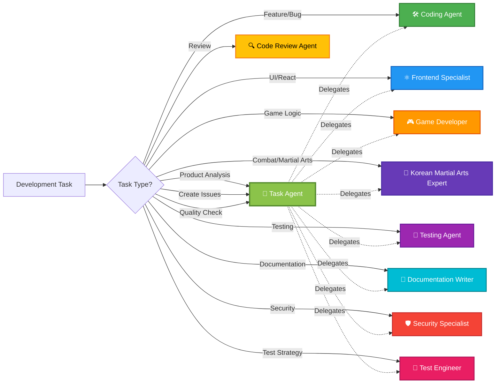
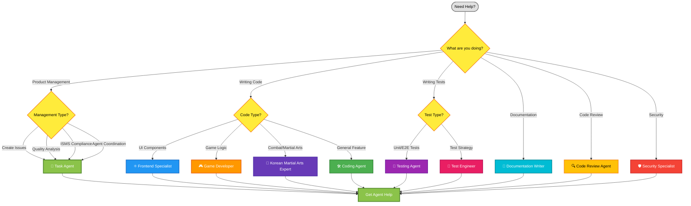

# 🤖 GitHub Copilot Custom Agents for Black Trigram (흑괘)

This directory contains specialized GitHub Copilot custom agent profiles for Black Trigram development. Each agent is an expert in a specific domain, providing focused assistance for particular development tasks.

## 🆕 Agent Skills System

**New in 2026:** Black Trigram now includes **[GitHub Copilot Agent Skills](../skills/README.md)** - strategic, high-level principles that are automatically enforced across all development work.

### Skills vs Agents

| **Skills** ([📚 View All](../skills/README.md)) | **Agents** (This Directory) |
|-----------|-----------|
| Strategic principles and rules | Task-specific implementers |
| Automatically activated by context | Explicitly invoked |
| Enforce standards and patterns | Execute specific workflows |
| High-level, declarative | Detailed, procedural |

**Example:**
- **Skill**: "All security changes must update SECURITY_ARCHITECTURE.md" ✅ Automatic
- **Agent**: "I will implement JWT authentication in `src/auth/jwt.ts`" 🤖 On-demand

### Available Skills (29 Total)

Black Trigram now ships **29 strategic skills** organized across Security & Compliance, Architecture & Documentation, Visual & Cultural, Testing & Quality, Performance, Three.js, Game Development, AI Governance, and Agentic Workflows. See the **[Skills catalog](../skills/README.md)** for the full list and activation triggers.

**Highlights (security & compliance core):**

1. **[security-architecture-validation](../skills/security-architecture-validation/SKILL.md)** — ISMS security-by-design enforcement
2. **[secure-development-lifecycle](../skills/secure-development-lifecycle/SKILL.md)** — all 7 SDLC phases + DevSecOps
3. **[isms-compliance-checking](../skills/isms-compliance-checking/SKILL.md)** — ISO 27001, NIST CSF 2.0, CIS v8.1
4. **[compliance-framework-alignment](../skills/compliance-framework-alignment/SKILL.md)** — multi-framework traceability
5. **[classification-framework-enforcement](../skills/classification-framework-enforcement/SKILL.md)** — C/I/A/P classification + BIA
6. **[open-source-governance](../skills/open-source-governance/SKILL.md)** — Hack23 Open Source Policy enforcement
7. **[threat-modeling-enforcement](../skills/threat-modeling-enforcement/SKILL.md)** — STRIDE + MITRE ATT&CK + attack trees
8. **[vulnerability-management](../skills/vulnerability-management/SKILL.md)** — CVE remediation SLAs, OSSF ≥ 8, SBOM
9. **[incident-response](../skills/incident-response/SKILL.md)** — severity SLAs, rotation, lessons learned
10. **[secrets-management](../skills/secrets-management/SKILL.md)** — credential hygiene, GitHub Secrets
11. **[data-protection](../skills/data-protection/SKILL.md)** — classification, TLS, CSP, SRI
12. **[input-validation](../skills/input-validation/SKILL.md)** — Zod / type guards at boundaries
13. **[risk-assessment-frameworks](../skills/risk-assessment-frameworks/SKILL.md)** — ISO 31000 / ID.RA
14. **[gdpr-compliance](../skills/gdpr-compliance/SKILL.md)** — GDPR / NIS2 / EU CRA
15. **[ai-governance](../skills/ai-governance/SKILL.md)** — EU AI Act, NIST AI RMF, AI transparency
16. **[github-agentic-workflows](../skills/github-agentic-workflows/SKILL.md)** — defense-in-depth workflow security

**Architecture & Docs:** c4-architecture-documentation · documentation-standards

**Quality & Testing:** testing-strategy-enforcement · code-quality-excellence · typescript-strict-patterns · accessibility-wcag-patterns

**Performance & Three.js:** performance-optimization · threejs-best-practices

**Game & Cultural:** game-development-patterns · korean-martial-arts-authenticity · 3d-combat-systems · audio-game-integration · korean-theming-standards

All agents leverage these skills for automatic quality enforcement. **[Learn more →](../skills/README.md)**

### 🔐 Hack23 ISMS Policy Integration (all agents reference these)

Every repo agent encodes links to the applicable Hack23 ISMS policies so that code changes, reviews, tests, and documentation trace back to a governed source of truth:

| Domain | Policy |
|---|---|
| Governance baseline | [Information Security Policy](https://github.com/Hack23/ISMS-PUBLIC/blob/main/Information_Security_Policy.md) |
| SDLC / secure coding | [Secure Development Policy](https://github.com/Hack23/ISMS-PUBLIC/blob/main/Secure_Development_Policy.md) |
| OSS supply chain | [Open Source Policy](https://github.com/Hack23/ISMS-PUBLIC/blob/main/Open_Source_Policy.md) |
| CVE response | [Vulnerability Management](https://github.com/Hack23/ISMS-PUBLIC/blob/main/Vulnerability_Management.md) |
| Crypto | [Cryptography Policy](https://github.com/Hack23/ISMS-PUBLIC/blob/main/Cryptography_Policy.md) |
| Access / identity | [Access Control Policy](https://github.com/Hack23/ISMS-PUBLIC/blob/main/Access_Control_Policy.md) |
| Incidents | [Incident Response Plan](https://github.com/Hack23/ISMS-PUBLIC/blob/main/Incident_Response_Plan.md) |
| Data handling | [Data Classification Policy](https://github.com/Hack23/ISMS-PUBLIC/blob/main/Data_Classification_Policy.md) |
| AI | [AI Governance Policy](https://github.com/Hack23/ISMS-PUBLIC/blob/main/AI_Policy.md) |
| Threat analysis | [Threat Modeling Policy](https://github.com/Hack23/ISMS-PUBLIC/blob/main/Threat_Modeling.md) |
| Change control | [Change Management](https://github.com/Hack23/ISMS-PUBLIC/blob/main/Change_Management.md) |
| Continuity / DR | [Business Continuity Plan](https://github.com/Hack23/ISMS-PUBLIC/blob/main/Business_Continuity_Plan.md) |
| Compliance | [Compliance Checklist](https://github.com/Hack23/ISMS-PUBLIC/blob/main/Compliance_Checklist.md) (ISO 27001 · NIST CSF 2.0 · CIS v8.1) |

## 🔑 Essential Context Files

All agents reference these key files to understand the project environment and configuration:

### 1. 🔧 Setup & Environment
**File**: `.github/workflows/copilot-setup-steps.yml`
- Node.js 26, npm, TypeScript toolchain
- Build and test environment setup
- Cache configuration for dependencies
- Workflow permissions (read/write access levels)

### 2. 🔌 MCP Server Configuration
**File**: `.github/copilot-mcp.json`
- **GitHub MCP**: Repository operations, issues, PRs, releases
- **Filesystem MCP**: Secure file access for the workspace
- **Git MCP**: Git operations and repository history
- **Memory MCP**: Conversation context between sessions
- **Playwright MCP**: Browser automation for UI testing
- **AWS MCP**: Cloud infrastructure operations (disabled by default)
- **Brave Search MCP**: Web search for documentation (disabled by default)

### 3. 📚 Project Context
**File**: `README.md` (root)
- Project overview and mission
- Korean martial arts philosophy (八卦 - Eight Trigrams)
- Technology stack (React 19, Three.js, TypeScript)
- Combat mechanics and player archetypes
- Development guidelines and documentation

## 📖 Quick Start

GitHub Copilot custom agents are AI assistants with specialized knowledge. When working with Black Trigram, select the agent that matches your current task for context-aware assistance following project patterns.

**📊 New: [Agent Capabilities Matrix](./AGENT_CAPABILITIES.md)** - Comprehensive guide to all agents, their capabilities, and coordination patterns.

## 🔧 Environment & Configuration

All agents have access to essential project configuration files that define the development environment, available tools, and project context:

### Essential Files

| File | Purpose | What Agents Find Here |
|------|---------|----------------------|
| **[`README.md`](/README.md)** | Main Project Context | Project overview, tech stack, ISMS compliance framework, combat mechanics, Korean martial arts philosophy |
| **[`.github/workflows/copilot-setup-steps.yml`](/.github/workflows/copilot-setup-steps.yml)** | Environment Setup | Node.js 26 configuration, npm dependencies, build/test commands, GitHub Actions permissions |
| **[`.github/copilot-mcp.json`](/.github/copilot-mcp.json)** | MCP Server Configuration | Available MCP servers (filesystem, github, git, memory, sequential-thinking, playwright, brave-search, aws), tool capabilities, integration patterns |

### MCP Servers Available

See [`.github/copilot-mcp.json`](../copilot-mcp.json) for the authoritative list. Repository-level agents do **not** embed MCP config in their frontmatter — session-level MCP applies uniformly. Core servers: **github** (Insiders with Copilot coding-agent tools), **filesystem**, **memory**, **sequential-thinking**, **playwright**.

### Development Environment

The setup workflow (`.github/workflows/copilot-setup-steps.yml`) defines:

- **Node.js Version**: 26 (current)
- **Package Manager**: npm with `npm ci` for reproducible builds
- **Build Tool**: Vite for fast development and optimized production builds
- **Test Frameworks**: Vitest (unit/integration), Cypress (E2E)
- **TypeScript**: Strict mode enabled for type safety

**Permissions Available in CI:**
```yaml
contents: read          # Read repository contents
actions: read          # Read workflow runs
attestations: read     # Read attestations
checks: read           # Read check runs
deployments: read      # Read deployment status
issues: write          # Create and update issues
models: read           # Read AI models (Copilot)
discussions: read      # Read discussions
pages: read            # Read GitHub Pages
pull-requests: write   # Create and update PRs
security-events: read  # Read security alerts
statuses: read         # Read commit statuses
```

## 📋 Agent Overview



## 🎯 Available Agents

### 🎯 [Task Agent](./task-agent.md)
**Primary Role:** Product Quality Orchestrator & Issue Manager

**When to Use:**
- ✅ Analyzing product quality holistically
- ✅ Creating GitHub issues with clear acceptance criteria
- ✅ Assigning work to appropriate specialized agents
- ✅ Ensuring ISMS compliance and security alignment
- ✅ Evaluating UI/UX against Korean theming standards
- ✅ Monitoring test coverage and quality metrics
- ✅ Performance analysis and optimization tracking

**Tools Available:** `["*"]` (all tools allowed — no MCP server config at repo level; session-level MCP from `.github/copilot-mcp.json` applies)

**MCP (session-level only):** GitHub, filesystem, memory, sequential-thinking, playwright — configured in `.github/copilot-mcp.json`, not in individual agent frontmatter

**Expertise:**
- Product management and issue orchestration
- Quality assurance across all dimensions
- UI/UX evaluation and accessibility
- ISMS alignment (ISO 27001, NIST CSF, CIS Controls, Information Security Policy)
- Performance monitoring (60fps, bundle size)
- Agent coordination and delegation
- GitHub issue creation and management
- Copilot coding agent orchestration with `base_ref`, `custom_instructions`, stacked PRs

---

### 🛠️ [Coding Agent](./coding-agent.md)
**Primary Role:** Full-Stack TypeScript/React/Three.js Development

**When to Use:**
- ✅ Implementing new game features
- ✅ Creating UI components with Korean theming
- ✅ Fixing bugs in React/Three.js code
- ✅ Refactoring existing code
- ✅ Integrating @react-three/fiber components
- ✅ Implementing combat mechanics

**Tools Available:** `["*"]` (all tools allowed)

**Expertise:**
- React + Three.js integration patterns
- Korean theming and bilingual text
- @react-three/fiber and @react-three/drei
- Combat system implementation
- Type-safe development with strict TypeScript

---

### ⚛️ [Frontend Specialist](./frontend-specialist.md)
**Primary Role:** React 19 & Strict TypeScript Expert

**When to Use:**
- ✅ Building type-safe React components
- ✅ Implementing React 19 features
- ✅ Component architecture design
- ✅ State management patterns
- ✅ React Testing Library tests
- ✅ Performance optimization

**Tools Available:** `["*"]` (all tools allowed)

**Expertise:**
- React 19 best practices
- Strict TypeScript configuration
- Component composition
- Testing with RTL
- Performance profiling

---

### 🎮 [Game Developer](./game-developer.md)
**Primary Role:** Three.js/@react-three/fiber Game Systems Engineer

**When to Use:**
- ✅ Implementing game loops
- ✅ Optimizing rendering (60fps target)
- ✅ Audio system integration
- ✅ Collision detection
- ✅ 3D scene and resource management
- ✅ Object pooling

**Tools Available:** `["*"]` (all tools allowed)

**Expertise:**
- Three.js / @react-three/fiber integration
- Game loop architecture
- Howler.js audio management
- Performance optimization
- WebGL rendering

---

### 🧪 [Testing Agent](./testing-agent.md)
**Primary Role:** Vitest & Cypress Testing Specialist

**When to Use:**
- ✅ Writing unit tests
- ✅ Creating integration tests
- ✅ Developing E2E tests with Cypress
- ✅ Debugging test failures
- ✅ Testing Three.js components
- ✅ Testing Korean UI elements

**Tools Available:** `["*"]` (all tools allowed)

**Expertise:**
- Vitest unit testing
- Cypress E2E testing
- Component testing
- Mock strategies
- Test coverage

---

### 🔬 [Test Engineer](./test-engineer.md)
**Primary Role:** Test Strategy & CI Integration Specialist

**When to Use:**
- ✅ Designing comprehensive test strategies
- ✅ Enforcing coverage standards (>90%)
- ✅ Integrating tests into CI/CD
- ✅ Setting up test parallelization
- ✅ Performance and accessibility testing
- ✅ Test metrics and reporting

**Tools Available:** `["*"]` (all tools allowed)

**Expertise:**
- Test suite architecture
- Coverage enforcement
- GitHub Actions integration
- Visual regression testing
- Mutation testing

---

### 📝 [Documentation Writer](./documentation-writer.md)
**Primary Role:** Technical Documentation Specialist

**When to Use:**
- ✅ Writing JSDoc/TSDoc comments
- ✅ Creating API documentation
- ✅ Writing user guides and tutorials
- ✅ Documenting Korean martial arts concepts
- ✅ Security policy documentation (SECURITY.md)
- ✅ Bilingual content (Korean/English)

**Tools Available:** `["*"]` (all tools allowed)

**Expertise:**
- Code documentation
- Technical writing
- Korean cultural context
- API references
- Security policies

---

### 🔍 [Code Review Agent](./code-review-agent.md)
**Primary Role:** Code Quality & Standards Reviewer

**When to Use:**
- ✅ Reviewing pull requests
- ✅ Checking code quality and standards
- ✅ Verifying Korean theming compliance
- ✅ Validating test coverage
- ✅ Security assessment
- ✅ Performance review

**Tools Available:** `["*"]` (all tools allowed; by convention this agent treats edits as suggestions)

**Expertise:**
- Code quality assessment
- Korean theming validation
- Testing coverage verification
- Security best practices
- Accessibility standards

---

### 🛡️ [Security Specialist](./security-specialist.md)
**Primary Role:** Supply Chain & Compliance Security Expert

**When to Use:**
- ✅ OSSF Scorecard compliance
- ✅ SBOM generation (CycloneDX)
- ✅ Vulnerability scanning
- ✅ License compliance checking
- ✅ Dependency security audits
- ✅ Security automation

**Tools Available:** `["*"]` (all tools allowed)

**Expertise:**
- Supply chain security
- OSSF best practices
- Software Bill of Materials
- License compliance
- Automated security workflows

---

## 🎨 Agent Selection Guide



## 🛠️ Tools Available to Agents

All agents have access to appropriate GitHub Copilot tools:

| Tool Category | Tools | Purpose |
|--------------|-------|---------|
| **File Operations** | `view`, `edit`, `create` | Read, modify, and create files |
| **Code Search** | `search_code` | Search codebase for patterns and references |
| **Shell Access** | `bash` | Execute build, test, and automation commands |
| **Agent Delegation** | `custom-agent` | Invoke other specialized agents |
| **Browser Automation** | `playwright-browser_snapshot` | Capture DOM state for testing |
| | `playwright-browser_take_screenshot` | Visual regression testing |
| | `playwright-browser_navigate` | Navigate to URLs for E2E testing |
| | `playwright-browser_click` | Interact with UI elements |
| | `playwright-browser_type` | Input text for testing |
| | `playwright-browser_evaluate` | Execute JavaScript in browser context |

### 🔌 MCP (Model Context Protocol) Servers

> **Important:** Repository-level agents (the ones in this directory) **do not embed MCP server configuration in their frontmatter**. MCP servers are configured once at the repository level in [`.github/copilot-mcp.json`](../copilot-mcp.json) and are available to **every** agent session. This keeps agent definitions focused on capability and prompt engineering.

Servers configured for Black Trigram sessions:

| MCP Server | Purpose | Operations |
|------------|---------|------------|
| **GitHub MCP** (Insiders) | Repository and issue management | Issues, PRs, Actions, Copilot coding agent tools (`assign_copilot_to_issue`, `create_pull_request_with_copilot` with `base_ref` / `custom_instructions` / `custom_agent`), `get_copilot_job_status` |
| **Filesystem MCP** | File-system operations | Read, list, search within allowed directories |
| **Memory MCP** | Cross-session memory | Entity/observation graph for persistent facts |
| **Sequential-thinking MCP** | Structured reasoning | Step-by-step problem decomposition |
| **Playwright MCP** | Browser automation | Navigate, screenshot, DOM interaction, network capture |

**Benefits of session-level MCP:**
- 🎯 Uniform capability across all agents (no drift)
- 🔐 Central secret management (PAT injected from environment)
- 🌐 Live browser automation for UI / E2E
- 🔄 Seamless Copilot coding-agent orchestration with Insiders experimental features
- 📊 Real-time GitHub metrics and history

### 🏗️ Agent Architecture Overview

All agents read Essential Context Files (`copilot-setup-steps.yml`, `copilot-mcp.json`, `README.md`) at session start and have access to File Operations and GitHub API. Task Agent additionally uses Browser Automation and AWS Operations.

### Tool Access by Agent

All repository-level agents declare `tools: ["*"]` in frontmatter — no per-agent tool restrictions. MCP capability is session-level (see [`.github/copilot-mcp.json`](../copilot-mcp.json)).

| Agent | Access Level | Notes |
|-------|-------------|-------|
| 🎯 Task Agent | `["*"]` | Orchestrator — leans on GitHub MCP Copilot coding-agent tools |
| 🛠️ Coding Agent | `["*"]` | General implementation |
| ⚛️ Frontend Specialist | `["*"]` | React 19 + strict TS |
| 🎮 Game Developer | `["*"]` | Three.js / R3F / physics / audio |
| 🧪 Testing Agent | `["*"]` | Vitest + Cypress + security tests |
| 🔬 Test Engineer | `["*"]` | Strategy + CI gates + SAST/DAST/SCA |
| 📝 Documentation Writer | `["*"]` | TSDoc + C4 + ISMS docs |
| 🔍 Code Review Agent | `["*"]` | By convention treats edits as suggestions |
| 🛡️ Security Specialist | `["*"]` | Supply chain + ISMS + vulnerability |
| 🥋 Korean Martial Arts Expert | `["*"]` | Authenticity + cultural accuracy |

## 🎯 Agent Development Guidelines
- Performance testing
- Accessibility testing

**Key Responsibilities:**
- Test suite organization
- Coverage threshold enforcement
- GitHub Actions integration
- Visual regression testing
- Test metrics and reporting
- Mutation testing

---

### 📚 [Documentation Writer](./documentation-writer.md)
**Specialization**: Technical Docs + Security Policies

**Use for:**
- TSDoc/JSDoc code documentation
- User guides and tutorials
- Security policy documentation
- API reference documentation
- Korean cultural context
- Bilingual content creation

**Key Responsibilities:**
- Comprehensive code documentation
- User guide creation
- Security policy writing (SECURITY.md)
- API reference generation
- Korean martial arts explanations
- Bilingual technical writing

---

### 🔍 [Code Review Agent](./code-review-agent.md)
**Specialization**: Code Quality & Standards

**Use for:**
- Reviewing pull requests
- Checking code quality
- Verifying Korean theming compliance
- Validating test coverage
- Ensuring accessibility
- Performance review

**Key Responsibilities:**
- Code quality assessment
- Korean theming compliance
- Testing coverage verification
- Performance review
- Security assessment
- Accessibility validation

---

### 🛡️ [Security Specialist](./security-specialist.md)
**Specialization**: Supply Chain + Compliance

**Use for:**
- Supply chain security
- OSSF Scorecard compliance
- SBOM generation
- License compliance
- Vulnerability management
- Security automation

**Key Responsibilities:**
- Dependency security scanning
- OSSF Scorecard optimization
- Software Bill of Materials (SBOM)
- License compatibility checking
- Automated security workflows
- Security policy enforcement

---

### 🥋 [Korean Martial Arts Expert](./korean-martial-arts-expert.md)
**Specialization**: Korean Martial Arts Combat Systems & Vital Point Targeting

**Use for:**
- Extending the 70 vital point system
- Implementing Hapkido, Taekwondo, Taekyon techniques
- Anatomical targeting accuracy
- Combat realism and applications
- Eight Trigram stance integration
- Player archetype combat specializations
- Korean martial arts authenticity
- Bilingual technique documentation

**Key Responsibilities:**
- Vital point system extension and maintenance
- Korean martial arts technique design
- Anatomical accuracy in targeting
- Combat effectiveness calculations
- Trigram stance technique mapping
- Archetype combat specialization
- Cultural authenticity and respect
- Bilingual Korean-English documentation

**Martial Arts Expertise:**
- 합기도 (Hapkido) - Joint locks, pressure points, throws
- 태권도 (Taekwondo) - High kicks, speed techniques, power strikes
- 택견 (Taekyon) - Fluid movements, sweeping kicks, rhythmic footwork
- 기타 한국 무술 - Ssireum, Kumdo, traditional Korean military arts

**Combat System Integration:**
- 70 anatomical target points across head, torso, and limbs
- Eight Trigram stance system (팔괘)
- Five player archetypes (무사, 암살자, 해커, 정보요원, 조직폭력배)
- Real combat applications with anatomical precision
- Realistic injury and incapacitation mechanics

## How to Use These Agents

### With GitHub Copilot Chat

When using GitHub Copilot in your IDE, you can reference these agents:

```
@workspace /explain this component following the patterns in .github/agents/coding-agent.md
```

```
@workspace Help me write tests for this component using patterns from .github/agents/testing-agent.md
```

### With GitHub Copilot Pull Requests

These agents help Copilot provide better code review feedback when reviewing PRs.

### With GitHub Copilot CLI

```bash
gh copilot suggest "Create a new combat component following .github/agents/coding-agent.md"
```

## Agent Development Guidelines

All agents should:

✅ Reference the main `.github/copilot-instructions.md` file
✅ Provide specific, actionable guidance
✅ Include code examples
✅ Follow the project's Korean theming requirements
✅ Emphasize testing and quality standards
✅ Be focused on their specific domain
✅ Include anti-patterns to avoid
✅ Provide checklists where applicable

## Relationship to Main Instructions

These agent files are **complementary** to the main `.github/copilot-instructions.md` file:

- **Main Instructions**: Comprehensive coding guidelines for all developers and Copilot
- **Agent Files**: Specialized, task-focused instructions for specific activities

**Always consult both:**
1. The agent file for specialized, task-specific guidance
2. The main instructions for comprehensive patterns and standards

## Korean Philosophy Integration

All agents respect Black Trigram's core philosophy:

**흑괘의 길을 걸어라** - _Walk the Path of the Black Trigram_

- Traditional Korean martial arts wisdom
- Modern interactive technology
- Cyberpunk Korean aesthetic
- Bilingual support (Korean | English)
- Cultural authenticity and respect

## Updating Agents

When updating agent instructions:

1. Ensure consistency with main `.github/copilot-instructions.md`
2. Add relevant code examples
3. Update checklists and anti-patterns
4. Test with actual Copilot interactions
5. Keep focus on the agent's specialization
6. Maintain Korean cultural context

## Contributing

When adding new agents:

1. Identify a clear, focused specialization
2. Create comprehensive instructions
3. Include practical examples
4. Add to this README
5. Link to related documentation
6. Ensure Korean theming integration

## Success Metrics

Effective agents should:

✅ Reduce development time
✅ Improve code quality
✅ Ensure consistent patterns
✅ Maintain Korean theming
✅ Increase test coverage
✅ Enhance documentation quality
✅ Improve security posture
✅ Optimize performance

## 🎯 Using the Task Agent for Product Management

The Task Agent is your entry point for comprehensive product quality management. Use it for quality analysis, issue creation, ISMS compliance checks, UI/UX audits, performance reviews, and agent coordination. See [task-agent.md](./task-agent.md) for full details.

## Support

- Review `.github/copilot-instructions.md` for comprehensive guidelines
- Check existing codebase for established patterns
- Consult game design docs: `game-design.md`, `COMBAT_ARCHITECTURE.md`
- See architectural docs: `ARCHITECTURE.md`

---

**Project**: Black Trigram (흑괘)
**Description**: A realistic combat simulator inspired by Korean martial arts
**Tech Stack**: React, TypeScript, Three.js, Vite, Vitest, Cypress

**흑괘의 길을 걸어라** - _Walk the Path of the Black Trigram_
