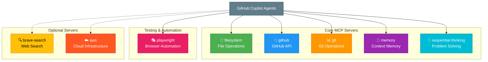
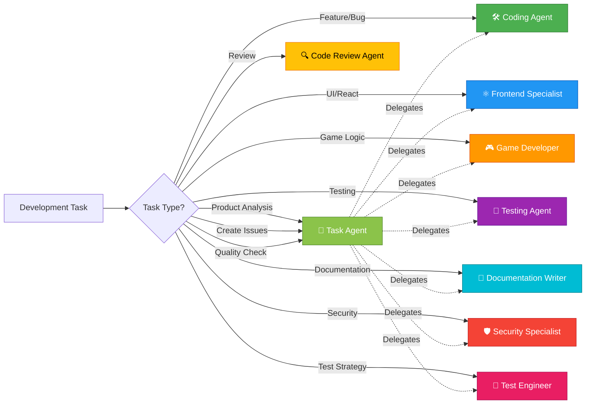
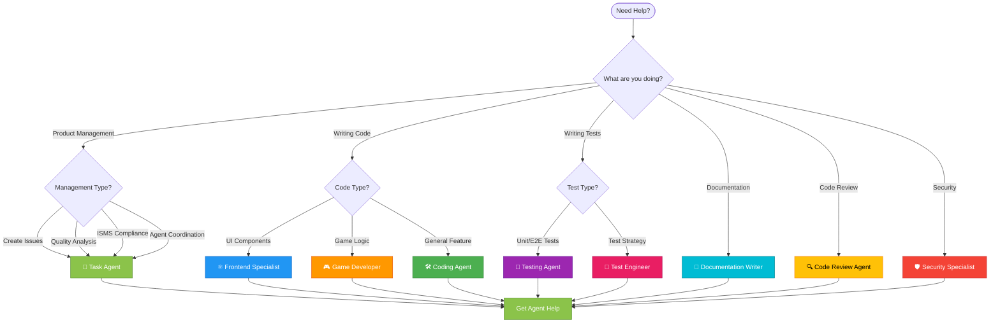

# 🤖 GitHub Copilot Custom Agents for Black Trigram (흑괘)

This directory contains specialized GitHub Copilot custom agent profiles for Black Trigram development. Each agent is an expert in a specific domain, providing focused assistance for particular development tasks.

## 📖 Quick Start

GitHub Copilot custom agents are AI assistants with specialized knowledge. When working with Black Trigram, select the agent that matches your current task for context-aware assistance following project patterns.

**📊 New: [Agent Capabilities Matrix](./AGENT_CAPABILITIES.md)** - Comprehensive guide to all agents, their capabilities, and coordination patterns.

## 🔧 Environment & Configuration

All agents have access to essential project configuration files that define the development environment, available tools, and project context:

### Essential Files

| File | Purpose | What Agents Find Here |
|------|---------|----------------------|
| **[`README.md`](/README.md)** | Main Project Context | Project overview, tech stack, ISMS compliance framework, combat mechanics, Korean martial arts philosophy |
| **[`.github/workflows/copilot-setup-steps.yml`](/.github/workflows/copilot-setup-steps.yml)** | Environment Setup | Node.js 24 configuration, npm dependencies, build/test commands, GitHub Actions permissions |
| **[`.github/copilot-mcp.json`](/.github/copilot-mcp.json)** | MCP Server Configuration | Available MCP servers (filesystem, github, git, memory, sequential-thinking, playwright, brave-search, aws), tool capabilities, integration patterns |

### MCP Servers Available



### Development Environment

The setup workflow (`.github/workflows/copilot-setup-steps.yml`) defines:

- **Node.js Version**: 24 (latest LTS)
- **Package Manager**: npm with `npm ci` for reproducible builds
- **Build Tool**: Vite for fast development and optimized production builds
- **Test Frameworks**: Vitest (unit/integration), Cypress (E2E)
- **TypeScript**: Strict mode enabled for type safety

**Permissions Available in CI:**
```yaml
contents: read          # Read repository contents
actions: read          # Read workflow runs
attestations: read     # Read attestations
checks: read           # Read check runs
deployments: read      # Read deployment status
issues: write          # Create and update issues
models: read           # Read AI models (Copilot)
discussions: read      # Read discussions
pages: read            # Read GitHub Pages
pull-requests: write   # Create and update PRs
security-events: read  # Read security alerts
statuses: read         # Read commit statuses
```

## 📋 Agent Overview



## 🎯 Available Agents

### 🎯 [Task Agent](./task-agent.md)
**Primary Role:** Product Quality Orchestrator & Issue Manager

**When to Use:**
- ✅ Analyzing product quality holistically
- ✅ Creating GitHub issues with clear acceptance criteria
- ✅ Assigning work to appropriate specialized agents
- ✅ Ensuring ISMS compliance and security alignment
- ✅ Evaluating UI/UX against Korean theming standards
- ✅ Monitoring test coverage and quality metrics
- ✅ Performance analysis and optimization tracking

**Tools Available:** `view`, `edit`, `create`, `search_code`, `bash`, `custom-agent`

**MCP Servers:** GitHub, Playwright, AWS

**Expertise:**
- Product management and issue orchestration
- Quality assurance across all dimensions
- UI/UX evaluation and accessibility
- ISMS alignment (ISO 27001, NIST CSF, CIS Controls)
- Performance monitoring (60fps, bundle size)
- Agent coordination and delegation
- GitHub issue creation and management

---

### 🛠️ [Coding Agent](./coding-agent.md)
**Primary Role:** Full-Stack TypeScript/React/PixiJS Development

**When to Use:**
- ✅ Implementing new game features
- ✅ Creating UI components with Korean theming
- ✅ Fixing bugs in React/PixiJS code
- ✅ Refactoring existing code
- ✅ Integrating @pixi/layout system
- ✅ Implementing combat mechanics

**Tools Available:** `view`, `edit`, `create`, `search_code`, `bash`, `playwright-browser_*`

**Expertise:**
- React + PixiJS integration patterns
- Korean theming and bilingual text
- Layout system (@pixi/layout)
- Combat system implementation
- Type-safe development with strict TypeScript

---

### ⚛️ [Frontend Specialist](./frontend-specialist.md)
**Primary Role:** React 19 & Strict TypeScript Expert

**When to Use:**
- ✅ Building type-safe React components
- ✅ Implementing React 19 features
- ✅ Component architecture design
- ✅ State management patterns
- ✅ React Testing Library tests
- ✅ Performance optimization

**Tools Available:** `view`, `edit`, `create`, `search_code`, `bash`, `playwright-browser_*`

**Expertise:**
- React 19 best practices
- Strict TypeScript configuration
- Component composition
- Testing with RTL
- Performance profiling

---

### 🎮 [Game Developer](./game-developer.md)
**Primary Role:** PixiJS 8.x Game Systems Engineer

**When to Use:**
- ✅ Implementing game loops
- ✅ Optimizing rendering (60fps target)
- ✅ Audio system integration
- ✅ Collision detection
- ✅ Texture and resource management
- ✅ Object pooling

**Tools Available:** `view`, `edit`, `create`, `search_code`, `bash`, `playwright-browser_*`

**Expertise:**
- PixiJS v8 integration
- Game loop architecture
- Howler.js audio management
- Performance optimization
- WebGL rendering

---

### 🧪 [Testing Agent](./testing-agent.md)
**Primary Role:** Vitest & Cypress Testing Specialist

**When to Use:**
- ✅ Writing unit tests
- ✅ Creating integration tests
- ✅ Developing E2E tests with Cypress
- ✅ Debugging test failures
- ✅ Testing PixiJS components
- ✅ Testing Korean UI elements

**Tools Available:** `view`, `edit`, `create`, `bash`, `playwright-browser_*`

**Expertise:**
- Vitest unit testing
- Cypress E2E testing
- Component testing
- Mock strategies
- Test coverage

---

### 🔬 [Test Engineer](./test-engineer.md)
**Primary Role:** Test Strategy & CI Integration Specialist

**When to Use:**
- ✅ Designing comprehensive test strategies
- ✅ Enforcing coverage standards (>90%)
- ✅ Integrating tests into CI/CD
- ✅ Setting up test parallelization
- ✅ Performance and accessibility testing
- ✅ Test metrics and reporting

**Tools Available:** `view`, `edit`, `create`, `bash`, `search_code`, `playwright-browser_*`

**Expertise:**
- Test suite architecture
- Coverage enforcement
- GitHub Actions integration
- Visual regression testing
- Mutation testing

---

### 📝 [Documentation Writer](./documentation-writer.md)
**Primary Role:** Technical Documentation Specialist

**When to Use:**
- ✅ Writing JSDoc/TSDoc comments
- ✅ Creating API documentation
- ✅ Writing user guides and tutorials
- ✅ Documenting Korean martial arts concepts
- ✅ Security policy documentation (SECURITY.md)
- ✅ Bilingual content (Korean/English)

**Tools Available:** `view`, `edit`, `create`, `search_code`, `playwright-browser_*`

**Expertise:**
- Code documentation
- Technical writing
- Korean cultural context
- API references
- Security policies

---

### 🔍 [Code Review Agent](./code-review-agent.md)
**Primary Role:** Code Quality & Standards Reviewer

**When to Use:**
- ✅ Reviewing pull requests
- ✅ Checking code quality and standards
- ✅ Verifying Korean theming compliance
- ✅ Validating test coverage
- ✅ Security assessment
- ✅ Performance review

**Tools Available:** `view`, `search_code`, `playwright-browser_*` (read-only)

**Expertise:**
- Code quality assessment
- Korean theming validation
- Testing coverage verification
- Security best practices
- Accessibility standards

---

### 🛡️ [Security Specialist](./security-specialist.md)
**Primary Role:** Supply Chain & Compliance Security Expert

**When to Use:**
- ✅ OSSF Scorecard compliance
- ✅ SBOM generation (CycloneDX)
- ✅ Vulnerability scanning
- ✅ License compliance checking
- ✅ Dependency security audits
- ✅ Security automation

**Tools Available:** `view`, `edit`, `create`, `bash`, `search_code`, `playwright-browser_*`

**Expertise:**
- Supply chain security
- OSSF best practices
- Software Bill of Materials
- License compliance
- Automated security workflows

---

## 🎨 Agent Selection Guide



## 🛠️ Tools Available to Agents

All agents have access to appropriate GitHub Copilot tools:

| Tool Category | Tools | Purpose |
|--------------|-------|---------|
| **File Operations** | `view`, `edit`, `create` | Read, modify, and create files |
| **Code Search** | `search_code` | Search codebase for patterns and references |
| **Shell Access** | `bash` | Execute build, test, and automation commands |
| **Agent Delegation** | `custom-agent` | Invoke other specialized agents |
| **Browser Automation** | `playwright-browser_snapshot` | Capture DOM state for testing |
| | `playwright-browser_take_screenshot` | Visual regression testing |
| | `playwright-browser_navigate` | Navigate to URLs for E2E testing |
| | `playwright-browser_click` | Interact with UI elements |
| | `playwright-browser_type` | Input text for testing |
| | `playwright-browser_evaluate` | Execute JavaScript in browser context |

### 🔌 MCP (Model Context Protocol) Servers

The Task Agent has access to specialized MCP servers for enhanced capabilities:

| MCP Server | Purpose | Operations |
|------------|---------|------------|
| **GitHub MCP** | Repository and issue management | Create/update issues, search code, manage PRs, releases |
| **Playwright MCP** | Browser automation and UI testing | Navigate, screenshot, DOM analysis, interaction testing |
| **AWS MCP** | Cloud infrastructure operations | Infrastructure monitoring, deployment validation, cost analysis |

**Benefits of MCP Integration:**
- 🎯 Direct GitHub API access for issue creation and management
- 🌐 Live browser automation for UI/UX testing
- ☁️ Cloud infrastructure insights and deployment validation
- 🔄 Seamless integration with existing workflows
- 📊 Real-time quality metrics and analysis

### Tool Access by Agent

```mermaid
graph TD
    subgraph "Orchestration Agent"
        TaskAgent[🎯 Task Agent]
    end
    
    subgraph "Read-Only Agents"
        Review[🔍 Code Review Agent]
    end
    
    subgraph "Documentation Agents"
        Docs[📝 Documentation Writer]
    end
    
    subgraph "Development Agents"
        Coding[🛠️ Coding Agent]
        Frontend[⚛️ Frontend Specialist]
        Game[🎮 Game Developer]
    end
    
    subgraph "Testing Agents"
        Testing[🧪 Testing Agent]
        TestEng[🔬 Test Engineer]
    end
    
    subgraph "Security Agents"
        Security[🛡️ Security Specialist]
    end
    
    TaskAgent --> MCPTools[view + edit + create + search + bash + custom-agent<br/>+ GitHub MCP + Playwright MCP + AWS MCP]
    Review --> ViewSearch[view + search_code + playwright-browser_*]
    Docs --> ViewEdit[view + edit + create + search_code + playwright-browser_*]
    Coding --> FullTools[All Tools]
    Frontend --> FullTools
    Game --> FullTools
    Testing --> FullTools
    TestEng --> FullTools
    Security --> FullTools
    
    style TaskAgent fill:#8BC34A,stroke:#558B2F,color:#fff
    style Review fill:#FFC107,stroke:#F57F17,color:#000
    style Docs fill:#00BCD4,stroke:#00838F,color:#fff
    style Coding fill:#4CAF50,stroke:#2E7D32,color:#fff
    style Frontend fill:#2196F3,stroke:#1565C0,color:#fff
    style Game fill:#FF9800,stroke:#E65100,color:#fff
    style Testing fill:#9C27B0,stroke:#6A1B9A,color:#fff
    style TestEng fill:#E91E63,stroke:#AD1457,color:#fff
    style Security fill:#F44336,stroke:#C62828,color:#fff
```



## 🎯 Agent Development Guidelines
- Performance testing
- Accessibility testing

**Key Responsibilities:**
- Test suite organization
- Coverage threshold enforcement
- GitHub Actions integration
- Visual regression testing
- Test metrics and reporting
- Mutation testing

---

### 📚 [Documentation Writer](./documentation-writer.md)
**Specialization**: Technical Docs + Security Policies

**Use for:**
- TSDoc/JSDoc code documentation
- User guides and tutorials
- Security policy documentation
- API reference documentation
- Korean cultural context
- Bilingual content creation

**Key Responsibilities:**
- Comprehensive code documentation
- User guide creation
- Security policy writing (SECURITY.md)
- API reference generation
- Korean martial arts explanations
- Bilingual technical writing

---

### 🔍 [Code Review Agent](./code-review-agent.md)
**Specialization**: Code Quality & Standards

**Use for:**
- Reviewing pull requests
- Checking code quality
- Verifying Korean theming compliance
- Validating test coverage
- Ensuring accessibility
- Performance review

**Key Responsibilities:**
- Code quality assessment
- Korean theming compliance
- Testing coverage verification
- Performance review
- Security assessment
- Accessibility validation

---

### 🛡️ [Security Specialist](./security-specialist.md)
**Specialization**: Supply Chain + Compliance

**Use for:**
- Supply chain security
- OSSF Scorecard compliance
- SBOM generation
- License compliance
- Vulnerability management
- Security automation

**Key Responsibilities:**
- Dependency security scanning
- OSSF Scorecard optimization
- Software Bill of Materials (SBOM)
- License compatibility checking
- Automated security workflows
- Security policy enforcement

## How to Use These Agents

### With GitHub Copilot Chat

When using GitHub Copilot in your IDE, you can reference these agents:

```
@workspace /explain this component following the patterns in .github/agents/coding-agent.md
```

```
@workspace Help me write tests for this component using patterns from .github/agents/testing-agent.md
```

### With GitHub Copilot Pull Requests

These agents help Copilot provide better code review feedback when reviewing PRs.

### With GitHub Copilot CLI

```bash
gh copilot suggest "Create a new combat component following .github/agents/coding-agent.md"
```

## Agent Development Guidelines

All agents should:

✅ Reference the main `.github/copilot-instructions.md` file
✅ Provide specific, actionable guidance
✅ Include code examples
✅ Follow the project's Korean theming requirements
✅ Emphasize testing and quality standards
✅ Be focused on their specific domain
✅ Include anti-patterns to avoid
✅ Provide checklists where applicable

## Relationship to Main Instructions

These agent files are **complementary** to the main `.github/copilot-instructions.md` file:

- **Main Instructions**: Comprehensive coding guidelines for all developers and Copilot
- **Agent Files**: Specialized, task-focused instructions for specific activities

**Always consult both:**
1. The agent file for specialized, task-specific guidance
2. The main instructions for comprehensive patterns and standards

## Korean Philosophy Integration

All agents respect Black Trigram's core philosophy:

**흑괘의 길을 걸어라** - _Walk the Path of the Black Trigram_

- Traditional Korean martial arts wisdom
- Modern interactive technology
- Cyberpunk Korean aesthetic
- Bilingual support (Korean | English)
- Cultural authenticity and respect

## Updating Agents

When updating agent instructions:

1. Ensure consistency with main `.github/copilot-instructions.md`
2. Add relevant code examples
3. Update checklists and anti-patterns
4. Test with actual Copilot interactions
5. Keep focus on the agent's specialization
6. Maintain Korean cultural context

## Contributing

When adding new agents:

1. Identify a clear, focused specialization
2. Create comprehensive instructions
3. Include practical examples
4. Add to this README
5. Link to related documentation
6. Ensure Korean theming integration

## Success Metrics

Effective agents should:

✅ Reduce development time
✅ Improve code quality
✅ Ensure consistent patterns
✅ Maintain Korean theming
✅ Increase test coverage
✅ Enhance documentation quality
✅ Improve security posture
✅ Optimize performance

## 🎯 Using the Task Agent for Product Management

The Task Agent is your entry point for comprehensive product quality management:

### When to Invoke Task Agent

**Use Task Agent for:**
- 📊 **Quality Analysis**: "Analyze the current state of Black Trigram and identify areas for improvement"
- 📝 **Issue Creation**: "Create issues for missing test coverage in combat systems"
- 🔐 **ISMS Compliance**: "Check ISMS alignment and create issues for gaps"
- 🎨 **UI/UX Audit**: "Evaluate UI/UX against Korean theming standards"
- ⚡ **Performance Review**: "Analyze bundle size and create optimization issues"
- 🤝 **Agent Coordination**: "Delegate the security issues to the appropriate agents"

### Task Agent Workflow Example

```bash
# 1. Comprehensive Analysis
@task-agent "Analyze Black Trigram holistically and identify improvement areas 
across product quality, UI/UX, security, and ISMS compliance"

# 2. Issue Creation
# Task Agent will create GitHub issues with:
# - Clear titles and descriptions
# - Specific acceptance criteria
# - ISMS policy references
# - Appropriate labels and priorities
# - Suggested agent assignments

# 3. Agent Delegation
# Task Agent will recommend:
# - @security-specialist for vulnerability issues
# - @frontend-specialist for UI/UX issues
# - @test-engineer for coverage issues
# - @documentation-writer for docs gaps

# 4. Follow-up
# Track created issues and monitor progress
```

### Example Task Agent Requests

**Product Quality:**
```
@task-agent "Review game-design.md and create issues for unimplemented features"
```

**UI/UX Evaluation:**
```
@task-agent "Test the application with Playwright and create issues for 
Korean font rendering and responsive design problems"
```

**ISMS Compliance:**
```
@task-agent "Review all security documentation and create issues for missing 
ISMS policy references, focusing on SECURITY_ARCHITECTURE.md"
```

**Performance Analysis:**
```
@task-agent "Analyze bundle size, identify heavy dependencies, and create 
optimization issues with specific recommendations"
```

**Test Coverage:**
```
@task-agent "Identify areas with <90% test coverage and create issues with 
specific test scenarios needed"
```

## Support

For questions or issues:

- Review `.github/copilot-instructions.md` for comprehensive guidelines
- Check existing codebase for established patterns
- Consult game design docs: `game-design.md`, `COMBAT_ARCHITECTURE.md`
- See architectural docs: `ARCHITECTURE.md`

---

**Project**: Black Trigram (흑괘)
**Description**: A realistic 2D precision combat game inspired by Korean martial arts
**Tech Stack**: React, TypeScript, PixiJS, Vite, Vitest, Cypress

**흑괘의 길을 걸어라** - _Walk the Path of the Black Trigram_
