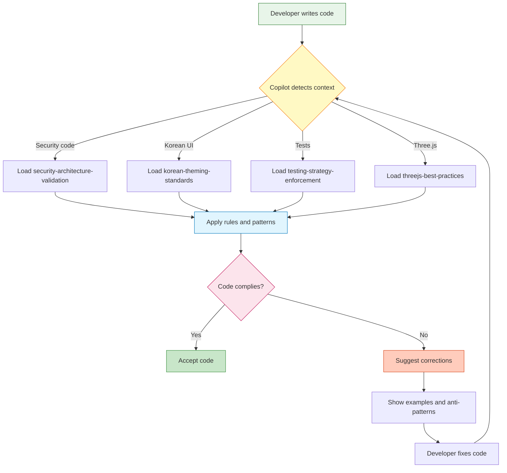
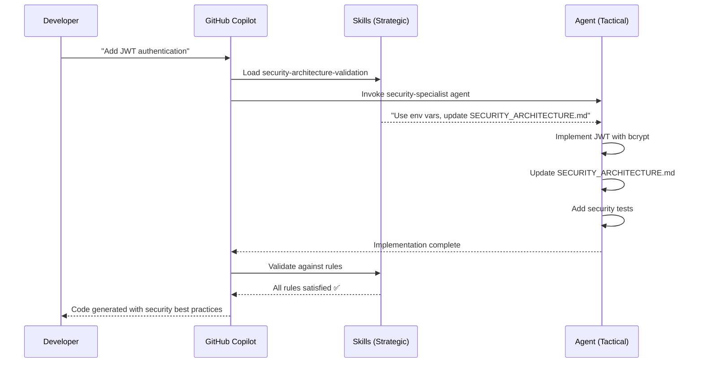

# 🎯 GitHub Copilot Agent Skills for Black Trigram (흑괘)

## What Are Agent Skills?

**Agent Skills** are specialized, reusable instructions that GitHub Copilot automatically loads to enforce project-specific standards, patterns, and best practices. Unlike agents (which handle specific tasks), skills are **strategic, high-level principles** that guide all development work.

### Skills vs Agents

| **Skills** | **Agents** |
|-----------|-----------|
| Strategic principles and rules | Task-specific implementers |
| Automatically activated by context | Explicitly invoked |
| Enforce standards and patterns | Execute specific workflows |
| High-level, declarative | Detailed, procedural |
| Focus on "what" and "why" | Focus on "how" |

**Example:**
- **Skill**: "All security changes must update SECURITY_ARCHITECTURE.md"
- **Agent**: "I will implement JWT authentication in `src/auth/jwt.ts`"

---

## 📚 Available Skills

Black Trigram includes **14 comprehensive skills** organized by domain:

### 🔐 Security & Compliance

#### 1. [secure-development-lifecycle](./secure-development-lifecycle/SKILL.md)
**Purpose**: Enforce comprehensive Secure Development Lifecycle (SDLC) practices for all phases from requirements to retirement

**Key Rules:**
- All 7 SDLC phases completed (Requirements, Design, Implementation, Testing, Deployment, Maintenance, Retirement)
- Threat modeling (STRIDE) required for all new features
- OWASP Top 10 2021 and CWE Top 25 prevention controls mandatory
- Security test coverage ≥90% with security-specific test cases
- CodeQL SAST, npm audit, OSSF Scorecard (≥7.0) must pass
- DevSecOps automation: CI/CD security scanning, SBOM generation, signed commits
- Supply chain security: OSSF Scorecard, SLSA Level 3, CycloneDX/SPDX SBOM
- Security code review checklist required for all PRs
- Input validation with Zod schemas mandatory
- Secrets management (AWS Secrets Manager, no hardcoding)
- Vulnerability management with SLA-based patching
- Incident response integration with lessons learned

**Triggers:**
- Developing new features or components
- Reviewing pull requests and code changes
- Planning deployments or releases
- Configuring CI/CD pipelines and automation
- Writing or updating security documentation
- Implementing authentication, authorization, or cryptography
- Conducting security assessments or threat modeling
- Managing dependencies or supply chain
- Refactoring or maintaining existing code
- Decommissioning features or systems

**Compliance:** ISO 27001:2022 (A.14.1, A.14.2, A.12.6, A.8.24), NIST CSF 2.0 (ID.RA, PR.DS, PR.IP, DE.CM, RS.MA, GV.SC), CIS Controls v8.1 (2, 3, 4, 7, 16, 18)

**Reference**: [Hack23 ISMS Secure Development Policy](https://github.com/Hack23/ISMS-PUBLIC/blob/main/Secure_Development_Policy.md) (95KB comprehensive policy)

---

#### 2. [security-architecture-validation](./security-architecture-validation/SKILL.md)
**Purpose**: Enforce Hack23 ISMS security-by-design principles

**Key Rules:**
- All security changes must update SECURITY_ARCHITECTURE.md
- No hard-coded secrets (use environment variables)
- All inputs must be validated and outputs encoded
- Security tests required for security controls
- ISMS policy references required

**Triggers:**
- Authentication/authorization code
- Data encryption or protection
- External API integration
- Security documentation updates

**Compliance:** ISO 27001, NIST CSF 2.0, CIS Controls v8.1

---

#### 3. [isms-compliance-checking](./isms-compliance-checking/SKILL.md)
**Purpose**: Validate all code against Hack23 ISMS framework

**Key Rules:**
- ISO 27001:2022 Annex A control mapping required
- NIST CSF 2.0 all 6 functions (GOVERN, IDENTIFY, PROTECT, DETECT, RESPOND, RECOVER)
- CIS Controls v8.1 alignment (18 controls)
- GDPR, NIS2, EU Cyber Resilience Act compliance
- OSSF Scorecard >8.0, SLSA, SBOM requirements

**Triggers:**
- Security policy updates
- Compliance documentation
- Supply chain security
- Regulatory requirements

**Compliance:** ISO 27001:2022, NIST CSF 2.0, CIS Controls v8.1, GDPR, NIS2, EU CRA

---

#### 4. [compliance-framework-alignment](./compliance-framework-alignment/SKILL.md)
**Purpose**: Enforce unified compliance across ISO 27001:2022, NIST CSF 2.0, and CIS Controls v8.1

**Key Rules:**
- All security features must map to all three frameworks simultaneously
- Evidence must be verifiable and current (within 90 days)
- Compliance documentation updated with code changes
- Multi-framework traceability required (ISO → NIST → CIS → Implementation)
- Implementation Groups match organizational size (IG1 focus for single-person org)

**Triggers:**
- Implementing security controls or features
- Creating/modifying security documentation
- Conducting security reviews or audits
- Adding compliance evidence
- Updating architecture or data models

**Compliance:** ISO 27001:2022 (93 controls), NIST CSF 2.0 (6 functions), CIS Controls v8.1 (18 controls)

---

#### 5. [classification-framework-enforcement](./classification-framework-enforcement/SKILL.md)
**Purpose**: Enforce comprehensive classification of assets across security, business impact, and recovery objectives

**Key Rules:**
- All assets classified with confidentiality, integrity, availability, privacy levels
- Business Impact Analysis (BIA) required for high-criticality assets (financial, operational, reputational, regulatory)
- Recovery objectives (RTO/RPO) defined for high availability systems
- Defense-in-depth controls match classification levels
- Privacy classification follows GDPR requirements (Art. 4, Art. 9)
- Classification reviewed quarterly (every 90 days)
- Project type determines baseline security levels

**Triggers:**
- Implementing new features or systems
- Handling sensitive data or user information
- Designing security controls or access restrictions
- Planning disaster recovery or business continuity
- Classifying project assets or repositories
- Conducting risk assessments or impact analysis
- Defining RTO/RPO requirements

**Compliance:** ISO 27001:2022 (A.5.12, A.5.13, A.8.6, A.17.1), NIST CSF 2.0 (ID.AM-05, ID.RA-01, PR.DS-01/02, RC.RP-01), CIS Controls v8.1 (1, 2, 3, 11, 12)

---

### 🏗️ Architecture & Documentation

#### 6. [c4-architecture-documentation](./c4-architecture-documentation/SKILL.md)
**Purpose**: Enforce C4 Architecture Model standards

**Key Rules:**
- Maintain 12 architecture documents (6 current + 6 future)
- All C4 diagrams must use Mermaid syntax
- Quantified metrics required (X/Y complete, N% coverage)
- Architecture changes must update relevant docs
- Korean martial arts context integrated

**Required Docs:**
- ARCHITECTURE.md, DATA_MODEL.md, FLOWCHART.md
- STATEDIAGRAM.md, MINDMAP.md, SWOT.md
- FUTURE_* versions of all above

**Triggers:**
- Architecture changes
- Data model updates
- System design work
- Documentation updates

**Compliance:** ISO 27001 A.5.1, A.18.1, A.18.2

---

### 🎨 Visual & Cultural Standards

#### 7. [korean-theming-standards](./korean-theming-standards/SKILL.md)
**Purpose**: Enforce Korean cyberpunk aesthetic and cultural authenticity

**Key Rules:**
- Use KOREAN_COLORS constants for all colors
- Bilingual text format: `Korean | English`
- FONT_FAMILY.KOREAN for Korean text
- Authentic Eight Trigram symbols (☰☱☲☳☴☵☶☷)
- WCAG 2.1 AA contrast requirements (4.5:1)

**Triggers:**
- UI components
- Text content
- Color usage
- Korean martial arts content
- Cultural references

**Standards:** WCAG 2.1 AA, Korean typography, I Ching authenticity

---

### 🧪 Testing & Quality

#### 8. [testing-strategy-enforcement](./testing-strategy-enforcement/SKILL.md)
**Purpose**: Enforce comprehensive testing standards

**Key Rules:**
- >90% test coverage (line, function, branch, statement)
- Unit tests (Vitest) for all business logic
- E2E tests (Cypress) for user workflows
- Three.js component testing patterns
- Performance tests (<5ms, 60fps targets)
- Accessibility tests (WCAG 2.1 AA)

**Triggers:**
- New features
- Bug fixes
- Refactoring
- Performance optimizations

**Standards:** >90% coverage, WCAG 2.1 AA, 60fps performance

---

### ⚡ Performance & Optimization

#### 9. [performance-optimization](./performance-optimization/SKILL.md)
**Purpose**: Enforce 60fps rendering and optimal bundle size

**Key Rules:**
- 60fps target for all Three.js rendering
- Bundle size: <500KB initial, <2MB total
- Lighthouse performance score >90
- Memory leak prevention
- Efficient Three.js patterns (instancing, LOD, culling)

**Triggers:**
- Three.js rendering code
- Bundle size increases
- Performance regressions
- Memory leaks

**Metrics:** 60fps, <500KB initial, Lighthouse >90

---

### 🌐 Three.js Best Practices

#### 10. [threejs-best-practices](./threejs-best-practices/SKILL.md)
**Purpose**: Enforce @react-three/fiber patterns and Three.js optimization

**Key Rules:**
- Use @react-three/fiber and @react-three/drei
- Proper resource cleanup (dispose patterns)
- Html overlay vs 3D mesh decision guide
- Performance optimization (useFrame, useMemo, instancing)
- Korean-themed materials and lighting

**Triggers:**
- Three.js component creation
- 3D scene setup
- Performance issues
- Resource management

**Standards:** @react-three/fiber, React 19, Three.js r170+

---

### 🎮 Game Development & Combat

#### 11. [game-development-patterns](./game-development-patterns/SKILL.md)
**Purpose**: Enforce game development best practices for Black Trigram

**Key Rules:**
- Game loop with clamped delta (MAX_DELTA = 1/30)
- Fixed timestep for deterministic physics (60 Hz)
- State machine architecture for game flow
- Layered combat system (state, actions, rules, events)
- Delta-time independent animations

**Triggers:**
- Implementing game loops with `useFrame`
- Creating combat systems or state machines
- Managing game state (player, enemies, combat flow)
- Working with fixed timesteps or delta time
- Debugging timing or synchronization issues

**Standards:** 60fps, deterministic combat, proper state machines

---

#### 12. [korean-martial-arts-authenticity](./korean-martial-arts-authenticity/SKILL.md)
**Purpose**: Enforce authentic Korean martial arts systems (11 arts) with Dark Ops combat applications

**Key Rules:**
- All 11 Korean martial arts with proper terminology (Hapkido, Taekwondo, Taekyon, Kuk Sool Won, Tang Soo Do, Hwa Rang Do, Gumdo, Ssireum, Subak, Yudo, Gongkwon Yusul)
- Accurate Eight Trigram system (팔괘) with correct symbols and philosophy
- 70 vital points (급소) with anatomical precision
- Proper Korean terminology (Revised Romanization standard)
- Cultural context and educational tooltips
- 5 Korean special forces units with tactical integration
- Dark Ops combat applications (silent_kill, suppression, interrogation, mobility_denial)
- Equipment-enhanced combat (night vision +15%, cyber +25%)

**Triggers:**
- Implementing Eight Trigram stance system
- Adding vital point targeting
- Creating combat techniques from any Korean martial art
- Writing Korean martial arts terminology
- Implementing Dark Ops special forces techniques
- Adding tactical combat applications
- Integrating equipment-enhanced martial arts

**Standards:** Anatomical accuracy, cultural respect, I Ching authenticity, tactical realism, 11 martial arts coverage

---

#### 13. [3d-combat-systems](./3d-combat-systems/SKILL.md)
**Purpose**: Enforce 3D physics-based combat patterns for Black Trigram

**Key Rules:**
- Rapier physics integration for realistic combat
- Anatomically accurate hitbox/hurtbox system
- Deterministic damage calculations (no random)
- Trigram matchup multipliers
- Vital point damage modifiers

**Triggers:**
- Implementing physics-based combat with Rapier
- Creating collision detection systems
- Implementing attack/defense mechanics
- Calculating damage from strikes
- Creating hitboxes or hurtboxes

**Standards:** Physics-based, deterministic, anatomically accurate

---

#### 14. [audio-game-integration](./audio-game-integration/SKILL.md)
**Purpose**: Enforce audio best practices for immersive combat feedback

**Key Rules:**
- Howler.js for global audio management
- PositionalAudio for spatial 3D combat sounds
- Korean-themed soundscapes (traditional instruments)
- Distinct audio for hit/miss/critical outcomes
- Proper audio resource management and cleanup

**Triggers:**
- Adding audio effects or music
- Implementing spatial 3D audio
- Creating combat sound feedback
- Managing audio resources
- Optimizing audio performance

**Standards:** Spatial audio, Korean themes, clear feedback

---

## 🎯 How Skills Work

### Automatic Activation

Skills are **automatically loaded** by GitHub Copilot when relevant context is detected:

```
IF (file contains "SECURITY_ARCHITECTURE")
THEN load security-architecture-validation

IF (file contains "KOREAN_COLORS" OR "한글")
THEN load korean-theming-standards

IF (file contains "describe(" OR "it(")
THEN load testing-strategy-enforcement

IF (file contains "@react-three/fiber")
THEN load threejs-best-practices
```

### Enforcement Flow



### Multiple Skills

Copilot can load **multiple skills simultaneously**:

```
IF (Three.js security code with Korean UI)
THEN load [security-architecture-validation, 
          korean-theming-standards,
          threejs-best-practices]
```

---

## 📖 Skill Structure

Every skill follows this structure:

```markdown
---
name: skill-name
description: Brief description of the skill's purpose
license: MIT
---

# Skill Title

## Purpose
Clear statement of what this skill enforces

## When to Apply
Specific triggers and contexts

## Core Principles
Strategic, high-level rules

### 1. Principle Name
Explanation and rules

### 2. Another Principle
More strategic guidance

## Enforcement Rules
Rule 1: IF-THEN-ELSE logic
Rule 2: Clear enforcement criteria

## Anti-Patterns to REJECT
❌ Bad Pattern 1
❌ Bad Pattern 2

## Required Patterns
✅ Good Pattern 1
✅ Good Pattern 2

## Compliance Framework
ISO 27001, NIST CSF, CIS Controls alignment

## Remember
Key takeaways and philosophy
```

---

## 🛠️ Using Skills in Development

### VS Code (with Copilot)

Skills are **automatically loaded** - no manual activation needed!

```typescript
// Copilot automatically loads korean-theming-standards
const colors = {
  primary: KOREAN_COLORS.PRIMARY_CYAN,  // ✅ Copilot suggests this
  text: "#00FFFF"  // ❌ Copilot flags: "Use KOREAN_COLORS constant"
};
```

### GitHub Copilot CLI

```bash
# Skills are applied during code generation
gh copilot suggest "Create a security validator"
# → Loads security-architecture-validation automatically

gh copilot suggest "Build a Korean-themed button"
# → Loads korean-theming-standards automatically
```

### Pull Request Reviews

Skills inform Copilot's code review:

```yaml
# .github/workflows/copilot-review.yml
# Skills are automatically applied during PR review
- Security changes without SECURITY_ARCHITECTURE.md update → flagged
- Korean UI without WCAG AA contrast → flagged
- New feature without tests → flagged
```

---

## 🔧 Creating New Skills

### When to Create a Skill

Create a new skill when you have:

✅ **Strategic principles** that apply across the codebase  
✅ **Enforceable rules** that can be checked automatically  
✅ **Common patterns** that developers should follow  
✅ **Anti-patterns** that should be avoided  
✅ **Compliance requirements** that must be met

❌ **Don't create skills for:**
- One-off tasks (use agents instead)
- Procedural workflows (use agents)
- Temporary guidelines
- Non-enforceable recommendations

### Skill Creation Template

```markdown
---
name: my-new-skill
description: Brief description (max 200 chars)
license: MIT
---

# My New Skill

## Purpose
What does this skill enforce?

## When to Apply
When is this skill activated?

## Core Principles
### 1. First Principle
Strategic rule with explanation

## Enforcement Rules
### Rule 1: Clear Enforcement Logic
```
IF (condition)
THEN (action required)
ELSE (reject with reason)
```

## Anti-Patterns to REJECT
❌ **Bad Pattern**: Why it's wrong
```typescript
// BAD example
```

## Required Patterns
✅ **Good Pattern**: Why it's right
```typescript
// GOOD example
```

## Compliance Framework
ISO/NIST/CIS alignment if applicable

## Remember
Key takeaways
```

### Skill Naming Convention

- **Lowercase with hyphens**: `security-architecture-validation`
- **Descriptive and specific**: `korean-theming-standards` not `ui-rules`
- **Action-oriented**: `testing-strategy-enforcement` not `testing-docs`

---

## 📊 Skill Quality Standards

All skills must meet these standards:

### ✅ Content Requirements

- [ ] YAML frontmatter with name, description, license
- [ ] Clear purpose statement
- [ ] Specific activation triggers
- [ ] Strategic, high-level principles
- [ ] Enforcement rules with IF-THEN-ELSE logic
- [ ] Anti-patterns with examples
- [ ] Required patterns with examples
- [ ] Compliance framework alignment
- [ ] Korean philosophy integration ("흑괘의 길을 걸어라")

### ✅ Code Examples

- [ ] TypeScript examples for all patterns
- [ ] Both good and bad examples shown
- [ ] Examples use actual project code style
- [ ] Examples are self-contained and clear

### ✅ Compliance Alignment

- [ ] ISO 27001:2022 controls referenced
- [ ] NIST CSF 2.0 functions aligned
- [ ] CIS Controls v8.1 referenced
- [ ] ISMS policy links included

### ✅ Enforcement Rules

- [ ] Rules are clear and unambiguous
- [ ] Rules are automatically checkable
- [ ] Rules have measurable criteria
- [ ] Rules include rejection logic

---

## 🔗 Integration with Agents

Skills and agents work together:

| **Skills Provide** | **Agents Use** |
|-------------------|---------------|
| Strategic principles | Tactical implementations |
| Enforcement rules | Execution logic |
| Quality standards | Quality checks |
| Anti-patterns to avoid | Pattern detection |

**Example Workflow:**



---

## 📈 Success Metrics

### Skill Effectiveness

Track skill effectiveness through:

1. **Enforcement Rate**: % of PRs that comply with skills
2. **Violation Detection**: Issues caught by skills
3. **Developer Feedback**: Usefulness ratings
4. **Code Quality**: Metrics before/after skill adoption

### Target Metrics

- **Security Violations**: <5% of PRs
- **Testing Coverage**: >90% maintained
- **ISMS Compliance**: 100% policy references
- **Korean Theming**: 100% WCAG AA compliance
- **Performance**: >95% meet 60fps target

---

## 🔄 Skill Maintenance

### Regular Review Cycle

- **Monthly**: Update examples with latest patterns
- **Quarterly**: Review enforcement rules effectiveness
- **Annually**: Major revisions for framework updates

### Update Triggers

Update skills when:
- New ISMS policies published
- Framework updates (ISO 27001, NIST CSF, CIS Controls)
- New technology adoption (e.g., Three.js version upgrade)
- Recurring violations indicate unclear rules
- Developer feedback suggests improvements

---

## 🎓 Learning Resources

### Official Documentation

- [GitHub Copilot Agent Skills](https://docs.github.com/en/copilot/concepts/agents/about-agent-skills)
- [VS Code Agent Skills](https://code.visualstudio.com/docs/copilot/customization/agent-skills)
- [GitHub Blog: Agent Skills Announcement](https://github.blog/changelog/2025-12-18-github-copilot-now-supports-agent-skills/)

### Best Practices

- [Anthropic Skills Repository](https://github.com/anthropics/skills)
- [Awesome Copilot](https://github.com/github/awesome-copilot)
- [Teaching AI Your Repository Patterns](https://dev.to/qa-leaders/github-copilot-agent-skills-teaching-ai-your-repository-patterns-1oa8)

### Hack23 ISMS Framework

- [Information Security Policy](https://github.com/Hack23/ISMS-PUBLIC/blob/main/Information_Security_Policy.md)
- [Secure Development Policy](https://github.com/Hack23/ISMS-PUBLIC/blob/main/Secure_Development_Policy.md)
- [Vulnerability Management](https://github.com/Hack23/ISMS-PUBLIC/blob/main/Vulnerability_Management.md)

---

## 🤝 Contributing

### Adding New Skills

1. Identify a strategic need (not tactical implementation)
2. Create skill directory: `.github/skills/skill-name/`
3. Write comprehensive `SKILL.md` using template
4. Include code examples and anti-patterns
5. Add compliance framework alignment
6. Test with actual development scenarios
7. Update this README with new skill documentation

### Improving Existing Skills

1. Gather developer feedback
2. Identify gaps or unclear rules
3. Add better examples
4. Clarify enforcement logic
5. Update compliance references
6. Submit PR with improvements

---

## 📝 License

All skills are licensed under **MIT License**, ensuring they can be freely used, modified, and shared.

---

## 🎯 Philosophy

### 흑괘의 지혜를 따르라

_Follow the Wisdom of the Black Trigram_

Just as Korean martial arts teach precision, discipline, and adaptability, our skills enforce:

- **정확성 (Jeonghaek-seong)** - Precision in code and documentation
- **훈련 (Hullyeon)** - Disciplined adherence to standards
- **적응성 (Jeok-eung-seong)** - Adaptive quality enforcement
- **존중 (Jonjung)** - Respect for cultural authenticity
- **완벽성 (Wanbyeok-seong)** - Pursuit of perfection

**Every skill is a step on the path to mastery.**

**흑괘의 길을 걸어라** - _Walk the Path of the Black Trigram_

---

**Project**: Black Trigram (흑괘)  
**Owner**: Hack23 AB  
**License**: MIT  
**Version**: 1.0  
**Last Updated**: 2026-01-31
