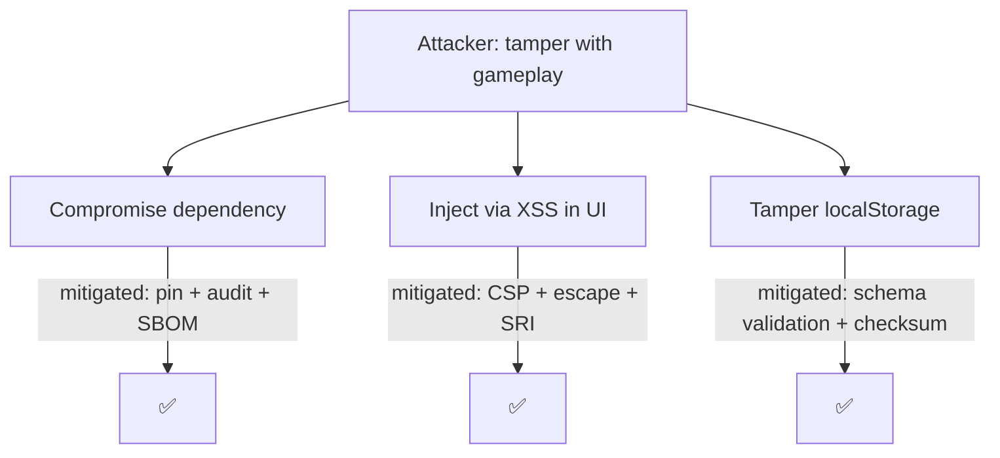

# 🎯 Threat Modeling Enforcement Skill

> **Strategic Principle**: Identify threats before attackers do; design controls into architecture, not around it.

## 🎯 Purpose

Enforce systematic threat modeling for all significant changes to Black Trigram so that security is designed in — not bolted on. Align with Hack23 AB's [Threat Modeling Policy](https://github.com/Hack23/ISMS-PUBLIC/blob/main/Threat_Modeling.md) and [Secure Development Policy](https://github.com/Hack23/ISMS-PUBLIC/blob/main/Secure_Development_Policy.md) §3.2 (Design phase).

**Reference**: [Hack23 Threat Modeling Policy](https://github.com/Hack23/ISMS-PUBLIC/blob/main/Threat_Modeling.md) · [Hack23 Secure Development Policy](https://github.com/Hack23/ISMS-PUBLIC/blob/main/Secure_Development_Policy.md)

## When to Apply

**Automatically trigger when:**
- Designing a new feature or system component
- Changing trust boundaries (new input source, storage, external dep)
- Adding authentication / authorization / session mechanics
- Adding cryptography or handling user data
- Opening a new network or file-system surface
- Changing CI/CD, build, or deployment topology
- Updating `SECURITY_ARCHITECTURE.md`, `THREAT_MODEL.md`, `FUTURE_THREAT_MODEL.md`
- Preparing an EU CRA / NIS2 / GDPR review
- Quarterly — re-validate existing model against new realities

## Core Principles

### 1. STRIDE per Trust Boundary

Apply STRIDE to every data flow that crosses a trust boundary:

| Category | Concern | Typical Mitigation |
|---|---|---|
| **S**poofing | Identity fraud | Authentication, provenance, signed updates |
| **T**ampering | Unauthorized modification | Integrity (hashes, signatures), SRI, write permissions |
| **R**epudiation | Denial of action | Audit logs, cryptographic receipts |
| **I**nformation Disclosure | Data leakage | Encryption, minimal data, CSP, CORS, cautious errors |
| **D**enial of Service | Availability loss | Rate limiting, input size limits, resource caps, timeouts |
| **E**levation of Privilege | Authorization bypass | Least privilege, input validation, safe deserialization |

### 2. MITRE ATT&CK Mapping

For the web / client context, map relevant techniques:

- **Initial Access** — T1190 (Exploit Public-Facing App), T1189 (Drive-by Compromise)
- **Execution** — T1059.007 (JavaScript), T1218 (Signed Binary Proxy Execution — build tooling)
- **Persistence** — T1176 (Browser Extensions), T1546 (Event Triggered Execution)
- **Defense Evasion** — T1027 (Obfuscated Files / Information)
- **Credential Access** — T1539 (Steal Web Session Cookie), T1555 (Credentials from Password Stores)
- **Collection** — T1185 (Browser Session Hijacking), T1056 (Input Capture)
- **Exfiltration** — T1048 (Exfiltration over Alt. Protocol)
- **Impact** — T1499 (Endpoint DoS), T1491 (Defacement)

Supply chain (CI/CD):

- T1195.001 — Compromise Software Dependencies & Development Tools
- T1195.002 — Compromise Software Supply Chain
- T1554 — Compromise Client Software Binary

### 3. Attack Trees

For each critical asset (integrity of combat logic, user's local device, repo integrity), draw an attack tree with:
- Root = attacker goal
- Branches = ways to achieve goal
- Leaves = concrete attack vectors
- Controls annotated at the vector level

Use Mermaid for the tree in `THREAT_MODEL.md`:



### 4. Data Flow Diagrams (DFD)

Maintain DFDs showing:

- **External entities** (browser, CDN, GitHub Actions, developer)
- **Processes** (Vite dev server, runtime game loop, build pipeline)
- **Data stores** (localStorage, repo, release artifacts)
- **Trust boundaries** drawn explicitly; STRIDE applied at each crossing

### 5. Threat Modeling Cadence

| Trigger | Activity |
|---|---|
| New feature design | Light-weight STRIDE on the feature's DFD; record in PR |
| Major architectural change | Full threat model update in `THREAT_MODEL.md` |
| New external dependency with privileged capability | Dependency threat note + attack tree branch |
| Quarterly | Review `THREAT_MODEL.md` + `FUTURE_THREAT_MODEL.md` for freshness |
| Post-incident | Lessons learned update + new threat added |

## Enforcement Rules

```
Rule 1 — Design gate:
IF a feature introduces a new trust boundary
THEN require STRIDE entries in the PR (or `THREAT_MODEL.md` update)

Rule 2 — Architecture change:
IF `ARCHITECTURE.md` / `DATA_MODEL.md` changes
THEN `THREAT_MODEL.md` must be reviewed and, where needed, updated

Rule 3 — New dep with privileged capability:
IF adding a dependency that reads fs, makes network calls, or runs native code at build time
THEN add a threat note explaining trust assumptions

Rule 4 — Crypto / auth:
IF introducing cryptographic or auth logic
THEN document chosen primitives, key handling, and threats mitigated (Cryptography Policy)

Rule 5 — Incident learning:
IF a security incident occurred
THEN add the attack path to `THREAT_MODEL.md` with the deployed mitigation

Rule 6 — Staleness:
IF `THREAT_MODEL.md` is older than 90 days without review
THEN create 🟠 High issue to refresh

Rule 7 — DFD currency:
IF DFD no longer reflects actual architecture
THEN update diagram before merging the code change that diverged
```

## Required Patterns

✅ STRIDE rows recorded as a table or check-list per trust boundary
✅ MITRE ATT&CK technique IDs referenced where applicable
✅ Attack trees kept concise, in Mermaid, inside `THREAT_MODEL.md`
✅ DFDs updated in the same PR that changes the architecture
✅ Threat IDs linked to `SECURITY_ARCHITECTURE.md` controls and to tests
✅ Residual risk documented when threat is not fully mitigated

## Anti-Patterns

❌ Threat model written once and forgotten
❌ "It's client-side so it's safe" — ignoring supply chain and build-time
❌ Treating STRIDE as a checklist without per-boundary analysis
❌ Adding mitigations without mapping to specific threats
❌ Missing attack trees for critical assets
❌ No MITRE ATT&CK / STRIDE reference in security PR description

## Compliance Framework Alignment

| Framework | Controls |
|---|---|
| ISO 27001:2022 | A.5.7 (Threat intelligence), A.8.25 (Secure development lifecycle), A.8.27 (Secure architecture and engineering) |
| NIST CSF 2.0 | ID.RA-03 (Threats, internal and external, identified), PR.IP-7 (Improvement), GV.RM (Risk management strategy) |
| CIS Controls v8.1 | 18 (Penetration testing), 14.3 (Threat modeling in training), 16.5 (Security architecture review) |
| NIST SSDF | PW.1 (Design for security), PW.2 (Review of design) |
| STRIDE | Microsoft Threat Modeling methodology |
| MITRE ATT&CK | Enterprise, Mobile, ICS matrices where applicable |
| EU CRA | Annex I §1(1)(a) secure by design |

## Related Skills

- **[security-architecture-validation](../security-architecture-validation/SKILL.md)** — controls derived from threats
- **[secure-development-lifecycle](../secure-development-lifecycle/SKILL.md)** — SDLC integration
- **[risk-assessment-frameworks](../risk-assessment-frameworks/SKILL.md)** — risk quantification
- **[incident-response](../incident-response/SKILL.md)** — feeds learned threats back into model
- **[open-source-governance](../open-source-governance/SKILL.md)** — supply-chain threats
- **[isms-compliance-checking](../isms-compliance-checking/SKILL.md)** — framework mapping

## Artifacts to Maintain

- `THREAT_MODEL.md` — current model (DFD + STRIDE + attack trees + MITRE mapping)
- `FUTURE_THREAT_MODEL.md` — planned evolutions and their threats
- `SECURITY_ARCHITECTURE.md` — controls that address the threats
- `CRA-ASSESSMENT.md` — CRA essential requirements status

## References

- [Hack23 Threat Modeling Policy](https://github.com/Hack23/ISMS-PUBLIC/blob/main/Threat_Modeling.md)
- [Hack23 Secure Development Policy](https://github.com/Hack23/ISMS-PUBLIC/blob/main/Secure_Development_Policy.md)
- [Microsoft STRIDE](https://learn.microsoft.com/en-us/azure/security/develop/threat-modeling-tool-threats)
- [MITRE ATT&CK](https://attack.mitre.org/)
- [OWASP Threat Modeling](https://owasp.org/www-community/Threat_Modeling)
- [NIST SP 800-154 (Data-Centric Threat Modeling)](https://csrc.nist.gov/publications/detail/sp/800-154/draft)

## Korean Philosophy Integration

### 선견지명 (Seongyeonjimyeong) — Foresight

A master anticipates the opponent's move before it begins, like a baduk (바둑 / go) player reading the board many moves ahead. Threat modeling is **foresight in code** — seeing the attack before it reaches the defense.

### 방어가 공격을 이긴다 (Bang-eo-ga gong-gyeok-eul igin-da) — Defense Overcomes Attack

Rooted defense in Eight Trigram's 간 (Gan — Mountain) stance: immovable by design, not by luck. A threat-modeled architecture is a mountain stance — prepared, principled, and patient.

---

**흑괘의 위협 모델링** — _Threat Modeling of the Black Trigram_
