# 🎮 Black Trigram (흑괘) – Technical Architecture

---

## 📚 Architecture Documentation Map

| Document                                                              | Focus            | Description                                                                                                |
| --------------------------------------------------------------------- | ---------------- | ---------------------------------------------------------------------------------------------------------- |
| **[🌐 System Context](#-system-context)**                             | C4 Model         | High-level view showing actors (Player, CDNs) and the entirely front-end application                       |
| **[🏢 Container View](#-container-view)**                             | C4 Model         | Frontend-only architecture: UI Layer, Game Logic, Asset Loader, Renderer, and State Management             |
| **[🧩 Component View](#-component-view)**                             | C4 Model         | Detailed breakdown of all key modules: Combat System, Trigram System, Vital Point System, Audio, UI        |
| **[🔧 File Structure](#-file-structure-highlights)**                  | Organization     | Current project structure and key file locations                                                           |
| **[🔄 Combat Flow Sequence](#-combat-flow-sequence)**                 | Sequence Diagram | How input flows through logic to rendering and feedback in real time                                       |
| **[⚡ Security & Performance](#-security--performance-architecture)** | Performance      | Client-side performance profiling, optimization techniques, and graceful degradation strategies            |
| **[📊 SWOT Analysis](#-swot-analysis)**                               | Strategy         | Strengths, Weaknesses, Opportunities, Threats for a 100% frontend, no-persistence "Black Trigram" web game |
| **[🎯 Core Game Concepts](#-core-game-concepts)**                     | Game Design      | Player archetypes, trigram system, resources & mechanics                                                   |
| **[🏗️ Architecture Concepts](#-architecture-concepts)**               | Technical Design | Mindmap of system architecture layers and components                                                       |
| **[🔄 UX Flow](#-ux-flow)**                                           | User Experience  | User journey through screens and interactions                                                              |
| **[🔄 Combat Mechanics](#-combat-mechanics--data-relationships)**     | Game Mechanics   | Detailed combat system data flow and relationships                                                         |

---

## 🌐 System Context

```mermaid
C4Context
    title System Context - Black Trigram (흑괘) Web Application

    Person(player, "🧑‍🤝‍🧑 Martial Arts Student", "Learns Korean vital point targeting through realistic combat simulation")
    Person(instructor, "🥋 Martial Arts Instructor", "Uses for teaching traditional Korean techniques")
    
    System(blackTrigram, "🌐 Black Trigram (흑괘)", "Korean martial arts combat simulator with authentic vital point targeting")
    
    System_Ext(audioCDN, "🎵 Audio CDN", "Korean traditional music + cyberpunk SFX")
    System_Ext(artCDN, "🖼️ Visual Assets CDN", "Character sprites, UI elements, particle effects")
    System_Ext(culturalDB, "🏛️ Korean Cultural Database", "Authentic martial arts terminology, I Ching philosophy")

    Rel(player, blackTrigram, "Practices combat techniques", "HTTPS/WebGL")
    Rel(instructor, blackTrigram, "Demonstrates vital points", "HTTPS/WebGL")
    
    Rel(blackTrigram, audioCDN, "Streams traditional Korean audio", "HTTPS")
    Rel(blackTrigram, artCDN, "Loads visual assets", "HTTPS")
    Rel(blackTrigram, culturalDB, "References authentic terminology", "HTTPS/JSON")

    UpdateLayoutConfig($c4ShapeInRow="2", $c4BoundaryInRow="1")
  ```

> **Legend**
>
> - 🧑‍🤝‍🧑 **Player**: End-user interacting with Black Trigram through desktop or mobile browser.
> - 🌐 **Black Trigram Web App**: Entirely front-end, built with React + PixiJS (TypeScript). All game logic, state, & rendering occur in-browser—no backend.
> - 🎵 **Audio CDN**: Serves SFX (bone cracks, impacts, ambient kyūdō sounds) and traditional Korean background music.
> - 🖼️ **Art CDN**: Serves character sprites, particle bitmaps (ki energy, blood splatter), UI icons, fonts (including Korean text), and other graphical assets.

---

## 🏢 Container View

```mermaid
C4Container
    title Container View - Black Trigram Performance Architecture

    Person(user, "🧑‍🤝‍🧑 User", "Practices Korean martial arts")

    System_Boundary(browserApp, "🌐 Black Trigram Browser Application") {
        Container(ui, "🖥️ React UI Layer", "React 19 + TypeScript", "Korean-themed components, responsive design")
        Container(gameEngine, "⚙️ Game Logic Engine", "TypeScript Modules", "Combat calculations, trigram system, vital points")
        Container(renderer, "🎨 PixiJS Renderer", "PixiJS 8 + WebGL", "60fps 2D graphics, particle systems, animations")
        Container(audioEngine, "🎵 Audio Engine", "Howler.js + Web Audio", "Korean traditional + cyberpunk audio")
        Container(stateManager, "🗄️ State Manager", "Zustand + React Context", "Game state, UI state, performance metrics")
        Container(assetLoader, "📦 Asset Loader", "PixiJS Assets + Custom", "Lazy loading, caching, compression")
        Container(perfMonitor, "📈 Performance Monitor", "Stats.js + Custom", "FPS tracking, memory usage, optimization")
    }

    Rel(user, ui, "Interacts via input", "Touch/Mouse/Keyboard")
    Rel(ui, gameEngine, "Dispatches actions", "Function calls")
    Rel(gameEngine, renderer, "Updates visuals", "PixiJS API")
    Rel(gameEngine, audioEngine, "Triggers sounds", "Howler.js API")
    Rel(gameEngine, stateManager, "Updates state", "Zustand actions")
    Rel(assetLoader, renderer, "Provides textures", "PixiJS Textures")
    Rel(assetLoader, audioEngine, "Provides audio", "Audio Buffers")
    Rel(perfMonitor, stateManager, "Reports metrics", "Performance data")

    UpdateLayoutConfig($c4ShapeInRow="3", $c4BoundaryInRow="1")
```

> **Containers Overview**
>
> - **🖥️ UI Layer**:
>
>   - React + TypeScript functional components.
>   - Screens: `CombatScreen`, `TrainingScreen`, `IntroScreen`.
>   - Common UI: `CombatHUD`, `TrigramWheel`, `ProgressTracker`, etc.
>   - Base modules in base: `BaseButton`, `KoreanText`, `BackgroundGrid`, etc.
>   - CSS: App.css, `src/CombatScreen.css`, etc.

> - **⚙️ Game Logic Layer**:
>
>   - Under `src/systems/*`, `src/types/*`.
>   - **CombatSystem (src/systems/CombatSystem.ts)**: Orchestrates input → trigram → vital-point → damage → audio/visual.
>   - **TrigramSystem (src/systems/trigram/**)\*\*:
>
>     - `StanceManager.ts`: Tracks current stance, validates Ki/Stamina, handles transition cost.
>     - `TransitionCalculator.ts`: Computes validity of stance switches.
>     - `TrigramCalculator.ts`: Provides technique data & advantage multipliers.
>     - `KoreanCulture.ts`: Supplies I Ching lore, Korean labels/descriptions.
>
>   - **VitalPointSystem (src/systems/vitalpoint/**)\*\*:
>
>     - `KoreanAnatomy.ts` & `KoreanVitalPoints.ts`: Defines all 70 vital points (critical, secondary, standard) and multipliers.
>     - `HitDetection.ts`: Checks collisions between attack hitboxes & character bounding boxes.
>     - `DamageCalculator.ts`: Applies base damage × trigram advantage × vital-point multiplier.
>
>   - **AudioManager (src/audio/**)\*\*:
>
>     - `AudioAssetRegistry.ts`, `AudioManager.ts`, `AudioUtils.ts`, `DefaultSoundGenerator.ts`, `VariantSelector.ts`: Load & play SFX/music via Web Audio API.
>
>   - **Physics & AI** (planned under `src/systems/AISystem.ts`): Minimal NPC behaviors.

> - **📦 Asset Loader**:
>
>   - PixiJS `Loader` (`@pixi/loaders`) and custom hooks (`useTexture.ts`) for textures & JSON data.
>   - Helpers in playerUtils.ts, `colorUtils.ts` map asset keys to URLs.
>   - Dynamically import large JSON (e.g., `src/types/constants/trigram.ts`) at runtime.

> - **🎨 Rendering Engine**:
>
>   - PixiJS (wrapped by `@pixi/react`) via GameEngine.tsx.
>   - Manages a single PixiJS `Application` (Canvas/WebGL).
>   - Renders: Character sprites (`PlayerVisuals.tsx`, `EnemyVisuals.tsx`), background (`DojangBackground.tsx`), particles (`HitEffectsLayer.tsx`).
>   - Draws UI overlays (health, Ki, stance auras) via Pixi primitives (`Graphics`, `Text`).

> - **🗄️ State Management**:
>
>   - In-browser only (no backend). Uses **Zustand** (or React Context fallback) under hooks.
>   - `useGameState.ts`, `useUIState.ts`, `useEnemyState.ts` store: health, stamina, Ki, current stance, enemy state, UI flags.
>   - **No Persistence**: Refresh resets all state / progress.

---

## 🧩 Component View

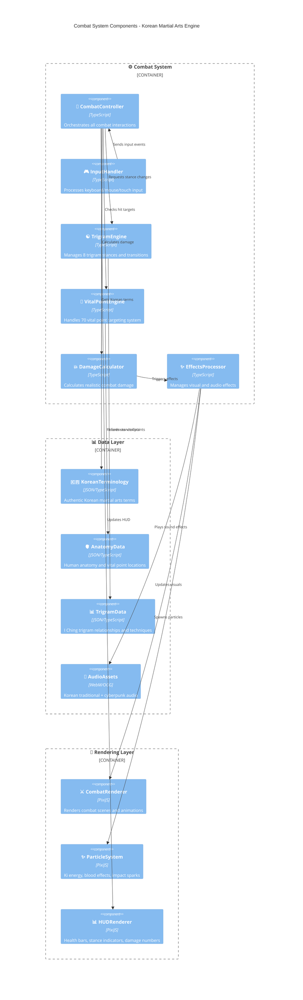

## Enhanced Icon Categories

### 🖥️ UI Layer Icons

- **📱 App** - Mobile-first application root
- **🏮 IntroScreen** - Traditional Korean lantern for welcome
- **⚔️ CombatScreen** - Crossed swords for combat
- **🎯 TrainingScreen** - Target for practice mode
- **🎮 GameUI** - Game controller for interface
- **📊 CombatHUD** - Chart/dashboard for HUD
- **☯️ TrigramWheel** - Yin-yang for Korean philosophy
- **🏁 EndScreen** - Checkered flag for completion
- **🔘 BaseButton** - Button for reusable component
- **🇰🇷 KoreanText** - Korean flag for Korean text
- **⚏ BackgroundGrid** - Grid pattern for overlay

### ⚙️ Game Logic Icons

- **🥊 CombatSystem** - Boxing glove for combat orchestration
- **🔶 TrigramSystem** - Diamond for trigram system
- **🥋 StanceManager** - Martial arts uniform for stance
- **🔄 TransitionCalculator** - Refresh for transitions
- **🧮 TrigramCalculator** - Abacus for calculations
- **🏛️ KoreanCulture** - Classical building for culture
- **🎯 VitalPointSystem** - Bullseye for targeting
- **🫀 AnatomicalRegions** - Heart for anatomy
- **💥 HitDetection** - Explosion for collision
- **🩸 DamageCalculator** - Blood drop for damage
- **🎵 AudioManager** - Musical note for audio
- **🎹 DefaultSoundGenerator** - Piano for sound generation
- **🎲 VariantSelector** - Dice for randomization

### 📦 Asset Loader Icons

- **🖼️ PixiLoader** - Framed picture for textures
- **🎧 AudioLoader** - Headphones for audio assets
- **📋 TrigramDataLoader** - Clipboard for data
- **🧬 VitalPointsDataLoader** - DNA for anatomical data

### 🗄️ State Management Icons

- **🎮 useGameState** - Game controller for game state
- **🖱️ useUIState** - Computer mouse for UI state
- **👹 useEnemyState** - Ogre for enemy state

### 🎨 Rendering Engine Icons

- **🎭 PixiStage** - Theater masks for stage
- **👤 PlayerVisuals** - Bust silhouette for player
- **👺 EnemyVisuals** - Goblin for enemy
- **✨ ParticlesLayer** - Sparkles for effects
- **🌅 DojangBackground** - Sunrise for environment

---

## 🔧 File Structure Highlights

- **src/components/ui/base**

  - `BaseButton.tsx`, `BackgroundGrid.tsx`, `KoreanText.tsx`, `KoreanHeader.tsx`, `PixiComponents.tsx`: Reusable UI primitives and Korean font utilities.

- **src/components/combat**

  - `CombatScreen.tsx`, `CombatArena.tsx`, `CombatControls.tsx`, `CombatHUD.tsx`: All UI & logic for real-time combat.

- **src/components/training**

  - `TrainingScreen.tsx`, `TrainingControlsPanel.tsx`, `VitalPointTrainingPanel.tsx`: Components for practicing vital-point targeting.

- **src/hooks**

  - `useTexture.ts`: Custom hook wrapping PixiJS loader for image caching.
  - `useGameState.ts`, `useUIState.ts`, `useEnemyState.ts`: Zustand stores for global state.

- **src/systems/trigram**

  - `KoreanCulture.ts`, `StanceManager.ts`, `TransitionCalculator.ts`, `TrigramCalculator.ts`: Trigram mechanics and data access.

- **src/systems/vitalpoint**

  - `AnatomicalRegions.ts`, `HitDetection.ts`, `DamageCalculator.ts`, `KoreanVitalPoints.ts`: Vital-point definitions, detection, and damage logic.

- **src/audio**

  - `AudioAssetRegistry.ts`, `AudioManager.ts`, `AudioUtils.ts`, `DefaultSoundGenerator.ts`, `VariantSelector.ts`: All sound loading and playback.

- **src/utils**

  - `playerUtils.ts`, `colorUtils.ts`: Helper functions for mapping archetype data and color schemes.

---

## 🔄 Combat Flow Sequence

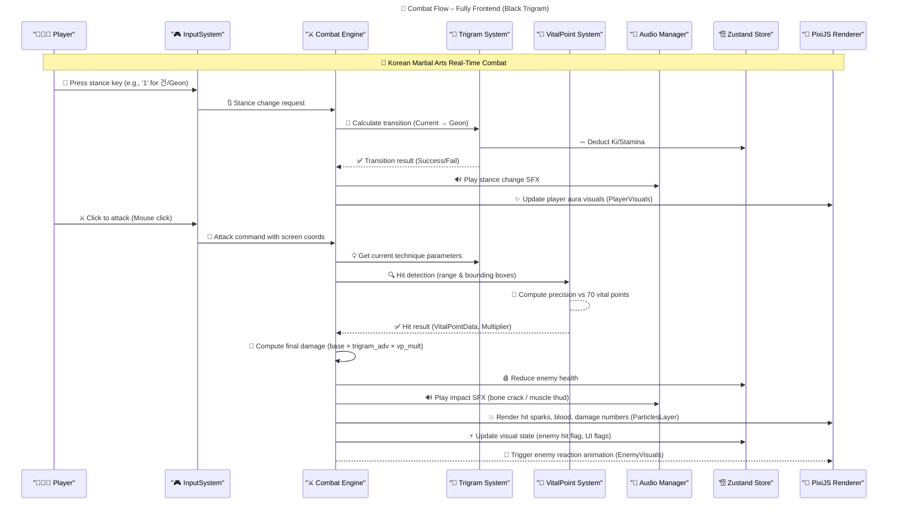

> **Note**
>
> - **InputSystem**: Lives in React (e.g., `CombatControls.tsx`), dispatching events to `CombatEngine`.
> - **CombatEngine**: Aggregates all combat logic in `CombatSystem.ts`.
> - **TrigramSystem**: Handles stance logic, technique lookup, state updates (Zustand).
> - **VitalPointSystem**: Performs in-memory geometry collision detection & returns multipliers.
> - **AudioManager**: Web Audio API plays sound buffers loaded at runtime from the Audio CDN.
> - **PixiStage**: Via `@pixi/react` (`StagePixi.tsx`), renders player, enemy, UI overlays, particles.
> - **Zustand Store**: All shared state (player health, Ki, stance) resides in memory; React components subscribe.

---

## ⚡ Security & Performance Architecture

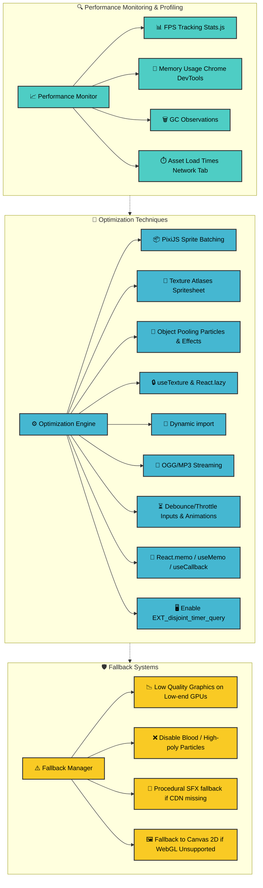

### **Performance Monitoring**

- **📈 FPS Tracking**: Integrate [Stats.js](https://github.com/mrdoob/stats.js/) to measure and display real-time framerate.
- **💾 Memory Usage**: Use Chrome DevTools to inspect memory footprint; watch for leaks when large particle sets spawn.
- **🗑️ GC Observations**: Monitor GC pauses when many objects (particles, temporary data) are created/destroyed; mitigate via object pooling.
- **⏱️ Asset Timing**: Leverage Network panel or custom timing code to measure JSON, texture, and audio load times from CDNs.

### **Optimization Techniques**

1. **📦 PixiJS Sprite Batching**

   - Group sprites sharing textures into batch draw calls (e.g., `ParticleContainer` for hit effects).
   - Use Pixi's `ParticleContainer` or `SpriteBatch` for high particle counts (ki energy, blood).

2. **🎨 Texture Atlases**

   - Combine character frames, UI icons, and particle frames into single spritesheets (e.g., `characters.json`, `particles.json`).
   - Minimizes WebGL texture switches, increasing draw performance.

3. **🔄 Object Pooling**

   - Pre-allocate particle/effect objects (blood splatter, ki orbs) and recycle instead of allocating new instances.
   - Pool frequently used objects (damage-number labels, aura filters) to reduce GC pressure.

4. **🔒 Asset Caching**

   - Custom `useTexture` hook: ensures textures load once and reuse across components.
   - Leverage browser-level caching (Cache-Control headers on CDN) to avoid re-fetching.

5. **📂 Code Splitting**

   - Lazy-load heavy modules: `TrainingScreen`, concept art galleries, large JSON data (non-MVP features).
   - Use dynamic `import()` to download code only when needed.

6. **🎵 Audio Compression & Streaming**

   - Store audio on CDN as compressed OGG/MP3.
   - Stream large background tracks, pre-decode short SFX in memory for low-latency playback.

7. **⏳ Debounce / Throttle**

   - Prevent rapid-fire input (stance spamming) from overwhelming main loop.
   - Throttle UI updates (animation triggers, combo pop-ups) using `useThrottle`/`useDebounce`.

8. **🧠 Memoization**

   - Use `React.memo` for pure UI components (`TrigramWheel`, `CombatHUD`) so they only re-render on relevant prop changes.
   - Leverage `useMemo` / `useCallback` for expensive calculations inside React components.

9. **🖥️ WebGL Extensions**

   - Enable `EXT_disjoint_timer_query` in PixiJS to gather GPU timing metrics for deeper profiling.

### **Fallback Systems (Graceful Degradation)**

1. **📉 Low Quality Mode**

   - Detect GPU capabilities at startup. If low, reduce canvas resolution and disable sub-pixel effects.
   - Toggle via "Low Graphics" checkbox in settings (Zustand flag: `useUIState.isLowGraphicsMode`).

2. **❌ Reduced Effects**

   - On performance drop (FPS < 30), disable expensive particles: blood splatter, continuous ki swirl.
   - Use `useUIState.isLowPerfMode` to toggle off these render layers.

3. **🎹 Procedural Audio**

   - If Audio CDN fails (e.g., offline), fall back to simple beep-thump procedural sounds via `DefaultSoundGenerator.ts`.

4. **🖼️ Canvas2D Fallback**

   - If WebGL unavailable (older browsers), switch to Canvas 2D renderer for core gameplay (no advanced particles, simplified effects).

---

## 📊 SWOT Analysis

### Traditional SWOT Quadrant Chart

```mermaid
%%{init: {
  "theme": "neutral",
  "themeVariables": {
    "quadrant1Fill": "#2b83ba",
    "quadrant2Fill": "#1a9641", 
    "quadrant3Fill": "#d7191c",
    "quadrant4Fill": "#756bb1",
    "quadrantTitleFill": "#ffffff",
    "quadrantPointFill": "#ffffff",
    "quadrantPointTextFill": "#000000",
    "quadrantXAxisTextFill": "#000000",
    "quadrantYAxisTextFill": "#000000"
  },
  "quadrantChart": {
    "chartWidth": 700,
    "chartHeight": 700,
    "pointLabelFontSize": 14,
    "titleFontSize": 24,
    "quadrantLabelFontSize": 18,
    "xAxisLabelFontSize": 16,
    "yAxisLabelFontSize": 16
  }
}}%%
quadrantChart
    title 📊 Black Trigram (흑괘) Frontend-Only SWOT Analysis
    x-axis Internal --> External
    y-axis Negative --> Positive
    quadrant-1 Opportunities
    quadrant-2 Strengths
    quadrant-3 Weaknesses
    quadrant-4 Threats

    "💡 PWA & Offline Caching":[0.8,0.9] radius:7 color:#a4c2f4 stroke-color:#3d64ba stroke-width:2px
    "📱 Mobile-First UX":[0.7,0.8] radius:7 color:#a4c2f4 stroke-color:#3d64ba stroke-width:2px
    "🎨 Community Modding":[0.85,0.75] radius:7 color:#a4c2f4 stroke-color:#3d64ba stroke-width:2px
    "🤖 AI-Driven Tutorials":[0.75,0.85] radius:7 color:#a4c2f4 stroke-color:#3d64ba stroke-width:2px
    "🌱 Ecosystem Partnerships":[0.65,0.7] radius:6 color:#a4c2f4 stroke-color:#3d64ba stroke-width:2px

    "🛠️ Zero-Install Web App":[0.2,0.8] radius:7 color:#a2d2a4 stroke-color:#2c882c stroke-width:2px
    "⏱ Fast Iteration":[0.25,0.75] radius:6 color:#a2d2a4 stroke-color:#2c882c stroke-width:2px
    "💸 Reduced Operational Costs":[0.15,0.85] radius:6 color:#a2d2a4 stroke-color:#2c882c stroke-width:2px
    "🚀 Immediate CDN Updates":[0.1,0.7] radius:7 color:#a2d2a4 stroke-color:#2c882c stroke-width:2px
    "🌍 Global Accessibility":[0.05,0.9] radius:6 color:#a2d2a4 stroke-color:#2c882c stroke-width:2px

    "🌀 No Persistence (Session-Only)":[0.2,0.25] radius:7 color:#f5a9a9 stroke-color:#aa3939 stroke-width:2px
    "🐢 Asset Load Latency":[0.3,0.2] radius:7 color:#f5a9a9 stroke-color:#aa3939 stroke-width:2px
    "📴 Limited Offline Play":[0.15,0.3] radius:6 color:#f5a9a9 stroke-color:#aa3939 stroke-width:2px
    "🌐 Browser Compatibility":[0.25,0.15] radius:7 color:#f5a9a9 stroke-color:#aa3939 stroke-width:2px
    "⚠️ Memory/GC Spikes":[0.35,0.1] radius:6 color:#f5a9a9 stroke-color:#aa3939 stroke-width:2px

    "🌩️ CDN Outages/Latency":[0.8,0.3] radius:7 color:#d5a6bd stroke-color:#9b568a stroke-width:2px
    "⚠️ WebGL Deprecation":[0.7,0.2] radius:7 color:#d5a6bd stroke-color:#9b568a stroke-width:2px
    "🏆 Competitive Mobile Games":[0.75,0.25] radius:7 color:#d5a6bd stroke-color:#9b568a stroke-width:2px
    "📉 Tech Debt (State Complexity)":[0.9,0.2] radius:6 color:#d5a6bd stroke-color:#9b568a stroke-width:2px
    "🔒 CDN Security Risks":[0.85,0.15] radius:6 color:#d5a6bd stroke-color:#9b568a stroke-width:2px
    "🌐 Browser Standards Changes":[0.65,0.25] radius:6 color:#d5a6bd stroke-color:#9b568a stroke-width:2px
```

### Mindmap of Strengths

```mindmap
  root((🟢 Strengths))
    id1(🛠️ Zero-Install Web App)
      id1.1[Play immediately—no download/sign-up]
      id1.2[Instant patching via static hosting]
      id1.3[High adoption barrier removed]
    id2(⏱ Fast Iteration)
      id2.1[Front-end only; no backend migrations]
      id2.2[Rapid prototyping & feature rollout]
      id2.3[Hot reloading in dev mode]
    id3(💸 Reduced Operational Costs)
      id3.1[No server infrastructure costs]
      id3.2[Leverage static CDNs (Cloudflare/AWS S3)]
      id3.3[Minimal DevOps overhead]
    id4(🚀 Immediate CDN Updates)
      id4.1[Push new animations & sounds instantly]
      id4.2[JSON/trigram data can update in real time]
      id4.3[Rapid asset iteration in production]
    id5(🌍 Global Accessibility)
      id5.1[Runs in any modern browser]
      id5.2[Cross-platform compatibility: desktop & mobile]
      id5.3[Low barrier to entry for users]
    id6(🔶 Authentic Korean Martial Arts Integration)
      id6.1[Deep I Ching (팔괘) philosophy]
      id6.2[70 traditional vital points]
      id6.3[Korean labels, audio, cultural immersion]
    id7(🎵 Rich Audio-Visual Experience)
      id7.1[Traditional Korean instruments & cyberpunk fusion]
      id7.2[Spectacular ki energy & blood particles]
      id7.3[Responsive, low-latency SFX]
    id8(⚙️ Modular Architecture)
      id8.1[Clear separation: Combat, Trigram, VitalPoint, Audio]
      id8.2[Reusable React + PixiJS components]
      id8.3[Zustand slices for isolated state]
    id9(🔑 Comprehensive Testing Framework)
      id9.1[Unit tests for combat & trigram logic]
      id9.2[Integration tests for full combat flow]
      id9.3[Performance tests (FPS, latency) with Stats.js]
```

### Mindmap of Weaknesses

```mindmap
  root((🟠 Weaknesses))
    id1(🌀 No Persistence (Session-Only))
      id1.1[All progress lost on refresh]
      id1.2[No saved unlocks or training logs]
      id1.3[Limited long-term engagement]
    id2(🐢 Asset Load Latency)
      id2.1[Large JSON/trigram data slows startup]
      id2.2[High-res textures cause delays]
      id2.3[Initial loading screen can be lengthy]
    id3(📴 Limited Offline Play)
      id3.1[Without service workers, no offline mode]
      id3.2[Users with spotty connectivity struggle]
      id3.3[No cached game state]
    id4(🌐 Browser Compatibility Challenges)
      id4.1[WebGL differences across browsers]
      id4.2[Web Audio API support varies]
      id4.3[Mobile browser quirks]
    id5(⚠️ Memory/GC Spikes)
      id5.1[Many particles cause GC pauses]
      id5.2[Object churn in combat heavy scenes]
      id5.3[Zustand state updates triggering re-renders]
    id6(⚙️ Complex State Management)
      id6.1[Multiple Zustand slices can desync]
      id6.2[No unified persistence layer]
      id6.3[Harder to trace bugs across stores]
    id7(❌ Incomplete Features)
      id7.1[Some techniques/stances lack polish]
      id7.2[Missing grappling (유술) & blocking (방어기) for certain stances]
      id7.3[Training mode limited in scope]
    id8(🔍 UX Learning Curve)
      id8.1[Complex trigram interactions require tutorials]
      id8.2[70 vital points may overwhelm new players]
      id8.3[Not immediately intuitive for casual users]
    id9(🛠️ Limited Analytics)
      id9.1[No built-in user metrics or telemetry]
      id9.2[Hard to measure player behavior/performance]
      id9.3[No A/B testing framework]
```

### Mindmap of Opportunities

```mindmap
  root((🔵 Opportunities))
    id1(💡 PWA & Offline Caching)
      id1.1[Implement service workers for asset caching]
      id1.2[Cache JSON & textures for offline play]
      id1.3[Persistence via IndexedDB/localStorage]
    id2(📱 Mobile-First UX)
      id2.1[Optimize controls for touch; swipe/drag]
      id2.2[Adaptive UI layouts for small screens]
      id2.3[Accelerometer-based stance changes]
    id3(🎨 Community Modding)
      id3.1[Allow custom skins via URL overlays]
      id3.2[Custom particle packs/community-created assets]
      id3.3[User-generated stances & techniques]
    id4(🤖 AI-Driven Tutorial Modules)
      id4.1[WebAssembly/TF.js for adaptive feedback]
      id4.2[Real-time guidance on vital-point targeting]
      id4.3[Progressive difficulty based on performance]
    id5(🌱 Ecosystem Partnerships)
      id5.1[Collaboration with martial arts schools]
      id5.2[Cultural institution sponsorships]
      id5.3[Cross-promotion with Korean cultural events]
    id6(🔧 Third-Party Integrations)
      id6.1[Discord & Twitch combat overlays]
      id6.2[Leaderboard integration via Firebase]
      id6.3[Social sharing (Twitter, Instagram) of combo replays]
    id7(⚙️ Advanced Analytics)
      id7.1[Track detailed player telemetry]
      id7.2[Heatmaps of vital-point targeting accuracy]
      id7.3[User segmentation & A/B tests for features]
    id8(📚 E-Learning Mode)
      id8.1[Structured courses on 팔괘 이론]
      id8.2[Guided practice sessions on vital points]
      id8.3[Certification badges for skill milestones]
    id9(🌐 Global Localization)
      id9.1[Support multiple languages (KR, EN, JP, CN)]
      id9.2[Localized UI/UX for regional audiences]
      id9.3[Region-specific AI tutor voice-overs]
```

### Mindmap of Threats

```mindmap
  root((🔴 Threats))
    id1(🌩️ CDN Outages / Latency)
      id1.1[Audio CDN or Art CDN downtime]
      id1.2[High global latency affects playability]
      id1.3[Single region CDN cold starts]
    id2(⚠️ WebGL / API Deprecation)
      id2.1[Future browser changes break PixiJS]
      id2.2[Web Audio API behavior shifts]
      id2.3[Mobile browser limitations]
    id3(🏆 Competitive Mobile Titles)
      id3.1[Native mobile games with deeper UX]
      id3.2[Lower-latency touch controls]
      id3.3[Larger marketing budgets]
    id4(📉 Technical Debt Accumulation)
      id4.1[Complex Zustand stores & no persistence]
      id4.2[Inconsistent data patterns]
      id4.3[Inefficient combat loops]
    id5(🔒 CDN Asset Security Risks)
      id5.1[MITM if CDN not HTTPS + SRI]
      id5.2[Compromised asset hosting]
      id5.3[Unverified third-party scripts]
    id6(📶 Browser Standards Evolution)
      id6.1[root((🔴 Threats))
    id1(🌩️ CDN Outages / Latency)
      id1.1[Audio CDN or Art CDN downtime]
      id1.2[High global latency affects playability]
      id1.3[Single region CDN cold starts]
    id2(⚠️ WebGL / API Deprecation)
      id2.1[Future browser changes break PixiJS]
      id2.2[Web Audio API behavior shifts]
      id2.3[Mobile browser limitations]
    id3(🏆 Competitive Mobile Titles)
      id3.1[Native mobile games with deeper UX]
      id3.2[Lower-latency touch controls]
      id3.3[Larger marketing budgets]
    id4(📉 Technical Debt Accumulation)
      id4.1[Complex Zustand stores & no persistence]
      id4.2[Inconsistent data patterns]
      id4.3[Inefficient combat loops]
    id5(🔒 CDN Asset Security Risks)
      id5.1[MITM if CDN not HTTPS + SRI]
      id5.2[Compromised asset hosting]
      id5.3[Unverified third-party scripts]
    id6(📶 Browser Standards Evolution)
      id6.1[Changes to ES modules affect bundling]
      id6.2[New security policies (CORS, CSP)]
      id6.3[Deprecated features in future standards]
    id7(🎮 Player Retention Challenges)
      id7.1[Without persistence, limited engagement]
      id7.2[Lack of progression incentives]
      id7.3[Session-only gameplay limits depth]
    id8(💰 Monetization Limitations)
      id8.1[No backend for payment processing]
      id8.2[Limited ability to track purchases]
      id8.3[Difficult to implement premium features]
    id9(🌍 Cultural Sensitivity Issues)
      id9.1[Misrepresentation of Korean culture]
      id9.2[Inappropriate use of traditional symbols]
      id9.3[Lack of cultural consultant validation]
```

---

## 🎯 Core Game Concepts

### Player Archetypes & Combat Philosophy

```mermaid
mindmap
  root((🥋 Black Trigram Core))
    id1[🎮 Player Archetypes]
      id1.1[무사 Musa - Traditional Warrior]
        id1.1.1[Honor-bound combat]
        id1.1.2[Balanced techniques]
        id1.1.3[Strong fundamentals]
      id1.2[암살자 Amsalja - Shadow Assassin]
        id1.2.1[Precision strikes]
        id1.2.2[Stealth mechanics]
        id1.2.3[Critical damage focus]
      id1.3[해커 Hacker - Cyber Warrior]
        id1.3.1[Tech-enhanced combat]
        id1.3.2[Digital disruption]
        id1.3.3[Augmented abilities]
      id1.4[정보요원 Jeongbo - Intelligence Op]
        id1.4.1[Analytical combat]
        id1.4.2[Predictive strikes]
        id1.4.3[Tactical advantage]
      id1.5[조직폭력배 Jojik - Crime Fighter]
        id1.5.1[Brutal efficiency]
        id1.5.2[Street techniques]
        id1.5.3[Overwhelming force]

    id2[☯️ Eight Trigrams (팔괘)]
      id2.1[☰ 건 Geon - Heaven]
        id2.1.1[Direct strikes]
        id2.1.2[Overwhelming power]
      id2.2[☱ 태 Tae - Lake]
        id2.2.1[Fluid movements]
        id2.2.2[Joint manipulation]
      id2.3[☲ 리 Li - Fire]
        id2.3.1[Nerve strikes]
        id2.3.2[Burning techniques]
      id2.4[☳ 진 Jin - Thunder]
        id2.4.1[Explosive attacks]
        id2.4.2[Sudden impacts]
      id2.5[☴ 손 Son - Wind]
        id2.5.1[Continuous pressure]
        id2.5.2[Rapid combos]
      id2.6[☵ 감 Gam - Water]
        id2.6.1[Adaptive defense]
        id2.6.2[Flow counters]
      id2.7[☶ 간 Gan - Mountain]
        id2.7.1[Immovable defense]
        id2.7.2[Counter strikes]
      id2.8[☷ 곤 Gon - Earth]
        id2.8.1[Grounding attacks]
        id2.8.2[Takedown focus]

    id3[🎯 Vital Points (급소)]
      id3.1[Critical Points (치명타)]
        id3.1.1[Instant KO potential]
        id3.1.2[x5.0 damage multiplier]
      id3.2[Secondary Points (보조)]
        id3.2.1[Major damage]
        id3.2.2[x3.0 damage multiplier]
      id3.3[Standard Points (일반)]
        id3.3.1[Basic damage]
        id3.3.2[x1.5 damage multiplier]

    id4[⚡ Resources]
      id4.1[❤️ Health (체력)]
        id4.1.1[100 HP per fighter]
        id4.1.2[No regeneration]
      id4.2[💪 Stamina (지구력)]
        id4.2.1[Physical actions]
        id4.2.2[Slow regeneration]
      id4.3[🔵 Ki Energy (기)]
        id4.3.1[Special techniques]
        id4.3.2[Stance transitions]
```

---

## 🏗️ Architecture Concepts

### System Architecture Layers

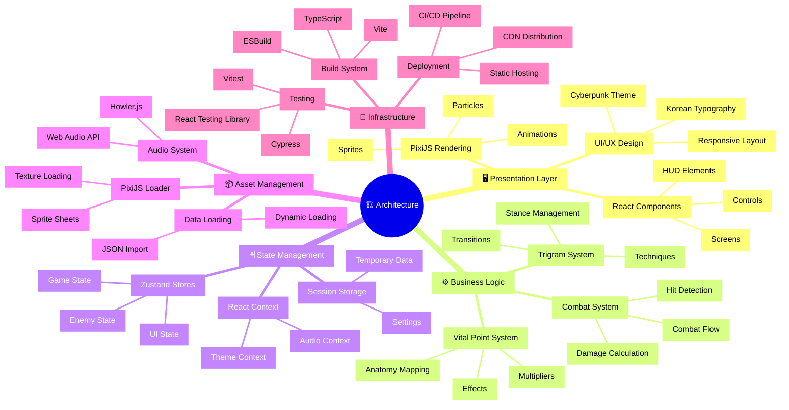

---

## 🔄 UX Flow

### User Journey Through Game


---

## 🔄 Combat Mechanics & Data Relationships

### Combat System Data Flow

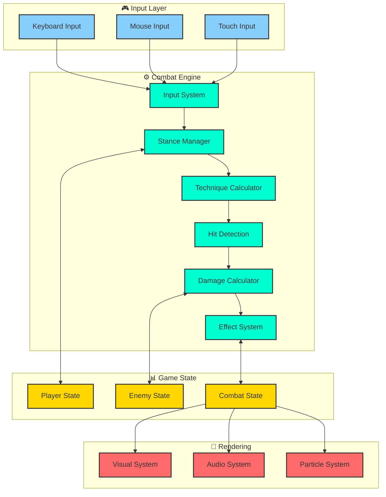

### Trigram Advantage Matrix

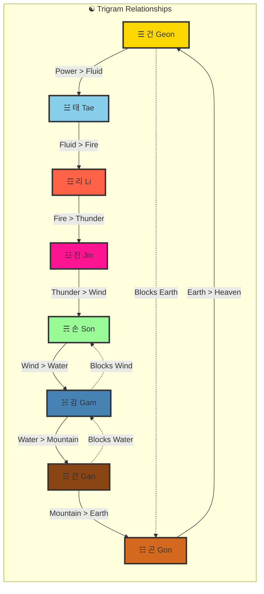

---

## 📈 Performance Optimization Strategy

### Resource Loading Pipeline

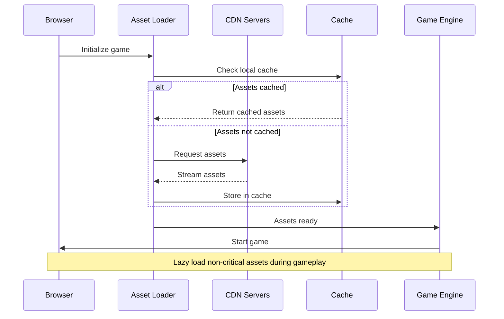

### Memory Management Strategy

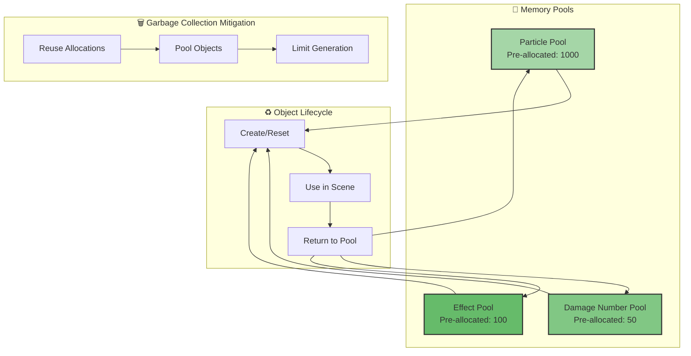

---

## 🔒 Security Considerations

### Frontend Security Architecture

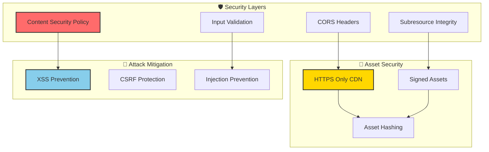

---

## 🚀 Deployment Architecture

### CI/CD Pipeline

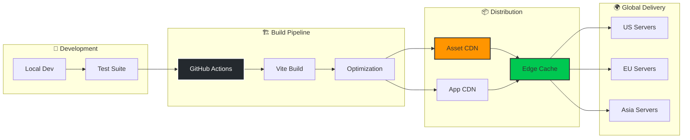

---

## 📊 Metrics & Monitoring

### Performance Monitoring Dashboard

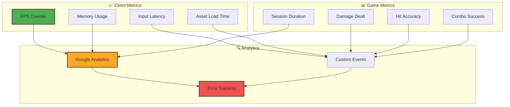

---

## 🎮 Future Architecture Considerations

### Potential Backend Integration

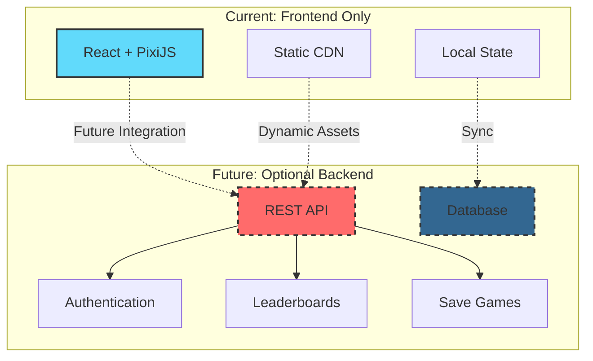

---

## 📝 Architecture Decision Records (ADRs)

### ADR-001: Frontend-Only Architecture

**Status**: Accepted  
**Date**: 2024-01-01  
**Context**: Need to minimize operational complexity and maximize accessibility  
**Decision**: Build as purely frontend application with no backend dependencies  
**Consequences**:

- ✅ Zero server costs
- ✅ Instant deployment
- ✅ No database management
- ❌ No persistence
- ❌ Limited multiplayer options

### ADR-002: React + PixiJS Integration

**Status**: Accepted  
**Date**: 2024-01-01  
**Context**: Need powerful 2D rendering with modern React development  
**Decision**: Use @pixi/react for seamless integration  
**Consequences**:

- ✅ Best of both worlds
- ✅ Strong ecosystem
- ✅ Type safety with TypeScript
- ❌ Learning curve for PixiJS
- ❌ Bundle size considerations

### ADR-003: Zustand for State Management

**Status**: Accepted  
**Date**: 2024-01-01  
**Context**: Need lightweight state management without Redux complexity  
**Decision**: Use Zustand for all global state  
**Consequences**:

- ✅ Minimal boilerplate
- ✅ TypeScript friendly
- ✅ DevTools support
- ❌ Less ecosystem than Redux
- ❌ Need custom persistence layer

---

## 🏁 Conclusion

Black Trigram's architecture represents a modern approach to browser-based gaming, leveraging cutting-edge web technologies while maintaining simplicity through its frontend-only design. The modular architecture supports rapid iteration and easy deployment while providing a rich, culturally authentic gaming experience.

### Key Architectural Strengths:

- **Zero Backend Complexity**: Pure frontend eliminates server management
- **Modular Design**: Clear separation of concerns across systems
- **Performance Focused**: Optimization strategies baked into architecture
- **Culturally Rich**: Deep integration of Korean martial arts philosophy
- **Developer Friendly**: TypeScript, modern React, comprehensive testing

### Areas for Future Enhancement:

- **Persistence Layer**: Optional backend for save games
- **Multiplayer Support**: WebRTC or server-based PvP
- **Advanced Analytics**: Deeper player behavior tracking
- **Mobile Optimization**: Native app wrapper or PWA
- **Content Expansion**: More stances, techniques, and vital points

The architecture is designed to scale with the game's ambitions while maintaining the core philosophy of accessibility, authenticity, and engaging combat mechanics.

---

**흑괘의 길을 걸어라** - _Walk the Path of the Black Trigram_

```

This completes the ARCHITECTURE.md document, providing a comprehensive technical architecture overview of the Black Trigram game, including all the remaining sections that were cut off in your original excerpt.This completes the ARCHITECTURE.md document, providing a comprehensive technical architecture overview of the Black Trigram game, including all the remaining sections that were cut off in your original excerpt.
```
