# 🎮 Black Trigram (흑괘) – Technical Architecture

---

## 📚 Architecture Documentation Map

| Document                                                              | Focus            | Description                                                                                                |
| --------------------------------------------------------------------- | ---------------- | ---------------------------------------------------------------------------------------------------------- |
| **[🌐 System Context](#-system-context)**                             | C4 Model         | High-level view showing actors (Player, CDNs) and the entirely front-end application                       |
| **[🏢 Container View](#-container-view)**                             | C4 Model         | Frontend-only architecture: UI Layer, Game Logic, Asset Loader, Renderer, and State Management             |
| **[🧩 Component View](#-component-view)**                             | C4 Model         | Detailed breakdown of all key modules: Combat System, Trigram System, Vital Point System, Audio, UI        |
| **[🎨 UI/UX Architecture](docs/UI_UX_ARCHITECTURE.md)**               | UI Components    | Component hierarchy, design patterns, Korean theming, Three.js UI integration                              |
| **[🔧 File Structure](#-file-structure-highlights)**                  | Organization     | Current project structure and key file locations                                                           |
| **[🔄 Combat Flow Sequence](#-combat-flow-sequence)**                 | Sequence Diagram | How input flows through logic to rendering and feedback in real time                                       |
| **[⚡ Security & Performance](#-security--performance-architecture)** | Performance      | Client-side performance profiling, optimization techniques, and graceful degradation strategies            |
| **[📊 SWOT Analysis](#-swot-analysis)**                               | Strategy         | Strengths, Weaknesses, Opportunities, Threats for a 100% frontend, no-persistence "Black Trigram" web game |
| **[🎯 Core Game Concepts](#-core-game-concepts)**                     | Game Design      | Player archetypes, trigram system, resources & mechanics                                                   |
| **[🏗️ Architecture Concepts](#-architecture-concepts)**               | Technical Design | Mindmap of system architecture layers and components                                                       |
| **[🔄 UX Flow](#-ux-flow)**                                           | User Experience  | User journey through screens and interactions                                                              |
| **[🔄 Combat Mechanics](#-combat-mechanics--data-relationships)**     | Game Mechanics   | Detailed combat system data flow and relationships                                                         |

---

## 🌐 System Context

```mermaid
C4Context
    title System Context - Black Trigram (흑괘) Web Application

    Person(player, "🧑‍🤝‍🧑 Martial Arts Student", "Learns Korean vital point targeting through realistic combat simulation")
    Person(instructor, "🥋 Martial Arts Instructor", "Uses for teaching traditional Korean techniques")
    
    System(blackTrigram, "🌐 Black Trigram (흑괘)", "Korean martial arts combat simulator with authentic vital point targeting")
    
    System_Ext(audioCDN, "🎵 Audio CDN", "Korean traditional music + cyberpunk SFX")
    System_Ext(artCDN, "🖼️ Visual Assets CDN", "Character sprites, UI elements, particle effects")
    System_Ext(culturalDB, "🏛️ Korean Cultural Database", "Authentic martial arts terminology, I Ching philosophy")

    Rel(player, blackTrigram, "Practices combat techniques", "HTTPS/WebGL")
    Rel(instructor, blackTrigram, "Demonstrates vital points", "HTTPS/WebGL")
    
    Rel(blackTrigram, audioCDN, "Streams traditional Korean audio", "HTTPS")
    Rel(blackTrigram, artCDN, "Loads visual assets", "HTTPS")
    Rel(blackTrigram, culturalDB, "References authentic terminology", "HTTPS/JSON")

    UpdateLayoutConfig($c4ShapeInRow="2", $c4BoundaryInRow="1")
  ```

> **Legend**
>
> - 🧑‍🤝‍🧑 **Player**: End-user interacting with Black Trigram through desktop or mobile browser.
> - 🌐 **Black Trigram Web App**: Entirely front-end, built with React 19 + Three.js (TypeScript). All game logic, state, & 3D rendering occur in-browser—no backend.
> - 🎵 **Audio CDN**: Serves SFX (bone cracks, impacts, ambient sounds) and traditional Korean background music + cyberpunk audio.
> - 🖼️ **Art CDN**: Serves 3D models, textures, particle effects, UI assets, fonts (including Korean Noto Sans KR), and visual assets.

---

## 🏢 Container View

```mermaid
C4Container
    title Container View - Black Trigram Performance Architecture (Q1 2026)

    Person(user, "🧑‍🤝‍🧑 User", "Practices Korean martial arts")

    System_Boundary(browserApp, "🌐 Black Trigram Browser Application") {
        Container(ui, "🖥️ React UI Layer", "React 19 + TypeScript", "Korean-themed components, responsive design, Html overlays")
        Container(gameEngine, "⚙️ Game Logic Engine", "TypeScript Modules", "Combat calculations, trigram system (8 stances), vital points (70)")
        Container(renderer, "🎨 Three.js Renderer", "@react-three/fiber + drei", "60fps 3D graphics, skeletal animation (14 bones), particle systems")
        Container(audioEngine, "🎵 Audio Engine", "Howler.js + Web Audio", "Damage-based sound feedback, Korean traditional + cyberpunk audio")
        Container(stateManager, "🗄️ State Manager", "Zustand + React Context", "Combat state, player archetypes (5), trigram stances")
        Container(animationSystem, "🎬 Animation System", "Skeletal Animation + Hand Poses", "14-bone system, muscle tension, 70 vital point mapping")
        Container(perfMonitor, "📈 Performance Monitor", "Stats.js + Custom", "60fps tracking, memory usage, optimization")
    }

    Rel(user, ui, "Interacts via input", "Touch/Mouse/Keyboard")
    Rel(ui, gameEngine, "Dispatches actions", "Function calls")
    Rel(gameEngine, renderer, "Updates visuals", "Three.js API")
    Rel(gameEngine, audioEngine, "Triggers sounds", "Howler.js API")
    Rel(gameEngine, stateManager, "Updates state", "Zustand actions")
    Rel(gameEngine, animationSystem, "Execute techniques", "Animation API")
    Rel(animationSystem, renderer, "Bone transforms", "Three.js Skeleton")
    Rel(perfMonitor, stateManager, "Reports metrics", "Performance data")

    UpdateLayoutConfig($c4ShapeInRow="3", $c4BoundaryInRow="1")
```

> **Containers Overview**
>
> - **🖥️ UI Layer**:
>
>   - React 19 + TypeScript functional components.
>   - Screens: `CombatScreen3D`, `TrainingScreen3D`, `IntroScreenThreeJS`, `ControlsScreenThreeJS`, `PhilosophyScreenThreeJS`.
>   - Common UI: Html overlays from `@react-three/drei` for HUD elements, health bars, stance indicators.
>   - Base modules: Korean-themed UI components with bilingual support (Korean | English).
>   - CSS: App.css, component-specific styling for overlays.
>
> - **⚙️ Game Logic Layer**:
>
>   - Under `src/systems/*`, `src/types/*`, `src/data/*`.
>   - **CombatSystem (`src/systems/CombatSystem.ts`)**: Orchestrates input → trigram → vital-point → damage → audio/visual.
>   - **TrigramSystem (`src/systems/trigram/*`):**
>
>     - `StanceManager.ts`: Tracks current stance, validates Ki/Stamina, handles transition cost.
>     - `TransitionCalculator.ts`: Computes validity of stance switches.
>     - `TrigramCalculator.ts`: Provides technique data & advantage multipliers.
>     - `KoreanCulture.ts`: Supplies I Ching lore, Korean labels/descriptions.
>
>   - **VitalPointSystem (`src/systems/vitalpoint/*`):**
>
>     - 70 vital points database with Korean names (백회혈, 인영, 명문, etc.)
>     - Enhanced anatomical zones with polygon-based hit detection.
>     - 5 severity levels (Lethal, Critical, Major, Moderate, Minor).
>     - 7 anatomical categories (Neurological, Skeletal, Joint, Organ, Muscular, Vascular, Respiratory).
>
>   - **AudioManager (`src/audio/*`):**
>
>     - `AudioAssetRegistry.ts`, `AudioManager.ts`, `AudioUtils.ts`: Load & play SFX/music via Howler.js + Web Audio API.
>     - Damage-based audio scaling (combat impact sounds scaled by effectiveness).
>
>   - **Animation System (`src/systems/animation/*`):**
>
>     - 14-bone skeletal system (PELVIS → SPINE → SHOULDERS → ELBOWS → HANDS, THIGHS → SHINS → FEET).
>     - Hand pose system (fist_vertical, fist_horizontal, open_hand_knife, etc.).
>     - Muscle tension visualization (0.0-1.0 mapped to bone visual intensity).
>
>   - **AI System (`src/systems/ai/*`):** Tactical combat behaviors, archetype-specific AI.
>
> - **🎨 Rendering Engine**:
>
>   - Three.js via `@react-three/fiber` (React renderer for Three.js).
>   - Manages 3D scene with WebGL rendering via `Canvas` component.
>   - Renders: Character 3D models with skeletal animation, environment, particles, and visual effects.
>   - UI overlays via `Html` component from `@react-three/drei` for HUD, health bars, Ki meters, stance indicators.
>   - Korean cyberpunk aesthetic with traditional 오방색 (Five Directional Colors).
>
> - **🎬 Animation System**:
>
>   - 14-bone skeletal hierarchy (`src/types/skeletal.ts`).
>   - Hand pose management (`src/types/hand-animation.ts`) for martial arts techniques.
>   - Muscle activation visualization (`src/types/muscle.ts`) with tension mapping.
>   - Technique animation (`src/types/technique.ts`) with keyframe interpolation.
>
> - **🗄️ State Management**:
>
>   - In-browser only (no backend). Uses **Zustand** (or React Context fallback) under hooks.
>   - Combat state: Health, stamina, Ki, current stance (8 trigrams), body part health (8 parts), consciousness levels.
>   - Player archetypes: 5 distinct fighter types (무사, 암살자, 해커, 정보요원, 조직폭력배).
>   - **No Persistence**: Refresh resets all state / progress.

---

## 🧩 Component View

```mermaid
C4Component
    title Combat System Components - Korean Martial Arts Engine (Q1 2026)

    Container_Boundary(combatSystem, "⚙️ Combat System") {
        Component(combatController, "🥊 CombatController", "TypeScript", "Orchestrates combat interactions (CombatSystem.ts - 36KB)")
        Component(inputHandler, "🎮 InputHandler", "TypeScript", "Processes keyboard/mouse/touch input")
        Component(trigramEngine, "☯️ TrigramEngine", "TypeScript", "Manages 8 trigram stances and transitions")
        Component(vitalPointEngine, "🎯 VitalPointEngine", "TypeScript", "70 vital points with polygon hit detection (<0.01ms)")
        Component(damageCalculator, "💥 DamageCalculator", "TypeScript", "Base × trigram × vital point multipliers")
        Component(effectsProcessor, "✨ EffectsProcessor", "TypeScript", "Visual and audio effect coordination")
        Component(animationSystem, "🎬 AnimationSystem", "TypeScript", "14-bone skeletal animation + hand poses")
        Component(bodyPartHealth, "🩹 BodyPartHealth", "TypeScript", "8-part health tracking system")
    }

    Container_Boundary(dataLayer, "📊 Data Layer") {
        Component(koreanTerminology, "🇰🇷 KoreanTerminology", "JSON/TypeScript", "Bilingual Korean-English terms")
        Component(anatomyData, "🫀 AnatomyData", "JSON/TypeScript", "70 vital points (5 severity, 7 categories)")
        Component(trigramData, "📊 TrigramData", "JSON/TypeScript", "8 I Ching trigrams + techniques")
        Component(audioAssets, "🎵 AudioAssets", "WebM/OGG", "Damage-scaled audio + Korean traditional")
        Component(archetypeData, "👤 ArchetypeData", "JSON/TypeScript", "5 player archetypes (무사, 암살자, 해커, 정보요원, 조직폭력배)")
        Component(skeletalData, "🦴 SkeletalData", "TypeScript", "14-bone hierarchy + muscle tension")
    }

    Container_Boundary(rendering, "🎨 Rendering Layer") {
        Component(threeScene, "⚔️ ThreeScene", "Three.js", "3D combat scene with WebGL rendering")
        Component(particleSystem, "✨ ParticleSystem", "Three.js Instances", "Ki energy, hit effects, impact particles")
        Component(hudOverlay, "📊 HUDOverlay", "Html (drei)", "Health bars, stance indicators, damage numbers")
        Component(skeletalRenderer, "🎭 SkeletalRenderer", "Three.js Skeleton", "14-bone character animation")
    }

    Rel(inputHandler, combatController, "Sends input events")
    Rel(combatController, trigramEngine, "Requests stance changes (8 stances)")
    Rel(combatController, vitalPointEngine, "Checks hit targets (70 points)")
    Rel(combatController, damageCalculator, "Calculates damage")
    Rel(combatController, bodyPartHealth, "Updates 8 body parts")
    Rel(damageCalculator, effectsProcessor, "Triggers effects")
    Rel(effectsProcessor, animationSystem, "Execute technique animations")

    Rel(trigramEngine, trigramData, "Loads 8 stance data")
    Rel(vitalPointEngine, anatomyData, "References 70 vital points")
    Rel(combatController, koreanTerminology, "Gets Korean terms")
    Rel(effectsProcessor, audioAssets, "Plays damage-scaled sounds")
    Rel(animationSystem, skeletalData, "Loads bone hierarchy")
    Rel(combatController, archetypeData, "Loads 5 archetype data")

    Rel(effectsProcessor, threeScene, "Updates 3D visuals")
    Rel(effectsProcessor, particleSystem, "Spawns particle effects")
    Rel(combatController, hudOverlay, "Updates HUD overlays")
    Rel(animationSystem, skeletalRenderer, "Updates bone transforms")

    UpdateLayoutConfig($c4ShapeInRow="4", $c4BoundaryInRow="1")
```

## Enhanced Icon Categories

### 🖥️ UI Layer Icons

- **📱 App** - Mobile-first application root
- **🏮 IntroScreen** - Traditional Korean lantern for welcome
- **⚔️ CombatScreen** - Crossed swords for combat
- **🎯 TrainingScreen** - Target for practice mode
- **🎮 GameUI** - Game controller for interface
- **📊 CombatHUD** - Chart/dashboard for HUD
- **☯️ TrigramWheel** - Yin-yang for Korean philosophy
- **🏁 EndScreen** - Checkered flag for completion
- **🔘 BaseButton** - Button for reusable component
- **🇰🇷 KoreanText** - Korean flag for Korean text
- **⚏ BackgroundGrid** - Grid pattern for overlay

### ⚙️ Game Logic Icons

- **🥊 CombatSystem** - Boxing glove for combat orchestration
- **🔶 TrigramSystem** - Diamond for trigram system
- **🥋 StanceManager** - Martial arts uniform for stance
- **🔄 TransitionCalculator** - Refresh for transitions
- **🧮 TrigramCalculator** - Abacus for calculations
- **🏛️ KoreanCulture** - Classical building for culture
- **🎯 VitalPointSystem** - Bullseye for targeting
- **🫀 AnatomicalRegions** - Heart for anatomy
- **💥 HitDetection** - Explosion for collision
- **🩸 DamageCalculator** - Blood drop for damage
- **🎵 AudioManager** - Musical note for audio
- **🎹 DefaultSoundGenerator** - Piano for sound generation
- **🎲 VariantSelector** - Dice for randomization

### 📦 Asset Loader Icons

- **🖼️ PixiLoader** - Framed picture for textures
- **🎧 AudioLoader** - Headphones for audio assets
- **📋 TrigramDataLoader** - Clipboard for data
- **🧬 VitalPointsDataLoader** - DNA for anatomical data

### 🗄️ State Management Icons

- **🎮 useGameState** - Game controller for game state
- **🖱️ useUIState** - Computer mouse for UI state
- **👹 useEnemyState** - Ogre for enemy state

### 🎨 Rendering Engine Icons

- **🎭 PixiStage** - Theater masks for stage
- **👤 PlayerVisuals** - Bust silhouette for player
- **👺 EnemyVisuals** - Goblin for enemy
- **✨ ParticlesLayer** - Sparkles for effects
- **🌅 DojangBackground** - Sunrise for environment

---

## 🎮 Three.js 3D Rendering Architecture

Black Trigram has **completed** its migration from PixiJS (2D rendering) to Three.js (3D rendering), achieving enhanced visual capabilities with authentic Korean martial arts theming and maintaining 60fps performance targets as of Q1 2026.

### 📦 Three.js Dependencies

The following Three.js packages are now installed and configured:

- **three@0.181.2** - Core Three.js 3D engine with WebGL rendering
- **@react-three/fiber@9.4.0** - React renderer for Three.js (declarative 3D in React)
- **@react-three/drei@10.7.7** - Useful helpers and abstractions (@react-three/fiber)
- **@types/three@0.181.0** - TypeScript type definitions for Three.js

### 🏗️ Architecture Integration

```mermaid
graph TD
    subgraph "React 19 Application Layer"
        A[React Components]
        B[State Management - Zustand]
        C[Korean Theming - KOREAN_COLORS]
    end
    
    subgraph "Rendering Layer"
        D[@react-three/fiber Canvas]
        E[PixiJS 2D Renderer]
    end
    
    subgraph "Three.js 3D Scene"
        F[Scene Graph]
        G[3D Characters]
        H[Vital Point Markers]
        I[Particle Systems]
        J[Korean-Themed Materials]
        K[Lighting Setup]
    end
    
    subgraph "UI Overlay Layer"
        L[Html Components]
        M[Combat HUD]
        N[Status Panels]
    end
    
    A --> D
    A --> E
    B --> A
    C --> A
    C --> J
    
    D --> F
    F --> G
    F --> H
    F --> I
    F --> J
    F --> K
    
    D --> L
    L --> M
    L --> N
    
    style D fill:#00ffff,stroke:#333,stroke-width:3px
    style F fill:#ffd700,stroke:#333,stroke-width:3px
    style J fill:#ff4444,stroke:#333,stroke-width:2px
    style L fill:#98fb98,stroke:#333,stroke-width:2px
```

### 📐 Rendering Pipeline

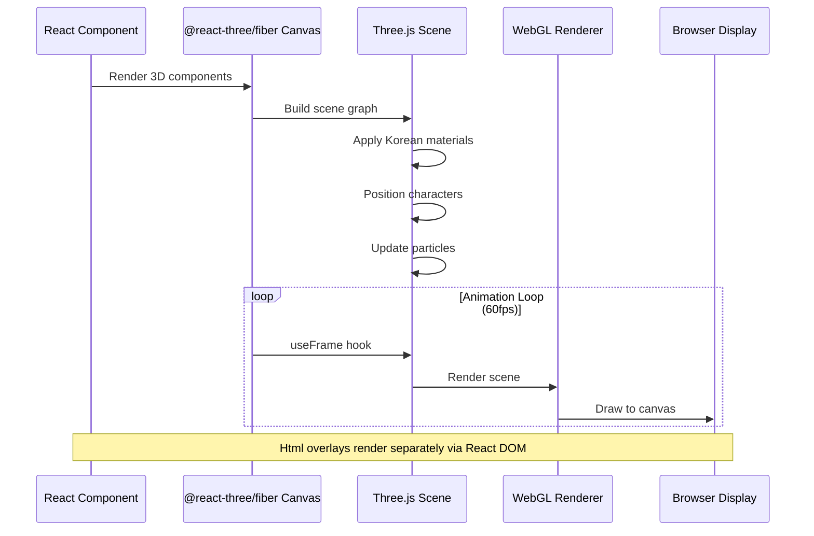

### 📁 File Structure

#### Current Implementation
- **src/components/test/**
  - `HelloThreeJS.tsx` - Test component demonstrating Three.js setup
  - `HelloThreeJS.test.tsx` - Unit tests for Three.js infrastructure
  - `HelloThreeJS-demo.tsx` - Interactive demo with controls

#### Planned Structure
```
src/components/combat/
├── characters/
│   ├── CharacterModel3D.tsx           # Base 3D character model
│   ├── VitalPointMarkers3D.tsx        # 70 vital points in 3D
│   ├── StanceAnimation3D.tsx          # Eight trigram stances
│   └── DamageVisualization3D.tsx      # Blood and injury effects
├── particles/
│   ├── KiEnergyParticles3D.tsx        # Ki energy particle system
│   ├── HitEffects3D.tsx               # Impact effects and sparks
│   └── BloodSplatter3D.tsx            # Realistic blood effects
├── arena/
│   ├── CombatArena3D.tsx              # Complete 3D combat scene
│   ├── DojangFloor3D.tsx              # Traditional dojang floor
│   └── KoreanLighting3D.tsx           # Korean-themed lighting setup
└── ui/
    ├── CombatHUDOverlay.tsx           # Html UI over 3D scene
    ├── PlayerNameplate3D.tsx          # Player info in 3D space
    └── VitalPointTooltip3D.tsx        # Interactive tooltips
```

### 🔧 Configuration

**Vite Configuration (`vite.config.ts`):**
```typescript
export default defineConfig({
  plugins: [react()],
  optimizeDeps: {
    include: [
      // Three.js dependencies
      "three",
      "@react-three/fiber",
      "@react-three/drei",
      // Audio
      "howler",
    ],
  },
  build: {
    rollupOptions: {
      output: {
        manualChunks: {
          'three-vendor': ['three', '@react-three/fiber', '@react-three/drei'],
        },
      },
    },
  },
});
```

**TypeScript Configuration (`tsconfig.json`):**
```json
{
  "compilerOptions": {
    "skipLibCheck": true,          // Handles Three.js type complexities
    "moduleResolution": "bundler",  // Optimized for Vite + Three.js
    "strict": true,                 // Strict type checking
    "jsx": "react-jsx",             // React 19 JSX transform
    "types": ["vite/client", "node"]
  }
}
```

**Test Setup (`src/test/setup.ts`):**
```typescript
// WebGL context mocking for Three.js tests
class MockWebGLRenderingContext {
  getExtension = vi.fn();
  getParameter = vi.fn();
  // ... full WebGL API mock
}

// ResizeObserver polyfill for @react-three/fiber
class MockResizeObserver {
  observe = vi.fn();
  unobserve = vi.fn();
  disconnect = vi.fn();
}

global.ResizeObserver = MockResizeObserver;
```

### 🎨 Core Patterns

#### Pattern 1: Canvas Setup with Korean Theming

```typescript
import { Canvas } from "@react-three/fiber";
import { Environment, PerspectiveCamera } from "@react-three/drei";
import { KOREAN_COLORS } from "../../types/constants";
import * as THREE from "three";

export function CombatScene3D() {
  return (
    <Canvas
      gl={{
        antialias: true,
        alpha: false,
        powerPreference: 'high-performance',
      }}
      dpr={[1, 2]}
      shadows
      onCreated={({ gl, scene }) => {
        // Korean cyberpunk background
        gl.setClearColor(KOREAN_COLORS.UI_BACKGROUND_DARK, 1);
        scene.fog = new THREE.Fog(
          KOREAN_COLORS.UI_BACKGROUND_DARK,
          10,
          50
        );
      }}
    >
      {/* Korean-themed lighting */}
      <ambientLight intensity={0.4} color={KOREAN_COLORS.PRIMARY_CYAN} />
      <directionalLight
        position={[10, 10, 5]}
        intensity={1}
        castShadow
        color={KOREAN_COLORS.ACCENT_GOLD}
      />
      
      {/* Environment reflections */}
      <Environment preset="city" />
      
      {/* Camera */}
      <PerspectiveCamera makeDefault position={[0, 5, 10]} fov={75} />
      
      {/* Game content */}
      <CombatArena3D />
    </Canvas>
  );
}
```

#### Pattern 2: useFrame Animation Loop

```typescript
import { useFrame } from "@react-three/fiber";
import { useRef } from "react";
import * as THREE from "three";

export function AnimatedCharacter({ stance, health }) {
  const meshRef = useRef<THREE.Mesh>(null);
  
  // 60fps animation loop
  useFrame((state, delta) => {
    if (!meshRef.current) return;
    
    // Breathing animation
    const breathScale = Math.sin(state.clock.elapsedTime * 2) * 0.02 + 1;
    meshRef.current.scale.y = breathScale;
    
    // Stance-based rotation
    meshRef.current.rotation.y = getStanceRotation(stance);
  });
  
  return (
    <mesh ref={meshRef} castShadow receiveShadow>
      <capsuleGeometry args={[0.5, 1.5, 16, 32]} />
      <meshStandardMaterial color={getHealthColor(health)} />
    </mesh>
  );
}
```

#### Pattern 3: Html Overlays for UI


```typescript
import { Html } from "@react-three/drei";

export function PlayerNameplate3D({ name, nameKorean, health }) {
  return (
    <Html position={[0, 2.5, 0]} center>
      <div style={{
        background: `${KOREAN_COLORS.UI_BACKGROUND_DARK}cc`,
        border: `2px solid ${KOREAN_COLORS.PRIMARY_CYAN}`,
        borderRadius: '8px',
        padding: '12px',
        fontFamily: 'Korean Font',
      }}>
        <div style={{ color: KOREAN_COLORS.ACCENT_GOLD }}>
          {nameKorean} | {name}
        </div>
        <HealthBar health={health} />
      </div>
    </Html>
  );
}
```


#### Pattern 4: Korean Materials and Lighting

```typescript
// Eight Trigram color mapping
const TRIGRAM_COLORS: Record<TrigramStance, number> = {
  geon: KOREAN_COLORS.CARDINAL_CENTER,  // ☰ Heaven - Yellow
  tae: KOREAN_COLORS.PRIMARY_CYAN,      // ☱ Lake - Cyan
  li: KOREAN_COLORS.CARDINAL_SOUTH,     // ☲ Fire - Red
  jin: KOREAN_COLORS.SECONDARY_YELLOW,  // ☳ Thunder - Yellow
  son: KOREAN_COLORS.CARDINAL_EAST,     // ☴ Wind - Green
  gam: KOREAN_COLORS.ACCENT_BLUE,       // ☵ Water - Blue
  gan: KOREAN_COLORS.UI_BACKGROUND_LIGHT, // ☶ Mountain - Gray
  gon: KOREAN_COLORS.UI_BACKGROUND_DARK,  // ☷ Earth - Dark
};

// Cardinal directions lighting (오방색)
export function CardinalLighting() {
  return (
    <>
      <pointLight position={[10, 0, 0]} color={KOREAN_COLORS.CARDINAL_EAST} />
      <pointLight position={[-10, 0, 0]} color={KOREAN_COLORS.CARDINAL_WEST} />
      <pointLight position={[0, 0, 10]} color={KOREAN_COLORS.CARDINAL_SOUTH} />
      <pointLight position={[0, 0, -10]} color={KOREAN_COLORS.CARDINAL_NORTH} />
      <pointLight position={[0, 10, 0]} color={KOREAN_COLORS.CARDINAL_CENTER} />
    </>
  );
}
```

### 📊 Performance Optimization

#### Bundle Size Management

| Asset | Size (Uncompressed) | Size (Gzipped) | Notes |
|-------|---------------------|----------------|-------|
| Three.js core | ~600KB | ~150KB | Tree-shaken imports |
| @react-three/fiber | ~100KB | ~30KB | React integration |
| @react-three/drei | ~200KB | ~60KB | Only imported helpers |
| **Total** | **~900KB** | **~240KB** | Lazy-loaded when needed |

#### Optimization Techniques

1. **Instancing for Particles**
```typescript
import { Instances, Instance } from '@react-three/drei';

<Instances limit={1000}>
  <sphereGeometry args={[0.1, 8, 8]} />
  <meshBasicMaterial color={KOREAN_COLORS.PRIMARY_CYAN} />
  {particles.map((p, i) => (
    <Instance key={i} position={p.position} scale={p.scale} />
  ))}
</Instances>
```

2. **LOD (Level of Detail)**
```typescript
import { Detailed } from '@react-three/drei';

<Detailed distances={[0, 10, 20]}>
  <HighDetailCharacter />
  <MediumDetailCharacter />
  <LowDetailCharacter />
</Detailed>
```

3. **Object Pooling**
```typescript
// Reuse objects instead of creating new ones
const particlePool = new ParticlePool(createParticle, resetParticle, 100);
```

### 🚀 Migration Strategy

#### Phase 1: Infrastructure Setup ✅ COMPLETE
- [x] Three.js dependencies installed
- [x] Test component created (`HelloThreeJS`)
- [x] Korean theming verified
- [x] Build and test pipeline working

#### Phase 2: Particle Systems (In Progress)
- [ ] Migrate ki energy particles to Three.js `Instances`
- [ ] Create 3D blood splatter effects
- [ ] Implement impact sparks with lighting
- [ ] Performance validation (1000+ particles at 60fps)

#### Phase 3: Character Models ✅ COMPLETE
- [x] Create unified Player3D component (`Player3DUnified.tsx`)
- [x] Implement stance-based visual system (8 trigrams with color-coded auras)
- [x] Add health/stamina/Ki state indicators with Html overlays
- [x] Support all 5 player archetypes with visual differentiation
- [x] Integrate pain/balance/consciousness visualization
- [x] Add responsive scaling for mobile/desktop
- [x] Create conversion utilities for PlayerState integration
- [x] Integrate into CombatScreen3D (both players)
- [x] Integrate into TrainingScreen3D (trainee player)
- [x] Comprehensive test coverage (61 component + 29 integration tests)

**Key Components:**
- `src/components/three/Player3DUnified.tsx` - Main unified player visualization
- `src/components/three/PlayerStateIndicators.tsx` - Html overlay for stats
- `src/components/three/StanceAura.tsx` - Animated stance aura effects
- `src/utils/player3DHelpers.ts` - PlayerState conversion utilities
- `src/types/player-visual.ts` - TypeScript interfaces for player visuals

**Usage Example:**
```typescript
import { Player3DUnified } from '@/components/three';
import { convertPlayerStateToProps } from '@/utils/player3DHelpers';

// In CombatScreen3D or TrainingScreen3D:
<Player3DUnified
  {...convertPlayerStateToProps(
    playerState,
    [x, y, z],      // 3D position
    rotation,       // Y-axis rotation in radians
    {
      isMobile,
      facing: "right",
      showVitalPoints: true,
    }
  )}
/>
```

#### Phase 4: Combat Arena (Planned)
- [ ] Build 3D dojang environment
- [ ] Korean-themed lighting setup
- [ ] Shadow and reflection effects
- [ ] Environmental particles (dust, air)

#### Phase 5: UI Integration (Planned)
- [ ] Convert Combat HUD to Html overlays
- [ ] 3D-positioned player status panels
- [ ] Floating damage numbers
- [ ] Vital point targeting interface

#### Phase 6: Polish & Optimization (Planned)
- [ ] Post-processing effects (bloom, color grading)
- [ ] Advanced particle systems
- [ ] Mobile performance optimization
- [ ] Production deployment

### 🧪 Testing Strategy

#### Unit Tests
```typescript
// Test Three.js component imports and props
describe('CharacterModel3D', () => {
  it('should be defined and importable', () => {
    expect(CharacterModel3D).toBeDefined();
  });
  
  it('should accept Korean colors', () => {
    expect(typeof KOREAN_COLORS.PRIMARY_CYAN).toBe('number');
  });
});
```

#### E2E Tests
```typescript
// cypress/e2e/threejs-combat.cy.ts
describe('Three.js Combat Arena', () => {
  it('should render 3D scene without errors', () => {
    cy.visit('/combat');
    cy.get('canvas').should('exist');
    cy.wait(1000); // Allow scene to load
  });
  
  it('should maintain 60fps during combat', () => {
    // Use custom FPS counter to validate performance
  });
});
```

#### Manual Testing Checklist
- [ ] Visual quality on desktop (1920x1080)
- [ ] Visual quality on mobile (720p)
- [ ] 60fps sustained on desktop
- [ ] 55fps minimum on mobile
- [ ] Korean colors render correctly
- [ ] Html overlays positioned properly
- [ ] No WebGL errors in console
- [ ] Memory usage stays below 500MB (desktop)

### 🎬 Skeletal Animation Architecture

Black Trigram implements a comprehensive 14-bone skeletal system with hand poses and muscle tension visualization for authentic Korean martial arts movement.

#### Bone Hierarchy (14-Bone System)

```
PELVIS (root)
├── SPINE_LOWER
│   ├── SPINE_MID
│   │   └── SPINE_UPPER
│   │       ├── SHOULDER_L → ELBOW_L → HAND_L
│   │       └── SHOULDER_R → ELBOW_R → HAND_R
│   ├── THIGH_L → SHIN_L → FOOT_L
│   └── THIGH_R → SHIN_R → FOOT_R
```

**Implementation:** `src/types/skeletal.ts` - Complete bone hierarchy with TypeScript type definitions

#### Hand Pose System

**Six Primary Hand Poses:**
- `fist_vertical` - Vertical fist (chamber position) - 직권 (Jikgwon)
- `fist_horizontal` - Horizontal fist (impact) - 평권 (Pyeonggwon)
- `fist_pronated` - Pronated fist (downward punch) - 복권 (Bokgwon)
- `open_hand_knife` - Knife-hand strike - 손날 (Sonnal)
- `open_hand_palm` - Palm strike - 장타 (Jangta)
- `grabbing` - Grappling position - 잡기 (Japgi)

**Implementation:** `src/types/hand-animation.ts` - Hand pose definitions and transitions

#### Muscle Tension Visualization

**Tension Mapping (0.0-1.0):**
- **High Tension (0.8-1.0)**: Bright red muscles - Active striking or blocking
- **Medium Tension (0.4-0.7)**: Orange muscles - Stance maintenance
- **Low Tension (0.0-0.3)**: Relaxed state - Recovery phase

**Visual Feedback:**
- Tension values mapped to bone visual intensity in real-time
- Color gradient from relaxed (dim) to maximum exertion (bright)
- Synchronized with technique execution and stance changes

**Implementation:** `src/types/muscle.ts` - Muscle activation system with tension tracking

#### Technique Animation System

**Keyframe Interpolation:**
- Start pose → Intermediate frames → Impact frame → Recovery
- 60fps smooth interpolation between keyframes
- Technique-specific timing (fast strikes, slow defensive movements)

**Integration with Combat:**
- Technique selection triggers skeletal animation sequence
- Hand pose changes synchronized with strike timing
- Muscle tension peaks at impact frame
- Animation completes before next input accepted

**Implementation:** 
- `src/types/technique.ts` - Technique type definitions with animation metadata
- `src/systems/animation/` - Animation system logic and keyframe management

#### Performance Considerations

**Optimization Strategies:**
- Bone transforms cached and reused when stance is stable
- Hand pose transitions use linear interpolation (LERP) for smooth 60fps
- Muscle tension updates only for visible characters
- Object pooling for animation state objects

**Memory Footprint:**
- 14 bones × 16 bytes (Matrix4) = 224 bytes per character
- Hand pose state: ~50 bytes per character
- Muscle tension map: ~112 bytes (8 muscle groups)
- **Total per character: ~400 bytes**

**Target Performance:**
- 2 characters (player + opponent): ~800 bytes animation overhead
- Negligible impact on 60fps target (<0.5ms per frame)
- [ ] Visual quality on desktop (1920x1080)
- [ ] Visual quality on mobile (720p)
- [ ] 60fps sustained on desktop
- [ ] 55fps minimum on mobile
- [ ] Korean colors render correctly
- [ ] Html overlays positioned properly
- [ ] No WebGL errors in console
- [ ] Memory usage stays below 500MB (desktop)

### 🎯 Performance Targets

| Platform | Resolution | Target FPS | Particles | Memory |
|----------|-----------|------------|-----------|--------|
| Desktop | 1920x1080 | 60fps (sustained) | 1000+ | <500MB |
| Tablet | 1024x768 | 60fps (target) | 750+ | <400MB |
| Mobile | 720p | 55fps (minimum) | 500+ | <300MB |

### 📚 Documentation & Resources

#### Project Documentation
- **[MIGRATION_GUIDE.md](./MIGRATION_GUIDE.md)** - Complete PixiJS to Three.js migration guide
- **[docs/three-js-patterns.md](./docs/three-js-patterns.md)** - Common patterns and examples
- **[ARCHITECTURE.md](./ARCHITECTURE.md)** - This document (architecture overview)

#### External Resources
- **[Three.js Documentation](https://threejs.org/docs/)** - Official Three.js docs
- **[@react-three/fiber](https://docs.pmnd.rs/react-three-fiber/)** - React Three Fiber docs
- **[@react-three/drei](https://github.com/pmndrs/drei)** - Helper library
- **[Hack23/game](https://github.com/Hack23/game)** - Reference implementation

#### Learning Resources
- **Three.js Journey** - Comprehensive Three.js course
- **Discover three.js** - Free online book
- **React Three Fiber Examples** - Official example gallery

### ✅ Success Criteria

**Infrastructure:**
- [x] Three.js packages installed and configured
- [x] TypeScript support enabled
- [x] Korean theming integration verified
- [x] Build pipeline working
- [x] Test infrastructure set up

**Performance:**
- [ ] 60fps sustained on desktop at 1920x1080
- [ ] 55fps minimum on mobile at 720p
- [ ] 1000+ particles at 60fps (desktop)
- [ ] Memory usage <500MB (desktop)
- [ ] Bundle size <1MB gzipped

**Quality:**
- [ ] Korean cultural aesthetics maintained
- [ ] Smooth martial arts animations
- [ ] Realistic vital point visualization
- [ ] Immersive combat experience
- [ ] Bilingual UI (Korean | English)

**Documentation:**
- [x] Architecture documented
- [x] Migration guide created
- [x] Pattern library established
- [ ] API documentation updated
- [ ] Team training completed

---

## 🔧 File Structure (Q1 2026)

### Current Implementation Structure

```
src/
├── components/               # React + Three.js components
│   ├── screens/             # Main game screens
│   │   ├── combat/          # CombatScreen3D (production-ready)
│   │   ├── intro/           # IntroScreen with Korean aesthetics
│   │   ├── training/        # TrainingScreen for practice
│   │   └── controls/        # ControlsScreen documentation
│   ├── game/                # Game-specific components
│   ├── shared/              # Shared components across screens
│   │   ├── three/           # Three.js 3D components
│   │   │   ├── anatomy/     # BoneAttachedMuscles, SkeletalRig
│   │   │   └── effects/     # ParticleEffects, StanceAura
│   │   └── ui/              # UI components with Korean theming
│   └── dev/                 # Development and testing components
├── systems/                 # Core game logic systems
│   ├── trigram/             # 8-trigram stance system
│   │   ├── StanceManager.ts
│   │   ├── TransitionCalculator.ts
│   │   ├── TrigramCalculator.ts
│   │   └── KoreanCulture.ts
│   ├── vitalpoint/          # 70 anatomical vital points
│   │   ├── VitalPointSystem.ts
│   │   ├── EnhancedAnatomy.ts
│   │   └── HitDetection.ts
│   ├── combat/              # Combat mechanics, physics
│   │   ├── CombatSystem.ts (36,888 lines - core combat logic)
│   │   ├── EffectCalculator.ts
│   │   └── PlayerEffectManager.ts
│   ├── animation/           # Skeletal animation, hand poses
│   │   ├── SkeletalAnimation.ts
│   │   ├── HandPoses.ts
│   │   └── MuscleActivation.ts
│   ├── bodypart/            # Body part health tracking (8 parts)
│   ├── physics/             # Physics simulation
│   ├── breathing/           # Breathing disruption system
│   └── ai/                  # AI combat logic
├── data/                    # Game data and constants
│   ├── techniques.ts        # 20 techniques (4 per archetype)
│   ├── archetypePhysicalAttributes.ts  # 5 player archetypes
│   └── archetypeClothing.ts # Clothing system per archetype
├── audio/                   # Audio system
│   └── AudioProvider.ts     # Howler.js integration
├── types/                   # TypeScript type definitions
│   ├── constants/           # Korean colors, fonts, animations
│   ├── skeletal.ts          # 14-bone skeletal system
│   ├── muscle.ts            # Muscle tension system
│   ├── hand-animation.ts    # Hand pose definitions
│   ├── technique.ts         # Technique type definitions
│   ├── player-visual.ts     # Player visual properties
│   ├── physics.ts           # Physics types
│   └── clothing.ts          # Clothing system types
├── utils/                   # Utility functions
│   ├── player3DHelpers.ts   # PlayerState conversion utilities
│   ├── combatHelpers.ts     # Combat utility functions
│   ├── threeObjectPool.ts   # Object pooling for performance
│   ├── clothingColors.ts    # Archetype clothing colors
│   └── performance/         # Performance monitoring utilities
└── hooks/                   # Custom React hooks
    └── useCombat.ts         # Combat-related hooks
```

### Key Implementation Files

**Combat Systems:**
- `src/systems/CombatSystem.ts` (36,888 bytes) - Core combat logic
- `src/systems/VitalPointSystem.ts` (19,583 bytes) - 70-point vital targeting
- `src/systems/TrigramSystem.ts` (12,843 bytes) - 8-stance management

**Skeletal Animation:**
- `src/types/skeletal.ts` - 14-bone hierarchy definitions
- `src/types/muscle.ts` - Muscle tension visualization
- `src/types/hand-animation.ts` - Hand pose system (6 primary poses)

**Player Archetypes:**
- `src/data/archetypePhysicalAttributes.ts` (20,875 bytes) - Physical attributes for 5 archetypes
- `src/data/archetypeClothing.ts` (15,792 bytes) - Clothing system per archetype
- `src/data/techniques.ts` (19,730 bytes) - 20 martial arts techniques

**Three.js Components:**
- `src/components/shared/three/` - 3D rendering components
- `src/components/screens/combat/` - CombatScreen3D implementation
- `src/utils/player3DHelpers.ts` - PlayerState to Three.js conversion

**Audio System:**
- `src/audio/AudioAssetRegistry.ts` - Sound library (1,054 lines)
- `src/audio/AudioManager.ts` - Audio playback (586 lines)
- 84.29% test coverage

---

## 🔄 Combat Flow Sequence

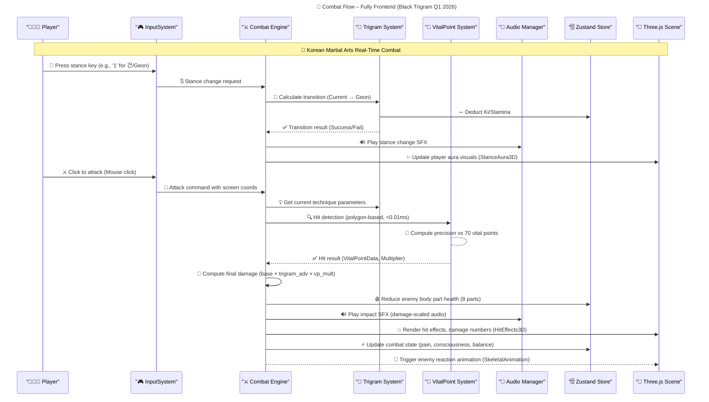
    InputSystem->>CombatEngine: 🎯 Attack command with screen coords
    CombatEngine->>TrigramSystem: 💡 Get current technique parameters
    CombatEngine->>VitalPointSystem: 🔍 Hit detection (range & bounding boxes)
    VitalPointSystem-->VitalPointSystem: 🎯 Compute precision vs 70 vital points
    VitalPointSystem-->>CombatEngine: ✅ Hit result (VitalPointData, Multiplier)
    CombatEngine->>CombatEngine: 🧮 Compute final damage (base × trigram_adv × vp_mult)
    CombatEngine->>StateStore: 🩸 Reduce enemy health
    CombatEngine->>AudioManager: 🔊 Play impact SFX (bone crack / muscle thud)
    CombatEngine->>PixiStage: 💥 Render hit sparks, blood, damage numbers (ParticlesLayer)
    CombatEngine->>StateStore: ⚡ Update visual state (enemy hit flag, UI flags)
    CombatEngine-->>PixiStage: 👺 Trigger enemy reaction animation (EnemyVisuals)
```

> **Note**
>
> - **InputSystem**: Lives in React (e.g., `CombatControls.tsx`), dispatching events to `CombatEngine`.
> - **CombatEngine**: Aggregates all combat logic in `CombatSystem.ts`.
> - **TrigramSystem**: Handles stance logic, technique lookup, state updates (Zustand).
> - **VitalPointSystem**: Performs in-memory geometry collision detection & returns multipliers.
> - **AudioManager**: Web Audio API plays sound buffers loaded at runtime from the Audio CDN.
> - **Three.js Scene**: Via `@react-three/fiber` Canvas component, renders 3D characters, environment, effects, and UI overlays via Html.
> - **Zustand Store**: All shared state (player health, Ki, stance) resides in memory; React components subscribe.

---

## ⚡ Security & Performance Architecture

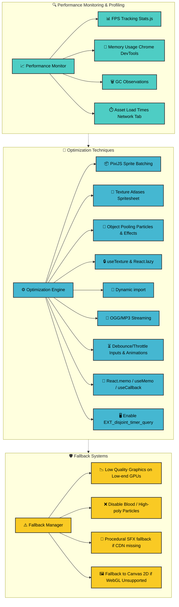

### **Performance Monitoring**

- **📈 FPS Tracking**: Integrate [Stats.js](https://github.com/mrdoob/stats.js/) to measure and display real-time framerate.
- **💾 Memory Usage**: Use Chrome DevTools to inspect memory footprint; watch for leaks when large particle sets spawn.
- **🗑️ GC Observations**: Monitor GC pauses when many objects (particles, temporary data) are created/destroyed; mitigate via object pooling.
- **⏱️ Asset Timing**: Leverage Network panel or custom timing code to measure JSON, texture, and audio load times from CDNs.

### **Optimization Techniques**

1. **📦 PixiJS Sprite Batching**

   - Group sprites sharing textures into batch draw calls (e.g., `ParticleContainer` for hit effects).
   - Use Pixi's `ParticleContainer` or `SpriteBatch` for high particle counts (ki energy, blood).

2. **🎨 Texture Atlases**

   - Combine character frames, UI icons, and particle frames into single spritesheets (e.g., `characters.json`, `particles.json`).
   - Minimizes WebGL texture switches, increasing draw performance.

3. **🔄 Object Pooling**

   - Pre-allocate particle/effect objects (blood splatter, ki orbs) and recycle instead of allocating new instances.
   - Pool frequently used objects (damage-number labels, aura filters) to reduce GC pressure.

4. **🔒 Asset Caching**

   - Custom `useTexture` hook: ensures textures load once and reuse across components.
   - Leverage browser-level caching (Cache-Control headers on CDN) to avoid re-fetching.

5. **📂 Code Splitting**

   - Lazy-load heavy modules: `TrainingScreen`, concept art galleries, large JSON data (non-MVP features).
   - Use dynamic `import()` to download code only when needed.

6. **🎵 Audio Compression & Streaming**

   - Store audio on CDN as compressed OGG/MP3.
   - Stream large background tracks, pre-decode short SFX in memory for low-latency playback.

7. **⏳ Debounce / Throttle**

   - Prevent rapid-fire input (stance spamming) from overwhelming main loop.
   - Throttle UI updates (animation triggers, combo pop-ups) using `useThrottle`/`useDebounce`.

8. **🧠 Memoization**

   - Use `React.memo` for pure UI components (`TrigramWheel`, `CombatHUD`) so they only re-render on relevant prop changes.
   - Leverage `useMemo` / `useCallback` for expensive calculations inside React components.

9. **🖥️ WebGL Extensions**

   - Enable `EXT_disjoint_timer_query` in PixiJS to gather GPU timing metrics for deeper profiling.

### **Fallback Systems (Graceful Degradation)**

1. **📉 Low Quality Mode**

   - Detect GPU capabilities at startup. If low, reduce canvas resolution and disable sub-pixel effects.
   - Toggle via "Low Graphics" checkbox in settings (Zustand flag: `useUIState.isLowGraphicsMode`).

2. **❌ Reduced Effects**

   - On performance drop (FPS < 30), disable expensive particles: blood splatter, continuous ki swirl.
   - Use `useUIState.isLowPerfMode` to toggle off these render layers.

3. **🎹 Procedural Audio**

   - If Audio CDN fails (e.g., offline), fall back to simple beep-thump procedural sounds via `DefaultSoundGenerator.ts`.

4. **🖼️ Canvas2D Fallback**

   - If WebGL unavailable (older browsers), switch to Canvas 2D renderer for core gameplay (no advanced particles, simplified effects).

---

## 📊 SWOT Analysis

### Traditional SWOT Quadrant Chart

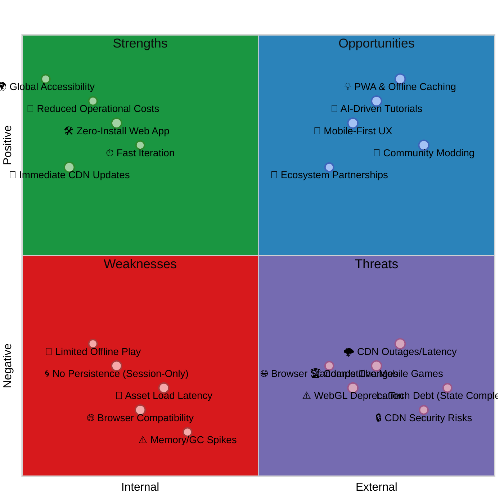

### Mindmap of Strengths

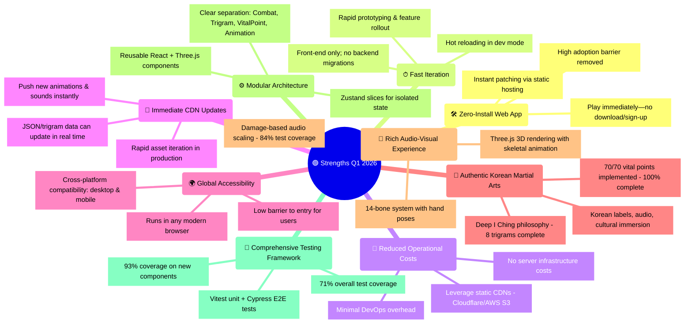

### Mindmap of Weaknesses

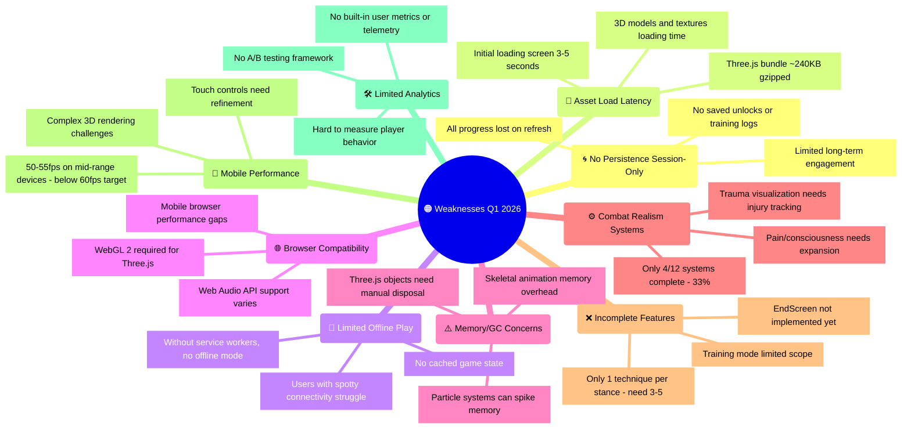

### Mindmap of Opportunities

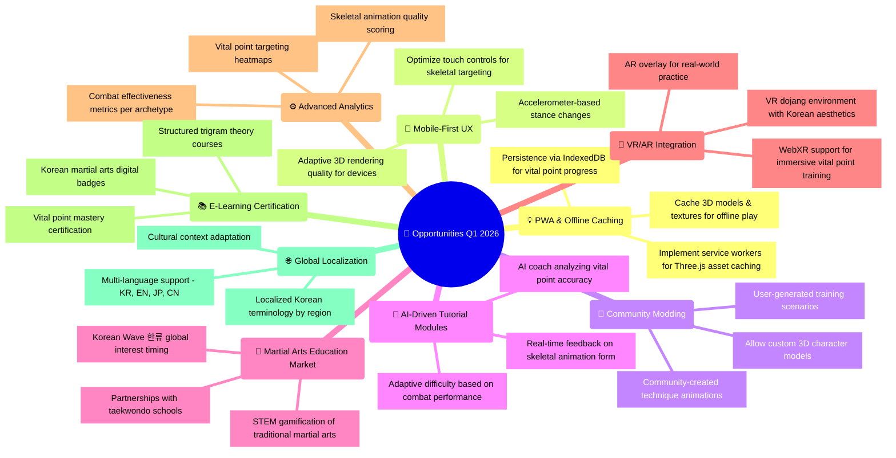

### Mindmap of Threats

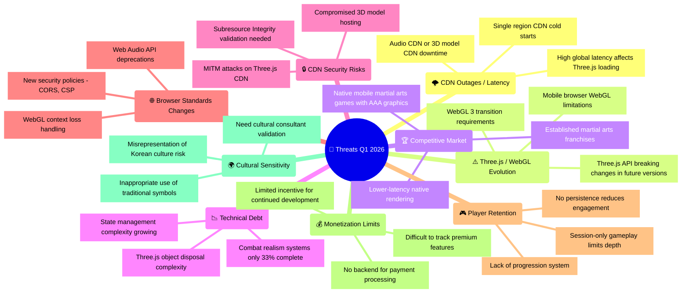
    id6(📶 Browser Standards Evolution)
      id6.1[Changes to ES modules affect bundling]
      id6.2[New security policies - CORS, CSP]
      id6.3[Deprecated features in future standards]
    id7(🎮 Player Retention Challenges)
      id7.1[Without persistence, limited engagement]
      id7.2[Lack of progression incentives]
      id7.3[Session-only gameplay limits depth]
    id8(💰 Monetization Limitations)
      id8.1[No backend for payment processing]
      id8.2[Limited ability to track purchases]
      id8.3[Difficult to implement premium features]
    id9(🌍 Cultural Sensitivity Issues)
      id9.1[Misrepresentation of Korean culture]
      id9.2[Inappropriate use of traditional symbols]
      id9.3[Lack of cultural consultant validation]
```

---

## 🎯 Core Game Concepts

### Player Archetypes & Combat Philosophy

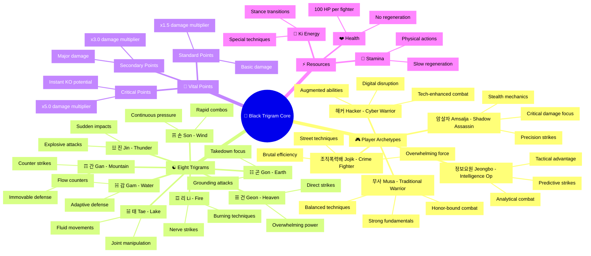

---

## 🏗️ Architecture Concepts

### System Architecture Layers

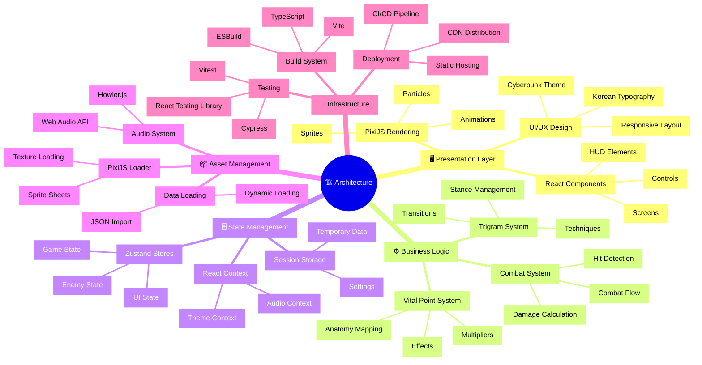

---

## 🔄 UX Flow

### User Journey Through Game

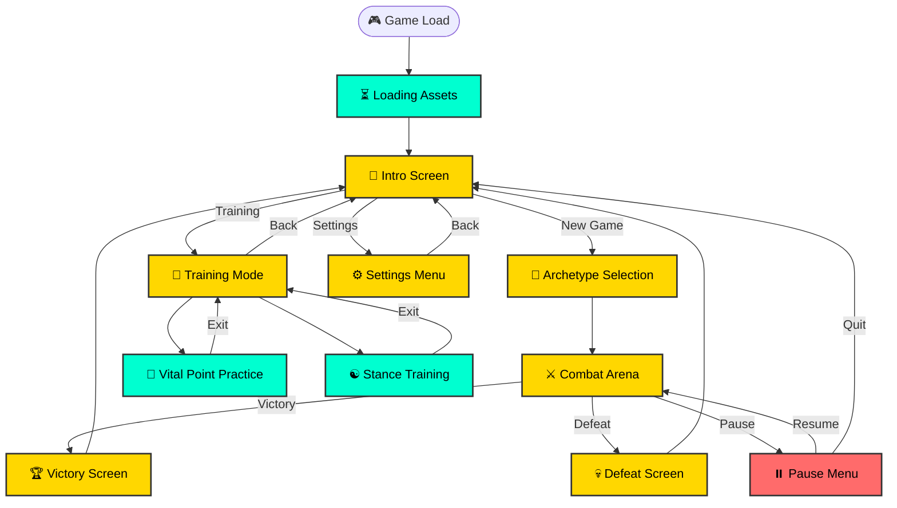

---

## 🔄 Combat Mechanics & Data Relationships

### Combat System Data Flow

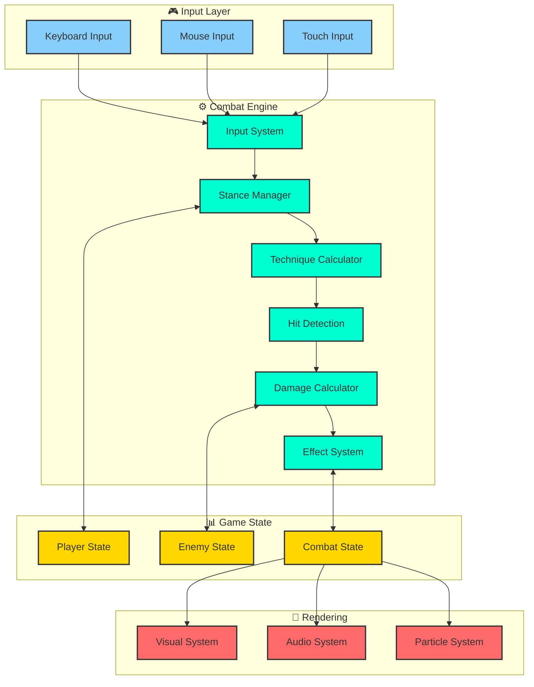

### Trigram Advantage Matrix

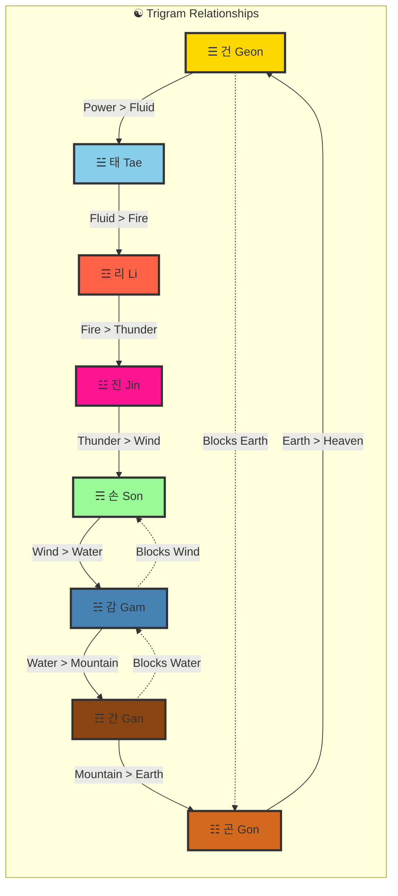

---

## 📈 Performance Optimization Strategy

### Resource Loading Pipeline

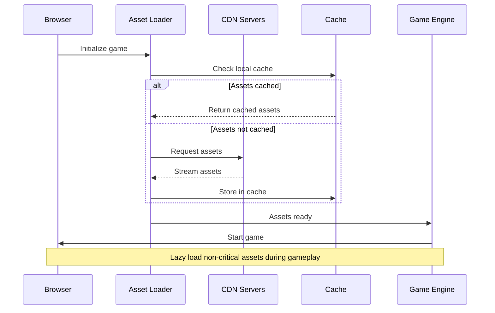

### Memory Management Strategy

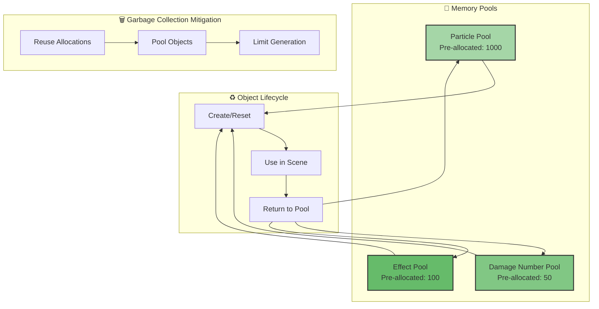

---

## 🔒 Security Considerations

### Frontend Security Architecture

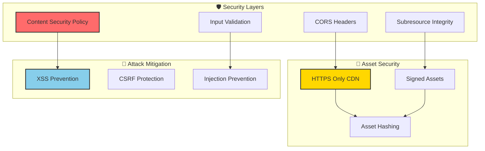

---

## 🚀 Deployment Architecture

### CI/CD Pipeline

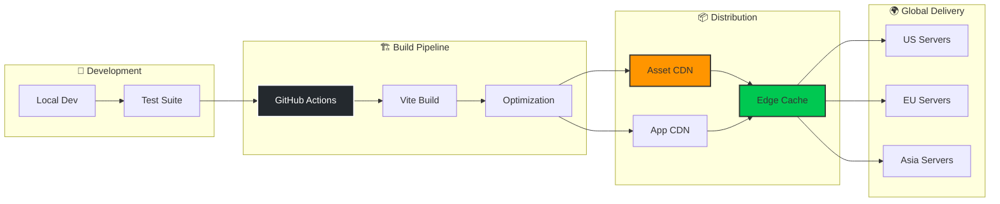

---

## 📊 Metrics & Monitoring

### Performance Monitoring Dashboard

```mermaid
graph TD
    subgraph "📈 Client Metrics"
        FPS[FPS Counter]
        MEM[Memory Usage]
        LAT[Input Latency]
        LOAD[Asset Load Time]
    end

    subgraph "📊 Game Metrics"
        DMG[Damage Dealt]
        ACC[Hit Accuracy]
        COMBO[Combo Success]
        TIME[Session Duration]
    end

    subgraph "🔍 Analytics"
        GA[Google Analytics]
        CUSTOM[Custom Events]
        ERROR[Error Tracking]
    end

    FPS --> GA
    MEM --> GA
    LAT --> CUSTOM
    LOAD --> CUSTOM

    DMG --> CUSTOM
    ACC --> CUSTOM
    COMBO --> CUSTOM
    TIME --> GA

    GA --> ERROR
    CUSTOM --> ERROR

    style FPS fill:#4CAF50,stroke:#333,stroke-width:2px
    style GA fill:#FFA726,stroke:#333,stroke-width:2px
    style ERROR fill:#EF5350,stroke:#333,stroke-width:2px
```

---

## 🎮 Future Architecture Considerations

### Potential Backend Integration

```mermaid
graph TD
    subgraph "Current: Frontend Only"
        FE[React + PixiJS]
        LOCAL[Local State]
        CDN[Static CDN]
    end

    subgraph "Future: Optional Backend"
        API[REST API]
        DB[Database]
        AUTH[Authentication]
        LEAD[Leaderboards]
        SAVE[Save Games]
    end

    FE -.->|Future Integration| API
    LOCAL -.->|Sync| DB
    CDN -.->|Dynamic Assets| API

    API --> AUTH
    API --> LEAD
    API --> SAVE

    style FE fill:#61DAFB,stroke:#333,stroke-width:2px
    style API fill:#FF6B6B,stroke:#333,stroke-width:2px,stroke-dasharray: 5 5
    style DB fill:#336791,stroke:#333,stroke-width:2px,stroke-dasharray: 5 5
```

---

## 📝 Architecture Decision Records (ADRs)

### ADR-001: Frontend-Only Architecture

**Status**: Accepted  
**Date**: 2024-01-01  
**Context**: Need to minimize operational complexity and maximize accessibility  
**Decision**: Build as purely frontend application with no backend dependencies  
**Consequences**:

- ✅ Zero server costs
- ✅ Instant deployment
- ✅ No database management
- ❌ No persistence
- ❌ Limited multiplayer options

### ADR-002: React + PixiJS Integration

**Status**: Accepted  
**Date**: 2024-01-01  
**Context**: Need powerful 3D rendering with modern React development  
**Decision**: Use @react-three/fiber for seamless Three.js integration  
**Consequences**:

- ✅ Best of both worlds (React + Three.js)
- ✅ Strong ecosystem (@react-three/drei helpers)
- ✅ Type safety with TypeScript
- ✅ Declarative 3D scene graph
- ❌ Learning curve for Three.js concepts
- ❌ Bundle size considerations

### ADR-003: Zustand for State Management

**Status**: Accepted  
**Date**: 2024-01-01  
**Context**: Need lightweight state management without Redux complexity  
**Decision**: Use Zustand for all global state  
**Consequences**:

- ✅ Minimal boilerplate
- ✅ TypeScript friendly
- ✅ DevTools support
- ❌ Less ecosystem than Redux
- ❌ Need custom persistence layer

---

## 🏁 Conclusion

Black Trigram's architecture represents a modern approach to browser-based gaming, leveraging cutting-edge web technologies while maintaining simplicity through its frontend-only design. The modular architecture supports rapid iteration and easy deployment while providing a rich, culturally authentic gaming experience.

### Key Architectural Strengths:

- **Zero Backend Complexity**: Pure frontend eliminates server management
- **Modular Design**: Clear separation of concerns across systems
- **Performance Focused**: Optimization strategies baked into architecture
- **Culturally Rich**: Deep integration of Korean martial arts philosophy
- **Developer Friendly**: TypeScript, modern React, comprehensive testing

### Areas for Future Enhancement:

- **Persistence Layer**: Optional backend for save games
- **Multiplayer Support**: WebRTC or server-based PvP
- **Advanced Analytics**: Deeper player behavior tracking
- **Mobile Optimization**: Native app wrapper or PWA
- **Content Expansion**: More stances, techniques, and vital points

The architecture is designed to scale with the game's ambitions while maintaining the core philosophy of accessibility, authenticity, and engaging combat mechanics.

---

**흑괘의 길을 걸어라** - _Walk the Path of the Black Trigram_

---

## 📚 Related Documents

### 🔐 ISMS Policies
- [🔐 Information Security Policy](https://github.com/Hack23/ISMS-PUBLIC/blob/main/Information_Security_Policy.md) - Overall security governance
- [🛠️ Secure Development Policy](https://github.com/Hack23/ISMS-PUBLIC/blob/main/Secure_Development_Policy.md) - Security-integrated SDLC
- [🏷️ Classification Framework](https://github.com/Hack23/ISMS-PUBLIC/blob/main/CLASSIFICATION.md) - Business impact analysis

### 🛡️ Black Trigram Documentation
- [🛡️ Security Architecture](./SECURITY_ARCHITECTURE.md) - Security implementation
- [🔮 Future Architecture](./FUTURE_ARCHITECTURE.md) - Planned system evolution
- [⚔️ Combat Architecture](./COMBAT_ARCHITECTURE.md) - Combat system design
- [🎯 Threat Model](./THREAT_MODEL.md) - Security threat analysis
- [🔄 Workflows](./WORKFLOWS.md) - CI/CD security automation
- [🔧 Development Guide](./development.md) - Security features

---

**📋 Document Control:**  
**✅ Approved by:** James Pether Sörling, CEO  
**📤 Distribution:** Public  
**🏷️ Classification:** [](https://github.com/Hack23/ISMS-PUBLIC/blob/main/CLASSIFICATION.md#confidentiality-levels) [](https://github.com/Hack23/ISMS-PUBLIC/blob/main/CLASSIFICATION.md#integrity-levels) [](https://github.com/Hack23/ISMS-PUBLIC/blob/main/CLASSIFICATION.md#availability-levels)  
**📅 Effective Date:** 2025-01-15  
**⏰ Next Review:** 2025-04-15  
**🎯 Framework Compliance:** [](https://github.com/Hack23/ISMS-PUBLIC/blob/main/CLASSIFICATION.md) [](https://github.com/Hack23/ISMS-PUBLIC/blob/main/CLASSIFICATION.md) [](https://github.com/Hack23/ISMS-PUBLIC/blob/main/CLASSIFICATION.md)
