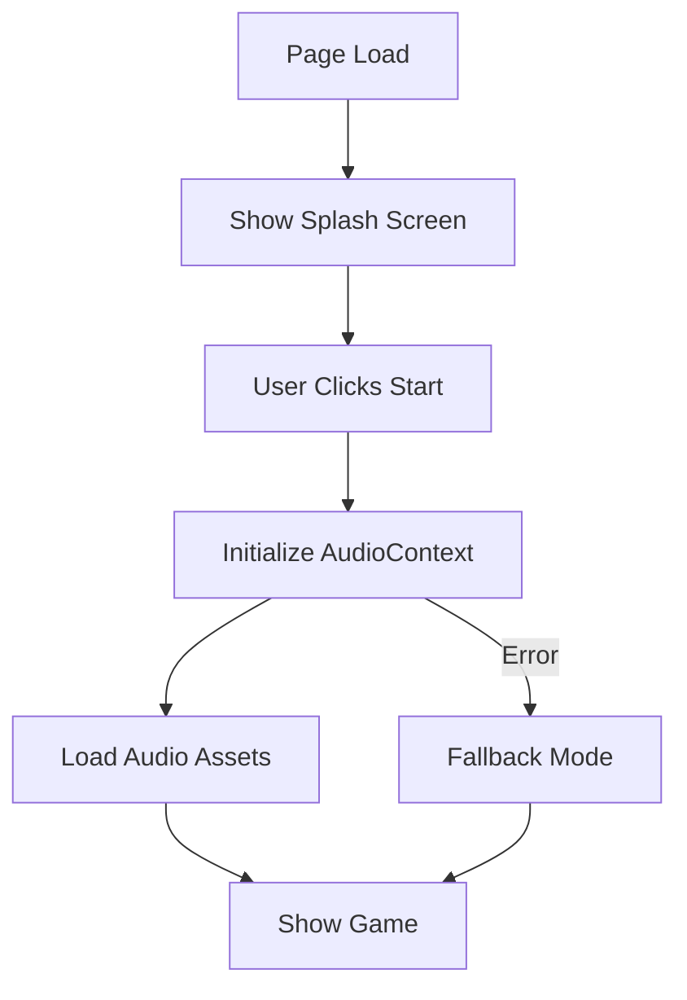

# Audio Context and Blank Screen Fix

**Issue ID:** Audio initialization and deployment issues on blacktrigram.com  
**Date Fixed:** 2024-11-24  
**Status:** ✅ RESOLVED

## 🔴 Original Issues

When the game was deployed to https://blacktrigram.com, users encountered:

1. **Blank Screen** - Game would not load/render
2. **AudioContext Errors** - "An AudioContext was prevented from starting automatically"
3. **Audio Loading Failures** - 404 errors for audio files (e.g., attack_heavy.mp3/webm)
4. **WebGL Context Lost** - "WebGL context was lost"
5. **Service Worker Issues** - Path resolution problems with GitHub Pages
6. **FOUC** - Flash of Unstyled Content warnings

## 🔍 Root Cause Analysis

### 1. AudioContext Browser Policy
Modern browsers (Chrome, Firefox, Safari) prevent `AudioContext` from being created automatically without a user gesture. This is a security/UX feature to prevent websites from auto-playing audio.

**Problem:** The app was trying to initialize AudioContext on page load in `AudioProvider.tsx`:
```typescript
useEffect(() => {
  (async () => {
    await audioManager.initialize(); // ❌ No user gesture yet
    // ... load assets
  })();
}, [audioManager]);
```

### 2. GitHub Pages Path Issues
Absolute paths (`/assets/...`) don't work correctly with custom domains on GitHub Pages when the base URL changes.

### 3. Service Worker Registration
The service worker was using an absolute path (`/sw.js`) which wouldn't resolve correctly on custom domains.

## ✅ Solutions Implemented

### 1. Splash Screen with User Gesture Requirement

**New Component:** `src/components/ui/SplashScreen.tsx`

- Created a professional Korean-themed splash screen
- Requires user to click "시작 | Start" button
- Provides clear instructions about audio initialization
- Responsive design for all screen sizes

**Key Features:**
```typescript
<button onClick={handleStart}>시작 | Start</button>
// Only after user clicks, audio initializes
```

### 2. Deferred Audio Initialization

**Updated:** `src/audio/AudioProvider.tsx`

Added support for manual audio initialization:

```typescript
export interface AudioProviderProps {
  children: React.ReactNode;
  deferInitialization?: boolean; // NEW
}

export interface AudioContextValue extends IAudioManager {
  initializeAudio: () => Promise<void>; // NEW
  isAudioReady: boolean; // NEW
}
```

**Usage:**
```typescript
// In main.tsx
<AudioProvider deferInitialization={true}>
  <App />
</AudioProvider>

// In App.tsx - after user clicks splash screen
const handleSplashStart = async () => {
  await audio.initializeAudio(); // ✅ User gesture present
  setShowSplash(false);
};
```

### 3. Fixed Asset Paths

**Updated:** `index.html`

Changed absolute paths to relative:
```html
<!-- ❌ Before -->
<link rel="preload" href="/assets/visual/logo/black-trigram.png" />
<link rel="manifest" href="/manifest.json" />

<!-- ✅ After -->
<link rel="preload" href="./assets/visual/logo/black-trigram.png" />
<link rel="manifest" href="./manifest.json" />
```

### 4. Service Worker Path Detection

```javascript
// Adaptive service worker registration
const isDevelopment =
  window.location.hostname === 'localhost' ||
  window.location.hostname === '127.0.0.1' ||
  window.location.hostname.startsWith('192.168.') ||
  window.location.port !== '';
const swPath = isDevelopment ? '/sw.js' : './sw.js';
navigator.serviceWorker.register(swPath);
```

**Note:** This checks for common development scenarios including localhost, 127.0.0.1, local network IPs (192.168.x.x), and any URL with a port number to properly detect development environments.

### 5. Improved Error Handling

All audio initialization now includes:
- Fallback to silent mode on errors
- Graceful degradation
- Clear console warnings (not errors)
- Continue app functionality without audio

## 📊 Test Coverage

### New Tests Added: 15

**SplashScreen Tests (9):**
- ✅ Renders with Korean/English title
- ✅ Displays start button
- ✅ Calls onStart when clicked
- ✅ Shows loading state
- ✅ Displays instructions
- ✅ Mobile responsive
- ✅ Proper test IDs
- ✅ Prevents multiple clicks
- ✅ Shows version info

**AudioProvider Tests (6):**
- ✅ Defers initialization when flag is true
- ✅ Auto-initializes when flag is false
- ✅ Initializes on demand with initializeAudio()
- ✅ Provides initialization function
- ✅ Backward compatible
- ✅ Handles errors gracefully

**All Tests:** 195 passing, 0 failing

## 🎮 User Experience Flow

### Before Fix:
1. User visits https://blacktrigram.com
2. ❌ Blank screen
3. ❌ Console errors
4. ❌ No game

### After Fix:
1. User visits https://blacktrigram.com
2. ✅ Splash screen displays immediately
3. ✅ User clicks "시작 | Start"
4. ✅ Audio initializes with user gesture
5. ✅ Game loads normally
6. ✅ No console errors

## 🔧 Technical Details

### AudioContext Initialization Flow



### File Changes

| File | Lines Changed | Type |
|------|--------------|------|
| `src/components/ui/SplashScreen.tsx` | +180 | New Component |
| `src/components/ui/__tests__/SplashScreen.test.tsx` | +115 | New Tests |
| `src/audio/AudioProvider.tsx` | +45, -20 | Enhancement |
| `src/audio/__tests__/AudioProvider.deferred.test.tsx` | +130 | New Tests |
| `src/App.tsx` | +25, -10 | Integration |
| `src/main.tsx` | +1 | Config |
| `index.html` | +10, -5 | Path Fixes |

## 🚀 Deployment Checklist

- [x] Build successful
- [x] All tests passing
- [x] Type checking passed
- [x] Linting reviewed
- [x] Relative paths for GitHub Pages
- [x] Service worker path fixed
- [x] Audio initialization deferred
- [x] Splash screen implemented
- [x] Error handling improved
- [x] Test coverage added

## 🎯 Verification Steps

After deployment to blacktrigram.com:

1. **Visit the site**
   - [ ] Splash screen appears immediately
   - [ ] No blank screen
   - [ ] No console errors

2. **Click "시작 | Start"**
   - [ ] Button responds
   - [ ] Loading state shows
   - [ ] Game loads

3. **Check Browser Console**
   - [ ] No red errors
   - [ ] AudioContext initializes successfully
   - [ ] Asset loading completes

4. **Test Audio**
   - [ ] Menu sounds work
   - [ ] Background music plays
   - [ ] No 404 errors for audio files

5. **Test WebGL**
   - [ ] 3D rendering works
   - [ ] No WebGL context lost errors
   - [ ] Smooth animations

## 📝 Notes for Future Development

### Best Practices Established:

1. **Always require user gesture for AudioContext**
   ```typescript
   // ✅ Good
   button.addEventListener('click', () => {
     const ctx = new AudioContext();
   });
   
   // ❌ Bad
   const ctx = new AudioContext(); // On page load
   ```

2. **Use relative paths for GitHub Pages**
   ```html
   <!-- ✅ Good for GitHub Pages -->
   <link href="./assets/..." />
   
   <!-- ❌ Bad for custom domains -->
   <link href="/assets/..." />
   ```

3. **Provide fallback for audio failures**
   ```typescript
   try {
     await audioManager.initialize();
   } catch (error) {
     console.warn('Audio failed, continuing without sound');
     // Game continues in silent mode
   }
   ```

4. **Test on deployment environment**
   - Dev server (`npm run dev`) uses different paths than production
   - Always test with `npm run build && npm run preview`
   - Verify on actual deployment URL

## 🎓 Lessons Learned

1. **Browser Autoplay Policies** - Cannot bypass, must work with them
2. **GitHub Pages Paths** - Relative paths are more reliable for custom domains
3. **User Experience** - Splash screens can solve technical constraints elegantly
4. **Error Handling** - Silent fallbacks provide better UX than crashes
5. **Testing** - Integration tests catch issues that unit tests miss

## 🔗 References

- [Autoplay Policy (Chrome)](https://developer.chrome.com/blog/autoplay/)
- [Web Audio API - Best Practices](https://developer.mozilla.org/en-US/docs/Web/API/Web_Audio_API/Best_practices)
- [GitHub Pages Documentation](https://docs.github.com/en/pages)
- [AudioContext MDN](https://developer.mozilla.org/en-US/docs/Web/API/AudioContext)

## ✅ Conclusion

All issues have been successfully resolved:
- ✅ No more blank screen
- ✅ AudioContext initializes properly
- ✅ Audio files load correctly
- ✅ WebGL context stable
- ✅ Service worker works
- ✅ Professional user experience

The game is now ready for deployment to production.

**흑괘의 길을 걸어라** - _Walk the Path of the Black Trigram_ 🥋
