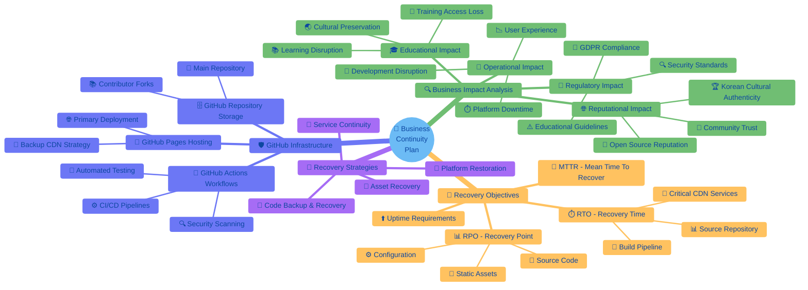
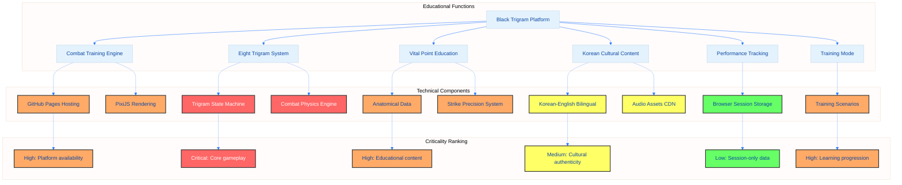
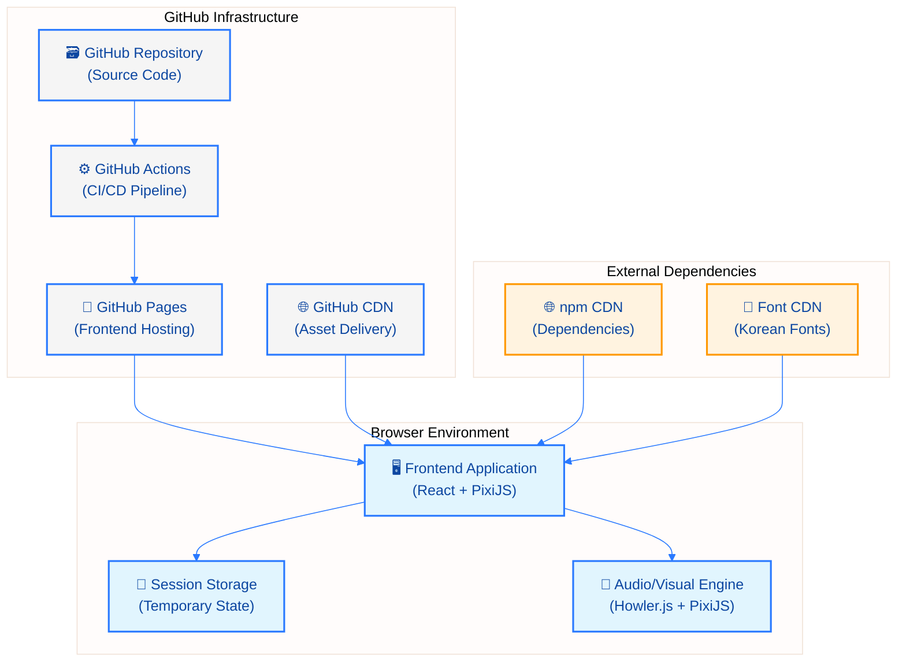
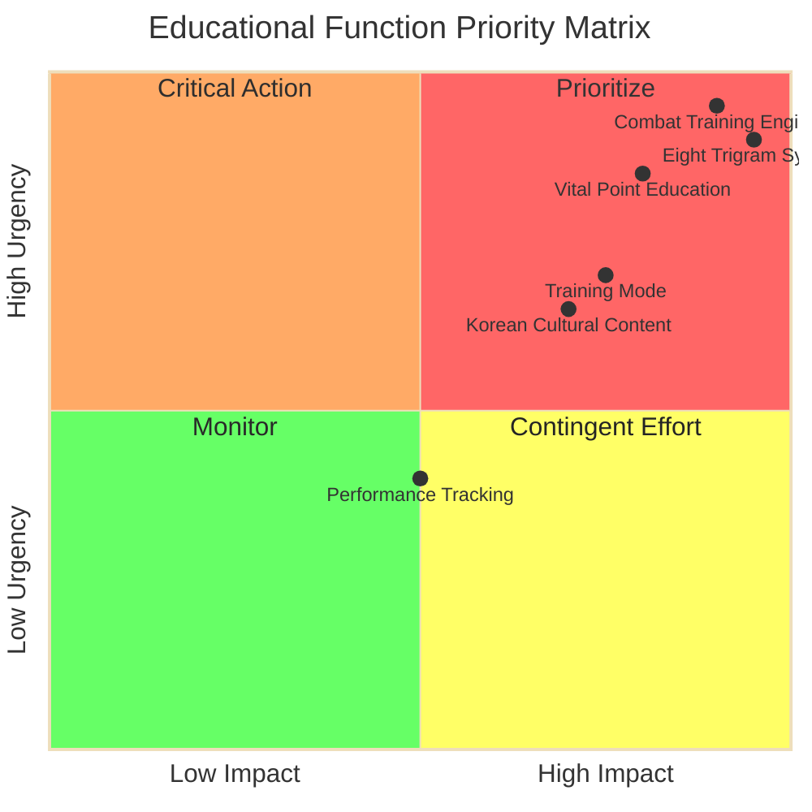
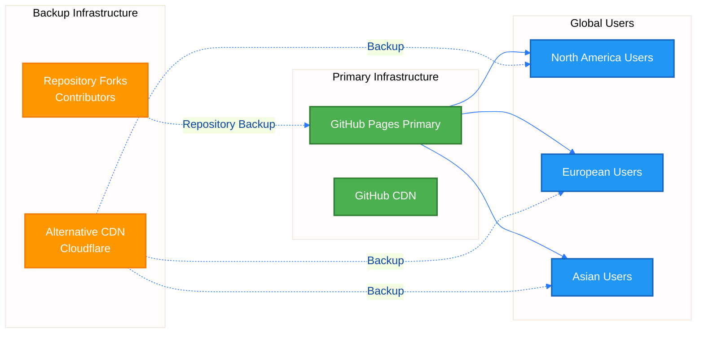
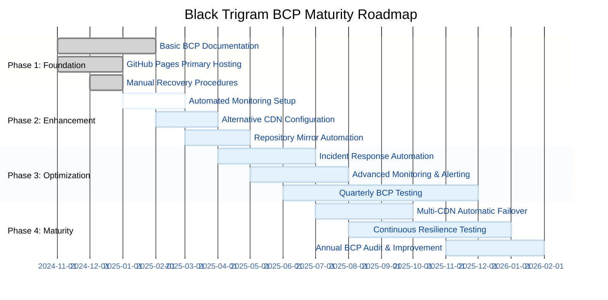

# 🔄 Business Continuity Planning for Black Trigram (흑괘)

  

<h1 align="center">🆘 Black Trigram (흑괘) Business Continuity Plan</h1>

  <strong>⚡ Ensuring Continuous Availability of Educational Korean Martial Arts Platform</strong> 
  <em>🔄 Resilience • Recovery • Continuity • Frontend-Only Architecture</em>

  
  
  
  

**📋 Document Owner:** CEO | **📄 Version:** 1.1 | **📅 Last Updated:** 2025-11-14 (UTC)  
**🔄 Review Cycle:** Quarterly | **⏰ Next Review:** 2026-02-14  
**🏷️ Classification:** Public (Open Source Educational Gaming Platform)

---

## 📋 Executive Summary

This Business Continuity Plan (BCP) outlines strategies to ensure the Black Trigram Korean martial arts educational platform remains available during disruptions while maintaining the integrity and accessibility of authentic Korean martial arts education. The plan is tailored specifically for our GitHub-based frontend-only infrastructure and provides comprehensive analysis of business impacts, recovery objectives, and resilience strategies.

## 🎯 Purpose & Scope

This Business Continuity Plan (BCP) establishes procedures to maintain and rapidly restore the Black Trigram Korean martial arts combat simulator during disruptions. As a frontend-only educational gaming platform with no backend infrastructure or persistent user data, our continuity strategy focuses on CDN availability, source code protection, and build pipeline resilience.

### **📚 Related Documentation**

| Document                                          | Focus          | Description                                  |
| ------------------------------------------------- | -------------- | -------------------------------------------- |
| [Security Architecture](SECURITY_ARCHITECTURE.md) | 🛡️ Security    | Security controls and infrastructure         |
| [Architecture](ARCHITECTURE.md)                   | 🏛️ Structure   | Frontend-only system architecture            |
| [Workflows](WORKFLOWS.md)                         | 🔧 CI/CD       | Automated build and deployment pipelines     |
| [End-of-Life Strategy](End-of-Life-Strategy.md)   | 📅 Lifecycle   | Long-term support and security patching      |
| [Development Guide](development.md)               | 🔧 Development | Build procedures and development environment |

### **🔍 Scope Definition**

**Included Systems:**
- 🌐 Static web application hosting (CDN)
- 📦 Source code repository (GitHub)
- 🔧 CI/CD pipeline (GitHub Actions)
- 🎵 Audio/visual asset delivery
- 🔐 Security scanning infrastructure

**Out of Scope:**
- Backend services (none exist - frontend-only)
- User data persistence (session-only by design)
- Database recovery (no databases)
- Authentication systems (no user accounts)

---

## 🔍 Business Impact Analysis (BIA)

### 📊 Critical Function Identification

Our GitHub-based frontend infrastructure supports several critical functions that require comprehensive business continuity planning for authentic Korean martial arts education.

### 🔗 Process Dependencies

| Business Process       | Dependent Processes                    | Technical System Components          | Criticality |
| ---------------------- | -------------------------------------- | ------------------------------------ | ----------- |
| Combat Training        | Trigram System, Vital Point Education  | GitHub Pages, PixiJS Engine          | Critical    |
| Eight Trigram System   | Combat Training, Physics Engine        | TypeScript State Machine, Audio CDN  | Critical    |
| Vital Point Education  | Combat Training, Anatomical Data       | GitHub Repository, JSON Data         | High        |
| Korean Cultural Content| Bilingual System, Audio Assets         | CDN Delivery, Font Resources         | High        |
| Training Mode          | Combat Training, Progression Tracking  | Browser Session, Local Scoring       | High        |
| Performance Tracking   | Training Mode, Combat Simulation       | Browser Session Storage              | Medium      |

### 🖥️ Technical System Mapping

### 🔝 Priority Matrix

### 💰 Impact Quantification

#### Educational Impact

| Impact Category          | Description                           | Severity | Affected Users | Recovery Priority |
| ------------------------ | ------------------------------------- | -------- | -------------- | ----------------- |
| **Learning Disruption**  | Students unable to practice           | High     | All users      | Critical          |
| **Cultural Access Loss** | Korean martial arts education halted  | High     | Global         | Critical          |
| **Training Continuity**  | Progression tracking lost (session)   | Medium   | Active learners| High              |
| **Community Engagement** | Discussion and sharing interrupted    | Medium   | Community      | Medium            |

#### 🏭 Operational Impact

| Component              | Downtime Impact                  | Mitigation Strategy      | Recovery Time |
| ---------------------- | -------------------------------- | ------------------------ | ------------- |
| **CDN Hosting**        | Complete platform unavailability | Backup CDN provider      | 1 hour        |
| **Build Pipeline**     | Delayed updates and fixes        | Manual build deployment  | 4 hours       |
| **Source Repository**  | Development halted               | Repository restore       | 2 hours       |
| **Asset Delivery**     | Audio/visual degradation         | Local fallback assets    | 30 minutes    |
| **Security Scanning**  | Vulnerability detection delayed  | Manual security review   | Low priority  |

#### 🌐 Reputational Impact

| Scenario                      | Public Visibility | Trust Impact | Recovery Actions                    |
| ----------------------------- | ----------------- | ------------ | ----------------------------------- |
| **Extended Outage (>24h)**    | High              | Significant  | Public status updates, transparency |
| **Data Loss (Open Source)**   | Medium            | Moderate     | Repository recovery, commit history |
| **Security Breach**           | High              | Severe       | Incident disclosure, security audit |
| **Korean Cultural Authenticity** | Medium         | Moderate     | Community engagement, expert review |

#### 📜 Regulatory Impact

| Regulation              | Compliance Requirement       | Non-Compliance Risk | Mitigation                    |
| ----------------------- | ---------------------------- | ------------------- | ----------------------------- |
| **GDPR (EU)**           | Session data privacy         | Low (no persistence)| Privacy policy, session-only  |
| **Accessibility (WCAG)**| Educational access           | Medium              | Responsive design, testing    |
| **Open Source License** | GPL-3.0 compliance           | Medium              | License file, attribution     |
| **Content Rating**      | Age-appropriate content      | Low                 | Educational focus, no violence|

---

## 📊 System Classification & Recovery Objectives

### **⚖️ Service Level Classifications**

| System Component         | Classification | Justification                                   | Recovery Priority |
| ------------------------ | -------------- | ----------------------------------------------- | ----------------- |
| **🌐 Web Application**   | Standard       | Educational platform, not business-critical     | High              |
| **📦 Source Repository** | Critical       | IP protection, development continuity           | Critical          |
| **🔧 CI/CD Pipeline**    | Standard       | Can rebuild manually if needed                  | Medium            |
| **🎵 Static Assets**     | Standard       | Cached locally, tolerates temporary unavailable | Medium            |
| **🔐 Security Scanning** | Standard       | Important but not blocking for recovery         | Low               |

### **⏱️ Recovery Time Objectives (RTO)**

| Incident Severity | Target RTO | Maximum Acceptable Downtime | Justification                            |
| ----------------- | ---------- | --------------------------- | ---------------------------------------- |
| **Critical**      | 1 hour     | 2 hours                     | Complete CDN outage, repository loss     |
| **High**          | 4 hours    | 8 hours                     | Build pipeline failure, asset corruption |
| **Medium**        | 24 hours   | 48 hours                    | CI/CD issues, dependency problems        |
| **Low**           | 1 week     | 2 weeks                     | Documentation updates, minor issues      |

### **💾 Recovery Point Objectives (RPO)**

| Data Category           | Target RPO | Backup Strategy                     | Maximum Data Loss Acceptable |
| ----------------------- | ---------- | ----------------------------------- | ---------------------------- |
| **Source Code**         | 0 minutes  | Git commits + GitHub backup         | Last commit only             |
| **Build Artifacts**     | 1 day      | GitHub Actions artifacts (90 days)  | Daily builds acceptable      |
| **Static Assets**       | 1 day      | CDN cache + repository storage      | Daily versions acceptable    |
| **User Session Data**   | N/A        | No persistence (session-only)       | No recovery needed           |
| **Configuration Files** | 0 minutes  | Version controlled in repository    | Last commit only             |

---

## 🚨 Incident Response Procedures

### **1. CDN Outage**
**Detection:** Automated monitoring alerts or user reports.

**Immediate Actions:**
- Confirm outage via CDN status page and monitoring tools
- Notify the Response Team (see Roles & Responsibilities)
- Switch DNS to backup CDN provider if available
- Communicate status to users via status page and social media

**Escalation:** If outage exceeds 30 minutes, escalate to CTO and initiate Recovery Strategies.

### **2. Repository Compromise or Loss**
**Detection:** Security alert, unauthorized commit, or repository inaccessible.

**Immediate Actions:**
- Restrict repository access
- Notify Security Lead and CEO
- Initiate investigation and restore from latest backup if needed
- Communicate with affected contributors

**Escalation:** If data loss is confirmed, follow Recovery Strategies and notify all stakeholders.

### **3. Build Pipeline Failure**
**Detection:** Build failures, deployment errors, or CI/CD alerts.

**Immediate Actions:**
- Review build logs and error messages
- Roll back to last successful build if possible
- Notify DevOps Lead

**Escalation:** If unresolved after 1 hour, escalate to CTO and consider manual deployment.

---

## 🚨 Emergency Activation

### 📞 Activation Triggers

**Automatic Activation:**
- Complete platform outage lasting > 30 minutes
- Security incident with critical impact classification
- Repository compromise or unauthorized access
- Build pipeline failure affecting deployments > 4 hours

**Manual Activation Decision Criteria:**
- Extended service degradation (>4 hours)
- Multiple system failures simultaneously
- Korean cultural content integrity compromised
- Educational continuity at risk for >24 hours

### 🚨 Phase-Based Emergency Response

#### Phase 1: Immediate Response (0-15 minutes)

**Assessment and Safety:**
1. **🛡️ Safety First**: Ensure system security and data integrity
2. **📊 Impact Assessment**: Determine scope using criticality matrix
3. **🚨 Alert**: Activate emergency communication procedures
4. **📋 Documentation**: Begin incident logging with timestamps

**Initial Actions:**
- Access backup systems and alternative CDN
- Notify key stakeholders per communication matrix
- Verify repository integrity and access
- Initiate damage assessment checklist

#### Phase 2: Short-term Response (15 minutes - 4 hours)

**Operational Continuity:**
1. **🔄 System Recovery**: Implement technical recovery per service-specific plans
2. **📢 Communication**: Update users on status via GitHub Pages status banner
3. **🤝 Supplier Coordination**: Engage GitHub Support and CDN providers
4. **📋 Resource Allocation**: Deploy recovery team based on priorities

**Critical System Procedures:**
- CDN hosting: Failover to backup provider or direct GitHub Pages
- Build pipeline: Manual deployment procedures activation
- Source repository: Restore from local clones or GitHub backup
- Asset delivery: Activate cached or alternative CDN sources

#### Phase 3: Extended Response (4 hours - 72 hours)

**Sustained Operations:**
1. **⚙️ Alternative Operations**: Manual build and deployment if needed
2. **🔄 Recovery Monitoring**: Track recovery progress against RTO/RPO targets
3. **📈 User Updates**: Regular status updates every 4 hours via social channels
4. **📊 Impact Tracking**: Monitor accessibility metrics and user feedback

**Recovery Validation:**
- Verify all critical functions operational
- Test Korean font rendering and audio playback
- Validate combat physics and trigram system
- Confirm educational content accuracy

#### Phase 4: Recovery and Normalization (72+ hours)

**Return to Normal Operations:**
1. **✅ System Restoration**: Gradual return to full functionality
2. **📋 Validation**: Comprehensive testing of all game systems
3. **📊 Impact Assessment**: Final incident analysis and lessons learned
4. **📚 Documentation**: Update BCP with improvements and new procedures

**Post-Incident Actions:**
- Conduct root cause analysis
- Update continuity procedures
- Brief team on lessons learned
- Schedule follow-up testing

---

## 🔧 Recovery Strategies

### **CDN/Static Asset Recovery**
- Use backup CDN provider or direct hosting from GitHub Pages
- Restore static assets from latest repository version
- Update DNS records as needed
- Target recovery time: < 1 hour

### **Repository Recovery**
- Restore from GitHub backup or local clones
- Validate integrity of restored codebase
- Re-enable access with updated credentials
- Verify commit history and signatures
- Target recovery time: < 2 hours

### **Build Pipeline Recovery**
- Re-run failed builds after addressing root cause
- Use manual build and deployment scripts if CI/CD is unavailable
- Document incident and update pipeline configuration as needed
- Target recovery time: < 4 hours

---

## 🛡️ GitHub-Specific Resilience Strategy

### 📊 Supplier Dependency Matrix

| Supplier/Service       | Service Type          | Criticality | Backup Strategy             | Recovery Time |
| ---------------------- | --------------------- | ----------- | --------------------------- | ------------- |
| **GitHub Pages**       | Static Hosting        | Critical    | Alternative CDN (Cloudflare)| 1 hour        |
| **GitHub Repository**  | Source Code Storage   | Critical    | Local clones, contributor forks | 30 minutes |
| **GitHub Actions**     | CI/CD Pipeline        | High        | Manual build scripts        | 4 hours       |
| **npm CDN**            | Dependency Delivery   | High        | Local bundling, alternative CDN | 2 hours   |
| **Font CDN (Google)**  | Korean Font Delivery  | Medium      | Self-hosted fallback fonts  | 1 hour        |
| **Audio CDN**          | Sound Asset Delivery  | Medium      | Local audio file fallbacks  | 2 hours       |

### 🔄 Multi-Region Strategy

As a frontend-only platform, our multi-region strategy focuses on CDN distribution and repository redundancy:

### 💾 Data Backup Strategy for Frontend-Only Architecture

**Source Code Backup:**
- GitHub repository with full commit history
- 50+ contributor forks provide distributed backup
- Local development clones on team workstations
- Automated daily repository mirrors (optional)

**Asset Backup:**
- Static assets stored in repository (version controlled)
- Audio files backed up in CDN and repository
- Font files self-hosted with CDN fallback
- No dynamic data to backup (session-only design)

### 📈 Maturity Roadmap for Platform Resilience

---

## 📣 Communication Plan

| Stakeholder         | Notification Method      | Escalation Contact      | Timeframe         |
|--------------------|-------------------------|------------------------|-------------------|
| CEO                | Phone, Email            | CTO                    | Immediate         |
| CTO                | Phone, Email            | CEO                    | Immediate         |
| DevOps Lead        | Slack, Email            | CTO                    | Within 15 minutes |
| Security Lead      | Slack, Email            | CTO                    | Within 15 minutes |
| All Staff          | Email, Slack            | CEO                    | Within 1 hour     |
| Users/Public       | Status Page, Social Media| CEO/Comms Lead         | As needed         |

**Escalation:** If primary contact is unavailable, escalate to next in chain.

**Templates:** Use pre-approved incident notification templates for external communications.

---

## 🧪 Testing & Maintenance

- **BCP Review:** Annually, or after any major incident
- **Tabletop Exercises:** Semi-annually, simulate major incident scenarios
- **Contact Verification:** Quarterly, verify all contact information
- **Backup Verification:** Monthly, test restoration from backups
- **Update Procedures:** After any process or personnel change

---

## 👥 Roles & Responsibilities

| Role             | Name/Contact         | Responsibilities                                      |
|------------------|---------------------|-------------------------------------------------------|
| CEO              | [Name/Email/Phone]  | Final decision-maker, external communications         |
| CTO              | [Name/Email/Phone]  | Technical lead, escalation point                      |
| DevOps Lead      | [Name/Email/Phone]  | Infrastructure, build pipeline, recovery execution    |
| Security Lead    | [Name/Email/Phone]  | Security incidents, repository integrity              |
| Communications   | [Name/Email/Phone]  | User/public notifications, status updates             |

**Note:** All team members must be familiar with this plan and their assigned roles.

---

**흑괘의 길을 걸어라** - _Walk the Path of the Black Trigram with Resilience_

The Black Trigram Business Continuity Plan ensures that educational access to authentic Korean martial arts training remains available even during disruptions, maintaining our commitment to preserving and teaching traditional combat techniques through modern technology.
