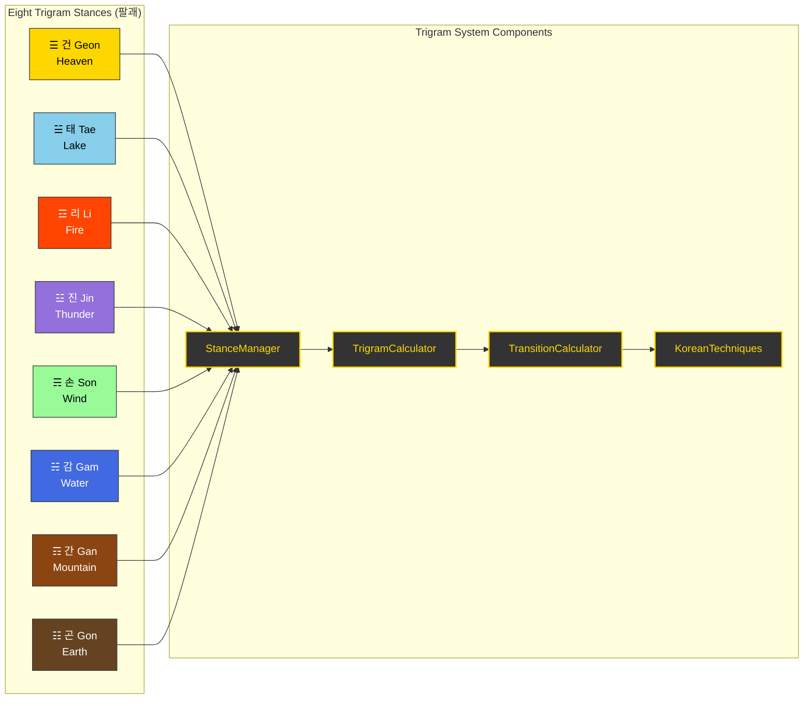
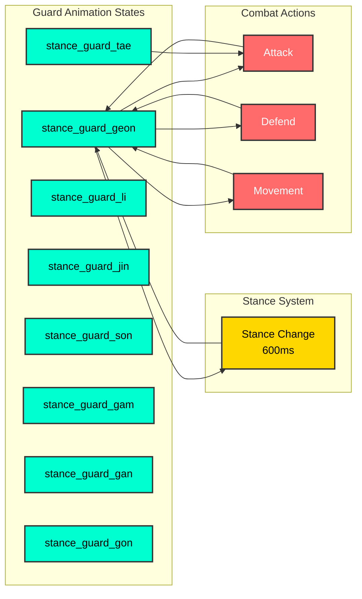
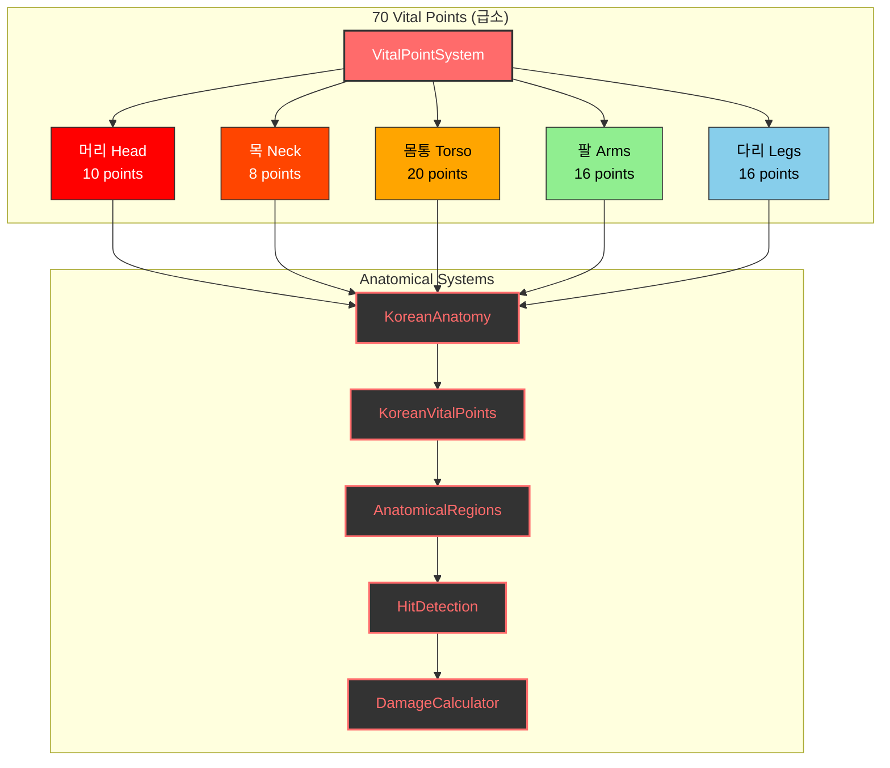
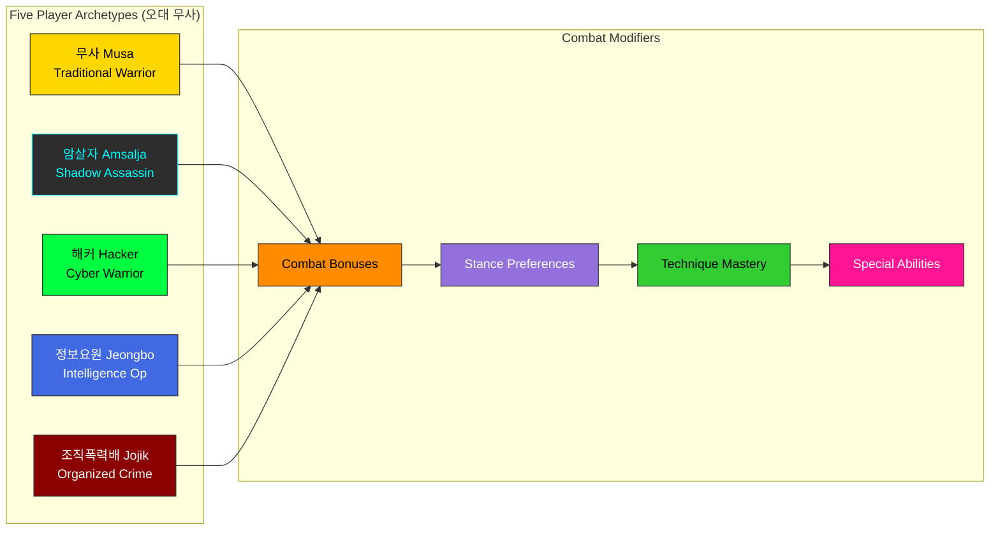
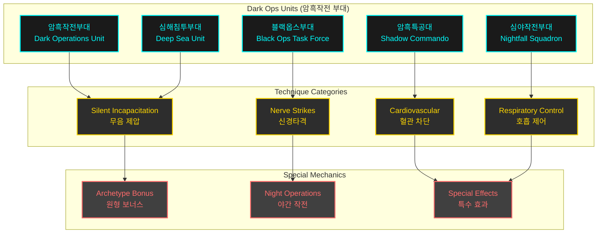
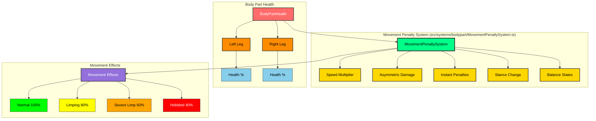
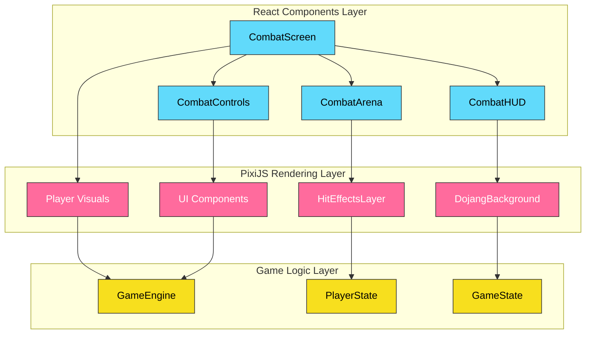
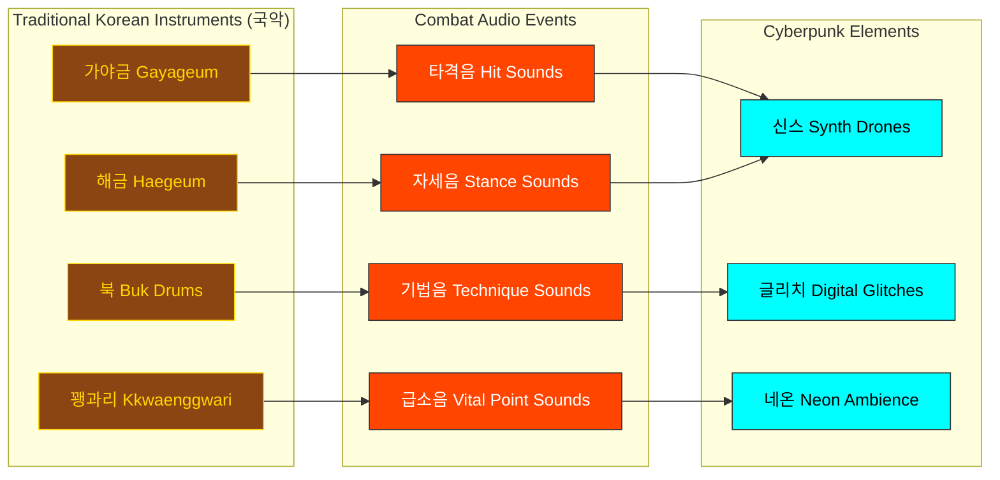
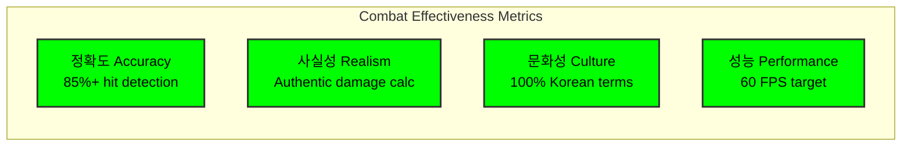

# Black Trigram (흑괘) – Combat System Architecture

**2D Realistic Precision Combat Simulator** rooted in Korean martial arts and I Ching philosophy.

- **Audio-Visual Feedback**: 국악 (traditional Korean instruments) blended with cyberpunk aesthetics for immersive combat cues.
- **Anatomical Targeting**: 70 vital points with realistic damage calculation
- **Cultural Authenticity**: Traditional Korean martial arts with modern implementation
- **Dark Ops Integration**: 15 specialized techniques from Korean special operations units
- **Injury-Based Movement Penalties**: Realistic leg/body damage affects movement speed and stance changes

**Latest Update**: 
- **December 2024**: Added Dark Ops unit combat techniques (암흑작전부대 기술) for tactical assassination and silent incapacitation methods used by Korean special operations forces.
- **December 2024**: Implemented Injury-Based Movement Penalty System (이동 패널티 시스템) for realistic leg damage affecting mobility, stance changes, and balance.

Below, we define the Combat System's architecture in detail.

---

## 🔧 Core Combat System Architecture

```mermaid
graph TB
    subgraph "Combat System Controller (src/systems/CombatSystem.ts)"
        CSC[CombatSystemController]:::core
        CSC --> TCS[TrigramSystemFactory]:::trigram
        CSC --> VPS[VitalPointSystemFactory]:::vital
        CSC --> KTS[KoreanTechniqueSystemFactory]:::tech
        CSC --> DCS[DamageCalculationEngine]:::damage
        CSC --> AFS[AudioFeedbackSystem]:::audio
    end

    subgraph "Type System Foundation"
        TS[Type System]:::types
        TS --> CT[Combat Types]:::types
        TS --> PT[Player Types]:::types
        TS --> AT[Anatomy Types]:::types
        TS --> TT[Trigram Types]:::types
        TS --> AuT[Audio Types]:::types
    end

    subgraph "Trigram Combat Engine (src/systems/TrigramSystem.ts)"
        TCS --> SM[StanceManager]:::trigram
        TCS --> TC[TrigramCalculator]:::trigram
        TCS --> TR[TransitionCalculator]:::trigram
        TCS --> KC[KoreanCulture]:::trigram
        TCS --> KT[KoreanTechniques]:::trigram
    end

    subgraph "Vital Point System (src/systems/VitalPointSystem.ts)"
        VPS --> KA[KoreanAnatomy]:::vital
        VPS --> KVP[KoreanVitalPoints]:::vital
        VPS --> AR[AnatomicalRegions]:::vital
        VPS --> HD[HitDetection]:::vital
        VPS --> DC[DamageCalculator]:::vital
    end

    subgraph "Component Layer"
        CMP[Combat Components]:::components
        CMP --> CS[CombatScreen]:::components
        CMP --> CA[CombatArena]:::components
        CMP --> CH[CombatHUD]:::components
        CMP --> CC[CombatControls]:::components
    end

    classDef core fill:#00ffd0,stroke:#333,color:#000,stroke-width:3px
    classDef trigram fill:#ffd700,stroke:#333,color:#000,stroke-width:2px
    classDef vital fill:#ff6b6b,stroke:#333,color:#000,stroke-width:2px
    classDef tech fill:#4caf50,stroke:#333,color:#000,stroke-width:2px
    classDef damage fill:#ff8c00,stroke:#333,color:#000,stroke-width:2px
    classDef audio fill:#87CEFA,stroke:#333,color:#000,stroke-width:2px
    classDef types fill:#9370db,stroke:#333,color:#000,stroke-width:2px
    classDef components fill:#32cd32,stroke:#333,color:#000,stroke-width:2px

    CSC -.->|uses| TS
    CMP -.->|implements| CSC
```



---

## 🎯 Combat System Controller Architecture

- **CombatSystemController** (`src/systems/CombatSystem.ts`):
  - **Status**: Currently empty, needs full implementation
  - **Planned Methods**:
    - `executeKoreanTechnique(attacker, techniqueName, target)`: Execute authentic Korean martial arts techniques
    - `calculateTrigramAdvantage(attackerStance, defenderStance)`: I Ching-based stance effectiveness
    - `processVitalPointHit(targetState, hitPosition, technique)`: Anatomical damage calculation
    - `validateTechnique(playerState, techniqueName)`: Check stance compatibility and resources
    - `update(deltaTime, playerInputs)`: 60 FPS combat state advancement

---

## ☰ Trigram Combat System (팔괘 무술 체계)



### Current Implementation Status:

- **StanceManager** (`src/systems/trigram/StanceManager.ts`): ❌ Empty - needs full implementation
- **TrigramCalculator** (`src/systems/trigram/TrigramCalculator.ts`): ❌ Empty - needs stance effectiveness matrix
- **TransitionCalculator** (`src/systems/trigram/TransitionCalculator.ts`): ❌ Empty - needs Ki/Stamina cost calculation
- **KoreanTechniques** (`src/systems/trigram/KoreanTechniques.ts`): ❌ Empty - needs authentic technique database
- **KoreanCulture** (`src/systems/trigram/KoreanCulture.ts`): ❌ Empty - needs cultural context system

---

## 🥋 Fighting Stance Guard Animation System (자세 방어 애니메이션)

**Added**: January 2025 - Authentic Korean martial arts guard positions with breathing animations

The Fighting Stance Guard Animation System provides stance-specific defensive postures for all 8 trigram stances, implementing authentic Korean martial arts guard positions with realistic breathing animations at 60fps.

### Guard Pose Architecture

Each of the 8 trigram stances has a unique default guard pose that reflects traditional Korean martial arts positioning:

```typescript
interface StanceGuardPose {
  leftArm: { shoulder: Euler; elbow: Euler; wrist: Euler };
  rightArm: { shoulder: Euler; elbow: Euler; wrist: Euler };
  torso: Euler;
  weight: 'forward' | 'neutral' | 'back';
  breathingRange: { min: number; max: number };
}
```

### Eight Trigram Guard Positions

| Trigram | Korean | Guard Type | Weight | Breathing | Martial Arts Basis |
|---------|--------|------------|--------|-----------|-------------------|
| ☰ 건 | Heaven | High Guard | Forward | 6 frames | Taekwondo Ap Seogi |
| ☱ 태 | Lake | Fluid Mid-Guard | Forward | 6 frames | Taekwondo Ap Koobi Seogi |
| ☲ 리 | Fire | Aggressive Forward | Neutral | 4 frames | Taekwondo Juchum Seogi |
| ☳ 진 | Thunder | Explosive Ready | Back | 5 frames | Taekwondo Dwi Koobi Seogi |
| ☴ 손 | Wind | Continuous Motion | Neutral | 6 frames | Taekwondo Niunja Seogi |
| ☵ 감 | Water | Flowing Defensive | Neutral | 6 frames | Taekwondo Narani Seogi |
| ☶ 간 | Mountain | Solid Defensive | Neutral | 4 frames | Taekwondo Gibo Seogi |
| ☷ 곤 | Earth | Grounded Low | Neutral | 5 frames | Taekwondo Joong Ha Seogi |

### Animation State Integration



### Breathing Animation System

Each guard implements authentic martial arts breathing patterns:

**Breathing Frame Counts**:
- **Power Stances** (Heaven, Thunder, Earth): 5-6 frames for deep breathing
- **Precision Stances** (Fire, Mountain): 4 frames for controlled breathing
- **Fluid Stances** (Lake, Wind, Water): 6 frames for flowing breathing

**Breathing Range**:
- Min: 0.96-0.99 (inhale, chest expansion)
- Max: 1.01-1.04 (exhale, chest contraction)
- Target FPS: 60fps for smooth animation

### Implementation Files

**Core System**:
- `src/systems/animation/StanceGuardPoses.ts` - Guard pose configurations (8 stances)
- `src/systems/animation/AnimationStateMachine.ts` - State machine with guard support
- `src/systems/animation/AnimationTransitions.ts` - Guard transition rules (264 rules)
- `src/types/skeletal.ts` - Guard pose type definitions

**Helper Methods**:
```typescript
// Transition to stance-specific guard
machine.transitionToStanceGuard(TrigramStance.GEON);

// Check if in guard state
if (machine.isInStanceGuard()) {
  const currentGuardStance = machine.getCurrentGuardStance();
}

// Get guard pose for rendering
const guardPose = getGuardPoseForStance(TrigramStance.LI);
```

### Korean Martial Arts Authenticity

Each guard position is based on traditional Korean martial arts stances (자세):

**☰ 건 (Geon) - Heaven**: High guard based on 앞서기 (Ap Seogi - Walking Stance)
- Hands raised to shoulder level or above
- Weight 60% forward for aggressive positioning
- Ready for overhead strikes and bone-breaking techniques
- Breathing emphasizes chest expansion for power generation

**☱ 태 (Tae) - Lake**: Fluid mid-guard based on 앞굽이 (Ap Koobi Seogi - Front Stance)
- Hands at mid-level (chest height)
- Extended reach for joint locks and throws (+15% reach bonus)
- Weight forward for throwing leverage
- Smooth flowing breathing for continuous adaptation

**☲ 리 (Li) - Fire**: Aggressive forward guard based on 주춤 (Juchum Seogi - Horse Stance)
- Hands forward in striking position
- Low center of gravity for stability (+15% stability vs vital strikes)
- Neutral weight but ready to explode forward
- Controlled shallow breathing for precision (+5% crit chance)

**☳ 진 (Jin) - Thunder**: Explosive ready stance based on 뒤굽이 (Dwi Koobi Seogi - Back Stance)
- Hands chambered high for explosive release
- Weight 70% back for sudden forward burst
- Ready for shocking nerve strikes (+15% shock damage)
- Deep breathing for power generation

**☴ 손 (Son) - Wind**: Continuous motion guard based on 니은자 (Niunja Seogi - L-Stance)
- Hands in flowing circular pattern
- Neutral weight for lateral movement (+10% lateral mobility)
- Ready for pressure point sequences (+10% chaining speed)
- Rhythmic breathing for sustained combos

**☵ 감 (Gam) - Water**: Flowing defensive guard based on 나란이 (Narani Seogi - Parallel Stance)
- Hands low and flowing
- Centered weight for adaptability (+10% counter speed)
- Ready for counter-grappling and sweeps
- Deep flowing breathing for counter-attacks (+15 bleed on rib shots)

**☶ 간 (Gan) - Mountain**: Solid defensive posture based on 기본 (Gibo Seogi - Basic Stance)
- Arms in tight defensive position
- Balanced weight for maximum stability (+15% block strength)
- Immovable blocking stance (+10% counter-strike speed)
- Minimal steady breathing for endurance

**☷ 곤 (Gon) - Earth**: Grounded low guard based on 중하 (Joong Ha Seogi - Deep Stance)
- Hands very low for ground control
- Low center of gravity (+20% ground-control advantage)
- Ready for throws and takedowns (+20 bleed on takedowns)
- Deep diaphragm breathing for explosive power

### Transition Rules

**Guard → Combat Actions**:
- Guards can transition to attack, defend, stance_change
- Guards can be interrupted by hit, ko (high priority)
- Guards can transition to movement (walk, run)

**Combat Actions → Guard**:
- After non-looping animations complete, returns to idle (not guard)
- Explicit guard transition required via `transitionToStanceGuard()`
- Stance change (600ms) can lead to new guard

**Guard ↔ Guard**:
- Direct transitions between guards allowed (instant guard change)
- Useful for rapid stance adaptation without full stance_change animation
- Example: `stance_guard_geon` → `stance_guard_tae` (immediate switch)

### Performance Characteristics

**Animation Performance**:
- **Frame Rate**: 60fps breathing animations
- **Transition Time**: <1ms for guard switching
- **Memory Usage**: Minimal (8 guard configs cached)
- **Test Coverage**: 166 tests (97 pose validation + 40 transition + 29 state machine)

**Integration Points**:
- **SkeletalPlayer3D**: Ready for skeletal rig rendering
- **StanceManager**: Hook for trigram system integration
- **CombatHUD**: Guard position indicators prepared

### Implementation Status

| Feature | Status | Tests | Coverage |
|---------|--------|-------|----------|
| Guard Pose Definitions | ✅ Complete | 97 | 100% |
| Animation State Machine | ✅ Complete | 40 | 100% |
| Transition Rules | ✅ Complete | 29 | 100% |
| Korean Martial Arts Accuracy | ✅ Complete | 97 | 100% |
| Breathing Animation Logic | ✅ Complete | 40 | 100% |
| SkeletalPlayer3D Integration | 📋 Pending | - | - |
| UI Guard Indicators | 📋 Pending | - | - |
| Visual Demo Component | 📋 Pending | - | - |

### Code Example

```typescript
import { 
  PlayerAnimationStateMachine, 
  DEFAULT_ANIMATION_CONFIGS,
  getGuardPoseForStance 
} from '@/systems/animation';
import { TrigramStance } from '@/types/common';

// Initialize animation state machine
const machine = new PlayerAnimationStateMachine(DEFAULT_ANIMATION_CONFIGS);

// When player enters Fire stance (리)
const playerStance = TrigramStance.LI;
machine.transitionToStanceGuard(playerStance);

// Get current guard pose for rendering
if (machine.isInStanceGuard()) {
  const guardStance = machine.getCurrentGuardStance(); // Returns "li"
  const guardPose = getGuardPoseForStance(guardStance);
  
  // Apply to skeletal rig
  applyArmRotations(skeletalRig, guardPose.leftArm, guardPose.rightArm);
  applyTorsoRotation(skeletalRig, guardPose.torso);
  
  // Update breathing animation
  const breathScale = interpolate(
    guardPose.breathingRange.min,
    guardPose.breathingRange.max,
    machine.getCurrentFrame() / machine.getCurrentAnimation().frames
  );
  applyBreathingScale(skeletalRig, breathScale);
}

// In game loop (useFrame)
useFrame((state, delta) => {
  const result = machine.update(delta);
  
  if (result.justStarted && machine.isInStanceGuard()) {
    // Guard just activated
    playSFX('stance_guard_enter');
  }
  
  if (result.frame === 0 && machine.isInStanceGuard()) {
    // Breathing cycle completed
    updateBreathingVisuals();
  }
});

// Transitioning between guards for tactical stance changes
function adaptToOpponentStance(opponentStance: TrigramStance) {
  const counterStance = calculateCounterStance(opponentStance);
  machine.transitionToStanceGuard(counterStance); // Instant guard switch
}
```

---

## 🎯 Vital Point Targeting System (급소 타격 체계)



### Current Implementation Status:

- **VitalPointSystem** (`src/systems/VitalPointSystem.ts`): ❌ Empty - needs core vital point logic
- **KoreanAnatomy** (`src/systems/vitalpoint/KoreanAnatomy.ts`): ❌ Empty - needs anatomical model
- **KoreanVitalPoints** (`src/systems/vitalpoint/KoreanVitalPoints.ts`): ❌ Empty - needs 70 vital points data
- **AnatomicalRegions** (`src/systems/vitalpoint/AnatomicalRegions.ts`): ❌ Empty - needs body region mapping
- **HitDetection** (`src/systems/vitalpoint/HitDetection.ts`): ❌ Empty - needs collision detection
- **DamageCalculator** (`src/systems/vitalpoint/DamageCalculator.ts`): ❌ Empty - needs realistic damage math

---

## 👤 Player Archetype Combat Specializations (무사 유형별 전투 특화)



---

## 🌑 Dark Ops Unit Combat Techniques (암흑작전부대 기술)

**Added**: December 2024 - Specialized techniques from Korean special operations forces

### Overview

The Dark Ops technique system integrates authentic Korean special operations combat methods into the game, providing 15 specialized techniques focused on silent incapacitation, tactical assassination, and nerve strike warfare.



### Technique Count: 15 Total

| Dark Ops Unit | Techniques | Specialization |
|--------------|------------|----------------|
| 암흑작전부대 (Dark Operations) | 3 | Silent infiltration, carotid strikes |
| 암흑특공대 (Shadow Commando) | 3 | Demolition tactics, internal trauma |
| 심야작전부대 (Nightfall Squadron) | 3 | Night operations, breathing disruption |
| 블랙옵스부대 (Black Ops Task Force) | 3 | Cyber-enhanced targeting, nerve strikes |
| 심해침투부대 (Deep Sea Unit) | 3 | Amphibious combat, chokeholds |

### Archetype Effectiveness

| Archetype | Effectiveness | Rationale |
|-----------|--------------|-----------|
| 암살자 (Amsalja) | **+30%** | Shadow Assassin specialty - silent incapacitation |
| 정보요원 (Jeongbo) | +15% | Intelligence operative espionage training |
| 해커 (Hacker) | +10% | Cyber-enhanced targeting synergy |
| 조직 (Jojik) | +5% | Ruthless pragmatism alignment |
| 무사 (Musa) | **-15%** | Dishonorable tactics conflict with warrior code |

### Night Operations Bonus

Dark Ops techniques gain time-of-day effectiveness multipliers:

- **Night** (00:00-06:00, 18:00-23:59): **+25%** effectiveness
- **Twilight** (05:00-07:00, 17:00-19:00): **+15%** effectiveness
- **Day** (06:00-18:00): Normal effectiveness

### Special Effects System

Dark Ops techniques apply unique status effects:

#### 1. Silent Attack (무음 공격)
- **Effect**: No combat alert triggered
- **Duration**: Instant
- **Usage**: Stealth infiltration scenarios

#### 2. Paralysis (마비)
- **Effect**: Temporary limb immobilization
- **Duration**: 3 seconds
- **Techniques**: Nerve strikes, brachial plexus attacks

#### 3. Unconsciousness (의식 상실)
- **Effect**: Complete incapacitation
- **Duration**: 5 seconds
- **Techniques**: Carotid strikes, temple knockouts

#### 4. Breathing Difficulty (호흡 곤란)
- **Effect**: -75% stamina regeneration
- **Duration**: 5 seconds
- **Techniques**: Throat strikes, solar plexus attacks

#### 5. Disorientation (방향 감각 상실)
- **Effect**: -50% accuracy penalty
- **Duration**: 4 seconds
- **Techniques**: Ear box strikes, jaw dislocations

### Sample Dark Ops Techniques

#### Silent Carotid Strike (은밀 경동맥 차단)
- **Unit**: Dark Operations Unit
- **Stance**: Water (감)
- **Damage**: 28
- **Accuracy**: 92%
- **Effect**: Unconsciousness within 3 seconds
- **Ki Cost**: 30 | **Stamina**: 25

#### Nerve Paralysis Strike (신경마비타격)
- **Unit**: Black Ops Task Force
- **Stance**: Fire (리)
- **Damage**: 26
- **Accuracy**: 95%
- **Effect**: Limb paralysis, 3s duration
- **Ki Cost**: 25 | **Stamina**: 20

#### Spinal Column Strike (척추타격)
- **Unit**: Deep Sea Unit
- **Stance**: Heaven (건)
- **Damage**: 40 (highest in game)
- **Accuracy**: 78%
- **Effect**: Full-body paralysis + unconsciousness
- **Ki Cost**: 35 | **Stamina**: 35

### Integration with Vital Point System

Dark Ops techniques target specific anatomical vulnerable points:

| Technique Category | Vital Point Targets |
|-------------------|---------------------|
| Nerve Strikes | Brachial plexus, femoral nerve, radial nerve |
| Cardiovascular | Carotid artery, liver, kidney |
| Respiratory | Throat, solar plexus, diaphragm |
| Neurological | Temple, spinal column, jaw |

### Balance Considerations

**Average Stats** (across 15 techniques):
- **Ki Cost**: 26.4 (balanced resource drain)
- **Stamina Cost**: 25.5 (moderate physical exertion)
- **Accuracy**: 86.5% (high precision requirement)
- **Damage**: 31.5 (above standard techniques)
- **Execution Time**: 630ms (slightly slower for precision)
- **Recovery Time**: 1025ms (longer due to complexity)

**Design Philosophy**:
- Higher resource costs than standard techniques
- Increased accuracy to reward precision gameplay
- Longer execution/recovery times for tactical balance
- Powerful effects balanced by drawbacks for non-Amsalja archetypes

---

## 🦵 Injury-Based Movement Penalty System (이동 패널티 시스템)

**Added**: December 2024 - Realistic leg and body damage affecting movement, stance changes, and combat mobility

### Overview

The Movement Penalty System implements realistic injury-based movement penalties where leg and body damage reduces movement speed, restricts stance changes, and affects balance. This system creates authentic combat trauma effects based on Korean martial arts principles where targeting legs (다리) is a fundamental combat strategy.



### Movement Speed Penalties

Progressive speed reduction based on average leg health:

| Leg Health | Injury State | Speed Multiplier | Can Run | Korean Term |
|------------|--------------|------------------|---------|-------------|
| 100-70% | Normal | 1.0x (100%) | ✅ Yes | 정상 (Jeongsang) |
| 69-50% | Limping | 0.8x (80%) | ✅ Yes | 절름 (Jeolreum) |
| 49-30% | Severe Limp | 0.6x (60%) | ✅ Yes | 심한 절름 (Simhan Jeolreum) |
| <30% | Hobbled | 0.4x (40%) | ❌ No | 절뚝거림 (Jeolttukgeorim) |

**Korean Martial Arts Context**: Traditional Korean martial arts emphasize 하단 공격 (hadan gonggyeok - low attacks) targeting legs to disable opponent mobility. This system reflects authentic combat where leg damage is decisive.

### Stance Change Penalties

Damaged legs affect ability to transition between the Eight Trigram stances:

- **Legs ≥50% health**: Normal stance change speed (1.0x)
- **Legs <50% health**: Stance change takes 2x longer
- **Legs <30% health**: Cannot access advanced stances (restricted to basic stances only)

**Korean Philosophy**: The Eight Trigrams (팔괘) require solid footing and leg strength. Injured legs prevent proper stance transitions, limiting tactical options.

### Instant Penalties from Knee/Ankle Strikes

Striking specific leg vital points causes immediate severe movement impairment:

**Target Zones**:
- **무릎 (Mureup)** - Knee joint
- **발목 (Balmok)** - Ankle joint
- **아킬레스건 (Akilles-geon)** - Achilles tendon

**Effect**:
- **Speed**: 30% movement speed (0.3x multiplier)
- **Duration**: 5 seconds
- **Overrides**: Takes precedence over regular injury penalties

### Asymmetric Damage Effects

Left and right leg damage affects directional movement asymmetrically:

**Movement Penalties**:
- **Left leg injured + moving left**: 20% additional penalty (0.8x)
- **Left leg injured + moving right**: 10% additional penalty (0.9x)
- **Right leg injured + moving right**: 20% additional penalty (0.8x)
- **Right leg injured + moving left**: 10% additional penalty (0.9x)

**Combat Realism**: This creates authentic limping behavior where movement toward the injured side is more impaired, forcing tactical positioning adjustments.

### Balance State Integration

Low leg health increases vulnerability to balance-disrupting attacks:

**Balance State Transitions**:
- **Legs <30% health**: Enter VULNERABLE state (more susceptible to knockdowns)
- **Both legs <30% health**: Enter HELPLESS state (cannot maintain combat stance)

**Korean Combat Theory**: The concept of 중심 (jungsim - center/balance) is fundamental. Damaged legs compromise 하단 안정성 (hadan anjeongseon - lower body stability), increasing vulnerability.

### Performance Characteristics

**Calculation Speed**:
- **Single calculation**: <1ms
- **Average over 1000 calculations**: <1ms
- **60 FPS compatible**: ✅ Yes

**Integration Points**:
- **AI Movement**: `useCombatActions.ts` - `moveAIPlayer()` function
- **Player Movement**: Ready for integration (hook system in place)
- **Combat System**: Prepared for instant penalty triggers on vital point hits

### Implementation Status

| Feature | Status | Coverage |
|---------|--------|----------|
| Core Movement Penalty System | ✅ Complete | 38 tests |
| Speed Multiplier Calculation | ✅ Complete | 8 tests |
| Asymmetric Damage | ✅ Complete | 5 tests |
| Instant Penalties | ✅ Complete | 4 tests |
| Stance Change Penalties | ✅ Complete | 4 tests |
| Balance State Integration | ✅ Complete | 5 tests |
| AI Movement Integration | ✅ Complete | Tested |
| Player Movement Integration | 🔄 Pending | - |
| Visual Effects (Limping) | 📋 Planned | - |

### Code Example

```typescript
import { movementPenaltySystem } from "@/systems/bodypart";

// Calculate current movement penalty
const penalty = movementPenaltySystem.calculateMovementPenalty(
  bodyPartHealth,
  maxHealth,
  activeInstantPenalty
);

// Apply to movement speed
const actualSpeed = baseSpeed * penalty.speedMultiplier;

// Check if advanced stances are restricted
if (penalty.advancedStancesRestricted) {
  // Only allow basic stances
  allowedStances = BASIC_STANCES_ONLY;
}

// Check for balance state transitions
if (movementPenaltySystem.shouldEnterHelplessState(health, maxHealth)) {
  enterCombatState(CombatState.HELPLESS);
}
```

### Future Enhancements

**Visual Feedback** (Planned):
- Limping animation states favoring injured leg
- Reduced stride length based on injury severity
- Balance wobbling when turning with damaged legs
- Leg injury indicators in combat HUD

**Combat Integration** (Planned):
- Automatic instant penalty application on knee/ankle hits
- Recovery system for gradual penalty reduction
- Archetype-specific resistance (e.g., 무사 has higher leg resilience)
- Training modules for leg conditioning

---

## 🎮 Combat Component Architecture



---

## 🔊 Audio System Integration



---

## 📊 Type System Foundation

### Core Combat Types Structure:

```typescript
// Current Type System Implementation Status:

// ✅ COMPLETE - Well-defined interfaces
interface CombatResult {
  damage: number;
  hit: boolean;
  critical: boolean;
  vitalPointsHit: VitalPoint[];
  // ... comprehensive combat result data
}

// ✅ COMPLETE - Player archetype definitions
type PlayerArchetype =
  | "musa"
  | "amsalja"
  | "hacker"
  | "jeongbo_yowon"
  | "jojik_pokryeokbae";

// ✅ COMPLETE - Trigram stance system
type TrigramStance =
  | "geon"
  | "tae"
  | "li"
  | "jin"
  | "son"
  | "gam"
  | "gan"
  | "gon";

// ✅ COMPLETE - Vital point system
interface VitalPoint {
  id: string;
  name: KoreanText;
  category: VitalPointCategory;
  severity: VitalPointSeverity;
  // ... anatomical positioning and effects
}

// ❌ NEEDS IMPLEMENTATION - Combat techniques
interface KoreanTechnique {
  // Defined but needs population with authentic Korean martial arts data
}
```

---

## 🚀 Implementation Priority Matrix

### Phase 1: Core Combat Foundation (Current Priority)

1. **CombatSystemController** - Central orchestration logic
2. **StanceManager** - Trigram stance transitions and validation
3. **KoreanVitalPoints** - 70 authentic vital points database
4. **DamageCalculator** - Realistic anatomical damage calculation

### Phase 2: Trigram System (High Priority)

1. **TrigramCalculator** - I Ching effectiveness relationships
2. **TransitionCalculator** - Ki/Stamina cost calculation
3. **KoreanTechniques** - Authentic technique implementations
4. **KoreanCulture** - Philosophy integration

### Phase 3: Advanced Features (Medium Priority)

1. **HitDetection** - Precise anatomical collision detection
2. **AnatomicalRegions** - Body region mapping system
3. **Enhanced Audio** - Korean traditional instrument integration
4. **Combat Analytics** - Performance and effectiveness tracking

---

## 💡 Technical Specifications

### Performance Requirements:

- **Target FPS**: 60 FPS during intense combat
- **Memory Usage**: < 512MB for full combat simulation
- **Audio Latency**: < 100ms for responsive feedback
- **Input Lag**: < 16ms for precise control

### Cultural Authenticity Standards:

- **Korean Terminology**: Bilingual Korean-English throughout
- **Martial Arts Accuracy**: Traditional techniques with proper names
- **Philosophy Integration**: I Ching principles in combat mechanics
- **Respectful Representation**: Honor Korean martial arts heritage

### Combat Realism Targets:

- **Anatomical Accuracy**: 70 precise vital points
- **Damage Calculation**: Physics-based trauma simulation
- **Status Effects**: Pain, consciousness, balance, blood loss
- **Recovery Systems**: Realistic healing and regeneration

---

## 🎯 Success Metrics



**흑괘의 길을 걸어라** - _Walk the Path of the Black Trigram_

---

_This architecture document reflects the current implementation state of Black Trigram's combat system as of the latest codebase analysis. All empty system files represent planned implementations following authentic Korean martial arts principles._
