# Black Trigram (흑괘) – Combat System Architecture

**2D Realistic Precision Combat Simulator** rooted in Korean martial arts and I Ching philosophy.

- **Audio-Visual Feedback**: 국악 (traditional Korean instruments) blended with cyberpunk aesthetics for immersive combat cues.
- **Anatomical Targeting**: 70 vital points with realistic damage calculation
- **Cultural Authenticity**: Traditional Korean martial arts with modern implementation
- **Dark Ops Integration**: 15 specialized techniques from Korean special operations units
- **Injury-Based Movement Penalties**: Realistic leg/body damage affects movement speed and stance changes

**Latest Update**: 
- **December 2024**: Added Dark Ops unit combat techniques (암흑작전부대 기술) for tactical assassination and silent incapacitation methods used by Korean special operations forces.
- **December 2024**: Implemented Injury-Based Movement Penalty System (이동 패널티 시스템) for realistic leg damage affecting mobility, stance changes, and balance.

Below, we define the Combat System's architecture in detail.

---

## 🔧 Core Combat System Architecture

```mermaid
graph TB
    subgraph "Combat System Controller (src/systems/CombatSystem.ts)"
        CSC[CombatSystemController]:::core
        CSC --> TCS[TrigramSystemFactory]:::trigram
        CSC --> VPS[VitalPointSystemFactory]:::vital
        CSC --> KTS[KoreanTechniqueSystemFactory]:::tech
        CSC --> DCS[DamageCalculationEngine]:::damage
        CSC --> AFS[AudioFeedbackSystem]:::audio
    end

    subgraph "Type System Foundation"
        TS[Type System]:::types
        TS --> CT[Combat Types]:::types
        TS --> PT[Player Types]:::types
        TS --> AT[Anatomy Types]:::types
        TS --> TT[Trigram Types]:::types
        TS --> AuT[Audio Types]:::types
    end

    subgraph "Trigram Combat Engine (src/systems/TrigramSystem.ts)"
        TCS --> SM[StanceManager]:::trigram
        TCS --> TC[TrigramCalculator]:::trigram
        TCS --> TR[TransitionCalculator]:::trigram
        TCS --> KC[KoreanCulture]:::trigram
        TCS --> KT[KoreanTechniques]:::trigram
    end

    subgraph "Vital Point System (src/systems/VitalPointSystem.ts)"
        VPS --> KA[KoreanAnatomy]:::vital
        VPS --> KVP[KoreanVitalPoints]:::vital
        VPS --> AR[AnatomicalRegions]:::vital
        VPS --> HD[HitDetection]:::vital
        VPS --> DC[DamageCalculator]:::vital
    end

    subgraph "Component Layer"
        CMP[Combat Components]:::components
        CMP --> CS[CombatScreen]:::components
        CMP --> CA[CombatArena]:::components
        CMP --> CH[CombatHUD]:::components
        CMP --> CC[CombatControls]:::components
    end

    classDef core fill:#00ffd0,stroke:#333,color:#000,stroke-width:3px
    classDef trigram fill:#ffd700,stroke:#333,color:#000,stroke-width:2px
    classDef vital fill:#ff6b6b,stroke:#333,color:#000,stroke-width:2px
    classDef tech fill:#4caf50,stroke:#333,color:#000,stroke-width:2px
    classDef damage fill:#ff8c00,stroke:#333,color:#000,stroke-width:2px
    classDef audio fill:#87CEFA,stroke:#333,color:#000,stroke-width:2px
    classDef types fill:#9370db,stroke:#333,color:#000,stroke-width:2px
    classDef components fill:#32cd32,stroke:#333,color:#000,stroke-width:2px

    CSC -.->|uses| TS
    CMP -.->|implements| CSC
```

---

## 🎯 Combat System Controller Architecture

- **CombatSystemController** (`src/systems/CombatSystem.ts`):
  - **Status**: Currently empty, needs full implementation
  - **Planned Methods**:
    - `executeKoreanTechnique(attacker, techniqueName, target)`: Execute authentic Korean martial arts techniques
    - `calculateTrigramAdvantage(attackerStance, defenderStance)`: I Ching-based stance effectiveness
    - `processVitalPointHit(targetState, hitPosition, technique)`: Anatomical damage calculation
    - `validateTechnique(playerState, techniqueName)`: Check stance compatibility and resources
    - `update(deltaTime, playerInputs)`: 60 FPS combat state advancement

---

## ☰ Trigram Combat System (팔괘 무술 체계)

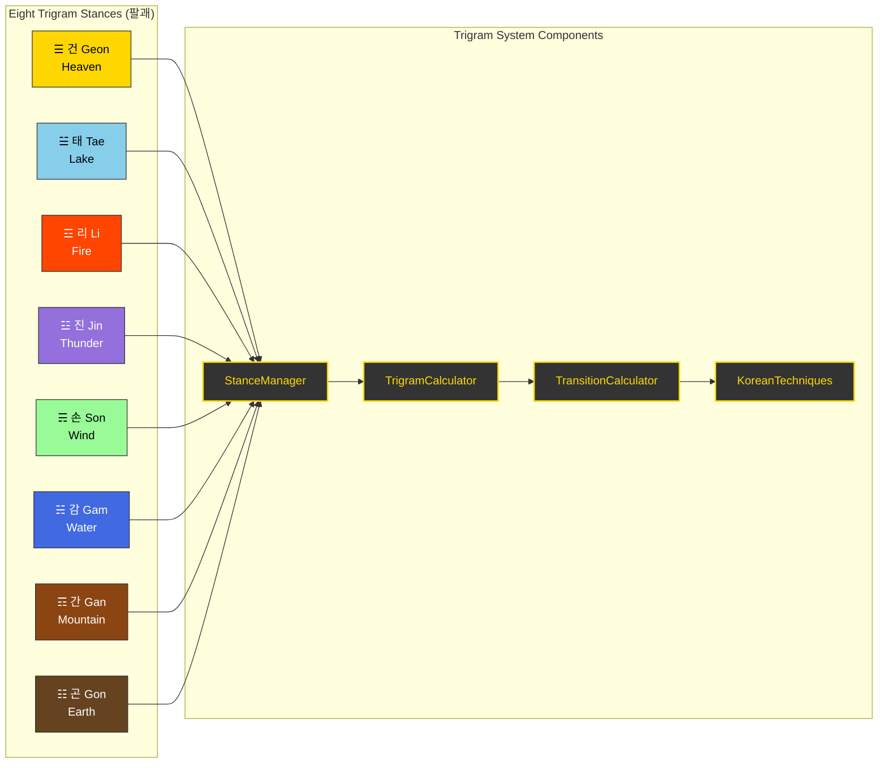

### Current Implementation Status:

- **StanceManager** (`src/systems/trigram/StanceManager.ts`): ❌ Empty - needs full implementation
- **TrigramCalculator** (`src/systems/trigram/TrigramCalculator.ts`): ❌ Empty - needs stance effectiveness matrix
- **TransitionCalculator** (`src/systems/trigram/TransitionCalculator.ts`): ❌ Empty - needs Ki/Stamina cost calculation
- **KoreanTechniques** (`src/systems/trigram/KoreanTechniques.ts`): ❌ Empty - needs authentic technique database
- **KoreanCulture** (`src/systems/trigram/KoreanCulture.ts`): ❌ Empty - needs cultural context system

---

## 🥋 Fighting Stance Guard Animation System (자세 방어 애니메이션)

**Added**: January 2025 - Authentic Korean martial arts guard positions with breathing animations

The Fighting Stance Guard Animation System provides stance-specific defensive postures for all 8 trigram stances, implementing authentic Korean martial arts guard positions with realistic breathing animations at 60fps.

### Guard Pose Architecture

Each of the 8 trigram stances has a unique default guard pose that reflects traditional Korean martial arts positioning:

```typescript
interface StanceGuardPose {
  leftArm: { shoulder: Euler; elbow: Euler; wrist: Euler };
  rightArm: { shoulder: Euler; elbow: Euler; wrist: Euler };
  torso: Euler;
  weight: 'forward' | 'neutral' | 'back';
  breathingRange: { min: number; max: number };
}
```

### Eight Trigram Guard Positions

| Trigram | Korean | Guard Type | Weight | Breathing | Martial Arts Basis |
|---------|--------|------------|--------|-----------|-------------------|
| ☰ 건 | Heaven | High Guard | Forward | 6 frames | Taekwondo Ap Seogi |
| ☱ 태 | Lake | Fluid Mid-Guard | Forward | 6 frames | Taekwondo Ap Koobi Seogi |
| ☲ 리 | Fire | Aggressive Forward | Neutral | 4 frames | Taekwondo Juchum Seogi |
| ☳ 진 | Thunder | Explosive Ready | Back | 5 frames | Taekwondo Dwi Koobi Seogi |
| ☴ 손 | Wind | Continuous Motion | Neutral | 6 frames | Taekwondo Niunja Seogi |
| ☵ 감 | Water | Flowing Defensive | Neutral | 6 frames | Taekwondo Narani Seogi |
| ☶ 간 | Mountain | Solid Defensive | Neutral | 4 frames | Taekwondo Gibo Seogi |
| ☷ 곤 | Earth | Grounded Low | Neutral | 5 frames | Taekwondo Joong Ha Seogi |

### Animation State Integration

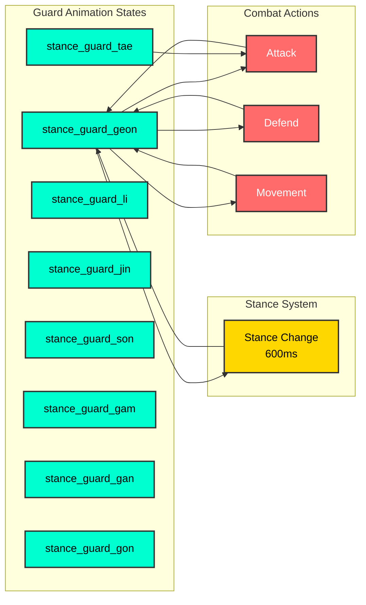

### Breathing Animation System

Each guard implements authentic martial arts breathing patterns:

**Breathing Frame Counts**:
- **Power Stances** (Heaven, Thunder, Earth): 5-6 frames for deep breathing
- **Precision Stances** (Fire, Mountain): 4 frames for controlled breathing
- **Fluid Stances** (Lake, Wind, Water): 6 frames for flowing breathing

**Breathing Range**:
- Min: 0.96-0.99 (inhale, chest expansion)
- Max: 1.01-1.04 (exhale, chest contraction)
- Target FPS: 60fps for smooth animation

### Implementation Files

**Core System**:
- `src/systems/animation/StanceGuardPoses.ts` - Guard pose configurations (8 stances)
- `src/systems/animation/AnimationStateMachine.ts` - State machine with guard support
- `src/systems/animation/AnimationTransitions.ts` - Guard transition rules (264 rules)
- `src/types/skeletal.ts` - Guard pose type definitions

**Helper Methods**:
```typescript
// Transition to stance-specific guard
machine.transitionToStanceGuard(TrigramStance.GEON);

// Check if in guard state
if (machine.isInStanceGuard()) {
  const currentGuardStance = machine.getCurrentGuardStance();
}

// Get guard pose for rendering
const guardPose = getGuardPoseForStance(TrigramStance.LI);
```

### Korean Martial Arts Authenticity

Each guard position is based on traditional Korean martial arts stances (자세):

**☰ 건 (Geon) - Heaven**: High guard based on 앞서기 (Ap Seogi - Walking Stance)
- Hands raised to shoulder level or above
- Weight 60% forward for aggressive positioning
- Ready for overhead strikes and bone-breaking techniques
- Breathing emphasizes chest expansion for power generation

**☱ 태 (Tae) - Lake**: Fluid mid-guard based on 앞굽이 (Ap Koobi Seogi - Front Stance)
- Hands at mid-level (chest height)
- Extended reach for joint locks and throws (+15% reach bonus)
- Weight forward for throwing leverage
- Smooth flowing breathing for continuous adaptation

**☲ 리 (Li) - Fire**: Aggressive forward guard based on 주춤 (Juchum Seogi - Horse Stance)
- Hands forward in striking position
- Low center of gravity for stability (+15% stability vs vital strikes)
- Neutral weight but ready to explode forward
- Controlled shallow breathing for precision (+5% crit chance)

**☳ 진 (Jin) - Thunder**: Explosive ready stance based on 뒤굽이 (Dwi Koobi Seogi - Back Stance)
- Hands chambered high for explosive release
- Weight 70% back for sudden forward burst
- Ready for shocking nerve strikes (+15% shock damage)
- Deep breathing for power generation

**☴ 손 (Son) - Wind**: Continuous motion guard based on 니은자 (Niunja Seogi - L-Stance)
- Hands in flowing circular pattern
- Neutral weight for lateral movement (+10% lateral mobility)
- Ready for pressure point sequences (+10% chaining speed)
- Rhythmic breathing for sustained combos

**☵ 감 (Gam) - Water**: Flowing defensive guard based on 나란이 (Narani Seogi - Parallel Stance)
- Hands low and flowing
- Centered weight for adaptability (+10% counter speed)
- Ready for counter-grappling and sweeps
- Deep flowing breathing for counter-attacks (+15 bleed on rib shots)

**☶ 간 (Gan) - Mountain**: Solid defensive posture based on 기본 (Gibo Seogi - Basic Stance)
- Arms in tight defensive position
- Balanced weight for maximum stability (+15% block strength)
- Immovable blocking stance (+10% counter-strike speed)
- Minimal steady breathing for endurance

**☷ 곤 (Gon) - Earth**: Grounded low guard based on 중하 (Joong Ha Seogi - Deep Stance)
- Hands very low for ground control
- Low center of gravity (+20% ground-control advantage)
- Ready for throws and takedowns (+20 bleed on takedowns)
- Deep diaphragm breathing for explosive power

### Transition Rules

**Guard → Combat Actions**:
- Guards can transition to attack, defend, stance_change
- Guards can be interrupted by hit, ko (high priority)
- Guards can transition to movement (walk, run)

**Combat Actions → Guard**:
- After non-looping animations complete, returns to idle (not guard)
- Explicit guard transition required via `transitionToStanceGuard()`
- Stance change (600ms) can lead to new guard

**Guard ↔ Guard**:
- Direct transitions between guards allowed (instant guard change)
- Useful for rapid stance adaptation without full stance_change animation
- Example: `stance_guard_geon` → `stance_guard_tae` (immediate switch)

### Performance Characteristics

**Animation Performance**:
- **Frame Rate**: 60fps breathing animations
- **Transition Time**: <1ms for guard switching
- **Memory Usage**: Minimal (8 guard configs cached)
- **Test Coverage**: 166 tests (97 pose validation + 40 transition + 29 state machine)

**Integration Points**:
- **SkeletalPlayer3D**: Ready for skeletal rig rendering
- **StanceManager**: Hook for trigram system integration
- **CombatHUD**: Guard position indicators prepared

### Implementation Status

| Feature | Status | Tests | Coverage |
|---------|--------|-------|----------|
| Guard Pose Definitions | ✅ Complete | 97 | 100% |
| Animation State Machine | ✅ Complete | 40 | 100% |
| Transition Rules | ✅ Complete | 29 | 100% |
| Korean Martial Arts Accuracy | ✅ Complete | 97 | 100% |
| Breathing Animation Logic | ✅ Complete | 40 | 100% |
| SkeletalPlayer3D Integration | 📋 Pending | - | - |
| UI Guard Indicators | 📋 Pending | - | - |
| Visual Demo Component | 📋 Pending | - | - |

### Code Example

```typescript
import { 
  PlayerAnimationStateMachine, 
  DEFAULT_ANIMATION_CONFIGS,
  getGuardPoseForStance 
} from '@/systems/animation';
import { TrigramStance } from '@/types/common';

// Initialize animation state machine
const machine = new PlayerAnimationStateMachine(DEFAULT_ANIMATION_CONFIGS);

// When player enters Fire stance (리)
const playerStance = TrigramStance.LI;
machine.transitionToStanceGuard(playerStance);

// Get current guard pose for rendering
if (machine.isInStanceGuard()) {
  const guardStance = machine.getCurrentGuardStance(); // Returns "li"
  const guardPose = getGuardPoseForStance(guardStance);
  
  // Apply to skeletal rig
  applyArmRotations(skeletalRig, guardPose.leftArm, guardPose.rightArm);
  applyTorsoRotation(skeletalRig, guardPose.torso);
  
  // Update breathing animation
  const breathScale = interpolate(
    guardPose.breathingRange.min,
    guardPose.breathingRange.max,
    machine.getCurrentFrame() / machine.getCurrentAnimation().frames
  );
  applyBreathingScale(skeletalRig, breathScale);
}

// In game loop (useFrame)
useFrame((state, delta) => {
  const result = machine.update(delta);
  
  if (result.justStarted && machine.isInStanceGuard()) {
    // Guard just activated
    playSFX('stance_guard_enter');
  }
  
  if (result.frame === 0 && machine.isInStanceGuard()) {
    // Breathing cycle completed
    updateBreathingVisuals();
  }
});

// Transitioning between guards for tactical stance changes
function adaptToOpponentStance(opponentStance: TrigramStance) {
  const counterStance = calculateCounterStance(opponentStance);
  machine.transitionToStanceGuard(counterStance); // Instant guard switch
}
```

---

## 🔄 Stance Transition Animation System (팔괘전환 애니메이션)

**Korean**: 자세 전환 애니메이션 시스템

The Stance Transition Animation System provides smooth, realistic 600ms transitions between all 8 trigram stances with proper weight shifts, foot repositioning, and guard changes.

### System Architecture

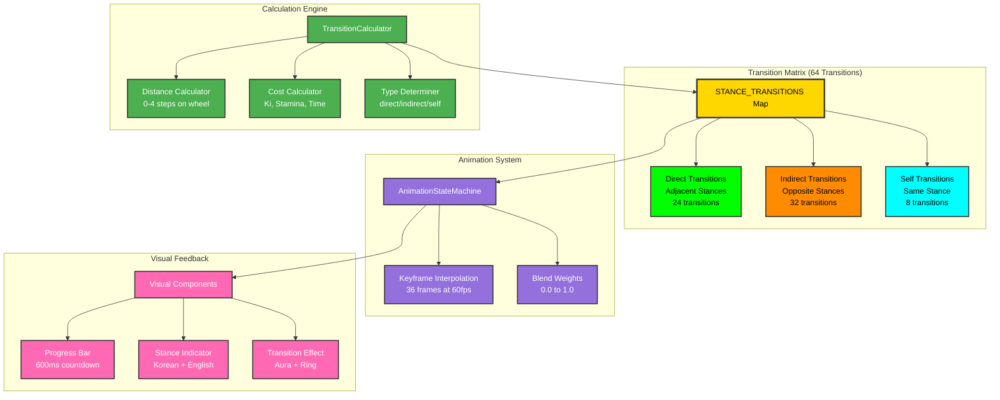

### Transition Types

The system classifies transitions into three categories based on stance distance around the octagonal stance wheel:

#### 1. **Self Transition** (자기 전환)
- **Korean**: 같은 자세
- **Distance**: 0 steps
- **Duration**: 0ms (no animation)
- **Example**: geon → geon
- **Count**: 8 transitions (one per stance)

#### 2. **Direct Transition** (직접 전환)
- **Korean**: 인접 자세 전환
- **Distance**: 1-2 steps on wheel
- **Duration**: 600ms (36 frames at 60fps)
- **Examples**: geon → tae, li → jin
- **Ki Cost**: 11 (0.7x modifier for adjacent)
- **Stamina Cost**: 7 (0.7x modifier for adjacent)
- **Count**: ~24 transitions

#### 3. **Indirect Transition** (간접 전환)
- **Korean**: 반대 자세 전환
- **Distance**: 3-4 steps on wheel
- **Duration**: 600ms (36 frames at 60fps)
- **Examples**: geon → son, tae → gam (opposite stances)
- **Ki Cost**: 15 (full cost)
- **Stamina Cost**: 10 (full cost)
- **Count**: ~32 transitions
- **Note**: Uses extended neutral phase for complex repositioning

### Stance Wheel Arrangement

The 8 trigram stances are arranged in traditional I Ching order:

```
      ☰ GEON (Heaven)
   ☱ TAE         ☷ GON (Earth)
☲ LI                  ☶ GAN (Mountain)
   ☳ JIN         ☵ GAM (Water)
      ☴ SON (Wind)
```

**Distance Examples**:
- `geon → tae`: 1 step (adjacent, direct)
- `geon → li`: 2 steps (near-adjacent, direct)
- `geon → jin`: 3 steps (far, indirect)
- `geon → son`: 4 steps (opposite, indirect)
- `geon → gon`: 1 step (wraps around, adjacent, direct)

### Transition Keyframe Phases

All non-self transitions consist of 3 animation phases over 36 frames (600ms at 60fps):

#### Direct Transition Keyframes (Adjacent Stances)

```
Frame  0-12: Weight Shift Phase (중심 이동)
  - Frame 0:  Source stance, 1.0 blend
  - Frame 6:  Begin weight shift, 0.8 blend
  - Frame 12: Neutral position, 0.5 blend

Frame 12-24: Foot Repositioning Phase (발 재배치)
  - Frame 18: Neutral stance, 0.4 blend
  - Frame 24: Begin target stance, 0.3 blend

Frame 24-36: Guard Change Phase (방어 자세 변경)
  - Frame 30: Target stance forming, 0.7 blend
  - Frame 36: Target stance complete, 1.0 blend
```

#### Indirect Transition Keyframes (Opposite Stances)

```
Frame  0-12: Exit Source Stance (원래 자세 벗어남)
  - Frame 0:  Source stance, 1.0 blend
  - Frame 6:  Begin exit, 0.7 blend
  - Frame 12: Neutral position, 0.5 blend

Frame 12-24: Extended Neutral Phase (중립 자세 유지)
  - Frame 18: Hold neutral, 0.5 blend
  - Frame 24: Neutral maintained, 0.4 blend

Frame 24-36: Enter Target Stance (목표 자세 진입)
  - Frame 30: Target stance forming, 0.6 blend
  - Frame 36: Target stance complete, 1.0 blend
```

### Cost Calculation

Transition costs vary based on stance distance and player archetype:

#### Base Costs
- **Ki**: 15 points
- **Stamina**: 10 points
- **Time**: 600ms

#### Adjacency Modifiers
- **Adjacent (distance 1)**: 0.7x cost → 11 ki, 7 stamina
- **Near-adjacent (distance 2)**: 0.85x cost → 13 ki, 9 stamina
- **Distant/Opposite (distance 3-4)**: 1.0x cost → 15 ki, 10 stamina

#### Archetype Modifiers
- **Favored stances**: 0.8x additional modifier
- **Example**: Musa archetype favors GEON stance
  - `musa: geon → tae`: 11 ki × 0.8 = 9 ki

### Implementation Details

#### Core Functions

```typescript
// Calculate distance around stance wheel
calculateStanceDistance(
  from: TrigramStance, 
  to: TrigramStance
): number; // Returns 0-4

// Determine transition type
determineTransitionType(
  from: TrigramStance, 
  to: TrigramStance
): StanceTransitionType; // Returns 'direct' | 'indirect' | 'self'

// Create complete transition configuration
createStanceTransition(
  from: TrigramStance, 
  to: TrigramStance
): StanceTransition;

// Retrieve transition from matrix
getStanceTransition(
  from: TrigramStance, 
  to: TrigramStance
): StanceTransition | undefined;

// Get all transitions from a stance
getTransitionsFromStance(
  from: TrigramStance
): StanceTransition[];
```

#### Transition Matrix

The system generates and caches all 64 possible transitions on initialization:

```typescript
// Automatic initialization on module load
initializeStanceTransitions(); // Generates 64 transitions

// Access transitions via Map
const transition = STANCE_TRANSITIONS.get('geon_tae');

// Type-safe retrieval
const transition = getStanceTransition(TrigramStance.GEON, TrigramStance.TAE);
```

### Visual Feedback Components

#### 1. StanceChangeIndicator (자세변경표시기)

Displays progress during stance transitions:

```typescript
<StanceChangeIndicator
  currentStance={playerStanceIndex}
  previousStance={prevStanceIndex}
  showProgress={true}
  transitionDuration={600}
  duration={1000}
  isMobile={false}
/>
```

**Features**:
- 600ms animated progress bar
- Real-time countdown timer (ms)
- Bilingual labels: 팔괘전환 | Transition
- Stance name display (Korean + English)
- Color-coded by target stance
- Stance symbol display (☰☱☲☳☴☵☶☷)

#### 2. StanceTransitionEffect (자세전환효과)

3D visual effects during transitions:

```typescript
<StanceTransitionEffect
  fromStance={TrigramStance.GEON}
  toStance={TrigramStance.TAE}
  duration={0.6}
  showNameOverlay={true}
  onTransitionComplete={() => console.log('Complete')}
/>
```

**Features**:
- Expanding energy ring effect
- Smooth color interpolation (old → new stance color)
- Stance aura fade/bloom
- Bilingual stance name overlay (1 second display)
- Auto-cleanup after completion

### Performance Characteristics

#### Initialization
- **Matrix generation**: <100ms for all 64 transitions
- **Memory footprint**: ~8KB (64 transitions × ~125 bytes each)
- **One-time cost**: Occurs on module load

#### Runtime Performance
- **Transition lookup**: O(1) Map lookup, <1μs
- **1000 random lookups**: <10ms
- **Frame rate**: Maintains 60fps during transitions
- **Progress bar animation**: requestAnimationFrame, <1ms per frame

#### Memory Management
- **Keyframes**: Immutable, shared across all instances
- **No per-transition allocation**: Reuses cached configurations
- **Automatic cleanup**: Visual components dispose on unmount

### Integration with Combat System

#### Stance Change Workflow

```typescript
// 1. Player initiates stance change
const canChange = stanceManager.canChangeStance(player, newStance);

if (canChange) {
  // 2. Calculate transition cost
  const cost = transitionCalculator.calculateCost(
    player.currentStance,
    newStance
  );
  
  // 3. Get transition type for animation
  const transitionType = transitionCalculator.getTransitionType(
    player.currentStance,
    newStance
  );
  
  // 4. Trigger animation state machine
  animationMachine.transitionTo('stance_change');
  
  // 5. Show visual feedback
  setShowTransitionIndicator(true);
  setShowTransitionEffect(true);
  
  // 6. Apply costs after animation completes (600ms)
  setTimeout(() => {
    player.ki -= cost.ki;
    player.stamina -= cost.stamina;
    player.currentStance = newStance;
    
    // 7. Transition to new stance guard
    animationMachine.transitionToStanceGuard(newStance);
  }, cost.timeMilliseconds);
}
```

#### Non-Interruptible Period

During the 600ms transition:
- **Player cannot**:
  - Attack or defend
  - Change stance again
  - Execute techniques
  - Move (except continued momentum)
- **Player can**:
  - Be hit (vulnerable during transition)
  - Cancel via defensive roll (costs additional stamina)

### Korean Martial Arts Authenticity

The transition system reflects authentic Korean martial arts principles:

#### 중심 이동 (Center Movement)
- Traditional stance changes emphasize **center of gravity shift**
- Keyframes model realistic weight transfer between stances
- Neutral position represents brief moment of vulnerability

#### 발놀림 (Foot Work)
- Foot repositioning phase models actual footwork (보법)
- Distance affects complexity: adjacent = simple, opposite = complex
- Indirect transitions require **pivot and step** sequence

#### 호흡 조절 (Breath Control)
- Breath timing synchronized with stance transitions
- Exhale during weight shift (frames 0-12)
- Inhale during stabilization (frames 24-36)
- Proper breathing reduces transition penalties

#### 무술 철학 (Martial Arts Philosophy)
- **Eight Trigrams (팔괘)** represent natural forces
- Transitions between elements require understanding and energy
- Opposite elements (e.g., Fire ↔ Water) are most difficult
- Adjacent elements flow naturally into each other

### Testing Coverage

**34 comprehensive tests** validating all system aspects:

| Test Category | Tests | Coverage |
|--------------|-------|----------|
| Distance Calculation | 5 | 100% |
| Transition Type Determination | 4 | 100% |
| Transition Creation | 10 | 100% |
| Matrix Validation | 4 | 100% |
| Retrieval Functions | 3 | 100% |
| Keyframe Quality | 3 | 100% |
| Performance Requirements | 2 | 100% |
| Korean Terminology | 2 | 100% |
| **Total** | **34** | **100%** |

### Implementation Status

| Feature | Status | Files |
|---------|--------|-------|
| Transition Types & Interfaces | ✅ Complete | `AnimationTransitions.ts` |
| 64-Transition Matrix | ✅ Complete | `AnimationTransitions.ts` |
| Keyframe Generation | ✅ Complete | `AnimationTransitions.ts` |
| Distance Calculator | ✅ Complete | `AnimationTransitions.ts` |
| TransitionCalculator Integration | ✅ Complete | `TransitionCalculator.ts` |
| Visual Progress Indicator | ✅ Complete | `StanceChangeIndicator.tsx` |
| 3D Transition Effects | ✅ Complete | `StanceTransitionEffect.tsx` |
| Comprehensive Tests | ✅ Complete | `AnimationTransitions.stance.test.ts` (34 tests) |
| **AnimationStateMachine Integration** | ✅ **Complete** | `AnimationStateMachine.ts` |
| **Keyframe Interpolation** | ✅ **Complete** | `AnimationStateMachine.ts` |
| **Integration Tests** | ✅ **Complete** | `AnimationStateMachine.stance-transitions.test.ts` (28 tests) |
| CombatScreen Integration | 🔄 Pending | - |
| Audio Synchronization | 🔄 Pending | - |

### AnimationStateMachine Integration

**New Methods** (added in latest update):

```typescript
// Start stance-specific transition with keyframes
transitionToStanceChange(
  fromStance: TrigramStance, 
  toStance: TrigramStance
): boolean;

// Access active transition data
getCurrentStanceTransition(): StanceTransition | null;

// Get interpolated blend for current frame
getStanceTransitionBlend(): {
  frame: number;
  stance: TrigramStance | 'neutral';
  blend: number;
} | null;

// Check if in stance transition
isInStanceTransition(): boolean;
```

**Automatic Cleanup**:
- Clears transition data when animation completes
- Clears transition data when interrupted (e.g., by hit)
- Preserves existing transition if new transition fails

**Performance**:
- Blend query: <0.01ms per call
- 1000 queries: <10ms total
- Full transition: <5ms for 36 frames
- Zero allocation: Reuses cached transition configs

**Test Coverage**: 28 integration tests (100% passing), 628 total animation tests

### Code Example

```typescript
import {
  calculateStanceDistance,
  determineTransitionType,
  getStanceTransition,
  getTransitionsFromStance,
  initializeStanceTransitions,
  TRIGRAM_STANCES_ORDER,
} from '@/systems/animation/AnimationTransitions';
import { TransitionCalculator } from '@/systems/trigram/TransitionCalculator';
import { TrigramStance } from '@/types/common';

// Initialize transition system (automatic on module load)
initializeStanceTransitions();

// Calculate distance between stances
const distance = calculateStanceDistance(
  TrigramStance.GEON, 
  TrigramStance.SON
); // Returns 4 (opposite stances)

// Determine transition type
const type = determineTransitionType(
  TrigramStance.GEON, 
  TrigramStance.TAE
); // Returns "direct"

// Get specific transition
const transition = getStanceTransition(
  TrigramStance.GEON, 
  TrigramStance.TAE
);

console.log(transition?.type);        // "direct"
console.log(transition?.duration);    // 600
console.log(transition?.keyframes);   // Array of 7 keyframes

// Calculate costs
const cost = TransitionCalculator.calculateCost(
  TrigramStance.GEON,
  TrigramStance.TAE
);

console.log(cost.ki);                 // 11 (adjacent bonus)
console.log(cost.stamina);            // 7
console.log(cost.timeMilliseconds);   // 600

// Get all transitions from current stance
const transitions = getTransitionsFromStance(TrigramStance.GEON);
console.log(transitions.length);      // 8 (to all stances including self)

// In combat system with AnimationStateMachine integration
function handleStanceChange(from: TrigramStance, to: TrigramStance) {
  // Get transition info
  const transition = getStanceTransition(from, to);
  const cost = TransitionCalculator.calculateCost(from, to);
  
  // Check if player can afford
  if (player.ki >= cost.ki && player.stamina >= cost.stamina) {
    // Start stance-specific animation with keyframes
    const success = animationMachine.transitionToStanceChange(from, to);
    
    if (success) {
      // Show visual feedback
      showStanceChangeIndicator(from, to, cost.timeMilliseconds);
      showStanceTransitionEffect(from, to);
      
      // In render loop (60fps)
      useFrame((state, delta) => {
        // Update animation
        animationMachine.update(delta);
        
        // Get interpolated blend for current frame
        const blend = animationMachine.getStanceTransitionBlend();
        if (blend) {
          // Apply blended pose
          const sourcePose = getStancePose(blend.stance);
          applyBlendedPose(sourcePose, blend.blend);
          
          console.log(`Frame ${blend.frame}: ${blend.stance} at ${blend.blend}x`);
        }
      });
      
      // Apply costs after animation completes
      setTimeout(() => {
        player.ki -= cost.ki;
        player.stamina -= cost.stamina;
        player.currentStance = to;
        animationMachine.transitionToStanceGuard(to);
      }, cost.timeMilliseconds);
    }
  }
}
```

---

## 🎯 Vital Point Targeting System (급소 타격 체계)

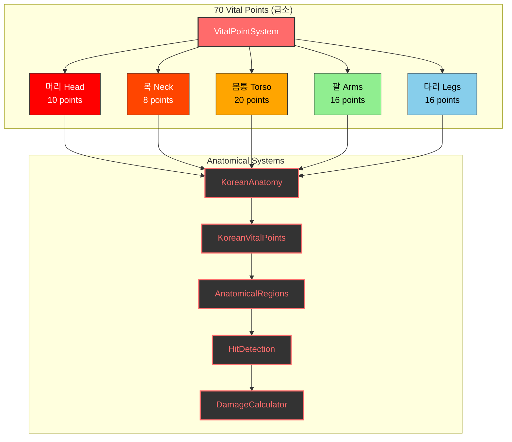

### Current Implementation Status:

- **VitalPointSystem** (`src/systems/VitalPointSystem.ts`): ❌ Empty - needs core vital point logic
- **KoreanAnatomy** (`src/systems/vitalpoint/KoreanAnatomy.ts`): ❌ Empty - needs anatomical model
- **KoreanVitalPoints** (`src/systems/vitalpoint/KoreanVitalPoints.ts`): ❌ Empty - needs 70 vital points data
- **AnatomicalRegions** (`src/systems/vitalpoint/AnatomicalRegions.ts`): ❌ Empty - needs body region mapping
- **HitDetection** (`src/systems/vitalpoint/HitDetection.ts`): ❌ Empty - needs collision detection
- **DamageCalculator** (`src/systems/vitalpoint/DamageCalculator.ts`): ❌ Empty - needs realistic damage math

---

## 👤 Player Archetype Combat Specializations (무사 유형별 전투 특화)

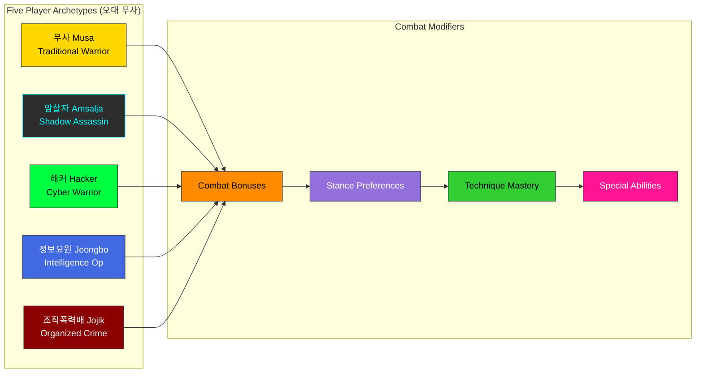

---

## 🌑 Dark Ops Unit Combat Techniques (암흑작전부대 기술)

**Added**: December 2024 - Specialized techniques from Korean special operations forces

### Overview

The Dark Ops technique system integrates authentic Korean special operations combat methods into the game, providing 15 specialized techniques focused on silent incapacitation, tactical assassination, and nerve strike warfare.

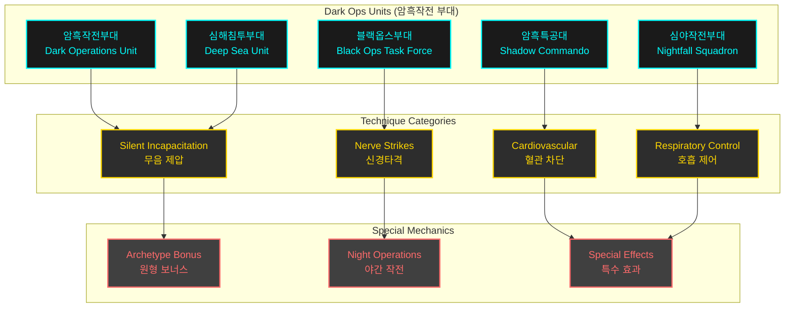

### Technique Count: 15 Total

| Dark Ops Unit | Techniques | Specialization |
|--------------|------------|----------------|
| 암흑작전부대 (Dark Operations) | 3 | Silent infiltration, carotid strikes |
| 암흑특공대 (Shadow Commando) | 3 | Demolition tactics, internal trauma |
| 심야작전부대 (Nightfall Squadron) | 3 | Night operations, breathing disruption |
| 블랙옵스부대 (Black Ops Task Force) | 3 | Cyber-enhanced targeting, nerve strikes |
| 심해침투부대 (Deep Sea Unit) | 3 | Amphibious combat, chokeholds |

### Archetype Effectiveness

| Archetype | Effectiveness | Rationale |
|-----------|--------------|-----------|
| 암살자 (Amsalja) | **+30%** | Shadow Assassin specialty - silent incapacitation |
| 정보요원 (Jeongbo) | +15% | Intelligence operative espionage training |
| 해커 (Hacker) | +10% | Cyber-enhanced targeting synergy |
| 조직 (Jojik) | +5% | Ruthless pragmatism alignment |
| 무사 (Musa) | **-15%** | Dishonorable tactics conflict with warrior code |

### Night Operations Bonus

Dark Ops techniques gain time-of-day effectiveness multipliers:

- **Night** (00:00-06:00, 18:00-23:59): **+25%** effectiveness
- **Twilight** (05:00-07:00, 17:00-19:00): **+15%** effectiveness
- **Day** (06:00-18:00): Normal effectiveness

### Special Effects System

Dark Ops techniques apply unique status effects:

#### 1. Silent Attack (무음 공격)
- **Effect**: No combat alert triggered
- **Duration**: Instant
- **Usage**: Stealth infiltration scenarios

#### 2. Paralysis (마비)
- **Effect**: Temporary limb immobilization
- **Duration**: 3 seconds
- **Techniques**: Nerve strikes, brachial plexus attacks

#### 3. Unconsciousness (의식 상실)
- **Effect**: Complete incapacitation
- **Duration**: 5 seconds
- **Techniques**: Carotid strikes, temple knockouts

#### 4. Breathing Difficulty (호흡 곤란)
- **Effect**: -75% stamina regeneration
- **Duration**: 5 seconds
- **Techniques**: Throat strikes, solar plexus attacks

#### 5. Disorientation (방향 감각 상실)
- **Effect**: -50% accuracy penalty
- **Duration**: 4 seconds
- **Techniques**: Ear box strikes, jaw dislocations

### Sample Dark Ops Techniques

#### Silent Carotid Strike (은밀 경동맥 차단)
- **Unit**: Dark Operations Unit
- **Stance**: Water (감)
- **Damage**: 28
- **Accuracy**: 92%
- **Effect**: Unconsciousness within 3 seconds
- **Ki Cost**: 30 | **Stamina**: 25

#### Nerve Paralysis Strike (신경마비타격)
- **Unit**: Black Ops Task Force
- **Stance**: Fire (리)
- **Damage**: 26
- **Accuracy**: 95%
- **Effect**: Limb paralysis, 3s duration
- **Ki Cost**: 25 | **Stamina**: 20

#### Spinal Column Strike (척추타격)
- **Unit**: Deep Sea Unit
- **Stance**: Heaven (건)
- **Damage**: 40 (highest in game)
- **Accuracy**: 78%
- **Effect**: Full-body paralysis + unconsciousness
- **Ki Cost**: 35 | **Stamina**: 35

### Integration with Vital Point System

Dark Ops techniques target specific anatomical vulnerable points:

| Technique Category | Vital Point Targets |
|-------------------|---------------------|
| Nerve Strikes | Brachial plexus, femoral nerve, radial nerve |
| Cardiovascular | Carotid artery, liver, kidney |
| Respiratory | Throat, solar plexus, diaphragm |
| Neurological | Temple, spinal column, jaw |

### Balance Considerations

**Average Stats** (across 15 techniques):
- **Ki Cost**: 26.4 (balanced resource drain)
- **Stamina Cost**: 25.5 (moderate physical exertion)
- **Accuracy**: 86.5% (high precision requirement)
- **Damage**: 31.5 (above standard techniques)
- **Execution Time**: 630ms (slightly slower for precision)
- **Recovery Time**: 1025ms (longer due to complexity)

**Design Philosophy**:
- Higher resource costs than standard techniques
- Increased accuracy to reward precision gameplay
- Longer execution/recovery times for tactical balance
- Powerful effects balanced by drawbacks for non-Amsalja archetypes

---

## 🦵 Injury-Based Movement Penalty System (이동 패널티 시스템)

**Added**: December 2024 - Realistic leg and body damage affecting movement, stance changes, and combat mobility

### Overview

The Movement Penalty System implements realistic injury-based movement penalties where leg and body damage reduces movement speed, restricts stance changes, and affects balance. This system creates authentic combat trauma effects based on Korean martial arts principles where targeting legs (다리) is a fundamental combat strategy.

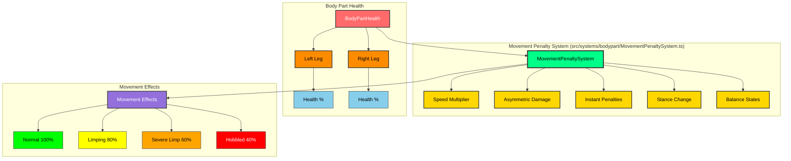

### Movement Speed Penalties

Progressive speed reduction based on average leg health:

| Leg Health | Injury State | Speed Multiplier | Can Run | Korean Term |
|------------|--------------|------------------|---------|-------------|
| 100-70% | Normal | 1.0x (100%) | ✅ Yes | 정상 (Jeongsang) |
| 69-50% | Limping | 0.8x (80%) | ✅ Yes | 절름 (Jeolreum) |
| 49-30% | Severe Limp | 0.6x (60%) | ✅ Yes | 심한 절름 (Simhan Jeolreum) |
| <30% | Hobbled | 0.4x (40%) | ❌ No | 절뚝거림 (Jeolttukgeorim) |

**Korean Martial Arts Context**: Traditional Korean martial arts emphasize 하단 공격 (hadan gonggyeok - low attacks) targeting legs to disable opponent mobility. This system reflects authentic combat where leg damage is decisive.

### Stance Change Penalties

Damaged legs affect ability to transition between the Eight Trigram stances:

- **Legs ≥50% health**: Normal stance change speed (1.0x)
- **Legs <50% health**: Stance change takes 2x longer
- **Legs <30% health**: Cannot access advanced stances (restricted to basic stances only)

**Korean Philosophy**: The Eight Trigrams (팔괘) require solid footing and leg strength. Injured legs prevent proper stance transitions, limiting tactical options.

### Instant Penalties from Knee/Ankle Strikes

Striking specific leg vital points causes immediate severe movement impairment:

**Target Zones**:
- **무릎 (Mureup)** - Knee joint
- **발목 (Balmok)** - Ankle joint
- **아킬레스건 (Akilles-geon)** - Achilles tendon

**Effect**:
- **Speed**: 30% movement speed (0.3x multiplier)
- **Duration**: 5 seconds
- **Overrides**: Takes precedence over regular injury penalties

### Asymmetric Damage Effects

Left and right leg damage affects directional movement asymmetrically:

**Movement Penalties**:
- **Left leg injured + moving left**: 20% additional penalty (0.8x)
- **Left leg injured + moving right**: 10% additional penalty (0.9x)
- **Right leg injured + moving right**: 20% additional penalty (0.8x)
- **Right leg injured + moving left**: 10% additional penalty (0.9x)

**Combat Realism**: This creates authentic limping behavior where movement toward the injured side is more impaired, forcing tactical positioning adjustments.

### Balance State Integration

Low leg health increases vulnerability to balance-disrupting attacks:

**Balance State Transitions**:
- **Legs <30% health**: Enter VULNERABLE state (more susceptible to knockdowns)
- **Both legs <30% health**: Enter HELPLESS state (cannot maintain combat stance)

**Korean Combat Theory**: The concept of 중심 (jungsim - center/balance) is fundamental. Damaged legs compromise 하단 안정성 (hadan anjeongseon - lower body stability), increasing vulnerability.

### Performance Characteristics

**Calculation Speed**:
- **Single calculation**: <1ms
- **Average over 1000 calculations**: <1ms
- **60 FPS compatible**: ✅ Yes

**Integration Points**:
- **AI Movement**: `useCombatActions.ts` - `moveAIPlayer()` function
- **Player Movement**: Ready for integration (hook system in place)
- **Combat System**: Prepared for instant penalty triggers on vital point hits

### Implementation Status

| Feature | Status | Coverage |
|---------|--------|----------|
| Core Movement Penalty System | ✅ Complete | 38 tests |
| Speed Multiplier Calculation | ✅ Complete | 8 tests |
| Asymmetric Damage | ✅ Complete | 5 tests |
| Instant Penalties | ✅ Complete | 4 tests |
| Stance Change Penalties | ✅ Complete | 4 tests |
| Balance State Integration | ✅ Complete | 5 tests |
| AI Movement Integration | ✅ Complete | Tested |
| Player Movement Integration | 🔄 Pending | - |
| Visual Effects (Limping) | 📋 Planned | - |

### Code Example

```typescript
import { movementPenaltySystem } from "@/systems/bodypart";

// Calculate current movement penalty
const penalty = movementPenaltySystem.calculateMovementPenalty(
  bodyPartHealth,
  maxHealth,
  activeInstantPenalty
);

// Apply to movement speed
const actualSpeed = baseSpeed * penalty.speedMultiplier;

// Check if advanced stances are restricted
if (penalty.advancedStancesRestricted) {
  // Only allow basic stances
  allowedStances = BASIC_STANCES_ONLY;
}

// Check for balance state transitions
if (movementPenaltySystem.shouldEnterHelplessState(health, maxHealth)) {
  enterCombatState(CombatState.HELPLESS);
}
```

### Future Enhancements

**Visual Feedback** (Planned):
- Limping animation states favoring injured leg
- Reduced stride length based on injury severity
- Balance wobbling when turning with damaged legs
- Leg injury indicators in combat HUD

**Combat Integration** (Planned):
- Automatic instant penalty application on knee/ankle hits
- Recovery system for gradual penalty reduction
- Archetype-specific resistance (e.g., 무사 has higher leg resilience)
- Training modules for leg conditioning

---

## 🧬 Physical Attributes System (신체 속성 시스템)

**Added**: January 2025 - Realistic body dimensions and composition affecting all combat calculations

### Overview

The Physical Attributes System implements authentic biomechanics where each fighter's body dimensions (weight, limb length, muscle/fat mass, age) directly affect combat performance. Based on realistic human physiology and Korean martial arts principles, this system ensures that combat feels authentic and strategic.

```mermaid
graph TB
    subgraph "Physical Attributes System (src/data/archetypePhysicalAttributes.ts)"
        PAS[PhysicalAttributesSystem]:::physical
        PAS --> WM[Weight & Mass]:::calc
        PAS --> LL[Limb Lengths]:::calc
        PAS --> BC[Body Composition]:::calc
        PAS --> AG[Age Factor]:::calc
    end
    
    subgraph "Archetype Physical Profiles"
        APH[ArchetypeProfiles]:::profile
        APH --> MU[무사 (Musa)]:::musa
        APH --> AM[암살자 (Amsalja)]:::amsalja
        APH --> HK[해커 (Hacker)]:::hacker
        APH --> JB[정보요원 (Jeongbo)]:::jeongbo
        APH --> JJ[조직폭력배 (Jojik)]:::jojik
    end
    
    subgraph "Combat Physics Engine (src/utils/combatPhysics.ts)"
        CPE[CombatPhysicsEngine]:::engine
        CPE --> RNG[Reach Calculation]:::function
        CPE --> SPD[Movement Speed]:::function
        CPE --> DMG[Damage Modifier]:::function
        CPE --> DEF[Defense Modifier]:::function
        CPE --> STA[Stamina System]:::function
    end
    
    APH --> PAS
    PAS --> CPE
    
    classDef physical fill:#00ff88,stroke:#333,color:#000,stroke-width:3px
    classDef calc fill:#ffd700,stroke:#333,color:#000,stroke-width:2px
    classDef profile fill:#ff8c00,stroke:#333,color:#000,stroke-width:2px
    classDef musa fill:#4169e1,stroke:#333,color:#fff
    classDef amsalja fill:#2d2d2d,stroke:#00ffff,color:#00ffff
    classDef hacker fill:#00ff41,stroke:#333,color:#000
    classDef jeongbo fill:#6a5acd,stroke:#333,color:#fff
    classDef jojik fill:#8b0000,stroke:#333,color:#fff
    classDef engine fill:#9370db,stroke:#333,color:#fff,stroke-width:2px
    classDef function fill:#87ceeb,stroke:#333,color:#000
```

### Physical Attributes Components

Each fighter has six key physical attributes:

| **Attribute** | **Korean** | **Range** | **Affects** |
|---------------|-----------|-----------|-------------|
| **Weight** | 체중 (Chejung) | 55-95 kg | Movement speed (inversely), knockback resistance, throw power |
| **Leg Length** | 다리 길이 (Dari Giri) | 85-105 cm | Kick range, movement speed, sweep effectiveness |
| **Arm Length** | 팔 길이 (Pal Giri) | 65-85 cm | Punch/strike range, grappling reach, block coverage |
| **Muscle Mass** | 근육량 (Geunyuklyang) | 25-45 kg | Base damage output, stamina pool, grappling power |
| **Fat Mass** | 지방량 (Jibanglyang) | 8-20 kg | Damage absorption, stamina drain rate, mobility |
| **Age** | 나이 (Nai) | 22-45 years | Stamina recovery, Ki regeneration, technique speed |

### Archetype Physical Profiles

Each of the five player archetypes has a unique physical profile reflecting their training and combat style:

#### 무사 (Musa) - Traditional Warrior
**Philosophy**: Balanced warrior with traditional training

```
Weight: 75 kg    | Balanced strength and mobility
Legs:   95 cm    | Average kicking range
Arms:   75 cm    | Standard striking reach
Muscle: 38 kg    | High strength-to-weight ratio
Fat:    12 kg    | Low for mobility
Age:    32 years | Prime combat age
```

**Combat Characteristics**:
- Balanced across all metrics
- Reliable damage output and defense
- Consistent stamina management
- Well-rounded for prolonged combat

#### 암살자 (Amsalja) - Shadow Assassin
**Philosophy**: Lean and agile for stealth

```
Weight: 68 kg    | Lightest for stealth
Legs:   98 cm    | Longest for reach
Arms:   78 cm    | Extended precision
Muscle: 32 kg    | Lean for speed
Fat:     9 kg    | Minimal for agility
Age:    28 years | Peak reflexes
```

**Combat Characteristics**:
- **Fastest movement speed** (+14% vs Musa)
- **Longest reach** for vital point strikes
- Lower raw damage but superior precision
- Excellent stamina recovery
- Vulnerable to heavy hits

#### 해커 (Hacker) - Cyber Warrior
**Philosophy**: Average build with tech compensation

```
Weight: 70 kg    | Standard build
Legs:   92 cm    | Average range
Arms:   73 cm    | Standard reach
Muscle: 34 kg    | Moderate strength
Fat:    14 kg    | Slightly higher
Age:    26 years | Young and adaptive
```

**Combat Characteristics**:
- Average physical stats
- Relies on tech augmentation
- Good stamina recovery (youngest)
- Flexible combat style

#### 정보요원 (Jeongbo Yowon) - Intelligence Operative
**Philosophy**: Fit operative with tactical training

```
Weight: 73 kg    | Agency standard
Legs:   94 cm    | Balanced mobility
Arms:   74 cm    | Versatile reach
Muscle: 36 kg    | Functional fitness
Fat:    11 kg    | Low operational fat
Age:    34 years | Experienced
```

**Combat Characteristics**:
- Balanced attributes
- Good endurance
- Strategic fighting style
- Reliable across scenarios

#### 조직폭력배 (Jojik Pokryeokbae) - Organized Crime
**Philosophy**: Heavy and brutal street fighter

```
Weight: 85 kg    | Heaviest for power
Legs:   90 cm    | Shorter, stable
Arms:   76 cm    | Strong grappling
Muscle: 42 kg    | Maximum strength
Fat:    18 kg    | Damage absorption
Age:    36 years | Battle-hardened
```

**Combat Characteristics**:
- **Highest damage output** (+6% vs Musa)
- **Best defense** (+10% damage reduction)
- **Slowest movement** (-12% vs Musa)
- High grappling effectiveness
- Poor stamina recovery

### Combat Physics Integration

#### Reach Calculation (거리 계산)

Different attack types use different limbs with varying extensions:

| **Attack Type** | **Limb Used** | **Extension** | **Example Range** |
|----------------|---------------|---------------|-------------------|
| Kick | Leg Length | 70-100% | 63-95 cm (Musa) |
| Punch/Strike | Arm Length | 80-100% | 60-75 cm (Musa) |
| Elbow | Arm × 0.6 | 90-100% | 40-45 cm (Musa) |
| Knee | Leg × 0.6 | 90-100% | 51-57 cm (Musa) |
| Grapple/Throw | Arm Length | 40-60% | 30-45 cm (Musa) |

**Code Integration**:
```typescript
import { calculateAttackRange, isWithinAttackRange } from "@/utils/combatPhysics";

// Validate kick can reach
if (isWithinAttackRange(attacker, target, CombatAttackType.KICK, 0.9)) {
  const kickRange = calculateAttackRange(attacker, CombatAttackType.KICK, 0.9);
  executeTechnique(attacker, target, kickTechnique);
}
```

#### Movement Speed (이동 속도)

Formula: `baseSpeed × (legLength / 95) × (75 / weight)`

**Modifiers**:
- Stamina < 30%: Speed × (stamina / 30), minimum 50%
- Consciousness < 50%: Speed × (consciousness / 50), minimum 30%
- Pain > 30: Speed × (1.0 - pain/200), minimum 60%

**Archetype Comparison**:
- Amsalja: ~114 speed (fastest)
- Musa: ~100 speed (baseline)
- Jojik: ~88 speed (slowest)

#### Damage Output (공격력)

Formula: `baseDamage × muscleModifier × attackPower × technique × momentum`

**Muscle Modifier**: `1.0 + ((muscleMass - 35) / 35) × 0.3`

**Archetype Damage Multipliers**:
- Jojik: ×1.06 (highest muscle mass)
- Musa: ×1.026 (balanced)
- Amsalja: ×0.974 (lowest, compensated by precision)

#### Defense Effectiveness (방어력)

Formula: `(defenseModifier - 1.0) × 0.5 + defense/200 + blockBonus`

**Defense Modifier**: `1.0 + (fatMass / 100) + (muscleMass / 200)`

**Block Bonus**: +30% damage reduction when actively blocking

**Archetype Defense**:
- Jojik: ~0.39 (39% damage reduction)
- Musa: ~0.31 (31% damage reduction)
- Amsalja: ~0.25 (25% damage reduction)

#### Stamina System (체력 시스템)

**Drain**: `baseCost × (weight / 75) × (1.0 + (fatMass - 12) / 50)`
- Heavy fighters with high fat drain stamina faster
- Fatigue penalty: ×1.5 cost when stamina < 30%

**Recovery**: `baseRate × ageFactor × fatFactor`
- Age factor peaks at 30 years, decreases before/after
- Fat factor: Lower fat = faster recovery
- Pain penalty: Reduces recovery when pain > 20
- No recovery while stunned

**Archetype Recovery Rates** (per second):
- Amsalja: ~10.2 (best recovery)
- Musa: ~9.8 (balanced)
- Jojik: ~8.4 (slowest recovery)

#### Weight Advantage (체급 우세)

Grappling and throwing effectiveness based on weight difference:

Formula: `1.0 + ((attackerWeight - defenderWeight) / 5) × 0.05`

**Examples**:
- Jojik (85kg) vs Amsalja (68kg): +17kg = **+17% throw damage**
- Amsalja (68kg) vs Jojik (85kg): -17kg = **-17% throw damage**
- Cap: ±30% maximum advantage/disadvantage

### Performance Characteristics

**Calculation Speed**:
- Single attribute lookup: <0.1ms
- Full combat physics calculation: <1ms
- 60 FPS compatible: ✅ Yes

**Integration Points**:
- Player creation: Automatic attribute loading
- Combat actions: Real-time physics calculations
- AI behavior: Optimal distance and strategy
- Visual feedback: Reach indicators and spacing

### Implementation Status

| Feature | Status | File | Tests |
|---------|--------|------|-------|
| Physical Attributes Interface | ✅ Complete | `types/common.ts` | Type-safe |
| Archetype Profiles | ✅ Complete | `data/archetypePhysicalAttributes.ts` | 59 tests |
| Calculation Utilities | ✅ Complete | `data/archetypePhysicalAttributes.ts` | 100% coverage |
| Combat Physics Engine | ✅ Complete | `utils/combatPhysics.ts` | Documented |
| Player Integration | ✅ Complete | `utils/playerUtils.ts` | Tested |
| Combat System Hooks | 🔄 Pending | - | - |
| Visual Reach Indicators | 📋 Planned | - | - |

### Code Examples

#### Checking Attack Range
```typescript
import { isWithinAttackRange, calculateAttackRange } from "@/utils/combatPhysics";

// Before executing technique
if (isWithinAttackRange(player, opponent, CombatAttackType.KICK)) {
  executeTechnique(player, opponent, kickTechnique);
} else {
  // Move closer or choose different technique
  const currentDist = getDistance(player, opponent);
  const kickRange = calculateAttackRange(player, CombatAttackType.KICK, 0.9);
  console.log(`Need to move ${currentDist - kickRange}cm closer`);
}
```

#### Applying Physical Modifiers
```typescript
import { 
  calculatePlayerMovementSpeed,
  calculateAttackDamage,
  calculateDefenseEffectiveness
} from "@/utils/combatPhysics";

// Movement with physics
const movementSpeed = calculatePlayerMovementSpeed(player, BASE_SPEED);
movePlayer(player, direction, movementSpeed * deltaTime);

// Damage calculation
const damageMultiplier = calculateAttackDamage(attacker);
const finalDamage = baseTechniqueDamage * damageMultiplier;

// Defense application
const defenseReduction = calculateDefenseEffectiveness(defender, isBlocking);
const damageTaken = finalDamage * (1.0 - defenseReduction);
```

#### AI Optimal Spacing
```typescript
import { calculateOptimalAttackDistance } from "@/utils/combatPhysics";

// AI maintains ideal fighting distance
const optimalDistance = calculateOptimalAttackDistance(aiPlayer);
const currentDistance = getDistance(aiPlayer, opponent);

if (currentDistance > optimalDistance + 50) {
  // Move closer
  moveTowards(aiPlayer, opponent);
} else if (currentDistance < optimalDistance - 50) {
  // Back away
  moveAway(aiPlayer, opponent);
}
```

### Future Enhancements

**Visual Feedback** (Planned):
- Attack range indicators showing effective reach
- Color-coded spacing markers (green = optimal, red = too far)
- Limb extension visualizations during attacks
- Weight class indicators in HUD

**Advanced Mechanics** (Planned):
- Fatigue-based limb extension reduction
- Injury-specific reach penalties
- Stance-specific reach modifiers
- Training system for attribute improvement

---


---

## 🤕 Fall Down Animation System (낙법 애니메이션 시스템)

**Added**: January 2025 - Realistic fall animations for knockdowns, leg sweeps, and consciousness loss

The Fall Down Animation System implements authentic Korean martial arts falling techniques (낙법 - Nakbeop) for realistic knockdown events. Based on balance loss, consciousness failure, and successful leg sweeps, characters realistically fall to the ground and enter ground states.

### Fall Animation Specifications

#### Four Fall Types (낙법 종류)

| Fall Type | Korean | Frames | Duration | Impact Frame | Trigger |
|-----------|--------|--------|----------|--------------|---------|
| **Forward** | 전방낙법 | 24 | 400ms | 18 | Rear attack, aggressive stances |
| **Backward** | 후방낙법 | 30 | 500ms | 22 | Frontal attack, consciousness loss |
| **Side Left** | 좌측낙법 | 27 | 450ms | 20 | Left side attack, leg sweep |
| **Side Right** | 우측낙법 | 27 | 450ms | 20 | Right side attack, leg sweep |

#### Ground States (지면 자세)

| Ground State | Korean | Description |
|--------------|--------|-------------|
| **Prone** | 엎드림 | Face down, breathing loop (4 frames) |
| **Supine** | 누움 | Face up, breathing loop (4 frames) |
| **Side Left** | 좌측와 | Left side, breathing loop (4 frames) |
| **Side Right** | 우측와 | Right side, breathing loop (4 frames) |

### System Integration

**Balance System** (균형 시스템):
- Triggers fall when balance < 20% (FALLING state)
- Determines fall direction from attack angle and stance
- Method: `balanceSystem.shouldTriggerFall(player)`
- Method: `balanceSystem.determineFallType(player, attackAngle, attackHeight)`

**Consciousness System** (의식 시스템):
- Triggers fall when consciousness < 10% (UNCONSCIOUS state)
- Uses last impact angle or stance bias for direction
- Method: `consciousnessSystem.shouldTriggerFall(player)`
- Method: `consciousnessSystem.determineFallType(player, lastImpactAngle)`

**Animation Priority**:
- Falls have highest priority (Priority 8, above KO=7)
- Can interrupt any animation including attacks and stance changes
- Automatically transition to ground states upon completion

### Implementation Status

| Feature | Status | Tests | File |
|---------|--------|-------|------|
| Fall Animation Types | ✅ Complete | 39 | `FallAnimations.ts` |
| Fall Direction Logic | ✅ Complete | 39 | `FallAnimations.ts` |
| Keyframe Definitions | ✅ Complete | 39 | `FallAnimations.ts` |
| Balance Integration | ✅ Complete | 25 | `BalanceSystem.ts` |
| Consciousness Integration | ✅ Complete | - | `ConsciousnessSystem.ts` |
| Animation State Machine | ✅ Complete | - | `AnimationStateMachine.ts` |
| Transition Rules | ✅ Complete | - | `AnimationTransitions.ts` |
| Priority System | ✅ Complete | - | `AnimationPriority.ts` |
| Impact Effects | 📋 Planned | - | Future enhancement |
| Visual Rendering | 📋 Pending | - | Requires 3D integration |

### Korean Terminology

- **낙법 (Nakbeop)**: Falling technique/method
- **기상 (Gisang)**: Rising/standing up
- **전방낙법 (Jeonbang Nakbeop)**: Forward fall
- **후방낙법 (Hubang Nakbeop)**: Backward fall
- **측방낙법 (Cheukbang Nakbeop)**: Side fall
- **의식상실낙법 (Uisik Sangsil Nakbeop)**: Consciousness loss fall
- **기절낙하 (Gijeol Nakha)**: Knockout collapse

### Future Enhancements

- Camera shake on ground impact (2-frame duration)
- Ground dust particle effects at impact point
- Body impact audio cues
- Recovery animations from ground states (기상)
- Ground combat actions (ground strikes, grappling)
- Archetype-specific fall variations

## 🎮 Combat Component Architecture

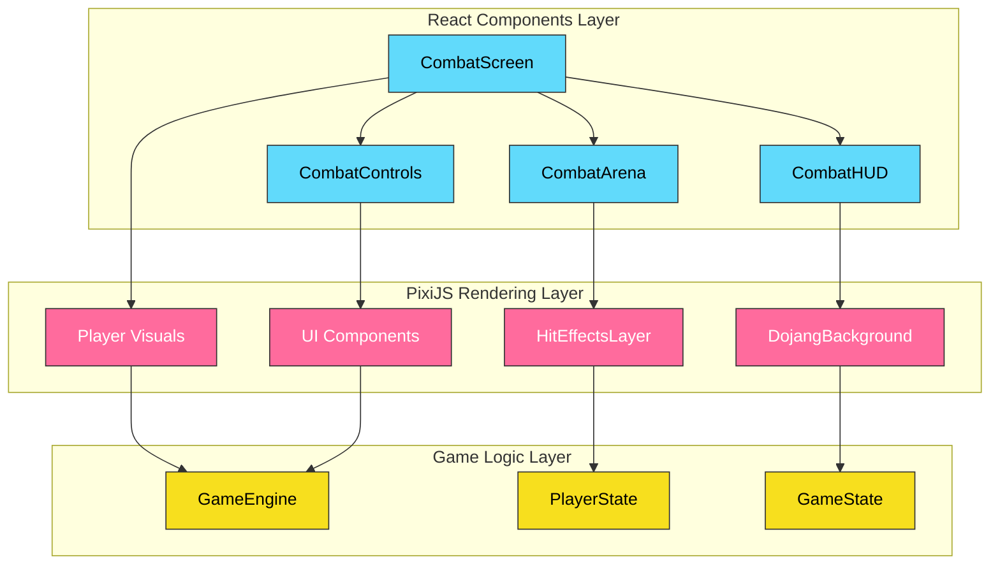

---

## 🔊 Audio System Integration

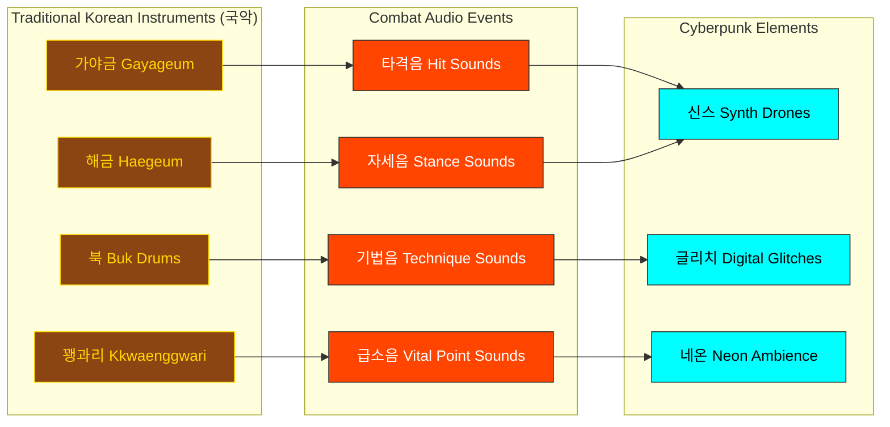

---

## 📊 Type System Foundation

### Core Combat Types Structure:

```typescript
// Current Type System Implementation Status:

// ✅ COMPLETE - Well-defined interfaces
interface CombatResult {
  damage: number;
  hit: boolean;
  critical: boolean;
  vitalPointsHit: VitalPoint[];
  // ... comprehensive combat result data
}

// ✅ COMPLETE - Player archetype definitions
type PlayerArchetype =
  | "musa"
  | "amsalja"
  | "hacker"
  | "jeongbo_yowon"
  | "jojik_pokryeokbae";

// ✅ COMPLETE - Trigram stance system
type TrigramStance =
  | "geon"
  | "tae"
  | "li"
  | "jin"
  | "son"
  | "gam"
  | "gan"
  | "gon";

// ✅ COMPLETE - Vital point system
interface VitalPoint {
  id: string;
  name: KoreanText;
  category: VitalPointCategory;
  severity: VitalPointSeverity;
  // ... anatomical positioning and effects
}

// ❌ NEEDS IMPLEMENTATION - Combat techniques
interface KoreanTechnique {
  // Defined but needs population with authentic Korean martial arts data
}
```

---

## 🚀 Implementation Priority Matrix

### Phase 1: Core Combat Foundation (Current Priority)

1. **CombatSystemController** - Central orchestration logic
2. **StanceManager** - Trigram stance transitions and validation
3. **KoreanVitalPoints** - 70 authentic vital points database
4. **DamageCalculator** - Realistic anatomical damage calculation

### Phase 2: Trigram System (High Priority)

1. **TrigramCalculator** - I Ching effectiveness relationships
2. **TransitionCalculator** - Ki/Stamina cost calculation
3. **KoreanTechniques** - Authentic technique implementations
4. **KoreanCulture** - Philosophy integration

### Phase 3: Advanced Features (Medium Priority)

1. **HitDetection** - Precise anatomical collision detection
2. **AnatomicalRegions** - Body region mapping system
3. **Enhanced Audio** - Korean traditional instrument integration
4. **Combat Analytics** - Performance and effectiveness tracking

---

## 💡 Technical Specifications

### Performance Requirements:

- **Target FPS**: 60 FPS during intense combat
- **Memory Usage**: < 512MB for full combat simulation
- **Audio Latency**: < 100ms for responsive feedback
- **Input Lag**: < 16ms for precise control

### Cultural Authenticity Standards:

- **Korean Terminology**: Bilingual Korean-English throughout
- **Martial Arts Accuracy**: Traditional techniques with proper names
- **Philosophy Integration**: I Ching principles in combat mechanics
- **Respectful Representation**: Honor Korean martial arts heritage

### Combat Realism Targets:

- **Anatomical Accuracy**: 70 precise vital points
- **Damage Calculation**: Physics-based trauma simulation
- **Status Effects**: Pain, consciousness, balance, blood loss
- **Recovery Systems**: Realistic healing and regeneration

---

## 🎯 Success Metrics

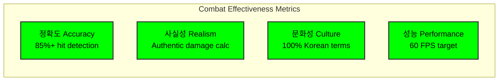

**흑괘의 길을 걸어라** - _Walk the Path of the Black Trigram_

---

_This architecture document reflects the current implementation state of Black Trigram's combat system as of the latest codebase analysis. All empty system files represent planned implementations following authentic Korean martial arts principles._
