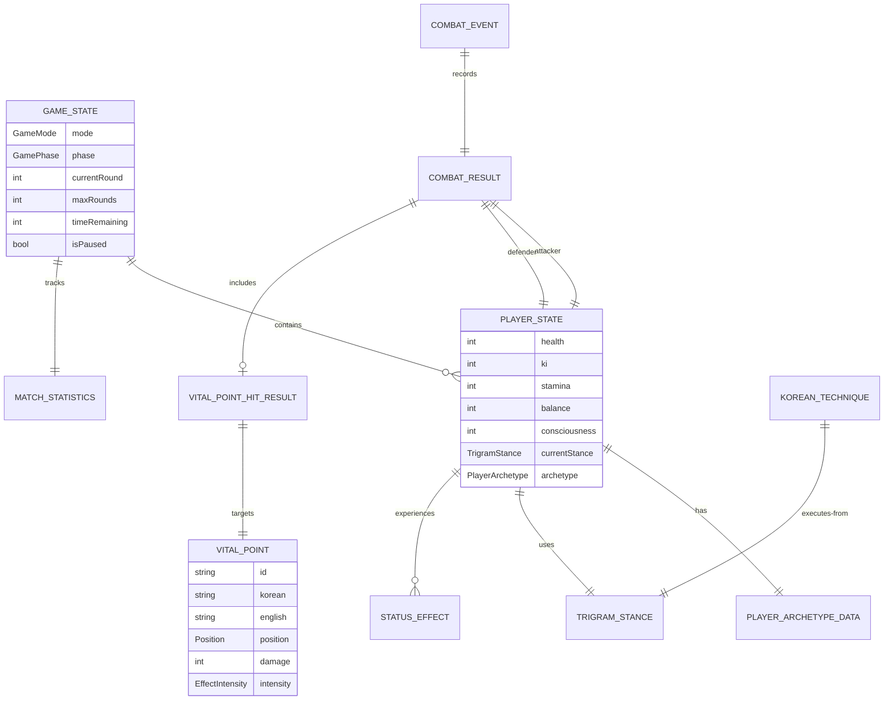

# 📊 Black Trigram (흑괘) — Data Model

This document defines the complete data model for the Black Trigram Korean martial arts combat simulator, documenting all game state structures, TypeScript interfaces, and data relationships.

## 📚 Related Documentation

| Document | Focus | Description |
|----------|-------|-------------|
| [Architecture](ARCHITECTURE.md) | 🏛️ System | Frontend-only architecture overview |
| [FLOWCHART](FLOWCHART.md) | 🔄 Flows | Game and combat data flows |
| [STATEDIAGRAM](STATEDIAGRAM.md) | 🎯 States | State machine transitions |
| [Combat Architecture](COMBAT_ARCHITECTURE.md) | ⚔️ Combat | Detailed combat system design |

---

## 🎯 Core Game Data Model

### **Entity-Relationship Overview**



---

## 🎮 Player & Archetype Data

### **PlayerState Interface**

**File**: `src/systems/player/types.ts`

```typescript
export interface PlayerState {
  readonly id: string;
  readonly archetype: PlayerArchetype;
  readonly currentStance: TrigramStance;
  
  // Core Resources
  readonly health: number;        // 0-100
  readonly ki: number;           // 0-100 (energy/chi)
  readonly stamina: number;      // 0-100 (physical endurance)
  readonly balance: number;      // 0-100 (physical stability)
  readonly consciousness: number; // 0-100 (awareness/focus)
  
  // Combat State
  readonly pain: number;         // 0-100 (accumulated pain)
  readonly momentum: number;     // -100 to +100 (combat advantage)
  
  // Position & Movement
  readonly position: Position;
  readonly velocity: Velocity;
  readonly facing: "left" | "right";
  
  // Status
  readonly isAlive: boolean;
  readonly isStunned: boolean;
  readonly isBlocking: boolean;
  readonly statusEffects: readonly StatusEffect[];
  
  // Match Statistics
  readonly matchStats: PlayerMatchStats;
}
```

### **Player Archetypes**

**File**: `src/types/common.ts`

```typescript
export enum PlayerArchetype {
  MUSA = "musa",                    // 무사 - Traditional Warrior
  AMSALJA = "amsalja",             // 암살자 - Shadow Assassin
  HACKER = "hacker",               // 해커 - Cyber Warrior
  JEONGBO_YOWON = "jeongbo_yowon", // 정보요원 - Intelligence Operative
  JOJIK_POKRYEOKBAE = "jojik_pokryeokbae" // 조직폭력배 - Organized Crime
}

export interface PlayerArchetypeData {
  readonly id: string;
  readonly name: KoreanText;
  readonly description: KoreanText;
  readonly philosophy: KoreanText;
  
  // Base Stats
  readonly baseHealth: number;
  readonly baseKi: number;
  readonly baseStamina: number;
  readonly coreStance: TrigramStance;
  
  // Combat Stats
  readonly stats: {
    attackPower: number;
    defense: number;
    speed: number;
    technique: number;
  };
  
  // Visual Theme
  readonly theme: {
    primary: number;
    secondary: number;
  };
  
  // Combat Preferences
  readonly favoredStances: readonly TrigramStance[];
  readonly specialAbilities: readonly string[];
}
```

---

## ⚔️ Combat System Data

### **CombatResult Interface**

**File**: `src/systems/combat/types.ts`

```typescript
export interface CombatResult {
  readonly success: boolean;
  readonly damage: number;
  readonly hit: boolean;
  readonly isCritical: boolean;
  readonly isBlocked: boolean;
  readonly vitalPointHit: boolean;
  readonly criticalHit: boolean;
  readonly timestamp: number;
  
  readonly attacker?: PlayerState;
  readonly defender?: PlayerState;
  readonly technique?: KoreanTechnique;
  readonly effects: readonly StatusEffect[];
}
```

### **GameState Interface**

```typescript
export interface GameState {
  readonly mode: GameMode;
  readonly phase: GamePhase;
  readonly players: readonly [PlayerState, PlayerState];
  readonly currentRound: number;
  readonly maxRounds: number;
  readonly timeRemaining: number;
  readonly isPaused: boolean;
  readonly matchStatistics: MatchStatistics;
  readonly winner?: PlayerState | null;
}

export enum GameMode {
  VERSUS = "versus",
  TRAINING = "training",
  PRACTICE = "practice"
}

export enum GamePhase {
  LOADING = "loading",
  INTRO = "intro",
  CHARACTER_SELECT = "character_select",
  COMBAT = "combat",
  ROUND_END = "round_end",
  MATCH_END = "match_end"
}
```

---

## 🎯 Trigram Stance System

### **TrigramStance Enum**

**File**: `src/types/common.ts`

```typescript
export enum TrigramStance {
  GEON = "geon", // ☰ 건 - Heaven
  TAE = "tae",   // ☱ 태 - Lake
  LI = "li",     // ☲ 리 - Fire
  JIN = "jin",   // ☳ 진 - Thunder
  SON = "son",   // ☴ 손 - Wind
  GAM = "gam",   // ☵ 감 - Water
  GAN = "gan",   // ☶ 간 - Mountain
  GON = "gon"    // ☷ 곤 - Earth
}
```

### **Korean Technique Interface**

**File**: `src/systems/vitalpoint/types.ts`

```typescript
export interface KoreanTechnique {
  readonly id: string;
  readonly name: KoreanText;
  readonly description: KoreanText;
  readonly category: TechniqueCategory;
  readonly stance: TrigramStance;
  
  // Execution Parameters
  readonly baseDamage: number;
  readonly executionTime: number;
  readonly recoveryTime: number;
  readonly range: number;
  readonly accuracy: number;
  
  // Resource Costs
  readonly kiCost: number;
  readonly staminaCost: number;
  
  // Combat Properties
  readonly canBlock: boolean;
  readonly canCounter: boolean;
  readonly armorPiercing: number;
  readonly criticalChance: number;
  
  // Visual/Audio
  readonly animation?: string;
  readonly soundEffect?: SoundEffectId;
  readonly particleEffect?: ParticleType;
}

export enum TechniqueCategory {
  STRIKE = "strike",
  GRAPPLE = "grapple",
  THROW = "throw",
  JOINT_LOCK = "joint_lock",
  PRESSURE_POINT = "pressure_point",
  COUNTER = "counter",
  BLOCK = "block"
}
```

---

## 🎯 Vital Point System Data

### **VitalPoint Interface**

**File**: `src/systems/vitalpoint/types.ts`

```typescript
export interface VitalPoint {
  readonly id: string;
  readonly name: KoreanText;
  readonly category: VitalPointCategory;
  
  // Anatomical Data
  readonly position: Position;
  readonly hitboxRadius: number;
  readonly meridian?: string;
  
  // Combat Effects
  readonly baseDamage: number;
  readonly effectIntensity: EffectIntensity;
  readonly statusEffect?: StatusEffectType;
  readonly effectDuration: number;
  
  // Game Balance
  readonly difficulty: number;
  readonly accessibility: number;
  readonly requiredTechnique?: TechniqueCategory;
}

export enum VitalPointCategory {
  HEAD = "head",
  NECK = "neck",
  TORSO = "torso",
  ARMS = "arms",
  LEGS = "legs",
  JOINTS = "joints"
}

export interface VitalPointHitResult {
  readonly hit: boolean;
  readonly vitalPoint: VitalPoint | null;
  readonly accuracy: number;
  readonly damageMultiplier: number;
  readonly effectsApplied: readonly StatusEffect[];
  readonly criticalHit: boolean;
}
```

---

## 🔄 Status Effects Data

### **StatusEffect Interface**

**File**: `src/systems/types.ts`

```typescript
export interface StatusEffect {
  readonly id: string;
  readonly type: StatusEffectType;
  readonly intensity: EffectIntensity;
  readonly duration: number;
  readonly description: KoreanText;
  readonly stackable: boolean;
  readonly source: string;
  readonly startTime: number;
  readonly endTime: number;
}

export enum StatusEffectType {
  STUN = "stun",
  BLEED = "bleed",
  POISON = "poison",
  BURN = "burn",
  PARALYSIS = "paralysis",
  WEAKNESS = "weakness",
  SLOW = "slow",
  BLIND = "blind",
  CONFUSION = "confusion",
  BUFF_STRENGTH = "buff_strength",
  BUFF_SPEED = "buff_speed",
  BUFF_DEFENSE = "buff_defense"
}

export enum EffectIntensity {
  MINOR = "minor",
  MODERATE = "moderate",
  SEVERE = "severe",
  CRITICAL = "critical"
}
```

---

## 📊 Match Statistics Data

### **MatchStatistics Interface**

**File**: `src/systems/combat/types.ts`

```typescript
export interface MatchStatistics {
  readonly totalDamageDealt: number;
  readonly totalDamageTaken: number;
  readonly criticalHits: number;
  readonly vitalPointHits: number;
  readonly techniquesUsed: number;
  readonly perfectStrikes: number;
  readonly consecutiveWins: number;
  readonly matchDuration: number;
  readonly totalMatches: number;
  readonly maxRounds: number;
  readonly winner: number;
  readonly totalRounds: number;
  readonly currentRound: number;
  readonly timeRemaining: number;
  readonly combatEvents: readonly CombatEventData[];
  readonly finalScore: { player1: number; player2: number };
  readonly roundsWon: { player1: number; player2: number };
  readonly player1: PlayerMatchStats;
  readonly player2: PlayerMatchStats;
}

export interface PlayerMatchStats {
  readonly damageDealt: number;
  readonly damageTaken: number;
  readonly criticalHits: number;
  readonly vitalPointHits: number;
  readonly techniquesUsed: number;
  readonly blocksSuccessful: number;
  readonly combosExecuted: number;
  readonly perfectStrikes: number;
}
```

---

## 🎨 Visual Effects Data

### **HitEffect Interface**

```typescript
export interface HitEffect {
  readonly id: string;
  readonly type: HitEffectType;
  readonly attackerId: string;
  readonly defenderId: string;
  readonly timestamp: number;
  readonly duration: number;
  readonly intensity: number;
  readonly position?: Position;
  readonly velocity?: Velocity;
  readonly color?: number;
  readonly size?: number;
  readonly alpha?: number;
  readonly damageAmount?: number;
  readonly vitalPointId?: string;
  readonly statusEffect?: StatusEffect;
}

export enum HitEffectType {
  IMPACT = "impact",
  BLOOD = "blood",
  ENERGY = "energy",
  BONE_BREAK = "bone_break",
  NERVE_STRIKE = "nerve_strike",
  BLOCK_SPARK = "block_spark",
  CRITICAL_FLASH = "critical_flash"
}
```

---

## 🎵 Audio System Data

### **SoundEffectId Type**

**File**: `src/audio/types.ts`

```typescript
export type SoundEffectId =
  | "attack_light"
  | "attack_medium"
  | "attack_heavy"
  | "attack_critical"
  | "hit_light"
  | "hit_medium"
  | "hit_heavy"
  | "critical_hit"
  | "block_success"
  | "block_break"
  | "stance_change"
  | "technique_execute"
  | "match_start"
  | "combat_end"
  | "victory"
  | "defeat";
```

---

## 🔧 System Configuration Data

### **Game Configuration Constants**

**File**: `src/systems/types.ts`

```typescript
export const COMBAT_CONFIG = {
  MAX_HEALTH: 100,
  MAX_KI: 100,
  MAX_STAMINA: 100,
  MAX_BALANCE: 100,
  MAX_CONSCIOUSNESS: 100,
  
  CRITICAL_HIT_MULTIPLIER: 2.0,
  VITAL_POINT_MULTIPLIER: 1.5,
  COUNTER_ATTACK_MULTIPLIER: 1.3,
  
  STAMINA_RECOVERY_RATE: 10,
  KI_RECOVERY_RATE: 5,
  BALANCE_RECOVERY_RATE: 15,
  CONSCIOUSNESS_RECOVERY_RATE: 2,
  
  TECHNIQUE_COOLDOWN: 500,
  STANCE_CHANGE_COOLDOWN: 200,
  BLOCK_DURATION: 300,
  RECOVERY_TIME: 400
} as const;
```

---

## 📐 Geometric Data Types

### **Position & Velocity**

**File**: `src/types/common.ts`

```typescript
export interface Position {
  readonly x: number;
  readonly y: number;
}

export interface Velocity {
  readonly x: number;
  readonly y: number;
}

export interface Dimensions {
  readonly width: number;
  readonly height: number;
}
```

---

## 🌍 Localization Data

### **KoreanText Interface**

**File**: `src/types/common.ts`

```typescript
export interface KoreanText {
  readonly korean: string;
  readonly english: string;
}
```

---

**📋 Document Control:**  
**✅ Approved by:** CEO  
**📤 Distribution:** Public  
**🏷️ Classification:** Public  
**📅 Effective Date:** 2025-11-14  
**⏰ Next Review:** 2026-11-14  
**🎯 Compliance:** ISO 27001 (A.8.9), NIST CSF (PR.IP-1)
