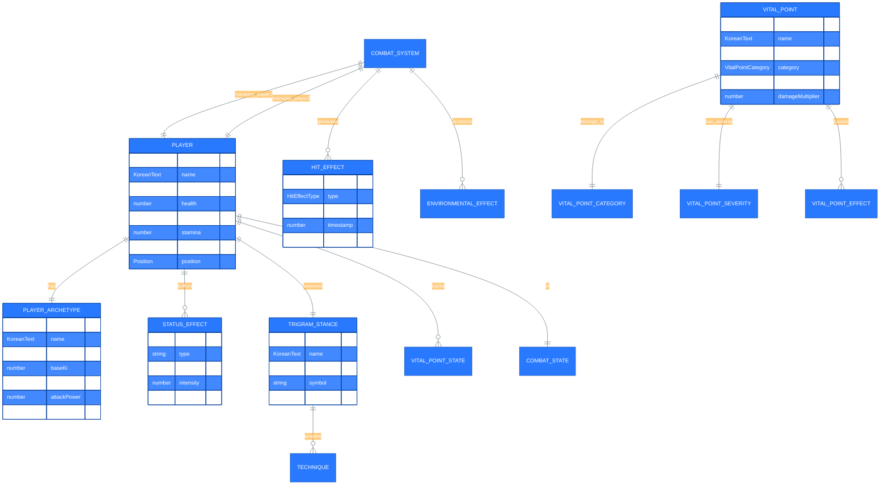
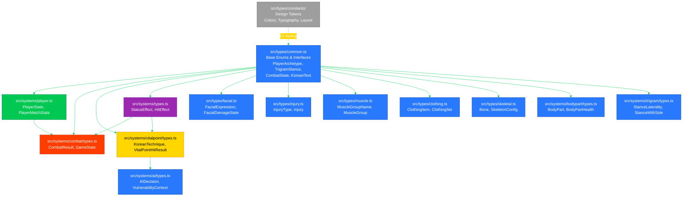
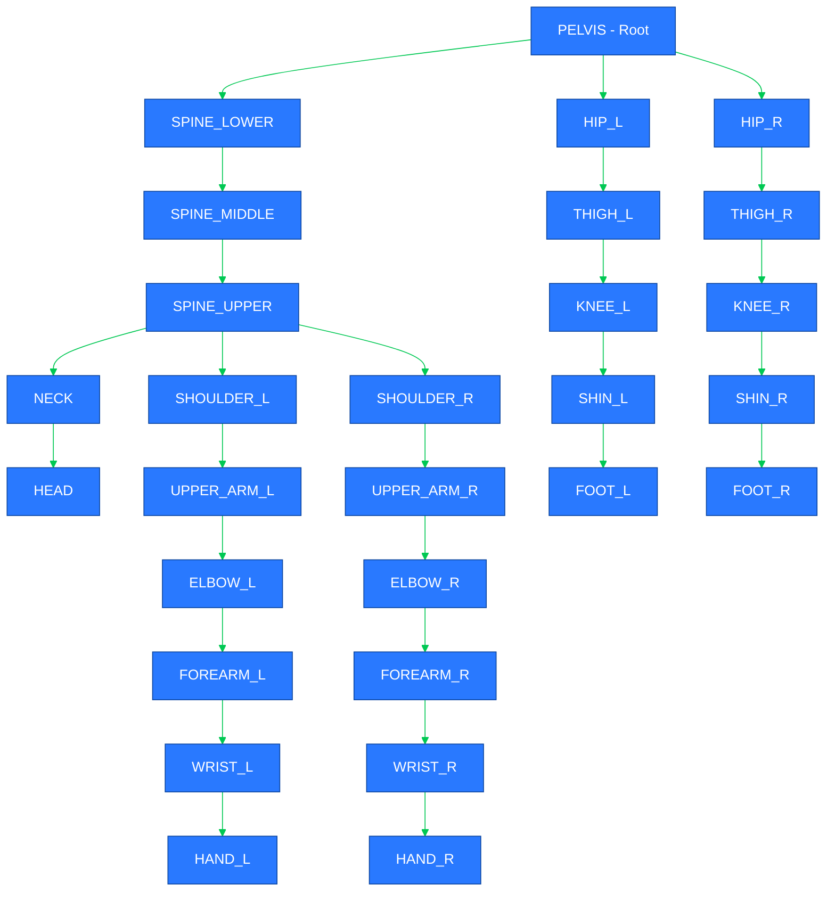
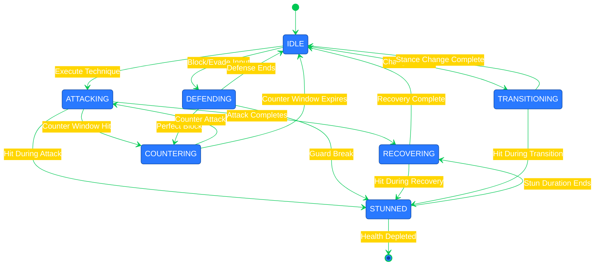

# 📊 Black Trigram (흑괘) Data Model

**Last Updated:** 2026-04-21  
**Product Version:** 0.7.32  
**Status:** Production-Ready

## 📚 Related Documentation

| Document                                      | Focus            | Description                                    |
| --------------------------------------------- | ---------------- | ---------------------------------------------- |
| [Architecture](ARCHITECTURE.md)               | 🏛️ Structure     | C4 model showing system components             |
| [Flowchart](FLOWCHART.md)                     | 🔄 Process Flow  | Game flow and state transitions                |
| [State Diagram](STATEDIAGRAM.md)              | 🎮 State Machine | Combat and game state management               |
| [Combat Architecture](COMBAT_ARCHITECTURE.md) | ⚔️ Combat System | Detailed combat mechanics implementation       |

---

## 🎯 Overview

Black Trigram (흑괘) is a frontend-only Korean martial arts combat simulator with a comprehensive data model supporting authentic vital point targeting, eight trigram stances, and realistic combat physics. All data structures are implemented in TypeScript with strict type safety and readonly properties for immutability.

### **Data Architecture Principles**

- ✅ **Type Safety**: Strict TypeScript with no implicit any
- ✅ **Immutability**: Readonly properties throughout.
- ✅ **Korean Cultural Authenticity**: Bilingual Korean-English text support
- ✅ **Session-Only Storage**: No backend persistence (browser session state)
- ✅ **Functional Design**: Pure functions and immutable state updates

**Data Model Sections:**
- [Core Type System](#core-type-system) — Entity relationships and base interfaces
- [TypeScript Interface Examples](#typescript-interface-examples) — Key interface definitions
- [Advanced Type Definitions](#advanced-type-definitions) — Facial, injury, muscle, and clothing types
- [Type Organization Guide](#type-organization-guide) — Where to find and add types
- [Skeletal Animation Data Model](#skeletal-animation-data-model) — 28-bone skeletal hierarchy
- Cross-reference: [State Diagrams](STATEDIAGRAM.md) for state transitions, [Flowcharts](FLOWCHART.md) for process flows

---

## 📐 Core Type System

### **Entity Relationship Diagram**



---

## 📝 TypeScript Interface Examples

The following are representative TypeScript interfaces from the codebase, implementing the data model described above. All interfaces use strict typing and readonly properties for immutability.

### **Core Interfaces from src/types/common.ts**

#### `KoreanText` - Bilingual Text Support

```typescript
// src/types/common.ts
export interface KoreanText {
  readonly korean: string;      // 한글 텍스트
  readonly english: string;      // English translation
  readonly romanized?: string;   // Optional romanization (e.g., "Geup-so-gyeok")
}
```

#### `Position` - 2D Spatial Coordinates

```typescript
// src/types/common.ts
export interface Position {
  readonly x: number;
  readonly y: number;
}
```

**Note**: The `Position` type represents 2D coordinates. For 3D rendering with Three.js, the combat system maps 2D positions to 3D space:
- `x` (horizontal) → Three.js `x` axis
- `y` (depth) → Three.js `z` axis  
- Three.js `y` axis represents height/elevation (handled separately in rendering layer)

#### Enum Types - Game Constants

```typescript
// src/types/common.ts
export enum PlayerArchetype {
  MUSA = "musa",                     // 무사 - Traditional Warrior
  AMSALJA = "amsalja",               // 암살자 - Shadow Assassin
  HACKER = "hacker",                 // 해커 - Cyber Warrior
  JEONGBO_YOWON = "jeongbo_yowon",   // 정보요원 - Intelligence Operative
  JOJIK_POKRYEOKBAE = "jojik_pokryeokbae", // 조직폭력배 - Organized Crime
}

export enum TrigramStance {
  GEON = "geon",  // ☰ 건 - Heaven
  TAE = "tae",    // ☱ 태 - Lake
  LI = "li",      // ☲ 리 - Fire
  JIN = "jin",    // ☳ 진 - Thunder
  SON = "son",    // ☴ 손 - Wind
  GAM = "gam",    // ☵ 감 - Water
  GAN = "gan",    // ☶ 간 - Mountain
  GON = "gon",    // ☷ 곤 - Earth
}

export enum CombatState {
  IDLE = "idle",
  ATTACKING = "attacking",
  DEFENDING = "defending",
  STUNNED = "stunned",
  RECOVERING = "recovering",
  COUNTERING = "countering",
  TRANSITIONING = "transitioning",
}
```

### **Player System from src/systems/player.ts**

#### `PlayerState` - Complete Player State

```typescript
// src/systems/player.ts
export interface PlayerState {
  // Identity
  readonly id: string;
  readonly name: KoreanText;
  readonly archetype: PlayerArchetype;

  // Core Resources
  readonly health: number;
  readonly maxHealth: number;
  readonly ki: number;              // 기 - Internal energy
  readonly maxKi: number;
  readonly stamina: number;
  readonly maxStamina: number;
  readonly energy: number;
  readonly maxEnergy: number;

  // Combat Attributes
  readonly attackPower: number;
  readonly defense: number;
  readonly speed: number;
  readonly technique: number;
  readonly pain: number;            // Pain tolerance (0-100)
  readonly consciousness: number;   // Awareness level (0-100)
  readonly balance: number;         // Physical stability (0-100)
  readonly momentum: number;        // Combat momentum (-100 to 100)

  // Combat State
  readonly currentStance: TrigramStance;
  readonly combatState: CombatState;
  readonly position: Position;
  readonly isBlocking: boolean;
  readonly isStunned: boolean;
  readonly isCountering: boolean;
  readonly lastActionTime: number;
  readonly recoveryTime: number;
  readonly lastStanceChangeTime: number;

  // Status Effects
  readonly statusEffects: readonly StatusEffect[];
  readonly activeEffects: readonly string[];

  // Vital Points State
  readonly vitalPoints: readonly {
    readonly id: string;
    readonly isHit: boolean;
    readonly damage: number;
    readonly lastHitTime: number;
  }[];

  // Match Statistics
  readonly totalDamageReceived: number;
  readonly totalDamageDealt: number;
  readonly hitsTaken: number;
  readonly hitsLanded: number;
  readonly perfectStrikes: number;
  readonly vitalPointHits: number;
}
```

### **Combat System from src/systems/types.ts**

#### `StatusEffect` - Status Effects and Debuffs

```typescript
// src/systems/types.ts
export interface StatusEffect {
  readonly id: string;
  readonly type: string;
  readonly intensity: EffectIntensity;
  readonly duration: number;        // Duration in milliseconds
  readonly description: KoreanText;
  readonly stackable: boolean;
  readonly source: string;          // What caused this effect
  readonly startTime: number;
  readonly endTime: number;
}
```

#### `HitEffect` - Visual Combat Feedback

```typescript
// src/systems/types.ts
export interface HitEffect {
  readonly id: string;
  readonly type: HitEffectType;
  readonly attackerId: string;
  readonly defenderId: string;
  readonly timestamp: number;
  readonly duration: number;
  readonly position?: Position;
  readonly velocity?: { x: number; y: number };
  readonly color?: number;
  readonly size?: number;
  readonly alpha?: number;
  readonly damageAmount?: number;
  readonly vitalPointId?: string;
  readonly intensity: number;
}
```

#### `PlayerArchetypeData` - Archetype Configuration

```typescript
// src/systems/types.ts
export interface PlayerArchetypeData {
  readonly id: string;
  readonly name: KoreanText;
  readonly description: KoreanText;
  readonly baseHealth: number;
  readonly baseKi: number;
  readonly baseStamina: number;
  readonly coreStance: TrigramStance;
  readonly theme: {
    primary: number;    // Primary color (hex)
    secondary: number;  // Secondary color (hex)
  };
  readonly stats: {
    attackPower: number;
    defense: number;
    speed: number;
    technique: number;
  };
  readonly favoredStances: readonly TrigramStance[];
  readonly specialAbilities: readonly string[];
  readonly philosophy: KoreanText;
}
```

### **Type Safety and Immutability Patterns**

All interfaces in Black Trigram follow these principles:

1. **Readonly Properties**: All object properties are marked `readonly` to prevent accidental mutation
2. **Strict Typing**: No `any` types; explicit types throughout
3. **Immutable Arrays**: Arrays use `readonly` modifier for immutability
4. **Functional Updates**: State changes create new objects rather than mutating existing ones

Example of immutable state update:

```typescript
// Immutable player health update
function updatePlayerHealth(
  player: PlayerState,
  healthChange: number
): PlayerState {
  return {
    ...player,
    health: Math.max(0, Math.min(player.maxHealth, player.health + healthChange)),
    totalDamageReceived: healthChange < 0 
      ? player.totalDamageReceived + Math.abs(healthChange)
      : player.totalDamageReceived,
  };
}
```

---

## 🎨 Advanced Type Definitions

The following type definitions cover specialized subsystems for realistic combat visualization. These types are defined in dedicated files under `src/types/` and provide strict TypeScript interfaces for facial animation, injury tracking, muscle tension, and clothing systems.

### **Facial Animation System from src/types/facial.ts**

The facial animation system provides realistic emotion and damage feedback during combat, with smooth expression transitions and eye tracking.

#### `FacialExpression` - Expression States

```typescript
// src/types/facial.ts
export enum FacialExpression {
  NEUTRAL = "neutral",       // 평온 - Calm, ready state
  FOCUSED = "focused",       // 집중 - Concentrated, ready to attack
  PAINED = "pained",         // 고통 - Pain response after hit
  EXHAUSTED = "exhausted",   // 지침 - Low stamina, heavy breathing
  VICTORIOUS = "victorious", // 승리 - Brief satisfaction after successful strike
  DEFEATED = "defeated",     // 패배 - Knocked out, unconscious
}
```

#### `FacialDamageState` - Damage Tracking

```typescript
// src/types/facial.ts
export interface FacialDamageState {
  readonly leftEyeSwelling: number;    // 0-1, 0=none, 1=fully swollen
  readonly rightEyeSwelling: number;   // 0-1
  readonly mouthBleeding: number;      // 0-1, lip bleeding intensity
  readonly noseBleeding: number;       // 0-1
  readonly leftCheekBruise: number;    // 0-1
  readonly rightCheekBruise: number;   // 0-1
  readonly foreheadBruise: number;     // 0-1, forehead bruise/cut
  readonly jawBruise: number;          // 0-1
  readonly totalFacialDamage: number;  // 0-100, cumulative
}
```

#### `ExpressionState` - Transition Management

```typescript
// src/types/facial.ts
export interface ExpressionState {
  readonly expression: FacialExpression;
  readonly intensity: number;                      // 0-1, degree of expression
  readonly transitionTime: number;                 // Seconds to transition
  readonly previousExpression?: FacialExpression;  // For blending
  readonly transitionProgress?: number;            // 0-1, transition progress
}
```

#### `HeadMovementType` - Combat Reactions

```typescript
// src/types/facial.ts
export enum HeadMovementType {
  RECOIL = "recoil",  // Head snaps back when hit
  NOD = "nod",        // Slight nod forward during attack
  TILT = "tilt",      // Head tilts to avoid strike
  TURN = "turn",      // Head turns to track opponent
  SHAKE = "shake",    // Head shakes when stunned
  DROP = "drop",      // Head drops when defeated
}
```

#### `EyeTrackingState` - Opponent Tracking

```typescript
// src/types/facial.ts
export interface EyeTrackingState {
  readonly targetPosition: THREE.Vector3;   // Opponent position
  readonly lookDirection: THREE.Vector3;    // Current look direction
  readonly pupilOffset: { x: number; y: number }; // -1 to 1 per axis
  readonly trackingSpeed: number;           // Smoothing factor
  readonly enabled: boolean;               // Whether tracking is active
}
```

---

### **Injury Tracking System from src/types/injury.ts**

The injury system tracks localized trauma for visualization, separating system logic from UI components.

#### `InjuryType` - Injury Classification

```typescript
// src/types/injury.ts
export enum InjuryType {
  BRUISE = "bruise",         // Blunt force trauma (부상)
  CUT = "cut",               // Sharp weapon/strike (베임)
  LACERATION = "laceration", // Deep cut with blood trail (열상)
  FRACTURE = "fracture",     // Bone damage indicator (골절)
}
```

#### `Injury` - Individual Injury Data

```typescript
// src/types/injury.ts
export interface Injury {
  readonly id: string;                            // Unique identifier
  readonly region: BodyRegion;                    // Body region affected
  readonly type: InjuryType;                      // Type of injury
  readonly position: [number, number, number];    // [x, y, z] relative to character
  readonly severity: number;                      // 0.0 to 1.0
  readonly hitCount: number;                      // Hits to same location (progressive bruising)
  readonly timestamp: number;                     // Creation timestamp
  readonly playerId?: string | number;            // Optional player ID
}
```

---

### **Muscle Tension System from src/types/muscle.ts**

The muscle system provides realistic body tension visualization during combat, with 29 anatomically-positioned muscle groups that flex up to +30% during technique execution.

#### `MuscleGroupName` - 29 Anatomical Muscle Groups

```typescript
// src/types/muscle.ts
export type MuscleGroupName =
  // Shoulders (2)
  | "SHOULDER_L" | "SHOULDER_R"
  // Arms (6)
  | "BICEP_L" | "BICEP_R" | "TRICEP_L" | "TRICEP_R" | "FOREARM_L" | "FOREARM_R"
  // Torso Front (5)
  | "PECTORALS" | "CORE" | "ABS" | "OBLIQUES" | "LOWER_ABS"
  // Torso Back (6)
  | "LAT_L" | "LAT_R" | "TRAPEZIUS" | "RHOMBOID" | "ERECTOR_SPINAE_L" | "ERECTOR_SPINAE_R"
  // Hips (2)
  | "HIP_FLEXOR_L" | "HIP_FLEXOR_R"
  // Legs (8)
  | "QUAD_L" | "QUAD_R" | "HAMSTRING_L" | "HAMSTRING_R"
  | "CALF_L" | "CALF_R" | "GLUTE_L" | "GLUTE_R";
```

#### `MuscleGroup` - Anatomical Definition

```typescript
// src/types/muscle.ts
export interface MuscleGroup {
  readonly name: MuscleGroupName;
  readonly baseScale: THREE.Vector3;           // Scale when relaxed
  readonly maxFlexScale: THREE.Vector3;        // Max scale when flexed (+30%)
  readonly position: THREE.Vector3;            // Position relative to character
  readonly geometryParams: {
    readonly radius: number;
    readonly length: number;
    readonly capSegments: number;
    readonly radialSegments: number;
  };
  readonly korean: string;                     // Korean name (한글)
  readonly english: string;                    // English name
}
```

#### `MuscleActivationState` - Real-Time Tension

```typescript
// src/types/muscle.ts
// Note: tension, targetTension, and isShaking are intentionally mutable
// for 60fps performance (avoiding object allocation per frame)
export interface MuscleActivationState {
  readonly muscleGroup: MuscleGroupName;
  tension: number;         // 0.0 = relaxed, 1.0 = maximum flex
  targetTension: number;   // Target for smooth transitions
  isShaking: boolean;      // Exhaustion shaking effect
}
```

#### `MuscleSystemConfig` - Performance Configuration

```typescript
// src/types/muscle.ts
export interface MuscleSystemConfig {
  readonly maxFrameTime: number;           // Frame budget (default: 3ms)
  readonly muscleCount: number;            // Groups to render (default: 20)
  readonly useInstancing: boolean;         // GPU instancing optimization
  readonly relaxationDelay: number;        // Post-technique relaxation (0.3s)
  readonly exhaustionThreshold: number;    // Stamina % for exhaustion (20%)
  readonly shakeFrequency: number;         // Hz when exhausted (20Hz)
  readonly shakeAmplitude: number;         // Radians (0.02)
  readonly activationSpeed: number;        // Activation transition speed (5.0)
  readonly relaxationSpeed: number;        // Relaxation transition speed (3.0)
  readonly shakingTensionThreshold: number; // Min tension for shaking (0.3)
}
```

---

### **Clothing System from src/types/clothing.ts**

The clothing system provides visual distinction for the five player archetypes with culturally-appropriate garments, materials, and cyberpunk Korean aesthetic.

#### `ClothingType` / `ClothingMaterial` / `ClothingFit` - Classification Types

```typescript
// src/types/clothing.ts
export type ClothingType =
  | "torso" | "pants" | "belt" | "boots"
  | "gloves" | "headgear" | "vest" | "accessory";

export type ClothingMaterial =
  | "fabric"     // Traditional cloth (dobok, hanbok)
  | "leather"    // Leather gear
  | "tactical"   // Modern tactical fabric
  | "synthetic"  // Synthetic materials
  | "armored"    // Armored plating
  | "cybernetic"; // Tech-enhanced materials

export type ClothingFit = "tight" | "fitted" | "loose" | "oversized";
```

#### `ClothingItem` - Individual Clothing Configuration

```typescript
// src/types/clothing.ts
export interface ClothingItem {
  readonly id: string;
  readonly nameKorean: string;             // 한글이름
  readonly nameEnglish: string;            // English name
  readonly type: ClothingType;
  readonly material: ClothingMaterial;
  readonly fit: ClothingFit;
  readonly colorPrimary: number;           // Primary color (hex)
  readonly colorSecondary?: number;        // Accent color (hex)
  readonly colorEmissive?: number;         // Glow effect color
  readonly emissiveIntensity?: number;     // 0-1
  readonly metalness?: number;             // 0-1
  readonly roughness?: number;             // 0-1
  readonly scaleMultiplier?: number;       // Body proportion scale
  readonly attachedBones: string[];        // Skeletal attachment points
  readonly castShadow?: boolean;
  readonly receiveShadow?: boolean;
}
```

#### `ClothingSet` - Complete Archetype Wardrobe

```typescript
// src/types/clothing.ts
export interface ClothingSet {
  readonly archetype: PlayerArchetype;
  readonly nameKorean: string;
  readonly nameEnglish: string;
  readonly descriptionKorean: string;
  readonly descriptionEnglish: string;
  readonly items: readonly ClothingItem[];
  readonly themeColors: {
    readonly primary: number;
    readonly secondary: number;
    readonly accent: number;
  };
}
```

#### `ClothingLODSettings` - Level-of-Detail Performance

```typescript
// src/types/clothing.ts
export interface ClothingLODSettings {
  readonly enableLOD: boolean;
  readonly distances: readonly [number, number, number]; // [near, medium, far]
  readonly highDetailSegments: number;
  readonly mediumDetailSegments: number;
  readonly lowDetailSegments: number;
}
```

---

## 📂 Type Organization Guide

Black Trigram types are organized across multiple directories based on their domain scope. This guide helps developers locate the correct type file for any given concern.

### **Type File Locations**

| Directory | Purpose | Key Files |
| --- | --- | --- |
| `src/types/` | Base game types and shared interfaces | `common.ts`, `facial.ts`, `injury.ts`, `muscle.ts`, `clothing.ts`, `skeletal.ts` |
| `src/types/constants/` | Design tokens and UI constants | `colors.ts`, `typography.ts`, `layout.ts`, `designSystem.ts`, `ui.ts`, `animations.ts`, `performance.ts` |
| `src/systems/player.ts` | Player state, attributes, and match statistics | `PlayerState`, `PlayerMatchStats`, `BodyPartHealth` |
| `src/systems/types.ts` | Cross-system shared types | `StatusEffect`, `HitEffect`, `PlayerArchetypeData`, `EffectIntensity` |
| `src/systems/combat/types.ts` | Combat result and game state | `CombatResult`, `RoundResult`, `MatchStatistics`, `GameState` |
| `src/systems/bodypart/types.ts` | Body part health tracking | `BodyPart` enum, `BodyPartHealth`, `BodyPartMaxHealth` |
| `src/systems/vitalpoint/types.ts` | Vital point targeting and techniques | `KoreanTechnique`, `VitalPointHitResult`, `DamageResult` |
| `src/systems/ai/types.ts` | AI combat decisions | `AIActionType`, `AIDecision`, `VulnerabilityContext`, `CombatContext` |
| `src/systems/trigram/types.ts` | Stance laterality and parsing | `StanceLaterality`, `StanceWithSide`, `parseStanceWithSide()` |

### **Type Hierarchy**



### **When to Add New Types**

| Type Scope | Add To | Example |
| --- | --- | --- |
| Core game enums/interfaces | `src/types/common.ts` | New `CombatState` variant |
| Visualization-specific types | `src/types/{domain}.ts` | New facial expression |
| Combat result/game flow types | `src/systems/combat/types.ts` | New round result field |
| Player state attributes | `src/systems/player.ts` | New player stat |
| AI behavior types | `src/systems/ai/types.ts` | New AI action type |
| Design tokens / UI constants | `src/types/constants/` | New color theme |

---

## 🦴 Skeletal Animation Data Model

### **28-Bone Skeletal Hierarchy**

Black Trigram implements a performance-optimized skeletal animation system with 28 core bones, expandable to 66 bones with full hand detail for close-up views.

#### **Core Bone Structure (28 bones)**



#### **Skeletal Rig TypeScript Interface**

```typescript
// src/types/skeletal.ts
export interface Bone {
  readonly name: string;
  parent: Bone | null;
  position: THREE.Vector3;
  rotation: THREE.Euler;
  scale: THREE.Vector3;
  children: Bone[];
  readonly length: number;
  readonly restPosition: THREE.Vector3;
  readonly restRotation: THREE.Euler;
}

export interface SkeletalRig {
  readonly root: Bone;
  readonly bones: Map<string, Bone>;
  readonly boneCount: number;
}

export enum BoneName {
  // Core (1)
  PELVIS = "pelvis",
  
  // Spine (3)
  SPINE_LOWER = "spine_lower",
  SPINE_MIDDLE = "spine_middle",
  SPINE_UPPER = "spine_upper",
  
  // Head (2)
  NECK = "neck",
  HEAD = "head",
  
  // Left Arm (6)
  SHOULDER_L = "shoulder_L",
  UPPER_ARM_L = "upper_arm_L",
  ELBOW_L = "elbow_L",
  FOREARM_L = "forearm_L",
  WRIST_L = "wrist_L",
  HAND_L = "hand_L",
  
  // Right Arm (6)
  SHOULDER_R = "shoulder_R",
  UPPER_ARM_R = "upper_arm_R",
  ELBOW_R = "elbow_R",
  FOREARM_R = "forearm_R",
  WRIST_R = "wrist_R",
  HAND_R = "hand_R",
  
  // Left Leg (5)
  HIP_L = "hip_L",
  THIGH_L = "thigh_L",
  KNEE_L = "knee_L",
  SHIN_L = "shin_L",
  FOOT_L = "foot_L",
  
  // Right Leg (5)
  HIP_R = "hip_R",
  THIGH_R = "thigh_R",
  KNEE_R = "knee_R",
  SHIN_R = "shin_R",
  FOOT_R = "foot_R",
}
```

---

## 👋 Hand Animation System (7 Hand Poses)

### **Korean Martial Arts Hand Poses**

```typescript
// src/types/hand-animation.ts
export enum HandPoseType {
  FIST = "fist",           // 주먹 - Closed fist for punching
  KNIFE_HAND = "knife_hand", // 수도 - Knife-hand strike
  SPEAR_HAND = "spear_hand", // 관수 - Spear-hand thrust
  PALM_HEEL = "palm_heel",   // 장력 - Palm-heel strike
  GRAPPLING = "grappling",   // 잡기 - Grappling hand
  OPEN = "open",            // 펴기 - Open hand neutral
  RELAXED = "relaxed",      // 휴식 - Relaxed natural
}

export interface HandPose {
  readonly type: HandPoseType;
  readonly nameKorean: string;
  readonly nameEnglish: string;
  readonly romanized: string;
  readonly fingerCurl: FingerCurl;
  readonly fingerSpread: FingerSpread;
  readonly wristRotation: THREE.Euler;
  readonly description: {
    readonly korean: string;
    readonly english: string;
  };
  readonly martialArtOrigin: "taekwondo" | "hapkido" | "taekyon" | "traditional";
  readonly strikingSurface: "knuckles" | "palm_heel" | "knife_edge" | "fingertips" | "whole_hand";
}

export interface FingerCurl {
  readonly thumb: number;   // 0 = extended, 1 = curled
  readonly index: number;
  readonly middle: number;
  readonly ring: number;
  readonly pinky: number;
}

export interface FingerSpread {
  readonly thumbIndex: number;    // 0 = together, 1 = spread
  readonly indexMiddle: number;
  readonly middleRing: number;
  readonly ringPinky: number;
}
```

---

## 🎯 Vital Point System (70 Points)

### **Complete Vital Points Database**

Black Trigram implements 70 authentic Korean martial arts vital points (급소) based on traditional anatomical targeting knowledge.

#### **Vital Point Distribution**

- **Head**: 12 points (temple, jaw, nose, eye, ear, throat, back of head)
- **Torso**: 24 points (heart, solar plexus, liver, spleen, kidneys, floating ribs)
- **Arms**: 17 points (shoulders, elbows, wrists, nerve clusters)
- **Legs**: 17 points (hips, knees, shins, ankles, pressure points)

#### **Vital Point TypeScript Interface**

```typescript
// src/systems/vitalpoint/types.ts
export interface VitalPoint {
  readonly id: string;
  readonly names: {
    readonly korean: string;
    readonly english: string;
    readonly romanized: string;
  };
  readonly position: Position;
  readonly category: VitalPointCategory;
  readonly severity: VitalPointSeverity;
  readonly baseDamage?: number;
  readonly effects: readonly VitalPointEffect[];
  readonly description: KoreanText;
  readonly targetingDifficulty: number;  // 0.0-1.0
  readonly effectiveStances: readonly TrigramStance[];
}

export enum VitalPointCategory {
  NEUROLOGICAL = "neurological",  // 신경계 - Nerve strikes
  SKELETAL = "skeletal",          // 골격계 - Bone targets
  VASCULAR = "vascular",          // 혈관계 - Blood vessels
  MUSCULAR = "muscular",          // 근육계 - Muscle groups
  RESPIRATORY = "respiratory",    // 호흡계 - Breathing targets
  INTERNAL = "internal",          // 내부 - Internal organs
}

export enum VitalPointSeverity {
  CRITICAL = "critical",  // 치명적 - Lethal potential
  MAJOR = "major",        // 중대 - Severe injury
  MODERATE = "moderate",  // 보통 - Significant pain
  MINOR = "minor",        // 경미 - Minor disruption
}
```

---

## ⚔️ Combat State Machine

### **Combat State Transitions**



### **Combat State TypeScript Definitions**

```typescript
// src/types/common.ts
export enum CombatState {
  IDLE = "idle",                    // 대기 - Ready stance
  ATTACKING = "attacking",           // 공격 - Executing technique
  DEFENDING = "defending",           // 방어 - Blocking/evading
  STUNNED = "stunned",              // 기절 - Unable to act
  RECOVERING = "recovering",         // 회복 - Post-attack recovery
  COUNTERING = "countering",         // 반격 - Counter window active
  TRANSITIONING = "transitioning",   // 전환 - Changing stance
}
```

---

## 🌐 Korean Text and Localization

### **Bilingual Text System**

```typescript
// src/types/common.ts
export interface KoreanText {
  readonly korean: string;      // 한글 텍스트
  readonly english: string;      // English translation
  readonly romanized?: string;   // Optional romanization (e.g., "geup-so-gyeok")
}

// Usage example
const vitalPointName: KoreanText = {
  korean: "태양혈",
  english: "Temple",
  romanized: "taeyang-hyeol",
};
```

### **Text Encoding Standards**

- **Korean Text**: UTF-8 encoding (한글)
- **Romanization**: Revised Romanization of Korean (RR)
- **Font Support**: Noto Sans CJK for Korean characters
- **Accessibility**: Korean screen reader support with proper ARIA labels

---

## 🔒 Data Security Considerations

### **Session-Only Storage Security**

- **No Backend Persistence**: All game state stored in browser session (sessionStorage/memory)
- **No PII Collection**: No personally identifiable information collected or stored
- **Client-Side Only**: No data transmitted to external servers
- **Memory Clearing**: Game state cleared on browser close
- **No Cookies**: Authentication not required for core gameplay

### **Future Cloud Persistence Security**

When backend persistence is implemented (see [FUTURE_DATA_MODEL.md](FUTURE_DATA_MODEL.md)), security controls will include:

- **Encryption at Rest**: DynamoDB encryption with AWS KMS
- **Encryption in Transit**: TLS 1.3 for all API communications
- **Access Control**: AWS IAM policies with least privilege
- **Audit Logging**: CloudTrail logging of all data access
- **Data Classification**: Per Hack23 ISMS Classification Framework
- **GDPR Compliance**: Right to erasure, data portability, consent management

### **ISMS Framework Alignment**

This data model aligns with:
- **[Secure Development Policy](https://github.com/Hack23/ISMS-PUBLIC/blob/main/Secure_Development_Policy.md)**: Immutable data structures, type safety
- **[Data Classification](https://github.com/Hack23/ISMS-PUBLIC/blob/main/CLASSIFICATION.md)**: Player data classified as "Internal Use"
- **[Cryptography Policy](https://github.com/Hack23/ISMS-PUBLIC/blob/main/Cryptography_Policy.md)**: AES-256 encryption standards

---

**흑괘의 길을 걸어라** - _Walk the Path of the Black Trigram with Data Precision_

This data model documentation ensures type-safe, performant, and culturally authentic representation of Korean martial arts combat mechanics through comprehensive TypeScript interfaces and immutable state management.

---

**📋 Document Control:**  
**✅ Approved by:** James Pether Sörling, CEO  
**📤 Distribution:** Public  
**🏷️ Classification:** [](https://github.com/Hack23/ISMS-PUBLIC/blob/main/CLASSIFICATION.md#confidentiality-levels) [](https://github.com/Hack23/ISMS-PUBLIC/blob/main/CLASSIFICATION.md#integrity-levels) [](https://github.com/Hack23/ISMS-PUBLIC/blob/main/CLASSIFICATION.md#availability-levels)  
**📅 Effective Date:** 2026-04-21  
**⏰ Next Review:** 2026-10-21  
**🎯 Framework Compliance:** [](https://github.com/Hack23/ISMS-PUBLIC/blob/main/CLASSIFICATION.md) [](https://github.com/Hack23/ISMS-PUBLIC/blob/main/CLASSIFICATION.md)
