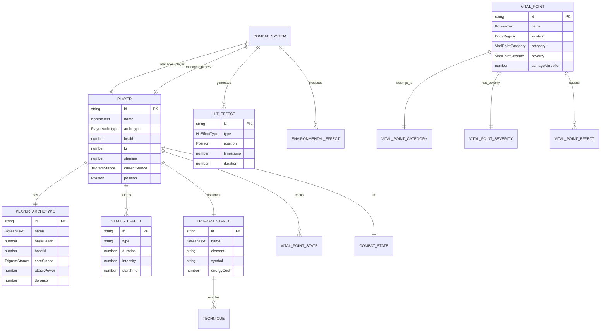
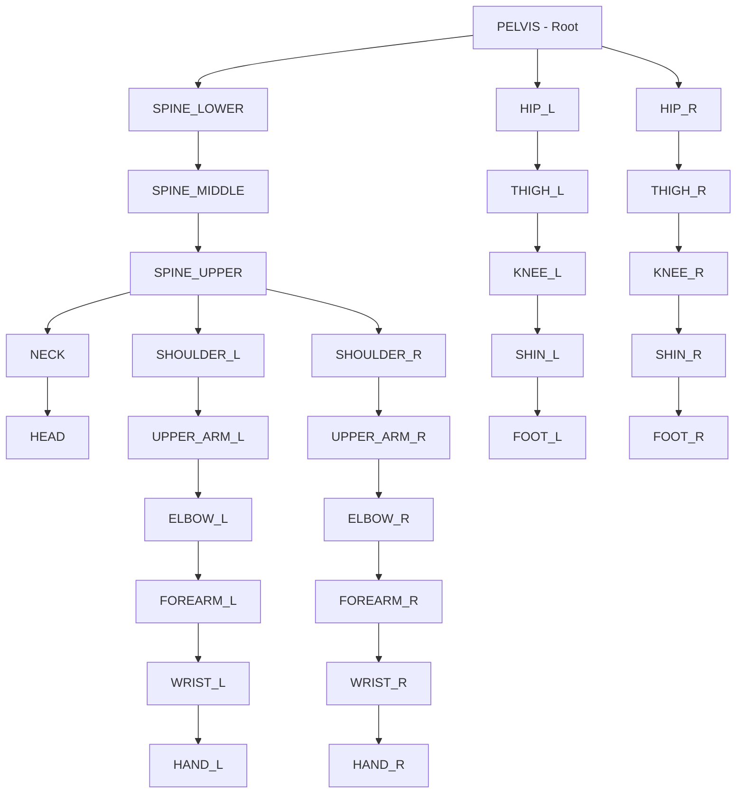
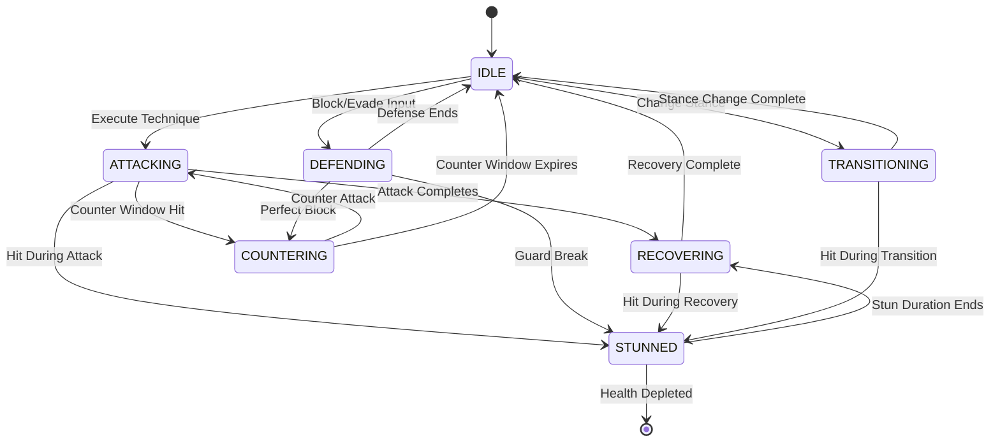

# 📊 Black Trigram (흑괘) Data Model

## 📚 Related Documentation

| Document                                      | Focus            | Description                                    |
| --------------------------------------------- | ---------------- | ---------------------------------------------- |
| [Architecture](ARCHITECTURE.md)               | 🏛️ Structure     | C4 model showing system components             |
| [Flowchart](FLOWCHART.md)                     | 🔄 Process Flow  | Game flow and state transitions                |
| [State Diagram](STATEDIAGRAM.md)              | 🎮 State Machine | Combat and game state management               |
| [Combat Architecture](COMBAT_ARCHITECTURE.md) | ⚔️ Combat System | Detailed combat mechanics implementation       |

---

## 🎯 Overview

Black Trigram (흑괘) is a frontend-only Korean martial arts combat simulator with a comprehensive data model supporting authentic vital point targeting, eight trigram stances, and realistic combat physics. All data structures are implemented in TypeScript with strict type safety and readonly properties for immutability.

### **Data Architecture Principles**

- ✅ **Type Safety**: Strict TypeScript with no implicit any
- ✅ **Immutability**: Readonly properties throughout.
- ✅ **Korean Cultural Authenticity**: Bilingual Korean-English text support
- ✅ **Session-Only Storage**: No backend persistence (browser session state)
- ✅ **Functional Design**: Pure functions and immutable state updates

---

## 📐 Core Type System

### **Entity Relationship Diagram**



---

## 📝 TypeScript Interface Examples

The following are representative TypeScript interfaces from the codebase, implementing the data model described above. All interfaces use strict typing and readonly properties for immutability.

### **Core Interfaces from src/types/common.ts**

#### `KoreanText` - Bilingual Text Support

```typescript
// src/types/common.ts
export interface KoreanText {
  readonly korean: string;      // 한글 텍스트
  readonly english: string;      // English translation
  readonly romanized?: string;   // Optional romanization (e.g., "Geup-so-gyeok")
}
```

#### `Position` - 2D Spatial Coordinates

```typescript
// src/types/common.ts
export interface Position {
  x: number;
  y: number;
}
```

#### Enum Types - Game Constants

```typescript
// src/types/common.ts
export enum PlayerArchetype {
  MUSA = "musa",                     // 무사 - Traditional Warrior
  AMSALJA = "amsalja",               // 암살자 - Shadow Assassin
  HACKER = "hacker",                 // 해커 - Cyber Warrior
  JEONGBO_YOWON = "jeongbo_yowon",   // 정보요원 - Intelligence Operative
  JOJIK_POKRYEOKBAE = "jojik_pokryeokbae", // 조직폭력배 - Organized Crime
}

export enum TrigramStance {
  GEON = "geon",  // ☰ 건 - Heaven
  TAE = "tae",    // ☱ 태 - Lake
  LI = "li",      // ☲ 리 - Fire
  JIN = "jin",    // ☳ 진 - Thunder
  SON = "son",    // ☴ 손 - Wind
  GAM = "gam",    // ☵ 감 - Water
  GAN = "gan",    // ☶ 간 - Mountain
  GON = "gon",    // ☷ 곤 - Earth
}

export enum CombatState {
  IDLE = "idle",
  ATTACKING = "attacking",
  DEFENDING = "defending",
  STUNNED = "stunned",
  RECOVERING = "recovering",
  COUNTERING = "countering",
  TRANSITIONING = "transitioning",
}
```

### **Player System from src/systems/player.ts**

#### `PlayerState` - Complete Player State

```typescript
// src/systems/player.ts
export interface PlayerState {
  // Identity
  readonly id: string;
  readonly name: KoreanText;
  readonly archetype: PlayerArchetype;

  // Core Resources
  readonly health: number;
  readonly maxHealth: number;
  readonly ki: number;              // 기 - Internal energy
  readonly maxKi: number;
  readonly stamina: number;
  readonly maxStamina: number;
  readonly energy: number;
  readonly maxEnergy: number;

  // Combat Attributes
  readonly attackPower: number;
  readonly defense: number;
  readonly speed: number;
  readonly technique: number;
  readonly pain: number;            // Pain tolerance (0-100)
  readonly consciousness: number;   // Awareness level (0-100)
  readonly balance: number;         // Physical stability (0-100)
  readonly momentum: number;        // Combat momentum (-100 to 100)

  // Combat State
  readonly currentStance: TrigramStance;
  readonly combatState: CombatState;
  readonly position: Position;
  readonly isBlocking: boolean;
  readonly isStunned: boolean;
  readonly isCountering: boolean;
  readonly lastActionTime: number;
  readonly recoveryTime: number;
  readonly lastStanceChangeTime: number;

  // Status Effects
  readonly statusEffects: readonly StatusEffect[];
  readonly activeEffects: readonly string[];

  // Vital Points State
  readonly vitalPoints: readonly {
    readonly id: string;
    readonly isHit: boolean;
    readonly damage: number;
    readonly lastHitTime: number;
  }[];

  // Match Statistics
  readonly totalDamageReceived: number;
  readonly totalDamageDealt: number;
  readonly hitsTaken: number;
  readonly hitsLanded: number;
  readonly perfectStrikes: number;
  readonly vitalPointHits: number;
}
```

### **Combat System from src/systems/types.ts**

#### `StatusEffect` - Status Effects and Debuffs

```typescript
// src/systems/types.ts
export interface StatusEffect {
  readonly id: string;
  readonly type: string;
  readonly intensity: EffectIntensity;
  readonly duration: number;        // Duration in milliseconds
  readonly description: KoreanText;
  readonly stackable: boolean;
  readonly source: string;          // What caused this effect
  readonly startTime: number;
  readonly endTime: number;
}
```

#### `HitEffect` - Visual Combat Feedback

```typescript
// src/systems/types.ts
export interface HitEffect {
  readonly id: string;
  readonly type: HitEffectType;
  readonly attackerId: string;
  readonly defenderId: string;
  readonly timestamp: number;
  readonly duration: number;
  readonly position?: Position;
  readonly velocity?: { x: number; y: number };
  readonly color?: number;
  readonly size?: number;
  readonly alpha?: number;
  readonly damageAmount?: number;
  readonly vitalPointId?: string;
  readonly intensity: number;
}
```

#### `PlayerArchetypeData` - Archetype Configuration

```typescript
// src/systems/types.ts
export interface PlayerArchetypeData {
  readonly id: string;
  readonly name: KoreanText;
  readonly description: KoreanText;
  readonly baseHealth: number;
  readonly baseKi: number;
  readonly baseStamina: number;
  readonly coreStance: TrigramStance;
  readonly theme: {
    primary: number;    // Primary color (hex)
    secondary: number;  // Secondary color (hex)
  };
  readonly stats: {
    attackPower: number;
    defense: number;
    speed: number;
    technique: number;
  };
  readonly favoredStances: readonly TrigramStance[];
  readonly specialAbilities: readonly string[];
  readonly philosophy: KoreanText;
}
```

### **Type Safety and Immutability Patterns**

All interfaces in Black Trigram follow these principles:

1. **Readonly Properties**: All object properties are marked `readonly` to prevent accidental mutation
2. **Strict Typing**: No `any` types; explicit types throughout
3. **Immutable Arrays**: Arrays use `readonly` modifier for immutability
4. **Functional Updates**: State changes create new objects rather than mutating existing ones

Example of immutable state update:

```typescript
// Immutable player health update
function updatePlayerHealth(
  player: PlayerState,
  healthChange: number
): PlayerState {
  return {
    ...player,
    health: Math.max(0, Math.min(player.maxHealth, player.health + healthChange)),
    totalDamageReceived: healthChange < 0 
      ? player.totalDamageReceived + Math.abs(healthChange)
      : player.totalDamageReceived,
  };
}
```

---

## 🦴 Skeletal Animation Data Model

### **28-Bone Skeletal Hierarchy**

Black Trigram implements a performance-optimized skeletal animation system with 28 core bones, expandable to 66 bones with full hand detail for close-up views.

#### **Core Bone Structure (28 bones)**



#### **Skeletal Rig TypeScript Interface**

```typescript
// src/types/skeletal.ts
export interface Bone {
  readonly name: string;
  parent: Bone | null;
  position: THREE.Vector3;
  rotation: THREE.Euler;
  scale: THREE.Vector3;
  children: Bone[];
  readonly length: number;
  readonly restPosition: THREE.Vector3;
  readonly restRotation: THREE.Euler;
}

export interface SkeletalRig {
  readonly root: Bone;
  readonly bones: Map<string, Bone>;
  readonly boneCount: number;
}

export enum BoneName {
  // Core (1)
  PELVIS = "pelvis",
  
  // Spine (3)
  SPINE_LOWER = "spine_lower",
  SPINE_MIDDLE = "spine_middle",
  SPINE_UPPER = "spine_upper",
  
  // Head (2)
  NECK = "neck",
  HEAD = "head",
  
  // Left Arm (6)
  SHOULDER_L = "shoulder_L",
  UPPER_ARM_L = "upper_arm_L",
  ELBOW_L = "elbow_L",
  FOREARM_L = "forearm_L",
  WRIST_L = "wrist_L",
  HAND_L = "hand_L",
  
  // Right Arm (6)
  SHOULDER_R = "shoulder_R",
  UPPER_ARM_R = "upper_arm_R",
  ELBOW_R = "elbow_R",
  FOREARM_R = "forearm_R",
  WRIST_R = "wrist_R",
  HAND_R = "hand_R",
  
  // Left Leg (5)
  HIP_L = "hip_L",
  THIGH_L = "thigh_L",
  KNEE_L = "knee_L",
  SHIN_L = "shin_L",
  FOOT_L = "foot_L",
  
  // Right Leg (5)
  HIP_R = "hip_R",
  THIGH_R = "thigh_R",
  KNEE_R = "knee_R",
  SHIN_R = "shin_R",
  FOOT_R = "foot_R",
}
```

---

## 👋 Hand Animation System (7 Hand Poses)

### **Korean Martial Arts Hand Poses**

```typescript
// src/types/hand-animation.ts
export enum HandPoseType {
  FIST = "fist",           // 주먹 - Closed fist for punching
  KNIFE_HAND = "knife_hand", // 수도 - Knife-hand strike
  SPEAR_HAND = "spear_hand", // 관수 - Spear-hand thrust
  PALM_HEEL = "palm_heel",   // 장력 - Palm-heel strike
  GRAPPLING = "grappling",   // 잡기 - Grappling hand
  OPEN = "open",            // 펴기 - Open hand neutral
  RELAXED = "relaxed",      // 휴식 - Relaxed natural
}

export interface HandPose {
  readonly type: HandPoseType;
  readonly nameKorean: string;
  readonly nameEnglish: string;
  readonly romanized: string;
  readonly fingerCurl: FingerCurl;
  readonly fingerSpread: FingerSpread;
  readonly wristRotation: THREE.Euler;
  readonly description: {
    readonly korean: string;
    readonly english: string;
  };
  readonly martialArtOrigin: "taekwondo" | "hapkido" | "taekyon" | "traditional";
  readonly strikingSurface: "knuckles" | "palm_heel" | "knife_edge" | "fingertips" | "whole_hand";
}

export interface FingerCurl {
  readonly thumb: number;   // 0 = extended, 1 = curled
  readonly index: number;
  readonly middle: number;
  readonly ring: number;
  readonly pinky: number;
}

export interface FingerSpread {
  readonly thumbIndex: number;    // 0 = together, 1 = spread
  readonly indexMiddle: number;
  readonly middleRing: number;
  readonly ringPinky: number;
}
```

---

## 🎯 Vital Point System (70 Points)

### **Complete Vital Points Database**

Black Trigram implements 70 authentic Korean martial arts vital points (급소) based on traditional anatomical targeting knowledge.

#### **Vital Point Distribution**

- **Head**: 12 points (temple, jaw, nose, eye, ear, throat, back of head)
- **Torso**: 24 points (heart, solar plexus, liver, spleen, kidneys, floating ribs)
- **Arms**: 17 points (shoulders, elbows, wrists, nerve clusters)
- **Legs**: 17 points (hips, knees, shins, ankles, pressure points)

#### **Vital Point TypeScript Interface**

```typescript
// src/systems/vitalpoint/types.ts
export interface VitalPoint {
  readonly id: string;
  readonly names: {
    readonly korean: string;
    readonly english: string;
    readonly romanized: string;
  };
  readonly position: Position;
  readonly category: VitalPointCategory;
  readonly severity: VitalPointSeverity;
  readonly baseDamage?: number;
  readonly effects: readonly VitalPointEffect[];
  readonly description: KoreanText;
  readonly targetingDifficulty: number;  // 0.0-1.0
  readonly effectiveStances: readonly TrigramStance[];
}

export enum VitalPointCategory {
  NEUROLOGICAL = "neurological",  // 신경계 - Nerve strikes
  SKELETAL = "skeletal",          // 골격계 - Bone targets
  VASCULAR = "vascular",          // 혈관계 - Blood vessels
  MUSCULAR = "muscular",          // 근육계 - Muscle groups
  RESPIRATORY = "respiratory",    // 호흡계 - Breathing targets
  INTERNAL = "internal",          // 내부 - Internal organs
}

export enum VitalPointSeverity {
  CRITICAL = "critical",  // 치명적 - Lethal potential
  MAJOR = "major",        // 중대 - Severe injury
  MODERATE = "moderate",  // 보통 - Significant pain
  MINOR = "minor",        // 경미 - Minor disruption
}
```

---

## ⚔️ Combat State Machine

### **Combat State Transitions**



### **Combat State TypeScript Definitions**

```typescript
// src/types/common.ts
export enum CombatState {
  IDLE = "idle",                    // 대기 - Ready stance
  ATTACKING = "attacking",           // 공격 - Executing technique
  DEFENDING = "defending",           // 방어 - Blocking/evading
  STUNNED = "stunned",              // 기절 - Unable to act
  RECOVERING = "recovering",         // 회복 - Post-attack recovery
  COUNTERING = "countering",         // 반격 - Counter window active
  TRANSITIONING = "transitioning",   // 전환 - Changing stance
}
```

---

## 🌐 Korean Text and Localization

### **Bilingual Text System**

```typescript
// src/types/common.ts
export interface KoreanText {
  readonly korean: string;      // 한글 텍스트
  readonly english: string;      // English translation
  readonly romanized?: string;   // Optional romanization (e.g., "geup-so-gyeok")
}

// Usage example
const vitalPointName: KoreanText = {
  korean: "태양혈",
  english: "Temple",
  romanized: "taeyang-hyeol",
};
```

### **Text Encoding Standards**

- **Korean Text**: UTF-8 encoding (한글)
- **Romanization**: Revised Romanization of Korean (RR)
- **Font Support**: Noto Sans CJK for Korean characters
- **Accessibility**: Korean screen reader support with proper ARIA labels

---

## 🔒 Data Security Considerations

### **Session-Only Storage Security**

- **No Backend Persistence**: All game state stored in browser session (sessionStorage/memory)
- **No PII Collection**: No personally identifiable information collected or stored
- **Client-Side Only**: No data transmitted to external servers
- **Memory Clearing**: Game state cleared on browser close
- **No Cookies**: Authentication not required for core gameplay

### **Future Cloud Persistence Security**

When backend persistence is implemented (see [FUTURE_DATA_MODEL.md](FUTURE_DATA_MODEL.md)), security controls will include:

- **Encryption at Rest**: DynamoDB encryption with AWS KMS
- **Encryption in Transit**: TLS 1.3 for all API communications
- **Access Control**: AWS IAM policies with least privilege
- **Audit Logging**: CloudTrail logging of all data access
- **Data Classification**: Per Hack23 ISMS Classification Framework
- **GDPR Compliance**: Right to erasure, data portability, consent management

### **ISMS Framework Alignment**

This data model aligns with:
- **[Secure Development Policy](https://github.com/Hack23/ISMS-PUBLIC/blob/main/Secure_Development_Policy.md)**: Immutable data structures, type safety
- **[Data Classification](https://github.com/Hack23/ISMS-PUBLIC/blob/main/CLASSIFICATION.md)**: Player data classified as "Internal Use"
- **[Cryptography Policy](https://github.com/Hack23/ISMS-PUBLIC/blob/main/Cryptography_Policy.md)**: AES-256 encryption standards

---

**흑괘의 길을 걸어라** - _Walk the Path of the Black Trigram with Data Precision_

This data model documentation ensures type-safe, performant, and culturally authentic representation of Korean martial arts combat mechanics through comprehensive TypeScript interfaces and immutable state management.
