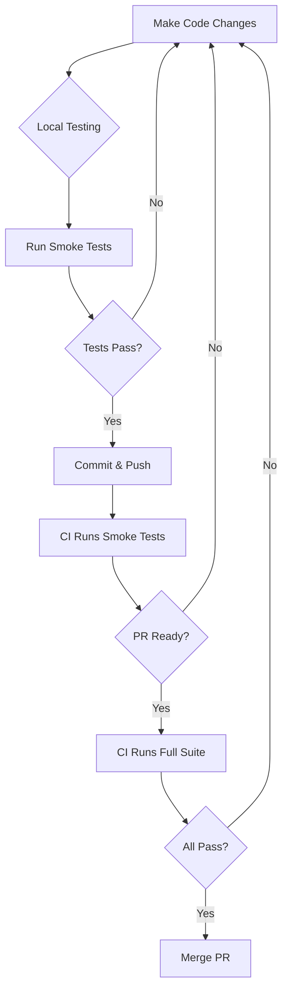

# E2E Test Execution Strategy

## Overview
This document outlines the E2E test execution strategy for Black Trigram, including smoke tests for fast feedback and full test suites for comprehensive validation.

## Test Suites

### 1. Smoke Test Suite (Fast) ⚡
**Purpose**: Quick validation of critical functionality  
**Target Duration**: 5-6 minutes  
**Use Case**: Every commit, PR checks, local development

**Included Tests**:
- `cypress/e2e/app.cy.ts` - Essential app functionality, navigation
- `cypress/e2e/game-journey.cy.ts` - Complete game flow, combat mechanics

**Run Commands**:
```bash
# Local development (with browser)
npm run test:e2e:smoke

# CI environment (headless)
npm run test:e2e:smoke:ci
```

**Coverage**:
- ✅ App loads and initializes
- ✅ Essential UI elements render
- ✅ Basic navigation (Intro → Training → Combat)
- ✅ Keyboard controls work
- ✅ Combat mechanics function
- ✅ Responsive design (3 viewports)
- ✅ Error handling and resilience

### 2. Full Test Suite (Comprehensive) 🔍
**Purpose**: Complete validation of all game features  
**Target Duration**: 10-12 minutes  
**Use Case**: PR merge, release validation, nightly builds

**Included Tests**: All 12 test files (~2967 lines)
- Core smoke tests (app, game-journey)
- Combat system integration
- Training system integration
- Combat/Training flows and modes
- Screen layout validation
- PixiJS Korean martial arts features

**Run Commands**:
```bash
# Local development (with browser)
npm run test:e2e

# CI environment (headless)
npm run test:e2e:ci
```

**Coverage**:
- ✅ All smoke test coverage
- ✅ All 8 trigram stances
- ✅ Vital point targeting
- ✅ Training mode workflows
- ✅ Combat system integration
- ✅ AI opponent behavior
- ✅ Performance metrics
- ✅ Accessibility features

## Execution Strategy

### Development Workflow


### CI/CD Pipeline

#### Pull Request (PR) Checks
1. **On Every Commit**: Run smoke tests (~5-6 min)
   - Fast feedback for developers
   - Catches critical regressions early
   
2. **Before Merge**: Run full suite (~10-12 min)
   - Comprehensive validation
   - Ensures all features work

#### Main Branch / Release
1. **On Merge**: Run full suite
2. **Nightly**: Run full suite with extended metrics
3. **Release**: Run full suite + performance benchmarks

## Performance Targets

### Smoke Tests
| Metric | Target | Threshold |
|--------|--------|-----------|
| Total Duration | 5-6 min | ≤8 min (warning) |
| Per-Test Average | 150-180s | ≤240s (warning) |
| Flaky Test Rate | 0% | ≤2% (acceptable) |

### Full Test Suite
| Metric | Target | Threshold |
|--------|--------|-----------|
| Total Duration | 10-12 min | ≤15 min (warning) |
| Per-Test Average | 50-60s | ≤90s (warning) |
| Flaky Test Rate | 0% | ≤2% (acceptable) |

## Optimization Summary

### Applied Optimizations ✅
1. **Configuration** (2-3 min savings)
   - Video compression: 15 → 25
   - Memory management: 5 → 3 tests
   - Timeout reductions: 15-20%

2. **Code** (3-4 min savings)
   - Command wait times reduced
   - Test file waits optimized
   - Animation thresholds tuned

3. **Monitoring** (observability)
   - Performance tracking per test
   - CI timing metrics
   - Slowest tests reporting

### Expected Results
- **Before**: ~20 minutes
- **After**: 10-12 minutes
- **Savings**: 8-10 minutes (40-50% reduction)

## Monitoring & Metrics

### Performance Tracking
The test suite now includes comprehensive performance monitoring:

```bash
# Logs show:
🚀 E2E Test Suite Started
⏱️  Starting: Test Name
✅ Test Name: 1234ms
⚠️  SLOW TEST DETECTED: Test Name took 16500ms

📊 E2E Test Suite Summary
================================
Total Tests: 12
Total Duration: 720000ms (720.00s)
Average Test Duration: 60000ms

🔝 Slowest Tests:
  1. Combat System Integration: 120000ms
  2. Training System Integration: 95000ms
  ...
```

### CI Reporting
GitHub Actions now reports timing metrics:

```bash
🚀 Starting E2E test execution at 10:30:00
✅ E2E tests completed in 660 seconds (00:11:00)

📊 E2E Test Execution Metrics
================================
Total Duration: 660 seconds
Target: 600-720 seconds (10-12 minutes)
✅ PASS: Test execution within target (≤12 minutes)
```

## Troubleshooting

### Slow Test Detection
If a test exceeds 15 seconds, a warning is logged:
```
⚠️  SLOW TEST DETECTED: Test Name took 16500ms
```

**Action**: Review the test for:
- Unnecessary `cy.wait()` calls
- Missing assertions causing retries
- Slow viewport changes
- Heavy beforeEach operations

### Flaky Tests
If tests fail intermittently:

1. **Check timing**: Increase wait times if needed
2. **Review assertions**: Use `.should()` instead of fixed waits
3. **Network issues**: Add `cy.intercept()` for API calls
4. **Canvas timing**: Ensure `cy.waitForCanvasReady()` is used

### Timeout Issues
If tests timeout:

1. **Increase specific timeout**: Use `{ timeout: 10000 }` in `cy.get()`
2. **Check app performance**: May indicate real performance issue
3. **Review retries**: Configuration has 2 retries in run mode

## Best Practices

### When to Use Smoke Tests
✅ Every local test run before committing  
✅ Fast feedback during development  
✅ Continuous integration on every push  
✅ Quick validation after small changes  

### When to Use Full Suite
✅ Before merging pull requests  
✅ Release validation  
✅ After major refactoring  
✅ Nightly comprehensive testing  

### Writing New Tests
When adding new E2E tests:

1. **Consider smoke test inclusion**: Is this critical path?
2. **Optimize waits**: Use assertions over fixed waits
3. **Add performance logging**: Tests >15s get warnings
4. **Test in isolation**: Ensure test can run independently
5. **Add data-testid**: All interactive elements need test IDs

## Future Enhancements

### Potential Improvements
1. **Test Parallelization**: Split suite across multiple CI runners
2. **Dynamic Test Selection**: Run only affected tests
3. **Visual Regression**: Add Percy/Applitools integration
4. **Performance Budgets**: Fail tests exceeding time limits
5. **Fixture Optimization**: Share setup across tests

### Selective Test Execution
```bash
# Run specific test file
npm run test:e2e -- --spec "cypress/e2e/combat-flow.cy.ts"

# Run tests matching pattern
npm run test:e2e -- --spec "cypress/e2e/*combat*.cy.ts"

# Run tests by tag (future enhancement)
npm run test:e2e -- --env grepTags=@smoke
```

## References
- [E2E Test Plan](E2ETestPlan.md)
- [Optimization Results](E2E_OPTIMIZATION_RESULTS.md)
- [Cypress Configuration](cypress.config.ts)
- [Performance Monitoring](cypress/support/performance.ts)

---

**흑괘의 속도를 높이라** - *Increase the Speed of Black Trigram*
