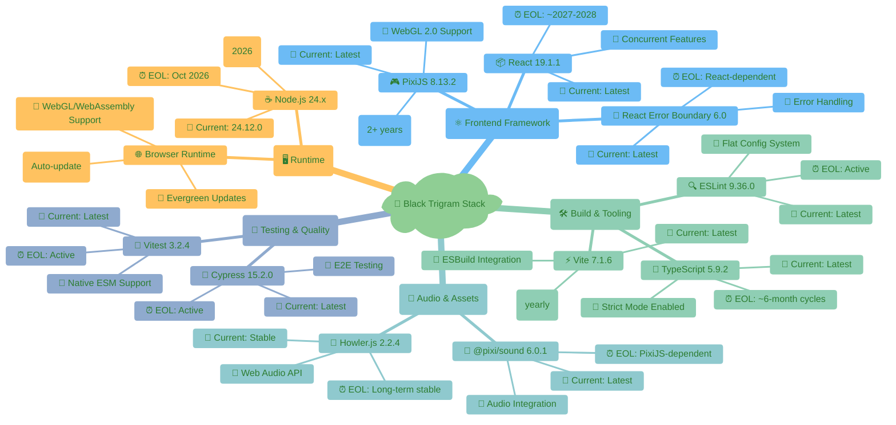
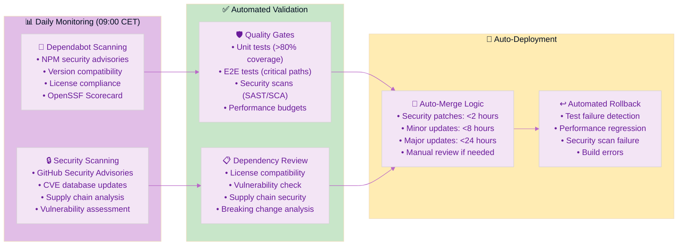
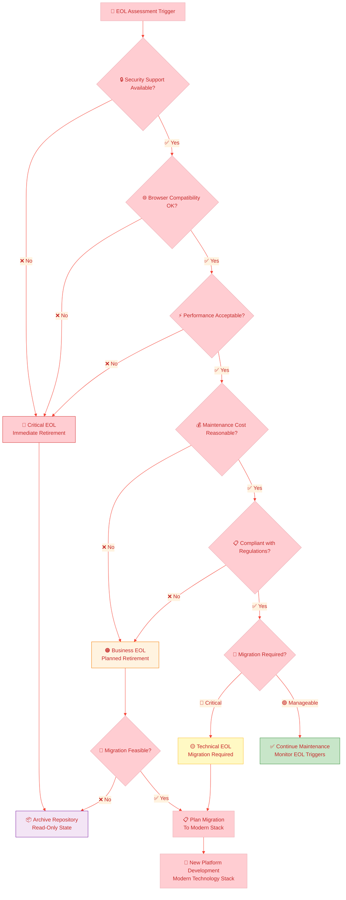
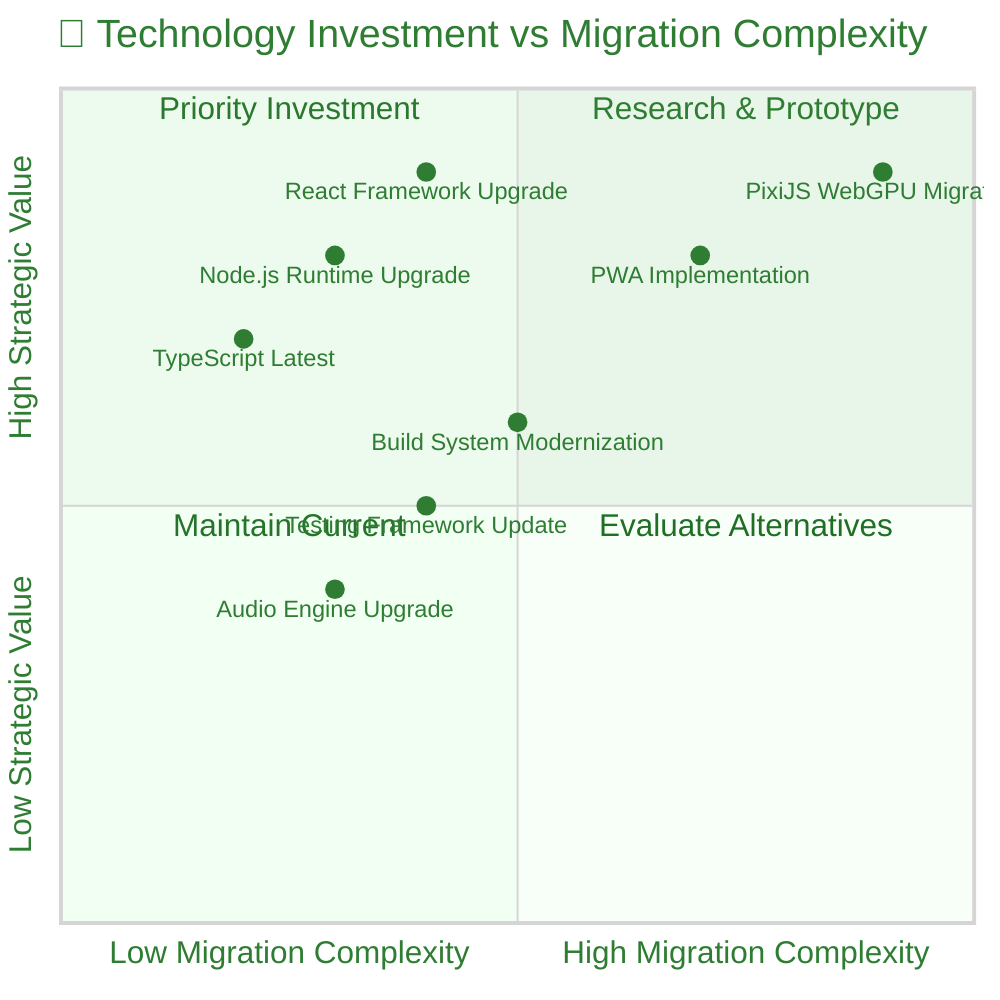
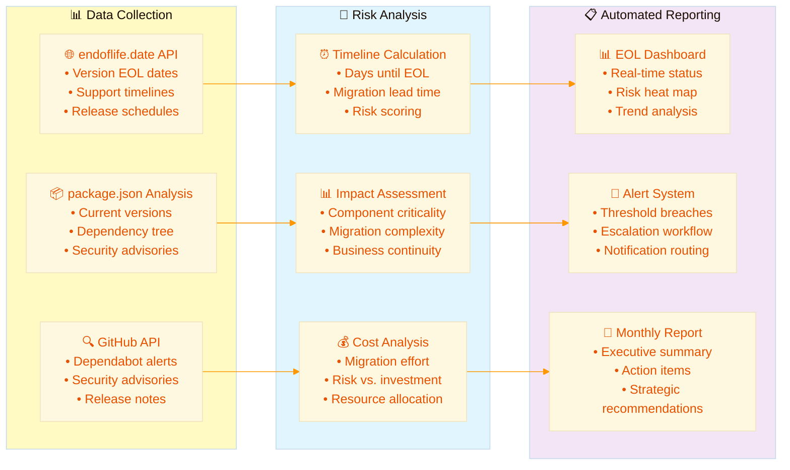

<p align="center">
  
</p>

<h1 align="center">🥋 Black Trigram — End-of-Life Strategy</h1>

<p align="center">
  <strong>🛡️ Proactive Technology Lifecycle Management for Frontend Gaming Platform</strong><br>
  <em>📦 Current Stack Maintenance • 🔄 Node.js 24 Transition • ⚡ Future-Ready Architecture</em>
</p>

<p align="center">
  <a href="#"></a>
  <a href="#"></a>
  <a href="#"></a>
  <a href="#"></a>
</p>

**📋 Document Owner:** CEO | **📄 Version:** 1.0 | **📅 Last Updated:** 2025-09-19 (UTC)  
**🔄 Review Cycle:** Annual | **⏰ Next Review:** 2026-09-19  
**🏷️ Classification:** Public (Frontend-Only Educational Gaming Platform)

---

## 🎯 EOL Strategy Overview

### **📋 Strategic Objective**

**Black Trigram** will maintain its current frontend-only technology stack, utilizing modern web technologies and React 19 ecosystem, without requiring backend infrastructure migration. The project will reach EOL when compatibility with the latest browser runtimes or critical dependency security support requires architectural migration beyond cost-effective maintenance.

This strategy aligns with [Hack23 AB's Vulnerability Management Policy](https://github.com/Hack23/ISMS-PUBLIC/blob/main/Vulnerability_Management.md) **"Living on the Edge"** philosophy - maintaining latest stable releases with comprehensive automated testing and security validation.

### **🏷️ Business Impact Classification**

Based on [Hack23 AB Classification Framework](https://github.com/Hack23/ISMS-PUBLIC/blob/main/CLASSIFICATION.md):

| Security Dimension     | Level                                                                                                                                                                      | EOL Impact | Business Rationale                                                     |
| ---------------------- | -------------------------------------------------------------------------------------------------------------------------------------------------------------------------- | ---------- | ---------------------------------------------------------------------- |
| **🔐 Confidentiality** | [](https://github.com/Hack23/ISMS-PUBLIC/blob/main/CLASSIFICATION.md#confidentiality-levels)   | Low        | Open source educational content, no sensitive data                     |
| **🔒 Integrity**       | [](https://github.com/Hack23/ISMS-PUBLIC/blob/main/CLASSIFICATION.md#integrity-levels)        | Medium     | Educational content accuracy critical for Korean cultural authenticity |
| **⚡ Availability**    | [](https://github.com/Hack23/ISMS-PUBLIC/blob/main/CLASSIFICATION.md#availability-levels) | Medium     | Educational gaming platform; tolerates maintenance windows             |

**🎯 RTO/RPO Alignment:** Medium RTO (4-24hrs), Daily RPO acceptable for educational content platform

---

## 📦 Current Technology Stack Analysis

### **🏗️ Core Technology Matrix**



### **📊 Technology Lifecycle Overview**

| **Technology Category** | **Current Version**       | **Release Model**               | **EOL Timeline**   | **Migration Complexity**                                                                                                                                |
| ----------------------- | ------------------------- | ------------------------------- | ------------------ | ------------------------------------------------------------------------------------------------------------------------------------------------------- |
| **⚛️ React Framework**  | 19.1.1 (Latest)           | Major annually, Minor quarterly | ~2027-2028         | [](https://github.com/Hack23/ISMS-PUBLIC/blob/main/CLASSIFICATION.md) |
| **🎮 PixiJS Graphics**  | 8.13.2 (Latest)           | Major annually, Patch monthly   | Active development | [](https://github.com/Hack23/ISMS-PUBLIC/blob/main/CLASSIFICATION.md)   |
| **⚡ Vite Build Tool**  | 7.1.6 (Latest)            | Major annually                  | Active development | [](https://github.com/Hack23/ISMS-PUBLIC/blob/main/CLASSIFICATION.md)   |
| **📝 TypeScript**       | 5.9.2 (Latest)            | Major every 6 months            | Active development | [](https://github.com/Hack23/ISMS-PUBLIC/blob/main/CLASSIFICATION.md)   |
| **☕ Node.js Runtime**  | 24.x (Current)            | Even LTS, Odd Current           | **Oct 2026**       | [](https://github.com/Hack23/ISMS-PUBLIC/blob/main/CLASSIFICATION.md)     |
| **🧪 Testing Stack**    | Vitest 3.x + Cypress 15.x | Major annually                  | Active development | [](https://github.com/Hack23/ISMS-PUBLIC/blob/main/CLASSIFICATION.md) |

---

## ☕ Node.js 24 → 26 Transition Strategy

### **🎯 Strategic Node.js Lifecycle Management**

Following [Hack23 AB's Proactive Runtime Management](https://github.com/Hack23/ISMS-PUBLIC/blob/main/Vulnerability_Management.md#proactive-runtime--operations-management), Black Trigram implements a **current-version-first** approach for optimal security and performance.

```mermaid
gantt
    title Node.js Lifecycle & Black Trigram Transition Timeline
    dateFormat YYYY-MM-DD
    axisFormat %Y-%m

    section Node.js Releases
    Node.js 24.x Current    :active, node24, 2024-04-24, 2024-10-29
    Node.js 24.x LTS        :active, node24lts, 2024-10-29, 2027-04-30
    Node.js 25.x Current    :node25, 2024-10-22, 2025-04-01
    Node.js 26.x Current    :node26, 2025-04-22, 2025-10-28
    Node.js 26.x LTS        :milestone, node26lts, 2025-10-28, 2025-10-30
    Node.js 24.x EOL        :crit, node24eol, 2027-04-30, 2027-05-02

    section Black Trigram Strategy
    Current Node 24.x Production :active, bt24prod, 2024-12-01, 2026-10-01
    Node.js 26.x Testing Phase   :testing, bt26test, 2025-08-01, 2025-10-28
    Node.js 26.x Migration       :migration, bt26mig, 2025-10-28, 2026-01-31
    Node.js 26.x Production      :prod26, 2026-01-31, 2027-04-30
    Legacy 24.x Support End      :milestone, legacy24end, 2026-10-01, 2026-10-03

    section Risk Management
    Compatibility Testing       :testing, compat, 2025-06-01, 2025-10-28
    Dependency Validation       :testing, deps, 2025-07-01, 2025-10-28
    Performance Benchmarking    :testing, perf, 2025-08-01, 2025-10-28
    Migration Risk Assessment    :milestone, riskassess, 2025-09-15, 2025-09-17
```

### **📋 Node.js Transition Trigger Conditions**

#### **🟢 Proactive Migration Triggers (Preferred)**

1. **📅 Node.js 26.x LTS Release:** October 2025 - Begin migration planning
2. **🛡️ Security Feature Advantages:** Enhanced security features in Node.js 26.x
3. **⚡ Performance Improvements:** Significant V8 or runtime optimizations
4. **📦 Ecosystem Compatibility:** Major dependencies requiring Node.js 26+

#### **🟡 Risk-Based Migration Triggers (Monitored)**

1. **⏰ 18-Month Warning:** April 2026 - 12 months before Node.js 24.x EOL
2. **🚨 Security Support Concerns:** Security patch availability degradation
3. **🔧 Tooling Incompatibility:** Build/development tools requiring newer Node.js
4. **☁️ Hosting Platform Changes:** Deployment platform Node.js requirements

#### **🔴 Critical Migration Triggers (Mandatory)**

1. **⛔ Node.js 24.x EOL Announcement:** April 2027 - End of security support
2. **🚨 Critical Vulnerability:** Unpatched security issues in Node.js 24.x
3. **🔧 Build System Incompatibility:** Essential tools no longer supporting Node.js 24.x
4. **🌐 Browser API Requirements:** New web standards requiring newer Node.js features

### **🧪 Node.js 26.x Testing & Validation Strategy**

```mermaid
%%{
  init: {
    'theme': 'base',
    'themeVariables': {
      'primaryColor': '#e3f2fd',
      'primaryTextColor': '#01579b',
      'lineColor': '#2196f3',
      'secondaryColor': '#f1f8e9',
      'tertiaryColor': '#fff8e1'
    }
  }
}%%
flowchart TB
    subgraph PREPARATION["🔬 Pre-Migration Testing (Aug 2025)"]
        COMPAT_TEST["🧪 Compatibility Testing<br/>• Vite 7+ compatibility<br/>• React 19 compatibility<br/>• PixiJS 8+ compatibility<br/>• TypeScript 5+ compatibility"]
        DEP_AUDIT["📦 Dependency Audit<br/>• NPM package compatibility<br/>• Native module rebuilds<br/>• Security vulnerability scan<br/>• License compliance check"]
        PERF_BASELINE["📊 Performance Baseline<br/>• Build time comparison<br/>• Runtime performance<br/>• Memory usage analysis<br/>• Bundle size impact"]
    end

    subgraph VALIDATION["✅ Migration Validation (Sep-Oct 2025)"]
        FEATURE_TEST["🎮 Feature Testing<br/>• Combat system validation<br/>• Audio engine testing<br/>• Korean text rendering<br/>• PixiJS graphics performance"]
        E2E_VALIDATION["🔍 E2E Validation<br/>• Complete user journeys<br/>• Cross-browser testing<br/>• Mobile compatibility<br/>• Performance regression"]
        SECURITY_SCAN["🔒 Security Validation<br/>• Vulnerability scanning<br/>• Dependency security<br/>• Secret scanning<br/>• SLSA attestation"]
    end

    subgraph DEPLOYMENT["🚀 Controlled Deployment (Oct 2025)"]
        STAGING_DEPLOY["🧪 Staging Deployment<br/>• Node.js 26.x environment<br/>• Full test suite execution<br/>• Performance monitoring<br/>• Error tracking"]
        CANARY_RELEASE["🐦 Canary Release<br/>• 10% traffic allocation<br/>• Performance monitoring<br/>• Error rate analysis<br/>• User feedback collection"]
        FULL_MIGRATION["🎯 Full Migration<br/>• 100% Node.js 26.x<br/>• Legacy cleanup<br/>• Documentation update<br/>• Team notification"]
    end

    COMPAT_TEST --> DEP_AUDIT
    DEP_AUDIT --> PERF_BASELINE
    PERF_BASELINE --> FEATURE_TEST
    FEATURE_TEST --> E2E_VALIDATION
    E2E_VALIDATION --> SECURITY_SCAN
    SECURITY_SCAN --> STAGING_DEPLOY
    STAGING_DEPLOY --> CANARY_RELEASE
    CANARY_RELEASE --> FULL_MIGRATION

    style PREPARATION fill:#bbdefb
    style VALIDATION fill:#c8e6c9
    style DEPLOYMENT fill:#ffecb3
```



### **📊 Node.js Migration Risk Assessment**

| Risk Category                     | Probability                                                                                                                                       | Impact                                                                                                                                              | Mitigation Strategy                  | Success Criteria            |
| --------------------------------- | ------------------------------------------------------------------------------------------------------------------------------------------------- | --------------------------------------------------------------------------------------------------------------------------------------------------- | ------------------------------------ | --------------------------- |
| **📦 Dependency Incompatibility** | [](https://github.com/Hack23/ISMS-PUBLIC/blob/main/CLASSIFICATION.md) | [](https://github.com/Hack23/ISMS-PUBLIC/blob/main/CLASSIFICATION.md)     | Early testing + dependency audit     | All dependencies compatible |
| **⚡ Performance Regression**     | [](https://github.com/Hack23/ISMS-PUBLIC/blob/main/CLASSIFICATION.md)   | [](https://github.com/Hack23/ISMS-PUBLIC/blob/main/CLASSIFICATION.md) | Performance benchmarking             | <5% performance degradation |
| **🔧 Build System Changes**       | [](https://github.com/Hack23/ISMS-PUBLIC/blob/main/CLASSIFICATION.md) | [](https://github.com/Hack23/ISMS-PUBLIC/blob/main/CLASSIFICATION.md) | Vite + ESBuild compatibility testing | Build process unchanged     |
| **🌐 Runtime API Changes**        | [](https://github.com/Hack23/ISMS-PUBLIC/blob/main/CLASSIFICATION.md)   | [](https://github.com/Hack23/ISMS-PUBLIC/blob/main/CLASSIFICATION.md)   | API compatibility validation         | All APIs function correctly |
| **🔒 Security Control Impact**    | [](https://github.com/Hack23/ISMS-PUBLIC/blob/main/CLASSIFICATION.md)   | [](https://github.com/Hack23/ISMS-PUBLIC/blob/main/CLASSIFICATION.md)     | Security scanning + attestation      | Security posture maintained |

---

## 🔄 Ongoing Maintenance Strategy

### **📦 Dependency Management Philosophy**

Aligned with [Hack23 AB's "Living on the Edge" Strategy](https://github.com/Hack23/ISMS-PUBLIC/blob/main/Vulnerability_Management.md#proactive-dependency-management-strategy):

#### **🚀 Bleeding-Edge with Safety Controls**

- **📦 Always Latest:** Accept Dependabot PRs for latest stable releases immediately
- **🛡️ Security Gates:** Automated testing and security validation before merge
- **🔍 Dependency Review:** GitHub's Dependency Review Action with OpenSSF Scorecard integration
- **✅ Test-Driven Confidence:** Trust comprehensive test suites over manual review
- **🚨 Rapid Response:** <4 hours for critical security vulnerabilities
- **⏰ EOL Tracking:** Proactive monitoring of runtime and dependency lifecycles

### **🔍 Automated Dependency Updates**



### **📋 Update Classification & Response Times**

| Update Type             | Response Time | Security Gate             | Merge Strategy       | EOL Consideration                  |
| ----------------------- | ------------- | ------------------------- | -------------------- | ---------------------------------- |
| **🔴 Security Patches** | <4 hours      | Dependency Review + Tests | Auto-merge on green  | Immediate regardless of EOL        |
| **🟠 Major Releases**   | <24 hours     | Full test suite + review  | Auto-merge on green  | Check EOL timeline alignment       |
| **🟡 Minor Releases**   | <8 hours      | Standard testing          | Auto-merge on green  | Prefer LTS versions                |
| **🟢 Patch Releases**   | <2 hours      | Basic validation          | Immediate auto-merge | Always apply within support window |

---

## ⏰ End-of-Life Tracking & Monitoring

### **📊 Technology EOL Dashboard**

Real-time monitoring using [endoflife.date](https://endoflife.date/) references and automated tracking:

```mermaid
gantt
    title Black Trigram Technology End-of-Life Timeline (2025-2030)
    dateFormat YYYY-MM-DD
    axisFormat %Y

    section Runtime & Core
    Node.js 24.x LTS          :active, node24, 2024-10-29, 2027-04-30
    Node.js 26.x LTS (Target) :future, node26, 2025-10-28, 2028-04-30
    Node.js 28.x LTS (Future) :future, node28, 2027-10-28, 2030-04-30

    section Frontend Framework
    React 19.x                :active, react19, 2024-12-05, 2027-12-31
    React 20.x (Future)       :future, react20, 2025-12-01, 2028-12-31
    React 21.x (Future)       :future, react21, 2026-12-01, 2029-12-31

    section Build & Tooling
    Vite 7.x                  :active, vite7, 2024-12-03, 2025-12-31
    Vite 8.x (Future)         :future, vite8, 2025-06-01, 2026-12-31
    TypeScript 5.x            :active, ts5, 2024-03-16, 2025-09-30
    TypeScript 6.x (Future)   :future, ts6, 2025-03-01, 2026-09-30

    section Graphics & Audio
    PixiJS 8.x                :active, pixi8, 2024-01-30, 2026-01-30
    PixiJS 9.x (Future)       :future, pixi9, 2025-06-01, 2027-06-01
    Howler.js 2.x             :active, howler2, 2021-03-04, 2027-12-31

    section Critical Milestones
    Node.js 24 Migration Alert :milestone, node24alert, 2026-04-30, 2026-05-02
    React 19 Assessment       :milestone, react19assess, 2026-12-01, 2026-12-03
    Major Stack Review        :milestone, stackreview, 2027-01-01, 2027-01-03
```

### **🚨 EOL Warning System**

#### **📊 Automated EOL Monitoring**

- **⏰ 24-Month Early Warning:** Initial migration planning phase
- **⚠️ 18-Month Alert:** Active migration preparation required
- **🚨 12-Month Critical:** Migration implementation must begin
- **⛔ 6-Month Emergency:** Final migration deadline approach
- **🔴 EOL Reached:** Immediate security risk assessment required

#### **📋 EOL Response Procedures**

| Warning Level         | Timeline   | Actions Required                              | Escalation                                                                                                                                                      |
| --------------------- | ---------- | --------------------------------------------- | --------------------------------------------------------------------------------------------------------------------------------------------------------------- |
| **🟢 Early Warning**  | 24+ months | Technology assessment, alternative evaluation | [](https://github.com/Hack23/ISMS-PUBLIC/blob/main/CLASSIFICATION.md)    |
| **🟡 Planning Phase** | 18+ months | Migration strategy development, testing plan  | [](https://github.com/Hack23/ISMS-PUBLIC/blob/main/CLASSIFICATION.md)  |
| **🟠 Implementation** | 12+ months | Active migration, compatibility testing       | [](https://github.com/Hack23/ISMS-PUBLIC/blob/main/CLASSIFICATION.md)      |
| **🔴 Critical Phase** | 6+ months  | Final testing, production migration           | [](https://github.com/Hack23/ISMS-PUBLIC/blob/main/CLASSIFICATION.md) |
| **⛔ Emergency**      | <6 months  | Security assessment, risk acceptance          | [](https://github.com/Hack23/ISMS-PUBLIC/blob/main/CLASSIFICATION.md)    |

---

## 🎯 Final EOL Conditions

### **🛑 Project Retirement Triggers**

Black Trigram will be designated as EOL and archived in read-only state when ANY of these conditions occur:

#### **🔴 Critical EOL Triggers (Immediate Retirement)**

1. **🚨 Security Support Failure:** No security patches available for critical vulnerabilities in core dependencies
2. **🌐 Browser Compatibility Loss:** Modern browsers no longer support required WebGL/Canvas APIs
3. **⚡ Performance Degradation:** Framework limitations causing <30fps on target hardware
4. **📦 Dependency Chain Collapse:** Critical dependencies (React, PixiJS, Vite) all reach EOL simultaneously

#### **🟠 Business EOL Triggers (Planned Retirement)**

1. **💰 Maintenance Cost Exceeds Value:** Security maintenance costs exceed educational value delivery
2. **🏆 Technology Replacement:** Superior educational gaming platform technology becomes available
3. **📋 Compliance Requirements:** New regulations incompatible with frontend-only architecture
4. **🎯 Mission Completion:** Educational objectives fully achieved through other means

#### **🟡 Technical EOL Triggers (Migration Required)**

1. **☕ Node.js Ecosystem End:** Node.js 26+ unsupported and 24.x EOL reached
2. **⚛️ React Major Breaking Change:** React 20+ incompatible with current PixiJS integration
3. **🎮 PixiJS Architecture Change:** WebGL 3.0 transition requiring complete rewrite
4. **🔧 Build System Evolution:** ES Modules/Import Maps requiring Vite replacement

### **📊 EOL Decision Matrix**



---

## 🔄 Technology Succession Planning

### **🚀 Future Platform Vision**

Should EOL conditions trigger migration, the successor platform will maintain **Korean martial arts educational integrity** while leveraging modern technology:

#### **📋 Next-Generation Technology Candidates**

| Component                 | Current (Black Trigram) | Future Candidate                   | Migration Complexity                                                                                                                                       |
| ------------------------- | ----------------------- | ---------------------------------- | ---------------------------------------------------------------------------------------------------------------------------------------------------------- |
| **⚛️ Frontend Framework** | React 19 + PixiJS 8     | React 22+ or Svelte 5+ with WebGPU | [](https://github.com/Hack23/ISMS-PUBLIC/blob/main/CLASSIFICATION.md)        |
| **🎮 Graphics Engine**    | PixiJS WebGL 2.0        | WebGPU native or PixiJS WebGPU     | [](https://github.com/Hack23/ISMS-PUBLIC/blob/main/CLASSIFICATION.md) |
| **🛠️ Build System**       | Vite 7 + ESBuild        | Rolldown, Turbopack, or Vite Next  | [](https://github.com/Hack23/ISMS-PUBLIC/blob/main/CLASSIFICATION.md)    |
| **📱 Platform Target**    | Web-only                | Progressive Web App + WebAssembly  | [](https://github.com/Hack23/ISMS-PUBLIC/blob/main/CLASSIFICATION.md)        |
| **☕ Runtime**            | Node.js (build only)    | Deno, Bun, or Next-gen Node.js     | [](https://github.com/Hack23/ISMS-PUBLIC/blob/main/CLASSIFICATION.md)      |

#### **🎯 Migration Success Criteria**

- **🇰🇷 Cultural Authenticity Preserved:** Korean martial arts content maintained exactly
- **🎮 Educational Value Enhanced:** Improved learning effectiveness and engagement
- **🛡️ Security Posture Improved:** Better security controls and vulnerability management
- **⚡ Performance Gains:** >60fps on target hardware with better accessibility
- **📦 Maintenance Simplified:** Reduced complexity and better long-term support

### **📊 Technology Investment Strategy**



---

## 📋 Compliance & Documentation

### **📄 Required Documentation Maintenance**

Per [Hack23 AB Secure Development Policy](https://github.com/Hack23/ISMS-PUBLIC/blob/main/Secure_Development_Policy.md), all EOL planning must maintain:

#### **📚 Architecture Documentation**

- **🏛️ [ARCHITECTURE.md](ARCHITECTURE.md)** — Current system design with EOL considerations
- **🚀 [FUTURE_ARCHITECTURE.md](FUTURE_ARCHITECTURE.md)** — Migration path and next-generation vision
- **🛡️ [SECURITY_ARCHITECTURE.md](SECURITY_ARCHITECTURE.md)** — Security controls aligned with EOL timeline
- **🔄 [WORKFLOWS.md](WORKFLOWS.md)** — CI/CD processes adapted for EOL management

#### **🔍 Testing & Quality Assurance**

- **🧪 [UnitTestPlan.md](UnitTestPlan.md)** — Test coverage for legacy compatibility
- **🔍 [E2ETestPlan.md](E2ETestPlan.md)** — End-to-end validation through EOL transitions
- **⚡ [performance-testing.md](performance-testing.md)** — Performance benchmarks for EOL decisions

#### **📊 Business & Strategic Documentation**

- **🧠 [MINDMAP.md](MINDMAP.md)** — System relationships and EOL impact analysis
- **💼 [SWOT.md](SWOT.md)** — Strategic assessment including EOL risks and opportunities
- **🔄 [FLOWCHART.md](FLOWCHART.md)** — Process flows adapted for EOL scenarios

### **🎖️ Security & Compliance Badges**

EOL strategy compliance demonstrated through continuous monitoring:

[](https://scorecard.dev/viewer/?uri=github.com/Hack23/blacktrigram)
[](https://github.com/Hack23/blacktrigram/attestations)
[](https://sonarcloud.io/summary/new_code?id=Hack23_blacktrigram)
[](https://bestpractices.coreinfrastructure.org/projects/10777)

---

## 📊 Monitoring & Alerting Framework

### **🔍 Continuous EOL Monitoring**

Integration with [Hack23 AB Security Metrics](https://github.com/Hack23/ISMS-PUBLIC/blob/main/Security_Metrics.md) for proactive EOL management:

#### **📈 Key EOL Metrics**

- **⏰ Days Until EOL:** Automated countdown for all critical dependencies
- **🛡️ Security Patch Availability:** Response time and availability tracking
- **📦 Dependency Health Score:** OpenSSF Scorecard and vulnerability status
- **⚡ Performance Regression Tracking:** Automated benchmark comparison
- **💰 Maintenance Cost Trending:** Development effort and resource allocation

#### **🚨 Alerting Thresholds**

- **🔴 Critical (0-6 months to EOL):** Daily alerts to CEO and development team
- **🟠 High (6-12 months to EOL):** Weekly status reports and planning meetings
- **🟡 Medium (12-18 months to EOL):** Monthly reviews and migration assessment
- **🟢 Low (18+ months to EOL):** Quarterly strategic planning inclusion

### **📋 Automated Reporting**



---

## 📚 Related Documentation

### **🔐 Core ISMS Integration**

- **[🔍 Vulnerability Management Policy](https://github.com/Hack23/ISMS-PUBLIC/blob/main/Vulnerability_Management.md)** — "Living on the Edge" dependency strategy and EOL management
- **[🛠️ Secure Development Policy](https://github.com/Hack23/ISMS-PUBLIC/blob/main/Secure_Development_Policy.md)** — Architecture documentation requirements and security controls
- **[🏷️ Classification Framework](https://github.com/Hack23/ISMS-PUBLIC/blob/main/CLASSIFICATION.md)** — Business impact analysis and risk prioritization methodology

### **🏗️ Black Trigram Architecture**

- **[📐 ARCHITECTURE.md](ARCHITECTURE.md)** — Current system design and technology stack overview
- **[🚀 FUTURE_ARCHITECTURE.md](FUTURE_ARCHITECTURE.md)** — Evolution roadmap and planned architectural enhancements
- **[🛡️ SECURITY_ARCHITECTURE.md](SECURITY_ARCHITECTURE.md)** — Security controls and EOL impact analysis
- **[🛡️ THREAT_MODEL.md](THREAT_MODEL.md)** — EOL-aware threat modeling and risk assessment

### **📊 Project Management & Strategy**

- **[🧠 MINDMAP.md](MINDMAP.md)** — System component relationships and EOL dependencies
- **[💼 SWOT.md](SWOT.md)** — Strategic assessment including EOL risks and opportunities
- **[🔄 WORKFLOWS.md](WORKFLOWS.md)** — CI/CD automation adapted for EOL management
- **[🎮 game-status.md](game-status.md)** — Current development status and EOL timeline integration

### **🧪 Testing & Quality**

- **[🧪 UnitTestPlan.md](UnitTestPlan.md)** — Test coverage ensuring legacy compatibility validation
- **[🔍 E2ETestPlan.md](E2ETestPlan.md)** — End-to-end validation through technology transitions
- **[⚡ performance-testing.md](performance-testing.md)** — Performance benchmarks for EOL decision making

### **📋 External References**

- **[☕ Node.js EOL](https://endoflife.date/nodejs)** — Node.js runtime lifecycle and support timeline
- **[⚛️ React EOL](https://endoflife.date/react)** — React framework lifecycle and major version support
- **[📦 NPM Package EOL](https://endoflife.date/)** — General package and library end-of-life tracking
- **[🌐 Browser Support](https://caniuse.com/)** — Web standard compatibility and browser support lifecycle

---

**📋 Document Control:**  
**✅ Approved by:** James Pether Sörling, CEO  
**📤 Distribution:** Public  
**🏷️ Classification:** [](https://github.com/Hack23/ISMS-PUBLIC/blob/main/CLASSIFICATION.md)  
**📅 Effective Date:** 2025-09-19  
**⏰ Next Review:** 2026-09-19  
**🎯 Framework Compliance:** [](https://github.com/Hack23/ISMS-PUBLIC/blob/main/CLASSIFICATION.md) [](https://github.com/Hack23/ISMS-PUBLIC/blob/main/CLASSIFICATION.md) [](https://github.com/Hack23/ISMS-PUBLIC/blob/main/CLASSIFICATION.md) [](https://github.com/Hack23/ISMS-PUBLIC/blob/main/CLASSIFICATION.md)
