# 🔄 Black Trigram (흑괘) Flowcharts

**Last Updated:** 2026-04-21  
**Product Version:** 0.7.32  
**Status:** Production-Ready

**🔐 ISMS Alignment:** This document follows [Hack23 Secure Development Policy](https://github.com/Hack23/ISMS-PUBLIC/blob/main/Secure_Development_Policy.md) architecture documentation requirements.

## 📚 Related Documentation

| Document                                      | Focus            | Description                              |
| --------------------------------------------- | ---------------- | ---------------------------------------- |
| [Architecture](ARCHITECTURE.md)               | 🏛️ Structure     | C4 model showing system components       |
| [Data Model](DATA_MODEL.md)                   | 📊 Data          | Type system and data structures          |
| [State Diagram](STATEDIAGRAM.md)              | 🎮 State Machine | Combat and game state transitions        |
| [Combat Architecture](COMBAT_ARCHITECTURE.md) | ⚔️ Combat System | Detailed combat mechanics implementation |
| [Future Flowchart](FUTURE_FLOWCHART.md)       | 🔮 Evolution     | Planned workflow enhancements            |

---

## 🎯 Overview

This document provides comprehensive flowcharts for Black Trigram (흑괘), documenting all major user flows, game processes, and system interactions. The flows use Korean cyberpunk color scheme consistent with the game's aesthetic.

**Flowchart Index:**
- [Main User Flow](#main-user-flow) — Complete game navigation from launch to combat
- [Training Mode Flow](#training-mode-flow) — Practice modes, drills, and feedback
- [Pause Menu Flow](#pause-menu-flow) — In-combat pause navigation and settings
- [Rematch Flow](#rematch-flow) — Post-match rematch and archetype re-selection
- [Combat Round Flow](#combat-round-flow) — Round initialization through completion
- [Attack Resolution Flow](#attack-resolution-flow) — Damage calculation pipeline
- [Vital Point Strike Flow](#vital-point-strike-resolution-70-targets) — VP targeting mechanics
- Cross-reference: [State Diagrams](STATEDIAGRAM.md) for state transitions, [Data Model](DATA_MODEL.md) for type definitions

---

## 🎮 User Journey Flows

### **Main User Flow**

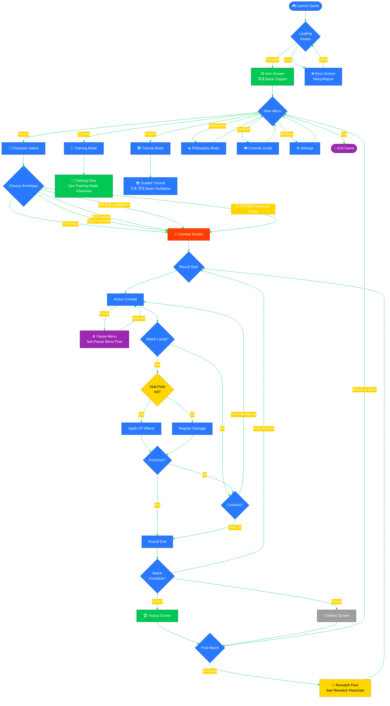

---

### **Training Mode Flow**

Training mode provides structured practice modes for mastering vital points, trigram stances, and footwork techniques. Based on the actual `TrainingScreen3D` component implementation.

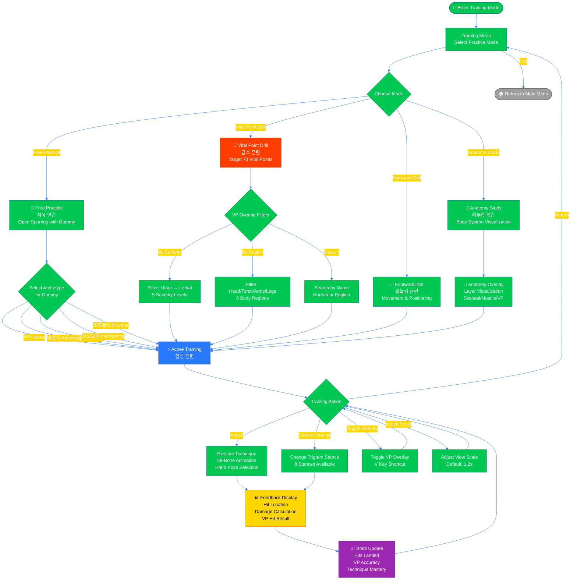

---

### **Pause Menu Flow**

The pause menu provides access to game controls, settings adjustments, and navigation options during combat. Based on the actual `PauseMenu.tsx` and `usePauseMenu.ts` hook implementation.

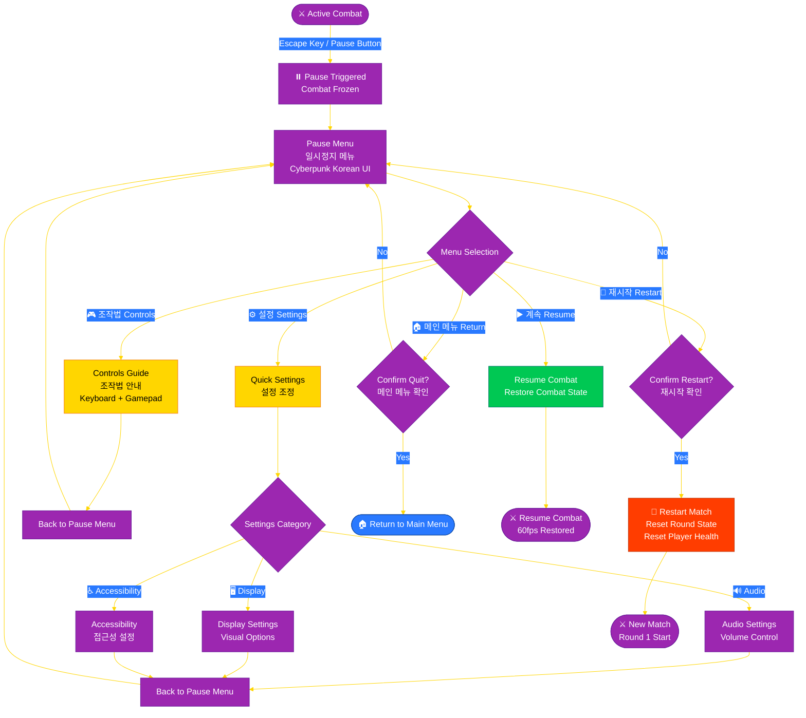

---

### **Rematch Flow**

After a match ends (Victory or Defeat), the rematch flow allows players to start a new match while preserving or changing archetype selection.

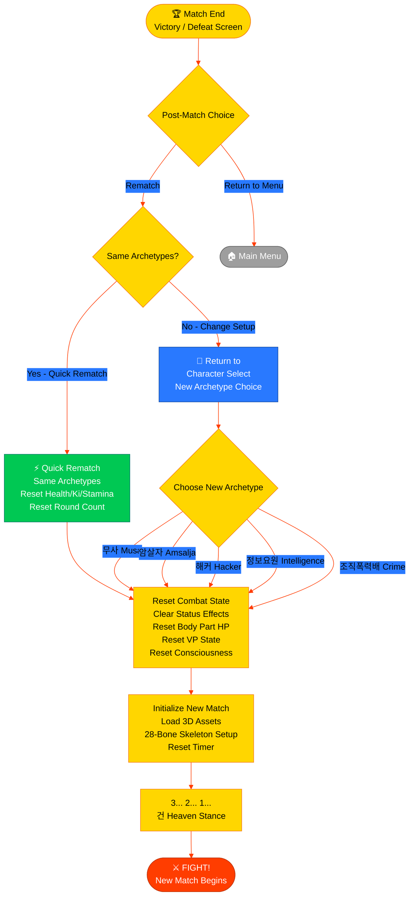

---

## ⚔️ Combat System Flows

### **Combat Round Flow**

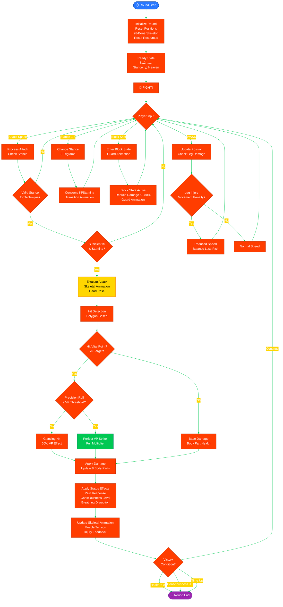

### **Attack Resolution Flow**

```mermaid
%%{init: {'theme':'base', 'themeVariables': {'primaryColor':'#FFD600','primaryTextColor':'#000','primaryBorderColor':'#F57F17','lineColor':'#FF3D00','secondaryColor':'#00C853','tertiaryColor':'#2979FF'}}}%%
flowchart LR
    A["⚔️ Attack Input"] --> B{Validate Attack}

    B -->|Invalid| X1["❌ Cancel Attack<br/>Play Error SFX"]
    B -->|Valid| C[Consume Ki/Stamina]

    C --> D[Calculate Hit Box]
    D --> E{Collision<br/>Detected?}

    E -->|No| X2["🌀 Miss<br/>Play Woosh SFX"]
    E -->|Yes| F{Defender<br/>Blocking?}

    F -->|Yes| G[Reduce Damage<br/>50-80%]
    F -->|No| H[Full Damage]

    G --> I[Calculate Final<br/>Damage]
    H --> I

    I --> J{Critical Hit?<br/>Roll < Crit%}

    J -->|Yes| K["×2 Damage<br/>✨ Critical Effect"]
    J -->|No| L[Normal Damage]

    K --> M{Vital Point<br/>Hit?}
    L --> M

    M -->|Yes| N[Apply VP<br/>Multiplier<br/>3x-10x]
    M -->|No| O[Base Damage<br/>Only]

    N --> P[Apply Status<br/>Effects]
    O --> Q[Update Health]
    P --> Q

    Q --> R[Trigger Visual<br/>Effects]
    R --> S[Play Audio<br/>Feedback]
    S --> T[Update Combat<br/>Stats]

    T --> U["✅ Attack Complete"]
    X1 --> U
    X2 --> U

    style A fill:#2979FF,stroke:#0D47A1,color:#fff
    style E fill:#FFD600,stroke:#F57F17,color:#000
    style M fill:#FF3D00,stroke:#BF360C,color:#fff
    style N fill:#00C853,stroke:#00796B,color:#fff
    style U fill:#9C27B0,stroke:#6A1B9A,color:#fff
```

---

## 🎯 Vital Point Targeting Flow

### **Vital Point Strike Resolution (70 Targets)**

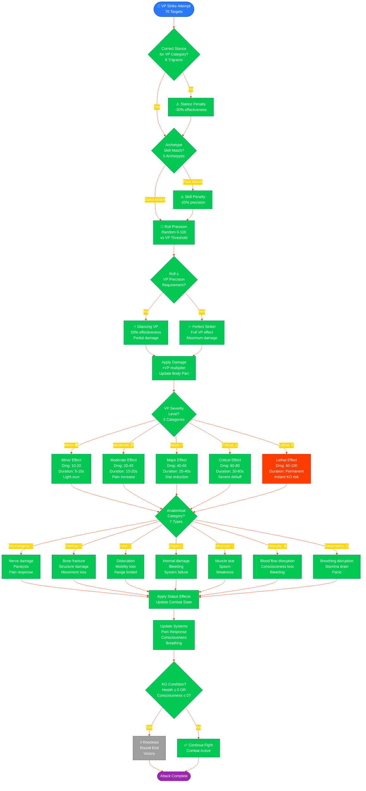

---

## 🥋 Training Mode Flow

### **Training Session Flow**

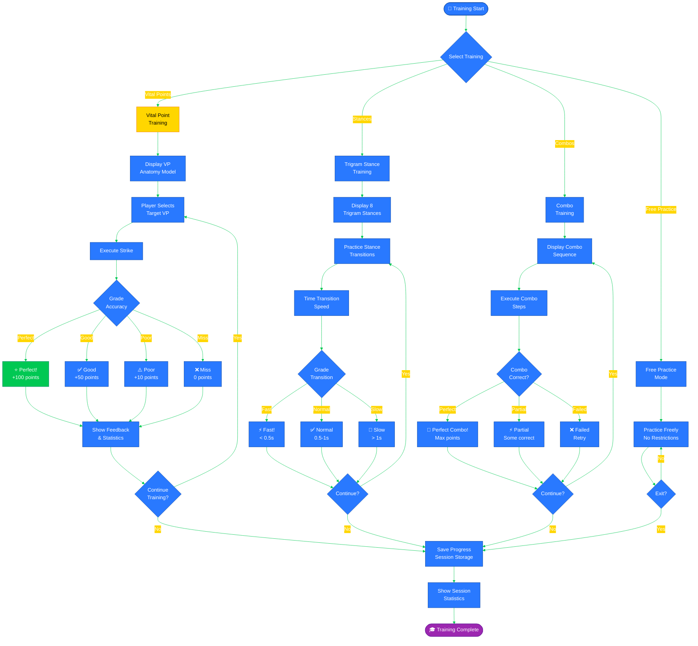

---

## 🎵 Audio System Flow

### **Audio Feedback Flow**

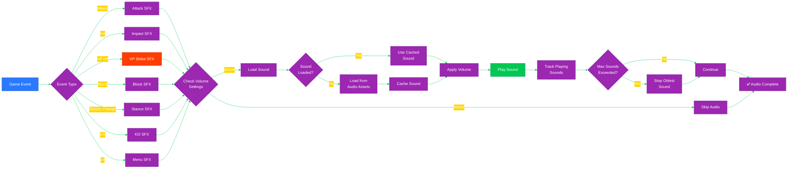

---

## 🔄 State Synchronization Flow

### **State Update Flow**

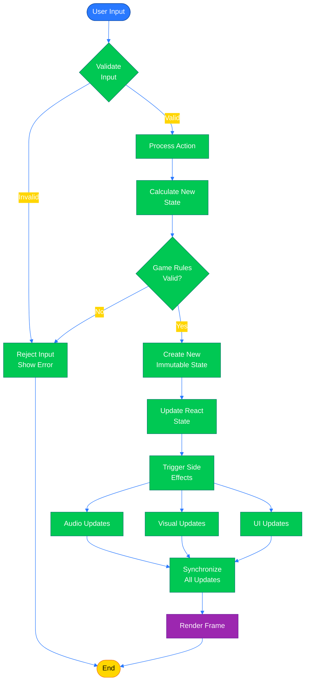

---

## 📊 Asset Loading Flow

### **Game Initialization Flow (Three.js)**

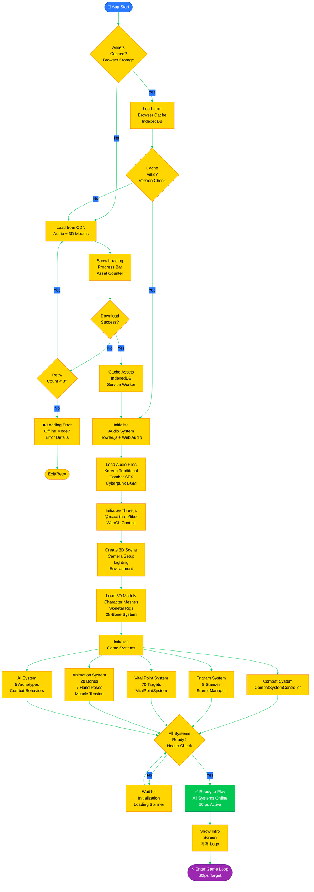

---

**흑괘의 길을 걸어라** - _Walk the Path of the Black Trigram through Process Flow_

These flowcharts document the complete user journey and system processes for Black Trigram, ensuring comprehensive understanding of game mechanics and state transitions for authentic Korean martial arts combat simulation.

---

**📋 Document Control:**  
**✅ Approved by:** James Pether Sörling, CEO  
**📤 Distribution:** Public  
**🏷️ Classification:**     
**📅 Effective Date:** 2026-04-21  
**⏰ Next Review:** 2026-10-21  
**🎯 Framework Compliance:**  
