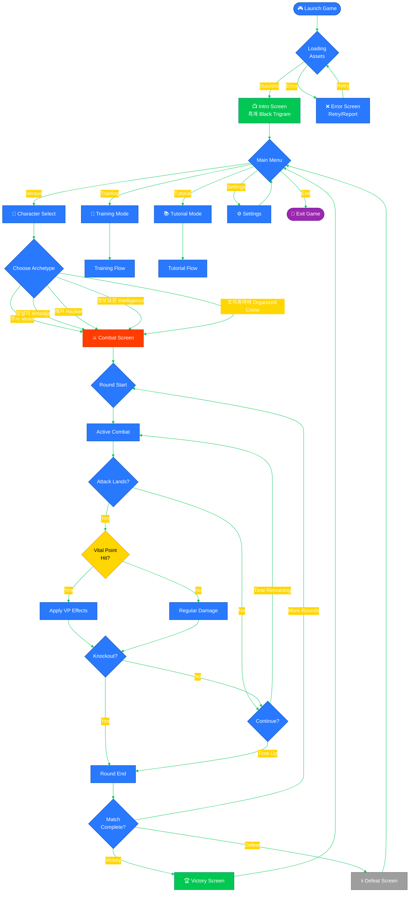
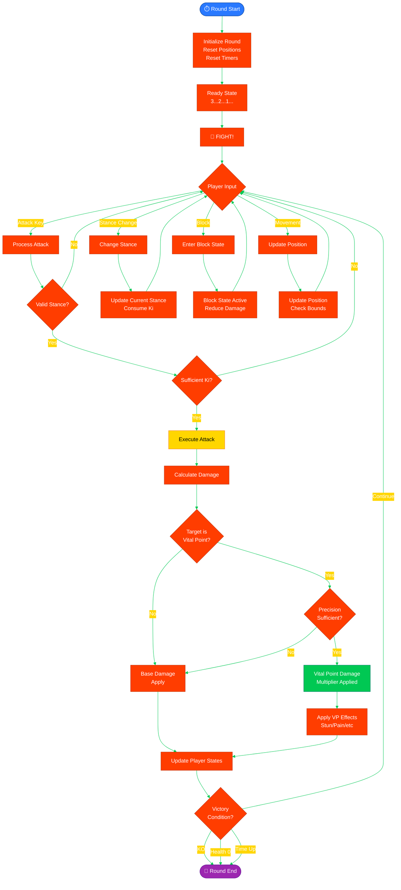
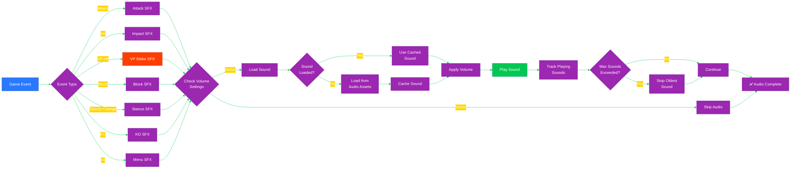
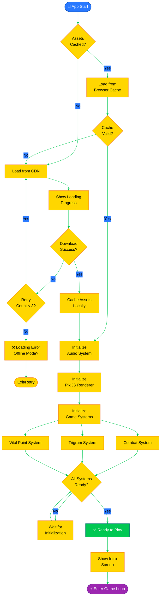

# 🔄 Black Trigram (흑괘) Flowcharts

## 📚 Related Documentation

| Document                                      | Focus            | Description                                    |
| --------------------------------------------- | ---------------- | ---------------------------------------------- |
| [Architecture](ARCHITECTURE.md)               | 🏛️ Structure     | C4 model showing system components             |
| [Data Model](DATA_MODEL.md)                   | 📊 Data          | Type system and data structures                |
| [State Diagram](STATEDIAGRAM.md)              | 🎮 State Machine | Combat and game state transitions              |
| [Combat Architecture](COMBAT_ARCHITECTURE.md) | ⚔️ Combat System | Detailed combat mechanics implementation       |
| [Future Flowchart](FUTURE_FLOWCHART.md)       | 🔮 Evolution     | Planned workflow enhancements                  |

---

## 🎯 Overview

This document provides comprehensive flowcharts for Black Trigram (흑괘), documenting all major user flows, game processes, and system interactions. The flows use Korean cyberpunk color scheme consistent with the game's aesthetic.

---

## 🎮 User Journey Flows

### **Main User Flow**



---

## ⚔️ Combat System Flows

### **Combat Round Flow**



### **Attack Resolution Flow**

```mermaid
%%{init: {'theme':'base', 'themeVariables': {'primaryColor':'#FFD600','primaryTextColor':'#000','primaryBorderColor':'#F57F17','lineColor':'#FF3D00','secondaryColor':'#00C853','tertiaryColor':'#2979FF'}}}%%
flowchart LR
    A["⚔️ Attack Input"] --> B{Validate Attack}

    B -->|Invalid| X1["❌ Cancel Attack<br/>Play Error SFX"]
    B -->|Valid| C[Consume Ki/Stamina]

    C --> D[Calculate Hit Box]
    D --> E{Collision<br/>Detected?}

    E -->|No| X2["🌀 Miss<br/>Play Woosh SFX"]
    E -->|Yes| F{Defender<br/>Blocking?}

    F -->|Yes| G[Reduce Damage<br/>50-80%]
    F -->|No| H[Full Damage]

    G --> I[Calculate Final<br/>Damage]
    H --> I

    I --> J{Critical Hit?<br/>Roll < Crit%}

    J -->|Yes| K["×2 Damage<br/>✨ Critical Effect"]
    J -->|No| L[Normal Damage]

    K --> M{Vital Point<br/>Hit?}
    L --> M

    M -->|Yes| N[Apply VP<br/>Multiplier<br/>3x-10x]
    M -->|No| O[Base Damage<br/>Only]

    N --> P[Apply Status<br/>Effects]
    O --> Q[Update Health]
    P --> Q

    Q --> R[Trigger Visual<br/>Effects]
    R --> S[Play Audio<br/>Feedback]
    S --> T[Update Combat<br/>Stats]

    T --> U["✅ Attack Complete"]
    X1 --> U
    X2 --> U

    style A fill:#2979FF,stroke:#0D47A1,color:#fff
    style E fill:#FFD600,stroke:#F57F17,color:#000
    style M fill:#FF3D00,stroke:#BF360C,color:#fff
    style N fill:#00C853,stroke:#00796B,color:#fff
    style U fill:#9C27B0,stroke:#6A1B9A,color:#fff
```



---

## 🎯 Vital Point Targeting Flow

### **Vital Point Strike Resolution**

```mermaid
%%{init: {'theme':'base', 'themeVariables': {'primaryColor':'#00C853','primaryTextColor':'#fff','primaryBorderColor':'#00796B','lineColor':'#FF3D00','secondaryColor':'#FFD600','tertiaryColor':'#2979FF'}}}%%
flowchart TD
    Start([🎯 VP Strike Attempt]) --> CheckStance{Correct Stance<br/>for VP?}
    
    CheckStance -->|No| Penalty[⚠️ Damage Penalty<br/>-50% effectiveness]
    CheckStance -->|Yes| CheckTechnique{Technique<br/>≥ Required?}
    
    Penalty --> CheckTechnique
    
    CheckTechnique -->|No| Miss[❌ Miss VP<br/>Regular hit only]
    CheckTechnique -->|Yes| RollPrecision[🎲 Roll Precision<br/>Random(0-100)]
    
    Miss --> End([Attack Complete])
    
    RollPrecision --> ComparePrecision{Roll ≥<br/>VP.precision?}
    
    ComparePrecision -->|No| Glance[⚡ Glancing VP<br/>50% effectiveness]
    ComparePrecision -->|Yes| PerfectHit[✨ Perfect Strike<br/>Full VP effect]
    
    Glance --> ApplyDamage[Apply Damage<br/>×VP multiplier]
    PerfectHit --> ApplyDamage
    
    ApplyDamage --> DetermineSeverity{VP Severity<br/>Level}
    
    DetermineSeverity -->|Minor| MinorEffect[Minor Effect<br/>Light stun 0.5s]
    DetermineSeverity -->|Moderate| ModEffect[Moderate Effect<br/>Stun 1-2s<br/>Pain increase]
    DetermineSeverity -->|Major| MajorEffect[Major Effect<br/>Stun 3-5s<br/>Stat reduction]
    DetermineSeverity -->|Critical| CritEffect[Critical Effect<br/>Stun 5-8s<br/>Severe debuff]
    DetermineSeverity -->|Lethal| LethalEffect[⚠️ Lethal Effect<br/>Instant KO risk]
    
    MinorEffect --> ApplyStatus[Apply Status Effects]
    ModEffect --> ApplyStatus
    MajorEffect --> ApplyStatus
    CritEffect --> ApplyStatus
    LethalEffect --> ApplyStatus
    
    ApplyStatus --> CheckKO{Health ≤ 0<br/>or<br/>Consciousness ≤ 0?}
    
    CheckKO -->|Yes| KO[💀 Knockout<br/>Round End]
    CheckKO -->|No| Continue[✅ Continue Fight]
    
    KO --> End
    Continue --> End
    
    style Start fill:#2979FF,stroke:#0D47A1,color:#fff
    style PerfectHit fill:#00C853,stroke:#00796B,color:#fff
    style LethalEffect fill:#FF3D00,stroke:#BF360C,color:#fff
    style KO fill:#9E9E9E,stroke:#616161,color:#fff
    style End fill:#9C27B0,stroke:#6A1B9A,color:#fff
```

---

## 🥋 Training Mode Flow

### **Training Session Flow**


---

## 🎵 Audio System Flow

### **Audio Feedback Flow**



---

## 🔄 State Synchronization Flow

### **State Update Flow**


---

## 📊 Asset Loading Flow

### **Game Initialization Flow**



---

**흑괘의 길을 걸어라** - _Walk the Path of the Black Trigram through Process Flow_

These flowcharts document the complete user journey and system processes for Black Trigram, ensuring comprehensive understanding of game mechanics and state transitions for authentic Korean martial arts combat simulation.
