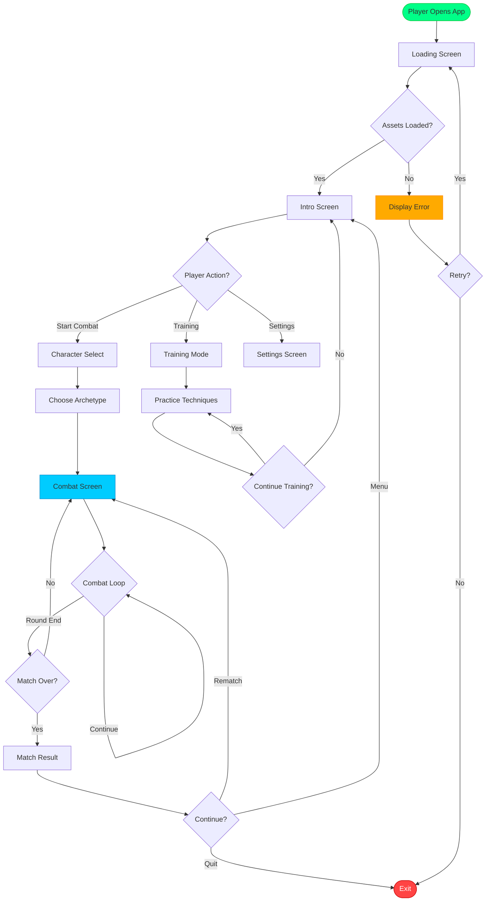
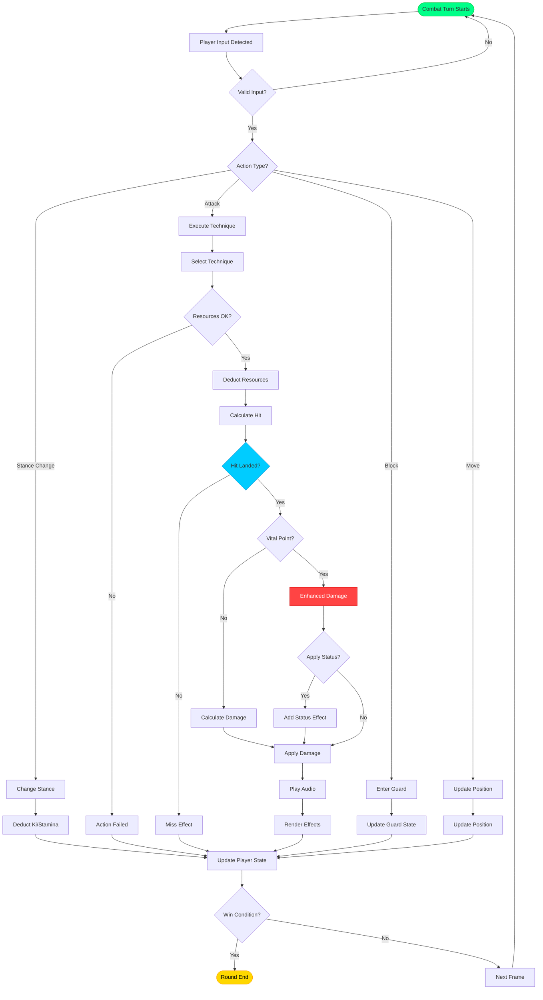
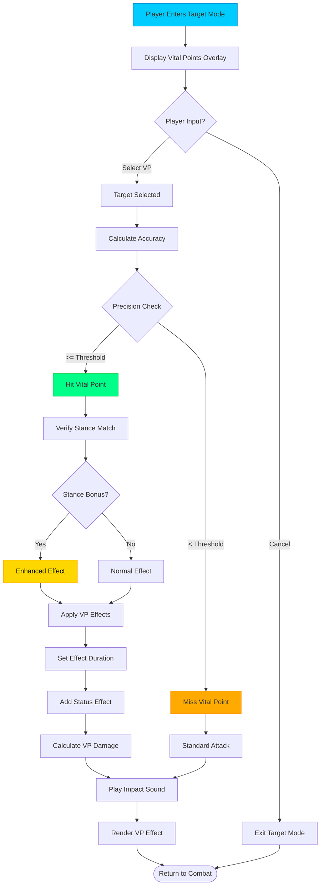
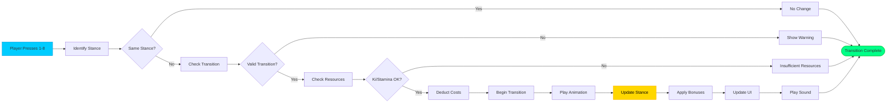
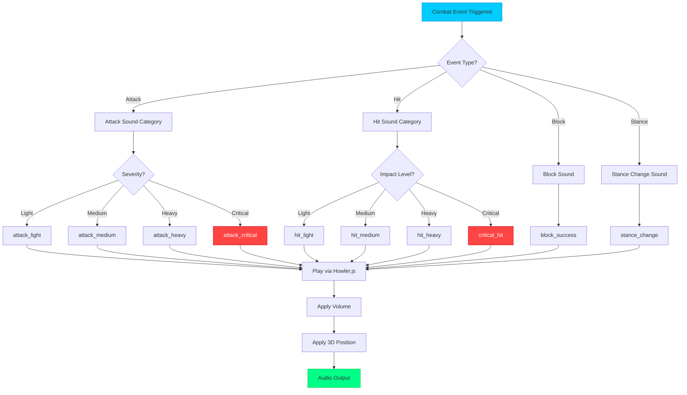
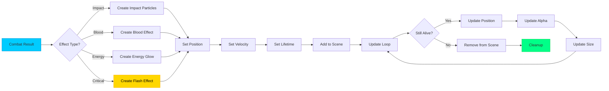
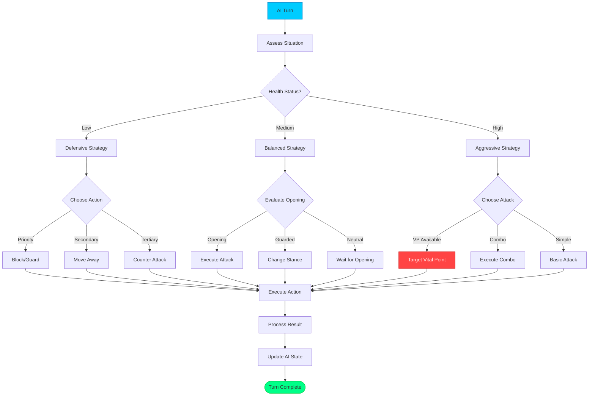
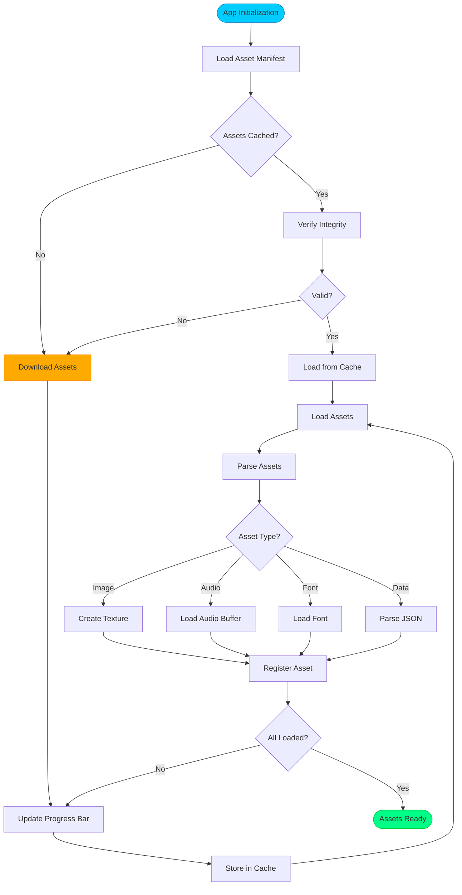
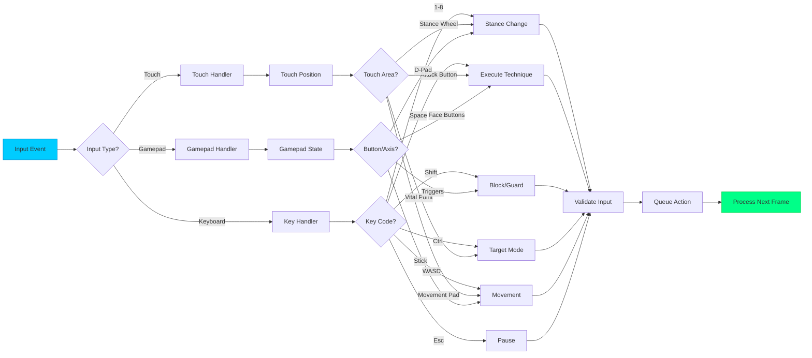

# 🔄 Black Trigram (흑괘) — System Flowcharts

This document provides comprehensive flowchart diagrams illustrating data flows, user journeys, and system processes in the Black Trigram Korean martial arts combat simulator.

## 📚 Related Documentation

| Document | Focus | Description |
|----------|-------|-------------|
| [Architecture](ARCHITECTURE.md) | 🏛️ System | C4 model and system structure |
| [DATA_MODEL](DATA_MODEL.md) | 📊 Data | Game data structures and interfaces |
| [STATEDIAGRAM](STATEDIAGRAM.md) | 🎯 States | State machine transitions |
| [Combat Architecture](COMBAT_ARCHITECTURE.md) | ⚔️ Combat | Detailed combat system design |

---

## 🎮 User Journey Flow

### **Complete Player Journey**

---

## ⚔️ Combat Flow Diagrams

### **Combat Turn Resolution**

### **Damage Calculation Flow**

```mermaid
flowchart LR
    A[Technique Executed] --> B[Base Damage]
    B --> C{Critical Hit?}
    C -->|Yes| D[Apply 2x Multiplier]
    C -->|No| E[Normal Damage]
    
    D --> F[Check Vital Point]
    E --> F
    
    F --> G{Vital Point Hit?}
    G -->|Yes| H[Apply VP Multiplier]
    G -->|No| I[Calculate Stance Bonus]
    
    H --> J[Add Status Effects]
    J --> K[Apply Defender Defense]
    
    I --> K
    K --> L[Final Damage]
    
    L --> M[Update Health]
    M --> N[Check Balance Impact]
    N --> O[Update Consciousness]
    
    style A fill:#00ccff,stroke:#0088cc
    style L fill:#ffd700,stroke:#ffaa00,color:#000
    style D fill:#ff4444,stroke:#cc0000,color:#fff
    style H fill:#ff4444,stroke:#cc0000,color:#fff
```

---

## 🎯 Vital Point Targeting Flow

---

## 🔄 Stance Transition Flow

---

## 📊 Audio System Flow

---

## 🎨 Visual Effects Flow

---

## 🧠 AI Decision Flow (Training Mode)

---

## 🔧 Asset Loading Flow

---

## 📱 Input Handling Flow

---

**📋 Document Control:**  
**✅ Approved by:** CEO  
**📤 Distribution:** Public  
**🏷️ Classification:** Public  
**📅 Effective Date:** 2025-11-14  
**⏰ Next Review:** 2026-11-14  
**🎯 Compliance:** ISO 27001 (A.8.9), NIST CSF (PR.IP-1)
