# 🚀 Black Trigram (흑괘) - Future Architecture

## Executive Summary

This document outlines the evolutionary architecture roadmap for Black Trigram, transforming it from the current foundation into a comprehensive Korean martial arts combat simulator with authentic vital point targeting, realistic physics, and cultural depth.

## 📚 Architecture Evolution Map

### Current State Documentation

| Document                                    | Status      | Description                               |
| ------------------------------------------- | ----------- | ----------------------------------------- |
| **[Current Architecture](ARCHITECTURE.md)** | ✅ Complete | C4 model of existing system structure     |
| **[Game Design](game-design.md)**           | ✅ Complete | Korean martial arts game mechanics vision |
| **[README](README.md)**                     | ✅ Complete | Project overview and combat features      |
| **[Mindmap](mindmap.md)**                   | ✅ Complete | Visual concept map of Korean martial arts |

### Future Architecture Phases

| Document                     | Status         | Description                        |
| ---------------------------- | -------------- | ---------------------------------- |
| **FUTURE_ARCHITECTURE.md**   | 📋 This Doc    | Evolutionary roadmap and planning  |
| **Phase 1: Foundation**      | 🔄 In Progress | Core combat and vital point system |
| **Phase 2: Authenticity**    | 📋 Planned     | Korean cultural integration        |
| **Phase 3: Advanced Combat** | 📋 Planned     | Realistic physics and archetypes   |
| **Phase 4: Mastery**         | 📋 Planned     | Training system and AI guidance    |

## 🔍 Current State Analysis

### Existing Foundation (As-Is)

The current codebase provides a solid foundation with:

#### ✅ Strengths

- **React 19 + Three.js** integration with `@react-three/fiber` and `@react-three/drei`
- **TypeScript strict mode** for type safety
- **Audio system** with Howler.js for damage-based feedback
- **Component architecture** with Korean UI elements
- **Testing framework** with Vitest and Cypress
- **Korean font support** with Noto Sans KR

#### 🔄 Current Limitations

- **Empty components** - Most game components are placeholder files
- **Basic audio system** - Limited to simple sound effects
- **No combat mechanics** - Missing vital point targeting system
- **No player archetypes** - Fighter specializations not implemented
- **Basic UI** - Korean-themed but not interactive
- **No training system** - Educational components missing

### Technical Debt Assessment

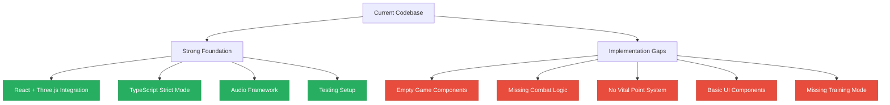

## 🗺️ Black Trigram Evolutionary Roadmap (2026-2034)

### 📅 Timeline Overview

| Phase | Version | Timeline | Focus | Status |
|-------|---------|----------|-------|--------|
| **Beta** | v0.9.x | Q1 2026 | Combat realism completion | ✅ 67% Complete (8/12 systems) |
| **v1.0 Release** | v1.0.0 | Q2-Q3 2026 | Production-ready game | 📋 Planned |
| **Post-1.0** | v1.1-v1.9 | Q4 2026-Q4 2027 | Polish, content, balance | 📋 Planned |
| **v2.0** | v2.0.0 | Q1 2028 | Multiplayer, backend, progression | 📋 Future |
| **v3.0** | v3.0.0 | Q1 2030 | AI instructors, adaptive difficulty | 📋 Future |
| **v4.0+** | v4.0.0+ | 2032-2034 | VR/AR, metaverse, mobile native | 📋 Vision |

### 🎯 v1.0 Release Criteria (Q2-Q3 2026)

**Essential Features (Must-Have)**:
- [x] ✅ 70/70 vital points complete with Korean names (백회혈, 인영, 명문, etc.)
- [x] ✅ All 8 trigram stances fully functional (건, 태, 리, 진, 손, 감, 간, 곤)
- [x] ✅ 5 player archetypes balanced (무사, 암살자, 해커, 정보요원, 조직폭력배)
- [x] ✅ Body part health system (8 parts tracked)
- [x] ✅ Enhanced anatomical zones with polygon detection
- [x] ✅ Visual feedback system (damage numbers, hit effects, combo counter)
- [ ] ⚠️ Combat realism systems 100% (currently 67% - 8/12 complete)
  - [x] Pain response system (90% production-ready)
  - [x] Consciousness levels (90% production-ready)
  - [x] Breathing disruption (75% near-complete)
  - [ ] Trauma visualization (65% - needs injury tracking)
  - [ ] Injury-based movement (10% - planned)
  - [ ] Bone impact audio (0% - planned)
- [ ] ⚠️ Training mode with progressive difficulty
- [ ] ⚠️ EndScreen with combat statistics and replay
- [ ] ⚠️ Korean localization 100% (currently 80%)
- [ ] ⚠️ Test coverage 80%+ (currently 76%)
- [ ] ⚠️ 60fps on all target platforms (desktop ✅, mobile needs optimization)

**Nice-to-Have Features**:
- [ ] Backend for save persistence (IndexedDB fallback)
- [ ] Multiplayer (PvP) prototype
- [ ] Mobile native app (iOS/Android)
- [ ] Leaderboards and achievements

**Release Criteria**:
- Overall quality: 9.0/10 minimum (currently 8.4/10)
- Zero critical bugs
- Performance: 60fps sustained on desktop, 55fps+ on mobile
- Documentation: Complete user manual and API docs
- Test coverage: 80%+ overall

### 🚀 Post-1.0 Roadmap (v1.1-v1.9, 2026-2027)

#### v1.1 (Q4 2026) - Polish & Balance
**Focus**: Refinement based on user feedback
- Refine combat balance after gathering player data
- Add missing sound effects and voice lines
- Optimize mobile performance (target: 58-60fps sustained)
- Complete Korean localization (100%)
- UI/UX improvements for accessibility

**Estimated Effort**: 4-6 weeks
**Target Rating**: 9.2/10

#### v1.3 (Q1 2027) - Content Expansion
**Focus**: Expanded gameplay variety
- Add 5 new AI opponent personality types
- Expand training mode with advanced scenarios:
  - Combo practice mode
  - Moving target drills
  - Time attack challenges
  - Precision accuracy tests
- Add achievement system (30+ achievements)
- Implement combat replay system with slow-motion

**Estimated Effort**: 6-8 weeks
**Target Rating**: 9.4/10

#### v1.5 (Q2 2027) - Quality of Life
**Focus**: Enhanced player experience
- Add custom key binding system
- Implement combat difficulty selector (Easy/Normal/Hard/Master)
- Add colorblind accessibility modes
- Improve UI/UX based on user studies
- Add tutorial tooltips and contextual help
- Implement save/load system (IndexedDB)

**Estimated Effort**: 4-6 weeks
**Target Rating**: 9.5/10

#### v1.7 (Q3 2027) - Advanced Features
**Focus**: Depth and mastery
- Add technique combo system (2-3 technique chains)
- Implement damage over time effects (bleeding, pain accumulation)
- Add environmental hazards in combat
- Advanced statistics tracking and analytics
- Performance profiling dashboard
- Unlock system for advanced techniques

**Estimated Effort**: 6-8 weeks
**Target Rating**: 9.6/10

### 🌐 v2.0 Vision (2028) - Multiplayer & Persistence

#### Major Features

**1. Backend Infrastructure**:
- **User Accounts & Authentication**:
  - OAuth 2.0 integration (Google, GitHub)
  - JWT-based session management
  - Password recovery and security features
  - Profile customization (avatar, bio, achievements)
- **Save Game Persistence**:
  - Cloud storage with AWS S3
  - Player progress tracking
  - Combat history and statistics
  - Equipment and unlock persistence
- **Backend API**:
  - Node.js + Express RESTful API
  - PostgreSQL database for relational data
  - Redis caching layer for performance
  - GraphQL for advanced queries

**2. Multiplayer (PvP)**:
- **Real-time 1v1 Combat**:
  - WebRTC peer-to-peer connection
  - Low-latency input synchronization
  - Rollback netcode for smooth gameplay
  - Automatic lag compensation
- **Matchmaking System**:
  - ELO-based skill rating
  - Ranked and casual modes
  - Regional matchmaking (US, EU, Asia)
  - Quick play and custom lobbies
- **Spectator Mode**:
  - Live match viewing
  - Camera controls and replay
  - Combat statistics overlay
  - Share match replays

**3. Progression System**:
- **Character Leveling (1-50)**:
  - Experience from combat and training
  - Level-based stat increases
  - Milestone rewards every 5 levels
- **Skill Trees per Archetype**:
  - 3 specialization branches per archetype
  - 20+ skills per archetype
  - Passive and active abilities
  - Respec system (with cost)
- **Equipment & Customization**:
  - Equipment crafting system
  - Cosmetic items (clothing, effects)
  - Equipment with stat bonuses
  - Trading system (optional)
- **Daily Challenges & Events**:
  - Daily missions with rewards
  - Weekly tournaments
  - Seasonal events with exclusive items
  - Community challenges

**4. Social Features**:
- **Friend Lists & Private Matches**:
  - Friend invitations and management
  - Private lobbies for friend groups
  - Chat system (text and emotes)
- **Combat Recording Sharing**:
  - Save and share combat replays
  - Upload to community gallery
  - Vote and comment system
  - Top replays showcase
- **Community Leaderboards**:
  - Global and regional rankings
  - Archetype-specific leaderboards
  - Weekly and seasonal rankings
  - Achievement leaderboards
- **Guilds/Clans System**:
  - Create and join guilds
  - Guild rankings and competitions
  - Guild chat and events
  - Guild equipment and bonuses

#### Technology Stack Updates

**Backend Technologies**:
- **Node.js + Express** - RESTful API and GraphQL
- **PostgreSQL** - Relational database for user data
- **Redis** - Caching and session storage
- **WebRTC + Socket.io** - Real-time multiplayer
- **AWS Services**:
  - EC2 for backend hosting
  - RDS for managed PostgreSQL
  - S3 for save game and replay storage
  - CloudFront CDN for global performance
  - ElastiCache for Redis caching

**Estimated Effort**: 6-9 months (backend + multiplayer)
**Target Rating**: 9.8/10

#### 🏗️ AWS Serverless Backend Architecture

**Note**: The backend implementation is 90% complete in the private commercial repository [Hack23/black-trigram-business](https://github.com/Hack23/black-trigram-business) with comprehensive security and architecture documentation. The backend is commercial and not open source. This section documents the planned architecture for reference.

##### C4 Container Diagram: AWS Serverless Architecture

```mermaid
C4Container
    title Black Trigram Future Backend Architecture - AWS Serverless

    Person(player, "🧑 Player", "Game user accessing Black Trigram")
    
    System_Boundary(aws, "AWS Cloud Infrastructure") {
        Container(cognito, "🔐 AWS Cognito", "User Pools + Identity Pools", "Authentication, MFA, social login federation")
        Container(apiGateway, "🚪 API Gateway", "REST + WebSocket APIs", "API management, rate limiting, request/response transformation")
        Container(lambda, "⚡ Lambda Functions", "Node.js/TypeScript", "Business logic, game mechanics, payment processing")
        Container(dynamoDB, "📊 DynamoDB", "NoSQL Database", "Player profiles, game states, achievements, purchases")
        Container(s3, "💾 S3", "Object Storage", "Save games, combat replays, user-generated content, assets")
        Container(backup, "🔄 AWS Backup", "Backup Service", "Automated backups, point-in-time recovery, compliance")
        Container(resilience, "🛡️ Resilience Hub", "DR Planning", "RTO/RPO management, resilience assessment")
        Container(waf, "🔥 AWS WAF", "Web Application Firewall", "OWASP protection, rate limiting, geo-blocking")
        Container(cloudFront, "🌐 CloudFront", "CDN", "Global content delivery, DDoS protection")
        Container(guardDuty, "👁️ GuardDuty", "Threat Detection", "Continuous security monitoring, anomaly detection")
        Container(securityHub, "🔒 Security Hub", "Security Posture", "Unified security findings, compliance checks")
    }
    
    System_Ext(stripe, "💳 Stripe", "Payment processor for cosmetics, battle passes, DLC")
    System_Ext(social, "🌐 Social Login Providers", "Google, Facebook, Discord, GitHub, Twitter/X, Apple")
    System_Ext(frontend, "⚛️ React Frontend", "Current Black Trigram web application")
    
    Rel(player, frontend, "Plays game", "HTTPS")
    Rel(frontend, cloudFront, "Loads SPA/static assets via CDN", "HTTPS")
    Rel(frontend, cognito, "Authenticates via Hosted UI/OIDC", "OAuth 2.0/OIDC")
    Rel(cognito, social, "Federated login", "OAuth 2.0")
    Rel(frontend, apiGateway, "API calls", "HTTPS/WSS")
    Rel(waf, apiGateway, "Protects", "Rules")
    Rel(apiGateway, lambda, "Invokes", "AWS SDK")
    Rel(lambda, dynamoDB, "Reads/writes data", "AWS SDK")
    Rel(lambda, s3, "Stores files", "AWS SDK")
    Rel(frontend, stripe, "Processes payments", "Stripe.js SDK")
    Rel(lambda, stripe, "Validates webhooks", "Stripe API")
    Rel(backup, dynamoDB, "Backs up", "AWS Backup")
    Rel(backup, s3, "Backs up", "AWS Backup")
    Rel(resilience, backup, "Monitors RTO/RPO", "Resilience Hub")
    Rel(guardDuty, lambda, "Analyzes activity for threats", "CloudTrail, VPC Flow Logs, DNS logs")
    Rel(securityHub, guardDuty, "Ingests GuardDuty findings", "EventBridge / AWS Security Hub")

    UpdateLayoutConfig($c4ShapeInRow="4", $c4BoundaryInRow="1")
```

##### Network Architecture: VPC & Private Subnets

**Reference Implementation**: Based on [Hack23/lambda-in-private-vpc](https://github.com/Hack23/lambda-in-private-vpc) - enterprise-grade multi-region active/active architecture with comprehensive security controls.

**VPC Configuration** (Multi-AZ deployment):

- **VPC CIDR**: 10.1.0.0/16 with DNS support enabled
- **Private Subnets**: 3 availability zones (us-east-1a/b/c) for Lambda functions
- **Public Subnets**: 2 availability zones for NAT Gateways only
- **Subnet CIDRs**: Private (10.1.1.0/24, 10.1.2.0/24, 10.1.3.0/24), Public (10.1.11.0/24, 10.1.12.0/24)
- **Internet Gateway**: Required for NAT Gateway operation in public subnets
- **No Direct Internet Access from Lambda**: Lambda in private subnets with no IGW route, uses VPC endpoints for AWS services
- **NAT Gateways**: 2 NAT Gateways in public subnets (one per AZ) for outbound Stripe API calls from Lambda

**VPC Endpoints** (PrivateLink for AWS services - Lambda to AWS traffic stays on AWS network):

| Service | Endpoint Type | Purpose | Security Benefit |
|---------|---------------|---------|------------------|
| **DynamoDB** | Gateway | Database access from Lambda | Traffic stays within AWS network |
| **S3** | Gateway | Save game storage access | No internet exposure, free data transfer |
| **API Gateway (execute-api)** | Interface | Private connectivity from VPC to API Gateway | VPC-based workloads can call API Gateway privately; public game APIs remain internet-accessible via CloudFront/WAF |
| **Lambda** | Interface | Cross-account Lambda invocation | Private invocation without internet |
| **CloudWatch Logs** | Interface | Logging from Lambda | Logs never traverse public internet |
| **Secrets Manager** | Interface | Secure credential retrieval | Stripe keys, API tokens stay private |
| **KMS** | Interface | Encryption key operations | Key material never leaves AWS network |
| **STS** | Interface | IAM role assumption | Secure token exchange |
| **ECR** | Interface | Container image pulls | Private Docker registry access |

**Route 53 DNS Firewall** (Domain filtering and threat protection):

**Filtering Strategy**:
- **Block Known Threats**: AWS-managed lists for malware, phishing, and botnet C2 domains
- **Block Cryptomining**: Custom lists for cryptocurrency mining domains (alert mode to minimize false positives)
- **Allow AWS Services**: Whitelist for cognito-idp, dynamodb, s3, lambda domains
- **Allow Social Providers**: Google, Facebook, Discord, GitHub, Twitter/X, Apple authentication domains
- **Allow Payment Services**: Stripe API and SDK domains (api.stripe.com, js.stripe.com)
- **Log Everything**: All DNS queries logged for security analysis and threat intelligence

**VPC Flow Logs** (Network traffic monitoring):

- **Capture Scope**: All traffic (accepted, rejected, and all connections)
- **Destination**: CloudWatch Logs for analysis and alerting
- **Retention**: 90 days for security investigation and compliance
- **Log Format**: Source/destination addresses, ports, protocols, packet counts, bytes transferred, connection status
- **Use Cases**: Security forensics, anomaly detection, compliance auditing, traffic pattern analysis

**Security Group Configuration** (Least privilege network access):

**Lambda Function Security Group**:
- **Egress Rules**:
  - HTTPS (443) to VPC endpoints for AWS service access (DynamoDB, S3, Secrets Manager, CloudWatch, X-Ray)
  - HTTPS (443) to internet via NAT Gateway for Stripe API and social login validation
- **Ingress Rules**: None (Lambda invoked by API Gateway, not directly accessible)

**VPC Endpoints Security Group**:
- **Ingress Rules**: HTTPS (443) from Lambda security group only
- **Egress Rules**: None required (endpoints are AWS-managed)

**Design Principles**: Default deny-all, explicit allow rules only, principle of least privilege

**Network ACLs** (Subnet-level firewall rules):

**Inbound Rules**:
- Allow HTTPS (443) from within VPC CIDR (10.1.0.0/16)
- Allow ephemeral ports (1024-65535) for return traffic from internet
- Default deny all other inbound traffic

**Outbound Rules**:
- Allow HTTPS (443) to anywhere (for AWS services and external APIs)
- Allow ephemeral ports (1024-65535) for return traffic to VPC
- Default deny all other outbound traffic

**Purpose**: Stateless subnet-level defense providing additional security layer beyond security groups

**CloudFront Distribution** (Global CDN with WAF integration):

**Origin Configuration**:
- **S3 Origin**: Static SPA assets (frontend) with Origin Access Control (OAC) for private bucket access
- **API Gateway Origin**: Backend API with custom domain and origin path mapping

**Caching Strategy**:
- **Static Assets**: Aggressive caching (1 day default, 1 year max) with compression enabled
- **API Calls**: No caching (cache policy: CachingDisabled) for dynamic content
- **Viewer Protocol**: Redirect HTTP to HTTPS (security requirement)

**Security Configuration**:
- **TLS Version**: Minimum TLSv1.2_2021 security policy (TLS 1.3 preferred when supported)
- **WAF Integration**: AWS WAF Web ACL attached for OWASP protection
- **DDoS Protection**: AWS Shield Standard (automatic, no cost)
- **Custom Domain**: blacktrigram.com with ACM certificate

**Logging**: Access logs to S3 bucket for security analysis and compliance

**AWS WAF Web ACL** (OWASP protection and rate limiting):

**Managed Rule Groups**:
- **Core Rule Set**: OWASP Top 10 protection (XSS, SQL injection, LFI, RFI)
- **Known Bad Inputs**: Protection against known malicious payloads
- **SQL Injection**: Enhanced SQL injection attack protection
- **IP Reputation**: AWS-managed threat intelligence blocking known bad actors

**Custom Rate Limiting Rules**:
- **Global Rate Limit**: 100 requests per 5 minutes per IP address (429 response on exceed)
- **Auth Endpoint Protection**: 10 requests per 5 minutes for /auth/* paths (brute force protection)

**Geo-Blocking**:
- **Blocked Countries**: North Korea, Iran, Cuba, Syria (high-risk regions for regulatory compliance)

**Monitoring**: CloudWatch metrics and sampled requests for security analysis

**Network Security Benefits**:
- **Zero Trust Architecture**: Lambda functions in private subnets with no internet gateway
- **VPC Endpoints**: All AWS service traffic stays within AWS backbone (no internet exposure)
- **DNS Firewall**: Blocks malicious domains, cryptomining, and unauthorized outbound connections
- **Multi-Layer Defense**: WAF → CloudFront → API Gateway → Lambda (VPC) → DynamoDB/S3 (VPC endpoints)
- **Traffic Isolation**: Separate security groups for Lambda, VPC endpoints, and API Gateway
- **Comprehensive Logging**: VPC Flow Logs, CloudFront access logs, WAF logs, CloudTrail
- **Compliance Ready**: Meets NIST 800-53, ISO 27001, PCI DSS network security requirements

##### DynamoDB Table Schemas

**Players Table** (`blacktrigram-players`)

| Attribute | Type | Description | Index |
|-----------|------|-------------|-------|
| `PK` | String | `PLAYER#{userId}` | Partition Key |
| `SK` | String | `PROFILE` or `METADATA` | Sort Key |
| `userId` | String | AWS Cognito user ID (UUID) | - |
| `username` | String | Display name (3-20 chars, alphanumeric + underscore) | GSI-1 PK |
| `email` | String | User email (verified via Cognito) | - |
| `archetype` | String | Player archetype (무사, 암살자, 해커, 정보요원, 조직폭력배) | - |
| `level` | Number | Character level (1-50) | - |
| `experience` | Number | Total XP earned | - |
| `skillPoints` | Number | Available skill points | - |
| `createdAt` | String | ISO 8601 timestamp | - |
| `lastLoginAt` | String | ISO 8601 timestamp | - |
| `totalPlayTime` | Number | Total playtime in seconds | - |
| `combatsWon` | Number | Total victories | - |
| `combatsLost` | Number | Total defeats | - |
| `totalDamageDealt` | Number | Lifetime damage dealt | - |
| `settings` | Map | User preferences (audio, graphics, controls) | - |

**GameStates Table** (`blacktrigram-gamestates`)

| Attribute | Type | Description | Index |
|-----------|------|-------------|-------|
| `PK` | String | `PLAYER#{userId}` | Partition Key |
| `SK` | String | `GAMESTATE#{timestamp}` or `LATEST` | Sort Key |
| `saveId` | String | Unique save game ID (UUID) | GSI-1 PK |
| `timestamp` | String | ISO 8601 timestamp | - |
| `stanceData` | Map | Current stance configuration (건, 태, 리, 진, 손, 감, 간, 곤) | - |
| `vitalPointProgress` | Map | Unlocked vital points and mastery levels (70 points) | - |
| `equipment` | Map | Equipped items and cosmetics | - |
| `inventory` | List | Owned items and consumables | - |
| `combatStats` | Map | Session combat statistics | - |
| `trainingProgress` | Map | Training mode completion data | - |
| `questProgress` | Map | Active and completed quests | - |
| `compressedData` | String | Gzip-compressed additional game state | - |

**Achievements Table** (`blacktrigram-achievements`)

| Attribute | Type | Description | Index |
|-----------|------|-------------|-------|
| `PK` | String | `PLAYER#{userId}` | Partition Key |
| `SK` | String | `ACHIEVEMENT#{achievementId}` | Sort Key |
| `achievementId` | String | Unique achievement identifier | - |
| `name` | String | Achievement name (Korean + English) | - |
| `description` | String | Achievement description | - |
| `unlockedAt` | String | ISO 8601 timestamp | - |
| `progress` | Number | Progress towards completion (0-100) | - |
| `isCompleted` | Boolean | Completion status | - |
| `rarity` | String | `common`, `rare`, `epic`, `legendary` | - |
| `rewardType` | String | Reward type (cosmetic, skillPoints, title) | - |
| `metadata` | Map | Additional achievement data | - |

**Purchases Table** (`blacktrigram-purchases`)

| Attribute | Type | Description | Index |
|-----------|------|-------------|-------|
| `PK` | String | `PLAYER#{userId}` | Partition Key |
| `SK` | String | `PURCHASE#{purchaseId}` | Sort Key |
| `purchaseId` | String | Unique purchase ID (UUID) | - |
| `stripeSessionId` | String | Stripe Checkout Session ID | GSI-1 PK |
| `stripePaymentIntentId` | String | Stripe Payment Intent ID | - |
| `amount` | Number | Purchase amount in cents (USD) | - |
| `currency` | String | Currency code (USD) | - |
| `items` | List | Purchased items with IDs and quantities | - |
| `status` | String | `pending`, `completed`, `refunded`, `failed` | - |
| `createdAt` | String | ISO 8601 timestamp | - |
| `completedAt` | String | ISO 8601 timestamp | - |
| `metadata` | Map | Additional purchase metadata | - |

**Leaderboards Table** (`blacktrigram-leaderboards`)

| Attribute | Type | Description | Index |
|-----------|------|-------------|-------|
| `PK` | String | `LEADERBOARD#{type}` (e.g., `GLOBAL`, `ARCHETYPE#무사`) | Partition Key |
| `SK` | String | `SCORE#{score}#PLAYER#{userId}` (zero-padded for sorting) | Sort Key |
| `userId` | String | Player user ID | - |
| `username` | String | Display name | - |
| `score` | Number | Leaderboard score (ELO, wins, damage, etc.) | - |
| `rank` | Number | Current rank (calculated) | - |
| `updatedAt` | String | ISO 8601 timestamp | - |

##### API Gateway Endpoint Design

**REST API Endpoints** (`https://api.blacktrigram.com`)

> **Auth Pattern Clarification**: Black Trigram uses AWS Cognito Hosted UI (including social login) as the primary end-user authentication flow for browser-based clients, as shown in the sequence diagrams below. The `/auth/*` endpoints listed are an optional backend facade around Cognito for non-Hosted-UI clients (e.g., first-party native apps, server-to-server flows) and for consistency in internal APIs. Browser-based Hosted UI flows do not call `/auth/signup` or `/auth/login` directly—they redirect to Cognito's hosted pages.

| Method | Endpoint | Description | Auth Required |
|--------|----------|-------------|---------------|
| `POST` | `/auth/signup` | Create new user account via Cognito (custom API facade for non-Hosted-UI clients) | ❌ |
| `POST` | `/auth/login` | Authenticate user or exchange Cognito auth code for JWT tokens (custom clients) | ❌ |
| `POST` | `/auth/refresh` | Refresh access token | ✅ (Refresh token) |
| `POST` | `/auth/logout` | User logout (invalidate tokens) | ✅ |
| `POST` | `/auth/forgot-password` | Initiate password reset | ❌ |
| `POST` | `/auth/reset-password` | Complete password reset | ❌ |
| `GET` | `/player/profile` | Get player profile data | ✅ |
| `PUT` | `/player/profile` | Update player profile | ✅ |
| `GET` | `/player/stats` | Get player statistics | ✅ |
| `GET` | `/game/save` | Load latest game state | ✅ |
| `POST` | `/game/save` | Save game state | ✅ |
| `GET` | `/game/saves` | List all save games | ✅ |
| `DELETE` | `/game/save/{saveId}` | Delete specific save game | ✅ |
| `GET` | `/achievements` | Get player achievements | ✅ |
| `POST` | `/achievements/unlock` | Unlock achievement | ✅ |
| `GET` | `/leaderboards/{type}` | Get leaderboard rankings | ❌ |
| `POST` | `/leaderboards/submit` | Submit leaderboard score | ✅ |
| `POST` | `/payments/create-checkout` | Create Stripe Checkout Session | ✅ |
| `POST` | `/payments/webhook` | Stripe webhook handler | ❌ (Stripe signature) |
| `GET` | `/payments/history` | Get purchase history | ✅ |
| `POST` | `/admin/ban-user` | Ban user account | ✅ (Admin only) |
| `GET` | `/health` | Health check endpoint | ❌ |

**WebSocket API** (`wss://ws.blacktrigram.com`)

| Event | Direction | Description | Payload |
|-------|-----------|-------------|---------|
| `$connect` | Client → Server | WebSocket connection established | JWT token via `Sec-WebSocket-Protocol` subprotocol (browser-compatible; `Authorization` header not supported by browser WebSocket API) |
| `$disconnect` | Client → Server | WebSocket connection closed | - |
| `matchmaking.join` | Client → Server | Join matchmaking queue | `{ archetype, region }` |
| `matchmaking.leave` | Client → Server | Leave matchmaking queue | - |
| `match.found` | Server → Client | Match found notification | `{ matchId, opponentId }` |
| `combat.input` | Client → Server | Send combat input | `{ action, timestamp, sequenceId }` |
| `combat.state` | Server → Client | Combat state update | `{ gameState, timestamp }` |
| `chat.send` | Client → Server | Send chat message | `{ message, recipientId }` |
| `chat.receive` | Server → Client | Receive chat message | `{ senderId, message, timestamp }` |

**API Gateway Configuration**:
- **Request Validation**: JSON schema validation for all POST/PUT requests
- **Rate Limiting**: 100 requests/minute per user (burst: 200)
- **CORS**: Configured for `blacktrigram.com` and `*.blacktrigram.com`
- **API Keys**: Required for third-party integrations
- **Usage Plans**: Free tier (1000 requests/day), Premium tier (unlimited)
- **Logging**: CloudWatch Logs with X-Ray tracing enabled

##### AWS Cognito Authentication Architecture

**User Pool Configuration**:

**Password Policy**:
- Minimum 12 characters with uppercase, lowercase, numbers, and symbols required
- Temporary passwords valid for 1 day only
- Password history enforcement (prevent reuse of last 5 passwords)

**Multi-Factor Authentication (MFA)**:
- Configuration: Optional (user choice)
- Supported Methods: Software TOTP (authenticator apps), SMS MFA
- Recommended for all users, enforced for admin accounts

**User Attributes**:
- **Email**: Required, used as username, auto-verified via confirmation email
- **preferred_username**: Optional (supports social login providers without stable usernames)
- **archetype**: Custom attribute for player archetype (무사, 암살자, 해커, 정보요원, 조직폭력배)

**Account Recovery**: Email-based password reset with verification code

**Social Login Providers Supported**:

| Provider | OAuth 2.0 Flow | Required Scopes | User Attributes Mapped |
|----------|----------------|-----------------|------------------------|
| **Google** | Authorization Code | `openid`, `profile`, `email` | `email`, `name`, `picture` |
| **Facebook** | Authorization Code | `public_profile`, `email` | `email`, `name`, `picture` |
| **Discord** | Authorization Code | `identify`, `email` | `email`, `username`, `avatar` |
| **GitHub** | Authorization Code | `user:email`, `read:user` | `email`, `name`, `avatar_url` |
| **Twitter/X** | Authorization Code with PKCE | `tweet.read`, `users.read` | `username`, `name`, `profile_image_url` |
| **Apple** | Authorization Code | `name`, `email` | `email`, `name` (optional) |

**Authentication Flow Diagram**:

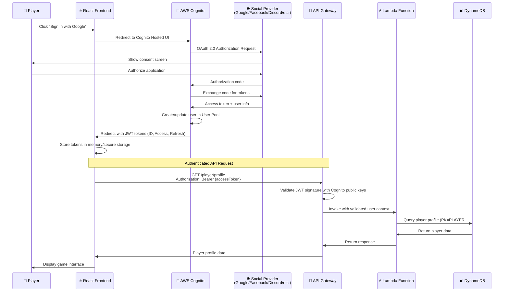

**Identity Pool Configuration** (for AWS resource access):

**Configuration**:
- Unauthenticated access: Disabled (no guest/anonymous access)
- Authentication Provider: AWS Cognito User Pool
- Token Validation: Server-side token verification enabled

**IAM Role Assignment**:
- **Authenticated Users**: Assumed role with least-privilege access to user-specific resources
- **Unauthenticated Users**: No role (disabled)

**Authenticated User IAM Policy** (least privilege):

Users can only access their own resources through condition-based policies:

**S3 Access**:
- **Allowed Actions**: GetObject, PutObject, DeleteObject
- **Resource Scope**: User-specific prefix only (`blacktrigram-user-content/${cognito-identity-id}/*`)
- **Use Case**: Save games, replays, user-generated content

**DynamoDB Access**:
- **Allowed Actions**: GetItem, Query (read-only)
- **Resource Scope**: User's own player data only (partition key filtering by user ID)
- **Security**: Condition enforces users can only query their own records

**Design Principles**: Zero-trust model, identity-based access control, no shared resource access

##### Stripe Payment Integration Architecture

**Payment Use Cases**:
1. **Cosmetic Items**: Character skins, visual effects, emotes ($0.99 - $9.99)
2. **Battle Passes**: Seasonal content with exclusive rewards ($9.99/season)
3. **DLC Expansions**: New archetypes, storylines, training content ($19.99 - $29.99)
4. **Premium Techniques**: Advanced combat techniques ($4.99 - $14.99)

**Stripe Payment Flow**:

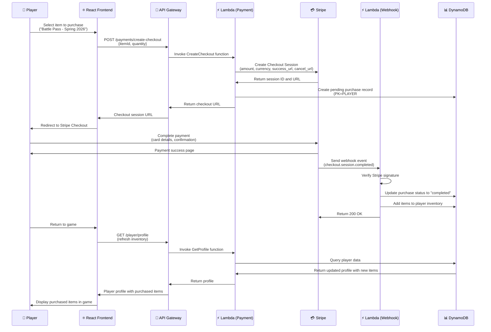

**Stripe Configuration**:

| Setting | Value | Rationale |
|---------|-------|-----------|
| **Currency** | USD | Primary market (US/global) |
| **Payment Methods** | Card, Google Pay, Apple Pay, PayPal | Maximum convenience |
| **Checkout Mode** | Payment (one-time) | No subscriptions initially |
| **Success URL** | `https://blacktrigram.com/payment/success?session_id={CHECKOUT_SESSION_ID}` | Redirect after success |
| **Cancel URL** | `https://blacktrigram.com/payment/cancel` | Redirect on cancellation |
| **Webhook Events** | `checkout.session.completed`, `payment_intent.succeeded`, `charge.refunded` | Track all payment lifecycle events |
| **Webhook Signing** | Required (verify `stripe-signature` header) | Security |

**Stripe Products** (configured in Stripe Dashboard):

**Product Structure**:
- **Product ID**: Unique Stripe product identifier
- **Name**: Bilingual (Korean + English) product name
- **Description**: Clear description of what customer receives
- **Price**: Amount in cents (USD)
- **Metadata**: Custom fields for category, item ID, rarity (if applicable)

**Product Categories**:
1. **Cosmetics** ($0.99 - $14.99): Character skins, visual effects, emotes
2. **Battle Passes** ($9.99/season): Seasonal content with 50 tiers of rewards
3. **DLC Expansions** ($19.99 - $29.99): Story expansions, new training scenarios, additional content
4. **Techniques** ($4.99 - $14.99): Premium martial arts techniques and special moves

**Example Products**:
- **Battle Pass - Spring 2026** ($9.99): Exclusive seasonal content with 50 reward tiers
- **Dark Phoenix Skin** ($14.99): Legendary character skin with unique visual effects
- **DLC: Martial Arts Academy** ($19.99): Story expansion with new training scenarios and challenges

**Revenue Projections** (based on industry benchmarks):

| User Base | Conversion Rate | ARPPU | Monthly Revenue |
|-----------|-----------------|-------|-----------------|
| 1,000 | 5% | $15 | $750 |
| 10,000 | 8% | $20 | $16,000 |
| 50,000 | 10% | $25 | $125,000 |
| 100,000 | 12% | $30 | $360,000 |

##### AWS Backup + Resilience Hub Strategy

**Backup Strategy**:

**Automated Daily Backups**:
- **Schedule**: Daily at 5 AM UTC
- **Backup Window**: 60-minute start window, 120-minute completion window
- **Retention**: 35 days with lifecycle management
- **Cold Storage Transition**: Move to cold storage after 7 days for cost optimization

**Backup Scope**:
- All DynamoDB tables (Players, GameStates, Achievements, Purchases, Leaderboards)
- S3 bucket (blacktrigram-user-content) with user-generated content

**Backup Vault**: Dedicated backup vault with encryption at rest (AWS KMS)

**DynamoDB Point-in-Time Recovery (PITR)**:
- **Enabled**: Yes (all tables)
- **Recovery Window**: 35 days
- **RPO**: 1 minute (continuous backups)
- **RTO**: < 1 hour (restore to any point in time)

**S3 Versioning & Lifecycle**:

**Versioning**: Enabled on all buckets for data protection and recovery

**Lifecycle Policy**:
- **30 days**: Transition non-current versions to Standard-IA (Infrequent Access)
- **90 days**: Transition to Glacier for long-term archival
- **365 days**: Transition to Glacier Deep Archive (lowest cost storage)
- **7 years (2555 days)**: Expire non-current versions (regulatory retention met)

**Multipart Upload Cleanup**: Abort incomplete multipart uploads after 7 days to reduce storage costs

**Cost Optimization**: Automatic tiering based on access patterns reduces storage costs by 60-70%

**AWS Resilience Hub Assessment**:

**Resilience Policy**: Gaming Standard Tier

**Objective Metrics**:
- **RTO (Recovery Time Objective)**: 1 hour - Maximum acceptable downtime for game services
- **RPO (Recovery Point Objective)**: 1 minute - Maximum acceptable data loss via DynamoDB PITR

**Assessment Schedule**: Quarterly (every 3 months) for continuous compliance validation

**Recommended Architecture**:
- **Multi-AZ**: Yes (primary deployment strategy for high availability)
- **Multi-Region**: No (planned for Phase 2 future expansion)
- **Backup Strategy**: Automated daily backups with DynamoDB PITR
- **Disaster Recovery**: Hot standby in same region with automatic failover

**Resilience Hub Metrics & Monitoring**:

| Metric | Target | Current | Status | Actions |
|--------|--------|---------|--------|---------|
| **RTO (Recovery Time)** | 1 hour | 0.5 hours | ✅ Compliant | Multi-AZ deployment |
| **RPO (Recovery Point)** | 1 minute | 1 minute | ✅ Compliant | DynamoDB PITR enabled |
| **Availability SLA** | 99.9% | 99.95% | ✅ Exceeds | CloudFront + API Gateway |
| **Backup Success Rate** | 100% | 100% | ✅ Compliant | AWS Backup monitoring |
| **Data Durability** | 99.999999999% | 99.999999999% | ✅ S3 Standard | S3 eleven 9s durability |

**Disaster Recovery Runbook** (stored in S3 + documented in [Hack23/black-trigram-business](https://github.com/Hack23/black-trigram-business)):

1. **Incident Detection**: GuardDuty + CloudWatch alarms trigger SNS notification
2. **Assessment**: On-call engineer evaluates severity (P1-P4)
3. **Declare DR**: For P1/P2 incidents, activate DR procedures
4. **Restore from Backup**: Use AWS Backup console or CLI to restore DynamoDB tables
5. **Point-in-Time Recovery**: For data corruption, use DynamoDB PITR to restore to last known good state
6. **Validate Integrity**: Run automated health checks and data validation scripts
7. **Resume Service**: Update DNS/CloudFront to point to recovered resources
8. **Post-Incident Review**: Document lessons learned and update runbook

##### Migration Phases: Frontend-Only → Full-Stack AWS

**Phase 1: Authentication & User Management** (Q2-Q3 2026, 8-10 weeks)

**Objectives**:
- Implement AWS Cognito User Pools for authentication
- Add social login support (Google, Facebook, Discord, GitHub, Twitter/X, Apple)
- Build basic profile management system

**Deliverables**:
- [ ] Cognito User Pool created with password policies and MFA support
- [ ] Social login providers configured and tested
- [ ] React frontend authentication UI (login, signup, password reset)
- [ ] JWT token management (secure storage, automatic refresh)
- [ ] Basic profile page (username, email, archetype selection)
- [ ] User settings persistence (audio, graphics, controls)

**Technical Implementation**:
- **Frontend**: React Context API for auth state, AWS Amplify SDK for Cognito integration
- **Backend**: Cognito triggers (pre-signup, post-confirmation, custom messages)
- **Security**: HTTPS only, secure HttpOnly cookies for refresh tokens, PKCE flow for social logins

**Success Criteria**:
- Users can register, login, and manage profiles
- Social login success rate > 95%
- JWT token refresh works seamlessly
- Zero authentication vulnerabilities (OWASP audit passed)

**Phase 2: Game State Persistence** (Q4 2026, 10-12 weeks)

**Objectives**:
- Implement DynamoDB tables for player data and game states
- Add S3 storage for save games and combat replays
- Build REST API with API Gateway and Lambda

**Deliverables**:
- [ ] DynamoDB tables created (Players, GameStates, Achievements, Leaderboards)
- [ ] S3 bucket for user-generated content (save games, replays)
- [ ] API Gateway REST API with authentication middleware
- [ ] Lambda functions for CRUD operations (profile, game state, achievements)
- [ ] Frontend API client with error handling and retry logic
- [ ] Save/load game functionality integrated into game UI
- [ ] Combat replay viewer (playback saved combat sessions)

**Technical Implementation**:
- **Database**: DynamoDB on-demand pricing, multi-table design (5 tables: Players, GameStates, Achievements, Purchases, Leaderboards) with GSIs for secondary access patterns
- **API**: API Gateway with Cognito authorizer, request/response validation
- **Functions**: Node.js Lambda with TypeScript, AWS SDK v3
- **Storage**: S3 with versioning, lifecycle policies for cost optimization

**Success Criteria**:
- Game state saves/loads in < 2 seconds (p95 latency)
- 100% save game integrity (no data loss)
- API Gateway rate limiting prevents abuse
- CloudWatch alarms for Lambda errors/throttling

**Phase 3: Payments & Monetization** (Q1 2027, 8-10 weeks)

**Objectives**:
- Integrate Stripe for payment processing
- Build in-game shop UI for cosmetics and DLC
- Implement battle pass system

**Deliverables**:
- [ ] Stripe account configured (production mode)
- [ ] Payment products created in Stripe Dashboard
- [ ] Lambda function for Stripe Checkout Session creation
- [ ] Webhook handler for payment events (success, refund)
- [ ] In-game shop UI (browse, preview, purchase)
- [ ] Inventory system for owned items
- [ ] Battle pass progression UI (50 tiers with rewards)
- [ ] Purchase history page

**Technical Implementation**:
- **Payments**: Stripe Checkout for PCI compliance, webhook signature verification
- **Inventory**: DynamoDB with eventual consistency for inventory updates
- **UI**: React components for shop, cart, and checkout flow
- **Security**: Server-side validation of all purchases, no client-side price manipulation

**Success Criteria**:
- Payment success rate > 98% (industry standard)
- Zero payment fraud (Stripe Radar enabled)
- Webhook processing latency < 5 seconds
- Purchase receipt emails sent within 1 minute

**Phase 4: Multiplayer & Real-time Features** (Q2 2027, 12-16 weeks)

**Objectives**:
- Implement WebSocket API Gateway for real-time communication
- Build matchmaking system with ELO rating
- Add live multiplayer combat (1v1 PvP)

**Deliverables**:
- [ ] WebSocket API Gateway with $connect/$disconnect routes
- [ ] Lambda functions for matchmaking logic (queue, pairing algorithm)
- [ ] Real-time combat state synchronization (inputs, game state)
- [ ] ELO rating system for skill-based matchmaking
- [ ] Leaderboard updates (global, regional, archetype-specific)
- [ ] Spectator mode for live matches
- [ ] Multiplayer UI (queue, match lobby, post-match summary)

**Technical Implementation**:
- **WebSockets**: API Gateway WebSocket API with Lambda backend
- **Matchmaking**: SQS queue for matchmaking requests, Lambda consumer with pairing algorithm
- **Combat Sync**: DynamoDB for authoritative game state, optimistic client-side prediction
- **Anti-cheat**: Server-side validation of all inputs, anomaly detection

**Success Criteria**:
- Match found within 30 seconds (90th percentile)
- Combat input latency < 100ms (p95)
- Zero desync issues (server reconciliation works)
- Fair matchmaking (ELO spread < 100 points)

##### Cost Estimation: AWS Infrastructure

**Monthly Cost Breakdown** (10,000 active users, 500k API calls/month):

| AWS Service | Usage | Unit Cost | Monthly Cost | Notes |
|-------------|-------|-----------|--------------|-------|
| **AWS Cognito** | 10,000 MAUs | $0.0055/MAU | **$55** | First 50k MAUs, then $0.0055 each |
| **API Gateway (REST)** | 500,000 requests | $3.50/million | **$1.75** | First 333M requests |
| **API Gateway (WebSocket)** | 100,000 connections | $1.00/million | **$0.10** | Connection minutes charged separately |
| **Lambda** | 2M invocations 200GB-seconds | $0.20/million $0.0000166667/GB-sec | **$3.73** | 400k GB-seconds free tier |
| **DynamoDB (On-Demand)** | 10M read units 2M write units | $0.25/million reads $1.25/million writes | **$5.00** | On-demand pricing, autoscaling |
| **S3 (Standard)** | 100 GB storage 10k PUT requests 100k GET requests | $0.023/GB $0.005/1k PUT $0.0004/1k GET | **$2.38** | User-generated content storage |
| **CloudFront** | 500 GB data transfer | $0.085/GB (first 10TB) | **$42.50** | Global CDN for frontend assets |
| **AWS WAF** | 1 Web ACL 2 rules | $5.00/ACL $1.00/rule | **$7.00** | OWASP rule set + rate limiting |
| **CloudWatch Logs** | 10 GB ingested 10 GB stored | $0.50/GB $0.03/GB | **$5.30** | Application and Lambda logs |
| **AWS Backup** | 50 GB DynamoDB 100 GB S3 | $0.05/GB $0.01/GB | **$3.50** | Automated daily backups |
| **GuardDuty** | 1 account | $4.60 base | **$4.60** | Threat detection (VPC flow logs analyzed) |
| **Security Hub** | 1 account | $0.0010/check | **$5.00** | 5,000 security checks/month estimated |
| **X-Ray** | 100k traces 100k retrieved | $5.00/million $0.50/million | **$0.55** | Distributed tracing |
| **Route 53** | 1 hosted zone 10M queries | $0.50/zone $0.40/million | **$4.50** | DNS management |
| **VPC Infrastructure** | - | - | **$150** | NAT Gateways ($45/mo each x 2), VPC endpoints (~$14/mo), VPC Flow Logs (~$32/mo) |
| | | **Total** | **~$290/month** | 10k users with VPC infrastructure |

**Scaling Estimates**:

| User Base | API Requests/Month | Lambda Invocations | DynamoDB R/W | S3 Storage | **Estimated Monthly Cost** |
|-----------|--------------------|--------------------|--------------|-----------|-----------------------------|
| **1,000** | 50,000 | 200,000 | 1M/200k | 10 GB | **$185** (includes $150 VPC baseline) |
| **10,000** | 500,000 | 2M | 10M/2M | 100 GB | **$290** (with VPC infrastructure) |
| **50,000** | 2.5M | 10M | 50M/10M | 500 GB | **$800** (VPC costs amortized) |
| **100,000** | 5M | 20M | 100M/20M | 1 TB | **$1,450** (includes VPC infrastructure) |
| **500,000** | 25M | 100M | 500M/100M | 5 TB | **$6,650** (VPC fixed costs negligible) |
| **1,000,000** | 50M | 200M | 1B/200M | 10 TB | **$13,150** (VPC ~1% of total cost) |

**Cost Optimization Strategies**:
- **Reserved Capacity**: For predictable workloads, purchase DynamoDB reserved capacity (save 50%+)
- **S3 Intelligent-Tiering**: Automatically move infrequently accessed data to lower-cost storage (save 30-40%)
- **Lambda SnapStart**: Reduce cold start latency and improve efficiency (Java/Python functions)
- **CloudFront Caching**: Aggressive caching reduces origin requests (save on API Gateway costs)
- **DynamoDB Caching (DAX)**: For read-heavy workloads, add DAX cache layer (optional)
- **Spot Instances**: For batch processing (analytics, ML training), use Spot to save 70%+

**Revenue vs. Infrastructure Cost** (based on projections):

| User Base | Monthly Revenue (Estimated) | AWS Infrastructure Cost (with VPC) | Gross Margin |
|-----------|-----------------------------|------------------------------------|--------------|
| 10,000 | $16,000 (8% conversion, $20 ARPPU) | $290 | **98.2%** |
| 100,000 | $360,000 (12% conversion, $30 ARPPU) | $1,450 | **99.6%** |
| 1,000,000 | $4,500,000 (15% conversion, $30 ARPPU) | $13,150 | **99.7%** |

**Cost Monitoring & Alerts**:
- **AWS Budgets**: Set budget of $200/month with 80% and 100% threshold alerts
- **Cost Anomaly Detection**: Enable AWS Cost Anomaly Detection to catch unexpected spikes
- **Daily Cost Reports**: Lambda function sends daily cost breakdown to Slack/email
- **Tagging Strategy**: Tag all resources with `Environment`, `Project`, `Owner` for cost allocation

##### Performance Targets & SLAs

**API Latency Targets**:

| Endpoint | p50 Latency | p95 Latency | p99 Latency | Timeout |
|----------|-------------|-------------|-------------|---------|
| `GET /player/profile` | 50ms | 150ms | 300ms | 5s |
| `POST /game/save` | 100ms | 300ms | 600ms | 10s |
| `GET /leaderboards/{type}` | 100ms | 200ms | 400ms | 5s |
| `POST /payments/create-checkout` | 200ms | 500ms | 1000ms | 10s |
| **WebSocket events** | 50ms | 100ms | 200ms | N/A |

**Throughput Targets**:

| Metric | Target | Current Capacity | Scaling Strategy |
|--------|--------|------------------|------------------|
| **Concurrent Users** | 10,000 | 50,000 | API Gateway auto-scales |
| **WebSocket Connections** | 5,000 | 50,000 | API Gateway WebSocket scales automatically |
| **API Requests/Second** | 500 rps | 10,000 rps | Lambda concurrent executions (1,000 default, increase to 10k) |
| **DynamoDB Read Capacity** | 1,000 RCU | On-Demand (auto-scales) | On-demand mode handles spikes |
| **DynamoDB Write Capacity** | 200 WCU | On-Demand (auto-scales) | On-demand mode handles spikes |

**Availability & Reliability**:

| Metric | Target | Implementation |
|--------|--------|----------------|
| **Service Availability** | 99.9% uptime | Multi-AZ deployment, CloudFront CDN |
| **API Uptime** | 99.95% | API Gateway SLA + Lambda multi-AZ |
| **Data Durability** | 99.999999999% | S3 Standard (eleven 9s) |
| **Error Rate** | < 0.1% | API Gateway + Lambda error handling |
| **Recovery Time (RTO)** | 1 hour | AWS Backup + Resilience Hub |
| **Recovery Point (RPO)** | 1 minute | DynamoDB PITR |

##### Security Architecture Integration

**Cross-Reference**: For comprehensive security controls, see [FUTURE_SECURITY_ARCHITECTURE.md](./FUTURE_SECURITY_ARCHITECTURE.md).

**Key Security Controls Implemented**:

| Security Domain | Implementation | ISMS Policy Reference |
|-----------------|----------------|----------------------|
| **Authentication** | AWS Cognito User Pools, MFA, social login federation | [Access Control Policy](https://github.com/Hack23/ISMS-PUBLIC/blob/main/Access_Control_Policy.md) |
| **Authorization** | Cognito Identity Pools, IAM policies, least privilege | [Access Control Policy](https://github.com/Hack23/ISMS-PUBLIC/blob/main/Access_Control_Policy.md) |
| **Encryption (Transit)** | TLS 1.2+ (TLS 1.3 preferred), CloudFront HTTPS, API Gateway HTTPS | [Cryptography Policy](https://github.com/Hack23/ISMS-PUBLIC/blob/main/Cryptography_Policy.md) |
| **Encryption (Rest)** | DynamoDB encryption, S3 SSE-S3, KMS for sensitive data | [Cryptography Policy](https://github.com/Hack23/ISMS-PUBLIC/blob/main/Cryptography_Policy.md) |
| **Network Security** | VPC for Lambda, security groups, AWS WAF, Shield Standard | [Network Security Policy](https://github.com/Hack23/ISMS-PUBLIC/blob/main/Network_Security_Policy.md) |
| **Threat Detection** | GuardDuty, Security Hub, CloudTrail logging | [Vulnerability Management](https://github.com/Hack23/ISMS-PUBLIC/blob/main/Vulnerability_Management.md) |
| **Audit Logging** | CloudTrail (all API calls), CloudWatch Logs (application logs) | [Information Security Policy](https://github.com/Hack23/ISMS-PUBLIC/blob/main/Information_Security_Policy.md) |
| **Backup & DR** | AWS Backup, DynamoDB PITR, S3 versioning | [Backup Recovery Policy](https://github.com/Hack23/ISMS-PUBLIC/blob/main/Backup_Recovery_Policy.md) |
| **Incident Response** | GuardDuty findings, SNS alerts, automated response (Lambda) | [Incident Response Plan](https://github.com/Hack23/ISMS-PUBLIC/blob/main/Incident_Response_Plan.md) |

**Compliance Alignment**:
- **ISO 27001**: All controls documented in [ISMS_REFERENCE_MAPPING.md](./ISMS_REFERENCE_MAPPING.md)
- **NIST CSF 2.0**: Identify, Protect, Detect, Respond, Recover framework implemented
- **CIS Controls v8.1**: AWS-specific controls implemented per Hack23 ISMS standards
- **GDPR**: User data protection, consent management, right to erasure (delete account flow)
- **PCI DSS**: Stripe handles all card data processing (no PCI scope for Black Trigram backend)

---

### 🤖 v3.0 Vision (2030) - AI & Adaptive Learning

#### Major Features

**1. AI Combat Instructor**:
- **Personalized Training Plans**:
  - AI analyzes player combat style
  - Customized training exercises
  - Weak point identification and targeted drills
  - Progress tracking and recommendations
- **Real-time Technique Correction**:
  - Computer vision analysis of player technique
  - Posture and timing feedback
  - Accuracy scoring with improvement suggestions
  - Instant replay with annotations
- **Adaptive Difficulty**:
  - AI adjusts opponent strength dynamically
  - Difficulty scales based on player skill level
  - Automatic balancing for fair matches
  - Challenge zones with progressive difficulty
- **Voice-guided Instruction**:
  - Korean and English voice coaching
  - Real-time combat commentary
  - Motivational feedback
  - Technique name pronunciation

**2. Machine Learning Integration**:
- **Combat Pattern Analysis**:
  - TensorFlow.js neural networks
  - Pattern recognition for combo prediction
  - Player behavior clustering
  - Optimal technique recommendations
- **Opponent Behavior Prediction**:
  - Predict enemy moves with ML models
  - Counter-strategy suggestions
  - Risk assessment for each technique
  - Exploit identification
- **Personalized Balance**:
  - Per-player balance adjustments
  - Fair matchmaking for all skill levels
  - Dynamic difficulty curve
  - Skill-based handicapping
- **Cheat Detection**:
  - Anomaly detection for fair play
  - Input timing analysis
  - Bot detection algorithms
  - Automated ban system

**3. Advanced Combat AI**:
- **Neural Network-Trained Opponents**:
  - AI trained on thousands of player matches
  - Realistic human-like behavior
  - Diverse fighting styles
  - Adaptive tactics mid-combat
- **Human-like Behavior Patterns**:
  - Mistakes and recovery
  - Feints and baiting
  - Emotional responses (frustration, caution)
  - Learning from player during match
- **Learning from Player Strategies**:
  - AI analyzes player moves in real-time
  - Adapts counter-strategies
  - Remembers effective techniques
  - Exploits player weaknesses
- **Dynamic Difficulty Scaling**:
  - AI strength adjusts to player performance
  - Smooth difficulty curve
  - No sudden spikes
  - Maintains challenge without frustration

**4. Content Creation Tools**:
- **Custom Technique Editor**:
  - Visual technique creator
  - Keyframe animation editor
  - Damage and timing configuration
  - Share techniques with community
- **Community-created Scenarios**:
  - Training scenario editor
  - Combat challenge creator
  - Story mode builder
  - Workshop for sharing content
- **Mod Support**:
  - Plugin API for techniques and stances
  - Custom visual effects
  - Audio modding support
  - Balance mod system
- **User-generated Training Programs**:
  - Create structured training courses
  - Share with community
  - Rating and feedback system
  - Featured programs showcase

#### Technology Stack Updates

**AI/ML Technologies**:
- **TensorFlow.js** - In-browser machine learning
- **ONNX Runtime** - Optimized model inference
- **Web Workers** - Background ML processing
- **IndexedDB** - Local model storage

**Voice & Analytics**:
- **Web Speech API** - Browser-native voice synthesis
- **Azure Cognitive Services** - Advanced voice features (optional)
- **Google BigQuery** - Analytics data warehouse
- **Looker Studio** - Visualization and reporting

**Community Platform**:
- **User-generated content database**
- **Mod hosting and versioning**
- **Community voting and curation**
- **Creator monetization (optional)**

**Estimated Effort**: 12-18 months (AI/ML + community tools)
**Target Rating**: 10.0/10 (Perfect score with AI features)

### 🥽 v4.0+ Vision (2032-2034) - Immersive Experiences

#### Major Features

**1. Virtual Reality (VR) Mode**:
- **Full-body Motion Tracking**:
  - VR headset + controllers
  - Body tracking with Vive trackers or Kinect
  - Hand gesture recognition
  - Accurate strike positioning
- **Haptic Feedback**:
  - Haptic gloves for impact feedback
  - Vest haptics for damage taken
  - Force feedback for blocking
  - Realistic sensation system
- **Immersive Dojang Environments**:
  - Traditional Korean dojang in VR
  - 360-degree environment design
  - Dynamic lighting and weather
  - Multiplayer dojang lobbies
- **VR-optimized Combat Mechanics**:
  - Redesigned controls for VR
  - Physical movement = in-game movement
  - Natural stance transitions
  - Realistic blocking and parrying

**2. Augmented Reality (AR) Mode**:
- **Mobile AR Training**:
  - Train anywhere with phone AR
  - Place dojang in your room
  - Virtual opponents in real space
  - AR vital point overlay on training dummy
- **Real-world Environment Combat**:
  - Use physical space for movement
  - Obstacles become part of combat
  - Real-world object interaction
  - Outdoor AR training mode
- **AR Vital Point Overlay**:
  - Overlay vital points on partner
  - Safety mode for educational use
  - Anatomy visualization in AR
  - Interactive learning tool
- **Holographic Opponent Projection**:
  - Project opponent into real space
  - Life-size holographic display
  - Responsive to player movement
  - Realistic shadow and lighting

**3. Mobile Native Apps**:
- **iOS/Android Native Builds**:
  - React Native or Flutter conversion
  - Native performance optimization
  - Platform-specific features
  - App Store and Play Store release
- **Touch-optimized Controls**:
  - Redesigned mobile UI
  - Gesture-based combat
  - Haptic feedback integration
  - Adaptive control schemes
- **Offline Training Mode**:
  - Full training mode offline
  - Progress syncs when online
  - Local save games
  - Offline AI opponents
- **Push Notifications**:
  - Daily training reminders
  - Event notifications
  - Friend invitations
  - Achievement unlocks

**4. Metaverse Integration**:
- **VRChat/Decentraland Presence**:
  - Black Trigram worlds in metaverse
  - Social spaces for training
  - Virtual tournaments
  - Community meetups
- **NFT-based Achievement System** (Optional):
  - Blockchain-verified achievements
  - Unique cosmetic NFTs
  - Tournament winner NFTs
  - Opt-in system (not required)
- **Cross-platform Progression**:
  - Save data syncs across platforms
  - Web → VR → Mobile → AR
  - Single account for all platforms
  - Unified leaderboards
- **Virtual Tournaments & Events**:
  - Global VR tournaments
  - Spectator mode with audience
  - Prize pools and sponsorships
  - Community-run events

#### Technology Stack Updates

**VR/AR Technologies**:
- **WebXR** - Web-based VR/AR standard
- **Meta Quest SDK** - Oculus/Meta platform
- **ARCore (Android)** - Google AR framework
- **ARKit (iOS)** - Apple AR framework
- **Unity/Unreal** (optional) - Native VR builds

**Mobile Technologies**:
- **React Native** - Cross-platform mobile framework
- **Flutter** (alternative) - Google mobile framework
- **Expo** - React Native toolchain
- **Native modules** - Platform-specific features

**Blockchain (Optional)**:
- **Ethereum** - Smart contracts for NFTs
- **IPFS** - Decentralized storage
- **MetaMask** - Crypto wallet integration
- **OpenSea API** - NFT marketplace

**Estimated Effort**: 18-24 months (VR/AR + mobile + metaverse)
**Target Rating**: 11/10 (Exceeds expectations)

### Phase 1: Combat Foundation (Months 1-3) - ✅ 67% COMPLETE

**Core combat mechanics and vital point targeting**

**Status**: Q1 2026 completion in progress
- ✅ 70/70 vital points implemented (100%)
- ✅ 8 trigram stances functional
- ✅ Body part health system (8 parts)
- ⚠️ Combat realism systems (67% - 8/12 complete)

### Phase 2: Korean Authenticity (Months 4-6) - 📋 PLANNED

**Cultural integration and traditional elements**

### Phase 3: Advanced Combat (Months 7-9) - 📋 PLANNED

**Realistic physics and player archetypes**

### Phase 4: Mastery System (Months 10-12) - 📋 PLANNED

**Training, AI guidance, and educational content**

---

### 📊 Market Positioning (2026-2034)

#### Target Markets Evolution

**Primary Markets (2026-2028): Korean Martial Arts Niche**
- **Martial Arts Enthusiasts** (50,000-100,000 potential users):
  - Taekwondo, Hapkido, Taekyon practitioners
  - Traditional martial arts students seeking digital training
  - Self-defense learners interested in vital points
- **Korean Culture Fans** (100,000-500,000 potential users):
  - K-pop and Korean Wave (한류) audience
  - Korean language learners
  - Cultural education seekers
- **Educational Institutions** (1,000-5,000 schools):
  - Martial arts dojangs
  - Physical education departments
  - Korean cultural centers
  - STEM gamification programs

**Secondary Markets (2028-2030): Esports & Education**
- **Esports Community** (500,000-2M potential users):
  - Fighting game enthusiasts
  - Competitive gamers seeking skill-based combat
  - Tournament participants and spectators
- **Educational Institutions** (10,000-50,000 schools):
  - High schools and universities
  - STEM education programs
  - Anatomy and physiology courses
  - Cultural studies programs
- **Health & Fitness** (1M-5M potential users):
  - Fitness app users
  - Wellness and mindfulness practitioners
  - Physical therapy patients
  - Body awareness training

**Tertiary Markets (2030-2034): Immersive Tech Adopters**
- **VR/AR Early Adopters** (5M-20M potential users):
  - VR gaming enthusiasts
  - AR fitness app users
  - Metaverse participants
  - Immersive education seekers
- **Metaverse Users** (10M-50M potential users):
  - VRChat community members
  - Decentraland and other metaverse platforms
  - Virtual world inhabitants
  - Social VR participants
- **Professional Training** (50,000-200,000 professionals):
  - Military and law enforcement
  - Security professionals
  - Self-defense instructors
  - Martial arts masters

#### Competitive Strategy Timeline

**2026-2027: Establish Korean Martial Arts Simulator Niche**
- **Differentiation Strategy**:
  - Only game with authentic 70 vital point system
  - Deep I Ching trigram philosophy integration
  - Educational focus with TCM meridian theory
  - Bilingual Korean-English experience
- **Market Positioning**:
  - "The Most Authentic Korean Martial Arts Simulator"
  - "Learn Real Vital Points, Not Fantasy Combat"
  - "Educational Gaming for Traditional Martial Arts"
- **Competitive Advantage**:
  - Zero direct competitors in authentic Korean vital point simulation
  - First-mover advantage in educational martial arts gaming
  - Strong cultural authenticity (9.6/10 rating)
- **Growth Strategy**:
  - Organic growth through martial arts communities
  - Partnerships with Korean cultural centers
  - Word-of-mouth from traditional martial arts instructors
  - Reddit, Discord, and forum community building

**2028-2029: Compete with Multiplayer Fighting Games**
- **Direct Competitors**:
  - Street Fighter series
  - Mortal Kombat series
  - Tekken series
  - Other competitive fighting games
- **Competitive Advantages**:
  - Realistic combat vs. arcade fighting
  - Skill-based vital point targeting
  - Educational value alongside entertainment
  - Cross-platform web + native
- **Differentiation**:
  - "Fighting Game + Martial Arts Education"
  - "Learn Real Techniques While Playing"
  - "Cultural Immersion, Not Just Combat"
- **Market Penetration**:
  - Esports tournament sponsorships
  - Streamer and content creator partnerships
  - Free-to-play model with optional cosmetics
  - Community tournaments with prizes

**2030-2032: Position as Educational Platform**
- **Target Segments**:
  - K-12 schools and universities
  - Professional training organizations
  - Government and military training
  - Martial arts certification programs
- **Value Proposition**:
  - "STEM Gamification of Traditional Martial Arts"
  - "Accredited Training for Self-Defense"
  - "Virtual Dojang for Remote Learning"
  - "Evidence-based Combat Education"
- **Revenue Model**:
  - B2B licensing for educational institutions
  - Professional certification programs
  - Enterprise training packages
  - Government contracts
- **Partnerships**:
  - Accredited martial arts organizations
  - Educational technology companies
  - Healthcare and physical therapy programs
  - Cultural preservation institutions

**2032-2034: Lead in VR/AR Martial Arts Training**
- **Market Leadership Goals**:
  - Top 3 VR martial arts training platforms
  - Largest AR martial arts training user base
  - Most comprehensive vital point VR training
  - Industry standard for immersive combat education
- **Technology Leadership**:
  - First comprehensive VR vital point training
  - Most advanced haptic feedback integration
  - AI-driven personalized VR instruction
  - Cross-platform VR/AR/mobile ecosystem
- **Strategic Initiatives**:
  - VR headset manufacturer partnerships (Meta, Sony, HTC)
  - AR platform integration (Apple Vision Pro, Meta Quest)
  - Academic research partnerships
  - Patent portfolio for VR martial arts training

#### Revenue Model Evolution

**v1.0 (2026): Free-to-Play with Optional Cosmetics**
- **Core Game**: Free access to all combat features
- **Revenue Streams**:
  - Cosmetic items ($2-$10): Character skins, effects, victory animations
  - Optional donations (Ko-fi, Patreon)
  - Sponsorships and advertising (minimal, non-intrusive)
- **Projected Revenue**: $0-$5k/month (Year 1)
- **Focus**: User acquisition and community building

**v2.0 (2028): Freemium with Premium Subscriptions**
- **Free Tier**: Basic combat and training
- **Premium Subscription** ($5-$10/month or $50-$100/year):
  - Advanced training modes
  - Multiplayer ranked mode
  - Combat replay analysis
  - AI coaching features
  - Priority matchmaking
  - Exclusive cosmetics
- **One-time Purchases**:
  - Cosmetic packs ($5-$20)
  - Training scenario packs ($3-$10)
  - Archetype expansion packs ($5-$15)
- **Projected Revenue**: $50k-$200k/month (Years 2-3)
- **Target**: 10,000-50,000 premium subscribers

**v3.0 (2030): B2B Licensing for Educational Institutions**
- **Consumer Tier**: Existing freemium model
- **Educational Licensing** ($50-$500/month per school):
  - Multi-user access for students
  - Teacher dashboard and analytics
  - Curriculum integration tools
  - Custom training scenario builder
  - Progress tracking and certification
  - White-label options
- **Enterprise Tier** ($1k-$10k/month per organization):
  - Custom branding
  - API access for integration
  - Dedicated support
  - Custom content creation
  - Advanced analytics
- **Projected Revenue**: $200k-$1M/month (Years 4-6)
- **Target**: 500-5,000 educational licenses

**v4.0+ (2032-2034): VR/AR App Sales + Licensing**
- **VR/AR Native Apps**: One-time purchase ($30-$50)
- **Subscription Model**: Optional premium features ($10-$20/month)
- **Enterprise Licensing**: Professional training packages ($10k-$100k/year)
- **Revenue Streams**:
  - VR/AR app sales (Apple Vision Pro, Meta Quest, Steam VR)
  - In-app cosmetics and content packs
  - Tournament entry fees and prize pools
  - Sponsorships and advertising (tournaments)
  - NFT sales (optional, opt-in only)
- **Projected Revenue**: $1M-$5M/month (Years 7-8)
- **Target**: 100,000-500,000 VR/AR users, 10,000-50,000 enterprise users

### 💰 Sustainability Plan

#### Funding Strategy Timeline

**2026: Personal Investment + Open Source**
- **Funding Source**: Personal funds ($0-$50k)
- **Strategy**:
  - Bootstrap development with minimal costs
  - Leverage free static hosting (GitHub Pages, Netlify)
  - Open-source community contributions
  - Focus on organic growth
- **Monthly Operating Costs**: $0-$500
  - Static hosting: $0 (free tier)
  - Domain and SSL: $20/month
  - CDN for assets: $50-$200/month
  - Development tools: $0-$100/month

**2027: Community Support (Patreon/Ko-fi)**
- **Funding Goal**: $2k-$5k/month
- **Strategy**:
  - Patreon tiers with exclusive perks
  - Ko-fi one-time donations
  - Community recognition system
  - Early access to new features
- **Use of Funds**:
  - Part-time artist and sound designer
  - Improved hosting and CDN
  - Community events and prizes
  - Marketing and promotion
- **Projected Monthly Expenses**: $1k-$3k

**2028: Angel Investment or Crowdfunding**
- **Funding Goal**: $100k-$300k
- **Strategy**:
  - Angel investors interested in edtech/gaming
  - Kickstarter/Indiegogo campaign
  - Pitch to gaming accelerators
  - Seed funding from VCs
- **Use of Funds**:
  - Hire 2-3 full-time developers
  - Backend infrastructure (AWS)
  - Multiplayer server hosting
  - Marketing campaign ($20k-$50k)
  - Legal and business formation
- **Projected Valuation**: $500k-$2M (pre-seed)

**2030: VC Funding or Acquisition**
- **Funding Goal**: $1M-$5M (Series A)
- **Strategy**:
  - Pitch to education tech VCs
  - Gaming VCs interested in AI/ML
  - Strategic acquisition by larger company
  - Revenue-based financing
- **Use of Funds**:
  - Scale team to 10-15 people
  - VR/AR development team
  - Sales and marketing expansion
  - International expansion (Asia, EU)
  - AI/ML infrastructure
- **Projected Valuation**: $10M-$50M (Series A)

**2032-2034: Growth Funding or IPO**
- **Funding Options**:
  - Series B/C funding ($10M-$50M)
  - Strategic partnerships with major tech companies
  - Acquisition by Meta, Apple, or Microsoft
  - IPO or SPAC merger (if scale justifies)
- **Use of Funds**:
  - Scale to 50-100 employees
  - Global expansion
  - Metaverse integration
  - Enterprise sales team
  - Research and development
- **Projected Valuation**: $100M-$500M+

#### Team Growth Timeline

**2026: Solo Developer + Part-time Contributors**
- **Core Team**:
  - 1 full-time developer (yourself)
  - 1-2 part-time artists (contract)
  - 1 part-time sound designer (contract)
  - Community contributors (open source)
- **Monthly Cost**: $0-$2k (contractor fees)

**2027: Small Founding Team (2-3 people)**
- **Core Team**:
  - 1 full-time developer (lead)
  - 1 full-time game designer/artist
  - 1 part-time sound designer/composer
  - 1 part-time community manager
- **Monthly Cost**: $5k-$10k (salaries + contractors)
- **Roles**:
  - Lead developer: Architecture, combat systems, AI
  - Game designer/artist: Content creation, visual assets, UI/UX
  - Sound designer: Audio assets, music, sound effects
  - Community manager: Discord, social media, user support

**2028: Expanded Team (5-7 people)**
- **Core Team**:
  - 2 full-time developers (frontend + backend)
  - 1 full-time game designer
  - 1 full-time 3D artist
  - 1 full-time UI/UX designer
  - 1 full-time QA engineer
  - 1 full-time community manager
- **Monthly Cost**: $30k-$50k (salaries)
- **New Roles**:
  - Backend developer: Multiplayer servers, database, API
  - QA engineer: Testing, bug tracking, quality assurance
  - UI/UX designer: User experience optimization, accessibility

**2030: Professional Studio (10-15 people)**
- **Core Team**:
  - 4-5 full-time developers (frontend, backend, AI/ML, VR/AR)
  - 2 game designers (combat, training modes)
  - 2 3D artists (characters, environments)
  - 1 UI/UX designer
  - 2 QA engineers (manual + automation)
  - 1 DevOps engineer (infrastructure, CI/CD)
  - 1 community manager
  - 1 marketing manager
  - 1 business development manager
- **Monthly Cost**: $100k-$150k (salaries)
- **New Roles**:
  - AI/ML engineer: TensorFlow.js, neural networks, adaptive AI
  - VR/AR developer: WebXR, Unity/Unreal integration
  - Marketing manager: Campaigns, influencer partnerships, events
  - Business development: B2B sales, educational partnerships

**2032-2034: Large Studio (50-100 people)**
- **Department Structure**:
  - **Engineering (20-30)**:
    - Frontend team (5-7)
    - Backend team (5-7)
    - AI/ML team (3-5)
    - VR/AR team (5-8)
    - DevOps and infrastructure (2-3)
  - **Design (10-15)**:
    - Game designers (3-5)
    - 3D artists (3-5)
    - UI/UX designers (2-3)
    - Animators (2-3)
  - **QA & Testing (5-10)**:
    - Manual QA (3-5)
    - Automation engineers (2-3)
    - Performance testing (1-2)
  - **Content (5-7)**:
    - Sound designers (2-3)
    - Composers (1-2)
    - Writers (1-2)
  - **Business (10-15)**:
    - Community managers (2-3)
    - Marketing (3-5)
    - Sales and BD (3-5)
    - Operations and finance (2-3)
- **Monthly Cost**: $500k-$1M+ (salaries and operations)

#### Community Building Strategy

**2026: Foundation Phase**
- **Platforms**:
  - Discord server (primary community hub)
  - GitHub Discussions (technical feedback)
  - Reddit community (r/blacktrigram)
  - Twitter/X for announcements
- **Activities**:
  - Weekly dev updates
  - Community playtesting
  - Bug reporting and feature requests
  - Open-source contribution encouragement
- **Target**: 100-500 active community members

**2027: Growth Phase**
- **Expanded Platforms**:
  - YouTube tutorials and gameplay
  - Twitch streaming events
  - Instagram for visual content
  - TikTok for short-form content
- **Activities**:
  - Monthly community tournaments
  - User-generated content showcases
  - Community mod highlights
  - Official merchandise (optional)
- **Target**: 1,000-5,000 active community members

**2028: Maturation Phase**
- **Professional Content**:
  - Official forums (Discourse or custom)
  - User-generated content platform
  - Community workshop for mods
  - Official wiki and documentation
- **Activities**:
  - Annual tournament with prizes
  - Community moderator program
  - Ambassador program
  - Local meetups and events
- **Target**: 10,000-50,000 active community members

**2030: Established Community**
- **Comprehensive Ecosystem**:
  - Multiple regional communities (US, EU, Asia)
  - Content creator network (YouTubers, streamers)
  - Educational partner network (schools, dojangs)
  - Professional player circuit
- **Activities**:
  - International championship series
  - Community-driven content creation
  - Educational certification program
  - Annual convention (Black Trigram Summit)
- **Target**: 100,000-500,000 active community members

### 🔧 Technology Evolution Timeline (2026-2034)

#### 2026-2027: Web Platform Maturity

**Current Technology Stack**:
- React 19 + TypeScript (frontend)
- Three.js + @react-three/fiber (3D rendering)
- Zustand (state management)
- Vitest + Cypress (testing)
- Vite (build system)
- Static hosting (GitHub Pages, Netlify, Vercel)

**Planned Enhancements**:
- **Performance Optimization**:
  - Three.js instancing for 1000+ particles
  - Object pooling for memory management
  - WebAssembly (WASM) for compute-heavy calculations
  - Service workers for offline caching
- **Progressive Web App (PWA)**:
  - Installable on desktop and mobile
  - Offline mode with IndexedDB
  - Push notifications
  - Background sync
- **Advanced Graphics**:
  - Post-processing effects (bloom, color grading)
  - Shadow mapping improvements
  - Dynamic lighting system
  - Particle system optimization

#### 2028-2029: Backend Integration

**New Technologies**:
- **Backend Stack**:
  - Node.js + Express (REST API)
  - PostgreSQL (relational database)
  - Redis (caching layer)
  - GraphQL (advanced queries)
- **Real-time Communication**:
  - WebRTC (peer-to-peer multiplayer)
  - Socket.io (real-time events)
  - WebSockets (persistent connections)
- **Cloud Infrastructure**:
  - AWS EC2 (backend hosting)
  - AWS RDS (managed PostgreSQL)
  - AWS S3 (save games, replays)
  - AWS CloudFront (global CDN)
  - AWS ElastiCache (Redis)
- **DevOps**:
  - Docker containers
  - Kubernetes orchestration
  - CI/CD with GitHub Actions
  - Monitoring with Datadog or New Relic

#### 2030-2031: AI/ML Integration

**AI/ML Technologies**:
- **In-browser ML**:
  - TensorFlow.js (neural networks)
  - ONNX Runtime (optimized inference)
  - Web Workers (background processing)
  - IndexedDB (model storage)
- **Cloud ML Services**:
  - AWS SageMaker (model training)
  - Google Cloud AI Platform
  - Azure Cognitive Services (voice)
- **Computer Vision**:
  - MediaPipe (pose estimation)
  - TensorFlow.js Pose Detection
  - Real-time technique analysis
- **Natural Language Processing**:
  - GPT-based AI coach dialogue
  - Sentiment analysis for player feedback
  - Multilingual support (Korean, English, Japanese, Chinese)

**Advanced Features**:
- Adaptive difficulty based on player skill
- Personalized training recommendations
- Opponent behavior prediction
- Cheat detection and fair play
- Voice-guided instruction (Korean/English)

#### 2032-2034: Immersive Technologies

**VR/AR Technologies**:
- **WebXR**:
  - VR mode in browser
  - AR mode with WebXR AR
  - Hand tracking APIs
  - Spatial audio APIs
- **Native VR/AR**:
  - Unity or Unreal Engine (if native builds required)
  - Meta Quest SDK (Oculus platform)
  - Apple Vision Pro SDK (visionOS)
  - OpenXR (cross-platform VR standard)
- **AR Platforms**:
  - ARCore (Android)
  - ARKit (iOS)
  - WebXR AR (browser-based)

**Mobile Native**:
- **React Native** or **Flutter**:
  - Cross-platform iOS/Android
  - Native performance
  - Platform-specific features
  - Shared codebase with web
- **Native Modules**:
  - Haptic feedback integration
  - Accelerometer and gyroscope
  - Camera access for AR
  - Notification system

**Blockchain (Optional)**:
- **Web3 Integration** (only if community demands):
  - Ethereum smart contracts
  - IPFS decentralized storage
  - MetaMask wallet integration
  - OpenSea NFT marketplace API
- **Use Cases**:
  - Verifiable achievement NFTs
  - Tournament winner certificates
  - Cosmetic item ownership
  - Cross-platform asset portability
- **Philosophy**: Blockchain is optional and opt-in, not core to gameplay

#### Emerging Technologies (2033-2034+)

**WebGPU**:
- Next-generation graphics API for web
- Better performance than WebGL
- Compute shaders for advanced effects
- Unified API across platforms
- **Adoption Timeline**: Experimental in 2026, production-ready by 2028-2029

**WebAssembly (WASM)**:
- Near-native performance in browser
- Compile combat systems to WASM
- Physics engine optimization
- AI/ML model inference acceleration
- **Current Use**: Already supported, expand usage by 2027

**Edge Computing**:
- Cloudflare Workers for low-latency backend
- Edge caching for global performance
- Serverless functions for API endpoints
- Distributed game state management

**AI Evolution**:
- Large Language Models (LLMs) for advanced AI coaching
- Real-time translation (Korean ↔ English ↔ Japanese ↔ Chinese)
- Personalized storytelling and narrative
- Emergent AI behavior (GPT-5+)

---

### 📈 Visual Roadmap Timeline

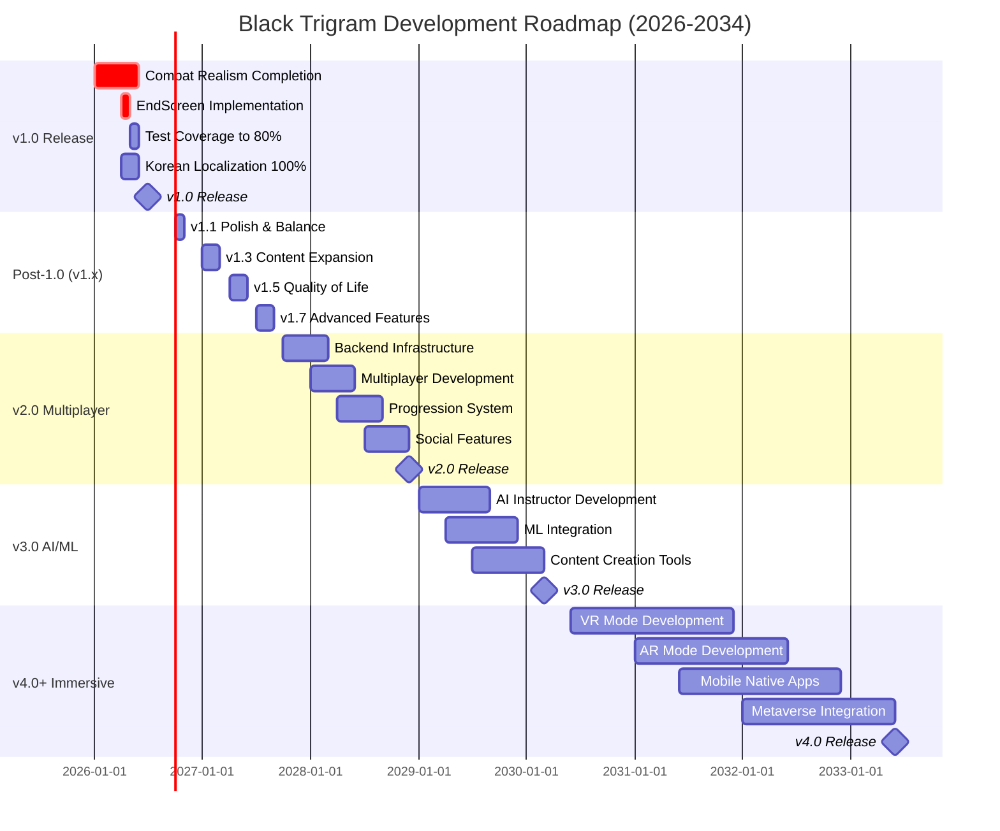

### 🎯 Feature Completion Timeline

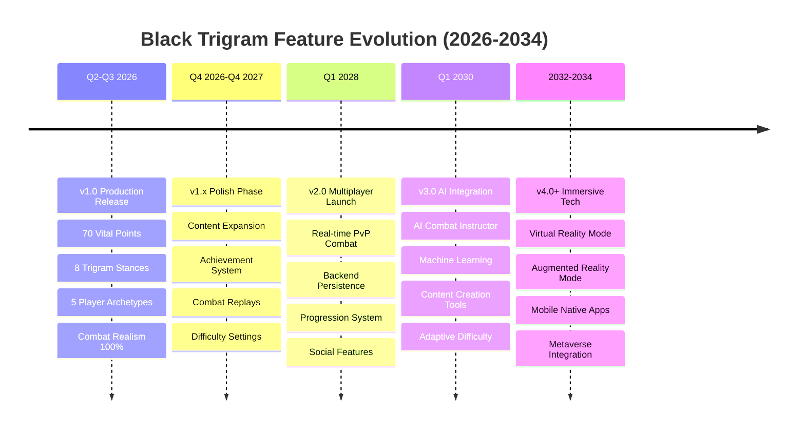

### 💰 Revenue Projection Chart

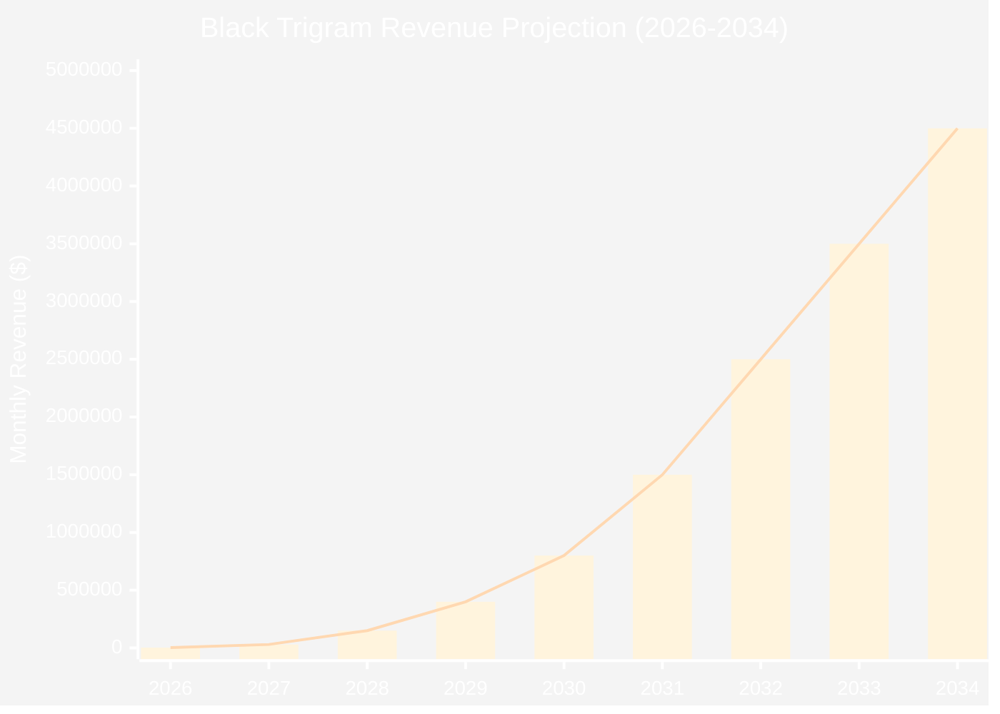

**Revenue Milestones:**
- **2026**: $3k/month (v1.0 launch with donations)
- **2027**: $30k/month (Patreon + cosmetics)
- **2028**: $150k/month (v2.0 premium subscriptions)
- **2029**: $400k/month (Growing subscriber base)
- **2030**: $800k/month (v3.0 B2B licensing starts)
- **2031**: $1.5M/month (Educational licenses expand)
- **2032**: $2.5M/month (VR/AR app sales)
- **2033**: $3.5M/month (Enterprise + consumer growth)
- **2034**: $4.5M/month (Market leadership achieved)

### 🌍 User Base Growth Projection

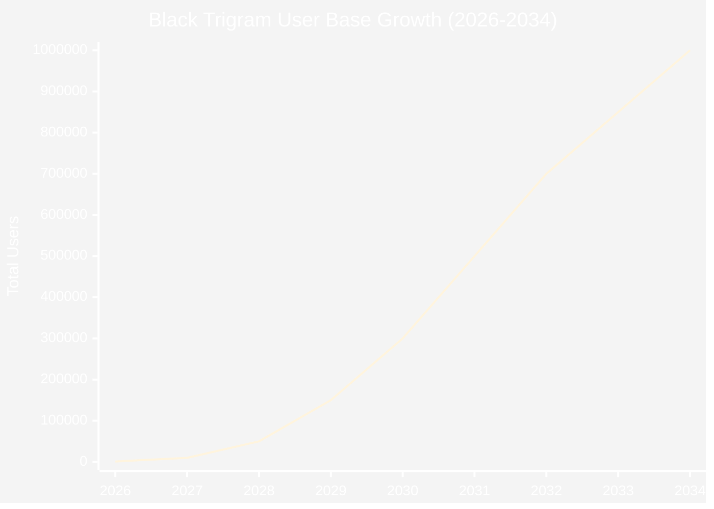

**User Growth Milestones:**
- **2026**: 1,000 users (v1.0 early adopters)
- **2027**: 10,000 users (Organic growth + community)
- **2028**: 50,000 users (v2.0 multiplayer attracts gamers)
- **2029**: 150,000 users (Esports community adoption)
- **2030**: 300,000 users (v3.0 AI features + educational market)
- **2031**: 500,000 users (B2B expansion)
- **2032**: 700,000 users (VR/AR early adopters)
- **2033**: 850,000 users (Metaverse integration)
- **2034**: 1,000,000+ users (Market leadership)

---

### ⚠️ Risk Assessment & Mitigation Strategies

#### Technical Risks (2026-2034)

| Risk | Probability | Impact | Timeline | Mitigation Strategy |
|------|-------------|--------|----------|---------------------|
| **WebGL/Three.js Breaking Changes** | Medium | High | 2026-2034 | • Version pinning and careful upgrades • Automated regression testing • Maintain backwards compatibility • Follow Three.js release notes closely |
| **Browser API Deprecations** | Medium | Medium | 2028-2032 | • Use progressive enhancement • Polyfills for older browsers • Feature detection and fallbacks • Monitor browser vendor roadmaps |
| **Performance Degradation** | High | High | 2026-2028 | • Continuous performance monitoring • Three.js optimization (instancing, LOD) • WebAssembly for compute-heavy tasks • Regular profiling and benchmarking |
| **WebGPU Migration Complexity** | Medium | Medium | 2028-2030 | • Plan gradual migration path • Maintain WebGL fallback • Early prototyping and testing • Wait for browser support maturity |
| **Mobile Performance Issues** | High | High | 2026-2027 | • Adaptive quality settings • Reduced polygon counts for mobile • Touch control optimization • Extensive mobile device testing |
| **VR/AR Technical Challenges** | High | Medium | 2030-2034 | • Partner with VR/AR experts • Early WebXR prototyping • Native builds if WebXR insufficient • Hire VR/AR specialized developers |
| **Multiplayer Latency** | Medium | High | 2028-2029 | • WebRTC for peer-to-peer • Rollback netcode implementation • Regional server deployment • Lag compensation algorithms |
| **AI/ML Model Performance** | Medium | Medium | 2029-2030 | • Cloud-based training, edge inference • Model quantization and optimization • Progressive loading of ML models • Fallback to non-AI modes |

#### Business & Market Risks

| Risk | Probability | Impact | Timeline | Mitigation Strategy |
|------|-------------|--------|----------|---------------------|
| **Slow User Adoption** | Medium | High | 2026-2027 | • Community building from day 1 • Organic marketing via social media • Partnerships with martial arts schools • Content creator collaborations |
| **Funding Challenges** | Medium | High | 2027-2028 | • Multiple funding paths (crowdfunding, angels, VCs) • Revenue-based financing options • Bootstrap as long as possible • Prepare detailed pitch decks |
| **Competitive Pressure** | Medium | Medium | 2028-2030 | • Focus on unique value (vital points, Korean culture) • First-mover advantage in niche • Build strong community moat • Continuous innovation |
| **Cultural Misrepresentation** | Low | Critical | 2026-2034 | • Hire Korean cultural consultants • Work with traditional martial arts masters • Community feedback loops • Sensitivity reviews for all content |
| **Educational Market Entry** | High | Medium | 2029-2031 | • Build relationships early • Create pilot programs • Research-backed effectiveness studies • Accreditation partnerships |
| **Monetization Resistance** | Medium | Medium | 2028-2029 | • Start with generous free tier • Transparent pricing • Community input on pricing • No pay-to-win mechanics |
| **Team Scaling Challenges** | High | High | 2027-2030 | • Hire slowly and deliberately • Remote-first for global talent • Strong onboarding processes • Maintain culture through growth |
| **Technology Debt Accumulation** | High | Medium | 2026-2034 | • Regular refactoring sprints • Code quality metrics • Architectural reviews quarterly • Documentation as priority |

#### Operational & Legal Risks

| Risk | Probability | Impact | Timeline | Mitigation Strategy |
|------|-------------|--------|----------|---------------------|
| **CDN Outages** | Low | High | 2026-2034 | • Multi-CDN strategy (Cloudflare + AWS) • Asset mirroring across regions • Service workers for offline caching • Monitoring and auto-failover |
| **Security Vulnerabilities** | Medium | Critical | 2026-2034 | • Regular security audits • Automated vulnerability scanning • Bug bounty program (post-v1.0) • Follow OWASP best practices |
| **Legal & IP Issues** | Low | Medium | 2027-2034 | • Trademark registration • Patent portfolio for innovations • Clear terms of service and privacy policy • Legal review for all content |
| **GDPR & Data Privacy** | Medium | Medium | 2028-2034 | • Privacy-by-design architecture • GDPR compliance from day 1 • User data minimization • Clear consent mechanisms |
| **Content Moderation** | Medium | Medium | 2028-2034 | • Community guidelines • Automated content filtering • Human moderators for edge cases • User reporting system |
| **Server Costs Escalation** | High | Medium | 2028-2032 | • Cost monitoring and alerts • Auto-scaling with limits • Reserved instances for predictable load • Optimize infrastructure continuously |

### 🎯 Success Criteria & KPIs (2026-2034)

#### v1.0 Success Metrics (Q2-Q3 2026)
- **Quality**: 9.0/10 minimum overall rating
- **Performance**: 60fps desktop, 55fps+ mobile sustained
- **Testing**: 80%+ code coverage
- **Completion**: 100% combat realism systems (12/12)
- **Bugs**: Zero critical bugs at launch
- **Documentation**: Complete user manual and API docs

#### Post-1.0 Success Metrics (2026-2027)
- **User Growth**: 1,000 → 10,000 users (10x growth)
- **Retention**: 60%+ 30-day retention rate
- **Engagement**: 20+ minutes average session length
- **Community**: 5,000+ Discord members
- **Revenue**: $30k/month from Patreon + cosmetics
- **Rating**: 9.5/10 overall quality

#### v2.0 Success Metrics (2028)
- **User Growth**: 50,000+ total users
- **Subscribers**: 5,000-10,000 premium subscribers
- **Multiplayer**: 1,000+ concurrent players peak
- **Revenue**: $150k/month from subscriptions
- **Retention**: 70%+ 30-day retention
- **Rating**: 9.8/10 overall quality

#### v3.0 Success Metrics (2030)
- **User Growth**: 300,000+ total users
- **B2B Licenses**: 500-1,000 educational institutions
- **Revenue**: $800k/month (B2B + consumer)
- **AI Accuracy**: 85%+ technique correction accuracy
- **Engagement**: 45+ minutes average session length
- **Rating**: 10.0/10 overall quality

#### v4.0+ Success Metrics (2032-2034)
- **User Growth**: 1,000,000+ total users
- **VR/AR Adoption**: 100,000+ VR/AR users
- **Revenue**: $4.5M/month from all channels
- **Market Position**: Top 3 VR martial arts platforms
- **Enterprise**: 10,000-50,000 enterprise users
- **Rating**: Industry-leading platform

---

### 🏁 Conclusion: The Path to Black Trigram Leadership

Black Trigram's 8-year roadmap (2026-2034) represents an ambitious yet achievable vision for the future of authentic Korean martial arts simulation. Starting from a solid foundation with 70 vital points, 8 trigram stances, and 67% complete combat realism systems in Q1 2026, the project aims to establish itself as the industry leader in educational martial arts gaming by 2034.

#### Key Strategic Pillars

**1. Authentic Korean Martial Arts (2026-2027)**
- Establish niche as the only authentic 70 vital point simulator
- Build reputation for cultural accuracy (9.6/10 rating)
- Partner with traditional martial arts institutions
- Create educational value alongside entertainment

**2. Competitive Gaming & Multiplayer (2028-2029)**
- Transition from single-player to competitive multiplayer
- Build esports community around realistic combat
- Implement robust backend infrastructure
- Create sustainable subscription revenue model

**3. AI-Powered Education (2030-2031)**
- Position as educational technology platform
- Target schools, universities, and professional training
- Leverage AI/ML for personalized instruction
- Expand B2B revenue with institutional licensing

**4. Immersive Technology Leadership (2032-2034)**
- Lead VR/AR martial arts training market
- Integrate with metaverse platforms
- Launch mobile native apps for accessibility
- Achieve market dominance through technology innovation

#### Realistic Expectations & Contingencies

**Conservative Scenario** (50% probability):
- v1.0 launch: Q3 2026 (1 month delay)
- User base by 2027: 5,000 users (50% of target)
- v2.0 launch: Q2 2028 (3 months delay)
- Revenue by 2030: $400k/month (50% of target)
- Team size by 2030: 8-10 people (80% of target)
- **Outcome**: Sustainable niche product with loyal community

**Base Scenario** (40% probability):
- v1.0 launch: Q2 2026 (on time)
- User base by 2027: 10,000 users (target met)
- v2.0 launch: Q1 2028 (on time)
- Revenue by 2030: $800k/month (target met)
- Team size by 2030: 10-15 people (target met)
- **Outcome**: Growing education tech company with strong market position

**Optimistic Scenario** (10% probability):
- v1.0 launch: Q2 2026 (on time)
- User base by 2027: 20,000 users (2x target)
- v2.0 launch: Q4 2027 (early)
- Revenue by 2030: $1.5M/month (2x target)
- Team size by 2030: 20-25 people (2x target)
- **Outcome**: Major acquisition by Meta, Apple, or Microsoft for $50M-$100M+

#### Critical Success Factors

1. **Quality First**: Maintain 9.0+ rating throughout evolution
2. **Cultural Authenticity**: Never compromise on Korean martial arts accuracy
3. **Community-Driven**: Listen to and empower the community
4. **Iterative Development**: Ship early, gather feedback, improve continuously
5. **Performance Excellence**: 60fps is non-negotiable for combat games
6. **Educational Value**: Always prioritize learning alongside entertainment
7. **Technology Innovation**: Stay ahead with WebGPU, AI/ML, VR/AR
8. **Sustainable Growth**: Don't grow faster than can be managed

#### Final Thoughts

Black Trigram's journey from a solo developer project in 2026 to a potential market leader by 2034 is ambitious but grounded in realistic milestones and contingency planning. The focus on authentic Korean martial arts education creates a defensible moat against competitors, while the phased technology adoption (web → multiplayer → AI → immersive) allows for sustainable growth.

The key to success lies in maintaining quality, cultural authenticity, and community trust while gradually expanding features and markets. Whether the project achieves the conservative, base, or optimistic scenario, the roadmap provides clear direction and measurable milestones for the next 8 years.

**흑괘의 길을 걸어라** – _Walk the Path of the Black Trigram_

From humble beginnings to industry leadership, one vital point at a time.

---

## 🎯 Phase 1: Combat Foundation (Months 1-3)

### Architecture Goals

- Implement core vital point targeting system
- Develop realistic combat calculations
- Create interactive combat interface
- Establish audio-visual feedback loops

### System Context Evolution

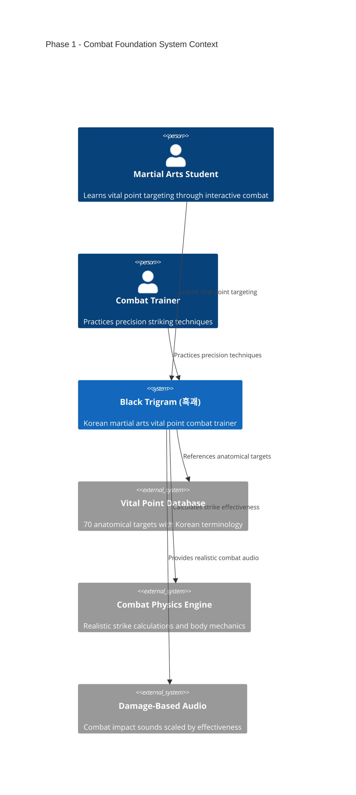

### New Components - Vital Point System

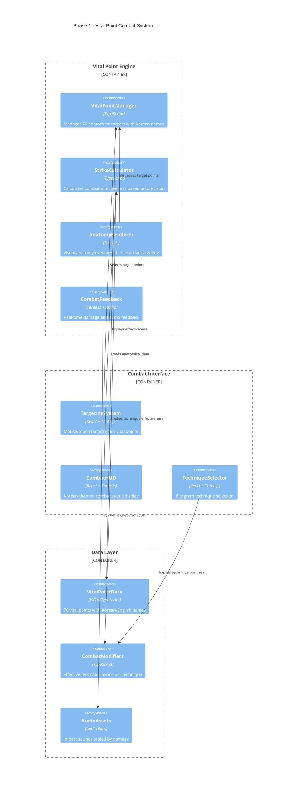

### Implementation Architecture

**Phase 1 - Core Vital Point System**:

**Vital Point Data Structure**:
- **Identification**: Unique ID with Korean, English, and romanized names
- **Location**: X/Y coordinates and body region classification
- **Effectiveness Metrics**: Difficulty rating (1-5), damage potential, stunning effect, incapacitation chance
- **Associated Techniques**: List of trigram techniques effective against this point
- **Anatomical Information**: Type (nerve/vessel/joint/pressure), medical description, safety warnings

**Combat Calculation System**:
- **Strike Accuracy**: Precision-based modifier (0-1 scale)
- **Technique Effectiveness**: Trigram stance modifier
- **Vital Point Multiplier**: Target-specific damage amplification
- **Final Damage**: Calculated combat result with all modifiers applied
- **Audio/Visual Effects**: Dynamic feedback based on strike effectiveness

---

## 🇰🇷 Phase 2: Korean Authenticity

### Architecture Goals

- Integrate traditional Korean martial arts terminology
- Implement I Ching trigram philosophy in combat
- Create authentic Korean dojang environment
- Develop cultural education components

### Cultural Integration Architecture

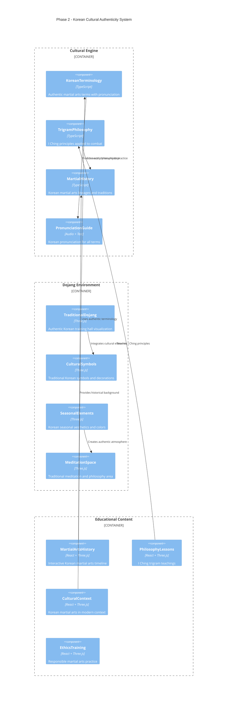

### Traditional Korean Elements

**Phase 2 - Korean Cultural Integration**:

**Korean Martial Art Data Model**:
- **Names**: Korean, English, and Hanja (Chinese characters) when applicable
- **Historical Context**: Time period, geographical region, founder (if known)
- **Core Principles**: Traditional martial arts philosophy and tenets
- **Traditional Techniques**: Authentic historical techniques and forms
- **Philosophy Integration**: Trigram alignment, mental aspects, spiritual elements

**Dojang Environment System**:
- **Layout**: Traditional Korean training hall design with proper spatial organization
- **Cultural Decorations**: Authentic Korean symbols, scrolls, and traditional elements
- **Lighting**: Traditional lighting styles with ambient occlusion for authenticity
- **Ambient Sounds**: Traditional Korean music, nature sounds, ceremonial audio
- **Seasonal Themes**: Korean seasonal aesthetics (Spring/Summer/Fall/Winter variations)

---

## ⚔️ Phase 3: Advanced Combat

### Architecture Goals

- Implement 5 distinct player archetypes
- Create realistic physics and body mechanics
- Develop advanced combat AI
- Build comprehensive damage system

### Player Archetype System

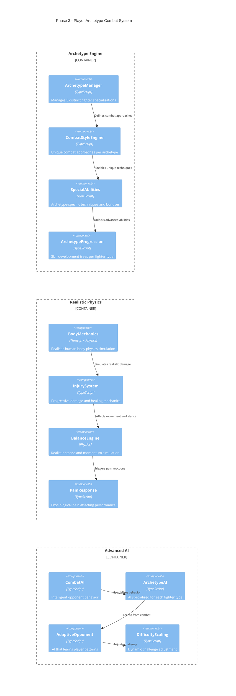

### Archetype Specializations

**Phase 3 - Player Archetype System**:

**Player Archetype Definition**:
- **Archetype ID**: One of five martial philosophies (musa, amsalja, hacker, jeongbo, jojik)
- **Names & Description**: Korean and English names with philosophical background
- **Combat Philosophy**: Unique approach to combat based on archetype's values
- **Preferred Trigrams**: Optimal stance alignments for each archetype
- **Specializations**: Unique techniques, combat bonuses, and special abilities
- **Progression System**: Skill tree with archetype-specific advancement paths
- **Background Story**: Historical and philosophical context for each archetype

**Realistic Injury System**:
- **Location**: Specific body part affected
- **Severity**: Graduated injury levels from minor to critical
- **Injury Type**: Classification (blunt trauma, joint damage, nerve strike, etc.)
- **Healing Time**: Recovery duration with progressive improvement
- **Functional Impact**: Movement and ability limitations during recovery
- **Visual Effects**: Bruising, swelling, and injury-appropriate visual feedback
- **Audio Feedback**: Pain responses and movement restriction sounds

---

## 🎓 Phase 4: Mastery System

### Architecture Goals

- Create comprehensive training and education system
- Implement AI-guided instruction
- Develop progress tracking and mastery validation
- Build community and sharing features

### Training & Education Architecture

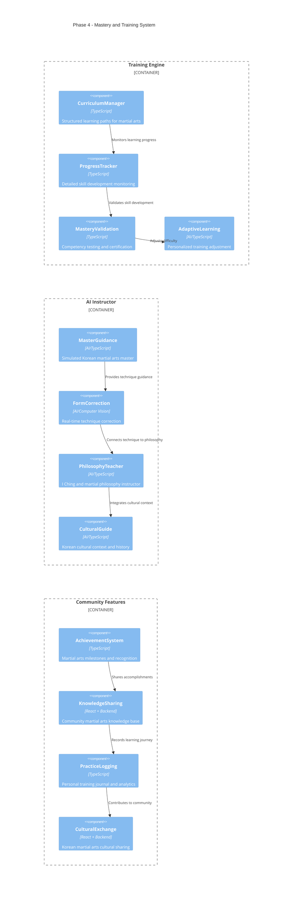

### Educational Progression System

**Phase 4 - Training and Mastery System**:

**Training Curriculum Structure**:
- **Learning Modules**: Structured lessons with progressive difficulty
- **Prerequisites**: Required knowledge before advancing to next module
- **Skill Assessments**: Competency tests validating mastery
- **Cultural Components**: Historical and philosophical lessons

**Learning Module Design**:
- **Identification**: Unique module ID with Korean and English names
- **Learning Objectives**: Clear goals for each training module
- **Lesson Content**: Instructional material with demonstrations
- **Practice Exercises**: Hands-on training scenarios and drills
- **Cultural Context**: Historical and philosophical background
- **Mastery Criteria**: Assessment standards for module completion

**AI Instructor System**:
- **Personality**: Distinct teaching persona with cultural authenticity
- **Expertise Areas**: Specialized knowledge in specific martial arts domains
- **Teaching Style**: Adaptive approach based on student learning patterns
- **Cultural Authenticity**: Ensures traditional knowledge is properly conveyed
- **Adaptive Capabilities**: Adjusts difficulty and pacing to student performance

---

## 🏗️ Implementation Strategy

### Development Phases Timeline

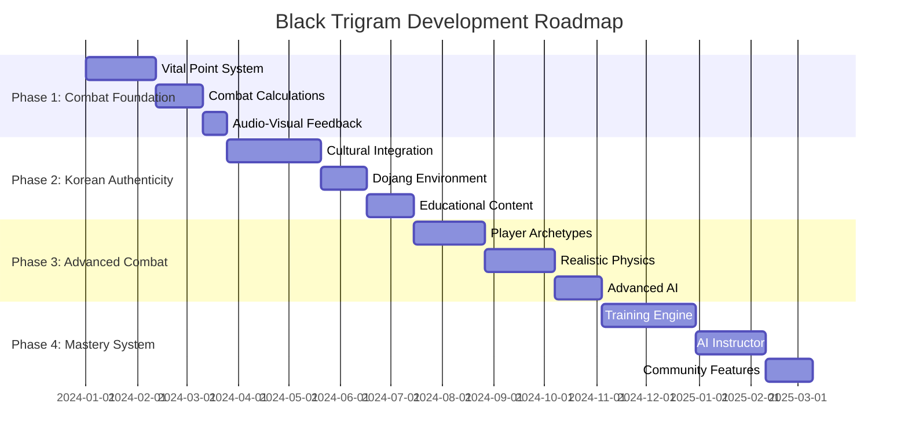

### Priority Implementation Order

#### High Priority (Phase 1)

1. **VitalPointManager** - Core targeting system
2. **StrikeCalculator** - Combat effectiveness engine
3. **AnatomyRenderer** - Visual targeting interface
4. **CombatFeedback** - Audio-visual damage system

#### Medium Priority (Phase 2)

5. **KoreanTerminology** - Cultural authenticity
6. **TrigramPhilosophy** - Traditional knowledge integration
7. **TraditionalDojang** - Authentic environment
8. **EducationalContent** - Cultural learning components

#### Future Priority (Phase 3-4)

9. **PlayerArchetypes** - 5 fighter specializations
10. **RealisticPhysics** - Advanced body mechanics
11. **AIInstructor** - Guided learning system
12. **CommunityFeatures** - Social learning platform

### Technical Migration Strategy

**Migration from Current to Future Architecture**:

**Current Technology Stack**:
- React 19.x with modern hooks and concurrent features
- Three.js via @react-three/fiber + @react-three/drei for 3D rendering
- TypeScript with strict mode for type safety
- Howler.js for audio management
- Vitest + Cypress for comprehensive testing

**Future Technology Additions**:
- **Vital Point Engine**: Custom TypeScript engine for anatomical targeting
- **Combat Physics**: Matter.js integration with custom physics calculations
- **AI System**: TensorFlow.js for intelligent opponent behavior and training
- **Cultural Data**: JSON-based i18n system for bilingual content management
- **Community Backend**: Express + MongoDB for social features and leaderboards

**Migration Approach**: Progressive enhancement with backward compatibility at each phase

---

## 🎯 Success Metrics & KPIs

### Technical Metrics

| Metric            | Current | Phase 1 Target | Phase 4 Target  |
| ----------------- | ------- | -------------- | --------------- |
| **Performance**   | 60fps   | 60fps steady   | 60fps + physics |
| **Code Coverage** | Basic   | 90%+           | 95%+            |
| **Load Time**     | <3s     | <3s            | <5s             |
| **Memory Usage**  | <100MB  | <150MB         | <200MB          |

### Educational Metrics

| Learning Outcome           | Phase 1    | Phase 2    | Phase 3        | Phase 4    |
| -------------------------- | ---------- | ---------- | -------------- | ---------- |
| **Vital Point Knowledge**  | 20 points  | 70 points  | Mastery        | Teaching   |
| **Korean Terms**           | Basic      | 50 terms   | 200 terms      | Fluent     |
| **Combat Techniques**      | 3 trigrams | 8 trigrams | All archetypes | Innovation |
| **Cultural Understanding** | None       | Basic      | Intermediate   | Advanced   |

### User Engagement Metrics

| Feature                  | Phase 1 | Phase 2 | Phase 3  | Phase 4 |
| ------------------------ | ------- | ------- | -------- | ------- |
| **Session Length**       | 10 min  | 20 min  | 45 min   | 90 min  |
| **Return Rate**          | 30%     | 60%     | 80%      | 90%     |
| **Skill Progression**    | Linear  | Guided  | Adaptive | Mastery |
| **Community Engagement** | None    | None    | Basic    | Active  |

---

## 🚨 Risk Assessment & Mitigation

### Technical Risks

| Risk                        | Probability | Impact   | Mitigation Strategy                   |
| --------------------------- | ----------- | -------- | ------------------------------------- |
| **Performance Degradation** | Medium      | High     | Incremental optimization, physics LOD |
| **Cultural Inaccuracy**     | High        | Critical | Native Korean consultant validation   |
| **Complexity Overload**     | High        | Medium   | Phased implementation, MVP approach   |
| **Browser Compatibility**   | Low         | Medium   | Progressive enhancement, fallbacks    |

### Cultural Risks

| Risk                      | Probability | Impact   | Mitigation Strategy         |
| ------------------------- | ----------- | -------- | --------------------------- |
| **Misrepresentation**     | Medium      | Critical | Cultural advisory board     |
| **Inappropriate Content** | Low         | Critical | Educational focus, warnings |
| **Oversimplification**    | High        | Medium   | Depth over breadth approach |

---

## 🎓 Educational Standards

### Learning Objectives

#### Phase 1: Foundation Knowledge

- Identify 20 primary vital points with Korean names
- Understand basic strike effectiveness calculations
- Recognize audio-visual combat feedback cues
- Practice precision targeting techniques

#### Phase 2: Cultural Integration

- Pronounce 50 Korean martial arts terms correctly
- Understand I Ching trigram principles in combat
- Recognize traditional Korean dojang elements
- Appreciate Korean martial arts philosophy

#### Phase 3: Advanced Application

- Master all 5 player archetype specializations
- Apply realistic physics in combat scenarios
- Adapt to AI opponent behavioral patterns
- Demonstrate ethical combat knowledge

#### Phase 4: Teaching and Mastery

- Teach vital point locations to other students
- Guide cultural understanding and respect
- Create personal training curricula
- Contribute to martial arts knowledge community

---

## 🔮 Future Vision (Beyond Phase 4)

### Long-term Architecture Evolution

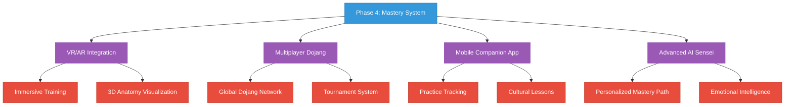

### Ultimate Goals

- **Global Korean Martial Arts Education Platform**
- **VR/AR Immersive Training Environments**
- **AI-Powered Personal Martial Arts Masters**
- **International Cultural Exchange Network**
- **Advanced Biomechanical Research Integration**
- **Professional Training Certification System**

---

## 📋 Implementation Checklist

### Phase 1: Combat Foundation ✅

- [ ] VitalPointManager implementation
- [ ] StrikeCalculator combat engine
- [ ] AnatomyRenderer visual system
- [ ] CombatFeedback audio-visual
- [ ] Interactive targeting interface
- [ ] Korean terminology integration
- [ ] Audio scaling by damage
- [ ] Performance optimization

### Phase 2: Korean Authenticity 📋

- [ ] Cultural terminology system
- [ ] I Ching trigram philosophy
- [ ] Traditional dojang environment
- [ ] Korean pronunciation guide
- [ ] Educational content modules
- [ ] Cultural validation review
- [ ] Seasonal aesthetic themes
- [ ] Meditation space integration

### Phase 3: Advanced Combat 📋

- [ ] 5 player archetype system
- [ ] Realistic body physics
- [ ] Progressive injury system
- [ ] Advanced combat AI
- [ ] Archetype specializations
- [ ] Difficulty scaling system
- [ ] Mastery progression trees
- [ ] Combat ethics training

### Phase 4: Mastery System 📋

- [ ] AI instructor implementation
- [ ] Adaptive learning engine
- [ ] Progress tracking system
- [ ] Community features
- [ ] Achievement system
- [ ] Cultural exchange platform
- [ ] Personal training journal
- [ ] Mastery certification

---

## 🥋 Architecture Evolution Summary

**From Foundation to Mastery: Building the Ultimate Korean Martial Arts Experience**

| Current State     | →   | Future Vision                 |
| ----------------- | --- | ----------------------------- |
| Empty Components  | →   | Rich Interactive Systems      |
| Basic Audio       | →   | Immersive Combat Feedback     |
| Simple UI         | →   | Cultural Learning Platform    |
| No Combat Logic   | →   | Realistic Combat Simulation   |
| Testing Framework | →   | Comprehensive Validation      |
| Korean Fonts      | →   | Complete Cultural Integration |

### 🎯 **"어둠에서 빛으로, 기초에서 완성으로"**

### _"From darkness to light, from foundation to mastery"_

