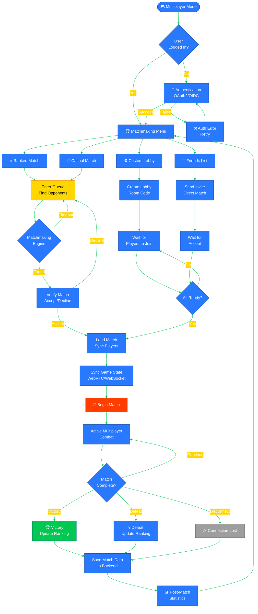
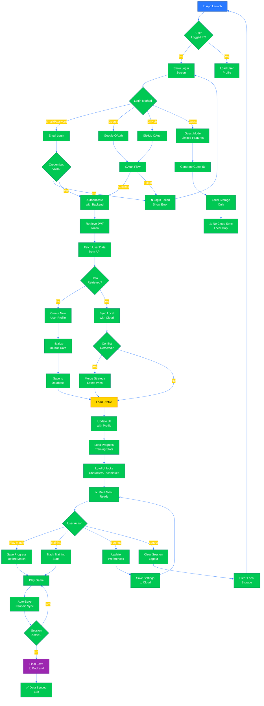
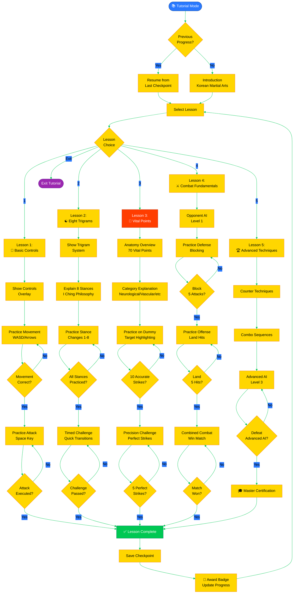
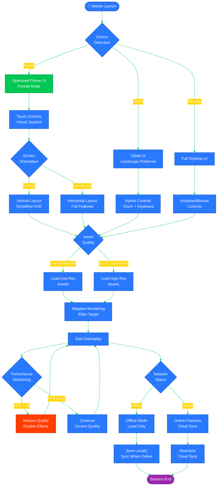

# 🔮 Black Trigram (흑괘) Future Flowcharts

## 📚 Related Documentation

| Document                                      | Focus            | Description                                    |
| --------------------------------------------- | ---------------- | ---------------------------------------------- |
| [Current Flowchart](FLOWCHART.md)             | 🔄 Current Flow  | Current game flows and processes               |
| [Future Architecture](FUTURE_ARCHITECTURE.md) | 🚀 Future Vision | Planned architectural enhancements             |
| [Future State Diagram](FUTURE_STATEDIAGRAM.md)| 🎮 Future States | Planned state machine enhancements             |
| [Future SWOT](FUTURE_SWOT.md)                 | 📊 Strategy      | Strategic analysis for future phases           |
| [Future Mindmap](FUTURE_MINDMAP.md)           | 🧠 Roadmap       | Technology evolution planning                  |

---

## 🎯 Overview

This document outlines planned workflow enhancements for Black Trigram (흑괘), documenting future user flows, multiplayer interactions, backend integration, and advanced features that will evolve the educational Korean martial arts combat simulator.

---

## 🌐 Future Multiplayer Flow

### **Online Matchmaking Flow**

---

## 💾 Backend Integration Flow

### **User Account & Progression Flow**

---

## 🎓 Advanced Tutorial Flow

### **Interactive Tutorial System**

---

## 📱 Mobile Optimization Flow

### **Responsive Mobile UX Flow**

---

## 🤖 AI Training Partner Flow

### **Adaptive AI Opponent System**

```mermaid
%%{init: {'theme':'base', 'themeVariables': {'primaryColor':'#00C853','primaryTextColor':'#fff','primaryBorderColor':'#00796B','lineColor':'#FF3D00','secondaryColor':'#FFD600','tertiaryColor':'#2979FF'}}}%%
flowchart LR
    A[🤖 AI Opponent] --> B{Difficulty<br/>Level}
    
    B -->|Easy| C[Beginner AI<br/>Slow Reactions]
    B -->|Medium| D[Intermediate AI<br/>Balanced]
    B -->|Hard| E[Advanced AI<br/>Fast & Precise]
    B -->|Adaptive| F[Learning AI<br/>Skill Matching]
    
    C --> G[Simple Patterns<br/>Predictable]
    D --> H[Mixed Patterns<br/>Some Variation]
    E --> I[Complex Patterns<br/>Unpredictable]
    F --> J[Analyze Player<br/>Skill Level]
    
    J --> K{Player<br/>Performance}
    
    K -->|Winning Easily| L[Increase<br/>Difficulty]
    K -->|Balanced Match| M[Maintain<br/>Level]
    K -->|Losing Often| N[Decrease<br/>Difficulty]
    
    L --> O[Adjust AI<br/>Parameters]
    M --> O
    N --> O
    
    G --> P[Execute<br/>AI Actions]
    H --> P
    I --> P
    O --> P
    
    P --> Q{Combat<br/>Round}
    
    Q -->|Attack| R[Select<br/>Technique]
    Q -->|Defend| S[Block/Dodge<br/>Decision]
    Q -->|Stance| T[Optimal<br/>Stance]
    
    R --> U[Calculate<br/>Precision]
    S --> V[Timing<br/>Perfect Block?]
    T --> W[Transition<br/>Speed]
    
    U --> X[Execute<br/>Action]
    V --> X
    W --> X
    
    X --> Y[Learn from<br/>Outcome]
    
    Y --> Z{Store<br/>Patterns}
    
    Z --> AA[Update AI<br/>Model]
    AA --> AB[Improve<br/>Strategies]
    AB --> F
    
    style A fill:#2979FF,stroke:#0D47A1,color:#fff
    style F fill:#00C853,stroke:#00796B,color:#fff
    style AA fill:#FFD600,stroke:#F57F17,color:#000
    style AB fill:#9C27B0,stroke:#6A1B9A,color:#fff
```

---

**흑괘의 길을 걸어라** - _Walk the Path of the Black Trigram into the Future_

These future flowcharts document planned enhancements to Black Trigram, including multiplayer matchmaking, backend integration, advanced tutorials, mobile optimization, and adaptive AI opponents, evolving the authentic Korean martial arts combat simulator for global accessibility and continuous learning.
