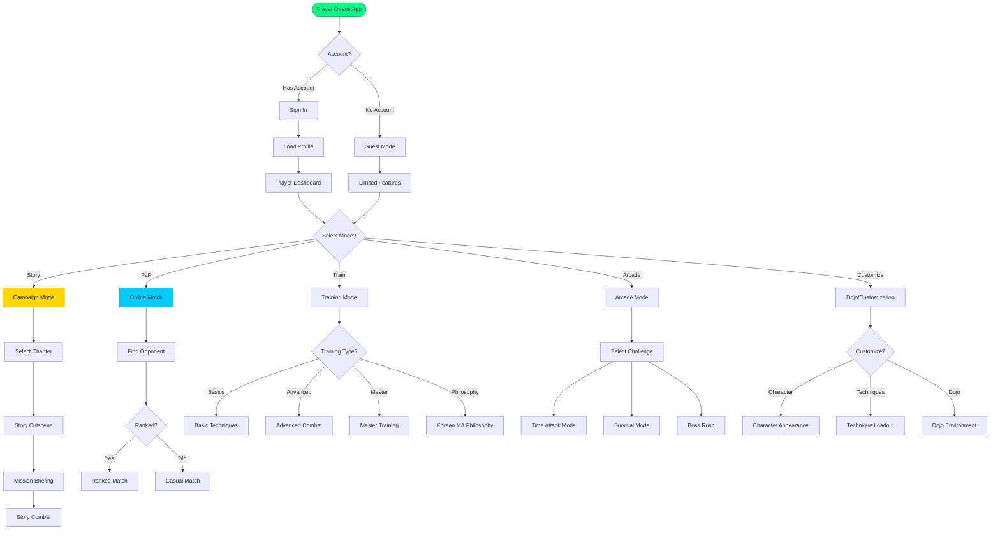
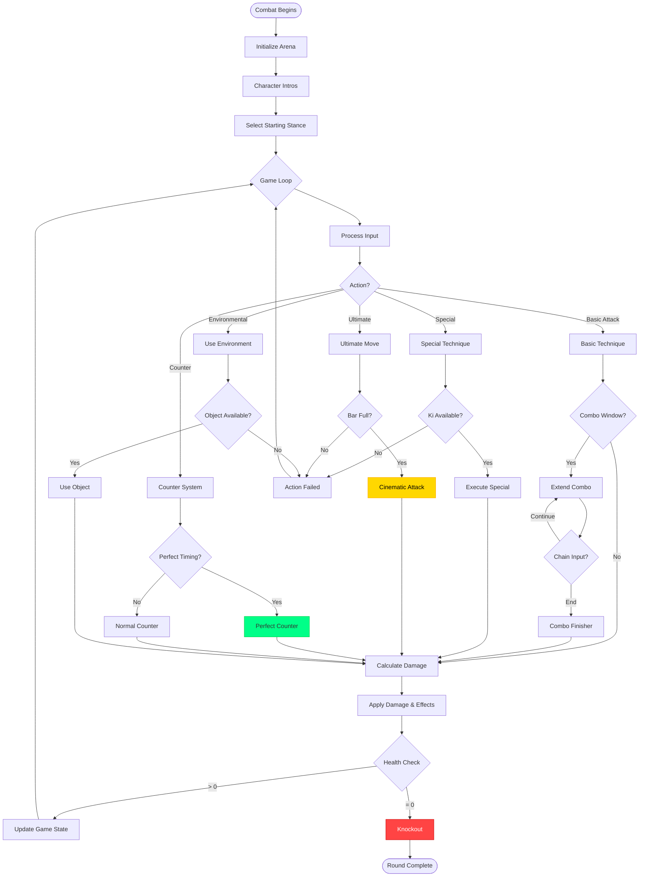
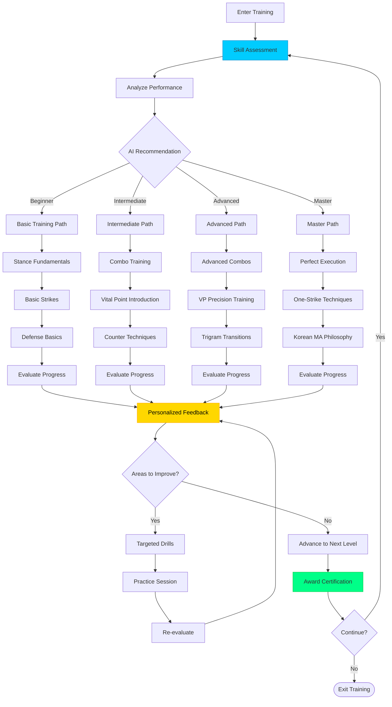
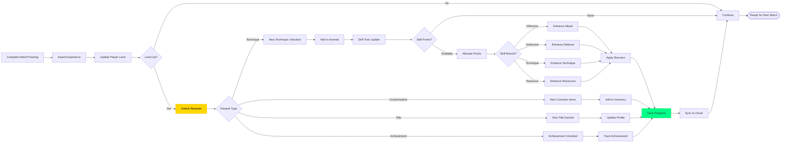
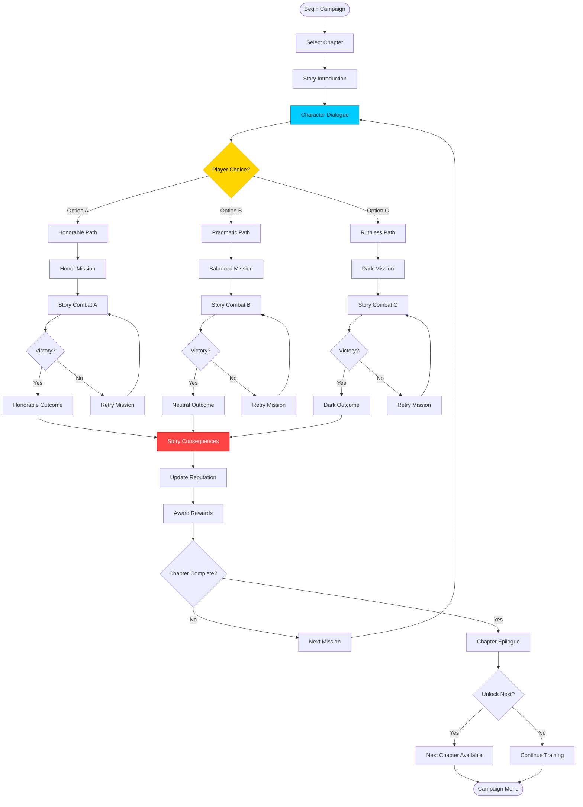
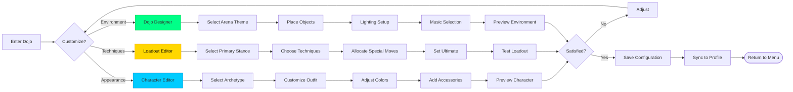

# 🚀 Black Trigram (흑괘) — Future Flowcharts

This document outlines enhanced workflow visions and future process flows for the Black Trigram Korean martial arts combat simulator evolution roadmap.

## 📚 Related Documentation

| Document | Focus | Description |
|----------|-------|-------------|
| [FLOWCHART](FLOWCHART.md) | 🔄 Current | Current system flows |
| [FUTURE_ARCHITECTURE](FUTURE_ARCHITECTURE.md) | 🏛️ Future | Evolutionary architecture vision |
| [FUTURE_STATEDIAGRAM](FUTURE_STATEDIAGRAM.md) | 🎯 Future States | Advanced state transitions |
| [FUTURE_MINDMAP](FUTURE_MINDMAP.md) | 🧠 Roadmap | Technology evolution plan |

---

## 🎯 Enhanced User Journey (Future)

### **Multi-Mode Player Experience**

---

## ⚔️ Advanced Combat Flow (Future)

### **Enhanced Combat System**

---

## 🌐 Online Multiplayer Flow (Future)

### **Matchmaking & Online Combat**

```mermaid
flowchart LR
    A[Select Multiplayer] --> B{Mode?}
    B -->|Ranked| C[Ranked Queue]
    B -->|Casual| D[Casual Queue]
    B -->|Friend| E[Friend Match]
    
    C --> F[Calculate MMR]
    D --> G[Any Opponent]
    E --> H[Invite Friend]
    
    F --> I[Matchmaking]
    G --> I
    H --> J[Wait for Accept]
    
    J -->|Accepted| K[Create Match]
    J -->|Declined| A
    
    I --> L{Match Found?}
    L -->|Yes| K
    L -->|Timeout| M[Expand Search]
    
    M --> I
    
    K --> N[Load Arena]
    N --> O[Sync Players]
    O --> P[Start Combat]
    
    P --> Q[Online Combat Loop]
    Q --> R{Match End?}
    R -->|No| Q
    R -->|Yes| S[Calculate Results]
    
    S --> T{Ranked?}
    T -->|Yes| U[Update MMR]
    T -->|No| V[Record Stats]
    
    U --> W[Show Rewards]
    V --> W
    
    W --> X{Rematch?}
    X -->|Yes| K
    X -->|No| Y([Return to Menu])
    
    style I fill:#00ccff,stroke:#0088cc
    style Q fill:#ffd700,stroke:#ffaa00,color:#000
    style U fill:#00ff88,stroke:#00cc44
```

---

## 🎓 Enhanced Training System (Future)

### **Adaptive Learning System**

---

## 🏆 Progression System Flow (Future)

### **Character & Skill Progression**

---

## 🎬 Story Campaign Flow (Future)

### **Narrative-Driven Combat**

---

## 🎨 Customization Flow (Future)

### **Character & Dojo Customization**

---

**📋 Document Control:**  
**✅ Approved by:** CEO  
**📤 Distribution:** Public  
**🏷️ Classification:** Public  
**📅 Effective Date:** 2025-11-14  
**⏰ Next Review:** 2026-11-14  
**🎯 Compliance:** ISO 27001 (A.8.9), NIST CSF (PR.IP-1)
