# 🔮 Black Trigram (흑괘) Future Flowcharts

**🔐 ISMS Alignment:** This document follows [Hack23 Secure Development Policy](https://github.com/Hack23/ISMS-PUBLIC/blob/main/Secure_Development_Policy.md) architecture documentation requirements.

## 📚 Related Documentation

| Document                                      | Focus            | Description                                    |
| --------------------------------------------- | ---------------- | ---------------------------------------------- |
| [Current Flowchart](FLOWCHART.md)             | 🔄 Current Flow  | Current game flows and processes               |
| [Future Architecture](FUTURE_ARCHITECTURE.md) | 🚀 Future Vision | Planned architectural enhancements             |
| [Future State Diagram](FUTURE_STATEDIAGRAM.md)| 🎮 Future States | Planned state machine enhancements             |
| [Future SWOT](FUTURE_SWOT.md)                 | 📊 Strategy      | Strategic analysis for future phases           |
| [Future Mindmap](FUTURE_MINDMAP.md)           | 🧠 Roadmap       | Technology evolution planning                  |

---

## 🎯 Overview

This document outlines planned workflow enhancements for Black Trigram (흑괘), documenting future user flows, multiplayer interactions, AWS backend integration, and advanced features that will evolve the educational Korean martial arts combat simulator.

---

## 💾 Backend Integration Flow

### **AWS Authentication & User Management Flow**

> **🔒 Security Note**: This flow uses HttpOnly Secure cookies with SameSite=Strict for token storage instead of localStorage/sessionStorage. This prevents XSS attacks from accessing authentication tokens, as HttpOnly cookies are not accessible to JavaScript. The backend manages token refresh and validation through secure cookie-based sessions.

```mermaid
%%{init: {'theme':'base', 'themeVariables': {'primaryColor':'#00C853','primaryTextColor':'#fff','primaryBorderColor':'#00796B','lineColor':'#2979FF','secondaryColor':'#FFD600','tertiaryColor':'#FF3D00'}}}%%
flowchart TD
    A[🚀 App Launch] --> B{User<br/>Session Exists?<br/>HttpOnly Cookie}
    
    B -->|No| C[Show Login<br/>Screen<br/>흑괘 Logo]
    B -->|Yes| D[Validate Session<br/>Backend Endpoint<br/>/api/auth/verify]
    
    D -->|Valid| LoadProfile[Load User Profile<br/>DynamoDB Query]
    D -->|Expired| C
    
    C --> E{Login Method<br/>Choice}
    
    E -->|Email/Password| F[Email Login<br/>Cognito User Pool]
    E -->|Google| G[Google OAuth<br/>Cognito Identity]
    E -->|Facebook| H[Facebook OAuth<br/>Social Provider]
    E -->|Discord| I[Discord OAuth<br/>Gaming Platform]
    E -->|GitHub| J[GitHub OAuth<br/>Developer Auth]
    E -->|Guest| K[Guest Mode<br/>Anonymous ID<br/>Limited Features]
    
    F --> L{Credentials<br/>Valid?<br/>Cognito Check}
    G --> M[OAuth Flow<br/>Redirect URI<br/>Authorization Code]
    H --> M
    I --> M
    J --> M
    K --> N[Generate Guest ID<br/>UUID v4]
    
    L -->|No| O[❌ Login Failed<br/>Show Error<br/>Retry Option]
    L -->|Yes| P[Authenticate<br/>with Cognito<br/>Get Access Token]
    
    M -->|Success| P
    M -->|Failed| O
    
    O --> C
    N --> Q[Session Storage<br/>Only Mode<br/>No Cloud Sync<br/>Temporary State]
    
    P --> R[Set HttpOnly Cookie<br/>Secure Flag<br/>SameSite=Strict<br/>Session Token Only]
    
    R --> S[API Gateway Request<br/>/api/user/profile<br/>Cookie: session_token]
    
    S --> Lambda1[Lambda Function<br/>getUserProfile<br/>Node.js 25]
    
    Lambda1 --> T{User Exists?<br/>DynamoDB Query}
    
    T -->|No| U[Create New User<br/>POST /api/user<br/>Lambda: createUser]
    T -->|Yes| V[Fetch User Data<br/>DynamoDB GetItem<br/>GSI Queries]
    
    U --> W[Initialize Profile<br/>Default Archetype: 무사<br/>Stance: 건 Heaven<br/>VP Progress: 0/70]
    
    W --> X[Save to DynamoDB<br/>PutItem<br/>users table]
    
    V --> Y{Conflict<br/>Detected?<br/>Version Check}
    
    Y -->|Yes| Z[Merge Strategy<br/>Latest Timestamp Wins<br/>Conflict Resolution]
    Y -->|No| AA[Load Profile Data<br/>Parse JSON]
    
    Z --> AA
    X --> AA
    
    AA --> AB[Update Local State<br/>Zustand Store<br/>React Context]
    
    AB --> AC[Load Progress<br/>Training Stats<br/>Match History<br/>Achievements]
    
    AC --> AD[Load Unlocks<br/>Characters<br/>Techniques<br/>Cosmetics]
    
    AD --> AE[S3 Asset Check<br/>Custom Skins<br/>Profile Images]
    
    AE --> AF[📊 Main Menu<br/>Ready to Play<br/>Online Status: 🟢]
    
    Q --> AG[⚠️ Offline Mode<br/>Local Only<br/>No Leaderboards]
    
    AG --> AF
    
    AF --> AH{User Action}
    
    AH -->|Play Match| AI[Auto-Save State<br/>API Gateway<br/>Lambda: saveProgress]
    AH -->|Training| AJ[Track Stats<br/>Local + Cloud<br/>WebSocket Updates]
    AH -->|Settings| AK[Update Preferences<br/>PUT /api/user/settings]
    AH -->|Logout| AL[Clear Session<br/>Revoke Tokens<br/>Cognito SignOut]
    
    AI --> AM[Play Game<br/>Combat Active]
    AJ --> AM
    AK --> AN[Save Settings<br/>DynamoDB Update<br/>S3 Backup]
    
    AM --> AO[Periodic Auto-Save<br/>Every 30s<br/>Lambda: syncProgress]
    
    AO --> AP{Session<br/>Active?}
    
    AP -->|Yes| AM
    AP -->|No| AQ[Final Save<br/>Lambda: finalizeSession<br/>DynamoDB BatchWrite]
    
    AN --> AF
    AL --> AR[Clear Local<br/>Storage<br/>IndexedDB]
    AR --> A
    
    AQ --> AS[CloudWatch Logs<br/>Session Metrics<br/>Performance Data]
    
    AS --> AT[✅ Data Synced<br/>Session Complete<br/>Exit Safe]

    style A fill:#2979FF,stroke:#0D47A1,color:#fff
    style P fill:#00C853,stroke:#00796B,color:#fff
    style AA fill:#FFD600,stroke:#F57F17,color:#000
    style AQ fill:#9C27B0,stroke:#6A1B9A,color:#fff
```



---

## 💳 Payment Processing Flow

### **Stripe Integration for Cosmetics & Content**

```mermaid
%%{init: {'theme':'base', 'themeVariables': {'primaryColor':'#FFD600','primaryTextColor':'#000','primaryBorderColor':'#F57F17','lineColor':'#00C853','secondaryColor':'#2979FF','tertiaryColor':'#FF3D00'}}}%%
flowchart TD
    Start([🛒 User Browsing Shop]) --> Browse[Browse Items<br/>Cosmetics<br/>Battle Pass<br/>DLC Packs]
    
    Browse --> Select{Item<br/>Selected}
    
    Select -->|Cosmetic Skin| Cosmetic[Character Skin<br/>₩5,000-₩15,000]
    Select -->|Battle Pass| BattlePass[Season Pass<br/>₩9,900 / 90 days]
    Select -->|DLC Pack| DLC[Content Pack<br/>₩19,900-₩49,900]
    Select -->|Back| Browse
    
    Cosmetic --> CheckOwnership{Already<br/>Owned?<br/>DynamoDB Check}
    BattlePass --> CheckOwnership
    DLC --> CheckOwnership
    
    CheckOwnership -->|Yes| AlreadyOwned[⚠️ Already Owned<br/>Cannot Purchase]
    CheckOwnership -->|No| ShowPrice[Show Price<br/>KRW / USD<br/>Payment Options]
    
    AlreadyOwned --> Browse
    
    ShowPrice --> Checkout[Proceed to<br/>Checkout]
    
    Checkout --> CreateSession[API Gateway<br/>POST /api/payment/create<br/>Lambda: createCheckout]
    
    CreateSession --> StripeSession[Stripe API<br/>Create Checkout Session<br/>Payment Intent]
    
    StripeSession --> StripeURL[Redirect to Stripe<br/>Secure Payment Page<br/>stripe.com/pay/...]
    
    StripeURL --> CustomerPays{Customer<br/>Completes<br/>Payment?}
    
    CustomerPays -->|Cancel| Cancelled[❌ Payment Cancelled<br/>Return to Shop]
    CustomerPays -->|Success| StripeWebhook[Stripe Webhook<br/>POST /api/webhook/stripe<br/>Event: checkout.session.completed]
    
    Cancelled --> Browse
    
    StripeWebhook --> VerifySignature[Verify Webhook<br/>Signature<br/>HMAC-SHA256]
    
    VerifySignature --> CheckIdempotency[Check Event ID<br/>DynamoDB Query<br/>processed_events table]
    
    CheckIdempotency --> AlreadyProcessed{Event<br/>Already<br/>Processed?}
    
    AlreadyProcessed -->|Yes| SkipProcessing[Skip Processing<br/>Return 200 OK<br/>Idempotent Response]
    AlreadyProcessed -->|No| ValidSignature{Signature<br/>Valid?}
    
    ValidSignature -->|No| RejectWebhook[❌ Reject Webhook<br/>Log Security Event<br/>CloudWatch Alert]
    ValidSignature -->|Yes| ParseEvent[Parse Event Data<br/>Extract customer_id<br/>line_items<br/>payment_status]
    
    SkipProcessing --> End([Process Complete])
    
    RejectWebhook --> End([Process Complete])
    
    ParseEvent --> CheckPaymentStatus{Payment<br/>Status?}
    
    CheckPaymentStatus -->|Succeeded| ProcessPurchase[Lambda: processPurchase<br/>Grant Items<br/>Update DynamoDB]
    CheckPaymentStatus -->|Failed| LogFailure[Log Payment Failure<br/>SNS Notification<br/>Customer Support]
    CheckPaymentStatus -->|Pending| WaitConfirmation[Wait for<br/>Confirmation<br/>Async Processing]
    
    ProcessPurchase --> UpdateInventory[DynamoDB Update<br/>users/{userId}/inventory<br/>Add purchased items]
    
    UpdateInventory --> BackupS3[S3 Backup<br/>Purchase Receipt<br/>JSON + Metadata]
    
    BackupS3 --> NotifyUser[SNS Notification<br/>Email: Purchase Confirmed<br/>In-game notification]
    
    NotifyUser --> WebSocketUpdate[WebSocket Broadcast<br/>Real-time inventory update<br/>Client receives new items]
    
    WebSocketUpdate --> Success[✅ Purchase Complete<br/>Items Granted<br/>Receipt Sent]
    
    Success --> End
    LogFailure --> End
    WaitConfirmation --> End
    
    style Start fill:#2979FF,stroke:#0D47A1,color:#fff
    style StripeWebhook fill:#FF3D00,stroke:#BF360C,color:#fff
    style Success fill:#00C853,stroke:#00796B,color:#fff
    style End fill:#9C27B0,stroke:#6A1B9A,color:#fff
```

---

## 🎮 Multiplayer Matchmaking Flow

### **WebSocket-Based PvP Matchmaking**

```mermaid
%%{init: {'theme':'base', 'themeVariables': {'primaryColor':'#2979FF','primaryTextColor':'#fff','primaryBorderColor':'#0D47A1','lineColor':'#00C853','secondaryColor':'#FFD600','tertiaryColor':'#FF3D00'}}}%%
flowchart TD
    Start([🎮 Multiplayer Mode]) --> CheckAuth{User<br/>Authenticated?<br/>Session Valid?}
    
    CheckAuth -->|No| RedirectAuth[Redirect to<br/>Login Screen<br/>OAuth Required]
    CheckAuth -->|Yes| MatchMenu[🏆 Matchmaking Menu<br/>Game Modes]
    
    RedirectAuth --> Login[Authentication Flow]
    Login --> MatchMenu
    
    MatchMenu --> SelectMode{Select<br/>Mode}
    
    SelectMode -->|Ranked 1v1| Ranked[⭐ Ranked Match<br/>ELO-based<br/>Competitive]
    SelectMode -->|Casual 1v1| Casual[🎲 Casual Match<br/>Quick Play<br/>No Rank Impact]
    SelectMode -->|2v2 Teams| Teams[👥 Team Match<br/>Coordinated Combat]
    SelectMode -->|Custom| Custom[⚙️ Custom Lobby<br/>Room Code<br/>Settings]
    SelectMode -->|Back| Exit([Return to Main Menu])
    
    Ranked --> EstimateWait[Show Wait Time<br/>Queue Position<br/>Estimated: 1-3min]
    Casual --> EstimateWait
    Teams --> EstimateWait
    
    EstimateWait --> ConnectWS[WebSocket Connect<br/>wss://api.blacktrigram.com/ws<br/>API Gateway WebSocket]
    
    ConnectWS --> WSHandshake[WebSocket Handshake<br/>Cookie: session_token<br/>ConnectionId]
    
    WSHandshake --> EnterQueue[Send Queue Request<br/>{ action: 'join_queue'<br/> mode: 'ranked'<br/> elo: 1500<br/> region: 'asia-northeast-2' }]
    
    EnterQueue --> Lambda1[Lambda: handleMatchQueue<br/>DynamoDB Query<br/>Find Opponents]
    
    Lambda1 --> Matching{Matchmaking<br/>Algorithm<br/>ELO ±100}
    
    Matching -->|No Match| QueueWait[Wait in Queue<br/>Update Position<br/>30s timeout]
    Matching -->|Match Found!| VerifyMatch[🎯 Match Found!<br/>Opponent: {username}<br/>ELO: {rating}<br/>Ping: {ms}ms]
    
    QueueWait --> CheckTimeout{Timeout?<br/>3min}
    CheckTimeout -->|No| Matching
    CheckTimeout -->|Yes| ExpandSearch[Expand Search<br/>ELO ±200<br/>Wider Region]
    ExpandSearch --> Matching
    
    VerifyMatch --> AcceptPrompt[Accept Match?<br/>10s Countdown<br/>Accept/Decline]
    
    AcceptPrompt --> UserResponse{User<br/>Response}
    
    UserResponse -->|Decline| ReturnQueue[Return to Queue<br/>Penalty: -5 LP]
    UserResponse -->|Timeout| ReturnQueue
    UserResponse -->|Accept| PlayerAccepted[Player Accepted<br/>Wait for Opponent]
    
    ReturnQueue --> EnterQueue
    
    PlayerAccepted --> CheckAllAccept{All Players<br/>Accepted?}
    
    CheckAllAccept -->|No| SomeoneDeclined[❌ Match Declined<br/>Someone declined<br/>Return to Queue]
    CheckAllAccept -->|Yes| CreateMatch[Lambda: createMatch<br/>DynamoDB PutItem<br/>matches table]
    
    SomeoneDeclined --> EnterQueue
    
    CreateMatch --> AllocateRoom[Allocate Game Room<br/>Generate room_id<br/>WebRTC Setup]
    
    AllocateRoom --> SyncPlayers[Sync Player Data<br/>{ player1: {}<br/> player2: {}<br/> room_id: '' }]
    
    SyncPlayers --> LoadMatch[Load Match Assets<br/>Stage Selection<br/>Character Models]
    
    LoadMatch --> EstablishP2P[WebRTC P2P<br/>Establish Connection<br/>STUN/TURN Servers]
    
    EstablishP2P --> SyncGameState[Sync Game State<br/>Input Prediction<br/>Lag Compensation<br/>Rollback Netcode]
    
    SyncGameState --> Countdown[Match Countdown<br/>3... 2... 1...<br/>FIGHT!]
    
    Countdown --> InMatch[🥊 Match Active<br/>Real-time Combat<br/>60fps Target]
    
    InMatch --> MonitorConnection{Connection<br/>Stable?}
    
    MonitorConnection -->|Disconnect| Disconnect[⚠️ Connection Lost<br/>Reconnect Attempt<br/>30s Grace Period]
    MonitorConnection -->|Stable| CombatLoop[Combat Loop<br/>State Updates<br/>WebSocket Sync]
    
    Disconnect --> Reconnect{Reconnect<br/>Success?}
    Reconnect -->|No| Forfeit[❌ Match Forfeit<br/>Opponent Wins<br/>-LP Penalty]
    Reconnect -->|Yes| InMatch
    
    CombatLoop --> CheckMatchEnd{Match<br/>Complete?}
    
    CheckMatchEnd -->|No| CombatLoop
    CheckMatchEnd -->|Victory| Victory[🏆 Victory!<br/>Calculate ELO<br/>+LP Reward]
    CheckMatchEnd -->|Defeat| Defeat[💀 Defeat<br/>Calculate ELO<br/>-LP Penalty]
    
    Victory --> SaveResults[Lambda: saveMatchResults<br/>DynamoDB Update<br/>match_history]
    Defeat --> SaveResults
    Forfeit --> SaveResults
    
    SaveResults --> UpdateRankings[Update Rankings<br/>Leaderboard<br/>DynamoDB GSI Query]
    
    UpdateRankings --> PostMatch[📊 Post-Match Stats<br/>Damage Dealt<br/>VP Strikes<br/>Techniques Used<br/>Replay Available]
    
    PostMatch --> MatchMenu
    
    Custom --> CreateLobby[Create Custom Lobby<br/>Generate Room Code<br/>6-digit PIN]
    
    CreateLobby --> LobbySettings[Configure Settings<br/>Time Limit<br/>Stage Selection<br/>Rules]
    
    LobbySettings --> ShareCode[Share Room Code<br/>Copy/Discord/Twitter<br/>QR Code]
    
    ShareCode --> WaitPlayers[Wait for Players<br/>Show Lobby<br/>Ready Status]
    
    WaitPlayers --> LobbyReady{All Players<br/>Ready?}
    
    LobbyReady -->|No| WaitPlayers
    LobbyReady -->|Yes| CreateMatch

    style Start fill:#2979FF,stroke:#0D47A1,color:#fff
    style VerifyMatch fill:#FFD600,stroke:#F57F17,color:#000
    style InMatch fill:#FF3D00,stroke:#BF360C,color:#fff
    style Victory fill:#00C853,stroke:#00796B,color:#fff
```


---

**흑괘의 길을 걸어라** - _Walk the Path of the Black Trigram into the Future_

These future flowcharts document planned enhancements to Black Trigram, including AWS backend integration with Cognito authentication, DynamoDB databases, Lambda functions, Stripe payment processing, WebSocket-based multiplayer matchmaking with WebRTC P2P connections, and comprehensive game state management for global accessibility and continuous learning.
