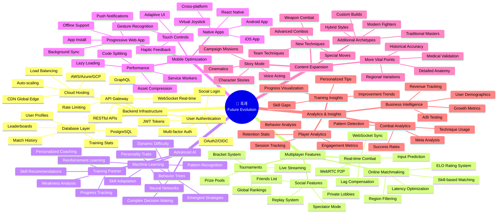
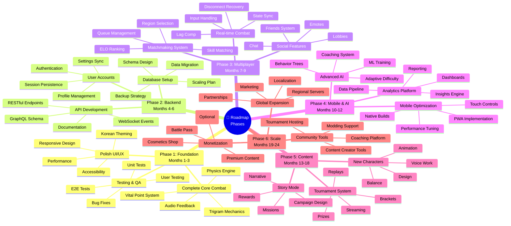
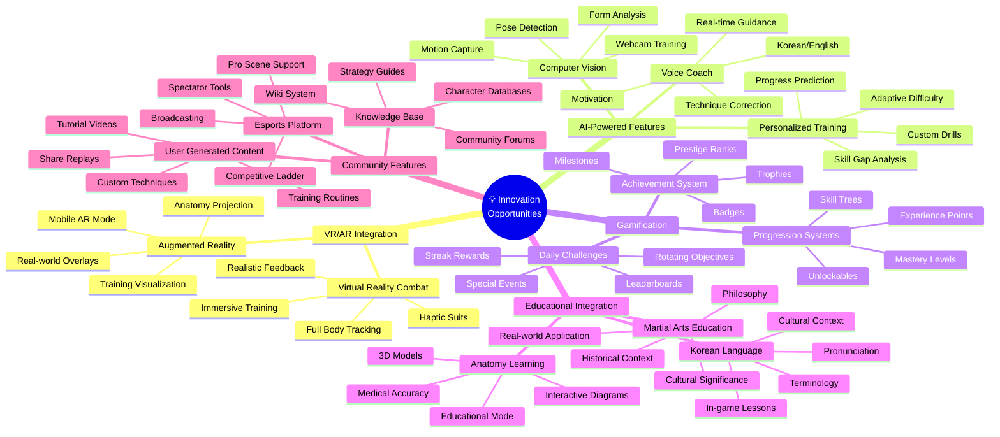
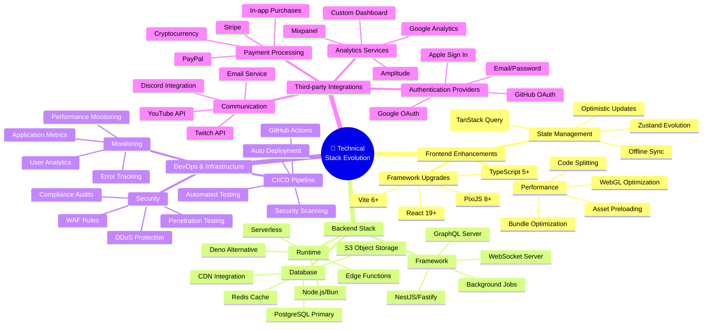

# 🧠 Black Trigram (흑괘) Future Technology Mindmap

## 📚 Related Documentation

| Document                                      | Focus            | Description                                    |
| --------------------------------------------- | ---------------- | ---------------------------------------------- |
| [Current Mindmap](MINDMAP.md)                 | 🧠 Current Concept| Current Korean martial arts concepts          |
| [Future Architecture](FUTURE_ARCHITECTURE.md) | 🚀 Future Vision | Planned architectural enhancements             |
| [Future SWOT](FUTURE_SWOT.md)                 | �� Strategy      | Strategic analysis for future phases           |
| [Future Flowchart](FUTURE_FLOWCHART.md)       | 🔄 Future Flow   | Planned workflow enhancements                  |

---

## 🎯 Overview

This mindmap documents the technology evolution roadmap for Black Trigram (흑괘), visualizing planned features, technical enhancements, and strategic development phases for the Korean martial arts combat simulator.

---

## 🌐 Future Technology Evolution Mindmap

---

## 🚀 Development Roadmap Phases

---

## 💡 Innovation Areas

---

## 🔗 Technical Integration Map

---

**흑괘의 길을 걸어라** - _Walk the Path of the Black Trigram into Technological Evolution_

This future mindmap visualizes the complete technology evolution roadmap for Black Trigram, documenting planned features, technical enhancements, and strategic development phases for transforming the Korean martial arts combat simulator into a comprehensive global platform.
