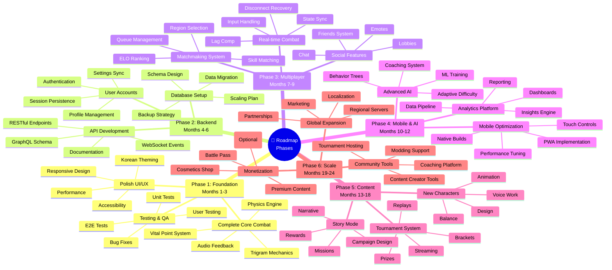
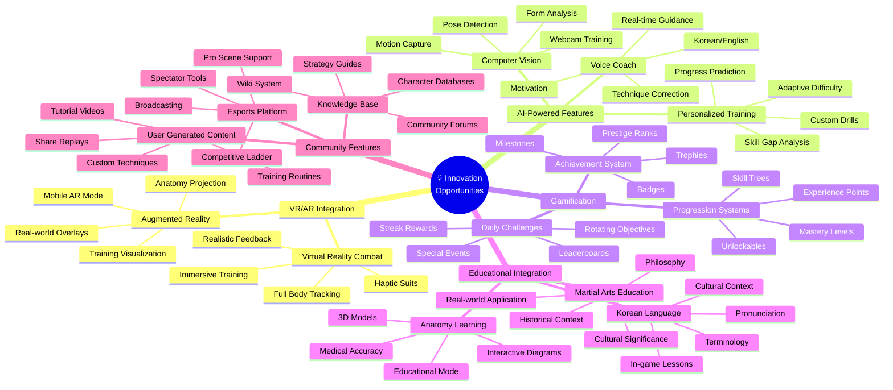
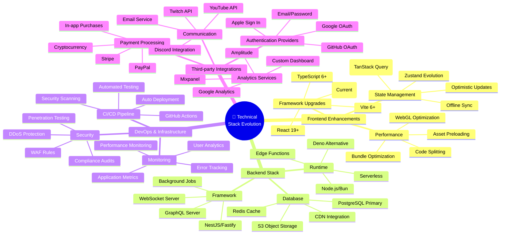

# 🧠 Black Trigram (흑괘) Future Technology Mindmap

**🔐 ISMS Alignment:** This document follows [Hack23 Secure Development Policy](https://github.com/Hack23/ISMS-PUBLIC/blob/main/Secure_Development_Policy.md) architecture documentation requirements.

## 📚 Related Documentation

| Document                                      | Focus            | Description                                    |
| --------------------------------------------- | ---------------- | ---------------------------------------------- |
| [Current Mindmap](MINDMAP.md)                 | 🧠 Current Concept| Current Korean martial arts concepts          |
| [Future Architecture](FUTURE_ARCHITECTURE.md) | 🚀 Future Vision | Planned architectural enhancements             |
| [Future SWOT](FUTURE_SWOT.md)                 | 📊 Strategy      | Strategic analysis for future phases           |
| [Future Flowchart](FUTURE_FLOWCHART.md)       | 🔄 Future Flow   | Planned workflow enhancements                  |

---

## 🎯 Overview

This mindmap documents the technology evolution roadmap for Black Trigram (흑괘), visualizing planned features, technical enhancements, and strategic development phases for the Korean martial arts combat simulator.

---

## 🌐 Future Technology Evolution Mindmap

```mermaid
mindmap
  root((🔮 흑괘<br/>Future Evolution<br/>AWS Backend))
    Backend Infrastructure
      AWS Authentication
        Amazon Cognito
          User Pools
          Identity Pools
          OAuth2 OIDC
          Social Login Google Facebook Discord GitHub
          MFA Support
        JWT Tokens
          Access Token
          Refresh Token
          ID Token
          Token Rotation
      AWS Database Layer
        DynamoDB
          users table
          match_history table
          leaderboards table
          achievements table
          GSI-1 ELOByRegion PK region SK elo_rating
          GSI-2 MatchByTimestamp PK user_id SK match_timestamp
        DynamoDB Streams
          Real-time Updates
          Event Triggers
          Lambda Integration
        S3 Storage
          Replays Bucket
          Assets Bucket
          Backups Bucket
          Profile Images
        AWS Backup
          Automated Backups
          Point-in-Time Recovery
          Cross-Region Replication
      AWS API Layer
        API Gateway REST
          GET api user profile
          POST api user create
          PUT api user update
          POST api match save
          GET api leaderboard
        API Gateway WebSocket
          wss api blacktrigram com ws
          Connection Management
          Real-time Messaging
          Heartbeat Monitoring
        Lambda Functions Node.js 25
          getUserProfile
          createUser
          saveMatchResults
          handleQueue Matchmaking
          createCheckout Stripe
          processWebhook
        Lambda Layers
          Shared Dependencies
          Utility Functions
          Database Clients
          Authentication Helpers
      AWS Networking
        CloudFront CDN
          Global Edge Locations
          Asset Delivery
          Cache Optimization
          HTTPS Everywhere
        Route 53 DNS
          Domain Management
          Health Checks
          Failover Routing
          Geo-location Routing
        AWS WAF
          DDoS Protection
          Rate Limiting
          IP Filtering
          SQL Injection Prevention
      AWS Monitoring
        CloudWatch
          Logs Centralized
          Metrics Custom
          Alarms Automated
          Dashboards Real-time
        X-Ray
          Distributed Tracing
          Performance Analysis
          Bottleneck Detection
          Error Tracking
        SNS Notifications
          Email Alerts
          SMS Alerts
          Push Notifications
          Webhook Integration
    Multiplayer Features
      Online Matchmaking
        ELO Rating System
          Initial Rating 1500
          K-factor 32
          Rating Adjustments
          Leaderboard Ranking
        Matchmaking Algorithm
          ELO Range Plus Minus 100
          Expand After 3min Plus Minus 200
          Region Priority Asia NA EU
          Latency Check Under 100ms
        Queue Management
          DynamoDB Queue Table
          Lambda Polling Every 5s
          Position Tracking
          Timeout Handling
      Real-time Combat
        WebRTC P2P
          Peer Connection
          ICE Candidates
          STUN TURN Servers
          NAT Traversal
        WebSocket Sync
          State Updates 60fps
          Input Buffering 3 Frames
          Lag Compensation 100ms
          Rollback Netcode
        Connection Monitoring
          Heartbeat Every 1s
          Ping Latency Tracking
          Disconnect Detection
          Auto-reconnect 30s Grace
      Social Features
        Friends System
          Friend Requests
          Online Status
          Invite to Match
          Recent Players
        Custom Lobbies
          Room Code 6 Digits
          Host Settings
          Player Ready Status
          Lobby Chat
        Replay System
          Match Recording S3
          Replay Playback
          Share Replay URL
          Highlight Reel
    Payment Processing
      Stripe Integration
        Checkout Sessions
          Hosted Payment Page
          Multiple Payment Methods
          Currency Support KRW USD
            Base Pricing Currency KRW
            USD Pricing Via Stripe FX
            Exchange Rate From Stripe At Checkout
            Amount Locked Per Session
          Tax Calculation
        Webhook Events
          checkout session completed
          payment intent succeeded
          customer subscription updated
          Signature Verification HMAC-SHA256
        Product Catalog
          Cosmetic Skins 5000-15000 KRW
          Battle Pass 9900 KRW
          DLC Packs 19900-49900 KRW
          Premium Currency
      Inventory Management
        DynamoDB Inventory
          Owned Items
          Purchase History
          Transaction Receipts
          Expiration Tracking
        Item Granting
          Immediate Unlock
          WebSocket Broadcast
          Client Cache Update
          Receipt Generation S3
    Advanced AI Future
      Machine Learning
        TensorFlow.js Client-Side
          Pattern Recognition
          Player Behavior Analysis
          Skill Assessment
          Adaptive Difficulty
        AWS SageMaker Backend
          Model Training
          Hyperparameter Tuning
          Batch Inference
          A B Testing
      Behavior Trees
        Complex Decision Making
          Conditional Nodes
          Sequence Nodes
          Parallel Nodes
          Decorator Nodes
        Emergent Strategies
          Combo Discovery
          Counter Patterns
          Stance Transitions
          VP Targeting
      Personalized Training
        Player Profiling
          Skill Gaps Analysis
          Learning Rate
          Preferred Techniques
          Weakness Patterns
        Custom Drills
          Targeted Exercises
          Progressive Difficulty
          Real-time Feedback
          Achievement Tracking
```

---

## 🚀 Development Roadmap Phases

---

## 💡 Innovation Areas

---

## 🔗 Technical Integration Map

---

**흑괘의 길을 걸어라** - _Walk the Path of the Black Trigram into Technological Evolution_

This future mindmap visualizes the complete technology evolution roadmap for Black Trigram, documenting planned features, technical enhancements, and strategic development phases for transforming the Korean martial arts combat simulator into a comprehensive global platform.

---

**📋 Document Control:**  
**✅ Approved by:** James Pether Sörling, CEO  
**📤 Distribution:** Public  
**🏷️ Classification:**   
**📅 Effective Date:** 2026-03-19  
**⏰ Next Review:** 2026-09-19  
**🎯 Framework Compliance:**  
