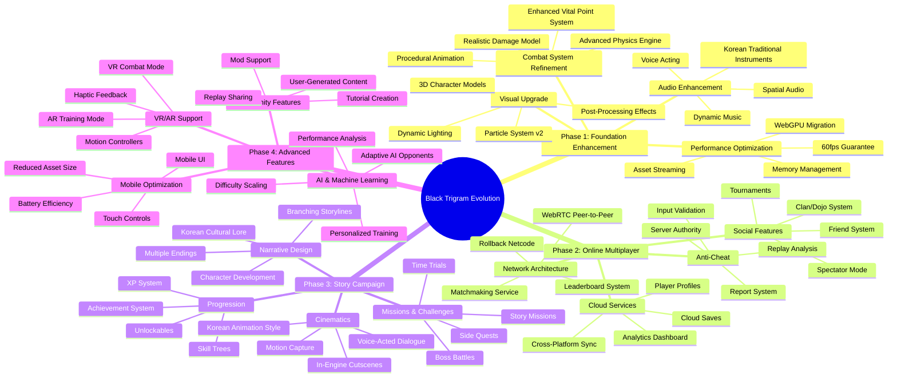
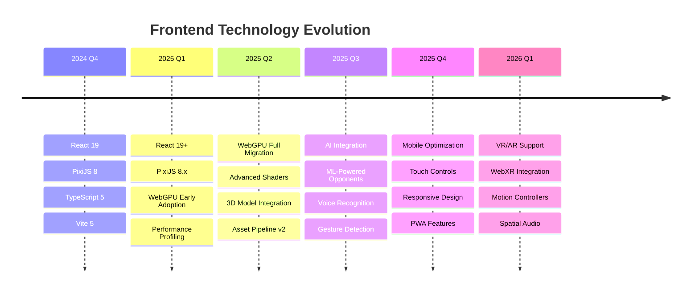
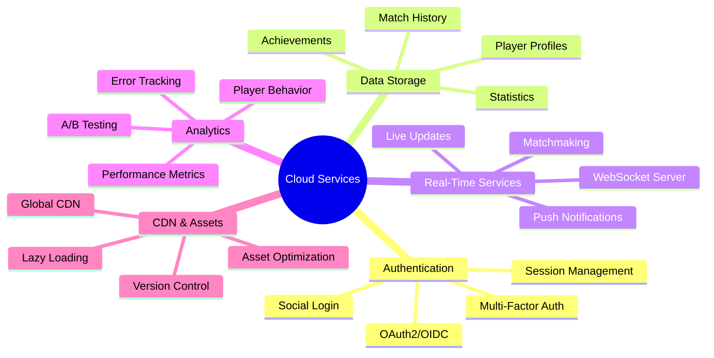
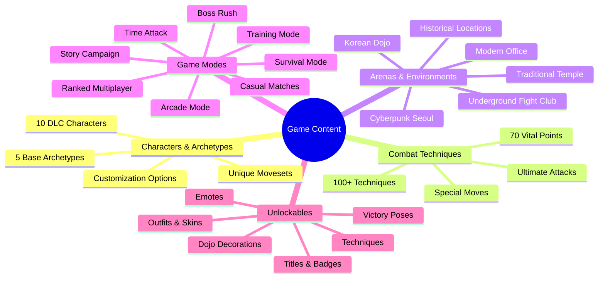
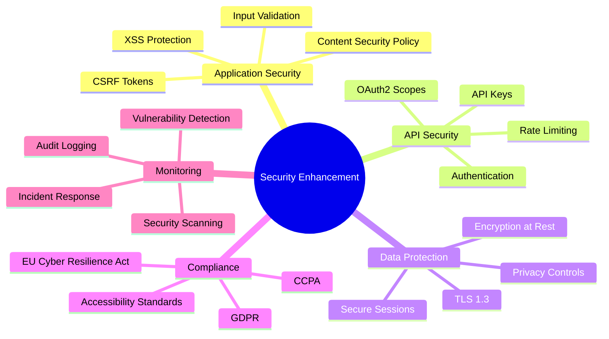
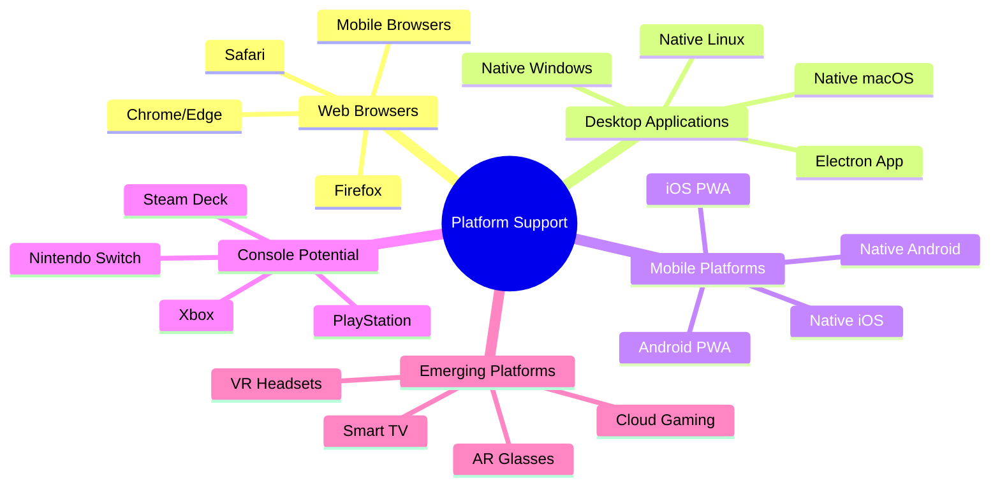
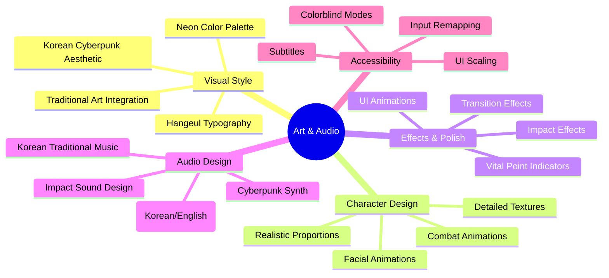
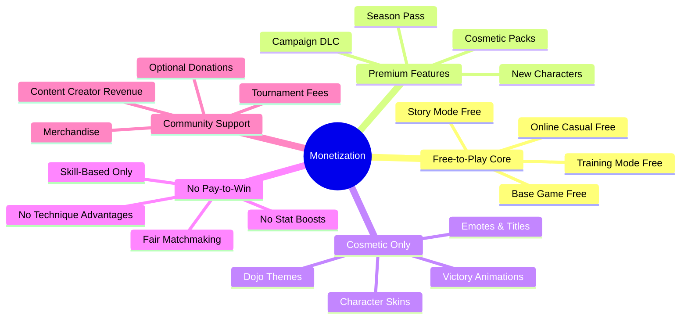
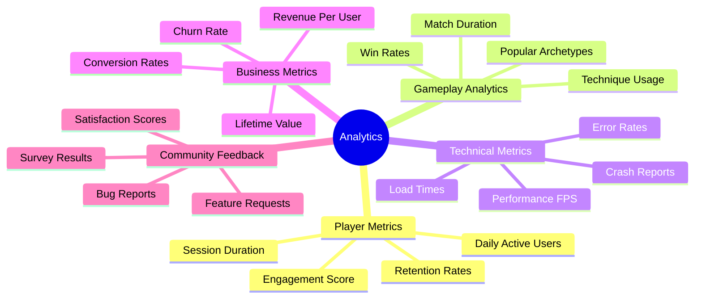
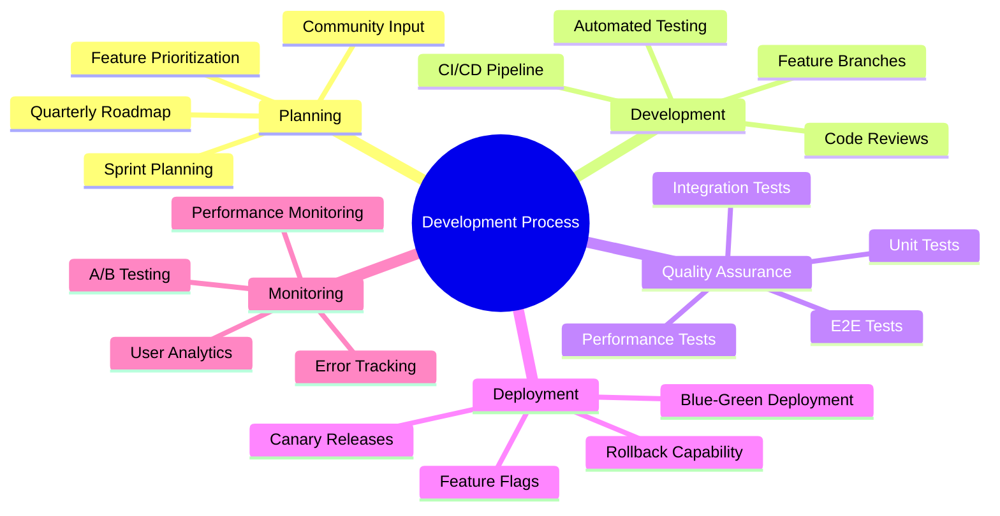

# 🧠 Black Trigram (흑괘) — Future Technology Roadmap

This document provides a comprehensive mindmap of the technology evolution roadmap for the Black Trigram Korean martial arts combat simulator.

## 📚 Related Documentation

| Document | Focus | Description |
|----------|-------|-------------|
| [MINDMAP](MINDMAP.md) | 🧠 Current | Current concept map |
| [FUTURE_ARCHITECTURE](FUTURE_ARCHITECTURE.md) | 🏛️ Future | Architecture evolution |
| [FUTURE_SWOT](FUTURE_SWOT.md) | 📊 Strategy | Strategic analysis |

---

## 🚀 Technology Evolution Mindmap

---

## 🔧 Technical Stack Evolution

### **Frontend Technology Roadmap**

---

## 🌐 Backend Services Roadmap

### **Cloud Infrastructure Evolution**

---

## 🎮 Game Feature Expansion

### **Content Roadmap**

---

## 🔐 Security & Compliance Evolution

### **Security Enhancement Roadmap**

---

## 📱 Platform Expansion

### **Multi-Platform Strategy**

---

## 🎨 Art & Audio Evolution

### **Visual & Audio Enhancement**

---

## 🏆 Monetization Strategy (Future)

### **Sustainable Funding Model**

---

## 📊 Analytics & Metrics

### **Data-Driven Development**

---

## 🔄 Development Methodology

### **Agile & Continuous Delivery**

---

**📋 Document Control:**  
**✅ Approved by:** CEO  
**📤 Distribution:** Public  
**🏷️ Classification:** Public  
**📅 Effective Date:** 2025-11-14  
**⏰ Next Review:** 2026-11-14  
**🎯 Compliance:** ISO 27001 (A.8.9), NIST CSF (PR.IP-1)
