I# 🛡️ Black Trigram (흑괘) Future Security Architecture

This document outlines the comprehensive security architecture for Black Trigram's evolution into a full-stack Korean martial arts combat simulator with AWS cloud infrastructure, user accounts, and advanced security services.

## 📑 Table of Contents

- [🔐 Security Documentation Map](#-security-documentation-map)
- [🔑 Authentication Architecture (AWS Cognito)](#-authentication-architecture-aws-cognito)
- [📜 Data Integrity & Auditing](#-data-integrity--auditing)
- [📊 Session & Action Tracking](#-session--action-tracking)
- [🔍 Security Event Monitoring](#-security-event-monitoring)
- [🌐 Network Security](#-network-security)
- [🔌 VPC Endpoints Security](#-vpc-endpoints-security)
- [🏗️ High Availability Design](#-high-availability-design)
- [💾 Data Protection](#-data-protection)
- [☁️ AWS Security Infrastructure](#-aws-security-infrastructure)
- [🔰 AWS Foundational Security Best Practices](#-aws-foundational-security-best-practices)
- [🕵️ Threat Detection & Investigation](#-threat-detection--investigation)
- [🔎 Vulnerability Management](#-vulnerability-management)
- [⚡ Resilience & Operational Readiness](#-resilience--operational-readiness)
- [📋 Configuration & Compliance Management](#-configuration--compliance-management)
- [📊 Monitoring & Analytics](#-monitoring--analytics)
- [🤖 Automated Security Operations](#-automated-security-operations)
- [🔒 Application Security](#-application-security)
- [📜 Compliance Framework](#-compliance-framework)
- [🛡️ Defense-in-Depth Strategy](#-defense-in-depth-strategy)
- [🔄 Security Operations](#-security-operations)
- [💰 Security Investment](#-security-investment)
- [🏛️ CI/CD Security Architecture](#-cicd-security-architecture)
- [📝 Conclusion](#-conclusion)

## 🔐 Security Documentation Map

| Document                                                        | Focus          | Description                                         |
| --------------------------------------------------------------- | -------------- | --------------------------------------------------- |
| [Current Security Architecture](SECURITY_ARCHITECTURE.md)       | 🛡️ Current     | Current frontend-only security implementation       |
| [Future Security Architecture](FUTURE_SECURITY_ARCHITECTURE.md) | 🔮 Future      | **This document** - AWS cloud security architecture |
| [End-of-Life Strategy](End-of-Life-Strategy.md)                 | 📅 Lifecycle   | Security patching and updates                       |
| [Workflows](WORKFLOWS.md)                                       | 🔧 CI/CD       | Security-hardened CI/CD workflows                   |
| [Development Guide](development.md)                             | 🔧 Development | Security features and testing strategy              |
| [Architecture](ARCHITECTURE.md)                                 | 🏛️ Structure   | Overall system architecture                         |

## 🔑 Authentication Architecture (AWS Cognito)

**Status**: ✅ Comprehensive Authentication System - AWS Cognito Integration

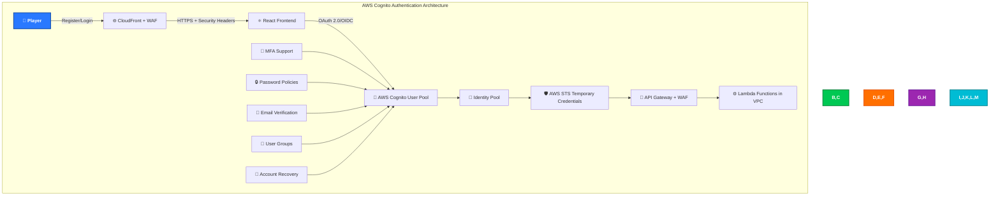

### Implementation

Black Trigram implements comprehensive authentication using AWS Cognito:

#### 🔐 AWS Cognito User Pool

- **✅ User Registration**: Email-based account creation with Korean language support
- **✅ Multi-Factor Authentication**: SMS, Email, and TOTP-based MFA with Korean carriers
- **✅ Advanced Password Policies**: Complex requirements supporting Korean characters
- **✅ Account Recovery**: Secure password reset flows with Korean language support
- **✅ User Groups**: Role-based access control (Admin, Instructor, Student, Master)
- **✅ Custom Attributes**: Korean martial arts rank, training history, dojang affiliation

#### 🔑 AWS Cognito Identity Pool

- **✅ Federated Identities**: Social login support (Google, Facebook, Naver, Kakao)
- **✅ Temporary Credentials**: AWS STS for secure API access with least privilege
- **✅ Fine-Grained Permissions**: IAM roles based on user groups and Korean martial arts ranks
- **✅ Anonymous Access**: Limited demo mode for prospective students

#### 🛡️ Security Features

- **✅ JWT Token Validation**: Secure token-based authentication with Korean user context
- **✅ Token Refresh**: Automatic credential renewal with session continuity
- **✅ Session Management**: Configurable timeouts based on user activity and risk level
- **✅ Rate Limiting**: Advanced brute force protection with geographic analysis
- **✅ Comprehensive Audit Logging**: All authentication events tracked in CloudTrail

### Korean Martial Arts Integration

- **🥋 Rank System**: Integration with traditional Korean martial arts belt rankings (급/단)
- **📊 Progress Tracking**: Authenticated progress through trigram mastery and vital point training
- **👥 Dojang Groups**: Virtual training groups with verified instructor oversight
- **🏆 Achievement System**: Cryptographically signed accomplishments and certifications
- **🇰🇷 Cultural Validation**: Korean language proficiency and cultural knowledge assessment

## 📜 Data Integrity & Auditing

**Status**: ✅ Comprehensive Auditing System - AWS CloudTrail & Config Integration

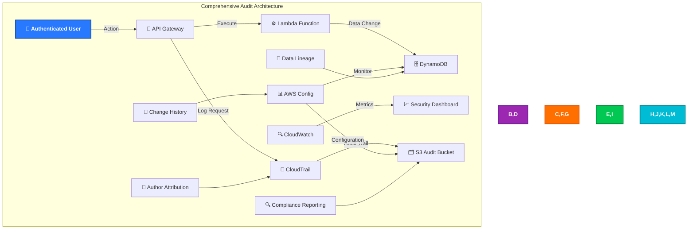

### Implementation

Black Trigram implements comprehensive data auditing:

#### 📝 AWS CloudTrail

- **✅ API Call Logging**: All AWS service calls logged across all regions
- **✅ Data Events**: DynamoDB table access and S3 object access tracking
- **✅ Management Events**: IAM changes, resource modifications, and security changes
- **✅ Insight Events**: Unusual activity patterns and security anomalies detected
- **✅ Multi-Region Deployment**: CloudTrail active in all deployment regions

#### 📊 AWS Config

- **✅ Configuration Monitoring**: All AWS resource configurations continuously tracked
- **✅ Compliance Rules**: Automated compliance checking against security standards
- **✅ Change Timeline**: Complete history of configuration changes with impact analysis
- **✅ Relationship Tracking**: Dependencies between resources mapped and monitored

#### 🔍 Audit Data Protection

- **✅ Immutable Logs**: CloudTrail logs protected from modification with S3 Object Lock
- **✅ Encrypted Storage**: All audit data encrypted at rest with customer-managed KMS keys
- **✅ Access Controls**: Strict IAM policies limiting audit data access to authorized personnel
- **✅ Retention Policies**: Long-term retention for compliance (7 years) with automated lifecycle

### Korean Martial Arts Audit Features

- **🥋 Training Progress Auditing**: Complete audit trail of skill advancement and belt promotions
- **📊 Combat Analytics Logging**: Detailed logging of vital point targeting accuracy and improvement
- **👥 Instructor Actions**: All teaching, grading, and certification activities logged
- **🏆 Achievement Verification**: Cryptographic proof of accomplishments with immutable records

## 📊 Session & Action Tracking

**Status**: ✅ Comprehensive Session Management - CloudWatch & DynamoDB Integration

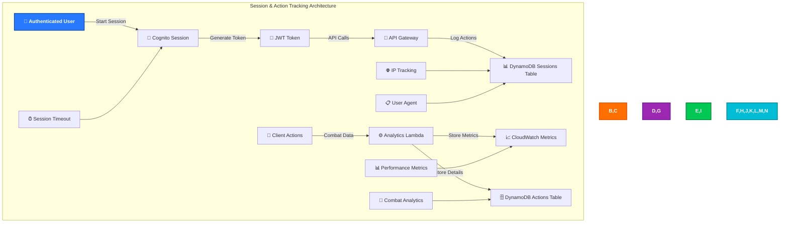

### Implementation

Black Trigram implements detailed session and action tracking:

#### 🔐 Session Management

- **✅ Cognito Sessions**: Secure session tokens with configurable lifetimes and risk-based adjustments
- **✅ Session Analytics**: Login patterns, session duration, geographic distribution analysis
- **✅ Concurrent Sessions**: Intelligent control over multiple device access with security monitoring
- **✅ Session Invalidation**: Ability to revoke sessions remotely with immediate effect

#### 📊 Action Tracking

- **✅ Combat Actions**: Detailed logging of all martial arts techniques performed with precision metrics
- **✅ Vital Point Accuracy**: Precision tracking for educational assessment and skill validation
- **✅ Progress Analytics**: Learning curve analysis and skill development progression monitoring
- **✅ Performance Metrics**: Response times, accuracy rates, improvement trends, and mastery indicators

#### 🔍 Privacy-Compliant Tracking

- **✅ Anonymized Analytics**: Personal data separated from usage patterns with pseudonymization
- **✅ Consent Management**: Granular user control over data collection preferences
- **✅ Data Minimization**: Only collect data necessary for educational and security purposes
- **✅ Right to Deletion**: Complete removal of user data on request with verification

### Korean Martial Arts Tracking Features

- **🎯 Vital Point Mastery**: Detailed accuracy tracking for all 70 vital points with progression analytics
- **☯️ Trigram Proficiency**: Progress through the eight trigram stances with mastery validation
- **⚔️ Combat Analytics**: Win/loss ratios, technique effectiveness, sparring performance
- **📚 Learning Analytics**: Time to mastery, common mistakes identification, improvement recommendations

## 🔍 Security Event Monitoring

**Status**: ✅ Advanced Security Monitoring - Multi-Service Integration

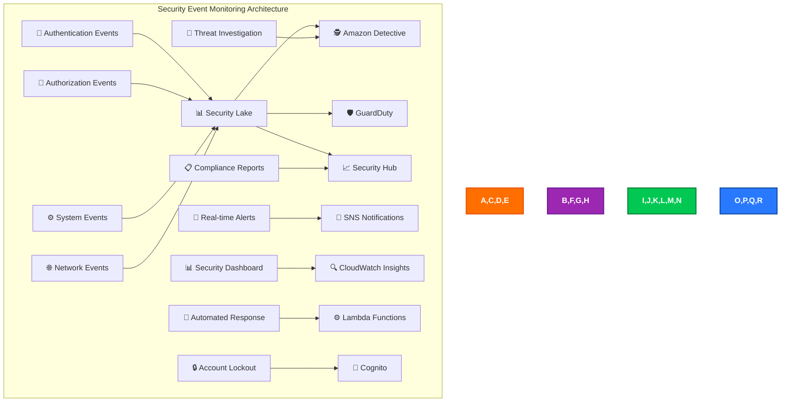

### Implementation

Black Trigram implements comprehensive security event monitoring:

#### 🕵️ Amazon Detective

- **✅ Security Investigation**: Automated analysis of security findings with machine learning
- **✅ Visual Investigation**: Graph-based security event correlation and timeline analysis
- **✅ Threat Context**: Rich context for security incidents with behavioral baselines
- **✅ Root Cause Analysis**: Automated investigation workflows with evidence collection

#### 🛡️ Amazon GuardDuty

- **✅ Threat Detection**: Machine learning-based threat identification across all regions
- **✅ Malicious Activity**: Detection of compromised instances, accounts, and data exfiltration
- **✅ Network Monitoring**: Analysis of VPC flow logs and DNS logs for threats
- **✅ Malware Detection**: S3 object scanning for malicious content and data threats

#### 📈 AWS Security Hub

- **✅ Centralized Findings**: Aggregation of all security tool findings with prioritization
- **✅ Compliance Posture**: Automated compliance status reporting with trend analysis
- **✅ Custom Insights**: Tailored security dashboards for Korean martial arts application
- **✅ Remediation Workflows**: Automated response to security findings with escalation

#### 🚨 Real-time Alerting

- **✅ Critical Alerts**: Immediate notification of high-severity events via multiple channels
- **✅ Anomaly Detection**: Unusual usage pattern alerts with machine learning baselines
- **✅ Failed Authentication**: Brute force and credential stuffing detection with geographic analysis
- **✅ Privilege Escalation**: Unauthorized access attempt detection with immediate response

### Korean Martial Arts Security Events

- **🥋 Training Anomalies**: Unusual progress patterns that might indicate cheating or automation
- **🎯 Accuracy Anomalies**: Impossible vital point accuracy suggesting bot usage
- **👥 Account Sharing**: Detection of multiple users on single account through behavioral analysis
- **🏆 Achievement Fraud**: Validation of authentic skill progression with expert system verification

## 🌐 Network Security

**Status**: ✅ Enterprise Network Security - CloudFront + WAF + VPC Integration

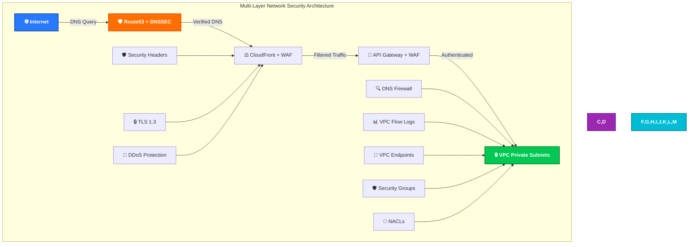

### Implementation

Black Trigram implements enterprise-grade network security:

#### ⚖️ CloudFront + WAF Security

- **✅ AWS WAF Integration**: Application-layer protection against OWASP Top 10 and custom threats
- **✅ Advanced Rate Limiting**: Per-IP, per-user, and per-session request rate controls
- **✅ Geo-blocking Capabilities**: Country-based access controls with Korean user prioritization
- **✅ Custom Security Rules**: Korean martial arts application-specific protections
- **✅ Bot Protection**: Advanced bot detection and mitigation with machine learning

#### 🔒 Enhanced Security Headers

```http
# Comprehensive CloudFront Security Headers
Strict-Transport-Security: max-age=31536000; includeSubDomains; preload
Content-Security-Policy: default-src 'self'; script-src 'self' 'unsafe-inline'; style-src 'self' 'unsafe-inline' fonts.googleapis.com; font-src 'self' fonts.gstatic.com data:; img-src 'self' data: *.blacktrigram.com; media-src 'self' *.blacktrigram.com; connect-src 'self' api.blacktrigram.com
X-Content-Type-Options: nosniff
X-Frame-Options: DENY
X-XSS-Protection: 1; mode=block
Referrer-Policy: strict-origin-when-cross-origin
Permissions-Policy: geolocation=(), microphone=(), camera=(), payment=(), usb=(), accelerometer=(self), gyroscope=(self)
Cross-Origin-Embedder-Policy: require-corp
Cross-Origin-Opener-Policy: same-origin
Cross-Origin-Resource-Policy: same-origin
```

#### 🔒 VPC Security Architecture

- **✅ Private Subnets**: Lambda functions isolated in private subnets with no internet access
- **✅ Security Groups**: Least-privilege network access controls with detailed logging
- **✅ Network ACLs**: Network-level access control lists for defense in depth
- **✅ VPC Flow Logs**: Complete network traffic monitoring with anomaly detection
- **✅ DNS Firewall**: Protection against DNS-based attacks and data exfiltration

#### 🔌 VPC Endpoints Implementation

- **✅ S3 Gateway Endpoint**: Private access to S3 buckets containing combat data and assets
- **✅ DynamoDB Gateway Endpoint**: Private database access for user data and sessions
- **✅ Interface Endpoints**: Private access to AWS services (Cognito, STS, CloudWatch, etc.)
- **✅ No Internet Gateway**: Lambda functions with complete isolation from public internet

### Multi-Region Network Security

- **🌍 Primary Region**: US-East-1 (Virginia) for optimal latency to global users
- **🌏 Secondary Region**: US-West-2 (Oregon) for disaster recovery and Asian users
- **🔄 Route53 Health Checks**: Automatic failover between regions with health monitoring
- **⚡ Geo-latency Routing**: Optimal performance based on user location and Korean server proximity

## 🔌 VPC Endpoints Security

**Status**: ✅ Comprehensive VPC Endpoints - All AWS Services Private Access

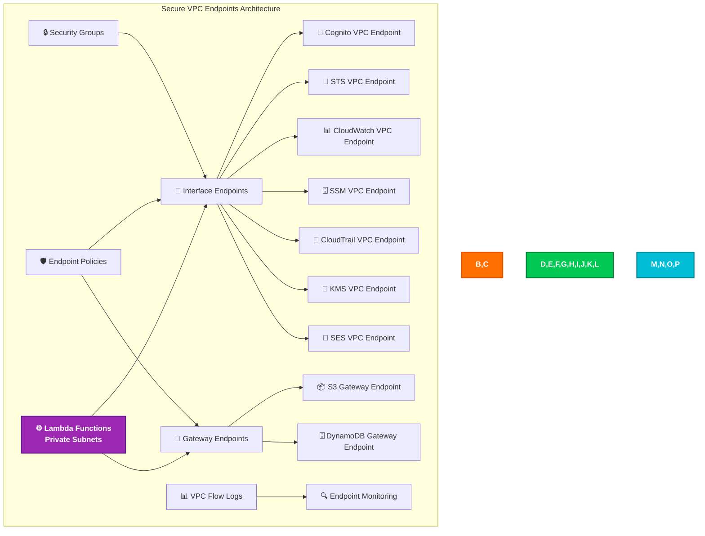

### Implementation

Black Trigram implements comprehensive VPC endpoints for all AWS services:

#### 🚪 Gateway Endpoints

- **✅ S3 Gateway Endpoint**: Private access to combat data, user assets, and audit logs
- **✅ DynamoDB Gateway Endpoint**: Private access to user data, sessions, and training records
- **✅ No Internet Routing**: All data access through private AWS backbone with encryption

#### 🔌 Interface Endpoints

- **✅ Cognito VPC Endpoint**: Private authentication and user management operations
- **✅ STS VPC Endpoint**: Private credential exchange and token validation
- **✅ CloudWatch VPC Endpoint**: Private logging, metrics, and monitoring
- **✅ SSM VPC Endpoint**: Private parameter store access for configuration management
- **✅ CloudTrail VPC Endpoint**: Private audit logging and compliance tracking
- **✅ KMS VPC Endpoint**: Private encryption key management and operations
- **✅ SES VPC Endpoint**: Private email services for notifications and verification

#### 🛡️ Endpoint Security Implementation

- **✅ Restrictive Endpoint Policies**: Fine-grained access control limiting specific resources and actions
- **✅ Security Groups**: Network-level access controls for endpoints with monitoring
- **✅ Private DNS**: Internal DNS resolution for service discovery and communication
- **✅ Comprehensive Monitoring**: VPC Flow Logs for all endpoint traffic with anomaly detection

### Security Benefits

- **🔒 Zero Internet Exposure**: AWS service communication stays within AWS private network
- **📊 Complete Visibility**: All AWS API calls logged and monitored through CloudTrail
- **🛡️ Reduced Attack Surface**: No public internet dependencies for AWS service access
- **⚡ Enhanced Performance**: Lower latency through AWS backbone with improved reliability

## 🏗️ High Availability Design

**Status**: ✅ Multi-Region High Availability - Route53 + Resilience Hub Integration

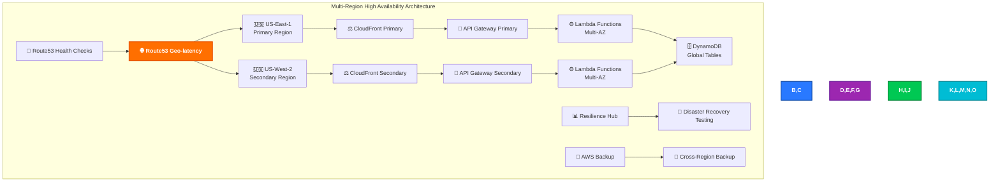

### Implementation

Black Trigram implements enterprise-grade high availability:

#### 🌍 Multi-Region Architecture

- **🇺🇸 Primary Region**: US-East-1 (Virginia) serving global traffic with optimal performance
- **🇺🇸 Secondary Region**: US-West-2 (Oregon) for failover, disaster recovery, and Asian users
- **🔄 Active-Active**: Both regions serve traffic with intelligent routing based on performance
- **⚡ Geo-latency Routing**: Route53 directs users to optimal region with health monitoring

#### 🔄 Route53 Advanced Configuration

- **✅ Comprehensive Health Checks**: Continuous monitoring of application endpoints and dependencies
- **✅ Intelligent Failover**: Automatic failover to secondary region with minimal user impact
- **✅ Geo-latency Optimization**: Performance-based routing with Korean user prioritization
- **✅ Weighted Traffic Distribution**: Gradual traffic shifting for deployments and load testing

#### 📊 AWS Resilience Hub Integration

- **✅ Continuous Resilience Assessment**: Real-time evaluation of application resilience posture
- **✅ RTO/RPO Tracking**: Recovery time and recovery point objectives monitoring with alerting
- **✅ Automated DR Testing**: Regular disaster recovery testing and validation with reporting
- **✅ Resilience Recommendations**: AI-powered suggestions for improving application resilience

#### 💾 Comprehensive Backup Strategy

- **✅ Cross-Region Backup**: DynamoDB Global Tables and S3 cross-region replication
- **✅ Automated Scheduling**: Multi-tier backup schedule (hourly, daily, weekly, monthly)
- **✅ Point-in-Time Recovery**: 35-day PITR for DynamoDB with automated testing
- **✅ Backup Vault Encryption**: All backups encrypted with customer-managed KMS keys

### Recovery Objectives

- **🎯 RTO (Recovery Time Objective)**: 15 minutes for full application recovery
- **📊 RPO (Recovery Point Objective)**: 5 minutes maximum data loss tolerance
- **🔄 Availability Target**: 99.9% uptime (8.76 hours downtime annually)
- **📈 Performance Target**: <500ms response time during failover scenarios

### Korean Martial Arts HA Benefits

- **🥋 Continuous Training**: Minimal disruption to martial arts practice sessions
- **📊 Data Consistency**: Global tables ensure consistent user progress across regions
- **🏆 Achievement Preservation**: Robust backup and recovery of user accomplishments
- **👥 Global Instructor Support**: Multi-region support for worldwide dojang operations

## 💾 Data Protection

**Status**: ✅ Enterprise Data Protection - Multi-Layer Encryption + DLP

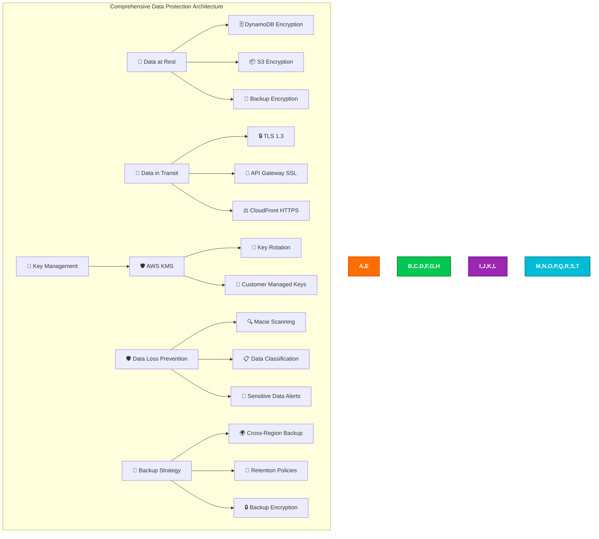

### Implementation

Black Trigram implements enterprise-grade data protection:

#### 🔐 Advanced Encryption at Rest

- **✅ DynamoDB Encryption**: Customer-managed KMS keys for all user data and training records
- **✅ S3 Encryption**: SSE-KMS for combat data, user assets, and audit logs
- **✅ Lambda Environment**: Encrypted environment variables for secrets and configuration
- **✅ CloudWatch Logs**: Encrypted log groups for all application and audit data

#### 🚀 Enhanced Encryption in Transit

- **✅ TLS 1.3**: Latest TLS protocol for all communications with perfect forward secrecy
- **✅ Certificate Pinning**: Frontend validation of certificate chains with backup pins
- **✅ HSTS Implementation**: Strict transport security enforcement with preload list
- **✅ End-to-End Encryption**: Encryption maintained from client to backend services

#### 🔑 Advanced Key Management

- **✅ Customer Managed KMS Keys**: Full control over encryption keys with audit logging
- **✅ Automatic Key Rotation**: Annual rotation of encryption keys with zero downtime
- **✅ Granular Key Policies**: Fine-grained permissions for key access with least privilege
- **✅ Cross-Region Key Replication**: KMS multi-region keys for global operations

#### 🛡️ Data Loss Prevention (DLP)

- **✅ Amazon Macie**: Automated discovery and classification of sensitive data
- **✅ PII Detection**: Identification and protection of personally identifiable information
- **✅ Data Classification**: Automatic tagging and protection of sensitive Korean cultural content
- **✅ Access Monitoring**: Unusual data access pattern detection with automated response

#### 💾 Enterprise Backup and Recovery

- **✅ Multi-Tier Backup**: Hourly, daily, weekly, and monthly backup schedules
- **✅ Cross-Region Replication**: Real-time replication to secondary regions
- **✅ Point-in-Time Recovery**: Precise recovery to any point within 35-day window
- **✅ Backup Testing**: Regular restore testing to validate backup integrity

### Korean Martial Arts Data Protection

- **🥋 Training Data Security**: Military-grade encryption for combat performance metrics
- **📊 Progress Analytics Protection**: Secure storage of user advancement and skill data
- **👥 Instructor Data**: Protected storage of teaching credentials and student assessments
- **🏆 Achievement Records**: Immutable, cryptographically signed records of accomplishments

## ☁️ AWS Security Infrastructure

**Status**: ✅ Comprehensive AWS Security Services - Full Integration

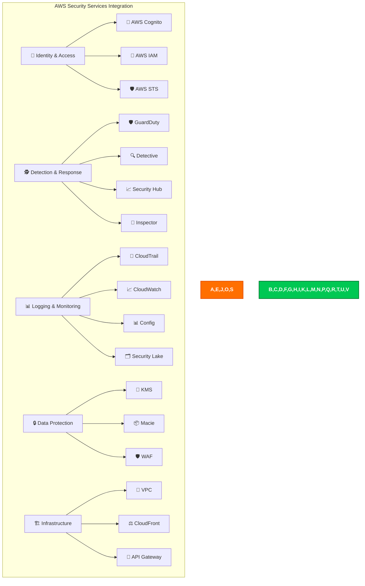

### Implementation

Black Trigram implements comprehensive AWS security services:

#### 👤 Identity & Access Management

- **✅ AWS Cognito**: Complete user authentication and authorization with Korean language support
- **✅ AWS IAM**: Service-to-service authentication with fine-grained permissions and monitoring
- **✅ AWS STS**: Temporary credential management and secure role assumption
- **✅ Cross-Account Access**: Secure access patterns for multi-account architecture

#### 🕵️ Advanced Threat Detection & Response

- **✅ Amazon GuardDuty**: ML-powered threat detection across all regions with custom rules
- **✅ Amazon Detective**: Visual security investigation and root cause analysis
- **✅ AWS Security Hub**: Centralized security findings and compliance dashboards
- **✅ Amazon Inspector**: Continuous vulnerability assessment for Lambda functions and containers

#### 📊 Comprehensive Logging & Monitoring

- **✅ AWS CloudTrail**: Complete audit logging across all services with data insights
- **✅ Amazon CloudWatch**: Real-time monitoring, alerting, and log aggregation
- **✅ AWS Config**: Configuration compliance and change tracking with automation
- **✅ Amazon Security Lake**: Centralized security data lake for advanced analytics

#### 🔒 Advanced Data Protection Services

- **✅ AWS KMS**: Centralized key management and encryption with automatic rotation
- **✅ Amazon Macie**: Sensitive data discovery, classification, and protection
- **✅ AWS WAF**: Advanced web application firewall with machine learning protection

### Security Service Integration

- **🔄 Automated Workflows**: Security Hub findings trigger Lambda-based automated responses
- **📊 Unified Dashboard**: Single pane of glass for all security metrics and findings
- **🚨 Intelligent Alerting**: ML-powered alert prioritization with automated escalation
- **📈 Compliance Automation**: Continuous compliance posture assessment with remediation

## 🔰 AWS Foundational Security Best Practices

**Status**: ✅ Complete FSBP Implementation - All Controls Enabled

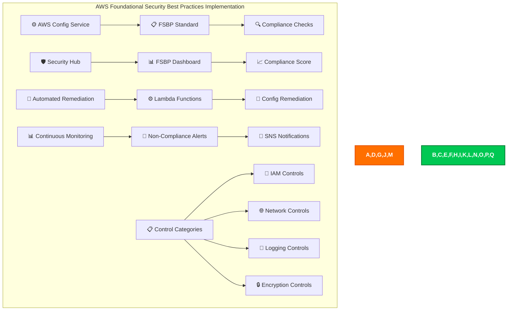

### Implementation

Black Trigram implements full AWS Foundational Security Best Practices:

#### 📋 Comprehensive FSBP Controls

- **✅ IAM Password Policy**: Strong password requirements for all users with Korean character support
- **✅ Root Account MFA**: Multi-factor authentication for AWS root account with monitoring
- **✅ CloudTrail Enabled**: Comprehensive audit logging across all regions with data events
- **✅ VPC Flow Logs**: Network traffic logging for security analysis and threat detection
- **✅ S3 Bucket Encryption**: Default encryption for all S3 buckets with customer-managed keys
- **✅ Security Groups**: Restrictive inbound rules with business justification and monitoring

#### 🔍 Continuous Compliance Monitoring

- **✅ Config Rules**: Automated evaluation of resource configurations with custom rules
- **✅ Real-time Dashboard**: Live view of security posture with drill-down capabilities
- **✅ Configuration Drift Detection**: Immediate alerts when configurations deviate from baseline
- **✅ Automated Remediation**: Automatic fixing of common misconfigurations with approval workflows

#### 📊 FSBP Compliance Categories

1. **🔐 Identity and Access Management (IAM)**

   - Root access key checks with automated remediation
   - IAM policy best practices with least privilege enforcement
   - Multi-factor authentication enforcement with compliance tracking

2. **🌐 Network Security**

   - Security group configuration with change monitoring
   - VPC configuration with security validation
   - Network ACL best practices with automated compliance

3. **📝 Logging and Monitoring**

   - CloudTrail configuration with integrity validation
   - CloudWatch alarms with automated response
   - Config service enablement with rule compliance

4. **🔒 Data Protection**
   - S3 bucket encryption with key management
   - EBS volume encryption with automatic remediation
   - Database encryption at rest with compliance validation

### Compliance Scoring & Reporting

- **🎯 Target Score**: 95%+ compliance with all FSBP controls
- **📈 Trending Analysis**: Monthly improvement tracking in compliance posture
- **🚨 Critical Alerts**: Immediate notification for high-severity findings
- **📊 Executive Reporting**: Weekly compliance reports for leadership team

## 🕵️ Threat Detection & Investigation

**Status**: ✅ Advanced Threat Detection - GuardDuty + Detective + Custom Analytics

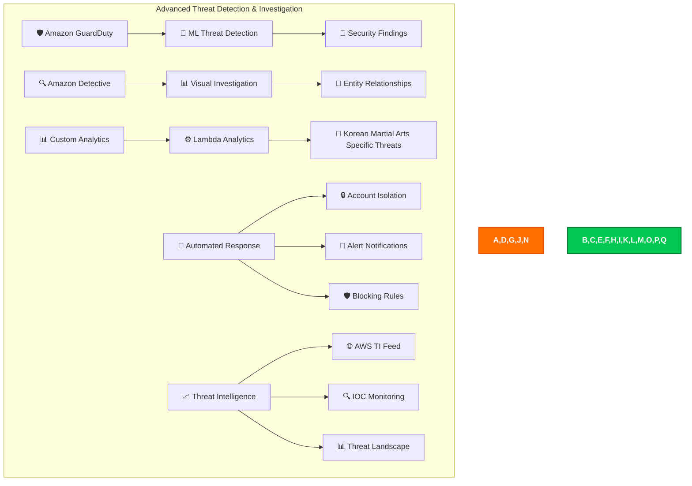

### Implementation

Black Trigram implements advanced threat detection:

#### 🛡️ Amazon GuardDuty

- **✅ Multi-Region Deployment**: GuardDuty active in all deployment regions with centralized findings
- **✅ VPC Flow Log Analysis**: Advanced network traffic pattern analysis with ML baselines
- **✅ DNS Log Analysis**: DNS query pattern monitoring with threat intelligence correlation
- **✅ S3 Protection**: S3 bucket access pattern monitoring with data exfiltration detection
- **✅ Malware Detection**: Real-time S3 object malware scanning with quarantine

#### 🔍 Amazon Detective

- **✅ Visual Investigation**: Graph-based security event analysis with timeline correlation
- **✅ Entity Behavior Analysis**: User and resource behavior analysis with anomaly detection
- **✅ Root Cause Analysis**: Automated investigation workflows with evidence collection
- **✅ Threat Hunting**: Proactive threat hunting with custom queries and analysis

#### 🎯 Korean Martial Arts Specific Threats

- **✅ Training Bot Detection**: Automated gameplay detection that violates fair play principles
- **✅ Achievement Fraud**: Impossible skill progression patterns suggesting cheating
- **✅ Account Compromise**: Unusual login patterns or sudden skill changes indicating takeover
- **✅ Data Scraping**: Attempts to extract proprietary Korean martial arts content

#### 🚨 Automated Threat Response

- **✅ Account Lockout**: Automatic suspension of compromised accounts with investigation
- **✅ IP Blocking**: Dynamic WAF rules to block malicious IP addresses
- **✅ Rate Limiting**: Dynamic rate limiting based on threat level and user behavior
- **✅ Alert Escalation**: Tiered alert system with automated escalation to security team

### Threat Investigation Workflows

- **🔍 Security Analyst Workflow**: Standardized investigation procedures with automation
- **🤖 Automated Triage**: Machine learning-based finding prioritization and routing
- **📊 Threat Context**: Enrichment with external threat intelligence and Korean-specific threats
- **📱 Mobile Response**: Critical finding notifications for security team with response capabilities

## 🔎 Vulnerability Management

**Status**: ✅ Comprehensive Vulnerability Management - Inspector + Advanced Scanning

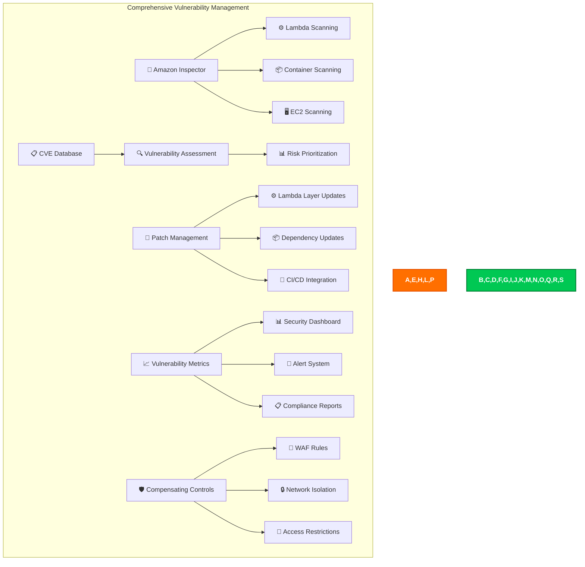

### Implementation

Black Trigram implements comprehensive vulnerability management:

#### 🔎 Amazon Inspector

- **✅ Lambda Function Scanning**: Continuous scanning of all Lambda functions with dependency analysis
- **✅ Container Image Scanning**: ECR image vulnerability assessment with policy enforcement
- **✅ Network Reachability**: Analysis of network paths and exposure assessment
- **✅ SBOM Generation**: Software Bill of Materials for all components with tracking

#### 📋 Advanced Vulnerability Assessment

- **✅ CVE Correlation**: Real-time mapping of findings to Common Vulnerabilities and Exposures
- **✅ Risk Scoring**: CVSS v3.1-based risk prioritization with business impact assessment
- **✅ Exploitability Analysis**: Evaluation of exploit likelihood with threat intelligence
- **✅ Business Impact**: Assessment of vulnerability impact on Korean martial arts training

#### 🔧 Automated Patch Management

- **✅ Automated Updates**: Dependency updates through secure CI/CD pipeline
- **✅ Lambda Layer Management**: Centralized runtime patching with version control
- **✅ Testing Pipeline**: Comprehensive automated testing of patches before deployment
- **✅ Rollback Procedures**: Quick rollback capabilities for problematic patches

#### 📈 Vulnerability Metrics & KPIs

- **✅ Mean Time to Detection**: Average time to identify vulnerabilities (target: <24 hours)
- **✅ Mean Time to Remediation**: Average time to patch vulnerabilities (target: <7 days)
- **✅ Vulnerability Trend Analysis**: Historical trend analysis with predictive modeling
- **✅ Compliance Scoring**: Vulnerability management maturity assessment with benchmarking

### Korean Martial Arts Specific Vulnerability Concerns

- **🥋 Training Data Integrity**: Protection against manipulation of combat performance data
- **📊 Analytics Accuracy**: Ensuring accurate performance measurements and progress tracking
- **👥 Instructor Authentication**: Strong verification of instructor identities and credentials
- **🏆 Achievement Validation**: Prevention of fraudulent accomplishments and certifications

## ⚡ Resilience & Operational Readiness

**Status**: ✅ Advanced Resilience - Resilience Hub + Comprehensive DR

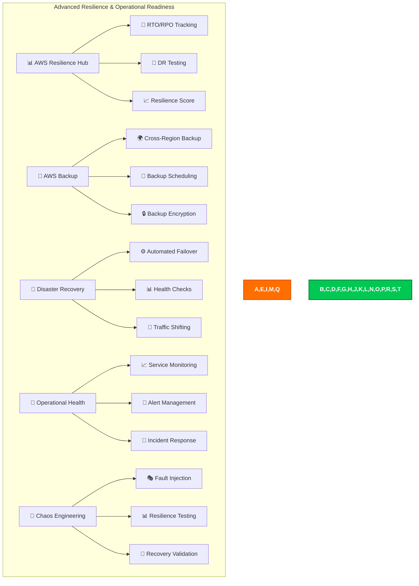

### Implementation

Black Trigram implements advanced resilience and operational readiness:

#### 📊 AWS Resilience Hub

- **✅ Application Assessment**: Continuous evaluation of application resilience with automated scoring
- **✅ RTO/RPO Monitoring**: Real-time tracking of recovery objectives with alerting
- **✅ Resilience Recommendations**: AI-powered suggestions for improvements with implementation guidance
- **✅ Disaster Recovery Testing**: Automated DR scenario execution with comprehensive reporting

#### 💾 Enterprise Backup Strategy

- **✅ Multi-Tier Backup**: Hourly, daily, weekly, and monthly backup schedules with encryption
- **✅ Cross-Region Replication**: DynamoDB Global Tables and S3 cross-region replication
- **✅ Point-in-Time Recovery**: 35-day PITR for DynamoDB tables with automated testing
- **✅ Backup Validation**: Regular restore testing with automated integrity verification

#### 🔄 Automated Disaster Recovery

- **✅ Route53 Health Checks**: Continuous monitoring of application endpoints with failover
- **✅ Automated Failover**: DNS-based failover to secondary region with traffic shifting
- **✅ Database Promotion**: Automated promotion of read replicas during DR scenarios
- **✅ Application Warmup**: Pre-warming of standby infrastructure with performance validation

#### 🏥 Operational Health Monitoring

- **✅ Service Level Indicators**: Key metrics for Korean martial arts application health
- **✅ Service Level Objectives**: Defined targets for user experience with monitoring
- **✅ Error Budget Management**: Tracking and management of reliability budgets
- **✅ Incident Response**: Automated incident detection, escalation, and communication

### Recovery Objectives

- **🎯 RTO (Recovery Time Objective)**: 15 minutes for full service restoration
- **📊 RPO (Recovery Point Objective)**: 5 minutes maximum data loss tolerance
- **🔄 Availability Target**: 99.9% uptime (43.8 minutes downtime per month)
- **📈 Performance Target**: <500ms API response time during failover scenarios

### Korean Martial Arts Resilience Features

- **🥋 Training Continuity**: Minimal disruption to ongoing martial arts training sessions
- **📊 Progress Preservation**: Robust protection and recovery of user advancement data
- **👥 Instructor Availability**: Multi-region support for global dojang operations
- **🏆 Achievement Integrity**: Immutable and recoverable certification records

## 📋 Configuration & Compliance Management

**Status**: ✅ Advanced Configuration Management - Config + Security Hub + Custom Rules

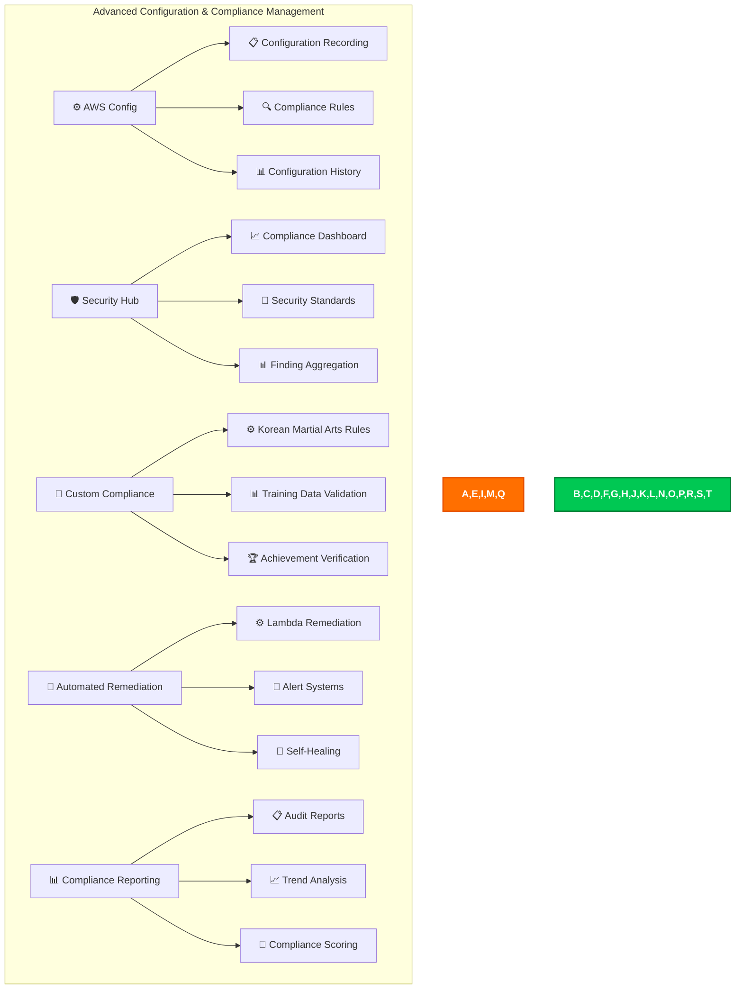

### Implementation

Black Trigram implements advanced configuration and compliance management:

#### ⚙️ AWS Config

- **✅ Multi-Region Recording**: Configuration recording across all deployment regions
- **✅ Resource Relationships**: Comprehensive tracking of dependencies between AWS resources
- **✅ Configuration Timeline**: Historical view of all configuration changes with impact analysis
- **✅ Change Notifications**: Real-time alerts for configuration modifications with approval workflows

#### 🛡️ Security Standards Compliance

- **✅ AWS Foundational Security Best Practices**: Full FSBP compliance with automated remediation
- **✅ PCI DSS**: Payment Card Industry compliance for future payment features
- **✅ ISO 27001**: Information security management standards with certification
- **✅ Custom Standards**: Korean martial arts application-specific security requirements

#### 🔧 Korean Martial Arts Custom Rules

- **✅ Training Data Integrity**: Validation of combat performance data consistency and authenticity
- **✅ Instructor Verification**: Automated verification of instructor credentials and certifications
- **✅ Achievement Validation**: Cryptographic verification of martial arts certifications
- **✅ Progress Validation**: Detection of impossible skill advancement patterns with alerting

#### 🔄 Automated Remediation

- **✅ Self-Healing Infrastructure**: Automatic correction of common misconfigurations
- **✅ Compliance Drift Prevention**: Immediate correction of compliance violations
- **✅ Security Hardening**: Automatic application of security best practices
- **✅ Cost Optimization**: Automated cleanup of unused resources with approval workflows

### Configuration Management Features

- **📊 Configuration Dashboards**: Real-time view of entire infrastructure state
- **🔍 Change Impact Analysis**: Assessment of configuration change impacts with approval
- **📱 Mobile Notifications**: Critical configuration change alerts with details
- **🎯 Compliance Scoring**: Automated calculation of compliance posture with trending

## 📊 Monitoring & Analytics

**Status**: ✅ Comprehensive Monitoring - CloudWatch + Security Lake + Custom Analytics

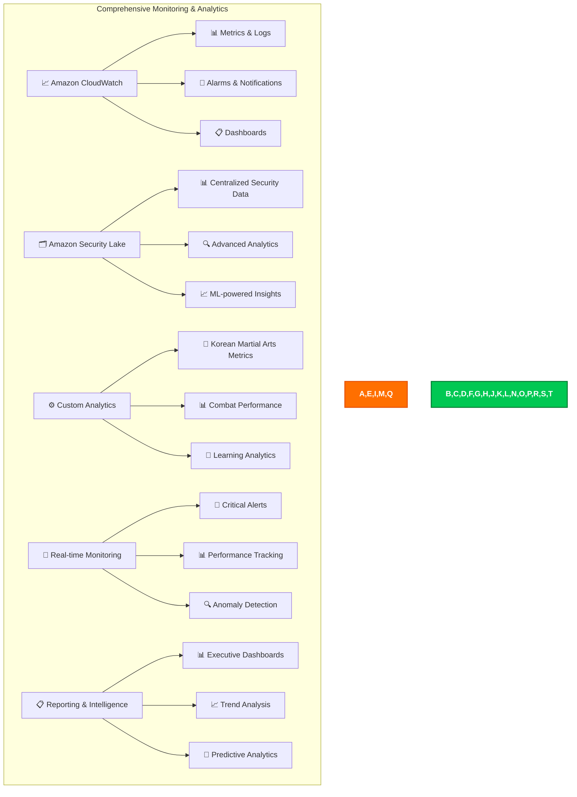

### Implementation

Black Trigram implements comprehensive monitoring and analytics:

#### 📈 Amazon CloudWatch

- **✅ Custom Metrics**: Korean martial arts application-specific metrics with dimensions
- **✅ Log Aggregation**: Centralized logging from all application components with parsing
- **✅ Real-time Dashboards**: Live view of application health and performance with drill-down
- **✅ Intelligent Alarms**: ML-powered anomaly detection and alerting with auto-scaling

#### 🗂️ Amazon Security Lake

- **✅ Security Data Centralization**: All security logs in OCSF format for analysis
- **✅ Advanced Querying**: SQL-based security data analysis with custom queries
- **✅ Third-party Integration**: Support for external security tools and threat intelligence
- **✅ Compliance Reporting**: Automated compliance data aggregation and reporting

#### 🥋 Korean Martial Arts Analytics

- **✅ Vital Point Accuracy Tracking**: Detailed analytics on targeting precision with improvement recommendations
- **✅ Trigram Mastery Progression**: Progress through the eight trigram stances with mastery validation
- **✅ Combat Effectiveness**: Win/loss ratios and technique effectiveness analysis
- **✅ Learning Curve Analysis**: Time to mastery and skill development patterns with personalization

#### 📱 Real-time Monitoring

- **✅ Application Performance**: Response times, error rates, throughput with SLA monitoring
- **✅ User Experience**: Client-side performance and user satisfaction metrics
- **✅ Security Events**: Real-time security incident detection and automated response
- **✅ Infrastructure Health**: AWS service health and resource utilization with optimization

### Analytics and Intelligence

- **📊 Business Intelligence**: Data-driven insights for martial arts education with recommendations
- **🎯 Predictive Analytics**: Forecasting of user engagement and skill development patterns
- **📈 Trend Analysis**: Long-term patterns in user behavior and system performance
- **🔍 Root Cause Analysis**: Automated investigation of performance issues with resolution

## 🤖 Automated Security Operations

**Status**: ✅ Advanced Security Automation - Multi-Service Integration

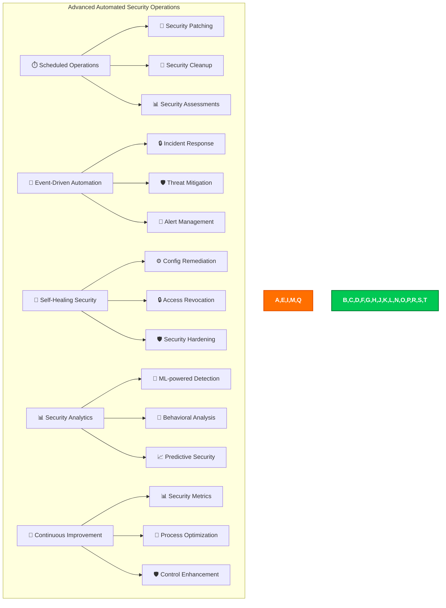

### Implementation

Black Trigram implements advanced automated security operations:

#### ⏱️ Scheduled Security Operations

- **✅ Automated Patching**: Lambda layer updates and dependency patching with testing
- **✅ Security Scanning**: Regular vulnerability assessments with trend analysis
- **✅ Access Reviews**: Periodic review and cleanup of permissions with approval workflows
- **✅ Compliance Validation**: Automated compliance posture assessment with reporting

#### 🚨 Event-Driven Security Automation

- **✅ Incident Response**: Automated response to security events with escalation
- **✅ Threat Containment**: Immediate isolation of compromised resources with investigation
- **✅ Evidence Collection**: Automated forensic data gathering with chain of custody
- **✅ Stakeholder Notification**: Automated alert distribution with communication templates

#### 🔧 Self-Healing Security

- **✅ Configuration Drift**: Automatic correction of security misconfigurations
- **✅ Access Anomalies**: Automated revocation of suspicious access with investigation
- **✅ Security Hardening**: Continuous application of security best practices
- **✅ Policy Enforcement**: Automated enforcement of security policies with exceptions

#### 📊 ML-Powered Security Analytics

- **✅ Anomaly Detection**: Machine learning-based threat detection with custom models
- **✅ User Behavior Analytics**: Detection of unusual user patterns with risk scoring
- **✅ Predictive Security**: Forecasting of potential security issues with prevention
- **✅ Risk Scoring**: Automated risk assessment and prioritization with business context

### Security Automation Benefits

- **⚡ Faster Response**: Automated response reduces mean time to containment
- **🎯 Consistency**: Standardized response procedures reduce human error
- **📊 Scale**: Ability to handle large volumes of security events
- **🔄 Continuous Improvement**:
