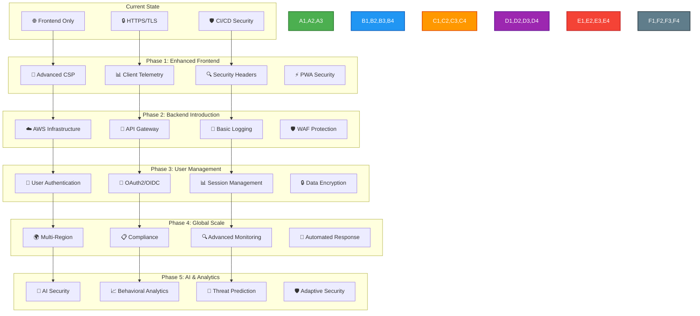
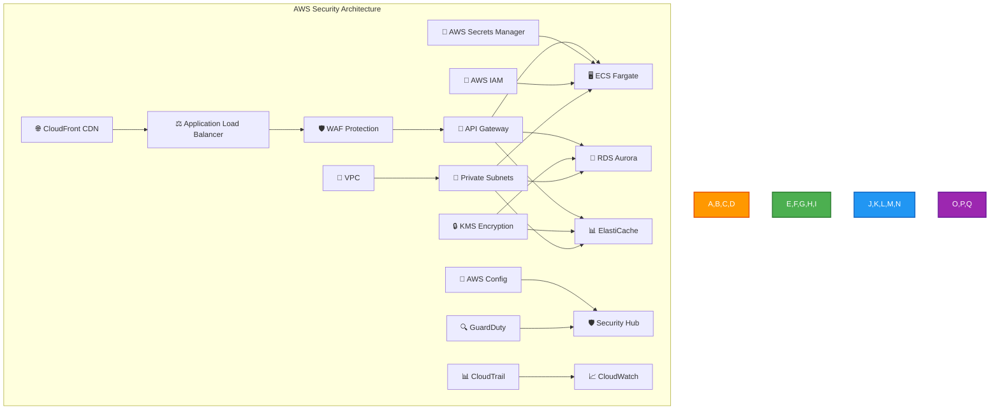
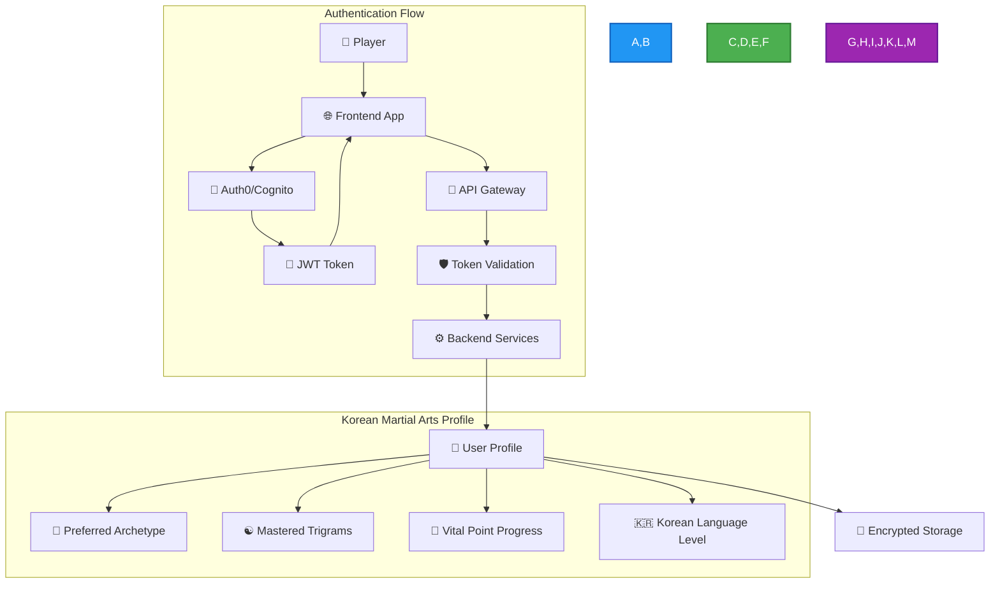
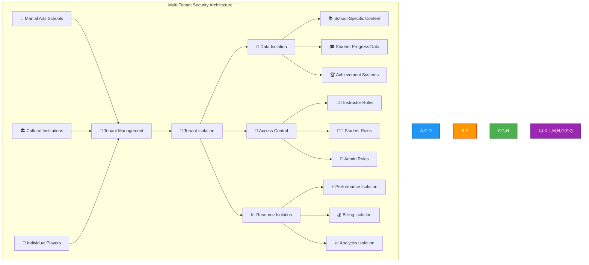
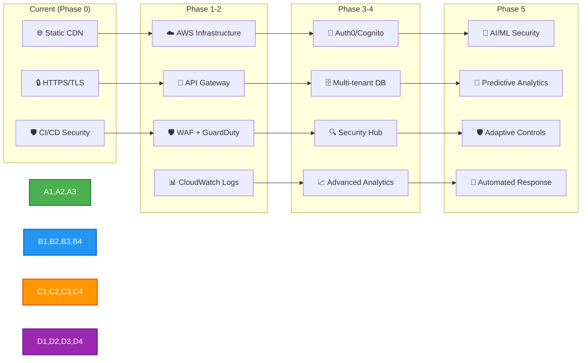
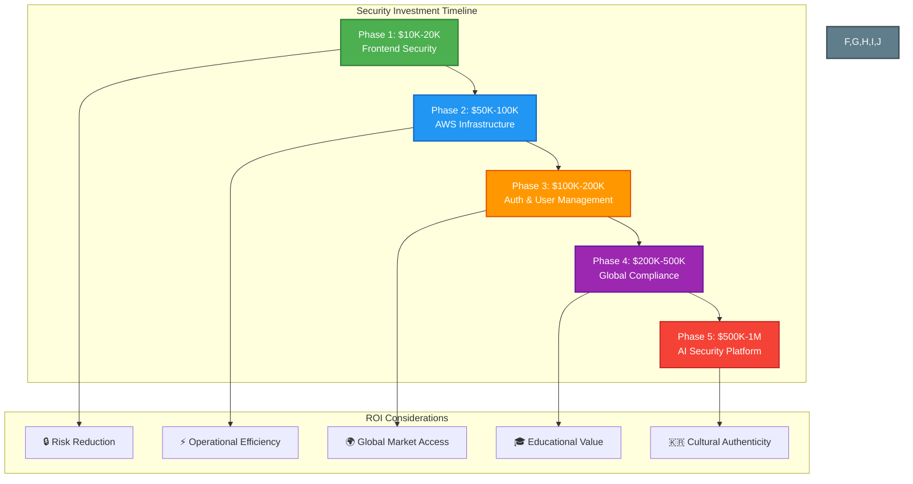
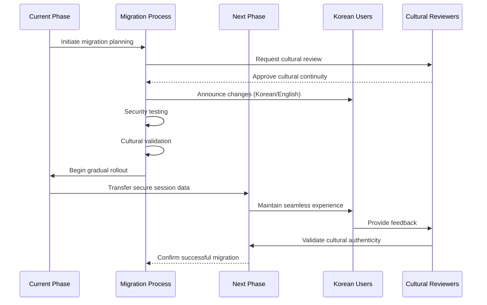
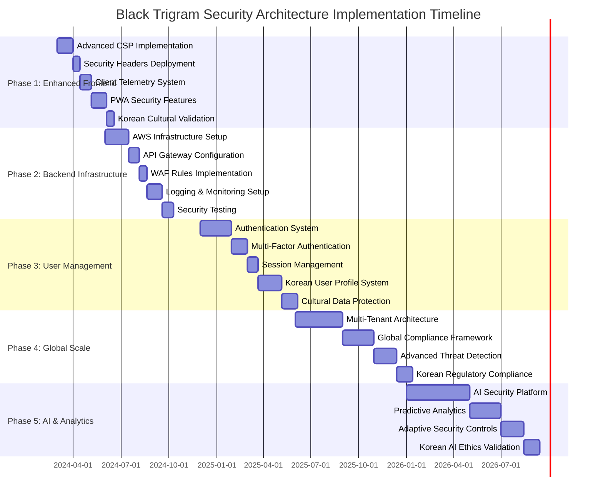

# 🔮 Black Trigram (흑괘) Future Security Architecture

This document outlines the planned security architecture evolution for Black Trigram as it scales from a frontend-only Korean martial arts simulator to a comprehensive platform with backend services, user accounts, and advanced features.

## 📑 Table of Contents

- [🔐 Security Evolution Roadmap](#-security-evolution-roadmap)
- [🚀 Phase 1: Enhanced Frontend Security](#-phase-1-enhanced-frontend-security)
- [🏗️ Phase 2: Backend Infrastructure Introduction](#-phase-2-backend-infrastructure-introduction)
- [👥 Phase 3: User Management & Authentication](#-phase-3-user-management--authentication)
- [🌍 Phase 4: Multi-Tenant & Global Scale](#-phase-4-multi-tenant--global-scale)
- [🤖 Phase 5: AI & Advanced Analytics](#-phase-5-ai--advanced-analytics)
- [🔒 Security Technology Stack Evolution](#-security-technology-stack-evolution)
- [📊 Security Compliance Roadmap](#-security-compliance-roadmap)
- [💰 Security Investment Planning](#-security-investment-planning)
- [🛡️ Risk Assessment & Mitigation](#-risk-assessment--mitigation)
- [📈 Security Metrics & KPIs](#-security-metrics--kpis)
- [🔄 Migration Security Strategy](#-migration-security-strategy)
- [📝 Implementation Timeline](#-implementation-timeline)

## 🔐 Security Evolution Roadmap



## 🚀 Phase 1: Enhanced Frontend Security

**Timeline**: 3-6 months  
**Focus**: Strengthening client-side security without backend dependencies

### 🔐 Advanced Content Security Policy

```typescript
// Enhanced CSP configuration for Korean martial arts application
const advancedCSP = {
  "default-src": ["'self'"],
  "script-src": [
    "'self'",
    "'unsafe-inline'", // Required for PixiJS
    "https://cdnjs.cloudflare.com", // For Korean fonts
    "https://fonts.googleapis.com", // Korean typography
  ],
  "style-src": [
    "'self'",
    "'unsafe-inline'", // Required for dynamic styling
    "https://fonts.googleapis.com", // Korean fonts
  ],
  "font-src": [
    "'self'",
    "https://fonts.gstatic.com", // Korean font files
    "data:", // Base64 encoded fonts
  ],
  "img-src": [
    "'self'",
    "data:", // Base64 images
    "https://*.blacktrigram.com", // Game assets
  ],
  "media-src": [
    "'self'",
    "https://*.blacktrigram.com", // Korean audio assets
  ],
  "connect-src": [
    "'self'",
    "https://api.blacktrigram.com", // Future API endpoints
  ],
  "report-uri": ["/csp-report"], // CSP violation reporting
  "upgrade-insecure-requests": true,
  "block-all-mixed-content": true,
};
```

### 📊 Client-Side Security Telemetry

```typescript
// Security telemetry for Korean martial arts application
interface SecurityTelemetry {
  // Combat session security metrics
  sessionId: string;
  playerArchetype: PlayerArchetype;
  combatMetrics: {
    techniquesAttempted: number;
    vitalPointsTargeted: number;
    sessionDuration: number;
    inputValidationErrors: number;
  };

  // Security event tracking
  securityEvents: {
    cspViolations: CSPViolation[];
    inputSanitizationEvents: SanitizationEvent[];
    browserSecurityFeatures: BrowserSecurityCheck[];
  };

  // Korean cultural content security
  culturalContentAccess: {
    koreanTextRendering: boolean;
    traditionalAudioPlayback: boolean;
    trigramPhilosophyAccess: boolean;
  };
}

class SecurityTelemetryCollector {
  private metrics: SecurityTelemetry;

  constructor() {
    this.initializeSecurityMonitoring();
  }

  private initializeSecurityMonitoring(): void {
    // Monitor CSP violations
    document.addEventListener(
      "securitypolicyviolation",
      this.handleCSPViolation
    );

    // Monitor input validation
    this.setupInputValidationMonitoring();

    // Monitor Korean content security
    this.setupCulturalContentMonitoring();
  }

  private handleCSPViolation = (event: SecurityPolicyViolationEvent): void => {
    const violation: CSPViolation = {
      blockedURI: event.blockedURI,
      violatedDirective: event.violatedDirective,
      originalPolicy: event.originalPolicy,
      timestamp: new Date().toISOString(),
      userAgent: navigator.userAgent,
    };

    this.reportSecurityEvent("csp_violation", violation);
  };

  private reportSecurityEvent(type: string, data: any): void {
    // Store locally for now, send to backend in Phase 2
    const securityLog = {
      type,
      data,
      timestamp: new Date().toISOString(),
      sessionId: this.metrics.sessionId,
    };

    localStorage.setItem(`security_${Date.now()}`, JSON.stringify(securityLog));
  }
}
```

### 🔍 Advanced Security Headers

```typescript
// Security headers configuration for deployment
const securityHeaders = {
  // Strict Transport Security
  "Strict-Transport-Security": "max-age=31536000; includeSubDomains; preload",

  // Content Security Policy (detailed above)
  "Content-Security-Policy": generateCSPHeader(advancedCSP),

  // X-Frame-Options for clickjacking protection
  "X-Frame-Options": "DENY",

  // X-Content-Type-Options
  "X-Content-Type-Options": "nosniff",

  // Referrer Policy
  "Referrer-Policy": "strict-origin-when-cross-origin",

  // Permissions Policy for Korean martial arts features
  "Permissions-Policy": [
    "camera=()", // No camera access needed
    "microphone=()", // No microphone access needed
    "geolocation=()", // No location tracking
    "payment=()", // No payment features yet
    "usb=()", // No USB access
    "accelerometer=(self)", // For motion-based controls
    "gyroscope=(self)", // For stance detection
  ].join(", "),

  // Cross-Origin Embedder Policy
  "Cross-Origin-Embedder-Policy": "require-corp",

  // Cross-Origin Opener Policy
  "Cross-Origin-Opener-Policy": "same-origin",

  // Cross-Origin Resource Policy
  "Cross-Origin-Resource-Policy": "same-origin",
};
```

### ⚡ Progressive Web App Security

```typescript
// PWA security configuration for offline Korean martial arts training
interface PWASecurityConfig {
  serviceWorker: {
    scope: "/";
    updateViaCache: "none";
    securityFeatures: {
      integrityChecks: boolean;
      contentValidation: boolean;
      koreanAssetVerification: boolean;
    };
  };

  manifest: {
    start_url: "/";
    scope: "/";
    display: "standalone";
    orientation: "landscape"; // Optimal for combat training
    theme_color: "#1a1a1a"; // Dark cyberpunk theme
    background_color: "#000000";
    categories: ["education", "games", "sports"];
    lang: "ko"; // Primary language Korean
    dir: "ltr"; // Left-to-right reading
  };

  caching: {
    strategies: {
      koreanAssets: "CacheFirst";
      combatData: "StaleWhileRevalidate";
      trigramData: "CacheFirst";
      audioAssets: "CacheFirst";
    };

    security: {
      validateCacheIntegrity: boolean;
      encryptSensitiveCache: boolean;
      purgeOnSecurityEvent: boolean;
    };
  };
}
```

## 🏗️ Phase 2: Backend Infrastructure Introduction

**Timeline**: 6-12 months  
**Focus**: Introducing secure backend services while maintaining frontend-first approach

### ☁️ AWS Security Infrastructure



### 🔑 API Gateway Security Configuration

```typescript
// API Gateway security for Korean martial arts data
interface APIGatewaySecurityConfig {
  authentication: {
    type: "JWT"; // Preparing for Phase 3 user auth
    issuer: "https://auth.blacktrigram.com";
    audience: "blacktrigram-api";
  };

  throttling: {
    rateLimit: 1000; // requests per second
    burstLimit: 2000; // burst capacity
    quotaLimit: 100000; // daily quota per user
  };

  cors: {
    allowOrigins: ["https://blacktrigram.com", "https://app.blacktrigram.com"];
    allowMethods: ["GET", "POST", "PUT", "DELETE"];
    allowHeaders: [
      "Content-Type",
      "Authorization",
      "X-Korean-Locale",
      "X-Combat-Session"
    ];
    maxAge: 86400;
  };

  validation: {
    requestValidation: true;
    responseValidation: true;
    koreanTextValidation: true;
    combatDataValidation: true;
  };

  logging: {
    accessLogging: true;
    executionLogging: "INFO";
    dataTrace: false; // No sensitive data logging
  };
}
```

### 🛡️ Web Application Firewall Rules

```typescript
// WAF rules specific to Korean martial arts application
const wafRules = {
  // Protection against common attacks
  commonAttacks: {
    sqlInjection: {
      priority: 1,
      action: "BLOCK",
      statement: {
        sqliMatchStatement: {
          fieldToMatch: { body: {} },
          textTransformations: [
            { priority: 0, type: "URL_DECODE" },
            { priority: 1, type: "HTML_ENTITY_DECODE" },
          ],
        },
      },
    },

    xssAttacks: {
      priority: 2,
      action: "BLOCK",
      statement: {
        xssMatchStatement: {
          fieldToMatch: { body: {} },
          textTransformations: [
            { priority: 0, type: "URL_DECODE" },
            { priority: 1, type: "HTML_ENTITY_DECODE" },
          ],
        },
      },
    },
  },

  // Korean martial arts specific protections
  koreanContentProtection: {
    koreanTextValidation: {
      priority: 10,
      action: "COUNT", // Monitor but don't block
      statement: {
        regexMatchStatement: {
          regexString: "^[가-힣a-zA-Z0-9\\s\\-_.,!?()]+$",
          fieldToMatch: { body: {} },
          textTransformations: [{ priority: 0, type: "UNICODE_DECODE" }],
        },
      },
    },

    combatDataValidation: {
      priority: 11,
      action: "BLOCK",
      statement: {
        sizeConstraintStatement: {
          fieldToMatch: { body: {} },
          comparisonOperator: "GT",
          size: 10485760, // 10MB max payload
          textTransformations: [{ priority: 0, type: "NONE" }],
        },
      },
    },
  },

  // Rate limiting for combat sessions
  rateLimiting: {
    combatSessionLimit: {
      priority: 20,
      action: "BLOCK",
      statement: {
        rateBasedStatement: {
          limit: 100, // 100 requests per 5 minutes
          aggregateKeyType: "IP",
          scopeDownStatement: {
            byteMatchStatement: {
              searchString: "/api/combat/",
              fieldToMatch: { uriPath: {} },
              textTransformations: [{ priority: 0, type: "LOWERCASE" }],
              positionalConstraint: "STARTS_WITH",
            },
          },
        },
      },
    },
  },
};
```

### 📄 Centralized Logging Strategy

```typescript
// Centralized logging for Korean martial arts application
interface LoggingStrategy {
  logSources: {
    apiGateway: {
      accessLogs: boolean;
      executionLogs: boolean;
      koreanContentLogs: boolean;
    };

    applicationLogs: {
      combatSessions: boolean;
      trigramTransitions: boolean;
      vitalPointTargeting: boolean;
      koreanCulturalContent: boolean;
    };

    securityLogs: {
      authenticationEvents: boolean;
      authorizationEvents: boolean;
      wafEvents: boolean;
      cspViolations: boolean;
    };
  };

  logDestinations: {
    cloudWatch: {
      retentionDays: 30;
      logGroups: [
        "/aws/apigateway/blacktrigram",
        "/aws/lambda/combat-system",
        "/aws/lambda/trigram-system",
        "/aws/waf/blacktrigram"
      ];
    };

    s3: {
      bucket: "blacktrigram-security-logs";
      encryption: "SSE-KMS";
      lifecyclePolicy: {
        transitionToIA: 30;
        transitionToGlacier: 90;
        expiration: 2555; // 7 years for compliance
      };
    };
  };

  logFormat: {
    timestamp: "ISO8601";
    level: "INFO" | "WARN" | "ERROR";
    source: string;
    koreanLocale: string;
    combatSession?: string;
    playerArchetype?: PlayerArchetype;
    message: string;
    metadata?: Record<string, any>;
  };
}
```

## 👥 Phase 3: User Management & Authentication

**Timeline**: 12-18 months  
**Focus**: Implementing secure user accounts and session management

### 🔐 Authentication Architecture



### 🎫 JWT Token Structure

```typescript
// JWT token structure for Korean martial arts application
interface BlackTrigramJWT {
  // Standard claims
  iss: "https://auth.blacktrigram.com"; // Issuer
  sub: string; // User ID
  aud: "blacktrigram-api"; // Audience
  exp: number; // Expiration time
  iat: number; // Issued at
  jti: string; // JWT ID

  // Korean martial arts specific claims
  custom: {
    // Player profile
    playerArchetype: PlayerArchetype;
    koreanLanguageLevel: "beginner" | "intermediate" | "advanced" | "native";
    preferredLocale: "ko" | "en" | "ko-en";

    // Combat progression
    masteredTrigrams: TrigramStance[];
    vitalPointMastery: {
      critical: number; // 0-100% mastery
      secondary: number;
      standard: number;
    };

    // Training statistics
    combatSessionsCompleted: number;
    totalTrainingHours: number;
    lastActiveDate: string;

    // Permissions
    permissions: [
      "combat:basic",
      "combat:advanced",
      "training:vital-points",
      "training:trigrams",
      "cultural:philosophy",
      "multiplayer:sparring"
    ];

    // Security context
    securityContext: {
      riskLevel: "low" | "medium" | "high";
      lastSecurityCheck: string;
      trustedDevice: boolean;
    };
  };
}
```

### 🔐 Multi-Factor Authentication

```typescript
// MFA configuration for Korean martial arts application
interface MFAConfiguration {
  // Primary authentication factors
  primaryFactors: {
    password: {
      minLength: 12;
      requireUppercase: true;
      requireLowercase: true;
      requireNumbers: true;
      requireSpecialChars: true;
      koreanCharactersAllowed: true;
      bannedPasswords: string[]; // Common Korean passwords
    };

    biometric: {
      fingerprint: boolean;
      faceRecognition: boolean;
      voiceRecognition: boolean; // For Korean pronunciation
    };
  };

  // Secondary authentication factors
  secondaryFactors: {
    sms: {
      enabled: boolean;
      koreanCarriers: string[];
      internationalSupport: boolean;
    };

    email: {
      enabled: boolean;
      koreanEmailProviders: string[];
      secureDelivery: boolean;
    };

    authenticatorApp: {
      enabled: boolean;
      supportedApps: [
        "Google Authenticator",
        "Authy",
        "Microsoft Authenticator"
      ];
      backupCodes: number; // Number of backup codes
    };

    hardwareKey: {
      enabled: boolean;
      supportedKeys: ["YubiKey", "Google Titan"];
      koreanAvailability: boolean;
    };
  };

  // Korean martial arts specific MFA
  martialArtsVerification: {
    enabled: boolean;
    trigramSequenceChallenge: boolean; // Verify trigram knowledge
    vitalPointIdentification: boolean; // Verify anatomical knowledge
    koreanTerminologyTest: boolean; // Verify Korean martial arts terms
  };
}
```

### 📊 Session Management

```typescript
// Session management for Korean martial arts application
interface SessionManagement {
  sessionConfig: {
    maxDuration: 8 * 60 * 60 * 1000; // 8 hours in milliseconds
    idleTimeout: 30 * 60 * 1000; // 30 minutes idle timeout
    combatSessionTimeout: 10 * 60 * 1000; // 10 minutes combat timeout
    slidingExpiration: boolean;
    secureSessionCookies: boolean;
  };

  sessionData: {
    sessionId: string;
    userId: string;
    playerArchetype: PlayerArchetype;
    currentTrigram: TrigramStance;
    activeCombatSession?: CombatSession;
    koreanContentPreferences: KoreanContentPreferences;
    securityFlags: SessionSecurityFlags;
  };

  sessionSecurity: {
    encryption: {
      algorithm: 'AES-256-GCM';
      keyRotation: 24 * 60 * 60 * 1000; // 24 hours
      koreanDataEncryption: boolean;
    };

    integrity: {
      sessionTokenBinding: boolean;
      deviceFingerprinting: boolean;
      ipAddressValidation: boolean;
      userAgentValidation: boolean;
    };

    monitoring: {
      concurrentSessionLimit: 3;
      suspiciousActivityDetection: boolean;
      geoLocationTracking: boolean;
      combatBehaviorAnalysis: boolean;
    };
  };
}
```

## 🌍 Phase 4: Multi-Tenant & Global Scale

**Timeline**: 18-24 months  
**Focus**: Supporting multiple organizations and global deployment

### 🏢 Multi-Tenant Architecture



### 🌐 Global Compliance Framework

```typescript
// Global compliance for Korean martial arts application
interface GlobalComplianceFramework {
  // Regional data protection laws
  dataProtection: {
    gdpr: {
      // European Union
      enabled: boolean;
      dataProcessingBasis: "consent" | "contract" | "legitimate_interest";
      rightsManagement: {
        dataAccess: boolean;
        dataPortability: boolean;
        dataErasure: boolean;
        dataRectification: boolean;
      };
      koreanDataTransfer: {
        adequacyDecision: boolean;
        standardContractualClauses: boolean;
        bindingCorporateRules: boolean;
      };
    };

    ccpa: {
      // California
      enabled: boolean;
      categories: [
        "personal_identifiers",
        "martial_arts_progress",
        "korean_language_preferences",
        "combat_session_data"
      ];
      rightsManagement: {
        knowRight: boolean;
        deleteRight: boolean;
        optOutRight: boolean;
        nonDiscriminationRight: boolean;
      };
    };

    pipa: {
      // South Korea Personal Information Protection Act
      enabled: boolean;
      sensitiveDataCategories: [
        "martial_arts_medical_history",
        "physical_capabilities",
        "korean_cultural_background"
      ];
      crossBorderTransfer: {
        consentRequired: boolean;
        regulatoryApproval: boolean;
        adequateProtectionCountries: string[];
      };
    };
  };

  // Cultural content compliance
  culturalCompliance: {
    koreanCulturalHeritage: {
      respectfulRepresentation: boolean;
      traditionalKnowledgeProtection: boolean;
      culturalSensitivityReview: boolean;
      koreanGovernmentApproval: boolean;
    };

    martialArtsEthics: {
      responsibleTeaching: boolean;
      safetyGuidelines: boolean;
      ageAppropriateContent: boolean;
      medicalDisclaimer: boolean;
    };
  };

  // Educational compliance
  educationalStandards: {
    coppa: {
      // Children's Online Privacy Protection
      enabled: boolean;
      ageVerification: boolean;
      parentalConsent: boolean;
      educationalPurpose: boolean;
    };

    ferpa: {
      // Family Educational Rights and Privacy Act
      enabled: boolean;
      studentRecordProtection: boolean;
      parentalAccess: boolean;
      institutionalCompliance: boolean;
    };
  };
}
```

### 🔍 Advanced Threat Detection

```typescript
// Advanced threat detection for Korean martial arts application
interface AdvancedThreatDetection {
  // Behavioral analysis
  behavioralAnalytics: {
    combatPatternAnalysis: {
      normalBehaviorBaseline: CombatBehaviorProfile;
      anomalyDetection: {
        unusualTechniqueSequences: boolean;
        rapidProgressionDetection: boolean;
        impossibleVitalPointAccuracy: boolean;
        suspiciousTrigramTransitions: boolean;
      };
      machineLearningModels: {
        playerAuthenticityModel: MLModel;
        skillProgressionModel: MLModel;
        culturalKnowledgeModel: MLModel;
      };
    };

    userBehaviorProfiling: {
      loginPatterns: TimeBasedBehavior;
      sessionDuration: DurationBasedBehavior;
      koreanContentInteraction: CulturalBehavior;
      deviceAndLocationPatterns: GeospatialBehavior;
    };
  };

  // Security intelligence
  threatIntelligence: {
    knownThreats: {
      maliciousIPs: string[];
      suspiciousUserAgents: string[];
      koreanAPTGroups: ThreatActorProfile[];
      educationalTargetingCampaigns: ThreatCampaign[];
    };

    realTimeFeeds: {
      externalThreatFeeds: string[];
      koreanCyberThreatFeeds: string[];
      educationalSectorFeeds: string[];
      gamingIndustryFeeds: string[];
    };
  };

  // Automated response
  automatedResponse: {
    responseActions: {
      accountSuspension: AutomatedAction;
      sessionTermination: AutomatedAction;
      accessRestriction: AutomatedAction;
      securityTeamNotification: AutomatedAction;
    };

    koreanSpecificActions: {
      culturalContentLock: boolean;
      koreanLanguageRestriction: boolean;
      martialArtsProgressFreeze: boolean;
      instructorNotification: boolean;
    };
  };
}
```

## 🤖 Phase 5: AI & Advanced Analytics

**Timeline**: 24-36 months  
**Focus**: AI-powered security and adaptive threat protection

### 🧠 AI Security Architecture

```mermaid
flowchart TD
    subgraph "AI Security Platform"
        A[🧠 AI Security Engine] --> B[📊 Behavioral Analytics]
        A --> C[🔮 Threat Prediction]
        A --> D[🛡️ Adaptive Defense]

        B --> E[👤 User Behavior Models]
        B --> F[⚔️ Combat Pattern Analysis]
        B --> G[🇰🇷 Korean Content Interaction]

        C --> H[🔍 Anomaly Detection]
        C --> I[⚠️ Risk Scoring]
        C --> J[📈 Threat Forecasting]

        D --> K[🔄 Dynamic Controls]
        D --> L[⚡ Real-time Response]
        D --> M[🎯 Personalized Security]
    end

    subgraph "Korean Martial Arts AI"
        N[🥋 Technique Validation AI]
        O[☯️ Trigram Philosophy AI]
        P[🎯 Vital Point Accuracy AI]
        Q[🇰🇷 Cultural Authenticity AI]
    end

    A --> N
    A --> O
    A --> P
    A --> Q

    style A fill:#FF5722,stroke:#D84315,stroke-width:3px,color:white
    style B,C,D fill:#3F51B5,stroke:#303F9F,stroke-width:2px,color:white
    style E,F,G,H,I,J,K,L,M fill:#009688,stroke:#00695C,stroke-width:2px,color:white
    style N,O,P,Q fill:#FF9800,stroke:#F57C00,stroke-width:2px,color:white
```



### 🔮 Predictive Security Analytics

```typescript
// Predictive security analytics for Korean martial arts application
interface PredictiveSecurityAnalytics {
  // Machine learning models
  mlModels: {
    userAuthenticityModel: {
      modelType: "RandomForest" | "NeuralNetwork" | "SVM";
      features: [
        "combat_technique_accuracy",
        "korean_terminology_usage",
        "trigram_transition_patterns",
        "vital_point_targeting_precision",
        "cultural_knowledge_depth",
        "session_behavior_patterns"
      ];
      trainingData: {
        authenticatedUsers: number;
        syntheticData: number;
        koreanMartialArtsExperts: number;
      };
      accuracy: number; // 0-1 confidence score
    };

    threatPredictionModel: {
      riskFactors: [
        "unusual_login_patterns",
        "impossible_skill_progression",
        "cultural_insensitivity_flags",
        "suspicious_network_activity",
        "anomalous_combat_behavior"
      ];
      predictionHorizon: "1hour" | "24hours" | "7days";
      alertThresholds: {
        low: number;
        medium: number;
        high: number;
        critical: number;
      };
    };

    culturalAuthenticityModel: {
      koreanLanguageModel: NLPModel;
      martialArtsKnowledgeModel: ExpertSystemModel;
      philosophicalUnderstandingModel: SemanticModel;
      behavioralCulturalModel: BehaviorModel;
    };
  };

  // Real-time analytics
  realTimeAnalytics: {
    streamProcessing: {
      combatSessionStreams: KafkaStream;
      userInteractionStreams: KafkaStream;
      securityEventStreams: KafkaStream;
      koreanContentStreams: KafkaStream;
    };

    edgeAnalytics: {
      browserBasedML: boolean;
      clientSideAnomalyDetection: boolean;
      offlineSecurityValidation: boolean;
      koreanTextProcessing: boolean;
    };
  };

  // Adaptive learning
  adaptiveLearning: {
    continuousLearning: {
      modelRetraining: "daily" | "weekly" | "monthly";
      feedbackIncorporation: boolean;
      expertValidation: boolean;
      koreanCulturalConsultation: boolean;
    };

    personalization: {
      userSpecificModels: boolean;
      archetypeBasedModels: boolean;
      culturalBackgroundModels: boolean;
      skillLevelAdaptation: boolean;
    };
  };
}
```

### 🛡️ Adaptive Security Controls

```typescript
// Adaptive security controls that evolve with threats
interface AdaptiveSecurityControls {
  // Dynamic risk assessment
  riskAssessment: {
    userRiskProfile: {
      baselineRisk: "low" | "medium" | "high";
      currentRiskScore: number; // 0-100
      riskFactors: {
        accountAge: number;
        combatSkillLevel: number;
        koreanCulturalKnowledge: number;
        behavioralConsistency: number;
        deviceTrust: number;
        networkReputation: number;
      };
      adaptiveFactors: {
        recentSecurityEvents: SecurityEvent[];
        peerGroupComparison: PeerComparison;
        expertSystemRecommendations: ExpertRecommendation[];
      };
    };

    contextualRisk: {
      sessionContext: SessionRiskContext;
      combatContext: CombatRiskContext;
      culturalContext: CulturalRiskContext;
      temporalContext: TemporalRiskContext;
    };
  };

  // Adaptive controls
  adaptiveControls: {
    authenticationControls: {
      mfaRequirements: {
        lowRisk: MFAConfig;
        mediumRisk: MFAConfig;
        highRisk: MFAConfig;
      };
      sessionControls: {
        timeoutAdjustment: boolean;
        concurrentSessionLimits: number;
        deviceBindingRequirement: boolean;
      };
    };

    accessControls: {
      featureRestrictions: {
        advancedCombatTechniques: boolean;
        koreanCulturalContent: boolean;
        multiplayerFeatures: boolean;
        instructorTools: boolean;
      };
      contentFiltering: {
        sensitiveKoreanContent: boolean;
        advancedMartialArtsTechniques: boolean;
        culturalPhilosophyContent: boolean;
      };
    };

    monitoringControls: {
      enhancedLogging: boolean;
      realTimeAnalytics: boolean;
      behavioralAnalysis: boolean;
      culturalSensitivityMonitoring: boolean;
    };
  };

  // Continuous adaptation
  continuousAdaptation: {
    learningMechanisms: {
      userFeedback: boolean;
      expertValidation: boolean;
      peerLearning: boolean;
      threatIntelligence: boolean;
    };

    adaptationSpeed: {
      immediateResponse: SecurityControl[];
      hourlyAdjustment: SecurityControl[];
      dailyRecalibration: SecurityControl[];
      weeklyOptimization: SecurityControl[];
    };
  };
}
```

## 🔒 Security Technology Stack Evolution



## 📊 Security Compliance Roadmap

### Phase-by-Phase Compliance Evolution

| Phase       | Compliance Focus | Standards                   | Korean Specific          |
| ----------- | ---------------- | --------------------------- | ------------------------ |
| **Phase 1** | Basic Security   | HTTPS, CSP, OWASP           | Korean Font Security     |
| **Phase 2** | Infrastructure   | AWS Security, SOC 2         | K-ISMS Preparation       |
| **Phase 3** | Data Protection  | GDPR, CCPA, PIPA            | Korean PIPA Compliance   |
| **Phase 4** | Global Scale     | ISO 27001, NIST CSF         | Korean Cultural Heritage |
| **Phase 5** | AI Ethics        | AI Governance, Bias Testing | Korean AI Ethics         |

### 🇰🇷 Korean-Specific Compliance

```typescript
// Korean regulatory compliance requirements
interface KoreanComplianceRequirements {
  // Personal Information Protection Act (PIPA)
  pipa: {
    personalDataCategories: [
      "user_identification",
      "martial_arts_progress",
      "combat_session_data",
      "korean_language_preferences",
      "cultural_background_info"
    ];

    consentManagement: {
      explicitConsent: boolean;
      separateConsentForSensitiveData: boolean;
      withdrawalMechanism: boolean;
      koreanLanguageConsent: boolean;
    };

    dataTransfer: {
      crossBorderTransferNotification: boolean;
      adequateProtectionRequirement: boolean;
      dataSubjectNotification: boolean;
    };
  };

  // Korea Internet & Security Agency (KISA)
  kisa: {
    informationSecurityManagement: {
      kismsCompliance: boolean; // K-ISMS certification
      securityControlFramework: string;
      riskAssessmentProcess: string;
      incidentResponsePlan: string;
    };

    criticalInformationInfrastructure: {
      designation: boolean;
      protectionMeasures: string[];
      reportingRequirements: string[];
    };
  };

  // Cultural Heritage Protection
  culturalHeritage: {
    traditionalKnowledgeProtection: {
      intellectualPropertyRights: boolean;
      culturalSensitivityReview: boolean;
      communityConsent: boolean;
      benefitSharing: boolean;
    };

    martialArtsRepresentation: {
      authenticity: boolean;
      respectfulPortrayal: boolean;
      historicalAccuracy: boolean;
      masterApproval: boolean;
    };
  };
}
```

## 💰 Security Investment Planning

### Investment by Phase



## 🛡️ Risk Assessment & Mitigation

### Security Risks by Phase

| Phase       | Primary Risks               | Mitigation Strategies          | Korean Cultural Risks                        |
| ----------- | --------------------------- | ------------------------------ | -------------------------------------------- |
| **Phase 1** | Client-side vulnerabilities | Enhanced CSP, security headers | Misrepresentation of Korean culture          |
| **Phase 2** | Infrastructure attacks      | AWS security services, WAF     | Inadequate Korean data protection            |
| **Phase 3** | Account compromise          | Strong authentication, MFA     | Cultural insensitivity in user management    |
| **Phase 4** | Compliance violations       | Global compliance framework    | Korean cultural heritage violations          |
| **Phase 5** | AI bias and ethics          | AI governance, bias testing    | Biased representation of Korean martial arts |

### Risk Mitigation Framework

```typescript
// Comprehensive risk mitigation for Korean martial arts application
interface RiskMitigationFramework {
  technicalRisks: {
    dataBreaches: {
      prevention: ["encryption", "access_controls", "monitoring"];
      detection: ["anomaly_detection", "log_analysis", "user_behavior"];
      response: ["incident_response", "forensics", "recovery"];
    };

    systemAvailability: {
      prevention: ["redundancy", "load_balancing", "capacity_planning"];
      detection: ["health_monitoring", "performance_metrics", "alerting"];
      response: ["automated_failover", "disaster_recovery", "communication"];
    };
  };

  culturalRisks: {
    misrepresentation: {
      prevention: [
        "cultural_consultation",
        "expert_review",
        "community_feedback"
      ];
      detection: ["content_monitoring", "user_reports", "cultural_audits"];
      response: [
        "immediate_correction",
        "public_apology",
        "process_improvement"
      ];
    };

    culturalAppropriation: {
      prevention: [
        "proper_attribution",
        "respectful_implementation",
        "benefit_sharing"
      ];
      detection: [
        "community_monitoring",
        "expert_oversight",
        "regular_reviews"
      ];
      response: ["corrective_action", "community_engagement", "policy_updates"];
    };
  };

  complianceRisks: {
    regulatoryViolations: {
      prevention: ["compliance_framework", "regular_audits", "legal_review"];
      detection: [
        "compliance_monitoring",
        "regulatory_updates",
        "gap_analysis"
      ];
      response: [
        "immediate_remediation",
        "regulatory_reporting",
        "process_updates"
      ];
    };

    koreanRegulatory: {
      prevention: ["pipa_compliance", "kisa_guidelines", "cultural_standards"];
      detection: [
        "korean_legal_monitoring",
        "government_communication",
        "industry_updates"
      ];
      response: [
        "rapid_compliance",
        "government_cooperation",
        "public_transparency"
      ];
    };
  };
}
```

## 📈 Security Metrics & KPIs

### Security Success Metrics by Phase

```typescript
// Security KPIs for Korean martial arts application
interface SecurityKPIs {
  phase1Metrics: {
    technicalMetrics: {
      cspViolations: { target: "< 10/day"; current: 0 };
      httpsAdoption: { target: "100%"; current: "100%" };
      securityHeadersCoverage: { target: "100%"; current: "100%" };
    };

    culturalMetrics: {
      koreanContentAccuracy: { target: "99%"; current: "TBD" };
      culturalSensitivityScore: { target: "95%"; current: "TBD" };
      koreanExpertApproval: { target: "100%"; current: "TBD" };
    };
  };

  phase2Metrics: {
    infrastructureMetrics: {
      wafBlockedAttacks: { target: "< 1% false positives" };
      apiGatewayLatency: { target: "< 100ms p95" };
      cloudWatchAlerts: { target: "< 5 false alarms/day" };
    };

    operationalMetrics: {
      securityIncidents: { target: "0 critical incidents" };
      mttr: { target: "< 4 hours" };
      systemUptime: { target: "99.9%" };
    };
  };

  phase3Metrics: {
    authenticationMetrics: {
      accountTakeovers: { target: "0" };
      mfaAdoption: { target: "> 90%" };
      sessionHijacking: { target: "0" };
    };

    userExperienceMetrics: {
      authenticationLatency: { target: "< 2s" };
      koreanUserSatisfaction: { target: "> 90%" };
      culturalAuthenticityRating: { target: "> 95%" };
    };
  };

  phase4Metrics: {
    complianceMetrics: {
      gdprCompliance: { target: "100%" };
      pipaCompliance: { target: "100%" };
      kisaCompliance: { target: "100%" };
    };

    globalMetrics: {
      multiRegionLatency: { target: "< 200ms" };
      dataResidencyCompliance: { target: "100%" };
      culturalLocalizationScore: { target: "> 95%" };
    };
  };

  phase5Metrics: {
    aiSecurityMetrics: {
      aiModelAccuracy: { target: "> 95%" };
      biasMitigationScore: { target: "> 90%" };
      aiDecisionTransparency: { target: "100%" };
    };

    adaptiveSecurityMetrics: {
      threatDetectionAccuracy: { target: "> 98%" };
      falsePositiveRate: { target: "< 2%" };
      adaptationSpeed: { target: "< 1 hour" };
    };
  };
}
```

## 🔄 Migration Security Strategy

### Secure Migration Between Phases



### Zero-Downtime Security Upgrades

```typescript
// Zero-downtime migration strategy for Korean martial arts application
interface ZeroDowntimeMigration {
  migrationPlanning: {
    culturalContinuity: {
      koreanContentMigration: boolean;
      traditionalKnowledgePreservation: boolean;
      userProgressMaintenance: boolean;
      culturalAuthenticityValidation: boolean;
    };

    securityContinuity: {
      sessionContinuity: boolean;
      authenticationMigration: boolean;
      permissionMapping: boolean;
      securityContextPreservation: boolean;
    };

    userExperience: {
      seamlessTransition: boolean;
      koreanLanguageSupport: boolean;
      culturalPreferencesMaintenance: boolean;
      noDataLoss: boolean;
    };
  };

  rolloutStrategy: {
    phases: [
      {
        name: "Korean Expert Validation";
        percentage: 1;
        criteria: "Cultural experts and martial arts masters";
      },
      {
        name: "Korean User Beta";
        percentage: 5;
        criteria: "Native Korean speakers and martial artists";
      },
      {
        name: "Global Martial Arts Community";
        percentage: 20;
        criteria: "International martial arts practitioners";
      },
      {
        name: "General Release";
        percentage: 100;
        criteria: "All users";
      }
    ];

    rollbackCriteria: {
      culturalInsensitivity: boolean;
      securityVulnerabilities: boolean;
      performanceDegradation: boolean;
      userExperienceIssues: boolean;
    };
  };

  validationChecks: {
    automated: [
      "security_scan",
      "performance_test",
      "cultural_content_validation",
      "korean_text_rendering"
    ];

    manual: [
      "cultural_expert_review",
      "martial_arts_master_approval",
      "korean_user_feedback",
      "security_penetration_test"
    ];
  };
}
```

## 📝 Implementation Timeline

### Detailed Phase Timeline with Milestones



### Key Milestones and Decision Points

| Milestone                | Date    | Success Criteria           | Korean Cultural Review           |
| ------------------------ | ------- | -------------------------- | -------------------------------- |
| **Phase 1 Complete**     | Q2 2024 | Enhanced frontend security | Cultural authenticity maintained |
| **Backend MVP**          | Q4 2024 | Secure API operational     | Korean data protection compliant |
| **User Auth Launch**     | Q2 2025 | Authentication system live | Korean user experience approved  |
| **Global Compliance**    | Q4 2025 | Multi-region deployment    | Korean regulatory approval       |
| **AI Security Platform** | Q2 2026 | AI-powered security active | AI ethics review completed       |

---

## 📝 Conclusion

The Black Trigram Future Security Architecture represents a comprehensive, phased approach to evolving from a simple frontend-only Korean martial arts application to a sophisticated, globally-compliant platform with AI-powered security.

### Key Strategic Principles

1. **🇰🇷 Cultural Authenticity First**: Every security decision considers Korean cultural values and martial arts traditions
2. **🛡️ Security by Design**: Security integrated from the beginning, not added as an afterthought
3. **📈 Gradual Evolution**: Phased approach allows for careful validation and community feedback
4. **🌍 Global Perspective**: Designed to serve Korean martial arts practitioners worldwide
5. **🤖 Future-Ready**: Architecture prepared for AI and advanced analytics while maintaining cultural integrity

### Success Factors

- **Community Engagement**: Continuous involvement of Korean martial arts experts and cultural guardians
- **Technical Excellence**: Implementation of industry-leading security practices
- **Cultural Sensitivity**: Respectful representation of Korean traditional knowledge
- **Regulatory Compliance**: Proactive compliance with Korean and international regulations
- **Innovation Balance**: Leveraging modern technology while preserving traditional values

**흑괘의 미래를 안전하게 걸어가자** - _Let's Walk Safely into the Future of the Black Trigram_

This future security architecture ensures that as Black Trigram grows and evolves, it maintains its commitment to authentic Korean martial arts education while providing world-class security protection for its global community of practitioners.
