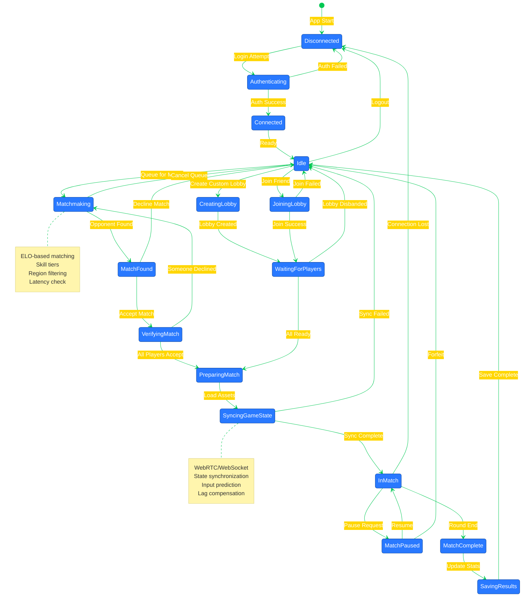
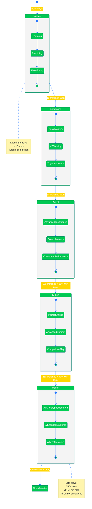
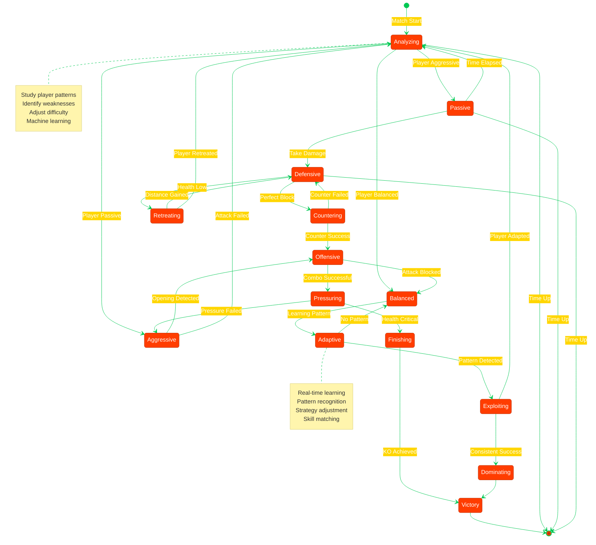
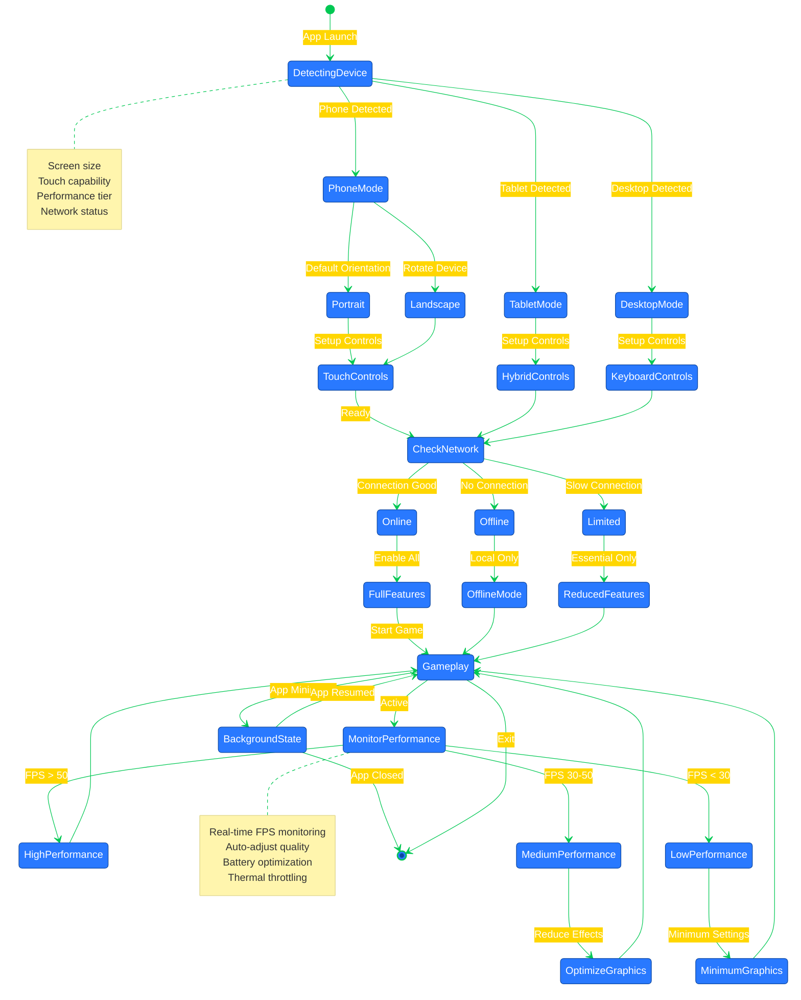

# 🔮 Black Trigram (흑괘) Future State Diagrams

## 📚 Related Documentation

| Document                                      | Focus            | Description                                    |
| --------------------------------------------- | ---------------- | ---------------------------------------------- |
| [Current State Diagram](STATEDIAGRAM.md)      | 🎮 Current States| Current game and combat state machines         |
| [Future Architecture](FUTURE_ARCHITECTURE.md) | 🚀 Future Vision | Planned architectural enhancements             |
| [Future Flowchart](FUTURE_FLOWCHART.md)       | 🔄 Future Flow   | Planned workflow enhancements                  |
| [Data Model](DATA_MODEL.md)                   | 📊 Data          | Type system and data structures                |

---

## 🎯 Overview

This document outlines planned state machine enhancements for Black Trigram (흑괘), documenting future state transitions for multiplayer modes, advanced combat mechanics, and progression systems.

---

## 🌐 Multiplayer Session States

---

## 🏆 Progression System States

---

## 🎓 Tutorial Progress States

```mermaid
%%{init: {'theme':'base', 'themeVariables': {'primaryColor':'#FFD600','primaryTextColor':'#000','primaryBorderColor':'#F57F17','lineColor':'#00C853','secondaryColor':'#2979FF','tertiaryColor':'#FF3D00'}}}%%
stateDiagram-v2
    [*] --> TutorialStart: Begin Tutorial
    
    TutorialStart --> Lesson1: Basics
    
    state Lesson1 {
        [*] --> MovementIntro
        MovementIntro --> MovementPractice
        MovementPractice --> AttackIntro
        AttackIntro --> AttackPractice
        AttackPractice --> [*]
    }
    
    Lesson1 --> Lesson2: Pass Quiz
    
    state Lesson2 {
        [*] --> TrigramIntro
        TrigramIntro --> StancePractice
        StancePractice --> TransitionDrill
        TransitionDrill --> [*]
    }
    
    Lesson2 --> Lesson3: Pass Test
    
    state Lesson3 {
        [*] --> VPAnatomyIntro
        VPAnatomyIntro --> VPCategories
        VPCategories --> VPPractice
        VPPractice --> PrecisionTest
        PrecisionTest --> [*]
    }
    
    Lesson3 --> Lesson4: Precision Passed
    
    state Lesson4 {
        [*] --> CombatIntro
        CombatIntro --> DefensePractice
        DefensePractice --> OffensePractice
        OffensePractice --> FirstSparring
        FirstSparring --> [*]
    }
    
    Lesson4 --> Lesson5: Defeat AI Level 1
    
    state Lesson5 {
        [*] --> AdvancedTechniques
        AdvancedTechniques --> Combos
        Combos --> Counters
        Counters --> FinalTest
        FinalTest --> [*]
    }
    
    Lesson5 --> TutorialComplete: Defeat AI Level 3
    
    TutorialComplete --> [*]: Certified
    
    note right of Lesson3
        70 Vital Points
        Categories explained
        Precision training
        Realistic effects
    end note
```

---

## 🤖 AI Opponent States (Advanced)

---

## 📱 Mobile State Enhancements

---

**흑괘의 길을 걸어라** - _Walk the Path of the Black Trigram into Advanced States_

These future state diagrams document planned state machine enhancements for Black Trigram, including multiplayer session management, progression systems, advanced AI behavior, and mobile optimization states.
