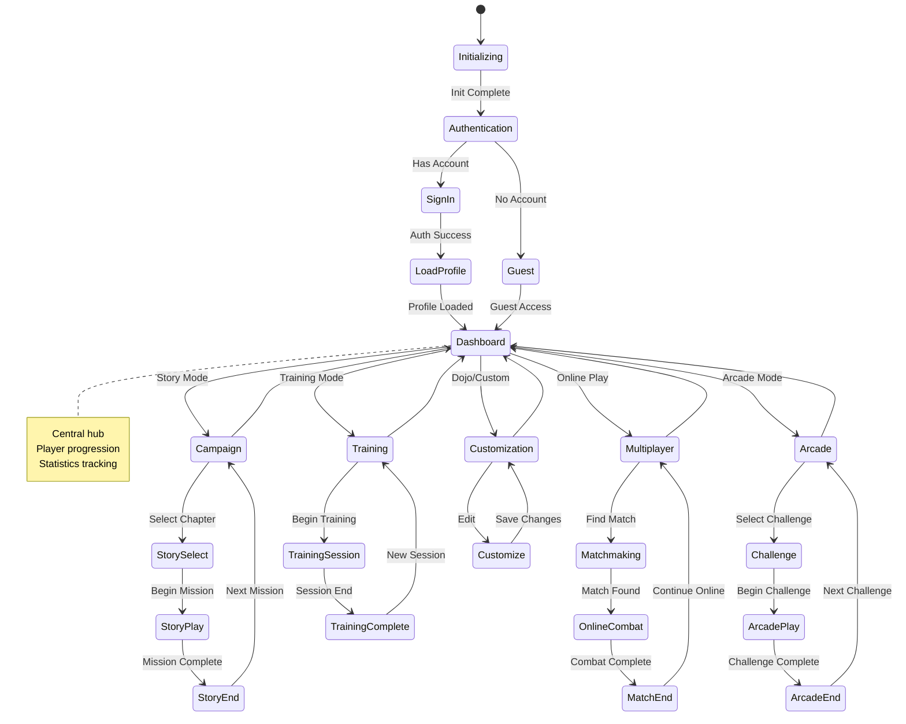
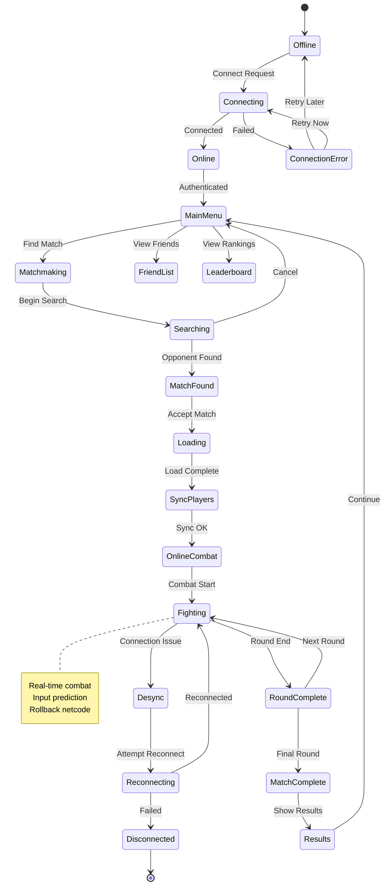
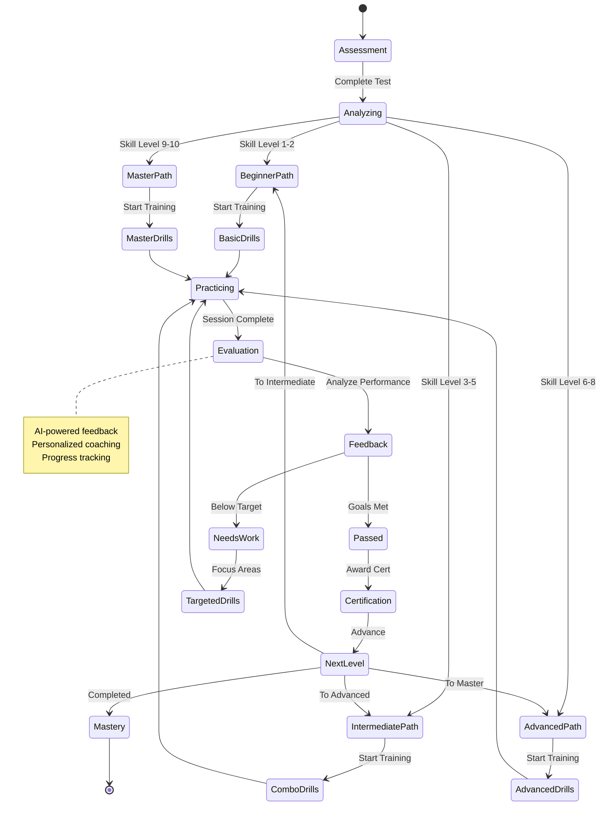
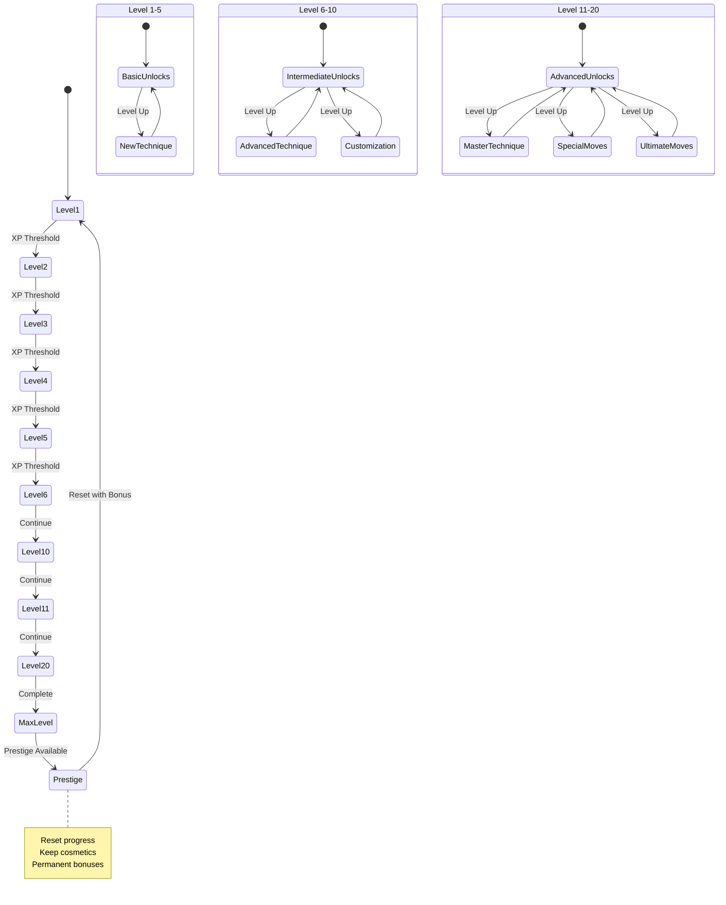
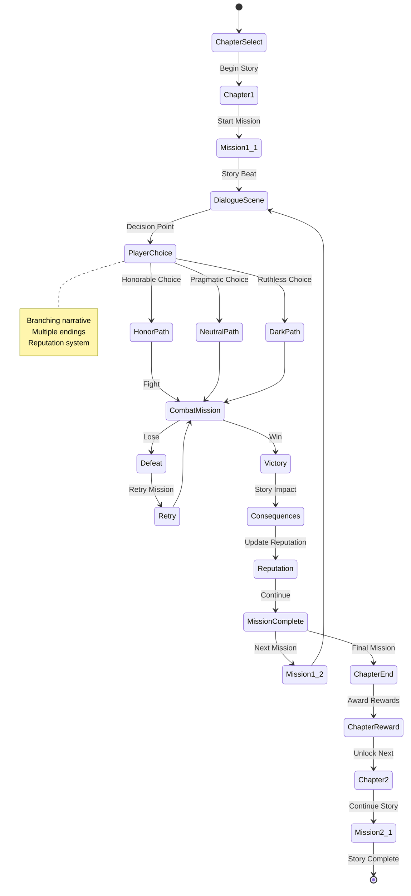
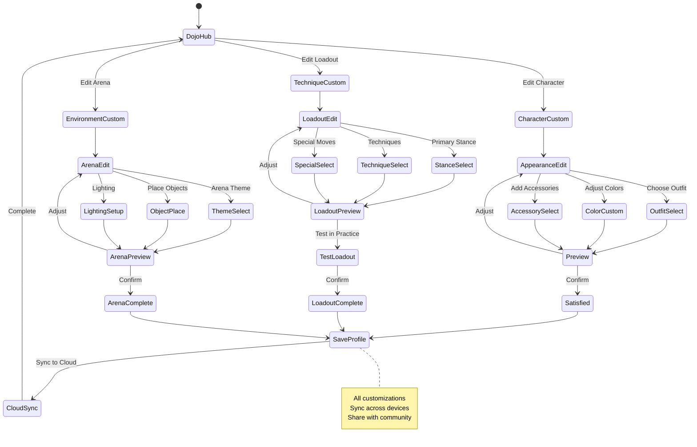

# 🚀 Black Trigram (흑괘) — Future State Diagrams

This document outlines advanced state transition designs for future phases of the Black Trigram Korean martial arts combat simulator.

## 📚 Related Documentation

| Document | Focus | Description |
|----------|-------|-------------|
| [STATEDIAGRAM](STATEDIAGRAM.md) | 🎯 Current | Current state machines |
| [FUTURE_ARCHITECTURE](FUTURE_ARCHITECTURE.md) | 🏛️ Future | Evolutionary architecture |
| [FUTURE_FLOWCHART](FUTURE_FLOWCHART.md) | 🔄 Future Flows | Enhanced workflows |

---

## 🎮 Enhanced Game State Machine (Future)

### **Multi-Mode Game States**

---

## 🌐 Online Multiplayer State Machine (Future)

---

## 🎓 Adaptive Training State Machine (Future)

---

## 🏆 Progression & Unlocks State Machine (Future)

---

## 🎬 Story Campaign State Machine (Future)

---

## 🎨 Advanced Customization State (Future)

---

**📋 Document Control:**  
**✅ Approved by:** CEO  
**📤 Distribution:** Public  
**🏷️ Classification:** Public  
**📅 Effective Date:** 2025-11-14  
**⏰ Next Review:** 2026-11-14  
**🎯 Compliance:** ISO 27001 (A.8.9), NIST CSF (PR.IP-1)
