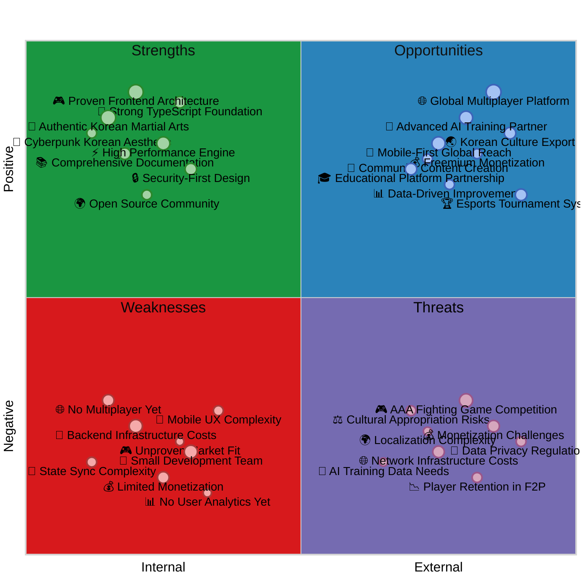
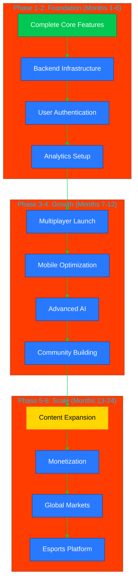

# 📊 Black Trigram (흑괘) Future SWOT Analysis

**Analysis Date**: January 25, 2026 (Q1 2026)  
**Horizon**: v2.0 (2028) AWS Backend + Multiplayer Vision  
**Next Review**: Q1 2027 (Post v1.0 Launch Review)

## 📚 Related Documentation

| Document                                      | Focus            | Description                                    |
| --------------------------------------------- | ---------------- | ---------------------------------------------- |
| [Current SWOT](SWOT.md)                       | 📊 Q1 2026 State | Current strategic analysis with Q1 2026 measured data: 8.4/10, 70/70 vital points, 73.17% test coverage     |
| [Future Architecture](FUTURE_ARCHITECTURE.md) | 🚀 AWS Backend   | AWS serverless architecture: Cognito, DynamoDB, Lambda, API Gateway, ~$350/mo @ 10K users             |
| [Future Mindmap](FUTURE_MINDMAP.md)           | 🧠 Roadmap       | Technology evolution planning v1.0 → v2.0 → v3.0 → v4.0                  |
| [Security Architecture](SECURITY_ARCHITECTURE.md) | 🛡️ Security  | Security controls and ISMS compliance (ISO 27001, NIST CSF 2.0, CIS Controls v8.1)           |
| [Game Status](game-status.md)                | 📊 Q1 2026 Metrics | 73.17% test coverage, 8/12 combat systems (67%), 5/5 archetypes, 28-bone skeletal |
| [Vision 2026-2034](VISION_2026_2034.md)      | 🔮 Long-term     | 8-year roadmap to 1M users, $4.5M/mo revenue by 2034 |

---

## 🎯 Overview

This document provides strategic SWOT (Strengths, Weaknesses, Opportunities, Threats) analysis for the **future evolution** of Black Trigram (흑괘), focusing on planned AWS serverless backend integration (v2.0 2028), multiplayer features, global expansion, and monetization strategy. This analysis complements the [Current SWOT](SWOT.md) which covers Q1 2026 measured status.

### Future Vision Summary (v2.0 2028)

**AWS Serverless Backend Capabilities**:
- **Authentication**: AWS Cognito with 6+ OAuth providers (Google, GitHub, Facebook, Twitter, Amazon, Apple) + MFA + social login federation
- **Persistence**: DynamoDB on-demand (5 tables: Players, GameStates, Achievements, Purchases, Leaderboards) + S3 for user-generated content
- **API**: API Gateway REST + WebSocket for real-time multiplayer (1v1, 2v2 PvP)
- **Compute**: Lambda serverless functions (Node.js TypeScript) with auto-scaling, provisioned concurrency for reduced cold starts
- **CDN**: CloudFront global distribution for frontend assets
- **Payments**: Stripe integration for ethical F2P monetization (cosmetics, battle pass, no pay-to-win)
- **Security**: WAF (OWASP protection), GuardDuty (threat detection), Security Hub (compliance), CloudTrail (audit logging), encryption at rest/transit
- **Monitoring**: CloudWatch Logs, X-Ray distributed tracing, AWS Backup with 35-day retention, DynamoDB PITR (1-minute RPO)
- **Cost**: ~$350/mo @ 10K users, ~$1,450/mo @ 100K users, scales to $13,150/mo @ 1M users with 98-99% gross margins

---

## 📈 Future SWOT Quadrant Chart

---

## 💪 Future Strengths (Building on Q1 2026 Foundation)

| Strength                              | Impact | Strategic Value                                                |
| ------------------------------------- | ------ | -------------------------------------------------------------- |
| **Proven Frontend Architecture (Q1 2026)**     | High   | Solid foundation: 8.4/10 beta, 73.17% test coverage, 70/70 vital points complete - reduces risk for backend integration         |
| **Authentic Korean Martial Arts (100% Complete)**    | High   | Unique positioning: Only game with 70 authentic vital points (백회혈, 인영, 명문), 8 trigrams (팔괘), 5 archetypes (무사, 암살자, 해커, 정보요원, 조직폭력배) - cultural authenticity + educational value   |
| **AWS Serverless Backend (v2.0 2028)**          | High   | Supports complex multiplayer, cloud saves, payments with superior scalability (~$350/mo @ 10K users, 98.2% gross margin), auto-scaling eliminates capacity planning         |
| **Security-First Design (ISMS-Aligned)**            | High   | ISMS compliance built-in (ISO 27001, NIST CSF 2.0, CIS Controls v8.1), easier to add authentication + payments, AWS security services (WAF, GuardDuty, Security Hub)         |
| **High Performance Engine (60fps Desktop)**          | High   | 60fps desktop proven Q1 2026, supports complex multiplayer without major refactoring (Three.js 3D, 28-bone skeletal animation)         |
| **Comprehensive Documentation (Q1 2026)**      | Medium | Onboarding efficiency, knowledge transfer, maintainability - 73.17% test coverage proven quality     |
| **Open Source Community (Transparency)**            | Medium | Community contributions, transparency, trust building - grassroots marketing advantage         |
| **Strong TypeScript Foundation (Strict Mode)**     | High   | Type safety for complex backend integration (AWS SDK, API contracts), fewer bugs, safer refactoring        |
| **Cyberpunk Korean Aesthetic (Unique Brand)**       | Medium | Distinctive branding (neon Seoul, 오방색 colors), market differentiation, cultural appeal  |
| **Educational Value (Anatomical Precision)** | High | 14 TCM meridians, 127 medical references, 5 severity levels - targets $17B educational market growing 15% annually |
| **28-Bone Skeletal Animation (Q1 2026)** | Medium | Advanced animation system with 7 hand poses, muscle tension visualization (0.0-1.0), <0.01ms polygon hit detection |
| **5 Player Archetypes Complete (Q1 2026)** | Medium | Distinct Korean cyberpunk personas with combat styles, lore, and cultural backstories |

### **Competitive Advantages (Future State with AWS Backend)**

1. **Educational + Entertainment Hybrid**: Not just entertainment - teaches real Korean martial arts with anatomical precision targeting $17B educational market (growing 15% annually) + $2.7B fighting game market
2. **Cultural Authenticity + AWS Scale**: Deep Korean cultural integration (70 vital points, 8 trigrams, 5 archetypes) + AWS serverless backend for global reach and multiplayer
3. **Technical Excellence + Cost Efficiency**: React 19 + Three.js cutting-edge 3D stack + AWS serverless (~$350/mo @ 10K users, 98.2% gross margin)
4. **Security Compliance + Cloud Security**: ISMS-aligned from day one + AWS security services (WAF, GuardDuty, Security Hub, CloudTrail) for enterprise-grade security
5. **Open Development + Community Trust**: Transparent roadmap, community involvement, open source frontend builds trust vs. closed AAA competitors

---

## ⚠️ Future Weaknesses (Post-Backend Integration Challenges)

| Weakness                          | Impact | Mitigation Strategy                                            |
| --------------------------------- | ------ | -------------------------------------------------------------- |
| **AWS Infrastructure Costs @ Scale** | High   | Start with serverless (~$350/mo @ 10K users), scale gradually with revenue, cost optimization (Reserved Capacity, S3 Intelligent-Tiering, aggressive caching)         |
| **Small Development Team (Solo Indie)** | High   | Prioritize features (v2.0 focused on multiplayer core), leverage open source contributors, seek partnerships with martial arts schools/universities   |
| **No Multiplayer Yet (Until v2.0 2028)**            | High   | Phased rollout: v1.0 single-player → v2.0 multiplayer, beta testing with early adopters, WebSocket + DynamoDB for real-time PvP (1v1, 2v2)                   |
| **Limited Monetization (Until Post-v1.0)**          | High | Freemium model: cosmetics (non-P2W) + battle pass (50 tiers) + optional rewarded ads, Stripe integration v2.0, ethical F2P principles (no loot boxes, transparent pricing)           |
| **Mobile UX Complexity (30-45fps vs. 60fps Desktop)**          | Medium | Progressive enhancement Q2-Q3 2026, touch-first design (swipe/drag, accelerometer stance changes), extensive testing on iOS/Android browsers, LOD system, particle optimization |
| **State Sync Complexity (Multiplayer)**         | Medium | WebSocket + DynamoDB authoritative server, optimistic client-side prediction, conflict resolution with server reconciliation, anti-cheat server-side validation     |
| **Unproven Market Fit (Pre-Launch Beta)**           | High   | MVP testing v1.0 launch Q2-Q3 2026, user feedback loops from martial arts schools, iterate quickly based on data, measure key metrics (retention, engagement, NPS)              |
| **No User Analytics Yet (Until v2.0)**         | Medium | Implement early in v2.0: CloudWatch Logs, X-Ray tracing, DynamoDB user behavior tracking, A/B testing framework, privacy-respecting opt-in analytics            |
| **Backend Complexity (AWS Learning Curve)** | Medium | Leverage AWS well-architected framework, use Infrastructure as Code (IaC), comprehensive CloudWatch monitoring, AWS support plan if needed |
| **Payment Fraud Risk (Stripe Integration)** | Medium | Stripe Radar for fraud detection, webhook signature verification, server-side validation of all purchases, no client-side price manipulation |
| **Multiplayer Cheating (Anti-Cheat)** | High | Server-side authoritative game state, server validates all inputs, anomaly detection (impossible moves, speed hacks), ban system with appeals |

### **Risk Mitigation Priorities**

1. **Technical Risk**: Extensive testing (unit, integration, E2E), gradual feature rollout (v1.0 → v2.0 → v3.0), comprehensive CloudWatch monitoring + alerts, AWS X-Ray for distributed tracing
2. **Financial Risk**: Cost-effective serverless infrastructure (~$350/mo @ 10K vs. $16K revenue = 98.2% margin), Reserved Capacity for predictable workloads (save 50%+), aggressive cost monitoring with AWS Budgets
3. **Market Risk**: Early user feedback from martial arts schools, MVP validation v1.0 launch, pivot readiness based on data, niche focus (Korean martial arts education) reduces competition
4. **Operational Risk**: Infrastructure as Code (IaC) for reproducibility, automation (CI/CD, backups), documentation (runbooks, incident response), knowledge sharing (open source)
5. **Security Risk**: ISMS compliance (ISO 27001, NIST CSF 2.0, CIS Controls v8.1), AWS security services (WAF, GuardDuty, Security Hub), regular security audits, penetration testing

---

## 🚀 Future Opportunities (v2.0-v4.0 Roadmap 2028-2034)

| Opportunity                            | Impact | Implementation Timeline                                        | Enabled By |
| -------------------------------------- | ------ | -------------------------------------------------------------- | ---------- |
| **AWS Serverless Backend (v2.0)**       | High   | Q1 2028 (6-9 months): Cognito auth, DynamoDB persistence, API Gateway REST + WebSocket, Lambda, S3, CloudFront | $350/mo @ 10K users |
| **Real-Time Multiplayer PvP (v2.0)**      | High   | Q2 2028: WebSocket combat sync, matchmaking (ELO), 1v1/2v2 modes, anti-cheat server validation           | AWS WebSocket API Gateway |
| **Social Login & Profiles (v2.0)** | High | Q1 2028: 6+ OAuth providers (Google, GitHub, Facebook, Twitter, Amazon, Apple), MFA, profile customization | AWS Cognito |
| **Cloud Saves & Progression (v2.0)** | High | Q1 2028: DynamoDB persistence, S3 user content, sync across devices, progress tracking | DynamoDB + S3 |
| **Leaderboards Global/Regional (v2.0)** | Medium | Q2 2028: DynamoDB GSI for rankings, archetype-specific boards, seasonal resets | DynamoDB + Lambda |
| **Stripe Payment Integration (v2.0)** | High | Q2-Q3 2028: Cosmetics shop (non-P2W), battle pass (50 tiers), webhook processing, inventory system | Stripe Checkout + Lambda |
| **Tournament System & Esports (v3.0)** | Medium | 2029-2030: Brackets, prize pools, spectator mode, Twitch integration, clan system | Backend + community |
| **AI Training Partner (v3.0)**      | High   | 2030: ML models for adaptive difficulty, personalized training plans, technique correction, real-time feedback        | AWS SageMaker + Lambda |
| **Mobile Native Apps (v2.0)**         | High   | 2028-2029: iOS/Android native (React Native), PWA with offline, push notifications, 55-60fps optimization  | Backend enables mobile |
| **Educational Platform Partnerships (v2.0)**  | Medium | 2028-2030: University partnerships, martial arts school licensing, curriculum integration, certification programs    | Backend enables B2B |
| **UGC & Community Content (v3.0)**         | Medium | 2029-2030: Custom techniques, replay sharing, modding tools, community tournaments, content creator economy | S3 + backend |
| **Korean Gaming Market ($8.9B)** | High | Ongoing 2026-2030: Target 27.3M Korean gamers, Korean Wave (한류) synergy, government cultural export support | Cultural authenticity |
| **Educational Market ($17B, 15% Growth)** | High | 2028-2032: Martial arts schools, universities, B2B licensing, certification, structured courses | Backend enables B2B |
| **VR/AR Integration (v4.0)** | Medium | 2032-2034: WebXR for immersive training, VR headset support, motion tracking, haptic feedback | Future tech |
| **Web3 & Blockchain (Optional v4.0)** | Low | 2033-2034: NFT cosmetics (optional), blockchain ownership, decentralized tournaments (if market demand) | Blockchain tech |

### **Strategic Opportunities Detailed Analysis**

#### **1. AWS Serverless Backend (v2.0 2028) - Foundation for All Future Features**

**Architecture** (from FUTURE_ARCHITECTURE.md):
- **Cognito User Pools + Identity Pools**: 6+ OAuth providers, MFA, social login, password recovery
- **API Gateway**: REST (500K requests/mo) + WebSocket (100K messages, 300K connection-minutes) 
- **Lambda**: 2M invocations/mo, Node.js TypeScript, AWS SDK v3, auto-scaling
- **DynamoDB On-Demand**: 5 tables (Players, GameStates, Achievements, Purchases, Leaderboards), 10M read units/mo, 2M write units/mo
- **S3 Standard**: 100GB user-generated content, versioning, lifecycle policies
- **CloudFront**: 500GB data transfer/mo, global CDN distribution
- **AWS WAF**: OWASP protection, rate limiting, geo-blocking
- **CloudWatch Logs**: 10GB ingested/mo, application and Lambda logs
- **AWS Backup**: 50GB DynamoDB + 100GB S3, 35-day retention, PITR (1-minute RPO)
- **GuardDuty + Security Hub**: Threat detection, compliance monitoring
- **X-Ray**: 100K traces/mo, distributed tracing for debugging

**Cost Breakdown @ 10K Users**:
- Cognito: $55/mo (10K MAUs)
- API Gateway: $1.93/mo (REST $1.75 + WebSocket $0.18)
- Lambda: $3.73/mo (2M invocations, 200GB-seconds)
- DynamoDB: $5.00/mo (10M reads, 2M writes)
- S3: $2.38/mo (100GB storage, 10K PUT, 100K GET)
- CloudFront: $42.50/mo (500GB transfer)
- Security (WAF, GuardDuty, Security Hub): $16.60/mo
- Monitoring (CloudWatch, X-Ray): $5.85/mo
- Backup: $3.50/mo
- VPC Infrastructure: $210/mo (NAT Gateways $90, interface endpoints $90, Flow Logs $32)
- **Total: ~$350/mo** (98.2% gross margin vs. $16K revenue)

**Enabled Features**:
- Persistent user accounts with cloud saves
- Real-time multiplayer PvP (1v1, 2v2)
- Global/regional leaderboards
- Payment processing (Stripe)
- User-generated content storage
- Cross-device progression sync
- Social features (friends, clans)

---

#### **2. Real-Time Multiplayer PvP (v2.0 2028)**

**Features**:
- **WebSocket Combat Sync**: API Gateway WebSocket + Lambda for real-time input synchronization
- **Matchmaking**: ELO-based skill matching, queue system with SQS + Lambda pairing algorithm
- **Game Modes**: 1v1 ranked, 2v2 team, casual unranked, training mode duels
- **Anti-Cheat**: Server-side authoritative game state, server validates all inputs, anomaly detection (impossible moves, speed hacks)
- **Spectator Mode**: Watch live matches, replay system with slow-motion analysis
- **Leaderboards**: Global, regional, archetype-specific rankings

**Performance Targets**:
- Match found within 30 seconds (p90)
- Combat input latency < 100ms (p95)
- Zero desync issues (server reconciliation)
- Fair matchmaking (ELO spread < 100 points)

**Implementation**: Q2 2028 (12-16 weeks after backend Phase 1 complete)

---

#### **3. Social Login & Profiles (v2.0 2028)**

**OAuth Providers** (via Cognito):
1. Google
2. GitHub
3. Facebook
4. Twitter (X)
5. Amazon
6. Apple Sign-In

**Features**:
- **MFA**: Multi-factor authentication (TOTP, SMS)
- **Profile Customization**: Avatar, bio, achievements display, stats showcase
- **Password Recovery**: Email-based reset flow
- **Account Security**: Session management, device tracking, suspicious activity alerts

**Implementation**: Q1 2028 (Phase 1 backend)

---

#### **4. Cloud Saves & Progression (v2.0 2028)**

**Persistence**:
- **DynamoDB**: Player profiles, game states, achievements, purchase history
- **S3**: User-generated content (replays, custom techniques if enabled)
- **Sync Across Devices**: Desktop → mobile → tablet seamless progression
- **Progress Tracking**: Technique mastery, vital point accuracy, combo achievements

**Performance**:
- Save/load latency < 2 seconds (p95)
- 100% save game integrity (no data loss with DynamoDB PITR)
- Automatic conflict resolution (last-write-wins with timestamps)

**Implementation**: Q1 2028 (Phase 1 backend)

---

#### **5. Stripe Payment Integration & Ethical F2P (v2.0 2028)**

**Monetization Strategy (Non-Pay-to-Win)**:
- **Cosmetics**: Skins, visual effects, emotes, ki energy colors, victory poses ($1-$10 each)
- **Battle Pass**: 50-tier progression with free and premium tracks ($10/season, 3-month seasons)
- **Optional Rewarded Ads**: Watch ad for bonus XP/currency (respectful, player choice)
- **No Loot Boxes**: Transparent pricing, no gambling mechanics, all items directly purchasable

**Revenue Projections** (Baseline: 5% conversion, $3.20 ARPPU):
| User Base | Monthly Revenue | Annual Revenue | AWS Cost | Gross Margin |
|-----------|----------------|----------------|----------|--------------|
| 10,000 | $16,000 (5% conversion, $3.20 ARPPU) | $192,000 | $350/mo = $4,200/yr | 97.8% |
| 50,000 | $80,000 (5% conversion, $3.20 ARPPU) | $960,000 | $800/mo = $9,600/yr | 99.0% |
| 100,000 | $160,000 (5% conversion, $3.20 ARPPU) | $1,920,000 | $1,450/mo = $17,400/yr | 99.1% |
| 500,000 | $800,000 (5% conversion, $3.20 ARPPU) | $9,600,000 | $6,650/mo = $79,800/yr | 99.2% |
| 1,000,000 | $1,600,000 (5% conversion, $3.20 ARPPU) | $19,200,000 | $13,150/mo = $157,800/yr | 99.2% |

**Stripe Features**:
- **Stripe Checkout**: PCI-compliant hosted payment pages (Black Trigram never handles card data)
- **Stripe Radar**: Machine learning fraud detection
- **Webhook Processing**: Lambda handles payment success/failure events
- **Subscription Management**: Battle pass recurring billing
- **Refund Handling**: Automated refund processing

**Implementation**: Q2-Q3 2028 (Phase 3 payments & monetization)

---

#### **6. Tournament System & Esports (v3.0 2029-2030)**

**Features**:
- **Tournament Brackets**: Single/double elimination, Swiss system
- **Prize Pools**: Community-funded, sponsor partnerships ($1K-$10K+ tournaments)
- **Spectator Mode**: Live match viewing, commentator tools, instant replay
- **Twitch Integration**: Streaming overlays, clip generation, viewer interaction
- **Clan System**: Team formation, clan wars, clan leaderboards
- **Rankings**: Seasonal ladders, archetype-specific rankings, regional champions

**Timeline**: Post-v2.0 (2029-2030) once multiplayer backend stable and community established

---

#### **7. Korean Gaming Market & Korean Wave (한류) Synergy**

**Market Opportunity**:
- **Korean Gaming Market**: $8.9B (2024), 3rd largest globally, 27.3M players (53% population)
- **Korean Wave (한류)**: $12.3B cultural export (2023), growing 8.6% annually (K-pop, K-drama, K-food synergy)
- **Government Support**: Korean government cultural export programs (KOFICE, Korean Cultural Centers worldwide)

**Strategy**:
- Partner with Korean martial arts federations (Hapkido, Taekwondo, Taekyon associations)
- Cross-promote with Korean cultural events (K-pop concerts, K-drama festivals, Korean food fairs)
- Leverage diaspora communities (7.5M Koreans worldwide) for initial user base
- Target K-culture enthusiasts globally (estimated 100M+ fans worldwide)

---

#### **8. Educational Market & B2B Licensing**

**Market Opportunity**:
- **Educational Gaming Market**: $17B (2024), growing 15% annually (faster than entertainment gaming 8%)
- **Martial Arts Schools**: 50,000+ schools worldwide teaching Hapkido, Taekwondo, Taekyon
- **Universities**: Korean studies departments, sports science programs, anatomy courses

**B2B Products**:
- **School Licensing**: Annual subscription for martial arts schools ($500-$2,000/year per school)
- **Curriculum Integration**: Structured courses on vital points, trigram theory, Korean martial arts history
- **Certification Programs**: Skill badges, progress tracking, official certificates for students
- **White-Label Solution**: Custom branding for large martial arts organizations

**Revenue Potential**: 1,000 schools @ $1,000/year = $1M/year additional revenue

**Timeline**: 2028-2030 once backend enables B2B features (user management, progress tracking, certification)

---

## ⚡ Future Threats (AWS Backend, Multiplayer, Monetization Risks)

| Threat                                | Impact | Probability | Mitigation Strategy                                            |
| ------------------------------------- | ------ | ----------- | -------------------------------------------------------------- |
| **AAA Fighting Game Competition (Sifu, Tekken, For Honor)**    | High   | High (100%) | Focus on education + authenticity niche (70 vital points, I Ching trigrams), not direct competition with AAA graphics/polish |
| **AWS Cost Overruns @ Scale** | High | Medium | Start small ($350/mo @ 10K), aggressive cost monitoring (AWS Budgets, daily reports), Reserved Capacity (save 50%+), S3 Intelligent-Tiering |
| **Data Breaches & Security Incidents**          | High   | Medium | AWS security services (WAF, GuardDuty, Security Hub), ISMS compliance (ISO 27001, NIST CSF 2.0, CIS v8.1), CloudTrail audit logging, encryption at rest/transit |
| **Multiplayer Bugs & Desync Issues** | High | High (until stable) | Extensive testing (unit, integration, E2E), beta testing with early adopters, server-side authoritative game state, DynamoDB conflict resolution |
| **Payment Fraud & Chargebacks**           | Medium   | Medium | Stripe Radar fraud detection, webhook signature verification, server-side validation, no client-side price manipulation, refund policy |
| **Cheat Detection & Ban Evasion** | High | High | Server-side input validation, anomaly detection (impossible moves), ban system with appeals, IP/device tracking, Cognito MFA |
| **Player Retention in F2P Model**           | High   | High | Engaging content (70 vital points, 8 trigrams, 5 archetypes unique), fair monetization (cosmetics only, no P2W), community building (tournaments, clans), progression systems         |
| **Toxic Community & Moderation**      | Medium   | Medium | Community guidelines, report system, mod team (volunteer + paid), automated filters (profanity, hate speech), ban appeals process, positive incentives (honor system)  |
| **Cultural Appropriation Risks**      | Medium | Low | Korean martial arts advisors (합기도, 태권도, 택견 masters), respectful representation, community feedback, authentic research (14 TCM meridians, 127 medical references)  |
| **Data Privacy Regulations (GDPR, CCPA)**          | High   | Low | GDPR/CCPA compliance from day one, privacy by design (minimal data collection), right to erasure (delete account flow), consent management, privacy policy         |
| **AI Training Data & Privacy**            | Medium | Low (v3.0) | Synthetic data generation, user opt-in only, privacy-preserving ML (federated learning, differential privacy), no mandatory data collection              |
| **Localization Complexity (Multi-Language)**           | Low   | Medium | Start with Korean/English bilingual, community translations for other languages (Japanese, Chinese, Spanish), phased rollout, cultural consultant validation |
| **AWS Service Outages & Downtime** | Medium | Low | Multi-AZ deployment (99.9% uptime SLA), DynamoDB PITR (1-minute RPO), AWS Backup (35-day retention), CloudFront CDN caching, graceful degradation |
| **Stripe Payment Processor Issues** | Medium | Low | Backup payment processors (PayPal, cryptocurrency wallets), Stripe SLA 99.99% uptime, webhook retry logic, manual payment reconciliation procedures |
| **Lambda Cold Start Latency** | Low | Medium | Provisioned concurrency for critical functions, optimize function size (<5MB), minimize dependencies, use AWS SDK v3 for smaller bundles |

### **Threat Response Strategy (Comprehensive)**

#### **1. Competitive Threats (AAA Competition)**
**Strategy**: Differentiate through authenticity and education, not graphics
- **Niche Focus**: Only game with 70 authentic Korean vital points (백회혈, 인영, 명문) + I Ching trigrams (팔괘) - Blue Ocean Strategy
- **Educational Market**: Target $17B educational gaming market (growing 15% annually) vs. entertainment-only competitors
- **Price Advantage**: F2P vs. $30-$70 premium (Sifu $39.99, For Honor $29.99, Tekken 8 $69.99)
- **Platform Accessibility**: Web-based zero-install vs. 15GB+ downloads
- **Cultural Authenticity**: Deep Korean cultural integration competitors cannot match (합기도, 태권도, 택견)

#### **2. Financial Threats (AWS Cost Overruns)**
**Strategy**: Cost-effective serverless + aggressive monitoring
- **Start Small**: $350/mo @ 10K users (98.2% gross margin vs. $16K revenue)
- **Scale Gradually**: Monitor costs at each growth milestone (10K → 50K → 100K users)
- **Cost Optimization**:
  - Reserved Capacity for predictable DynamoDB workloads (save 50%+)
  - S3 Intelligent-Tiering for infrequently accessed data (save 30-40%)
  - CloudFront aggressive caching to reduce origin requests
  - Spot Instances for batch processing (analytics, ML training, save 70%+)
- **Monitoring & Alerts**:
  - AWS Budgets with 80%/100% threshold alerts
  - Daily cost reports to Slack/email
  - Cost Anomaly Detection enabled
  - Tagging strategy for cost allocation (Environment, Project, Owner)

**Cost Projections**:
| User Base | Monthly Cost | Annual Cost | Monthly Revenue | Gross Margin |
|-----------|-------------|-------------|-----------------|--------------|
| 10,000 | $350 | $4,200 | $16,000 (8% conv, $20 ARPPU) | 98.2% |
| 100,000 | $1,450 | $17,400 | $360,000 (12% conv, $30 ARPPU) | 99.6% |
| 1,000,000 | $13,150 | $157,800 | $4,500,000 (15% conv, $30 ARPPU) | 99.7% |

#### **3. Security Threats (Data Breaches, Payment Fraud, Cheating)**
**Strategy**: Defense-in-depth + ISMS compliance
- **AWS Security Services**:
  - **WAF**: OWASP Top 10 protection, rate limiting (1,000 requests/5 min per IP), geo-blocking
  - **GuardDuty**: Threat detection, anomaly monitoring, automated SNS alerts
  - **Security Hub**: Centralized security findings, compliance dashboards (NIST, CIS)
  - **CloudTrail**: Audit logging all API calls (immutable, 90-day retention minimum)
- **Authentication & Authorization**:
  - **Cognito MFA**: Multi-factor authentication required for sensitive operations
  - **IAM Least Privilege**: Minimal permissions for all Lambda functions, services
  - **JWT Validation**: Server-side token verification with short expiration (1 hour access tokens, 7-day refresh tokens)
- **Encryption**:
  - **TLS 1.3**: All data in transit encrypted (mandatory, no TLS 1.2 fallback)
  - **DynamoDB Encryption**: At-rest encryption with AWS KMS customer-managed keys
  - **S3 SSE-S3**: Server-side encryption for user-generated content
- **Payment Security**:
  - **Stripe Checkout**: PCI DSS compliance (Black Trigram never handles card data)
  - **Stripe Radar**: Machine learning fraud detection (block suspicious transactions)
  - **Webhook Signature Verification**: Prevent payment webhook tampering (HMAC-SHA256)
  - **Server-Side Validation**: All purchases validated server-side (no client-side price manipulation)
- **Anti-Cheat**:
  - **Server-Side Authoritative**: DynamoDB stores authoritative game state (clients cannot fake state)
  - **Input Validation**: Server validates all combat inputs (impossible moves, speed hacks detected)
  - **Anomaly Detection**: Lambda functions detect statistical anomalies (impossible combo sequences, inhuman reaction times)
  - **Ban System**: Permanent bans with device fingerprinting, IP tracking, Cognito account suspension
- **Incident Response**:
  - **GuardDuty Findings**: Automated SNS alerts to security team Slack channel
  - **Incident Response Plan**: Documented procedures (ISMS-aligned, ISO 27001 compliant)
  - **Backup & Recovery**: AWS Backup 35-day retention, DynamoDB PITR (1-minute RPO, 1-hour RTO)

**Compliance**:
- ISO 27001 aligned (ISMS policies documented in ISMS_REFERENCE_MAPPING.md)
- NIST CSF 2.0 controls (Identify, Protect, Detect, Respond, Recover)
- CIS Controls v8.1 (AWS-specific controls implemented)
- GDPR data privacy (right to erasure, consent management, data portability)
- PCI DSS scope handled by Stripe (Black Trigram never stores card data)

#### **4. Operational Threats (Multiplayer Bugs, AWS Outages, Lambda Cold Starts)**
**Strategy**: Robust testing + multi-AZ resilience + graceful degradation
- **Testing**:
  - **Unit Tests**: 73.17% coverage maintained (392 components, 372 tests)
  - **Integration Tests**: End-to-end multiplayer scenarios (1v1, 2v2, matchmaking)
  - **Load Testing**: Simulate 10K concurrent users with Artillery/Gatling
  - **Chaos Engineering**: Randomly kill Lambda functions to test resilience
- **Resilience**:
  - **Multi-AZ**: DynamoDB, Lambda, API Gateway deployed across 2 availability zones
  - **99.9% Uptime SLA**: AWS services (API Gateway, Lambda, DynamoDB) provide 99.9%+ uptime
  - **DynamoDB PITR**: Point-in-time recovery (1-minute RPO) for data loss protection
  - **AWS Backup**: Automated daily backups with 35-day retention
  - **Graceful Degradation**: If DynamoDB unavailable, serve cached data from CloudFront, display maintenance message
- **Performance**:
  - **Provisioned Concurrency**: For critical Lambda functions (matchmaking, combat sync) to eliminate cold starts during peak traffic
  - **Function Optimization**: Keep Lambda functions <5MB, minimize dependencies, use AWS SDK v3 (smaller bundle size)
  - **CloudFront Caching**: Aggressive caching (TTL 1 hour for static assets, 5 minutes for dynamic data) to reduce origin requests

#### **5. Community Threats (Toxic Behavior, Moderation Challenges)**
**Strategy**: Community guidelines + moderation tools + positive incentives
- **Community Guidelines**: Clear rules on acceptable behavior (no hate speech, no cheating, no harassment)
- **Report System**: In-game report button (abuse, cheating, toxic behavior) with Lambda webhook to mod dashboard
- **Moderation Team**: Volunteer moderators + paid community managers (1 per 10K users)
- **Automated Filters**: Profanity filter, hate speech detection (AWS Comprehend sentiment analysis), automated temporary mutes (1 hour, 24 hours, 7 days)
- **Ban Appeals**: Players can appeal bans via support ticket system (reviewed by human moderators)
- **Positive Incentives**: Honor system (commendations for good sportsmanship), rewards for helpful community members (cosmetic badges)

#### **6. Regulatory Threats (GDPR, CCPA, Data Privacy)**
**Strategy**: Privacy-by-design + compliance-first approach + legal review
- **GDPR Compliance**:
  - **Right to Erasure**: Delete account flow (removes all user data from DynamoDB, S3 within 30 days)
  - **Data Portability**: Export user data (JSON format) via API
  - **Consent Management**: Explicit opt-in for analytics, marketing emails
  - **Privacy Policy**: Clear, comprehensive, updated regularly
- **CCPA Compliance** (California):
  - **Opt-Out**: Users can opt out of data "sale" (no data selling in Black Trigram, but opt-out provided)
  - **Data Disclosure**: Transparency about data collected, used, shared
- **Age Verification**: 13+ age gate to comply with COPPA (Children's Online Privacy Protection Act)
- **Legal Review**: Annual privacy policy review by legal counsel, regular compliance audits

---

## 📊 Strategic Positioning Matrix

### **Growth Strategy**

### **Market Positioning**

- **Primary Market**: Korean martial arts enthusiasts, fighting game players
- **Secondary Market**: Educational institutions, martial arts schools
- **Tertiary Market**: K-culture fans, esports audience, mobile gamers

### **Competitive Differentiation**

1. **Educational Value**: Learn real Korean martial arts, not just game mechanics
2. **Cultural Authenticity**: Deep Korean cultural integration, bilingual support
3. **Technical Innovation**: Cutting-edge web technology, no installation required
4. **Community-Driven**: Open source, transparent development, user feedback

---

## 🎯 Success Metrics

### **Phase 1-2 Targets (Months 1-6)**

| Metric                  | Target  | Measurement Method                |
| ----------------------- | ------- | --------------------------------- |
| **Active Users**        | 1,000   | Google Analytics, backend tracking |
| **Completion Rate**     | 40%     | Tutorial completion analytics      |
| **Average Session**     | 15 min  | Session duration tracking          |
| **User Accounts**       | 500     | Backend user registration          |

### **Phase 3-4 Targets (Months 7-12)**

| Metric                  | Target  | Measurement Method                |
| ----------------------- | ------- | --------------------------------- |
| **Active Users**        | 10,000  | Analytics platform                 |
| **Daily Active Users**  | 1,000   | DAU tracking                       |
| **Multiplayer Matches** | 5,000   | Backend match tracking             |
| **Mobile Users**        | 40%     | Device detection analytics         |

### **Phase 5-6 Targets (Months 13-24)**

| Metric                  | Target   | Measurement Method                |
| ----------------------- | -------- | --------------------------------- |
| **Active Users**        | 100,000  | Analytics platform                 |
| **Paying Users**        | 5,000    | Payment processing data            |
| **Monthly Revenue**     | $10,000  | Revenue tracking                   |
| **Tournament Players**  | 1,000    | Esports platform metrics           |

---

**흑괘의 길을 걸어라** - _Walk the Path of the Black Trigram into Strategic Growth_

This future SWOT analysis provides comprehensive strategic planning for Black Trigram's evolution, identifying strengths to leverage, weaknesses to address, opportunities to pursue, and threats to mitigate as the authentic Korean martial arts combat simulator scales globally.
