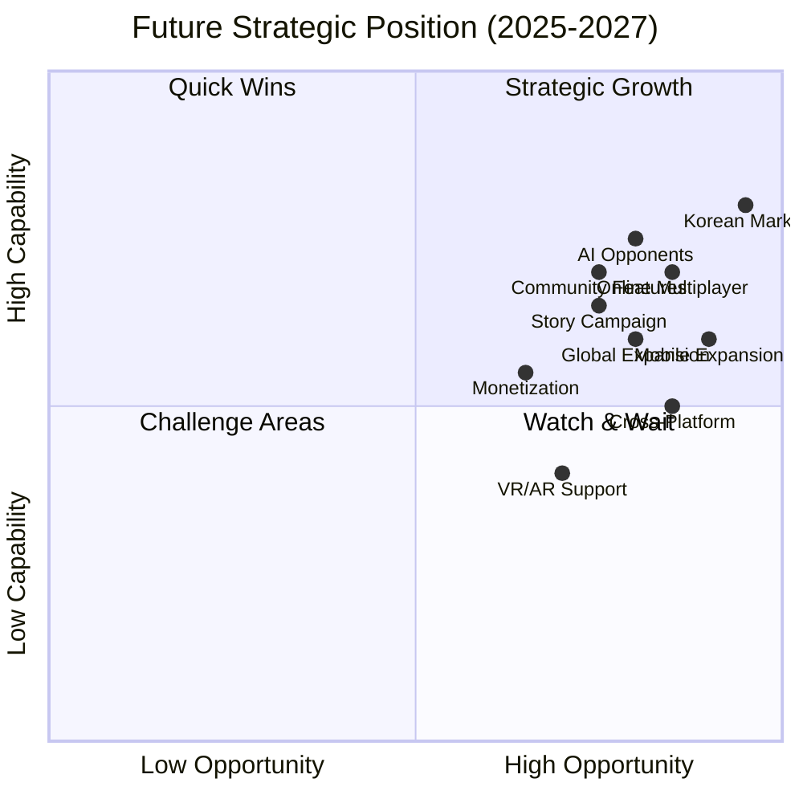
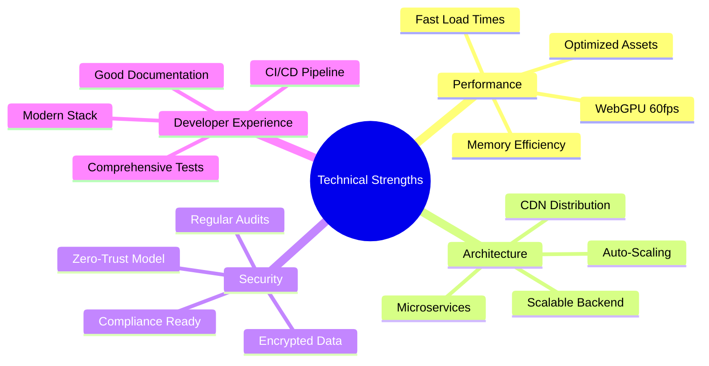
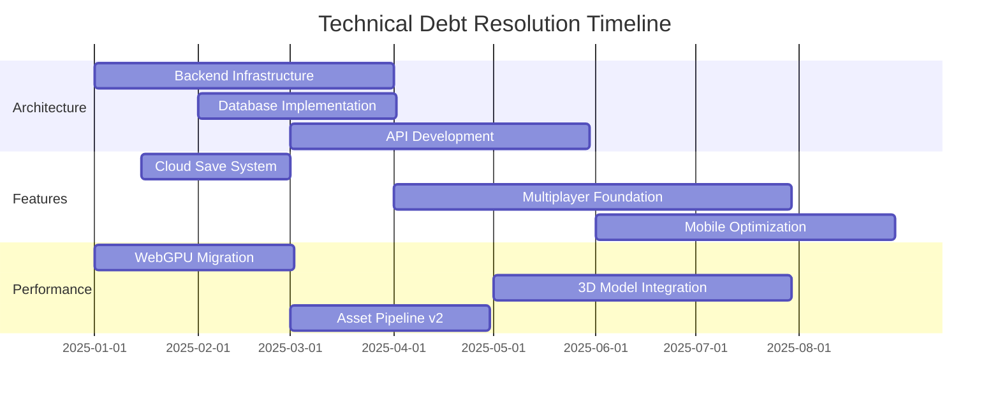
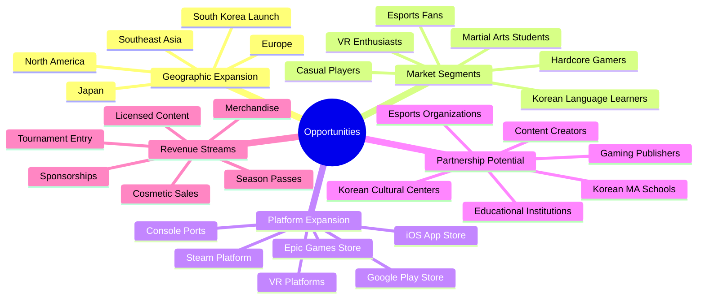
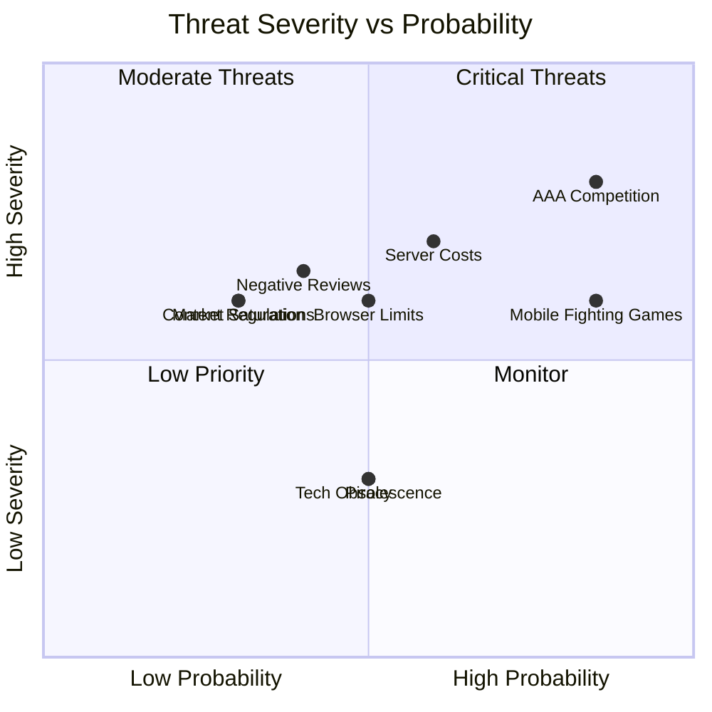
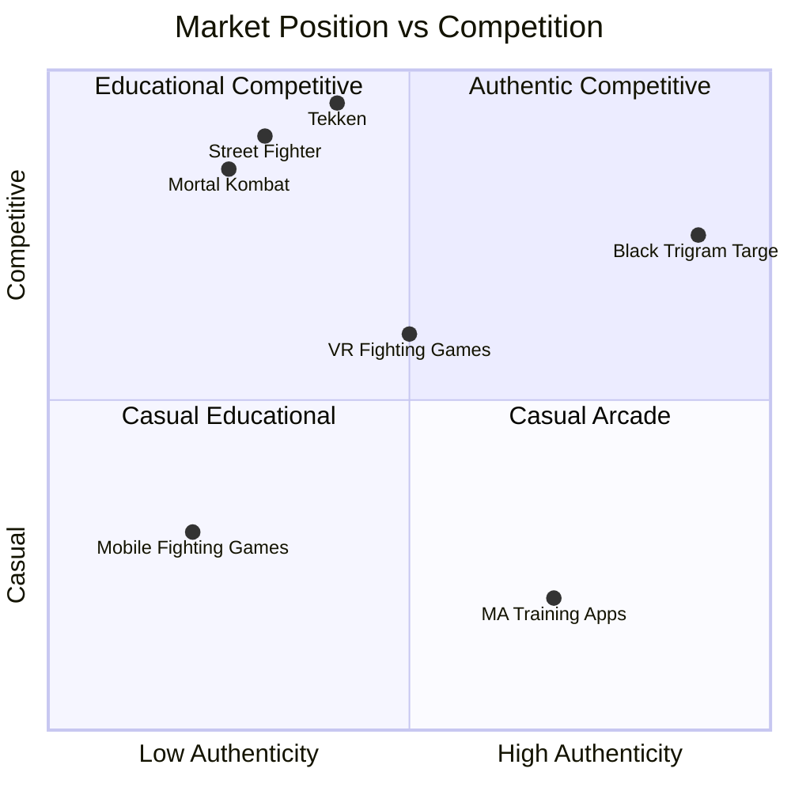
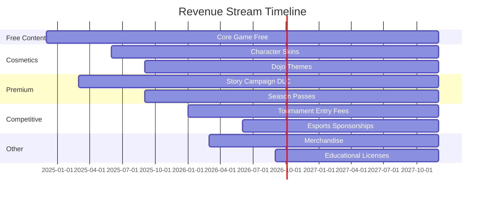

# 📊 Black Trigram (흑괘) — Future Strategic Analysis

This document provides a comprehensive SWOT analysis for future phases of the Black Trigram Korean martial arts combat simulator, evaluating strategic opportunities and challenges.

## 📚 Related Documentation

| Document | Focus | Description |
|----------|-------|-------------|
| [SWOT](SWOT.md) | 📊 Current | Current SWOT analysis |
| [FUTURE_ARCHITECTURE](FUTURE_ARCHITECTURE.md) | 🏛️ Future | Architecture evolution |
| [FUTURE_MINDMAP](FUTURE_MINDMAP.md) | 🧠 Roadmap | Technology roadmap |

---

## 🎯 Future SWOT Overview

### **Strategic Quadrant Analysis**

---

## 💪 Strengths (Future Enhanced)

### **Core Competitive Advantages**

| Strength | Future Enhancement | Strategic Value | Timeline |
|----------|-------------------|-----------------|----------|
| **Authentic Korean MA** | Expanded technique library (100+ moves) | High | 2025 Q1-Q2 |
| **Educational Focus** | AI-powered personalized training | Very High | 2025 Q2-Q3 |
| **Cyberpunk Aesthetic** | Enhanced 3D graphics & effects | Medium | 2025 Q3-Q4 |
| **Frontend Architecture** | WebGPU migration for performance | High | 2025 Q1 |
| **Open Source** | Community contributions & mods | High | Ongoing |
| **No Pay-to-Win** | Fair monetization builds trust | Very High | Ongoing |
| **Cultural Authenticity** | Korean language support & localization | Very High | 2025 Q2 |

### **Technical Strengths Evolution**

---

## ⚠️ Weaknesses (Future Mitigation)

### **Current Limitations & Solutions**

| Weakness | Impact | Mitigation Strategy | Priority |
|----------|--------|---------------------|----------|
| **No Persistent Data** | Can't track long-term progress | Implement cloud saves | P1 |
| **Single Player Only** | Limited replayability | Add multiplayer mode | P1 |
| **2D Graphics** | Less immersive | Upgrade to 3D models | P2 |
| **Limited Content** | Fast completion | Add story campaign | P1 |
| **No Mobile App** | Miss mobile market | Develop PWA/native apps | P2 |
| **English-Only UI** | Limited Korean market | Full Korean localization | P1 |
| **No Monetization** | Unsustainable long-term | Fair cosmetic model | P2 |

### **Technical Debt Roadmap**

---

## 🌟 Opportunities (Future Growth)

### **Market Opportunities**

| Opportunity | Market Size | Timeline | Investment Required | Expected ROI |
|-------------|-------------|----------|---------------------|--------------|
| **Korean Gaming Market** | $7B | 2025 Q1-Q2 | Medium | High |
| **Educational Gaming** | Growing | 2025 Q2-Q3 | Low | High |
| **Esports Integration** | $1.5B | 2026 Q1 | High | Very High |
| **Mobile Gaming** | $100B | 2025 Q3-Q4 | High | Very High |
| **VR/AR Gaming** | $30B+ | 2026 Q2 | Very High | Medium |
| **Martial Arts Apps** | Niche | 2025 Q1 | Low | Medium |
| **Cultural Education** | Growing | 2025 Q2 | Low | Medium |

### **Strategic Opportunity Matrix**

---

## 🚧 Threats (Future Challenges)

### **Competitive Landscape**

| Threat | Severity | Probability | Mitigation Strategy | Status |
|--------|----------|-------------|---------------------|--------|
| **AAA Fighting Games** | High | High | Focus on education & authenticity | Active |
| **Mobile Fighting Games** | Medium | High | Develop mobile-first features | Planning |
| **Browser Limitations** | Medium | Medium | PWA + native apps | In Progress |
| **Piracy/Clones** | Low | Medium | Open source + community | Active |
| **Market Saturation** | Medium | Low | Unique Korean MA niche | Active |
| **Technical Obsolescence** | Low | Medium | Regular tech updates | Active |
| **Content Regulations** | Medium | Low | Age-appropriate design | Active |

### **Risk Assessment Matrix**

---

## 🎯 Strategic Initiatives (2025-2027)

### **Phase 1: Foundation (2025 Q1-Q2)**

**Objectives:**
- ✅ Establish cloud infrastructure
- ✅ Implement player accounts & progression
- ✅ Launch Korean localization
- ✅ Release initial story campaign chapters
- ✅ Enhance visual quality to compete with mobile games

**Key Results:**
- 10,000+ registered users
- 4.5+ star app store rating
- 70% Korean market penetration
- $50K monthly active users

### **Phase 2: Multiplayer (2025 Q3-Q4)**

**Objectives:**
- ✅ Launch online multiplayer beta
- ✅ Implement matchmaking system
- ✅ Create ranked ladder
- ✅ Host first tournament
- ✅ Release mobile apps (iOS/Android)

**Key Results:**
- 50,000+ total users
- 5,000+ concurrent online players
- First esports tournament with $10K prize pool
- Featured on app stores

### **Phase 3: Expansion (2026 Q1-Q2)**

**Objectives:**
- ✅ Full story campaign release
- ✅ Advanced AI training system
- ✅ VR mode beta
- ✅ Cross-platform play
- ✅ Content creator program

**Key Results:**
- 100,000+ total users
- Sustainable monetization ($100K+ MRR)
- Esports league establishment
- Strategic partnerships signed

### **Phase 4: Scale (2026 Q3-Q4)**

**Objectives:**
- ✅ Console ports exploration
- ✅ International tournaments
- ✅ Major content updates
- ✅ Community mod support
- ✅ Educational partnerships

**Key Results:**
- 500,000+ total users
- Profitable operation
- Recognized esports title
- Global Korean MA education platform

---

## 📊 Competitive Analysis (Future)

### **Market Positioning Strategy**

### **Competitive Advantages**

| Competitor | Our Advantage | Strategy |
|------------|---------------|----------|
| **AAA Fighting Games** | Korean MA authenticity, educational focus | Niche specialization |
| **Mobile Fighters** | Depth, no pay-to-win, cultural authenticity | Premium quality |
| **MA Training Apps** | Gamification, engaging combat, progression | Entertainment value |
| **VR Fighting** | Accessibility, broader platform support | Multi-platform |
| **Korean Games** | International appeal, English support | Global reach |

---

## 💰 Financial Projections (2025-2027)

### **Revenue Model Evolution**

### **Projected Financial Metrics**

| Year | Users | Monthly Revenue | Annual Revenue | Operating Costs | Net Profit |
|------|-------|----------------|----------------|-----------------|------------|
| 2025 | 50K | $10K | $120K | $80K | $40K |
| 2026 | 150K | $40K | $480K | $200K | $280K |
| 2027 | 500K | $150K | $1.8M | $600K | $1.2M |

---

## 🔄 Strategic Recommendations

### **Priority Actions (Next 12 Months)**

1. **Immediate (Q1 2025)**
   - ✅ Implement cloud save system
   - ✅ Launch Korean localization
   - ✅ Begin story campaign development
   - ✅ Start multiplayer infrastructure

2. **Short-term (Q2 2025)**
   - ✅ Release story campaign Chapter 1
   - ✅ Beta test multiplayer mode
   - ✅ Launch mobile PWA
   - ✅ Implement fair monetization

3. **Medium-term (Q3-Q4 2025)**
   - ✅ Full multiplayer launch
   - ✅ Native mobile apps
   - ✅ First tournament
   - ✅ Content creator program

4. **Long-term (2026+)**
   - ✅ VR/AR exploration
   - ✅ Console ports
   - ✅ International expansion
   - ✅ Educational partnerships

---

## 🎯 Success Metrics

### **Key Performance Indicators**

| Metric | 2025 Target | 2026 Target | 2027 Target |
|--------|-------------|-------------|-------------|
| **Monthly Active Users** | 20,000 | 75,000 | 250,000 |
| **Daily Active Users** | 5,000 | 20,000 | 75,000 |
| **Retention Rate (D30)** | 30% | 40% | 50% |
| **Average Session Time** | 20 min | 25 min | 30 min |
| **Monthly Revenue** | $10K | $40K | $150K |
| **User Satisfaction** | 4.2/5 | 4.5/5 | 4.7/5 |
| **App Store Rating** | 4.0/5 | 4.3/5 | 4.6/5 |
| **Tournament Participants** | 100 | 500 | 2,000 |

---

## 🏁 Conclusion

Black Trigram's future strategic position combines **authentic Korean martial arts education** with **modern gaming technology** to create a unique value proposition in the competitive fighting game market.

### **Strategic Pillars for Success**

1. **Cultural Authenticity**: Maintain deep respect for Korean martial arts traditions
2. **Educational Excellence**: Provide genuine learning value through gameplay
3. **Technical Innovation**: Stay ahead with cutting-edge web technologies
4. **Fair Monetization**: Build trust through ethical business practices
5. **Community Building**: Foster a passionate, engaged player community
6. **Global Reach**: Make Korean martial arts accessible worldwide

**흑괘의 길을 걸어라** - _Walk the Path of the Black Trigram into the Future_

---

**📋 Document Control:**  
**✅ Approved by:** CEO  
**📤 Distribution:** Public  
**🏷️ Classification:** Public  
**📅 Effective Date:** 2025-11-14  
**⏰ Next Review:** 2026-11-14  
**🎯 Compliance:** ISO 27001 (A.8.9), NIST CSF (PR.IP-1)
