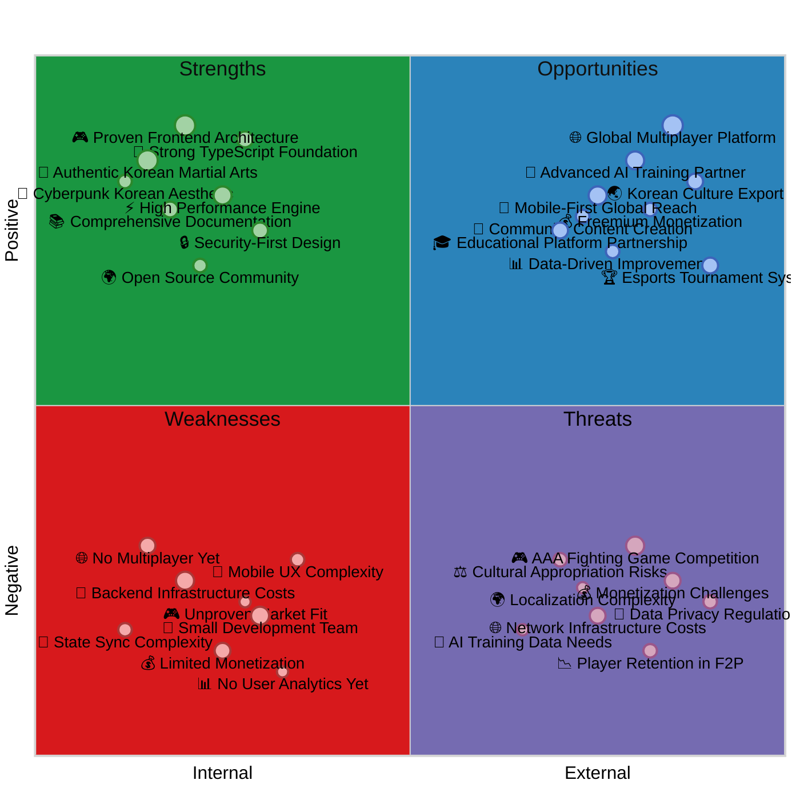
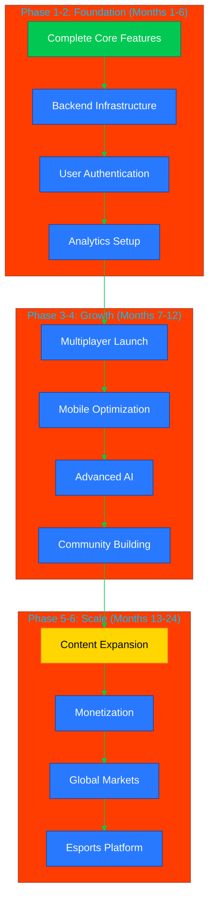

# 📊 Black Trigram (흑괘) Future SWOT Analysis

## 📚 Related Documentation

| Document                                      | Focus            | Description                                    |
| --------------------------------------------- | ---------------- | ---------------------------------------------- |
| [Current SWOT](SWOT.md)                       | 📊 Current State | Current strategic analysis                     |
| [Future Architecture](FUTURE_ARCHITECTURE.md) | 🚀 Future Vision | Planned architectural enhancements             |
| [Future Mindmap](FUTURE_MINDMAP.md)           | 🧠 Roadmap       | Technology evolution planning                  |
| [Security Architecture](SECURITY_ARCHITECTURE.md) | 🛡️ Security  | Security controls and infrastructure           |

---

## 🎯 Overview

This document provides strategic SWOT (Strengths, Weaknesses, Opportunities, Threats) analysis for the future evolution of Black Trigram (흑괘), focusing on planned backend integration, multiplayer features, and global expansion.

---

## 📈 Future SWOT Quadrant Chart

---

## 💪 Future Strengths

| Strength                              | Impact | Strategic Value                                                |
| ------------------------------------- | ------ | -------------------------------------------------------------- |
| **Proven Frontend Architecture**     | High   | Solid foundation for backend integration, reduces risk         |
| **Authentic Korean Martial Arts**    | High   | Unique positioning, cultural authenticity, educational value   |
| **High Performance Engine**          | High   | Supports complex multiplayer without major refactoring         |
| **Security-First Design**            | Medium | ISMS compliance built-in, easier to add authentication         |
| **Comprehensive Documentation**      | Medium | Onboarding efficiency, knowledge transfer, maintainability     |
| **Open Source Community**            | Medium | Community contributions, transparency, trust building          |
| **Strong TypeScript Foundation**     | High   | Type safety for complex backend integration, fewer bugs        |
| **Cyberpunk Korean Aesthetic**       | Medium | Distinctive branding, market differentiation, cultural appeal  |

### **Competitive Advantages**

1. **Educational Focus**: Not just entertainment - teaches real Korean martial arts
2. **Cultural Authenticity**: Deep Korean cultural integration with bilingual support
3. **Technical Excellence**: React 19 + PixiJS 8 cutting-edge stack
4. **Security Compliance**: ISMS-aligned from day one
5. **Open Development**: Transparent roadmap and community involvement

---

## ⚠️ Future Weaknesses

| Weakness                          | Impact | Mitigation Strategy                                            |
| --------------------------------- | ------ | -------------------------------------------------------------- |
| **Backend Infrastructure Costs** | High   | Start with serverless, scale gradually, optimize costs         |
| **Small Development Team**        | High   | Prioritize features, leverage open source, seek partnerships   |
| **No Multiplayer Yet**            | High   | Phased rollout, beta testing, WebRTC for P2P                   |
| **Limited Monetization**          | Medium | Freemium model, cosmetics, battle pass, optional ads           |
| **Mobile UX Complexity**          | Medium | Progressive enhancement, touch-first design, extensive testing |
| **State Sync Complexity**         | Medium | WebSocket + Redis, optimistic updates, conflict resolution     |
| **Unproven Market Fit**           | High   | MVP testing, user feedback loops, iterate quickly              |
| **No User Analytics Yet**         | Medium | Implement early, A/B testing, data-driven decisions            |

### **Risk Mitigation Priorities**

1. **Technical Risk**: Extensive testing, gradual feature rollout, monitoring
2. **Financial Risk**: Cost-effective infrastructure, serverless where possible
3. **Market Risk**: Early user feedback, MVP validation, pivot readiness
4. **Operational Risk**: Automation, documentation, knowledge sharing

---

## 🚀 Future Opportunities

| Opportunity                            | Impact | Implementation Timeline                                        |
| -------------------------------------- | ------ | -------------------------------------------------------------- |
| **Global Multiplayer Platform**       | High   | Phase 3 (Months 7-9): Matchmaking, real-time combat           |
| **Advanced AI Training Partner**      | High   | Phase 4 (Months 10-12): ML models, adaptive difficulty        |
| **Mobile-First Global Reach**         | High   | Phase 4 (Months 10-12): PWA, native apps, touch optimization  |
| **Educational Platform Partnership**  | Medium | Phase 5 (Months 13-18): University partnerships, curriculum    |
| **Esports Tournament System**         | Medium | Phase 5 (Months 13-18): Competitive ladder, prize pools        |
| **Freemium Monetization**             | High   | Phase 6 (Months 19-24): Cosmetics shop, battle pass            |
| **Korean Culture Export**             | Medium | Ongoing: Cultural events, K-culture integration, partnerships  |
| **Data-Driven Improvements**          | High   | Phase 2 (Months 4-6): Analytics platform, user insights        |
| **Community Content Creation**        | Medium | Phase 6 (Months 19-24): Modding tools, UGC, sharing features   |

### **Strategic Opportunities**

1. **Korean Wave (한류)**: Leverage global K-culture popularity
2. **Web3 Gaming**: Optional blockchain integration for ownership
3. **VR/AR Integration**: Future immersive training experiences
4. **B2B Licensing**: Martial arts schools, educational institutions
5. **Content Creator Economy**: Streaming, tutorials, coaching

---

## ⚡ Future Threats

| Threat                                | Impact | Mitigation Strategy                                            |
| ------------------------------------- | ------ | -------------------------------------------------------------- |
| **AAA Fighting Game Competition**    | High   | Focus on education + authenticity niche, not direct competition |
| **Monetization Challenges**           | High   | Diversified revenue streams, optional monetization, value-first |
| **Network Infrastructure Costs**      | High   | P2P where possible, serverless architecture, cost optimization  |
| **Cultural Appropriation Risks**      | Medium | Korean advisors, respectful representation, community feedback  |
| **Data Privacy Regulations**          | High   | GDPR/CCPA compliance, privacy by design, minimal data collection |
| **AI Training Data Needs**            | Medium | Synthetic data, user opt-in, privacy-preserving ML              |
| **Player Retention in F2P**           | High   | Engaging content, fair monetization, community building         |
| **Localization Complexity**           | Medium | Start with Korean/English, community translations, phased rollout |

### **Threat Response Strategy**

1. **Competitive Threats**: Differentiate through authenticity and education
2. **Technical Threats**: Modular architecture, vendor diversification
3. **Regulatory Threats**: Compliance-first approach, legal review
4. **Market Threats**: User-centric design, community engagement

---

## 📊 Strategic Positioning Matrix

### **Growth Strategy**

### **Market Positioning**

- **Primary Market**: Korean martial arts enthusiasts, fighting game players
- **Secondary Market**: Educational institutions, martial arts schools
- **Tertiary Market**: K-culture fans, esports audience, mobile gamers

### **Competitive Differentiation**

1. **Educational Value**: Learn real Korean martial arts, not just game mechanics
2. **Cultural Authenticity**: Deep Korean cultural integration, bilingual support
3. **Technical Innovation**: Cutting-edge web technology, no installation required
4. **Community-Driven**: Open source, transparent development, user feedback

---

## 🎯 Success Metrics

### **Phase 1-2 Targets (Months 1-6)**

| Metric                  | Target  | Measurement Method                |
| ----------------------- | ------- | --------------------------------- |
| **Active Users**        | 1,000   | Google Analytics, backend tracking |
| **Completion Rate**     | 40%     | Tutorial completion analytics      |
| **Average Session**     | 15 min  | Session duration tracking          |
| **User Accounts**       | 500     | Backend user registration          |

### **Phase 3-4 Targets (Months 7-12)**

| Metric                  | Target  | Measurement Method                |
| ----------------------- | ------- | --------------------------------- |
| **Active Users**        | 10,000  | Analytics platform                 |
| **Daily Active Users**  | 1,000   | DAU tracking                       |
| **Multiplayer Matches** | 5,000   | Backend match tracking             |
| **Mobile Users**        | 40%     | Device detection analytics         |

### **Phase 5-6 Targets (Months 13-24)**

| Metric                  | Target   | Measurement Method                |
| ----------------------- | -------- | --------------------------------- |
| **Active Users**        | 100,000  | Analytics platform                 |
| **Paying Users**        | 5,000    | Payment processing data            |
| **Monthly Revenue**     | $10,000  | Revenue tracking                   |
| **Tournament Players**  | 1,000    | Esports platform metrics           |

---

**흑괘의 길을 걸어라** - _Walk the Path of the Black Trigram into Strategic Growth_

This future SWOT analysis provides comprehensive strategic planning for Black Trigram's evolution, identifying strengths to leverage, weaknesses to address, opportunities to pursue, and threats to mitigate as the authentic Korean martial arts combat simulator scales globally.
