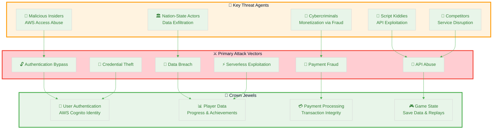
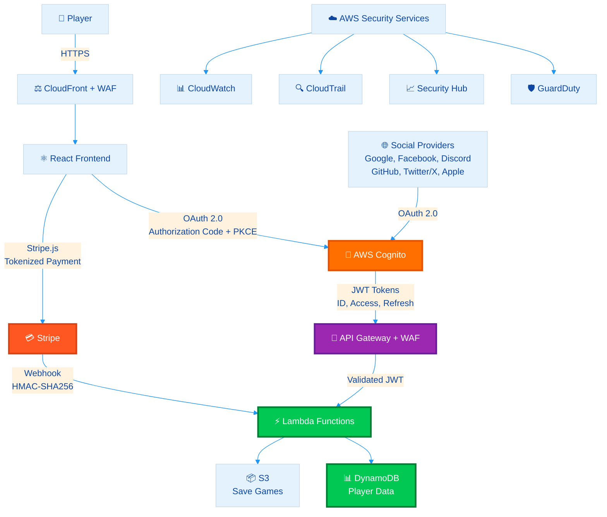
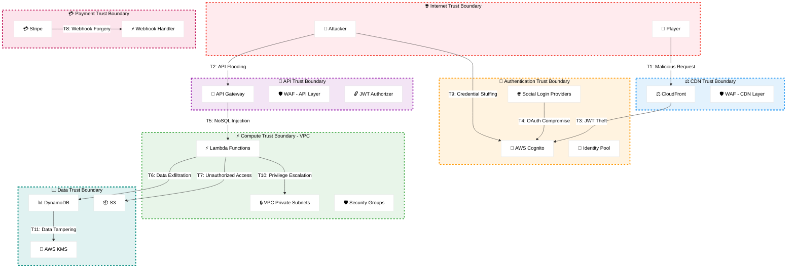
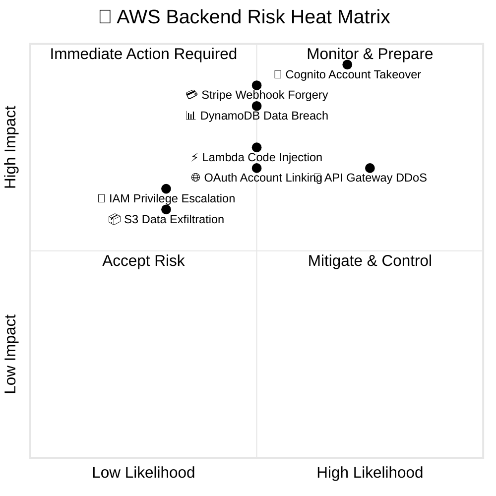

  

<h1 align="center">🎯 Black Trigram (흑괘) — Future Threat Model</h1>

  <strong>🛡️ AWS Serverless Backend Security Through Structured Threat Analysis</strong> 
  <em>🔍 STRIDE • MITRE ATT&CK • Cloud Security • AWS Serverless • Payment Security</em>

  
  
  
  

**📋 Document Owner:** CEO | **📄 Version:** 1.1 | **📅 Last Updated:** 2026-03-19 (UTC)  
**🔄 Review Cycle:** Semi-Annual | **⏰ Next Review:** 2026-09-19  
**🏷️ Classification:** Public (Open Source Educational Gaming Platform)

---

## 🎯 Purpose & Scope

Establish a comprehensive threat model for Black Trigram's future AWS serverless backend architecture. This systematic threat analysis integrates STRIDE methodology and MITRE ATT&CK framework to ensure proactive security through structured analysis of cloud-based authentication, API, database, storage, and payment processing systems.

### **🌟 Transparency Commitment**

This future threat model demonstrates **🛡️ cybersecurity consulting expertise** through public documentation of advanced cloud security threat assessment methodologies, showcasing our **🏆 competitive advantage** via systematic risk management for AWS serverless architectures and **🤝 customer trust** through transparent security practices.

_— Based on Hack23 AB's commitment to security through transparency and excellence_

### **📚 Framework Integration**

- **🎭 STRIDE per architecture element:** Systematic threat categorization for AWS backend components
- **🎖️ MITRE ATT&CK Cloud Matrix:** Cloud-specific attack technique mapping
- **🏗️ Asset-centric analysis:** User data, game state, and payment information protection
- **🎯 Scenario-centric modeling:** Real-world cloud gaming platform attack simulation
- **⚖️ Risk-centric assessment:** Business impact on cloud infrastructure and user trust

### **🔍 Scope Definition**

**Included Systems:**

- 🔐 AWS Cognito authentication (User Pools, Identity Pools, Social Login)
- 🚪 API Gateway (REST + WebSocket endpoints)
- ⚡ AWS Lambda serverless functions
- 📊 DynamoDB tables (player data, game states, achievements)
- 📦 S3 buckets (save games, replays, user-generated content)
- 💳 Stripe payment integration (PCI DSS compliance)
- ⚖️ CloudFront CDN + AWS WAF
- 🔄 AWS Backup and disaster recovery
- 🌐 OAuth 2.0 social login providers (Google, Facebook, Discord, GitHub, Twitter/X, Apple)

**Out of Scope:**

- Frontend client-side threats (covered in [THREAT_MODEL.md](./THREAT_MODEL.md))
- Static asset delivery security (covered in current threat model)
- End-user device security beyond authentication
- Third-party CDN infrastructure (external dependency)

### **🔗 Policy Alignment**

Integrated with:
- [🎯 Hack23 AB Threat Modeling Policy](https://github.com/Hack23/ISMS-PUBLIC/blob/main/Threat_Modeling.md) - STRIDE methodology
- [🛠️ Secure Development Policy](https://github.com/Hack23/ISMS-PUBLIC/blob/main/Secure_Development_Policy.md) - Security architecture requirements
- [🔒 Cryptography Policy](https://github.com/Hack23/ISMS-PUBLIC/blob/main/Cryptography_Policy.md) - Encryption standards
- [🌐 Network Security Policy](https://github.com/Hack23/ISMS-PUBLIC/blob/main/Network_Security_Policy.md) - VPC and WAF configuration
- [🔑 Access Control Policy](https://github.com/Hack23/ISMS-PUBLIC/blob/main/Access_Control_Policy.md) - IAM and RBAC

**Cross-References:**
- [🏗️ FUTURE_ARCHITECTURE.md](./FUTURE_ARCHITECTURE.md) - AWS backend architecture design
- [🛡️ FUTURE_SECURITY_ARCHITECTURE.md](./FUTURE_SECURITY_ARCHITECTURE.md) - Security controls implementation
- [🔐 THREAT_MODEL.md](./THREAT_MODEL.md) - Current frontend-only threat model

---

## 📊 System Classification & Operating Profile

### **🏷️ Security Classification Matrix**

| Dimension              | Level                                                                                                                                                                      | Rationale                                                              | Business Impact                                                                                                                                                                  |
| ---------------------- | -------------------------------------------------------------------------------------------------------------------------------------------------------------------------- | ---------------------------------------------------------------------- | -------------------------------------------------------------------------------------------------------------------------------------------------------------------------------- |
| **🔐 Confidentiality** |    | User accounts, personal data, payment information |       |
| **🔒 Integrity**       |         | Game state accuracy, payment transaction integrity critical |  |
| **⚡ Availability**    |  | Real-time multiplayer and payment processing require high availability             |           |

### **⚖️ Regulatory & Compliance Profile**

| Compliance Area                      | Classification                | Implementation Status                                 |
| ------------------------------------ | ----------------------------- | ----------------------------------------------------- |
| **📋 Regulatory Exposure**           | High                           | Personal data collection, payment processing |
| **💳 PCI DSS**                       | Required                       | Stripe handles card data, webhook security critical |
| **🇪🇺 GDPR**                         | Required                       | EU user data protection, right to deletion |
| **🇪🇺 CRA (EU Cyber Resilience Act)** | Standard classification       | Cloud-based commercial software |
| **🔄 RPO / RTO**                     | RPO: 1 hour / RTO: 4 hours      | Multi-region backup, automated recovery                 |

---

## 💎 Critical Assets & Protection Goals

### **🏗️ Asset-Centric Threat Analysis**

Following [Hack23 AB Asset-Centric Threat Modeling](https://github.com/Hack23/ISMS-PUBLIC/blob/main/Threat_Modeling.md#asset-centric-threat-modeling) methodology:

| Asset Category           | Why Valuable                               | Threat Goals                                   | Key Controls                                         | Business Value                                                                                                                                                                   |
| ------------------------ | ------------------------------------------ | ---------------------------------------------- | ---------------------------------------------------- | -------------------------------------------------------------------------------------------------------------------------------------------------------------------------------- |
| **👤 User Accounts**    | Authentication and identity              | Account takeover, credential theft      | MFA, JWT validation, password policies                   |       |
| **📊 Player Data**  | Game progress and personal information           | Data breach, unauthorized access  | KMS encryption, IAM policies, row-level security            |    |
| **💳 Payment Data**       | Transaction history and financial information      | Payment fraud, data exfiltration                  | PCI DSS compliance, webhook signature verification, Stripe.js tokenization   |  |
| **🎮 Game State**     | Save games and player progress                | Progress manipulation, data loss   | Encryption at rest, backup automation, version control         |                 |
| **⚡ Lambda Functions**  | Business logic and API handlers           | Code injection, privilege escalation    | Least privilege IAM, input validation, secrets management   |      |
| **🚪 API Endpoints** | Gateway to backend services | API abuse, DDoS attacks | WAF rules, rate limiting, JWT authentication |      |
| **🔑 OAuth Credentials**   | Social login tokens and secrets       | Token theft, session hijacking             | Short-lived tokens, refresh rotation, state parameter validation             |          |
| **📦 AWS Infrastructure** | Cloud resources and configuration | Resource compromise, lateral movement               | VPC isolation, security groups, CloudTrail logging               |           |

### **🔐 Crown Jewel Analysis**

---

## 🏗️ AWS Backend Architecture Context

### **Backend System Architecture**

### **🔒 Trust Boundaries & Attack Surface**

---

## 🎭 STRIDE Threat Analysis by Component

### **🔐 AWS Cognito Authentication System**

| Threat Category | Threat Description | Attack Vector | Severity | Likelihood | Mitigation | MITRE ATT&CK |
|-----------------|-------------------|---------------|----------|------------|------------|--------------|
| **Spoofing** | Attacker impersonates legitimate user | Stolen JWT tokens, session hijacking, replay attacks | Critical | Medium | Short-lived tokens (1hr), MFA required, refresh token rotation, Cognito security headers | [T1078](https://attack.mitre.org/techniques/T1078/) - Valid Accounts |
| **Spoofing** | Social login account takeover | Compromised social provider account linked to game account | High | Medium | Email verification, account linking security, MFA enforcement | [T1078.004](https://attack.mitre.org/techniques/T1078/004/) - Cloud Accounts |
| **Tampering** | JWT token manipulation | Modified claims, expired token reuse, signature bypass | High | Low | JWT signature verification with Cognito JWKS, token expiration checks, claims validation | [T1550.001](https://attack.mitre.org/techniques/T1550/001/) - Application Access Token |
| **Repudiation** | User denies authentication action | No audit trail for login/logout events | Medium | Medium | CloudTrail logging, Cognito event logs with user context, immutable audit trail | [T1562.008](https://attack.mitre.org/techniques/T1562/008/) - Disable Cloud Logs |
| **Information Disclosure** | Leaked user credentials | Phishing, credential stuffing, password spray attacks | Critical | High | Password policies (12+ chars, complexity), breach detection, MFA, rate limiting | [T1110](https://attack.mitre.org/techniques/T1110/) - Brute Force |
| **Information Disclosure** | OAuth token leakage | Authorization code interception, redirect URI manipulation | High | Medium | PKCE (Proof Key for Code Exchange), state parameter validation, redirect URI whitelist | [T1528](https://attack.mitre.org/techniques/T1528/) - Steal Application Access Token |
| **Denial of Service** | Authentication flood | Brute force login attempts, account enumeration | Medium | High | Rate limiting (10 attempts/5min), account lockout policies, CAPTCHA integration | [T1498](https://attack.mitre.org/techniques/T1498/) - Network Denial of Service |
| **Elevation of Privilege** | Unauthorized admin access | Compromised admin account, privilege escalation via token manipulation | Critical | Low | Separate admin user pool, MFA required, admin action logging, least privilege | [T1548](https://attack.mitre.org/techniques/T1548/) - Abuse Elevation Control Mechanism |

**Security Controls:**
- ✅ MFA optional (required for admin accounts)
- ✅ Password policy: 12+ characters, uppercase, lowercase, numbers, symbols
- ✅ Token lifetime: Access (1hr), ID (1hr), Refresh (30 days with rotation)
- ✅ Account recovery: Email-based with verification code
- ✅ Custom attributes: Player archetype, Korean martial arts rank
- ✅ CloudTrail integration: All authentication events logged

---

### **🚪 API Gateway Security (REST + WebSocket)**

| Threat Category | Threat Description | Attack Vector | Severity | Likelihood | Mitigation | MITRE ATT&CK |
|-----------------|-------------------|---------------|----------|------------|------------|--------------|
| **Spoofing** | Unauthorized API access | Missing authentication, forged JWT tokens | Critical | Medium | JWT validation on every endpoint, Cognito authorizer, API keys for third-party | [T1190](https://attack.mitre.org/techniques/T1190/) - Exploit Public-Facing Application |
| **Spoofing** | WebSocket connection hijacking | Stolen connection token, session fixation | High | Medium | JWT authentication via Sec-WebSocket-Protocol, connection timeout (30min) | [T1557](https://attack.mitre.org/techniques/T1557/) - Man-in-the-Middle |
| **Tampering** | Request payload manipulation | Modified JSON, SQL injection, NoSQL injection, command injection | High | High | Input validation with JSON schema, parameterized queries, escape user input, content-type enforcement | [T1565.002](https://attack.mitre.org/techniques/T1565/002/) - Transmitted Data Manipulation |
| **Tampering** | WebSocket message injection | Malicious combat input, state manipulation | High | Medium | Message signature verification, sequence ID validation, server-side state authority | [T1565.001](https://attack.mitre.org/techniques/T1565/001/) - Stored Data Manipulation |
| **Repudiation** | API abuse denial | No request logging, missing transaction audit | Medium | Medium | CloudWatch Logs with X-Ray tracing, request ID tracking, immutable logs | [T1070.002](https://attack.mitre.org/techniques/T1070/002/) - Clear Linux or Mac System Logs |
| **Information Disclosure** | Sensitive data leakage | Verbose error messages, stack traces, internal paths | High | High | Generic error responses, data masking, sanitized error messages, no stack traces in production | [T1530](https://attack.mitre.org/techniques/T1530/) - Data from Cloud Storage Object |
| **Information Disclosure** | API endpoint enumeration | Unprotected endpoint discovery, swagger/openapi exposure | Medium | High | Disable public API docs, rate limiting on OPTIONS, authentication on all endpoints | [T1046](https://attack.mitre.org/techniques/T1046/) - Network Service Discovery |
| **Denial of Service** | API flooding | DDoS attacks, rate limit bypass, resource exhaustion | High | High | WAF rate limiting (100 req/min per user), throttling (10k req/s), auto-scaling, burst capacity (200) | [T1499](https://attack.mitre.org/techniques/T1499/) - Endpoint Denial of Service |
| **Denial of Service** | WebSocket connection exhaustion | Connection flood, ping flooding | Medium | Medium | Connection limits per user (5 concurrent), idle timeout (5min), CloudFront protection | [T1499.002](https://attack.mitre.org/techniques/T1499/002/) - Service Exhaustion Flood |
| **Elevation of Privilege** | Broken access control | Unauthorized endpoint access, IDOR (Insecure Direct Object Reference) | Critical | Medium | IAM authorization, resource policies, user ID validation in Lambda, row-level security | [T1068](https://attack.mitre.org/techniques/T1068/) - Exploitation for Privilege Escalation |

**Security Controls:**
- ✅ JWT validation: Cognito authorizer with JWKS verification
- ✅ Rate limiting: 100 requests/minute per user (burst: 200)
- ✅ Request validation: JSON schema validation for all POST/PUT
- ✅ CORS: Configured for blacktrigram.com and *.blacktrigram.com
- ✅ API keys: Required for third-party integrations
- ✅ Usage plans: Free tier (1000 req/day), Premium tier (unlimited)
- ✅ CloudWatch Logs: Enabled with X-Ray distributed tracing

---

### **⚡ AWS Lambda Function Security**

| Threat Category | Threat Description | Attack Vector | Severity | Likelihood | Mitigation | MITRE ATT&CK |
|-----------------|-------------------|---------------|----------|------------|------------|--------------|
| **Spoofing** | Lambda function impersonation | Stolen IAM credentials, assume role abuse | High | Low | Least privilege IAM roles, temporary credentials (15min), role session tagging | [T1078.004](https://attack.mitre.org/techniques/T1078/004/) - Cloud Accounts |
| **Tampering** | Code injection | Unsanitized inputs, command injection, path traversal | Critical | Medium | Input validation, parameterized queries, escape user input, no eval(), content validation | [T1059.006](https://attack.mitre.org/techniques/T1059/006/) - Python |
| **Tampering** | Lambda layer poisoning | Compromised dependency layer, malicious code injection | High | Low | Layer integrity verification, SHA-256 checksums, signed layers, SBOM validation | [T1195.001](https://attack.mitre.org/techniques/T1195/001/) - Compromise Software Dependencies |
| **Repudiation** | Function execution denial | No execution logging, missing audit trail | Medium | Medium | CloudWatch Logs with structured logging, X-Ray distributed tracing, execution context | [T1070.002](https://attack.mitre.org/techniques/T1070/002/) - Clear Linux or Mac System Logs |
| **Information Disclosure** | Environment variable leakage | Hardcoded secrets, exposed credentials in logs | Critical | Medium | AWS Secrets Manager, KMS encryption for environment variables, no secrets in code | [T1552.001](https://attack.mitre.org/techniques/T1552/001/) - Credentials In Files |
| **Information Disclosure** | Data exfiltration via Lambda | Unauthorized data access, exfiltration to external endpoints | High | Medium | VPC isolation (no internet gateway), VPC endpoints only, outbound traffic monitoring | [T1567](https://attack.mitre.org/techniques/T1567/) - Exfiltration Over Web Service |
| **Denial of Service** | Function timeout/exhaustion | Infinite loops, resource exhaustion, memory leaks | Medium | Medium | Timeout limits (30s), memory limits (512MB-1GB), concurrency limits, reserved capacity | [T1499](https://attack.mitre.org/techniques/T1499/) - Endpoint Denial of Service |
| **Denial of Service** | Lambda cold start amplification | Forced cold starts, concurrent invocation flood | Low | Medium | Provisioned concurrency, connection pooling, Lambda warming strategies | [T1498](https://attack.mitre.org/techniques/T1498/) - Network Denial of Service |
| **Elevation of Privilege** | Overprivileged function | Excessive IAM permissions, cross-account access | High | Medium | Least privilege (one role per function), IAM Access Analyzer, resource-based policies only | [T1098](https://attack.mitre.org/techniques/T1098/) - Account Manipulation |

**Security Controls:**
- ✅ IAM roles: Least privilege, one role per function
- ✅ VPC isolation: Private subnets, no internet gateway
- ✅ Environment encryption: KMS for environment variables
- ✅ Secrets management: AWS Secrets Manager for API keys
- ✅ Timeout: 30 seconds maximum
- ✅ Memory: 512MB-1GB based on function needs
- ✅ Concurrency: Reserved capacity and limits per function
- ✅ X-Ray tracing: Enabled for all functions

---

### **📊 DynamoDB Security**

| Threat Category | Threat Description | Attack Vector | Severity | Likelihood | Mitigation | MITRE ATT&CK |
|-----------------|-------------------|---------------|----------|------------|------------|--------------|
| **Spoofing** | Unauthorized table access | Stolen AWS credentials, IAM policy bypass | Critical | Low | IAM policies with least privilege, VPC endpoints, encryption in transit (TLS 1.3) | [T1078.004](https://attack.mitre.org/techniques/T1078/004/) - Cloud Accounts |
| **Tampering** | Data modification | NoSQL injection, unauthorized writes, item manipulation | High | Medium | Input validation, IAM write restrictions, condition expressions, attribute-level permissions | [T1565.001](https://attack.mitre.org/techniques/T1565/001/) - Stored Data Manipulation |
| **Tampering** | Cross-player data access | Broken access control, IDOR in partition keys | Critical | Low | Row-level security via IAM conditions, user ID validation in application layer | [T1530](https://attack.mitre.org/techniques/T1530/) - Data from Cloud Storage Object |
| **Repudiation** | Data changes denied | No audit trail for table operations | Medium | Medium | CloudTrail logging for all API calls, DynamoDB Streams for change tracking, point-in-time recovery | [T1485](https://attack.mitre.org/techniques/T1485/) - Data Destruction |
| **Information Disclosure** | Data breach | Unencrypted data at rest, backup exposure | Critical | Low | KMS encryption at rest (AES-256), access logging, encrypted backups, VPC endpoints | [T1530](https://attack.mitre.org/techniques/T1530/) - Data from Cloud Storage Object |
| **Information Disclosure** | Query pattern analysis | Side-channel attacks via timing, capacity monitoring | Low | Low | Consistent query patterns, on-demand capacity mode, traffic obfuscation | [T1565](https://attack.mitre.org/techniques/T1565/) - Data Manipulation |
| **Denial of Service** | Table capacity exhaustion | Write/read capacity flood, hot partition attack | Medium | Medium | Auto-scaling, throttling, reserved capacity, DynamoDB Accelerator (DAX) caching | [T1499.002](https://attack.mitre.org/techniques/T1499/002/) - Service Exhaustion Flood |
| **Denial of Service** | DDoS on database | Distributed query flood, table scan attacks | Medium | Low | WAF protection, rate limiting in application layer, CloudFront caching | [T1498](https://attack.mitre.org/techniques/T1498/) - Network Denial of Service |
| **Elevation of Privilege** | IAM policy exploitation | Overly permissive table policies, role assumption abuse | High | Low | Least privilege IAM, condition keys for user context, deny policies for sensitive operations | [T1098](https://attack.mitre.org/techniques/T1098/) - Account Manipulation |

**Security Controls:**
- ✅ Encryption at rest: AWS KMS with customer-managed keys
- ✅ Encryption in transit: TLS 1.3 for all connections
- ✅ IAM policies: Least privilege with condition expressions
- ✅ VPC endpoints: Private connectivity without internet gateway
- ✅ CloudTrail: All API operations logged
- ✅ DynamoDB Streams: Change data capture for audit
- ✅ Point-in-time recovery: Enabled for all tables (35-day window)
- ✅ Automated backups: Daily backups with 35-day retention

---

### **📦 S3 Security (Save Games & User Content)**

| Threat Category | Threat Description | Attack Vector | Severity | Likelihood | Mitigation | MITRE ATT&CK |
|-----------------|-------------------|---------------|----------|------------|------------|--------------|
| **Spoofing** | Bucket policy bypass | Misconfigured bucket policies, public access | Critical | Low | Block public access (enabled), VPC endpoints only, pre-signed URLs with expiration | [T1530](https://attack.mitre.org/techniques/T1530/) - Data from Cloud Storage Object |
| **Tampering** | Object modification | Unauthorized file replacement, version manipulation | High | Low | Object versioning enabled, MFA delete required, S3 Object Lock (compliance mode) | [T1565.001](https://attack.mitre.org/techniques/T1565/001/) - Stored Data Manipulation |
| **Tampering** | Malicious file upload | Virus/malware upload, XXE attacks via file upload | High | Medium | Content-type validation, file size limits, malware scanning (GuardDuty for S3), no executable files | [T1204.002](https://attack.mitre.org/techniques/T1204/002/) - Malicious File |
| **Repudiation** | Object access denied | No access logging, missing audit trail | Medium | Medium | S3 access logging enabled, CloudTrail data events, log immutability with Object Lock | [T1070](https://attack.mitre.org/techniques/T1070/) - Indicator Removal |
| **Information Disclosure** | Data exfiltration | Unauthorized object reads, bulk downloads | Critical | Medium | IAM user-specific prefixes, condition keys for cognito-identity-id, access logging, CloudFront signed URLs | [T1567](https://attack.mitre.org/techniques/T1567/) - Exfiltration Over Web Service |
| **Information Disclosure** | Unencrypted backups | Backup exposure, snapshot leakage | High | Low | Server-side encryption (SSE-KMS), encrypted replicas, lifecycle policies with encryption enforcement | [T1530](https://attack.mitre.org/techniques/T1530/) - Data from Cloud Storage Object |
| **Denial of Service** | Storage exhaustion | Excessive uploads, quota abuse | Medium | Medium | User storage quotas (1GB per user), object count limits, lifecycle policies for cleanup | [T1499.002](https://attack.mitre.org/techniques/T1499/002/) - Service Exhaustion Flood |
| **Denial of Service** | Request flood | GET/PUT flood, bandwidth exhaustion | Low | Medium | CloudFront caching, rate limiting, request throttling, auto-scaling | [T1498](https://attack.mitre.org/techniques/T1498/) - Network Denial of Service |
| **Elevation of Privilege** | Cross-user access | Broken access control, path traversal | Critical | Low | IAM condition keys for user context, user-specific prefixes enforced, no wildcard permissions | [T1068](https://attack.mitre.org/techniques/T1068/) - Exploitation for Privilege Escalation |

**Security Controls:**
- ✅ Encryption: SSE-KMS with customer-managed keys (AES-256)
- ✅ Block public access: Enabled at account and bucket level
- ✅ Versioning: Enabled for all user content buckets
- ✅ MFA delete: Required for object deletion
- ✅ S3 Object Lock: Compliance mode for audit logs
- ✅ Access logging: Enabled with separate log bucket
- ✅ IAM policies: User-specific prefixes (cognito-identity-id)
- ✅ Lifecycle policies: Automatic transition to cold storage (7 days)
- ✅ Cross-region replication: US-East-1 → US-West-2

---

### **💳 Stripe Payment Integration Security**

| Threat Category | Threat Description | Attack Vector | Severity | Likelihood | Mitigation | MITRE ATT&CK |
|-----------------|-------------------|---------------|----------|------------|------------|--------------|
| **Spoofing** | Fake payment notification | Forged webhook, spoofed payment confirmation | Critical | Medium | Webhook signature verification (HMAC-SHA256), Stripe webhook secrets, endpoint IP whitelist | [T1566.002](https://attack.mitre.org/techniques/T1566/002/) - Spearphishing Link |
| **Tampering** | Price manipulation | Modified checkout amounts, currency manipulation | Critical | Medium | Server-side price validation, Stripe Checkout hosted UI, no client-side price setting | [T1565.002](https://attack.mitre.org/techniques/T1565/002/) - Transmitted Data Manipulation |
| **Tampering** | Webhook replay attack | Reused webhook events, duplicate processing | High | Medium | Idempotency keys, event ID tracking, timestamp validation (5min tolerance) | [T1557](https://attack.mitre.org/techniques/T1557/) - Man-in-the-Middle |
| **Repudiation** | Payment dispute | No transaction logging, missing payment evidence | High | High | Stripe Dashboard logs, CloudWatch integration, immutable audit trail, email receipts | [T1070](https://attack.mitre.org/techniques/T1070/) - Indicator Removal |
| **Information Disclosure** | Payment data leak | Unencrypted card data, PII exposure | Critical | Low | PCI DSS compliance (Stripe handles card data), Stripe.js tokenization, no card storage | [T1530](https://attack.mitre.org/techniques/T1530/) - Data from Cloud Storage Object |
| **Information Disclosure** | Customer data exposure | Verbose error messages, metadata leakage | Medium | Medium | Sanitized error responses, minimal customer metadata, no sensitive data in logs | [T1213](https://attack.mitre.org/techniques/T1213/) - Data from Information Repositories |
| **Denial of Service** | Webhook flood | DDoS on webhook endpoint, event storm | Medium | Medium | Rate limiting (100 events/minute), WAF protection, queue-based processing | [T1499](https://attack.mitre.org/techniques/T1499/) - Endpoint Denial of Service |
| **Denial of Service** | Payment processing abuse | Fraudulent payment attempts, card testing | Medium | High | Stripe Radar (fraud detection), rate limiting per user, CAPTCHA for checkout | [T1498](https://attack.mitre.org/techniques/T1498/) - Network Denial of Service |
| **Elevation of Privilege** | Unauthorized refund | Compromised API key, admin access abuse | High | Low | Restricted API keys (no refund capability), secret rotation (90 days), admin MFA required | [T1098](https://attack.mitre.org/techniques/T1098/) - Account Manipulation |

**Security Controls:**
- ✅ PCI DSS: Stripe handles all card data (Level 1 PCI compliant)
- ✅ Stripe.js: Client-side tokenization, no card data touches backend
- ✅ Webhook signatures: HMAC-SHA256 verification required
- ✅ Checkout Session: Stripe-hosted UI for payment collection
- ✅ API keys: Restricted permissions, test vs. live keys separated
- ✅ Stripe Radar: Machine learning fraud detection
- ✅ 3D Secure: Enabled for European customers (SCA compliance)
- ✅ Webhook events: checkout.session.completed, payment_intent.succeeded, charge.refunded
- ✅ Idempotency: Event ID tracking to prevent duplicate processing

---

### **🌐 OAuth 2.0 Social Login Security**

**Supported Providers:** Google, Facebook, Discord, GitHub, Twitter/X, Apple

| Threat Category | Threat Description | Attack Vector | Severity | Likelihood | Mitigation | MITRE ATT&CK |
|-----------------|-------------------|---------------|----------|------------|------------|--------------|
| **Spoofing** | Fake OAuth provider | Phishing attack, DNS hijacking, homograph attack | High | Low | HTTPS only, certificate pinning, validate provider certificates, user education | [T1566.002](https://attack.mitre.org/techniques/T1566/002/) - Spearphishing Link |
| **Spoofing** | Account linking attack | Attacker links their social account to victim's game account | Critical | Low | Email verification required, existing account detection, user consent for linking | [T1556](https://attack.mitre.org/techniques/T1556/) - Modify Authentication Process |
| **Tampering** | Authorization code interception | CSRF attack, redirect URI manipulation, code theft | High | Medium | State parameter validation, redirect URI whitelist in Cognito, PKCE (Proof Key for Code Exchange) | [T1539](https://attack.mitre.org/techniques/T1539/) - Steal Web Session Cookie |
| **Tampering** | Token manipulation | Modified OAuth tokens, scope escalation | High | Low | Token signature verification, scope validation, minimal scopes (email, profile only) | [T1550.001](https://attack.mitre.org/techniques/T1550/001/) - Application Access Token |
| **Repudiation** | Social login abuse | No consent logging, missing audit trail | Medium | Medium | Cognito audit logs, user consent tracking with timestamps, CloudTrail integration | [T1070.002](https://attack.mitre.org/techniques/T1070/002/) - Clear Linux or Mac System Logs |
| **Information Disclosure** | Excessive scope access | Over-permissioned OAuth scopes, data collection beyond needs | Medium | Medium | Minimal scopes (openid, email, profile only), no write permissions, scope review process | [T1213](https://attack.mitre.org/techniques/T1213/) - Data from Information Repositories |
| **Information Disclosure** | Social account data leakage | Exposed social profile data, email addresses | Low | Medium | Data minimization, no storage of social tokens, refresh token rotation | [T1530](https://attack.mitre.org/techniques/T1530/) - Data from Cloud Storage Object |
| **Denial of Service** | OAuth authorization flood | Repeated authorization requests, consent spam | Low | Low | Rate limiting on OAuth callbacks (10 attempts/minute), CAPTCHA for repeated attempts | [T1498](https://attack.mitre.org/techniques/T1498/) - Network Denial of Service |
| **Elevation of Privilege** | Account takeover via compromised social account | Attacker gains access to victim's social account | High | Medium | Email verification, account linking security, MFA enforcement, activity monitoring | [T1078](https://attack.mitre.org/techniques/T1078/) - Valid Accounts |
| **Elevation of Privilege** | Session fixation | Attacker forces victim to use attacker-controlled session | Medium | Low | Session ID regeneration after login, PKCE validation, short-lived authorization codes (10min) | [T1539](https://attack.mitre.org/techniques/T1539/) - Steal Web Session Cookie |

**OAuth 2.0 Security Best Practices:**
- ✅ **Authorization Code Flow with PKCE**: Protection against authorization code interception
- ✅ **State parameter**: CSRF protection, validated on callback
- ✅ **Redirect URI whitelist**: Only whitelisted URIs in Cognito configuration
- ✅ **Minimal scopes**: openid, email, profile (no write permissions)
- ✅ **Short-lived codes**: Authorization codes expire in 10 minutes
- ✅ **Email verification**: Required for account linking security
- ✅ **Account linking**: Secure detection of existing accounts by email
- ✅ **Token rotation**: Refresh tokens rotated on use (30-day lifetime)
- ✅ **No token storage**: Social provider tokens not stored in database
- ✅ **User consent**: Explicit consent UI for account linking

**Provider-Specific Security:**

| Provider | Integration Method | Security Notes |
|----------|-------------------|----------------|
| **Google** | Native Cognito Social IdP | Google Sign-In best practices, scope: openid, profile, email |
| **Facebook** | Native Cognito Social IdP | Facebook Login Security Checklist, minimal data access |
| **Apple** | Native Cognito Social IdP | Sign in with Apple guidelines, privacy-focused |
| **Discord** | Custom OIDC IdP | OAuth 2.0 bot security, scope: openid, email, identify |
| **GitHub** | Custom OAuth 2.0 IdP | GitHub OAuth App security, scope: read:user, user:email |
| **Twitter/X** | Custom OIDC IdP | OAuth 2.0 with PKCE, scope: openid, tweet.read, users.read |

---

## 🎖️ MITRE ATT&CK Framework Integration

### **🔍 Cloud-Specific Attack Techniques**

Following [MITRE ATT&CK-Driven Analysis](https://github.com/Hack23/ISMS-PUBLIC/blob/main/Threat_Modeling.md#mitre-attck-driven-analysis) methodology for cloud environments:

| Phase                       | Technique                    | ID                                                          | Black Trigram Context                                     | Control                                 | Detection                               |
| --------------------------- | ---------------------------- | ----------------------------------------------------------- | --------------------------------------------------------- | --------------------------------------- | --------------------------------------- |
| **🔍 Initial Access**       | Valid Accounts (Cloud)          | [T1078.004](https://attack.mitre.org/techniques/T1078/004/)         | Compromised AWS Cognito accounts or IAM credentials                     | MFA required, password policies, breach detection           | CloudTrail monitoring, GuardDuty alerts    |
| **🔍 Initial Access**       | Exploit Public-Facing App      | [T1190](https://attack.mitre.org/techniques/T1190/)         | API Gateway vulnerability exploitation                      | WAF rules, input validation, rate limiting                | Security Hub findings, API logs  |
| **🔍 Initial Access**       | Phishing for Information     | [T1598](https://attack.mitre.org/techniques/T1598/)         | Social engineering for OAuth credentials or JWT tokens                      | User education, phishing-resistant MFA           | Cognito anomaly detection             |
| **⚡ Execution**            | Command & Scripting Interpreter               | [T1059.006](https://attack.mitre.org/techniques/T1059/006/)         | Malicious code in Lambda (Python/Node.js injection)             | Input validation, no eval(), sandboxing                   | X-Ray tracing, CloudWatch anomalies                  |
| **⚡ Execution**            | Serverless Execution            | [T1648](https://attack.mitre.org/techniques/T1648/)         | Lambda function invocation for malicious purposes                | IAM least privilege, VPC isolation         | Lambda execution logs, unusual invocations             |
| **🔄 Persistence**          | Create Account    | [T1136.003](https://attack.mitre.org/techniques/T1136/003/)         | Rogue Cognito user accounts created              | Email verification, CAPTCHA, rate limiting             | Cognito user pool monitoring, GuardDuty                      |
| **🔄 Persistence**          | Account Manipulation           | [T1098](https://attack.mitre.org/techniques/T1098/)         | Adding MFA device or changing account attributes                    | MFA challenges, admin review for privilege changes                  | CloudTrail Cognito API calls                     |
| **⬆️ Privilege Escalation** | Valid Accounts               | [T1078](https://attack.mitre.org/techniques/T1078/)         | Escalation via compromised admin accounts                       | Separate admin user pool, MFA  required                                  | CloudTrail policy changes, IAM Access Analyzer                                     |
| **⬆️ Privilege Escalation** | Exploitation for Privilege Escalation    | [T1068](https://attack.mitre.org/techniques/T1068/)         | IAM policy exploitation or Lambda privilege abuse                   | Least privilege,  IAM Access Analyzer, deny policies                     | Security Hub policy findings                    |
| **🎭 Defense Evasion**      | Impair Defenses            | [T1562.008](https://attack.mitre.org/techniques/T1562/008/)         | Disabling CloudTrail, CloudWatch, or GuardDuty                | SCPs to prevent logging deletion, immutable logs       | CloudTrail monitoring, Config rules                |
| **🎭 Defense Evasion**      | Modify Cloud Compute Infrastructure  | [T1578](https://attack.mitre.org/techniques/T1578/)         | Lambda environment variable manipulation                    | KMS encryption, Lambda versioning, code signing                     | Lambda version tracking               |
| **🔑 Credential Access**    | Steal Application Access Token                  | [T1528](https://attack.mitre.org/techniques/T1528/)         | JWT token theft from browser or network interception                     | Short-lived tokens, HTTPS only, refresh rotation                    | Unusual token usage patterns             |
| **🔑 Credential Access**    | Brute Force                  | [T1110](https://attack.mitre.org/techniques/T1110/)         | Cognito password brute force or credential stuffing           | Account lockout, rate limiting, CAPTCHA           | Failed authentication monitoring, GuardDuty                |
| **🔑 Credential Access**    | Unsecured Credentials       | [T1552.001](https://attack.mitre.org/techniques/T1552/001/)         | Hardcoded secrets in Lambda code or environment variables | Secrets Manager, KMS encryption, code scanning            | Static code analysis, secret detection tools    |
| **🔍 Discovery**            | Cloud Service Discovery | [T1526](https://attack.mitre.org/techniques/T1526/)         | Enumeration of AWS services and resources                         | IAM deny policies for enumeration, VPC isolation         | CloudTrail API call patterns    |
| **🔍 Discovery**            | Account Discovery       | [T1087.004](https://attack.mitre.org/techniques/T1087/004/)         | Cognito user enumeration                        | Generic error messages, rate limiting            | Cognito AdminListUsers API monitoring                |
| **🏛️ Collection**           | Data from Cloud Storage Object                | [T1530](https://attack.mitre.org/techniques/T1530/)         | Unauthorized S3 or DynamoDB data access                  | IAM conditions, VPC endpoints, encryption          | CloudTrail data access logs             |
| **🏛️ Collection**           | Data from Information Repositories               | [T1213](https://attack.mitre.org/techniques/T1213/)         | Exfiltration of player data or payment history                | Row-level security, data classification, DLP            | Unusual query patterns, data access monitoring                |
| **📤 Exfiltration**         | Transfer Data to Cloud Account       | [T1537](https://attack.mitre.org/techniques/T1537/)         | Data copied to attacker-controlled S3 bucket or external service                      | VPC endpoints only, no internet gateway, outbound traffic monitoring                          | VPC flow logs, GuardDuty findings                      |
| **📤 Exfiltration**         | Exfiltration Over Web Service         | [T1567](https://attack.mitre.org/techniques/T1567/)         | Data exfiltration via  Lambda to external endpoints                  | Private subnets, outbound restrictions, monitoring           | X-Ray external calls, unusual network activity             |
| **💥 Impact**               | Data Destruction                   | [T1485](https://attack.mitre.org/techniques/T1485/)         | Malicious deletion of DynamoDB items or S3 objects           | MFA delete, backups, versioning         | CloudTrail  delete operations, anomaly detection                      |
| **💥 Impact**               | Data Manipulation | [T1565](https://attack.mitre.org/techniques/T1565/)         | Modification of game states or payment records                     | Input validation, audit logging, immutability        | DynamoDB Streams, change detection           |
| **💥 Impact**               | Resource Hijacking   | [T1496](https://attack.mitre.org/techniques/T1496/)         | Lambda compute resources used for cryptocurrency mining               | Timeout limits, memory limits, cost alerts       | CloudWatch cost anomalies, unusual execution patterns         |
| **💥 Impact**               | Endpoint Denial of Service                | [T1499](https://attack.mitre.org/techniques/T1499/)         | API Gateway or Lambda flooding           | WAF rate limiting, auto-scaling, throttling                  | CloudWatch metrics, GuardDuty              |

### **🌳 Attack Tree Analysis**

```mermaid
%%{
  init: {
    'theme': 'base',
    'themeVariables': {
      'primaryColor': '#ffebee',
      'primaryTextColor': '#c62828',
      'lineColor': '#f44336',
      'secondaryColor': '#e8f5e9',
      'tertiaryColor': '#fff3e0'
    }
  }
}%%
flowchart TD
    GOAL[🎯 Compromise Black Trigram<br/>AWS Serverless Backend]

    GOAL --> PATH1[🔐 Authentication Attack]
    GOAL --> PATH2[🚪 API Gateway Attack]
    GOAL --> PATH3[⚡ Serverless Exploitation]
    GOAL --> PATH4[📊 Data Layer Attack]
    GOAL --> PATH5[💳 Payment System Attack]

    PATH1 --> AUTH1[🔓 Credential Compromise]
    PATH1 --> AUTH2[👥 Social Login Attack]
    PATH1 --> AUTH3[🎭 Session Hijacking]

    AUTH1 --> AUTH1A[🎯 Brute Force Cognito]
    AUTH1 --> AUTH1B[💉 Credential Stuffing]
    AUTH1A --> AUTH1A1[🔑 Account Takeover]
    AUTH1B --> AUTH1B1[📊 Data Breach]

    AUTH2 --> AUTH2A[🌐 OAuth Token Theft]
    AUTH2 --> AUTH2B[🔗 Account Linking Attack]
    AUTH2A --> AUTH2A1[🎭 Impersonation]
    AUTH2B --> AUTH2B1[👤 Identity Confusion]

    PATH2 --> API1[🚪 API Abuse]
    PATH2 --> API2[💥 DDoS Attack]
    API1 --> API1A[💉 Injection Attack]
    API1 --> API1B[🔓 Broken Access Control]
    API2 --> API2A[🌊 Request Flood]
    API2 --> API2B[📡 WebSocket Exhaustion]

    PATH3 --> LAMBDA1[⚡ Lambda Function Exploit]
    PATH3 --> LAMBDA2[🔑 IAM Privilege Escalation]
    LAMBDA1 --> LAMBDA1A[💉 Code Injection]
    LAMBDA1 --> LAMBDA1B[📦 Dependency Poisoning]
    LAMBDA2 --> LAMBDA2A[🎯 Overprivileged Function]
    LAMBDA2 --> LAMBDA2B[🔓 Role Assumption Abuse]

    PATH4 --> DATA1[📊 Database Attack]
    PATH4 --> DATA2[📦 Storage Attack]
    DATA1 --> DATA1A[💉 NoSQL Injection]
    DATA1 --> DATA1B[🔓 Unauthorized Access]
    DATA2 --> DATA2A[📤 Data Exfiltration]
    DATA2 --> DATA2B[🗑️ Malicious File Upload]

    PATH5 --> PAY1[💳 Payment Fraud]
    PATH5 --> PAY2[🎣 Webhook Attack]
    PAY1 --> PAY1A[💸 Price Manipulation]
    PAY1 --> PAY1B[🔁 Transaction Replay]
    PAY2 --> PAY2A[🎭 Webhook Forgery]
    PAY2 --> PAY2B[💉 Webhook Injection]

    style GOAL fill:#d32f2f,color:#fff,stroke-width:3px
    style PATH1 fill:#ff5722,color:#fff,stroke-width:2px
    style PATH2 fill:#ff9800,color:#fff,stroke-width:2px
    style PATH3 fill:#ffc107,color:#000,stroke-width:2px
    style PATH4 fill:#9c27b0,color:#fff,stroke-width:2px
    style PATH5 fill:#e91e63,color:#fff,stroke-width:2px
```

---

## 🎯 Priority Threat Scenarios

### **🔴 Critical Threat Scenarios**

Following [Risk-Centric Threat Modeling](https://github.com/Hack23/ISMS-PUBLIC/blob/main/Threat_Modeling.md#risk-centric-threat-modeling) methodology:

| #     | Scenario                               | MITRE Tactic                                               | Impact Focus                           | Likelihood | Risk                                                                                                                                               | Key Mitigations                                  | Residual Action                           |
| ----- | -------------------------------------- | ---------------------------------------------------------- | -------------------------------------- | ---------- | -------------------------------------------------------------------------------------------------------------------------------------------------- | ------------------------------------------------ | ----------------------------------------- |
| **1** | **🔐 Cognito Account Takeover**  | [Initial Access](https://attack.mitre.org/tactics/TA0001/) | User data breach, unauthorized access    | High     |  | MFA enforcement, password policies, breach detection, rate limiting     | Implement behavioral biometrics, continuous authentication |
| **2** | **💳 Stripe Webhook Forgery**   | [Impact](https://attack.mitre.org/tactics/TA0040/)         | Payment fraud, revenue loss | Medium     |  | HMAC-SHA256 signature verification, idempotency keys, webhook IP whitelist        | Add webhook event replay detection, fraud scoring         |
| **3** | **📊 DynamoDB Data Breach**       | [Collection](https://attack.mitre.org/tactics/TA0009/)         | Player data exfiltration, PII exposure  | Medium     |       | KMS encryption, VPC endpoints, IAM row-level security, GuardDuty monitoring               | Implement data loss prevention, query monitoring      |
| **4** | **⚡ Lambda Code Injection**     | [Execution](https://attack.mitre.org/tactics/TA0002/)         | Remote code execution, privilege escalation | Medium     |       | Input validation, parameterized queries, no eval(), VPC isolation                | Add runtime application self-protection (RASP)         |
| **5** | **🚪 API Gateway DDoS**     | [Impact](https://attack.mitre.org/tactics/TA0040/)      | Service unavailability, revenue loss           | High        |   | WAF rate limiting, auto-scaling, CloudFront protection, throttling        | Implement advanced bot protection, traffic shaping                  |
| **6** | **🌐 OAuth Account Linking Attack** | [Initial Access](https://attack.mitre.org/tactics/TA0001/)      | Identity confusion, account takeover      | Medium     |       | Email verification, account detection, PKCE, state parameter                | Add biometric verification for account linking         |
| **7** | **📦 S3 Data Exfiltration**      | [Exfiltration](https://attack.mitre.org/tactics/TA0010/)      | Save game theft, replay exposure           | Low        |   | IAM user-specific prefixes, VPC endpoints, access logging, GuardDuty S3 protection       | Implement data watermarking, access patterns ML          |
| **8** | **🔑 IAM Privilege Escalation**  | [Privilege Escalation](https://attack.mitre.org/tactics/TA0004/)         | Lateral movement, resource compromise        | Low     |     | Least privilege IAM, IAM Access Analyzer, deny policies, SCPs            | Implement just-in-time access, privilege telemetry             |

### **⚖️ Risk Heat Matrix**

---

## 🚨 Incident Response Procedures

### **Backend Security Event Response**

Following [Incident Response Plan](https://github.com/Hack23/ISMS-PUBLIC/blob/main/Incident_Response_Plan.md) procedures:

#### **1. Unauthorized Cognito Access**
- **Detection:** CloudWatch alarms on failed authentication (>10 attempts/5min), GuardDuty credential compromise finding
- **Response:** 
  1. Revoke all JWT tokens for affected user via Cognito AdminUserGlobalSignOut
  2. Force password reset with email verification
  3. Enable MFA requirement
  4. Investigate source IP via CloudTrail and VPC Flow Logs
  5. Block malicious IPs in WAF
  6. Notify user via email with security advisory
- **Recovery:** User re-authenticates with new credentials and MFA

#### **2. DynamoDB Data Breach**
- **Detection:** GuardDuty alerts on unusual data access patterns, CloudTrail unauthorized API calls, anomalous query volume
- **Response:**
  1. Immediately disable compromised IAM credentials via AWS STS
  2. Rotate all KMS keys used for DynamoDB encryption
  3. Review CloudTrail logs for data accessed (PK/SK patterns)
  4. Enable DynamoDB point-in-time recovery if not already enabled
  5. Assess data exposure scope (affected users, data types)
  6. Notify affected users per GDPR requirements (72-hour window)
  7. Conduct forensic analysis of access patterns
- **Recovery:** Restore from last known good backup if data modified, implement enhanced monitoring

#### **3. Stripe Webhook Forgery**
- **Detection:** Webhook signature verification failure, duplicate event IDs, unusual webhook frequency
- **Response:**
  1. Block source IP in API Gateway and WAF
  2. Review recent webhook events in Stripe Dashboard
  3. Validate all pending purchase records in DynamoDB
  4. Identify fraudulent transactions and mark for refund
  5. Rotate Stripe webhook signing secrets
  6. Update Lambda webhook handler with new secret
  7. Contact Stripe support for fraud investigation
- **Recovery:** Process legitimate webhooks from queue, monitor for 24 hours

#### **4. Lambda Function Compromise**
- **Detection:** X-Ray unusual execution patterns, CloudWatch anomalous invocations, high error rates, external network calls
- **Response:**
  1. Immediately disable Lambda function via UpdateFunctionConfiguration (set reserved concurrency to 0)
  2. Review Lambda execution logs for malicious activity
  3. Analyze X-Ray traces for external service calls
  4. Rotate all IAM role credentials used by function
  5. Review environment variables for secrets exposure
  6. Redeploy function from clean source in version control
  7. Enable VPC isolation if not already enabled
- **Recovery:** Deploy new function version after security review, gradually restore traffic

#### **5. API Gateway DDoS Attack**
- **Detection:** CloudWatch metrics spike (4xx/5xx errors, latency), WAF rate limit triggers, GuardDuty DDoS finding
- **Response:**
  1. Enable AWS Shield Advanced if not already active
  2. Activate WAF emergency rate limiting rules (stricter thresholds)
  3. Implement CAPTCHA challenges for suspicious traffic
  4. Geo-block non-essential regions in CloudFront
  5. Scale Lambda reserved concurrency and API Gateway throttling
  6. Contact AWS Support for DDoS mitigation assistance
- **Recovery:** Gradually relax rate limits while monitoring traffic patterns

#### **6. OAuth Account Linking Attack**
- **Detection:** Multiple account linking attempts from same IP, unusual social provider login patterns, email verification failures
- **Response:**
  1. Disable account linking for affected social providers temporarily
  2. Review Cognito audit logs for suspicious linking events
  3. Identify affected user accounts and force re-verification
  4. Implement additional verification step (SMS or email code)
  5. Enhance account linking detection with behavioral analysis
  6. Notify users with linked accounts to verify legitimacy
- **Recovery:** Re-enable account linking with enhanced controls

#### **7. S3 Data Exfiltration**
- **Detection:** GuardDuty S3 protection finding, unusual data transfer patterns, CloudTrail bulk GetObject calls
- **Response:**
  1. Immediately disable compromised IAM credentials
  2. Review CloudTrail for data accessed (S3 object keys)
  3. Enable MFA delete on bucket if not already enabled
  4. Restrict bucket access to VPC endpoints only
  5. Analyze VPC Flow Logs for exfiltration destination
  6. Assess data sensitivity and exposure scope
  7. Notify affected users per GDPR/data breach laws
- **Recovery:** Rotate S3 bucket encryption keys, implement data loss prevention

### **Security Event Escalation Matrix**

| Severity | Response Time | Notification | Action |
|----------|---------------|--------------|--------|
| **Critical** | < 15 minutes | CEO, CISO, Security Team, Affected Users | Immediate containment, executive briefing |
| **High** | < 1 hour | Security Team, DevOps, Product Manager | Rapid response, incident investigation |
| **Medium** | < 4 hours | Security Team, DevOps | Standard response, root cause analysis |
| **Low** | < 24 hours | DevOps | Monitoring, trend analysis |

### **Automated Response Actions**

- ✅ **GuardDuty Finding:** Auto-block malicious IPs in WAF via EventBridge + Lambda
- ✅ **Failed Auth Spike:** Auto-enable CAPTCHA via Cognito triggers
- ✅ **Cost Anomaly:** Auto-alert + throttle via CloudWatch alarms
- ✅ **IAM Policy Change:** Auto-notify security team via SNS
- ✅ **S3 Public Access:** Auto-revert to private via Config remediation

---

## 📋 ISMS Compliance Mapping

### **ISO 27001:2022 Control Alignment**

| ISO 27001 Control | Threat Model Coverage | Implementation Status | Evidence |
|-------------------|----------------------|----------------------|----------|
| **A.5.1 - Policies for information security** | Overall threat modeling methodology | ✅ Designed | This document, ISMS policy references |
| **A.8.1 - User endpoint devices** | Authentication threats, device security | ✅ Designed | Cognito MFA, password policies |
| **A.8.2 - Privileged access rights** | IAM privilege escalation threats | ✅ Designed | Least privilege IAM, Access Analyzer |
| **A.8.3 - Information access restriction** | Row-level security, broken access control | ✅ Designed | IAM conditions, DynamoDB policies |
| **A.8.4 - Access to source code** | Lambda code injection, tampering | ✅ Designed | VPC isolation, code signing |
| **A.8.5 - Secure authentication** | Cognito threats, OAuth security | ✅ Designed | MFA, PKCE, JWT validation |
| **A.8.6 - Capacity management** | DoS threats, resource exhaustion | ✅ Designed | Auto-scaling, rate limiting, throttling |
| **A.8.10 - Information deletion** | Data retention, secure deletion | 📋 Planned | S3 lifecycle, DynamoDB TTL |
| **A.8.11 - Data masking** | Information disclosure prevention | ✅ Designed | Generic errors, data sanitization |
| **A.8.12 - Data leakage prevention** | Data exfiltration threats | ✅ Designed | VPC endpoints, outbound monitoring |
| **A.8.13 - Information backup** | Data destruction threats, DR | ✅ Designed | AWS Backup, cross-region replication |
| **A.8.14 - Redundancy of information processing facilities** | High availability, resilience | ✅ Designed | Multi-AZ, multi-region architecture |
| **A.8.16 - Monitoring activities** | Security event detection | ✅ Designed | CloudWatch, GuardDuty, Security Hub |
| **A.8.17 - Clock synchronization** | Audit trail integrity | ✅ Automatic | AWS NTP services |
| **A.8.18 - Use of privileged utility programs** | Lambda privilege escalation | ✅ Designed | Least privilege, execution monitoring |
| **A.8.23 - Web filtering** | Malicious content prevention | ✅ Designed | WAF rules, CloudFront protection |
| **A.8.24 - Use of cryptography** | Encryption threats, key management | ✅ Designed | KMS, TLS 1.3, encryption at rest |
| **A.8.25 - Secure development lifecycle** | Supply chain, code injection | ✅ Designed | SBOM, dependency scanning, code review |
| **A.8.27 - Secure system architecture and engineering principles** | Defense in depth, trust boundaries | ✅ Designed | VPC isolation, security groups, WAF layers |
| **A.8.28 - Secure coding** | Injection attacks, tampering | ✅ Designed | Input validation, parameterized queries |

### **NIST CSF 2.0 Framework Alignment**

| NIST CSF Function | Category | Black Trigram Implementation | Evidence |
|-------------------|----------|------------------------------|----------|
| **GOVERN (GV)** | GV.OC - Organizational Context | Threat model documents risk appetite and tolerance | This document, risk matrix |
| **GOVERN (GV)** | GV.RM - Risk Management Strategy | STRIDE and MITRE ATT&CK risk identification | Threat scenarios, risk assessment |
| **GOVERN (GV)** | GV.RR - Roles, Responsibilities, and Authorities | Incident response escalation matrix defined | Incident response procedures |
| **IDENTIFY (ID)** | ID.AM - Asset Management | Critical assets and crown jewels identified | Asset-centric analysis section |
| **IDENTIFY (ID)** | ID.RA - Risk Assessment | Risk heat matrix with likelihood/impact ratings | Priority threat scenarios |
| **IDENTIFY (ID)** | ID.IM - Improvement | Residual actions defined for each threat | Threat mitigation tables |
| **PROTECT (PR)** | PR.AA - Identity Management, Authentication and Access Control | Cognito MFA, IAM least privilege, OAuth 2.0 security | Authentication threat analysis |
| **PROTECT (PR)** | PR.AT - Awareness and Training | User security education for phishing, social engineering | Security controls documentation |
| **PROTECT (PR)** | PR.DS - Data Security | KMS encryption, DynamoDB/S3 protection | Data layer threat analysis |
| **PROTECT (PR)** | PR.IP - Information Protection Processes and Procedures | Secure development, input validation, secrets management | Lambda security controls |
| **PROTECT (PR)** | PR.PT - Platform Security | VPC isolation, security groups, WAF protection | Network security architecture |
| **DETECT (DE)** | DE.AE - Anomalies and Events | GuardDuty, CloudWatch anomaly detection | Security monitoring controls |
| **DETECT (DE)** | DE.CM - Security Continuous Monitoring | CloudTrail, X-Ray tracing, access logging | Incident detection methods |
| **RESPOND (RS)** | RS.MA - Management | Incident response procedures for all threat types | Incident response section |
| **RESPOND (RS)** | RS.AN - Analysis | Forensic analysis procedures for security events | Incident investigation steps |
| **RESPOND (RS)** | RS.MI - Mitigation | Automated response actions via EventBridge + Lambda | Automated response section |
| **RECOVER (RC)** | RC.RP - Recovery Planning | Point-in-time recovery, multi-region backups | Recovery procedures |
| **RECOVER (RC)** | RC.IM - Improvements | Post-incident improvements and lessons learned | Residual actions |

### **CIS Controls v8.1 Alignment**

| CIS Control | Black Trigram Implementation | Evidence |
|-------------|------------------------------|----------|
| **1 - Inventory and Control of Enterprise Assets** | AWS resource tagging, Config inventory | Infrastructure as Code |
| **2 - Inventory and Control of Software Assets** | SBOM for Lambda dependencies, ECR scanning | Dependency management |
| **3 - Data Protection** | KMS encryption at rest, TLS 1.3 in transit | Encryption controls |
| **4 - Secure Configuration of Enterprise Assets and Software** | Hardened Lambda, API Gateway, VPC config | Security architecture |
| **5 - Account Management** | Cognito user management, IAM least privilege | Authentication controls |
| **6 - Access Control Management** | Row-level security, IAM conditions | Authorization controls |
| **7 - Continuous Vulnerability Management** | GuardDuty, Security Hub, dependency scanning | Vulnerability monitoring |
| **8 - Audit Log Management** | CloudTrail, CloudWatch Logs, immutable logging | Audit logging |
| **9 - Email and Web Browser Protections** | WAF rules, phishing-resistant MFA | Web security |
| **10 - Malware Defenses** | GuardDuty malware detection for S3 | Malware protection |
| **11 - Data Recovery** | AWS Backup, point-in-time recovery, multi-region | Backup controls |
| **12 - Network Infrastructure Management** | VPC, security groups, NACLs, VPC Flow Logs | Network security |
| **13 - Network Monitoring and Defense** | GuardDuty, VPC Flow Logs, WAF | Network monitoring |
| **14 - Security Awareness and Skills Training** | Secure coding guidelines, security documentation | Developer training |
| **16 - Application Software Security** | Input validation, OWASP Top 10 mitigations | Application security |
| **17 - Incident Response Management** | Documented incident response procedures | Incident response section |
| **18 - Penetration Testing** | Planned security testing of API Gateway, Lambda | Testing strategy |

---

## 📚 Related Documents

### 🔐 ISMS Threat Modeling & Risk Management

- [🎯 Threat Modeling Policy](https://github.com/Hack23/ISMS-PUBLIC/blob/main/Threat_Modeling.md) - STRIDE methodology and standards
- [📉 Risk Assessment Methodology](https://github.com/Hack23/ISMS-PUBLIC/blob/main/Risk_Assessment_Methodology.md) - Risk quantification framework
- [📊 Risk Register](https://github.com/Hack23/ISMS-PUBLIC/blob/main/Risk_Register.md) - Enterprise risk tracking
- [🏷️ Classification Framework](https://github.com/Hack23/ISMS-PUBLIC/blob/main/CLASSIFICATION.md) - Business impact analysis

### 🔐 ISMS Security Policies

- [🔐 Information Security Policy](https://github.com/Hack23/ISMS-PUBLIC/blob/main/Information_Security_Policy.md) - Overall security governance
- [🛠️ Secure Development Policy](https://github.com/Hack23/ISMS-PUBLIC/blob/main/Secure_Development_Policy.md) - Security-integrated SDLC
- [🔍 Vulnerability Management](https://github.com/Hack23/ISMS-PUBLIC/blob/main/Vulnerability_Management.md) - Security testing procedures
- [🚨 Incident Response Plan](https://github.com/Hack23/ISMS-PUBLIC/blob/main/Incident_Response_Plan.md) - Security incident handling
- [🔒 Cryptography Policy](https://github.com/Hack23/ISMS-PUBLIC/blob/main/Cryptography_Policy.md) - Encryption standards
- [🌐 Network Security Policy](https://github.com/Hack23/ISMS-PUBLIC/blob/main/Network_Security_Policy.md) - VPC and WAF configuration
- [🔑 Access Control Policy](https://github.com/Hack23/ISMS-PUBLIC/blob/main/Access_Control_Policy.md) - IAM and RBAC
- [💾 Backup Recovery Policy](https://github.com/Hack23/ISMS-PUBLIC/blob/main/Backup_Recovery_Policy.md) - Data protection and DR
- [🤝 Third Party Management](https://github.com/Hack23/ISMS-PUBLIC/blob/main/Third_Party_Management.md) - AWS and Stripe security assessment

### 🛡️ Black Trigram Security Documentation

- [🛡️ Security Architecture](./SECURITY_ARCHITECTURE.md) - Current frontend security implementation
- [🔮 Future Security Architecture](./FUTURE_SECURITY_ARCHITECTURE.md) - AWS backend security controls
- [🔐 Current Threat Model](./THREAT_MODEL.md) - Frontend-only threat analysis
- [🏗️ Future Architecture](./FUTURE_ARCHITECTURE.md) - AWS backend design specifications
- [📊 Future Data Model](./FUTURE_DATA_MODEL.md) - DynamoDB table schemas
- [🔄 Future Workflows](./FUTURE_WORKFLOWS.md) - CI/CD security for backend
- [🔒 Security Policy](./SECURITY.md) - Vulnerability reporting and disclosure
- [🗺️ ISMS Reference Mapping](./ISMS_REFERENCE_MAPPING.md) - Complete ISMS policy mapping
- [📋 CRA Assessment](./CRA-ASSESSMENT.md) - EU Cyber Resilience Act compliance

### 🔄 Development & Operations

- [🔄 Workflows](./WORKFLOWS.md) - Security-hardened CI/CD pipelines
- [🔧 Development Guide](./development.md) - Security features and testing
- [📐 Architecture](./ARCHITECTURE.md) - Overall system design
- [🎮 Combat Architecture](./COMBAT_ARCHITECTURE.md) - Game security integration

### 📚 External References

- [MITRE ATT&CK Cloud Matrix](https://attack.mitre.org/matrices/enterprise/cloud/) - Cloud attack techniques
- [AWS Security Best Practices](https://aws.amazon.com/architecture/security-identity-compliance/) - AWS security guidance
- [OWASP Serverless Top 10](https://owasp.org/www-project-serverless-top-10/) - Serverless security risks
- [PCI DSS Requirements](https://www.pcisecuritystandards.org/) - Payment card security standards
- [OAuth 2.0 Security Best Practices](https://datatracker.ietf.org/doc/html/draft-ietf-oauth-security-topics) - OAuth security

---

## 🏆 Future Threat Modeling Maturity

### **📈 Cloud Security Maturity Framework**

Following [Hack23 AB Maturity Levels](https://github.com/Hack23/ISMS-PUBLIC/blob/main/Threat_Modeling.md#threat-modeling-maturity-levels) adapted for cloud environments:

#### **🟢 Level 1: Cloud Security Foundation**

- **🔐 Basic Authentication:** AWS Cognito with password policies
- **⚠️ Basic Monitoring:** CloudWatch metrics and alarms
- **🛡️ Basic Protection:** WAF with OWASP rule set
- **📚 Documentation:** STRIDE analysis for AWS services
- **🔑 IAM Basics:** Least privilege policies documented

#### **🟡 Level 2: Cloud Process Integration**

- **📅 Regular Security Review:** Quarterly threat model updates
- **📝 GuardDuty Integration:** Automated threat detection enabled
- **🔧 Security Automation:** EventBridge + Lambda auto-remediation
- **🔄 Incident Response:** Documented procedures with runbooks

#### **🟠 Level 3: Cloud Security Excellence**

- **🔍 Comprehensive Cloud STRIDE:** All AWS services analyzed
- **⚖️ Risk Quantification:** Impact × likelihood for all threats
- **🛡️ Defense in Depth:** Multiple security layers (WAF, VPC, IAM, KMS)
- **🎓 Security Culture:** Team training on cloud security

#### **🔴 Level 4: Advanced Cloud Intelligence**

- **🌐 Proactive Threat Hunting:** Security Hub custom insights
- **📊 Threat Intelligence:** Integration with external feeds
- **📈 Security Metrics:** KPIs tracked (MTTD, MTTR, mean time to detect/respond)
- **🔄 Continuous Improvement:** Post-incident reviews with action items

#### **🟣 Level 5: Cloud Innovation Leadership**

- **🔮 Predictive Security:** ML-based anomaly detection (GuardDuty ML)
- **🤖 AI-Enhanced Threat Modeling:** Automated threat identification
- **📊 Industry Leadership:** Public sharing of cloud security practices
- **🔬 Research & Development:** Contributing to MITRE ATT&CK cloud techniques

**Current Status:** 🟡 **Level 2** (Process Integration) - Targeting Level 3 for v2.0 release

---

## 🌟 Cloud Security Best Practices

### **🔐 AWS Security Principles**

#### **🔑 Identity-Centric Security**

- **🔍 Cognito User Pools:** Central identity provider with MFA enforcement
- **⚖️ IAM Least Privilege:** One role per Lambda function, resource-based policies
- **📊 Identity Pool:** Temporary credentials via AWS STS (15-minute expiration)
- **🛡️ Row-Level Security:** IAM conditions for user-specific data access

#### **👥 Defense in Depth**

- **🤝 Multiple Security Layers:** CloudFront WAF → API Gateway WAF → Lambda IAM → VPC isolation → KMS encryption
- **📢 Fail Secure:** Default deny policies, explicit allow required
- **🔍 Immutable Infrastructure:** Infrastructure as Code, no manual changes
- **📈 Security Automation:** EventBridge + Lambda for automated response

#### **🔄 Continuous Monitoring**

- **⚡ Real-time Detection:** GuardDuty, Security Hub, CloudWatch
- **📊 Audit Trail:** CloudTrail all API calls, immutable logging to S3
- **🤝 Anomaly Detection:** Machine learning baselines for user behavior
- **�� Security Dashboards:** Centralized visibility via Security Hub

---

**📋 Document Control:**  
**✅ Approved by:** James Pether Sörling, CEO  
**📤 Distribution:** Public  
**🏷️ Classification:**   
**📅 Effective Date:** 2026-03-19  
**⏰ Next Review:** 2026-09-19  
**🎯 Framework Compliance:**      
