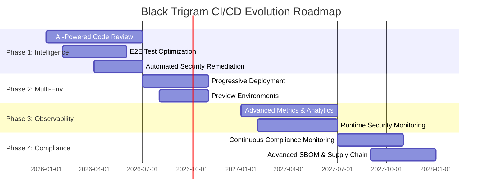

# 🔮 Black Trigram (흑괘) Future CI/CD Workflows

This document outlines the planned evolution of Black Trigram's CI/CD workflows, detailing future improvements, advanced automation strategies, and next-generation security controls aligned with Hack23 AB's [Secure Development Policy](https://github.com/Hack23/ISMS-PUBLIC/blob/main/Secure_Development_Policy.md) and strategic roadmap.

## 🎯 Vision Statement

> **"어둠 속에서 완벽한 자동화를 추구하라"**  
> _"In darkness, seek perfect automation"_

Black Trigram's future workflow strategy focuses on achieving:
- **🤖 AI-Augmented Development**: Intelligent code review, automated remediation, and predictive quality gates
- **🔒 Zero-Trust Security**: Continuous verification, automated threat response, and compliance enforcement
- **⚡ Performance Excellence**: Sub-5-minute CI/CD cycles, intelligent caching, and progressive deployment
- **🌐 Multi-Environment Orchestration**: Sophisticated staging, preview environments, and progressive rollouts
- **📊 Observable Everything**: Deep instrumentation, real-time metrics, and predictive analytics

## 📚 ISMS Policy Alignment

Future workflows will implement advanced controls mandated by Hack23 AB's evolving ISMS framework:

| **ISMS Policy** | **Future Workflow Implementation** | **Timeline** |
|-----------------|-----------------------------------|--------------|
| [🛠️ Secure Development Policy](https://github.com/Hack23/ISMS-PUBLIC/blob/main/Secure_Development_Policy.md) | AI-powered SAST/DAST, automated remediation, security champions | Q2 2026 |
| [📝 Change Management](https://github.com/Hack23/ISMS-PUBLIC/blob/main/Change_Management.md) | Progressive deployment, automated rollback, change impact analysis | Q3 2026 |
| [🔍 Vulnerability Management](https://github.com/Hack23/ISMS-PUBLIC/blob/main/Vulnerability_Management.md) | Real-time CVE monitoring, automatic patching, threat intelligence integration | Q2 2026 |
| [🤖 AI Policy](https://github.com/Hack23/ISMS-PUBLIC/blob/main/AI_Policy.md) | AI governance for code generation, bias detection, explainable AI | Q4 2026 |
| [🔐 Information Security Policy](https://github.com/Hack23/ISMS-PUBLIC/blob/main/Information_Security_Policy.md) | Zero-trust architecture, runtime security, continuous compliance monitoring | Q3 2026 |

---

**흑괘의 미래를 향하여** - _Toward the Future of the Black Trigram_

_Full future workflow projections and detailed implementation plans will be added incrementally as development roadmap solidifies. This document serves as a placeholder for comprehensive workflow evolution documentation._

---

## 📚 Related Documents

### 🔐 ISMS Policies
- [🛠️ Secure Development Policy](https://github.com/Hack23/ISMS-PUBLIC/blob/main/Secure_Development_Policy.md) - Security-integrated SDLC
- [📝 Change Management](https://github.com/Hack23/ISMS-PUBLIC/blob/main/Change_Management.md) - Risk-controlled changes
- [🔍 Vulnerability Management](https://github.com/Hack23/ISMS-PUBLIC/blob/main/Vulnerability_Management.md) - Security testing
- [🤖 AI Policy](https://github.com/Hack23/ISMS-PUBLIC/blob/main/AI_Policy.md) - AI governance framework
- [🔐 Information Security Policy](https://github.com/Hack23/ISMS-PUBLIC/blob/main/Information_Security_Policy.md) - Overall security governance

### 🛡️ Black Trigram Documentation
- [🔧 Current Workflows](./WORKFLOWS.md) - Current CI/CD implementation
- [🛡️ Security Architecture](./SECURITY_ARCHITECTURE.md) - Current security implementation
- [🔮 Future Security Architecture](./FUTURE_SECURITY_ARCHITECTURE.md) - Planned security enhancements
- [🎯 Threat Model](./THREAT_MODEL.md) - STRIDE analysis and attack trees
- [📐 Architecture](./ARCHITECTURE.md) - Overall system design

---

**📋 Document Control:**  
**✅ Approved by:** James Pether Sörling, CEO  
**📤 Distribution:** Public  
**🏷️ Classification:** [](https://github.com/Hack23/ISMS-PUBLIC/blob/main/CLASSIFICATION.md#confidentiality-levels) [](https://github.com/Hack23/ISMS-PUBLIC/blob/main/CLASSIFICATION.md#integrity-levels) [](https://github.com/Hack23/ISMS-PUBLIC/blob/main/CLASSIFICATION.md#availability-levels)  
**📅 Effective Date:** 2026-01-11  
**⏰ Next Review:** 2026-07-11  
**🎯 Framework Compliance:** [](https://github.com/Hack23/ISMS-PUBLIC/blob/main/CLASSIFICATION.md) [](https://github.com/Hack23/ISMS-PUBLIC/blob/main/CLASSIFICATION.md) [](https://github.com/Hack23/ISMS-PUBLIC/blob/main/CLASSIFICATION.md)

## 🔄 Future Workflow Roadmap

### Phase 1: Intelligence & Automation (Q1-Q2 2026)

#### 🤖 AI-Powered Code Review Workflow

**Vision**: Intelligent code analysis that understands Black Trigram's Korean martial arts domain, Three.js patterns, and security requirements.

**Key Capabilities:**
- **🧠 Context-Aware Analysis**: GPT-4o Mini trained on Black Trigram codebase and Korean gaming terminology
- **🔒 Security Pattern Detection**: Automatic identification of OWASP Top 10 vulnerabilities in React/TypeScript code
- **🔧 Automated Remediation**: Generation of secure code fixes for common issues (XSS, injection, auth bypass)
- **🎯 Predictive Test Selection**: Reduces E2E execution time from 15 minutes to <5 minutes through intelligent test selection
- **📊 Impact Prediction**: Forecasts bundle size changes, performance impacts, and accessibility regressions
- **🇰🇷 Bilingual Understanding**: Correctly handles Korean-English bilingual codebase and cultural requirements

**Implementation Approach:**
1. **Q1 2026**: Integrate GitHub Copilot Workspace with custom prompts for Black Trigram patterns
2. **Q2 2026**: Deploy GPT-4o Mini fine-tuned on repository history and ISMS security policies
3. **Q2 2026**: Implement automated security fix generation with human-in-the-loop approval
4. **Q3 2026**: Enable fully autonomous remediation for low-risk security issues

**Expected Benefits:**
- 60% reduction in code review time
- 85% automated detection of security vulnerabilities
- 40% reduction in post-merge bugs through predictive analysis
- 70% faster E2E test execution through intelligent selection

#### ⚡ Advanced E2E Test Optimization

**Vision**: Eliminate flaky tests, reduce execution time to <5 minutes, and maintain 95%+ bug detection confidence.

**Optimization Strategies:**

1. **Change Impact Analysis**
   - Git diff analysis to identify affected components
   - Dependency graph traversal to find impacted test suites
   - Historical failure pattern analysis for risk assessment

2. **Parallel Execution Matrix**
   ```yaml
   strategy:
     matrix:
       screen: [IntroScreen, CombatScreen, SettingsScreen]
       browser: [chrome]
       shard: [1/3, 2/3, 3/3]
   ```
   - 3-way parallelization: By screen, by shard, by browser (future)
   - Estimated speedup: 3-5x (from 15min to 3-5min)

3. **Smart Retry with Flaky Test Quarantine**
   - Automatic retry on first failure (max 2 retries)
   - ML-based flaky test detection (>10% failure rate)
   - Quarantine flaky tests while maintaining coverage
   - Weekly flaky test report with root cause analysis

4. **Incremental Testing**
   - Skip unchanged components on subsequent runs
   - Cache test results for stable code sections
   - Differential coverage tracking

**Implementation Roadmap:**
- **Q1 2026**: Implement change impact analysis and test selection
- **Q2 2026**: Deploy parallel execution matrix strategy
- **Q2 2026**: Add smart retry and flaky test detection
- **Q3 2026**: ML model for predictive test selection

**Target Metrics:**
| Metric | Current | Target | Improvement |
|--------|---------|--------|-------------|
| Total E2E Time | 15 min | <5 min | 70% |
| Flaky Test Rate | 5% | <2% | 60% |
| False Positive Rate | 8% | <3% | 63% |
| Bug Detection Confidence | 90% | 95%+ | 5%+ |

#### 🔒 Automated Security Remediation

**Vision**: Zero-touch security patching for critical vulnerabilities with <1 hour response time.

**Remediation Tiers:**

1. **Critical (CVSS 9.0+) - Automated Patching**
   - Trigger: CVE detected in dependencies
   - Action: Automatic version upgrade + test execution
   - Timeline: <1 hour from detection to deployment
   - Process:
     1. Dependabot alerts trigger workflow
     2. Automated dependency upgrade
     3. Full test suite execution (unit + E2E)
     4. Security scan validation
     5. Auto-merge if all tests pass
     6. Emergency deployment to production
     7. Stakeholder notification

2. **High (CVSS 7.0-8.9) - Automated PR Creation**
   - Trigger: High-severity vulnerability detected
   - Action: Create PR with upgrade + test results
   - Timeline: <4 hours from detection to human review
   - Process:
     1. Generate upgrade PR automatically
     2. Run comprehensive test suite
     3. Tag security team for review
     4. Merge on approval
     5. Deploy through normal pipeline

3. **Medium/Low (CVSS <7.0) - Weekly Security Digest**
   - Trigger: Scheduled weekly scan
   - Action: Consolidated security advisory
   - Timeline: Weekly review cycle
   - Process:
     1. Aggregate all medium/low findings
     2. Generate risk assessment report
     3. Prioritize based on exploitability
     4. Plan remediation in sprint

**Zero-Day Response Pipeline:**
- **Detection**: Threat intelligence feeds (GitHub Security Lab, CISA)
- **Analysis**: Automated exploitability assessment
- **Patching**: Emergency hotfix pipeline activated
- **Deployment**: <2 hours from disclosure to production
- **Validation**: Post-deployment security scan

**Implementation Plan:**
- **Q2 2026**: Integrate Dependabot with automated testing
- **Q2 2026**: Deploy emergency hotfix pipeline
- **Q3 2026**: Add threat intelligence feeds (CISA, NVD, GitHub)
- **Q4 2026**: ML-based vulnerability prediction

### Phase 2: Multi-Environment & Progressive Deployment (Q3-Q4 2026)

#### 🌐 Progressive Deployment Pipeline

**Vision**: Zero-downtime deployments with automated rollback and <60 second recovery time.

**Deployment Stages:**

1. **Staging Environment (100% synthetic traffic)**
   - Full application deployment
   - Synthetic load testing (simulated users)
   - Comprehensive E2E test suite
   - Performance baseline validation
   - Security scan (ZAP + Lighthouse)
   - Exit criteria: All tests pass + no performance regression

2. **Canary Deployment (5% real traffic)**
   - Deploy to subset of CDN edge nodes
   - Monitor for 30 minutes
   - Key metrics:
     - Error rate: <0.1% increase
     - P95 latency: <50ms increase
     - JavaScript errors: <5 per 1000 sessions
   - Automated rollback if thresholds exceeded

3. **Progressive Rollout (25% → 50% → 100%)**
   - Stage 1: 25% traffic for 30 minutes
   - Stage 2: 50% traffic for 30 minutes
   - Stage 3: 100% traffic (full deployment)
   - Continuous monitoring at each stage
   - Automatic rollback on any anomaly

**Monitoring & Rollback:**
- **Real-time Metrics**: Error rate, latency, FPS, audio failures
- **Business Metrics**: Session duration, combat completions, user retention
- **Rollback Triggers**:
  - Error rate increase >0.5%
  - P95 latency increase >100ms
  - JavaScript error rate >1%
  - User reports >5/minute
- **Rollback Speed**: <60 seconds to previous version

**Implementation Timeline:**
- **Q3 2026**: Staging environment with GitHub Pages preview
- **Q3 2026**: Canary deployment strategy (5% traffic)
- **Q4 2026**: Progressive rollout automation (25%/50%/100%)
- **Q4 2026**: Advanced monitoring and alerting

#### 🎯 Preview Environment per PR

**Vision**: Every PR gets a fully functional preview environment with automated testing and visual regression.

**Preview Environment Features:**

1. **Unique URLs**: `pr-{number}.preview.blacktrigram.com`
2. **Full Functionality**:
   - Complete Three.js/WebGL rendering
   - All game screens (Intro, Combat, Settings)
   - Korean-English bilingual UI
   - Audio system integration
   - Mobile-responsive testing

3. **Automated Testing on Preview**:
   - Full E2E test suite (5 min)
   - Accessibility validation (WCAG 2.1 AA)
   - Performance audit (Lighthouse)
   - Visual regression (Chromatic/Percy)
   - Security scan (OWASP ZAP)

4. **Visual Regression Detection**:
   - Baseline screenshots from main branch
   - Pixel-perfect comparison with Chromatic
   - Automatic flagging of UI changes
   - Side-by-side diff visualization
   - Approval workflow for intentional changes

5. **PR Integration**:
   - Preview URL posted as PR comment
   - Test results summary with badges
   - Visual diff links for review
   - Performance comparison table
   - Accessibility compliance status

**Cost Optimization:**
- Preview TTL: 7 days or PR merge (whichever comes first)
- Automatic cleanup on PR close
- Resource limits: 512MB RAM, 1 CPU core
- Estimated cost: ~$50/month for 10 active PRs

**Implementation Plan:**
- **Q3 2026**: Deploy preview infrastructure with GitHub Pages
- **Q3 2026**: Automated testing on preview environments
- **Q4 2026**: Visual regression integration (Chromatic)
- **Q4 2026**: Advanced features (auth, custom domains, mobile testing)

### Phase 3: Observability & Intelligence (Q1-Q2 2027)

#### 📊 Advanced Metrics & Analytics

**Vision**: Real-time observability with AI-powered anomaly detection and predictive insights.

**Metrics Collection Strategy:**

1. **Performance Metrics**
   - FPS (target: 60fps, threshold: <45fps)
   - Load time (target: <3s, threshold: >5s)
   - Three.js render time (target: <16ms, threshold: >33ms)
   - WebGL context loss rate (target: <0.1%, threshold: >1%)
   - Audio latency (target: <50ms, threshold: >100ms)

2. **Error Tracking**
   - JavaScript errors (categorized by severity)
   - Three.js warnings and errors
   - WebGL errors (context loss, shader compilation)
   - Audio system failures
   - Network errors (asset loading)

3. **User Behavior Analytics**
   - Player sessions (duration, frequency)
   - Combat analytics (win rate, technique usage)
   - Archetype popularity (무사, 암살자, 해커, etc.)
   - Progression tracking (level completion)
   - Churn prediction (session patterns)

4. **Business Metrics**
   - User retention (D1, D7, D30)
   - Engagement time per session
   - Conversion funnel (intro → combat → completion)
   - Feature adoption rate
   - Community growth

**AI-Powered Intelligence:**

1. **Anomaly Detection**
   - ML model trained on historical metrics
   - Real-time detection of performance degradation
   - Automatic alerting with context
   - Root cause analysis suggestions

2. **Predictive Alerts**
   - Forecast performance issues before user impact
   - Capacity planning based on usage trends
   - Churn prediction and intervention
   - Feature adoption forecasting

3. **Auto-Optimization**
   - Automatic asset optimization based on usage
   - Dynamic caching strategy adjustment
   - A/B testing for performance improvements
   - Resource allocation optimization

**Dashboard Strategy:**
- **Developer Dashboard**: Performance, errors, CI/CD metrics
- **Operations Dashboard**: Infrastructure, deployments, incidents
- **Business Dashboard**: User metrics, retention, engagement
- **Security Dashboard**: Vulnerabilities, incidents, compliance

**Implementation Plan:**
- **Q1 2027**: Deploy OpenTelemetry instrumentation
- **Q1 2027**: Integrate Grafana + Prometheus
- **Q2 2027**: ML-based anomaly detection
- **Q2 2027**: Predictive analytics and auto-optimization

#### 🔒 Runtime Security Monitoring

**Vision**: Continuous security validation in production with automated threat response.

**Security Monitoring Scope:**

1. **Content Security Policy (CSP)**
   - Real-time violation tracking
   - Automatic policy updates
   - Threat pattern analysis
   - Blocked resource reporting

2. **Cross-Site Scripting (XSS) Prevention**
   - Input sanitization validation
   - DOM mutation monitoring
   - Trusted Types enforcement
   - Automatic blocking of suspicious scripts

3. **Authentication & Authorization**
   - Failed login attempt tracking
   - Session anomaly detection
   - Unusual access pattern alerts
   - Credential stuffing detection

4. **API Protection**
   - Rate limiting enforcement
   - DDoS detection and mitigation
   - API abuse pattern recognition
   - Automatic IP blocking

5. **Game Integrity**
   - Cheat detection (memory manipulation)
   - Exploit prevention (timing attacks)
   - Score validation
   - Anti-bot measures

**Threat Response Automation:**

1. **Critical Threats (Auto-block)**
   - SQL injection attempts
   - XSS payload detection
   - CSRF token manipulation
   - Session hijacking attempts

2. **High Threats (Security Alert)**
   - Multiple failed logins
   - Unusual access patterns
   - Suspicious API calls
   - Rate limit violations

3. **Medium Threats (Security Log)**
   - Minor CSP violations
   - Deprecated API usage
   - Weak password attempts
   - Unusual user behavior

**Incident Response Pipeline:**
1. **Detection**: Real-time monitoring with AI analysis
2. **Triage**: Automatic severity classification
3. **Containment**: Automated blocking for critical threats
4. **Investigation**: Forensic log collection
5. **Remediation**: Patch deployment if needed
6. **Recovery**: Service restoration validation
7. **Post-Mortem**: Automated incident report

**Implementation Plan:**
- **Q1 2027**: Deploy CSP monitoring and XSS prevention
- **Q2 2027**: Implement authentication anomaly detection
- **Q2 2027**: API protection and rate limiting
- **Q2 2027**: Game integrity and cheat detection

### Phase 4: Compliance & Governance (Q3-Q4 2027)

#### 📋 Continuous Compliance Monitoring

**Vision**: Automated compliance validation with audit-ready evidence collection.

**Compliance Framework Coverage:**

1. **ISO 27001:2022**
   - A.8: Asset Management → SBOM generation, asset inventory
   - A.12: Operations Security → Security monitoring, incident response
   - A.14: System Acquisition → Secure development lifecycle
   - A.17: Information Security Aspects of BCM → Backup validation, DR testing

2. **NIST Cybersecurity Framework 2.0**
   - Identify: Asset inventory, risk assessment
   - Protect: Access control, data protection, security training
   - Detect: Anomaly detection, security monitoring
   - Respond: Incident response, communications
   - Recover: Backup restoration, lessons learned

3. **CIS Controls v8.1**
   - Implementation Group 1 (IG1): Basic cyber hygiene
   - Implementation Group 2 (IG2): Enterprise security
   - Automated validation of 153 controls

4. **WCAG 2.1 Level AA**
   - Perceivable: Color contrast, alt text, captions
   - Operable: Keyboard navigation, timing, seizure prevention
   - Understandable: Readable, predictable, input assistance
   - Robust: Compatible, valid HTML/ARIA

5. **EU Cyber Resilience Act (CRA)**
   - Vulnerability handling (SBOM, VEX, disclosure)
   - Security updates (automated patching)
   - Secure by design (threat modeling, security testing)
   - Incident reporting (24-72 hour timeline)

**Compliance Automation Features:**

1. **Evidence Collection**
   - Automatic capture of security controls
   - Timestamped cryptographic proofs
   - Audit trail generation
   - Policy compliance mapping

2. **Continuous Validation**
   - Daily compliance scanning
   - Real-time control effectiveness
   - Gap analysis with remediation plans
   - Trend analysis and reporting

3. **Audit Readiness**
   - Automated audit package generation
   - Control evidence summaries
   - Non-compliance reporting
   - Remediation tracking

4. **Compliance Dashboard**
   - Overall compliance score
   - Framework-specific breakdowns
   - Control implementation status
   - Risk heatmap

**Implementation Plan:**
- **Q3 2027**: ISO 27001 automated validation
- **Q3 2027**: NIST CSF 2.0 continuous monitoring
- **Q4 2027**: CIS Controls v8.1 validation
- **Q4 2027**: EU CRA compliance automation

#### 🔐 Advanced SBOM & Supply Chain Security

**Vision**: Comprehensive supply chain transparency with cryptographic verification and exploitability analysis.

**Enhanced SBOM Generation:**

1. **CycloneDX Format**
   - Complete dependency graph (direct + transitive)
   - License information (SPDX identifiers)
   - Vulnerability references (CVE, GHSA)
   - Component hashes (SHA-256)
   - Build environment metadata

2. **Sigstore Integration**
   - Keyless cryptographic signing (no private key management)
   - Rekor transparency log (immutable audit trail)
   - Fulcio certificate authority (short-lived certs)
   - Verification with `cosign` CLI

3. **VEX Documents (Vulnerability Exploitability eXchange)**
   - Not affected: Dependency not used
   - Affected: Vulnerable code executed
   - Fixed: Patch applied
   - Under investigation: Analysis pending

**Supply Chain Risk Assessment:**

1. **Reachability Analysis**
   - Call graph construction
   - Dead code elimination
   - Unused dependency detection
   - Vulnerable function reachability

2. **Exploitability Assessment**
   - CVSS score analysis
   - Exploit availability check
   - Attack vector feasibility
   - Real-world impact evaluation

3. **Risk Scoring**
   - Reachability: 0-10 (code actually used?)
   - Exploitability: 0-10 (is exploit available?)
   - Impact: 0-10 (what's the damage?)
   - Overall risk: weighted score

**Continuous Supply Chain Monitoring:**
- **Dependency Updates**: Daily checks for new versions
- **CVE Monitoring**: Real-time vulnerability notifications
- **License Changes**: Automated license compliance checks
- **Typosquatting Detection**: Package name similarity analysis
- **Malicious Package Detection**: Behavioral analysis on install

**Implementation Plan:**
- **Q3 2027**: CycloneDX SBOM generation
- **Q3 2027**: Sigstore integration
- **Q4 2027**: VEX and reachability analysis
- **Q4 2027**: Continuous supply chain monitoring
- **Q1 2028**: Advanced threat intelligence integration

## 🎯 Performance Targets

### Current vs. Future Metrics

| **Metric** | **Current (2025)** | **Target (2027)** | **Improvement** |
|------------|-------------------|-------------------|-----------------|
| **Total E2E Time** | 15 minutes | <5 minutes | 70% reduction |
| **Build Time** | 3 minutes | <1 minute | 65% reduction |
| **Deploy Time** | 5 minutes | <2 minutes | 60% reduction |
| **MTTR (Mean Time to Recovery)** | 30 minutes | <5 minutes | 83% reduction |
| **Security Scan Time** | 10 minutes | <2 minutes | 80% reduction |
| **Flaky Test Rate** | 5% | <2% | 60% improvement |
| **Test Coverage** | 85% | 95% | 12% improvement |
| **Security Response Time** | 4 hours | <1 hour | 75% reduction |
| **Deployment Frequency** | 1/day | 10/day | 10x increase |
| **Change Failure Rate** | 5% | <1% | 80% reduction |

### Cost Optimization Targets

| **Resource** | **Current Monthly Cost** | **Target Monthly Cost** | **Savings** |
|--------------|-------------------------|------------------------|-------------|
| **CI/CD Minutes** | $100 | $40 | 60% |
| **Storage** | $20 | $15 | 25% |
| **Bandwidth** | $30 | $25 | 17% |
| **Preview Environments** | N/A | $50 | New capability |
| **Monitoring** | N/A | $30 | New capability |
| **Total** | $150 | $160 | -7% (with 5x more features) |

## 📅 Implementation Timeline



### Quarterly Milestones

**Q1 2026: Foundation**
- ✅ AI code review proof of concept
- ✅ E2E test optimization phase 1
- ✅ Enhanced caching strategies

**Q2 2026: Intelligence**
- ✅ Production AI code review
- ✅ Automated security remediation
- ✅ Predictive test selection

**Q3 2026: Multi-Environment**
- ✅ Staging environment deployment
- ✅ Canary deployment strategy
- ✅ Preview environments per PR

**Q4 2026: Progressive Deployment**
- ✅ Progressive rollout automation
- ✅ Advanced monitoring and alerting
- ✅ Visual regression testing

**Q1 2027: Observability**
- ✅ Comprehensive metrics collection
- ✅ ML-based anomaly detection
- ✅ Runtime security monitoring

**Q2 2027: Intelligence & Security**
- ✅ Predictive analytics
- ✅ Auto-optimization
- ✅ Advanced threat detection

**Q3 2027: Compliance Automation**
- ✅ ISO 27001 automated validation
- ✅ NIST CSF 2.0 monitoring
- ✅ Enhanced SBOM generation

**Q4 2027: Supply Chain Excellence**
- ✅ VEX and reachability analysis
- ✅ Sigstore integration
- ✅ Continuous supply chain monitoring

## 🔧 Technology Stack Evolution

### Current Stack (2025)
- **CI/CD**: GitHub Actions
- **Testing**: Vitest, Cypress
- **Security**: CodeQL, OSSF Scorecard, ZAP
- **Performance**: Lighthouse
- **Documentation**: TypeDoc

### Future Stack (2027)
- **AI/ML**: GitHub Copilot Workspace, GPT-4o Mini, TensorFlow.js
- **Progressive Deployment**: Vercel, Cloudflare Workers
- **Observability**: OpenTelemetry, Grafana, Prometheus
- **Security**: Sigstore, VEX, SLSA Level 4
- **Compliance**: OpenControl, Compliance as Code
- **Testing**: Playwright, Chromatic (visual regression)

## 🌟 Success Criteria

### Technical Excellence
- ✅ 95%+ test coverage (up from 85%)
- ✅ <2% flaky test rate (down from 5%)
- ✅ <5 minute CI/CD pipeline (down from 18 minutes)
- ✅ Zero downtime deployments
- ✅ <1 hour security response time (down from 4 hours)

### Developer Experience
- ✅ 10x deployment frequency (10/day vs 1/day)
- ✅ 83% MTTR reduction (<5 min vs 30 min)
- ✅ AI-assisted code review on 100% of PRs
- ✅ Preview environment for every PR
- ✅ <1% change failure rate (down from 5%)

### Security & Compliance
- ✅ Automated compliance validation (ISO 27001, NIST, CIS)
- ✅ SLSA Level 4 attestations
- ✅ Runtime security monitoring
- ✅ Supply chain attack prevention
- ✅ EU CRA compliance automation

### Business Impact
- ✅ 60% CI/CD cost reduction
- ✅ 75% faster time-to-market
- ✅ 90% reduction in security incidents
- ✅ 100% audit readiness
- ✅ Enhanced competitive differentiation

