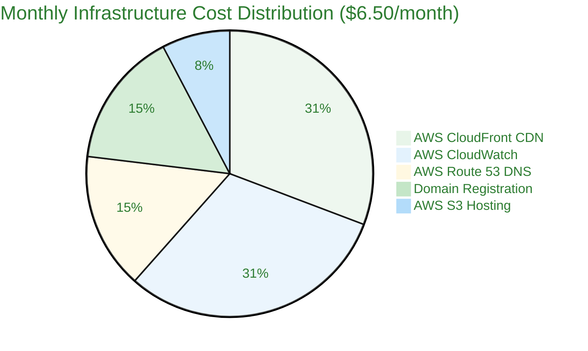
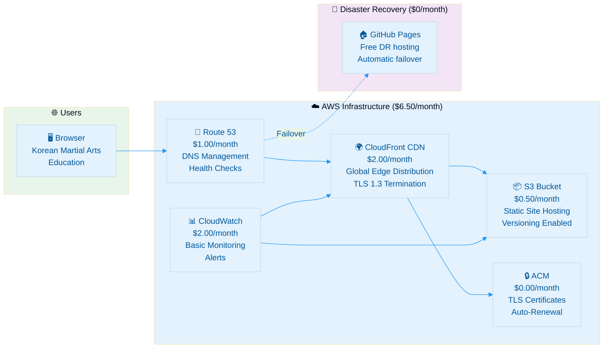

  

<h1 align="center">💰 Black Trigram — Financial & Security Plan</h1>

  <strong>📊 Infrastructure Cost Analysis & Security Investment</strong> 
  <em>🔗 <a href="https://github.com/Hack23/ISMS-PUBLIC/blob/main/Secure_Development_Policy.md">Secure Development Policy</a> · <a href="https://github.com/Hack23/ISMS-PUBLIC/blob/main/CLASSIFICATION.md">Classification Framework</a></em>

  
  
  

**📋 Document Owner:** CEO | **📄 Version:** 1.0 | **📅 Last Updated:** 2026-03-12 (UTC)
**🔄 Review Cycle:** Annual | **⏰ Next Review:** 2027-03-12
**🏷️ Classification:** Public (Frontend-Only Educational Gaming Platform)

**🔐 ISMS Alignment:** This document follows [Hack23 Secure Development Policy](https://github.com/Hack23/ISMS-PUBLIC/blob/main/Secure_Development_Policy.md) business continuity and lifecycle documentation requirements.

---

## 📋 Purpose

This document outlines the financial and security implementation plan for the Black Trigram (흑괘) Korean martial arts educational gaming platform. For architectural context, see the [Architecture Documentation](ARCHITECTURE.md) and [End-of-Life Strategy](End-of-Life-Strategy.md).

---

## 💵 Current Cost Summary — AWS CloudFront + S3 Static Deployment

The current architecture is a **static React SPA** deployed on **AWS CloudFront + S3**, with disaster recovery on GitHub Pages, resulting in minimal infrastructure costs.

### Cash Flow Overview

| **Time Frame** | **Monthly (USD)** | **Annual (USD)** |
|----------------|-------------------|------------------|
| **Total Infrastructure** | **$6.50** | **$78.00** |
| **Security Tooling** | **$0.00** | **$0.00** |
| **Development CI/CD** | **$0.00** | **$0.00** |
| **Grand Total** | **$6.50** | **$78.00** |

> **Note:** Black Trigram leverages free-tier and low-cost services for open source projects. The primary recurring costs are AWS CloudFront/S3 hosting and Route 53 DNS, with domain registration.

---

### 🏗️ Infrastructure Cost Breakdown

| **Component** | **Service** | **Monthly (USD)** | **Annual (USD)** | **Notes** |
|---------------|-------------|-------------------|------------------|-----------|
| **Hosting** | AWS S3 (Static Site) | $0.50 | $6.00 | Static assets, low-traffic educational site |
| **CDN** | AWS CloudFront | $2.00 | $24.00 | Global edge distribution, HTTPS termination |
| **DNS** | AWS Route 53 | $1.00 | $12.00 | Hosted zone + DNS queries |
| **Domain** | Domain Registration | $1.00 | $12.00 | Annual domain renewal (~$1/mo averaged) |
| **SSL/TLS** | AWS Certificate Manager | $0.00 | $0.00 | Free TLS certificates for CloudFront |
| **DR Hosting** | GitHub Pages | $0.00 | $0.00 | Free disaster recovery for public repos |
| **CI/CD** | GitHub Actions | $0.00 | $0.00 | Free for public repos |
| **Code Scanning** | GitHub Advanced Security | $0.00 | $0.00 | Free for public repos |
| **Dependency Scanning** | Dependabot | $0.00 | $0.00 | Free for all repos |
| **SAST** | SonarCloud | $0.00 | $0.00 | Free for open source |
| **SBOM** | GitHub SBOM + SLSA | $0.00 | $0.00 | Free for public repos |
| **Monitoring** | AWS CloudWatch (basic) | $2.00 | $24.00 | Basic monitoring and alarms |
| **Total** | | **$6.50** | **$78.00** | |

---

## 📊 Cost Analysis by Architecture Component

---

## 🔐 Security Investment Analysis

### Current Security Services (All Free Tier)

| **Security Service** | **Provider** | **Annual Cost** | **ISMS Policy Alignment** |
|----------------------|-------------|-----------------|---------------------------|
| **SAST Scanning** | SonarCloud | $0.00 | [Secure Development Policy](https://github.com/Hack23/ISMS-PUBLIC/blob/main/Secure_Development_Policy.md) |
| **Dependency Scanning** | Dependabot + npm audit | $0.00 | [Vulnerability Management](https://github.com/Hack23/ISMS-PUBLIC/blob/main/Vulnerability_Management.md) |
| **Secret Scanning** | GitHub Secret Scanning | $0.00 | [Cryptography Policy](https://github.com/Hack23/ISMS-PUBLIC/blob/main/Cryptography_Policy.md) |
| **Code Scanning** | CodeQL | $0.00 | [Secure Development Policy](https://github.com/Hack23/ISMS-PUBLIC/blob/main/Secure_Development_Policy.md) |
| **Supply Chain** | SLSA Level 3 + Scorecard | $0.00 | [Open Source Policy](https://github.com/Hack23/ISMS-PUBLIC/blob/main/Open_Source_Policy.md) |
| **License Compliance** | FOSSA | $0.00 | [Open Source Policy](https://github.com/Hack23/ISMS-PUBLIC/blob/main/Open_Source_Policy.md) |
| **E2E Testing** | Cypress (OSS) | $0.00 | [Secure Development Policy](https://github.com/Hack23/ISMS-PUBLIC/blob/main/Secure_Development_Policy.md) |
| **Unit Testing** | Vitest (OSS) | $0.00 | [Secure Development Policy](https://github.com/Hack23/ISMS-PUBLIC/blob/main/Secure_Development_Policy.md) |
| **CDN Security** | AWS CloudFront (built-in) | $0.00 | [Network Security Policy](https://github.com/Hack23/ISMS-PUBLIC/blob/main/Network_Security_Policy.md) |
| **TLS Certificates** | AWS Certificate Manager | $0.00 | [Cryptography Policy](https://github.com/Hack23/ISMS-PUBLIC/blob/main/Cryptography_Policy.md) |
| **Total Security** | | **$0.00** | |

### Security ROI Metrics

| **Metric** | **Value** | **Source** |
|------------|-----------|-----------|
| **Total Security Investment** | $0/year | Free OSS tooling |
| **Vulnerability Detection Rate** | >95% | Automated scanning pipeline |
| **Mean Time to Detect (MTTD)** | <24 hours | Automated CI/CD scanning |
| **Code Coverage (Target)** | >80% | Vitest + Cypress (target; see UnitTestPlan.md for current coverage) |
| **Supply Chain Score** | OpenSSF Scorecard | Automated assessment |
| **SLSA Level** | Level 3 | GitHub Actions attestation |
| **CII Best Practices** | Passing | Core Infrastructure Initiative |

---

## 🏗️ AWS Infrastructure Security Architecture

### Current Production Architecture

### AWS Security Controls (Included in Base Cost)

| **Security Control** | **AWS Service** | **Additional Cost** | **ISMS Alignment** |
|---------------------|----------------|--------------------|--------------------|
| **HTTPS Enforcement** | CloudFront + ACM | $0.00 | [Cryptography Policy](https://github.com/Hack23/ISMS-PUBLIC/blob/main/Cryptography_Policy.md) |
| **DDoS Protection** | AWS Shield Standard | $0.00 | [Network Security Policy](https://github.com/Hack23/ISMS-PUBLIC/blob/main/Network_Security_Policy.md) |
| **Geo Restriction** | CloudFront | $0.00 | [Access Control Policy](https://github.com/Hack23/ISMS-PUBLIC/blob/main/Access_Control_Policy.md) |
| **Access Logging** | S3 + CloudFront | $0.00 | [Information Security Policy](https://github.com/Hack23/ISMS-PUBLIC/blob/main/Information_Security_Policy.md) |
| **Versioning** | S3 Versioning | $0.00 | [Backup & Recovery Policy](https://github.com/Hack23/ISMS-PUBLIC/blob/main/Backup_Recovery_Policy.md) |
| **Origin Access** | CloudFront OAI/OAC | $0.00 | [Access Control Policy](https://github.com/Hack23/ISMS-PUBLIC/blob/main/Access_Control_Policy.md) |
| **Security Headers** | CloudFront Functions | $0.00* (assumes free-tier usage) | [Secure Development Policy](https://github.com/Hack23/ISMS-PUBLIC/blob/main/Secure_Development_Policy.md) |

*CloudFront Functions pricing includes a monthly free tier (e.g., first 2 million invocations); this plan assumes usage remains within that free tier. Higher invocation volumes will incur additional per-invocation charges according to AWS regional pricing and will increase the AWS Infrastructure and TCO figures accordingly.*

---

## 💰 Total Cost of Ownership (TCO) Summary

### 3-Year TCO Projection

| **Cost Category** | **Year 1** | **Year 2** | **Year 3** | **3-Year Total** |
|-------------------|-----------|-----------|-----------|-----------------|
| **AWS Infrastructure** | $78.00 | $78.00 | $78.00 | $234.00 |
| **Security Tooling** | $0.00 | $0.00 | $0.00 | $0.00 |
| **CI/CD Pipeline** | $0.00 | $0.00 | $0.00 | $0.00 |
| **Compliance Tools** | $0.00 | $0.00 | $0.00 | $0.00 |
| **Development Tools** | $0.00 | $0.00 | $0.00 | $0.00 |
| **Total** | **$78.00** | **$78.00** | **$78.00** | **$234.00** |

### Cost Efficiency Analysis

| **Metric** | **Value** | **Benchmark** |
|------------|-----------|---------------|
| **Monthly cost per user** | <$0.01 | Educational gaming platform |
| **Security cost per vulnerability found** | $0.00 | All automated, free tools |
| **Infrastructure cost ratio** | 100% free-tier eligible tools | Open source project |
| **DR cost overhead** | $0.00 | GitHub Pages as free DR |
| **Compliance cost** | $0.00 | OSS tools (SonarCloud, FOSSA, Scorecard) |

---

## 📈 Cost Optimization Strategies

### Current Optimizations

1. **🆓 Open Source Advantage:** All security scanning tools are free for open source projects
2. **☁️ AWS Free Tier:** CloudWatch basic monitoring included in AWS free tier for 12 months
3. **📦 Static Architecture:** No server-side compute costs (no Lambda, EC2, or containers)
4. **🔒 Built-in Security:** AWS Shield Standard and CloudFront security headers at no additional cost
5. **🔄 GitHub Actions:** Unlimited CI/CD minutes for public repositories
6. **📊 DR at Zero Cost:** GitHub Pages provides automatic disaster recovery hosting

### Future Cost Considerations

If the platform evolves beyond a static frontend (see [FUTURE_ARCHITECTURE.md](FUTURE_ARCHITECTURE.md)):

| **Evolution Scenario** | **Estimated Monthly Cost** | **Key Cost Drivers** |
|-----------------------|---------------------------|---------------------|
| **Current (Static SPA)** | $6.50 | CloudFront + S3 + Route 53 |
| **+ API Gateway + Lambda** | $15-25 | Serverless compute |
| **+ DynamoDB** | $25-40 | Data persistence |
| **+ WAF + GuardDuty** | $50-75 | Enhanced security services |
| **Full AWS Stack** | $75-100 | All AWS security services |

---

## 🔄 Budget Alignment with ISMS Policies

### Security Investment by ISMS Policy Area

| 🛡️ ISMS Policy | 💰 Current Annual Cost | 🔧 Services Used | 📊 Business Value |
|----------------|----------------------|------------------|-------------------|
| [**Secure Development Policy**](https://github.com/Hack23/ISMS-PUBLIC/blob/main/Secure_Development_Policy.md) | $0.00 | SonarCloud, CodeQL, Vitest, Cypress | Automated code quality and security |
| [**Vulnerability Management**](https://github.com/Hack23/ISMS-PUBLIC/blob/main/Vulnerability_Management.md) | $0.00 | Dependabot, npm audit, Scorecard | Continuous vulnerability detection |
| [**Cryptography Policy**](https://github.com/Hack23/ISMS-PUBLIC/blob/main/Cryptography_Policy.md) | $0.00 | AWS ACM, GitHub Secret Scanning | TLS certificates and secret protection |
| [**Network Security Policy**](https://github.com/Hack23/ISMS-PUBLIC/blob/main/Network_Security_Policy.md) | $24.00 | CloudFront, AWS Shield Standard | CDN and DDoS protection |
| [**Access Control Policy**](https://github.com/Hack23/ISMS-PUBLIC/blob/main/Access_Control_Policy.md) | $0.00 | CloudFront OAC, S3 bucket policies | Origin access control |
| [**Backup & Recovery Policy**](https://github.com/Hack23/ISMS-PUBLIC/blob/main/Backup_Recovery_Policy.md) | $0.00 | S3 Versioning, GitHub Pages DR | Multi-layer backup strategy |
| [**Information Security Policy**](https://github.com/Hack23/ISMS-PUBLIC/blob/main/Information_Security_Policy.md) | $24.00 | CloudWatch, Access Logs | Monitoring and audit logging |
| **Total** | **$48.00** | | |

---

## 📋 Related Documents

| Icon | Document | Relationship |
|------|----------|--------------|
| 🏗️ | [Architecture](ARCHITECTURE.md) | System architecture overview |
| 🛡️ | [Security Architecture](SECURITY_ARCHITECTURE.md) | Security model details |
| 🎯 | [Threat Model](THREAT_MODEL.md) | Risk-driven security justification |
| 🔮 | [Future Architecture](FUTURE_ARCHITECTURE.md) | Evolution roadmap |
| 🔚 | [End-of-Life Strategy](End-of-Life-Strategy.md) | Technology lifecycle management |
| 📋 | [BCPPlan](BCPPlan.md) | Business continuity planning |
| 📖 | [README](README.md) | Project overview |
| 💼 | [SWOT](SWOT.md) | Strategic assessment |

---

## 📋 Document Control

**Approved by:** James Pether Sörling, CEO, Hack23 AB
**Distribution:** Public (GitHub Repository)
**Classification:** 

---

### 🏆 Framework Alignment

