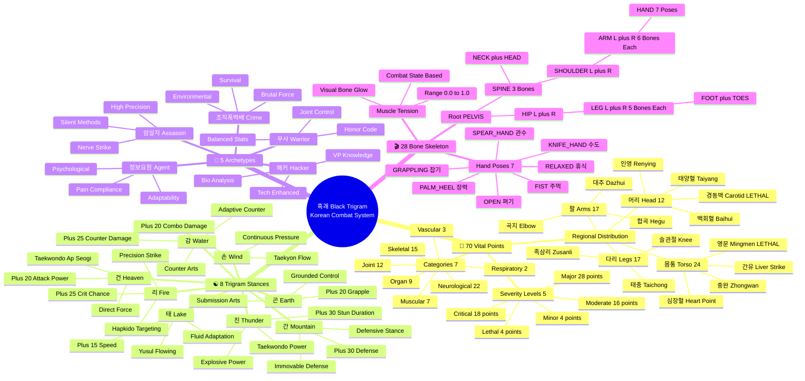
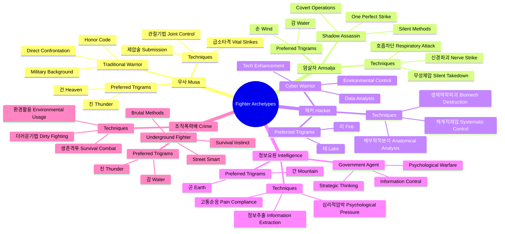
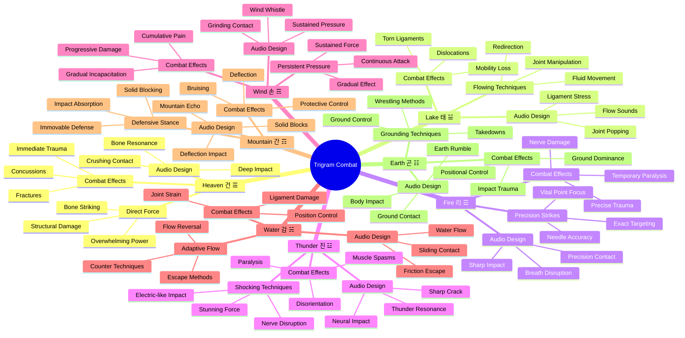
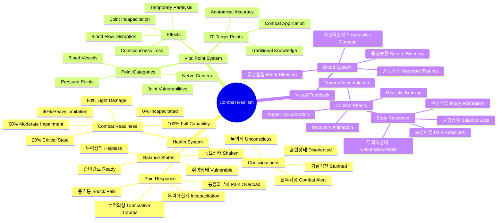
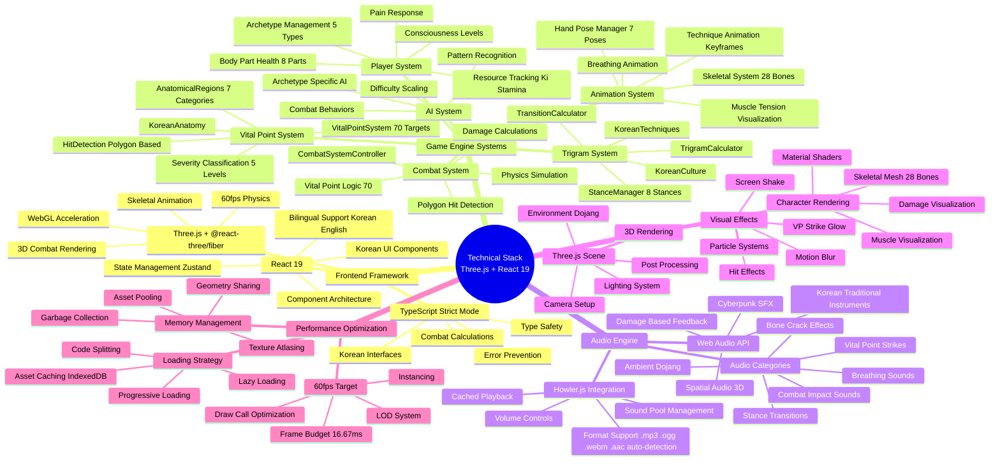
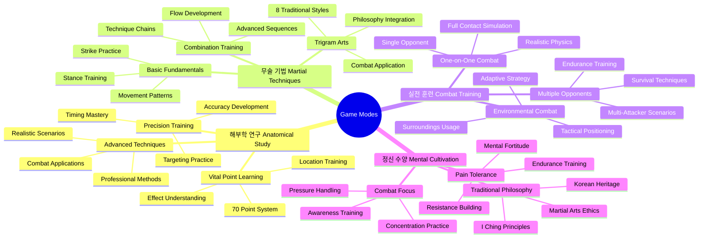
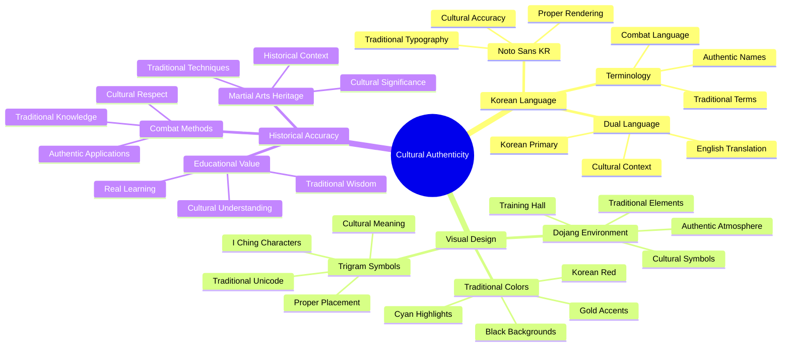
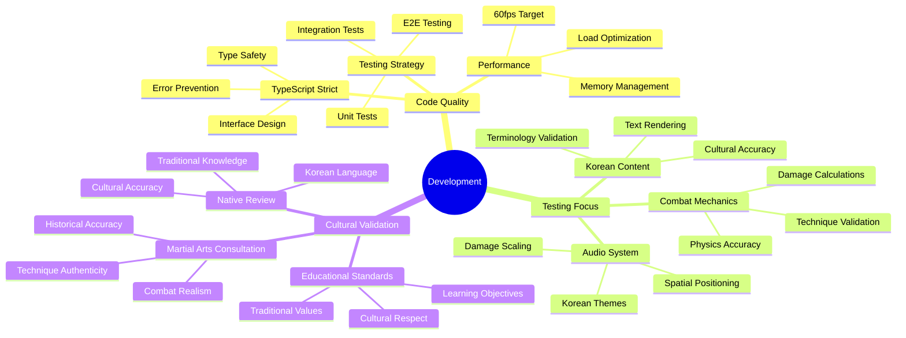

# 🧠 Black Trigram (흑괘) Concept Map

**🔐 ISMS Alignment:** This document follows [Hack23 Secure Development Policy](https://github.com/Hack23/ISMS-PUBLIC/blob/main/Secure_Development_Policy.md) architecture documentation requirements.

## 📚 Related Documentation

| Document                            | Focus       | Description                        |
| ----------------------------------- | ----------- | ---------------------------------- |
| **[Architecture](ARCHITECTURE.md)** | 🏗️ C4 Model | C4 model showing system structure  |
| **[Game Design](game-design.md)**   | 🎮 Design   | Korean martial arts game mechanics |
| **[README](README.md)**             | 📖 Overview | Project overview and setup guide   |

## Korean Martial Arts Core Concepts

## Player Archetypes & Combat Styles

## Eight Trigram Combat System

## Realistic Combat Mechanics

## Technical Architecture Mapping

## Game Modes & Learning Path

## Cultural Authenticity Framework

## Development & Quality Assurance

This mindmap provides a comprehensive overview of the Black Trigram project, covering Korean martial arts philosophy, combat mechanics, player archetypes, technical architecture, and cultural authenticity requirements. It serves as a visual guide for understanding the interconnected concepts that make up this authentic Korean martial arts combat simulator.

---

**흑괘의 길을 걸어라** - _Walk the Path of the Black Trigram through Conceptual Understanding_

This mindmap provides a comprehensive visual guide to Black Trigram's Korean martial arts combat system, covering 70 vital points (급소), 8 trigram stances (팔괘), 5 player archetypes (오대 무사), 28-bone skeletal animation system, and Three.js + React 19 technical architecture. It serves as an authoritative reference for understanding the interconnected concepts that make up this authentic Korean martial arts combat simulator.
