<!-- SPDX-FileCopyrightText: 2024-2026 Hack23 AB -->
<!-- SPDX-License-Identifier: Apache-2.0 -->

<p align="center">
  
</p>

<h1 align="center">🥋 Black Trigram (흑괘)</h1>

<p align="center">
  <strong>Korean Martial Arts Combat Simulator — Eight Trigrams · 70 Vital Points · 51 Authentic Techniques</strong><br>
  <em>어둠의 무예로 완벽한 일격을 추구하라 — "Master the dark arts through the pursuit of the perfect strike"</em>
</p>

<p align="center">
  <a href="https://blacktrigram.com/"></a>
  <a href="https://hack23.github.io/blacktrigram/"></a>
  <a href="https://www.npmjs.com/package/blacktrigram"></a>
  <a href="https://deepwiki.com/Hack23/blacktrigram"></a>
</p>

<table>
  <tr>
    <td width="180" align="center" valign="top">
      <a href="https://blacktrigram.com/"></a>
      <div>
        <a href="https://blacktrigram.com/"></a>
      </div>
      <div>
        <a href="https://www.npmjs.com/package/blacktrigram"></a>
      </div>
      <div>
        <a href="https://www.npmjs.com/package/blacktrigram"></a>
      </div>
      <div>
        <a href="https://github.com/Hack23/blacktrigram/releases"></a>
      </div>
      <div>
        <a href="https://nodejs.org/"></a>
      </div>
    </td>
    <td>
      <p><strong>🥋 Korean martial arts · ☯️ Eight Trigrams (팔괘) · 🎯 70 vital points (급소) · ⚔️ 51 techniques · 🎮 Three.js / React Three Fiber · 📱 60fps desktop · 55fps+ mobile</strong></p>
      <p><strong>Black Trigram (흑괘)</strong> is a production-ready 3D precision combat simulator that turns authentic Korean martial arts — Hapkido (합기도), Taekwondo (태권도), Taekkyeon (택견), Kuk Sool Won, Tang Soo Do, Hwa Rang Do, Ssireum, Subak, Yudo, and Gongkwon Yusul — into a typed, deterministic, browser-native combat experience. Eight I&nbsp;Ching trigram stances drive a 70-point anatomical targeting system across 5 distinct fighter archetypes, with skeletal animation (28 bones · 7 hand poses · 4 grappling states), counter-attack AI with limb-exposure detection, and a complete 13/13 combat-realism stack covering pain, consciousness, breathing, balance, trauma visualization, and bone-impact audio.</p>
      <p>Built on <strong>React 19</strong>, <strong>Three.js 0.184</strong>, <strong>@react-three/fiber 9</strong>, <strong>@react-three/drei 10</strong>, <strong>TypeScript 6.0.3</strong>, and <strong>Vite 8</strong>. Frontend-only architecture deployed on <strong>AWS CloudFront + S3 (multi-region)</strong> with <strong>Route 53</strong> health-checked failover to <strong>GitHub Pages</strong> — zero backend, zero PII, WCAG 2.1 AA accessible, GDPR-clean, and aligned with the full Hack23 ISMS, ISO 27001:2022, NIST CSF 2.0, CIS Controls v8.1, EU CRA, and NIS2.</p>
      <div>
        <a href="https://github.com/Hack23/blacktrigram"></a>
        <a href="https://blacktrigram.com/"></a>
        <a href="https://hack23.github.io/blacktrigram/"></a>
        <a href="https://github.com/Hack23/ISMS-PUBLIC"></a>
      </div>
      <div>
        <a href="https://blacktrigram.com/"><strong>🎮 Play</strong></a> ·
        <a href="https://hack23.github.io/blacktrigram/"><strong>📘 API</strong></a> ·
        <a href="ROADMAP.md"><strong>🗺️ Roadmap</strong></a> ·
        <a href="SECURITY_ARCHITECTURE.md"><strong>🛡️ Security</strong></a> ·
        <a href="THREAT_MODEL.md"><strong>🎯 Threat Model</strong></a> ·
        <a href="game-status.md"><strong>📊 Status</strong></a>
      </div>
    </td>
  </tr>
</table>

<!-- ─────────────────────────────────────────────────────────────────────────── -->
<!-- Supply chain · OpenSSF · SLSA -->
<!-- ─────────────────────────────────────────────────────────────────────────── -->

[](https://scorecard.dev/viewer/?uri=github.com/Hack23/blacktrigram)
[](https://www.bestpractices.dev/projects/10777)
[](https://github.com/Hack23/blacktrigram/attestations)
[](https://github.com/Hack23/blacktrigram/actions/workflows/scorecards.yml)
[](https://github.com/Hack23/blacktrigram/blob/main/LICENSE)
[](https://app.fossa.io/projects/git%2Bgithub.com%2FHack23%2Fblacktrigram?ref=badge_shield)
[](https://cla-assistant.io/Hack23/blacktrigram)

<!-- CI workflows -->
[](https://github.com/Hack23/blacktrigram/actions/workflows/codeql.yml)
[](https://github.com/Hack23/blacktrigram/actions/workflows/test-and-report.yml)
[](https://github.com/Hack23/blacktrigram/actions/workflows/dependency-review.yml)
[](https://github.com/Hack23/blacktrigram/actions/workflows/lighthouse-performance.yml)
[](https://github.com/Hack23/blacktrigram/actions/workflows/zap-scan.yml)
[](https://github.com/Hack23/blacktrigram/actions/workflows/accessibility-test.yml)
[](https://github.com/Hack23/blacktrigram/actions/workflows/release.yml)
[](https://github.com/Hack23/blacktrigram/actions/workflows/deploy-s3.yml)
[](https://github.com/Hack23/blacktrigram/actions/workflows/audit-assets.yml)
[](https://github.com/Hack23/blacktrigram/actions/workflows/screenshot-analysis.yml)

<!-- SonarCloud -->
[](https://sonarcloud.io/summary/new_code?id=Hack23_blacktrigram)
[](https://sonarcloud.io/summary/new_code?id=Hack23_blacktrigram)
[](https://sonarcloud.io/summary/new_code?id=Hack23_blacktrigram)
[](https://sonarcloud.io/summary/new_code?id=Hack23_blacktrigram)
[](https://sonarcloud.io/summary/new_code?id=Hack23_blacktrigram)
[](https://sonarcloud.io/summary/new_code?id=Hack23_blacktrigram)

<!-- Documentation & meta -->
[](https://hack23.github.io/blacktrigram/)
[](./budget.json)
[](./performance-testing.md)
[](https://isitmaintained.com/project/Hack23/blacktrigram "Average time to resolve an issue")
[](https://isitmaintained.com/project/Hack23/blacktrigram "Percentage of issues still open")

<!-- ISMS framework alignment -->
[](https://github.com/Hack23/ISMS-PUBLIC)
[](https://github.com/Hack23/ISMS-PUBLIC/blob/main/Compliance_Checklist.md)
[](https://github.com/Hack23/ISMS-PUBLIC/blob/main/Compliance_Checklist.md)
[](https://github.com/Hack23/ISMS-PUBLIC/blob/main/Compliance_Checklist.md)
[](https://github.com/Hack23/ISMS-PUBLIC/blob/main/Data_Classification_Policy.md)
[](https://github.com/Hack23/ISMS-PUBLIC/blob/main/Information_Security_Policy.md)
[](./CRA-ASSESSMENT.md)

---

## 🎯 Why This Exists

> **"어둠 속에서 완벽한 일격을 찾아라"** — _"In darkness, seek the perfect strike."_

Authentic Korean martial arts deserve more than a flashy combo system. **Black Trigram (흑괘)** is the cultural-tech sister project to **[Riksdagsmonitor](https://github.com/Hack23/riksdagsmonitor)** and **[EU Parliament Monitor](https://github.com/Hack23/euparliamentmonitor)** in the Hack23 portfolio: where those projects apply structured intelligence tradecraft to democratic transparency, **Black Trigram** applies the same engineering rigor to combat simulation — turning the I Ching's Eight Trigrams (☰☱☲☳☴☵☶☷), 70 anatomically-precise vital points (급소) across 4 body regions and 14 TCM meridians, and 51 traditional techniques into a typed, testable, deterministic, accessible, browser-first **Korean martial arts simulator**.

It is a **complete 13/13 combat-realism platform** — body-part health, vital-point targeting, enhanced anatomy, visual feedback, pain response, consciousness levels, breathing disruption, trauma visualization, balance/vulnerability, combat-readiness HUD, injury-based movement, bone-impact audio, and counter-attack AI with limb-exposure detection — running at **60fps on desktop and 55fps+ on mobile**, validated across 518 tests (372 unit + 146 new), with **75%+ coverage**, **WCAG 2.1 AA** accessibility, and full **OWASP / OSSF / SLSA 3** supply-chain hardening.

| Pillar | What it means in this project |
|---|---|
| 🥋 **Cultural Authenticity** | Hangul + Revised Romanization + meaning for every term. 51 techniques sourced from Hapkido, Taekwondo, Taekkyeon, Kuk Sool Won, Tang Soo Do, Hwa Rang Do, Gumdo, Ssireum, Subak, Yudo, Gongkwon Yusul. 127 medical references underpin the 70 vital points. |
| 🎯 **Anatomical Precision** | 70/70 vital points, 4 body regions, 5 severity levels, 14 TCM meridians, 28-bone skeletal animation, 7 hand poses, 4 grappling states. Counter-attack AI with limb-exposure detection. |
| ⚙️ **Engineering Rigor** | TypeScript strict mode, React 19, Three.js 0.184, R3F 9, Drei 10, Vite 8 — 60fps desktop, 55fps+ mobile, 75%+ test coverage, 518 tests, deterministic combat math. |
| 🔐 **Radical Transparency** | Frontend-only · zero backend · zero PII · public ISMS · CodeQL · ZAP DAST · Lighthouse · OSSF Scorecard · SLSA 3 attestations · CycloneDX SBOM. |

**📊 Production-readiness snapshot (v0.7.32)** — see [`game-status.md`](./game-status.md) and [`ARCHITECTURE.md`](./ARCHITECTURE.md):

| Metric | Value | Source |
|---|---|---|
| Product version | **0.7.32** | [`package.json`](./package.json) |
| Overall quality | **9.4 / 10 — Production-Ready** | game-status.md |
| Combat realism systems | **13 / 13 (100%)** | game-status.md |
| Vital points | **70 / 70** (4 regions · 5 severity · 14 TCM meridians · 127 medical refs) | game-status.md |
| Trigram stances | **8 / 8** | game-status.md |
| Player archetypes | **5 / 5** | game-status.md |
| Techniques | **51** across 4 categories | game-status.md |
| Skeletal animation | **28 bones · 7 hand poses · 4 grappling states** | game-status.md |
| Tests passing | **518** (372 + 146 new) | game-status.md |
| Test coverage | **~75%** (target 80%+) | game-status.md |
| Performance | **60fps desktop · 55fps+ mobile** (validated) | performance-testing.md |
| Accessibility | **WCAG 2.1 AA** | accessibility-test.yml |
| Last architecture review | **2026-04-21**, Architecture v2.1 | ARCHITECTURE.md |

---

## 🌐 Explore the Platform

The published game is the audience-facing companion to this open-source TypeScript / React Three Fiber package. Bookmark these entry points:

<table>
  <tr>
    <td width="140" align="center" valign="top">
      <a href="https://blacktrigram.com/"></a>
    </td>
    <td>
      <strong><a href="https://blacktrigram.com/">🎮 Live Game — blacktrigram.com</a></strong><br>
      The production WebGL build. Eight Trigram stances, 70 vital points, 5 fighter archetypes, full 3D skeletal combat. Hardware-accelerated Three.js · 60fps desktop, 55fps+ mobile · WCAG 2.1 AA accessibility · keyboard, mouse, touch, and gesture controls. Hosted from <strong>AWS CloudFront + S3</strong> (multi-region) with <strong>Route 53</strong> health-checked DNS failover to GitHub Pages.
    </td>
  </tr>
  <tr>
    <td width="140" align="center" valign="top">
      <a href="https://hack23.github.io/blacktrigram/"></a>
    </td>
    <td>
      <strong><a href="https://hack23.github.io/blacktrigram/">📘 TypeDoc API Reference</a></strong><br>
      Strict TypeDoc output covering every public type, interface, hook, component, and system: Eight Trigram philosophy, vital-point system (all 70 points), combat math (damage / accuracy / counter-attack), 5 archetypes, audio engine, and Korean–English bilingual JSDoc. Strict <code>notDocumented:true</code> validation drives 100% public-API coverage.
    </td>
  </tr>
  <tr>
    <td width="140" align="center" valign="top">
      <a href="SECURITY_ARCHITECTURE.md"></a>
    </td>
    <td>
      <strong><a href="SECURITY_ARCHITECTURE.md">🛡️ Security Architecture</a></strong><br>
      Trust boundaries, browser-only sandbox model, CSP, SRI, no-PII data flows, cryptography choices, supply-chain controls (OSSF Scorecard, SLSA 3, SBOM, Dependabot, CodeQL, ZAP). Aligned with <a href="https://github.com/Hack23/ISMS-PUBLIC/blob/main/Information_Security_Policy.md">Hack23 Information Security Policy</a> and <a href="https://github.com/Hack23/ISMS-PUBLIC/blob/main/Secure_Development_Policy.md">Secure Development Policy</a>.
    </td>
  </tr>
  <tr>
    <td width="140" align="center" valign="top">
      <a href="THREAT_MODEL.md"></a>
    </td>
    <td>
      <strong><a href="THREAT_MODEL.md">🎯 STRIDE Threat Model</a></strong><br>
      STRIDE-per-trust-boundary analysis with MITRE ATT&CK mapping, attack trees for the most likely abuse paths (e.g. dependency injection, supply-chain compromise, XSS via user-uploaded content — none accepted), and explicit residual-risk acceptance. Aligned with <a href="https://github.com/Hack23/ISMS-PUBLIC/blob/main/Threat_Modeling.md">Hack23 Threat Modeling Policy</a>.
    </td>
  </tr>
  <tr>
    <td width="140" align="center" valign="top">
      <a href="ROADMAP.md"></a>
    </td>
    <td>
      <strong><a href="ROADMAP.md">🗺️ Roadmap to v1.0 (Q3 2026)</a></strong><br>
      Production-Ready release plan. Combat realism complete (13/13). Remaining: training-mode polish, Korean localization to 100%, mobile performance budget tightening, v1.0.0-rc validation. See also <a href="VISION_2026_2034.md">VISION_2026_2034.md</a> for the 8-year strategic plan and <a href="FUTURE_ARCHITECTURE.md">FUTURE_ARCHITECTURE.md</a> for the post-v1.0 architecture.
    </td>
  </tr>
  <tr>
    <td width="140" align="center" valign="top">
      <a href="game-status.md"></a>
    </td>
    <td>
      <strong><a href="game-status.md">📊 Comprehensive Status Report</a></strong><br>
      Source-of-truth metrics: 13/13 combat realism, 70/70 vital points, 28-bone skeletal animation, 51 techniques, 518 tests, 75%+ coverage, 60fps / 55fps+ mobile. Updated 2026-04-21 alongside ARCHITECTURE.md and THREAT_MODEL.md.
    </td>
  </tr>
  <tr>
    <td width="140" align="center" valign="top">
      <a href="https://www.npmjs.com/package/blacktrigram"></a>
    </td>
    <td>
      <strong><a href="https://www.npmjs.com/package/blacktrigram">📦 npm: <code>blacktrigram</code></a></strong><br>
      Reusable game systems, combat mechanics, animation framework, and Korean martial arts data, published as ESM with strict TypeScript types. Subpath exports: <code>blacktrigram/systems</code>, <code>/types</code>, <code>/audio</code>, <code>/utils</code>, <code>/components</code>, <code>/hooks</code>, <code>/data</code>. Each release ships with an <strong>SLSA 3</strong> provenance attestation and a <strong>CycloneDX SBOM</strong>.
    </td>
  </tr>
  <tr>
    <td width="140" align="center" valign="top">
      <a href="https://deepwiki.com/Hack23/blacktrigram"></a>
    </td>
    <td>
      <strong><a href="https://deepwiki.com/Hack23/blacktrigram">🤖 Ask DeepWiki</a></strong><br>
      AI-indexed knowledge base over the entire Black Trigram repository. Best for natural-language deep-dives into combat math, archetypes, vital-point algorithms, animation rigging, or Three.js performance choices.
    </td>
  </tr>
</table>

---

## ⚡ Combat Pipeline — at a Glance

The combat loop is fully deterministic, frame-accurate, and side-effect-isolated. Player input is normalised, fed through the active trigram stance, validated against vital-point geometry, scored for damage, and rendered in Three.js — all within a single 16.6 ms frame budget.

```mermaid
flowchart LR
    A["🎮 Input<br/>Keyboard · Touch · Gesture"] --> B["☯️ Trigram Stance<br/>건태리진손감간곤"]
    B --> C["🦴 Skeletal Pose<br/>28 bones · 7 hand poses"]
    C --> D["🎯 Vital-Point Targeter<br/>70 points · 4 regions · 14 meridians"]
    D --> E["⚔️ Damage Calculator<br/>severity · accuracy · archetype bonus"]
    E --> F["🩸 Body-Part Health<br/>pain · consciousness · breathing · balance"]
    F --> G["🤖 Counter-Attack AI<br/>limb-exposure detection"]
    G --> H["🎨 Three.js Render<br/>60fps · trauma · particles · shaders"]
    F --> I["🔊 Audio Engine<br/>bone impact · breath · 국악"]
    H --> J["♿ WCAG 2.1 AA HUD<br/>combat readiness · haptics"]
    I --> J

    classDef korean fill:#000000,stroke:#FFD700,color:#FFD700,stroke-width:2px
    classDef tech fill:#001a1a,stroke:#00FFFF,color:#00FFFF,stroke-width:2px
    classDef combat fill:#1a0000,stroke:#FF6B6B,color:#FF6B6B,stroke-width:2px
    class A,J tech
    class B,C,D korean
    class E,F,G,H,I combat
```



See [`COMBAT_ARCHITECTURE.md`](COMBAT_ARCHITECTURE.md) for the full pipeline (3,300+ lines), [`FLOWCHART.md`](FLOWCHART.md) for business / combat process flows, and [`STATEDIAGRAM.md`](STATEDIAGRAM.md) for the complete state machine.

---

## 🥋 Combat Disciplines

**Black Trigram** is a **realistic Korean martial arts simulator** that teaches authentic vital-point combat through precise anatomical targeting. Master traditional techniques via modern 3D combat mechanics across 5 distinct fighter archetypes.

<table>
<tr>
<td align="center" width="25%">

**🎯 정격자**<br>
_Jeonggyeokja_<br>
**Precision Striker**<br>
_Every strike targets anatomical weak points_

</td>
<td align="center" width="25%">

**⚔️ 비수**<br>
_Bisu_<br>
**Lethal Technique**<br>
_Decisive unarmed combat methods_

</td>
<td align="center" width="25%">

**🥷 암살자**<br>
_Amsalja_<br>
**Shadow Assassin**<br>
_Silent takedown techniques_

</td>
<td align="center" width="25%">

**💀 급소격**<br>
_Geupsogyeok_<br>
**Vital Point Strike**<br>
_70 anatomical targets for incapacitation_

</td>
</tr>
</table>

---

## 🎭 Player Archetypes

Master combat through **5 distinct fighting philosophies** — each with unique vital-point bonuses, archetype-specific techniques, and signature visual effects:

<div align="center">

| Archetype | Korean / English | Combat Philosophy | Special Focus |
| :---: | :---: | :---: | :---: |
| 🏯 | **무사 (Musa)** · _Traditional Warrior_ | Honor through strength | Military discipline, overwhelming force |
| 🥷 | **암살자 (Amsalja)** · _Shadow Assassin_ | Efficiency through invisibility | Stealth approaches, instant takedowns |
| 💻 | **해커 (Hacker)** · _Cyber Warrior_ | Information as power | Environmental manipulation, tech-assisted strikes |
| 🕵️ | **정보요원 (Jeongbo Yowon)** · _Intelligence Operative_ | Knowledge through observation | Psychological manipulation, precise timing |
| ⚡ | **조직폭력배 (Jojik Pokryeokbae)** · _Organized Crime_ | Survival through ruthlessness | Dirty fighting, improvised weapons |

</div>

---

## ☯️ Eight Trigrams (팔괘) — Combat Stance System

Master **70 authentic vital points (급소)** distributed across the I Ching's eight trigrams. Each stance shapes the active hitbox geometry, technique pool, defensive posture, and audio profile:

<div align="center">

| Trigram | Korean / Meaning | Combat Focus | Combat Effects |
| :---: | :---: | :---: | :---: |
| ☰ | **건 (Geon)** — _Heaven_ | Bone-striking force | Fractures, structural damage |
| ☱ | **태 (Tae)** — _Lake_ | Joint manipulation | Dislocations, mobility loss |
| ☲ | **리 (Li)** — _Fire_ | Precise nerve strikes | Temporary paralysis, numbness |
| ☳ | **진 (Jin)** — _Thunder_ | Stunning techniques | Disorientation, knockouts |
| ☴ | **손 (Son)** — _Wind_ | Continuous pressure | Gradual incapacitation |
| ☵ | **감 (Gam)** — _Water_ | Blood-flow restriction | Circulation disruption |
| ☶ | **간 (Gan)** — _Mountain_ | Defensive counters | Counter-attacks, blocks |
| ☷ | **곤 (Gon)** — _Earth_ | Ground techniques | Throws, takedowns |

</div>

### 💪 Realistic Body Mechanics (13/13 systems · 100% complete)

- 🩸 **Authentic Trauma** — Realistic injury visualization, blood, bruising progression
- 🦴 **Bone-Impact Audio** — Genuine bone-contact and fracture sounds
- 🫁 **Breathing Disruption** — Respiratory targeting affects stamina and accuracy
- ⚖️ **Balance System** — Stance- and momentum-physics-driven vulnerability windows
- 🧠 **Consciousness Levels** — 4-level progressive awareness impairment
- 😵 **Pain Response** — Physiological pain accumulation affecting performance
- 🦵 **Injury-Based Movement** — Damage to limbs constrains mobility and stance access
- 🎯 **Vital-Point Targeter** — 70 points · 4 regions · 5 severity tiers · 14 TCM meridians
- 🤖 **Counter-Attack AI** — Limb-exposure detection triggers archetype-aware ripostes

---

## 📸 Concept

<div align="center">


</div>

---

## 🚀 Technical Stack

Built for **combat realism**, **60fps performance**, and **production-grade engineering**:

<div align="center">

### 🎮 Rendering Engine


### ⚡ Build & Performance


### 🧪 Quality & Testing


### 🎨 3D Visual Effects


</div>

### 🎯 Core Combat Components

- **`VitalPointTargeter`** — Interactive 70-point anatomical targeting with polygon-based zone detection
- **`CombatTracker`** — Real-time damage, pain, consciousness, breathing, and balance monitoring
- **`TechniqueCalculator`** — Deterministic damage / accuracy / counter-attack math (51 techniques)
- **`CombatAnalyzer`** — Post-match technique-effectiveness analysis
- **`ThreeJSRenderer`** — Hardware-accelerated 3D combat visualization with skeletal animation (28 bones)
- **`CounterAttackAI`** — Archetype-aware riposte system with limb-exposure detection

---

## 🎮 Combat Controls

> **📖 Full reference:** [`CONTROLS.md`](./CONTROLS.md) — single source of truth for all keyboard, mouse, touch, gesture, and haptic controls.

### ⌨️ Desktop (currently implemented)

- **🏃 Movement** — `WASD` / `Arrow Keys` — 8-directional tactical positioning
- **☯️ Stances** — `1`–`8` (Eight Trigrams)
  - `1` ☰ Geon (Heaven) — bone-striking force
  - `2` ☱ Tae (Lake) — joint manipulation
  - `3` ☲ Li (Fire) — precise nerve strikes
  - `4` ☳ Jin (Thunder) — stunning techniques
  - `5` ☴ Son (Wind) — continuous pressure
  - `6` ☵ Gam (Water) — adaptive counters
  - `7` ☶ Gan (Mountain) — defensive mastery
  - `8` ☷ Gon (Earth) — ground control
- **🛡️ Guard** — `B` — defensive positioning and blocks
- **⚡ Attack** — `Space` — execute current stance technique
- **🎯 Vital Strike** — `V` — toggle 70-point anatomical targeting overlay
- **⏸️ Pause** — `ESC` / `M` — pause menu / return to intro

### 📱 Mobile Touch (auto-displayed on screens < 768px)

- **🕹️ Virtual D-Pad** (bottom-left, 140×140 px, 48 px buttons exceeding the 44 px iOS guideline) — 8-directional movement with Korean arrows (↑ ↗ → ↘ ↓ ↙ ← ↖)
- **⚡ Action Buttons** (bottom-right) — 80×80 px gold Attack ⚡, 70×70 px blue Block 🛡️
- **☯️ Stance Wheel** (bottom-center, 200 px diameter) — 8 trigrams with hangul: 건 태 리 진 손 감 간 곤
- All controls are **safe-area aware** (34 px bottom inset for notched devices)

### 👆 Gesture & Haptic Feedback

- **Swipe →** advance · **← retreat** · **↑ high attack** · **↓ low attack** · **two-finger tap** toggles vital-point mode
- **Haptics:** 10 ms light (movement / stance), 50 ms medium (attack), 100 ms heavy (vital-point hits)

---

## 🎭 Training Modules

### 🎯 해부학 연구 (Anatomical Study)

- **📚 급소학습** — 70 anatomical target points
- **🎯 정밀타격** — accurate targeting techniques
- **⚫ 고급기법** — professional combat methods
- **🥋 실전응용** — combat-effectiveness training

### ⚔️ 무술 기법 (Martial Techniques)

- **🥋 기본기** — fundamentals: striking and positioning
- **🔢 팔괘술** — Eight Trigram Arts: traditional Korean combat philosophy
- **🔗 연계기법** — combination techniques: flowing technique sequences
- **🎯 정밀술** — precision arts: exact targeting and timing

### 🥊 실전 훈련 (Combat Training)

- **👤 일대일** — single-opponent simulation
- **🏢 환경전투** — environmental combat (using surroundings tactically)
- **🧘 정신수양** — mental cultivation: psychological combat preparation
- **🏃 연속대전** — continuous combat: multiple-opponent scenarios

### 🎭 원형 특화 (Archetype Mastery)

- **🏯 무사도** — traditional warrior discipline · **🥷 암영술** — shadow arts · **💻 사이버전** — cyber warfare · **🕵️ 정보전** — intelligence warfare · **⚡ 거리술** — street arts

---

## 📝 Architecture & Development Insights

In-depth technical and cultural analysis from the Hack23 development team.

### ⭐ Simon Moon — Architecture Chronicles

<div align="center">

_System Architect · Pattern Recognition Expert · Philosopher-Engineer_<br>
[**View Agent Profile**](https://github.com/Hack23/homepage/blob/master/.github/agents/simon-moon.md)

</div>

Simon Moon reveals the hidden structures and sacred geometry in Black Trigram's architecture through the **Law of Fives** and numerological patterns.

<table>
<tr>
<td width="33%" valign="top">

#### 🥋 Black Trigram Architecture

**[Five Fighters, Sacred Geometry](https://hack23.com/blog-trigram-architecture.html)**

Five fighter archetypes discovered through combat-domain analysis. Cultural authenticity meeting mechanical depth — with **zero backend** architecture.

</td>
<td width="33%" valign="top">

#### ⚔️ Black Trigram Combat System

**[70 Vital Points & Physics](https://hack23.com/blog-trigram-combat.html)**

Traditional Korean martial arts mapped to **70 biomechanical vital points**. Five collision systems with anatomical precision and respect for cultural tradition.

</td>
<td width="33%" valign="top">

#### 🥽 Black Trigram Future Vision

**[VR Martial Arts & Immersive Combat](https://hack23.com/blog-trigram-future.html)**

Five-year evolution roadmap from immersive 3D fighter to **VR martial arts training platform**. Korean martial arts preservation through immersive technology.

</td>
</tr>
</table>

### 🔍 George Dorn — Code Analysis

<div align="center">

_Developer · Repository Inspector · Code Archaeologist_<br>
[**View Agent Profile**](https://github.com/Hack23/homepage/blob/master/.github/agents/george-dorn.md)

</div>

George Dorn provides repository deep-dives based on **actual code inspection**, not assumptions. Each analysis includes cloned repositories, file counts, dependency reviews, and verified metrics.

<table>
<tr>
<td width="50%" valign="top">

#### 💻 Black Trigram Code Analysis

**[Repository Deep-Dive](https://hack23.com/blog-george-dorn-trigram-code.html)**

**Stack:** TypeScript 6.0.3 · React 19 · Three.js 0.184 · Vite 8<br>
**Metrics:** 132+ TypeScript files · 70 vital points · 5 archetypes · 28-bone skeletal animation · 51 techniques

Examined `package.json` dependencies, explored `src/` structure, verified combat-system implementation, and reviewed AI integrations.

</td>
<td width="50%" valign="top">

#### 🎮 Black Trigram Implementation Reality

**[Combat Code: TypeScript vs. Martial Arts Physics](https://hack23.com/blog-trigram-architecture.html#george-dorn-implementation)**

George's technical commentary on collision-detection challenges, performance optimization for 60fps combat, and Easter eggs hidden throughout the codebase.

**Easter Eggs:** land exactly **23 hits** → FNORD victory screen · Konami code unlocks "Hagbard Mode" · health at **23%** → UI pulses urgently.

</td>
</tr>
</table>

<div align="center">

**[📚 Full Hack23 Blog](https://hack23.com/blog.html)** — 50+ posts on cybersecurity, ISMS policy, and software architecture through radical transparency.

_"Code is reality made computational. If it doesn't work, nothing else matters."_ — **George Dorn**

</div>

---

## 🩸 Combat Realism Systems — 13 / 13 Complete (100%)

<div align="center">

| System | Status | Notes |
|---|---|---|
| **Body-Part Health** | ✅ | 8-part damage tracking |
| **Vital-Point Targeting** | ✅ | 70 authentic Korean vital points |
| **Enhanced Anatomy** | ✅ | Polygon-based zone detection |
| **Visual Feedback** | ✅ | Damage numbers, hit effects, combos |
| **Pain Response** | ✅ | Realistic pain accumulation (production-tested) |
| **Consciousness Levels** | ✅ | 4-level awareness system |
| **Breathing Disruption** | ✅ | Respiratory targeting affects stamina/accuracy |
| **Trauma Visualization** | ✅ | Injury rendering, bruising progression |
| **Balance / Vulnerability** | ✅ | Stance-based weakness windows |
| **Combat-Readiness HUD** | ✅ | Real-time multi-system status display |
| **Injury-Based Movement** | ✅ | Damage constrains mobility and stance access |
| **Bone-Impact Audio** | ✅ | Bone-contact and fracture sounds |
| **Counter-Attack AI** | ✅ | Limb-exposure detection · archetype-aware ripostes |

**[📊 Detailed Status Report →](game-status.md)** · **[🗺️ v1.0 Roadmap →](ROADMAP.md)** · **[⚔️ Combat Architecture →](COMBAT_ARCHITECTURE.md)**

</div>

---

## 🚀 Quick Start

### 📋 Prerequisites

- **Node.js 26+** — [download](https://nodejs.org/)
- **npm 11+** (bundled with Node 26)
- Modern browser with **WebGL 2.0** support

### 🌐 Play Now

**[🎮 Play live → blacktrigram.com](https://blacktrigram.com/)** · **[🎮 GitHub Pages mirror → hack23.github.io/blacktrigram](https://hack23.github.io/blacktrigram/)**

### 🔧 Local Development

```bash
# Clone
git clone https://github.com/Hack23/blacktrigram.git
cd blacktrigram

# Install (requires Node ≥ 26)
npm ci

# Start the dojang
npm run dev

# Production build
npm run build

# Run tests
npm run test           # Vitest unit
npm run test:systems   # combat-system focused
npm run test:e2e       # Cypress E2E

# Generate API docs (TypeDoc)
npm run docs
```

### 📦 Use as a Library

```bash
npm install blacktrigram
```

```ts
// ESM with strict TypeScript types
import { CombatSystem, VitalPoints } from 'blacktrigram/systems';
import type { TrigramStance, PlayerArchetype } from 'blacktrigram/types';
```

---

## 🔐 Security, Compliance & ISMS Alignment

At Hack23 AB we believe **true security comes through transparency and demonstrable practices**. Black Trigram is governed by the public **[ISMS-PUBLIC](https://github.com/Hack23/ISMS-PUBLIC)** framework, aligned with **ISO 27001:2022**, **NIST CSF 2.0**, **CIS Controls v8.1**, **EU CRA**, **NIS2**, and **GDPR**.

### 🛡️ Supply-Chain Security (SLSA 3)

- **OSSF Scorecard** — automated weekly via [`scorecards.yml`](./.github/workflows/scorecards.yml)
- **OpenSSF Best Practices** — [project ID 10777](https://www.bestpractices.dev/projects/10777)
- **SLSA 3 Provenance** — every release attested → [`/attestations`](https://github.com/Hack23/blacktrigram/attestations)
- **CycloneDX SBOM** — published with each GitHub Release
- **CodeQL SAST** — [`codeql.yml`](./.github/workflows/codeql.yml)
- **OWASP ZAP DAST** — [`zap-scan.yml`](./.github/workflows/zap-scan.yml)
- **Lighthouse Performance** — [`lighthouse-performance.yml`](./.github/workflows/lighthouse-performance.yml)
- **Accessibility (WCAG 2.1 AA)** — [`accessibility-test.yml`](./.github/workflows/accessibility-test.yml)
- **Dependency Review** — [`dependency-review.yml`](./.github/workflows/dependency-review.yml)
- **Dependabot + auto-merge** for low-risk updates
- **All GitHub Actions pinned to commit SHAs** — see [`WORKFLOWS.md`](./WORKFLOWS.md)

### 📜 Hack23 ISMS Policy Anchors

| Policy | Alignment |
|---|---|
| [Information Security Policy](https://github.com/Hack23/ISMS-PUBLIC/blob/main/Information_Security_Policy.md) | Master security governance |
| [Secure Development Policy](https://github.com/Hack23/ISMS-PUBLIC/blob/main/Secure_Development_Policy.md) | SDLC, code review, testing, threat modeling |
| [Open Source Policy](https://github.com/Hack23/ISMS-PUBLIC/blob/main/Open_Source_Policy.md) | License compliance, OSSF Scorecard, SBOM |
| [Vulnerability Management](https://github.com/Hack23/ISMS-PUBLIC/blob/main/Vulnerability_Management.md) | CodeQL, ZAP, Dependabot, SLA |
| [Cryptography Policy](https://github.com/Hack23/ISMS-PUBLIC/blob/main/Cryptography_Policy.md) | TLS 1.3, SRI, no client secrets |
| [Threat Modeling](https://github.com/Hack23/ISMS-PUBLIC/blob/main/Threat_Modeling.md) | STRIDE per trust boundary |
| [Access Control Policy](https://github.com/Hack23/ISMS-PUBLIC/blob/main/Access_Control_Policy.md) | GitHub branch protection, signed commits |
| [Network Security Policy](https://github.com/Hack23/ISMS-PUBLIC/blob/main/Network_Security_Policy.md) | CDN, WAF, CSP, HSTS, SRI |
| [Backup & Recovery Policy](https://github.com/Hack23/ISMS-PUBLIC/blob/main/Backup_Recovery_Policy.md) | Multi-region S3 + GitHub Pages DR |
| [Incident Response Plan](https://github.com/Hack23/ISMS-PUBLIC/blob/main/Incident_Response_Plan.md) | Security disclosure, runbooks |
| [Risk Register](https://github.com/Hack23/ISMS-PUBLIC/blob/main/Risk_Register.md) | Project risks tracked centrally |
| [Compliance Checklist](https://github.com/Hack23/ISMS-PUBLIC/blob/main/Compliance_Checklist.md) | ISO 27001 · NIST CSF · CIS v8.1 mapping |
| [Security Metrics](https://github.com/Hack23/ISMS-PUBLIC/blob/main/Security_Metrics.md) | KPIs and dashboards |
| [AI Policy](https://github.com/Hack23/ISMS-PUBLIC/blob/main/AI_Policy.md) | Copilot governance, EU AI Act, NIST AI RMF |
| [Data Classification Policy](https://github.com/Hack23/ISMS-PUBLIC/blob/main/Data_Classification_Policy.md) | Public · no PII |
| [ISMS Transparency Plan](https://github.com/Hack23/ISMS-PUBLIC/blob/main/ISMS_Transparency_Plan.md) | Public-disclosure strategy |
| [CLASSIFICATION.md](https://github.com/Hack23/ISMS-PUBLIC/blob/main/CLASSIFICATION.md) | Business-impact analysis |

**📊 Full project ↔ ISMS mapping:** [`ISMS_REFERENCE_MAPPING.md`](./ISMS_REFERENCE_MAPPING.md)

<div align="center">
<em>"Our commitment to transparency extends to our security practices — true security comes from robust processes, continuous improvement, and a culture where security considerations are integrated into every business decision."</em><br>
<strong>— James Pether Sörling, CEO/Founder, Hack23 AB</strong>
</div>

---

## 🏗️ Hack23 Portfolio — Sister Projects

Black Trigram is part of the **Hack23 portfolio** — a connected suite of open-source platforms applying transparent engineering and structured-intelligence tradecraft to high-stakes domains:

| Project | Description |
|---|---|
| 🥋 [**Black Trigram**](https://github.com/Hack23/blacktrigram) | _This repo_ — Korean martial arts simulator (Three.js / R3F / TypeScript) |
| 🕵️ [**Citizen Intelligence Agency**](https://github.com/Hack23/cia) | Swedish political-intelligence and accountability platform |
| 📊 [**CIA Compliance Manager**](https://github.com/Hack23/cia-compliance-manager) | CIA-triad compliance dashboard with business-impact mapping |
| 🗳️ [**Riksdagsmonitor**](https://github.com/Hack23/riksdagsmonitor) | Swedish Parliament monitor — autonomous AI newsroom in 14 languages |
| 🏛️ [**EU Parliament Monitor**](https://github.com/Hack23/euparliamentmonitor) | European Parliament political-intelligence platform |
| 🛰️ [**European Parliament MCP Server**](https://github.com/Hack23/European-Parliament-MCP-Server) | TypeScript MCP server exposing EP open data to LLMs |
| 🌐 [**Hack23 Homepage**](https://github.com/Hack23/homepage) | Hack23 AB corporate site — radical transparency in practice |
| 🔐 [**ISMS-PUBLIC**](https://github.com/Hack23/ISMS-PUBLIC) | Public Information Security Management System framework |

🌐 **Hack23 AB** — [hack23.com](https://hack23.com/) · [Blog](https://hack23.com/blog.html) · [Security Posture](https://hack23.com/security.html)

---

## 📚 Documentation Map

### 🗺️ Planning & Status

- [🗺️ **ROADMAP.md**](./ROADMAP.md) — v1.0 release plan (Q3 2026), milestones, system tracking
- [📊 **game-status.md**](./game-status.md) — comprehensive metrics (9.4/10 · 13/13 combat realism · 75%+ coverage)
- [🔮 **VISION_2026_2034.md**](./VISION_2026_2034.md) — 8-year strategic vision
- [🎮 **game-design.md**](./game-design.md) — game mechanics, archetypes, design decisions

### 🏛️ Architecture (C4 Model)

- [📐 **ARCHITECTURE.md**](./ARCHITECTURE.md) — current C4 context · container · component
- [⚔️ **COMBAT_ARCHITECTURE.md**](./COMBAT_ARCHITECTURE.md) — full combat pipeline (3,300+ lines)
- [📊 **DATA_MODEL.md**](./DATA_MODEL.md) — data structures and relationships
- [🔄 **FLOWCHART.md**](./FLOWCHART.md) — combat / business process flows
- [🎛️ **STATEDIAGRAM.md**](./STATEDIAGRAM.md) — game and combat state machines
- [🧠 **MINDMAP.md**](./MINDMAP.md) — conceptual relationships
- [📈 **SWOT.md**](./SWOT.md) — strategic analysis
- [🚀 **FUTURE_ARCHITECTURE.md**](./FUTURE_ARCHITECTURE.md) — post-v1.0 evolution roadmap

### 🔐 Security & Compliance

- [🔒 **SECURITY.md**](./SECURITY.md) — vulnerability disclosure, supported versions, SLA
- [🛡️ **SECURITY_ARCHITECTURE.md**](./SECURITY_ARCHITECTURE.md) — implemented security design
- [🚀 **FUTURE_SECURITY_ARCHITECTURE.md**](./FUTURE_SECURITY_ARCHITECTURE.md) — planned security improvements
- [🎯 **THREAT_MODEL.md**](./THREAT_MODEL.md) — STRIDE analysis and attack trees
- [🚀 **FUTURE_THREAT_MODEL.md**](./FUTURE_THREAT_MODEL.md) — evolved threats
- [📋 **CRA-ASSESSMENT.md**](./CRA-ASSESSMENT.md) — EU Cyber Resilience Act readiness
- [🗺️ **ISMS_REFERENCE_MAPPING.md**](./ISMS_REFERENCE_MAPPING.md) — repo ↔ ISMS-PUBLIC cross-reference
- [🔄 **WORKFLOWS.md**](./WORKFLOWS.md) — CI/CD security automation
- [♻️ **BCPPlan.md**](./BCPPlan.md) — Business Continuity Plan (multi-region failover)
- [🏁 **End-of-Life-Strategy.md**](./End-of-Life-Strategy.md) — sunset and migration plan

### 🛠️ Development, Testing & Assets

- [🔧 **development.md**](./development.md) — dev environment, security features, testing
- [🧪 **UnitTestPlan.md**](./UnitTestPlan.md) — unit-testing strategy (Vitest)
- [🎯 **E2ETestPlan.md**](./E2ETestPlan.md) — end-to-end testing (Cypress)
- [⚡ **performance-testing.md**](./performance-testing.md) — Lighthouse + load testing
- [🎮 **CONTROLS.md**](./CONTROLS.md) — complete controls reference (desktop · mobile · gestures · haptics)
- [🖼️ **ART_ASSETS.md**](./ART_ASSETS.md) — sprites, particles, palettes
- [🎵 **AUDIO_ASSETS.md**](./AUDIO_ASSETS.md) — Korean instruments, impact SFX, mixing
- [🎬 **VIDEO_ASSETS.md**](./VIDEO_ASSETS.md) — cinematic content
- [💰 **FinancialSecurityPlan.md**](./FinancialSecurityPlan.md) — financial-security plan

### 🤖 GitHub Copilot Custom Agents

- [🎯 **Custom Agents Guide**](.github/agents/README.md) — specialized agents for development, testing, security, documentation, and Korean martial arts expertise
- [⚡ **Agent Skills Catalog**](.github/skills/README.md) — automatic enforcement skills
- [📋 **Agent Capabilities Matrix**](.github/agents/AGENT_CAPABILITIES.md) — coordination guide
- [📊 **Agent Skills Implementation**](.github/AGENT_SKILLS_IMPLEMENTATION.md) — implementation report

---

## 🥋 Project Classification

### 🎯 Project Type
[](https://github.com/Hack23/ISMS-PUBLIC/blob/main/CLASSIFICATION.md#project-type-classifications)
[](https://github.com/Hack23/ISMS-PUBLIC/blob/main/CLASSIFICATION.md#project-type-classifications)

### 🔒 Security Classification
[](https://github.com/Hack23/ISMS-PUBLIC/blob/main/CLASSIFICATION.md#confidentiality-levels)
[](https://github.com/Hack23/ISMS-PUBLIC/blob/main/CLASSIFICATION.md#integrity-levels)
[](https://github.com/Hack23/ISMS-PUBLIC/blob/main/CLASSIFICATION.md#availability-levels)

### ⏱️ Business Continuity
[-lightgreen?style=for-the-badge&logo=clock&logoColor=white)](https://github.com/Hack23/ISMS-PUBLIC/blob/main/CLASSIFICATION.md#rto-classifications)
[-lightblue?style=for-the-badge&logo=database&logoColor=white)](https://github.com/Hack23/ISMS-PUBLIC/blob/main/CLASSIFICATION.md#rpo-classifications)

The frontend is statically deployed to **AWS CloudFront + S3** in multiple AWS regions with **Route 53** health-checked failover to **GitHub Pages** as disaster-recovery — supporting the RTO/RPO commitments above with no backend dependencies. See [`BCPPlan.md`](./BCPPlan.md) and [`SECURITY_ARCHITECTURE.md`](./SECURITY_ARCHITECTURE.md).

### 💰 Business Impact Analysis Matrix

| Impact | Financial | Operational | Reputational | Regulatory |
|---|---|---|---|---|
| **🔒 Confidentiality** | Negligible | Negligible | Low | Negligible |
| **✅ Integrity** | Negligible | Moderate | Moderate | Negligible |
| **⏱️ Availability** | Negligible | Low | Low | Negligible |

### 🛡️ Security Investment & Strategic Position

[](https://github.com/Hack23/ISMS-PUBLIC/blob/main/CLASSIFICATION.md#security-investment-returns)
[](https://github.com/Hack23/ISMS-PUBLIC/blob/main/CLASSIFICATION.md#security-investment-returns)
[](https://github.com/Hack23/ISMS-PUBLIC/blob/main/CLASSIFICATION.md#competitive-differentiation)
[](https://github.com/Hack23/ISMS-PUBLIC/blob/main/CLASSIFICATION.md#competitive-differentiation)

---

## 🤝 Contributing

We welcome contributions in code, documentation, Korean cultural review, accessibility audits, and security research.

- 📋 [`CONTRIBUTING.md`](./CONTRIBUTING.md) — contribution workflow
- 🤝 [`CODE_OF_CONDUCT.md`](./CODE_OF_CONDUCT.md) — community standards
- 🔒 [`SECURITY.md`](./SECURITY.md) — responsible disclosure (use the dedicated channel; do **not** file public issues)
- ✍️ All commits must be signed; first-time contributors sign the [CLA](https://cla-assistant.io/Hack23/blacktrigram)

---

## 📜 License

**Apache License 2.0** — see [`LICENSE`](./LICENSE).

[](https://app.fossa.io/projects/git%2Bgithub.com%2FHack23%2Fblacktrigram?ref=badge_large)

---

<div align="center">

## 🌟 Ready to Master Korean Martial Arts?

**[🎮 Play → blacktrigram.com](https://blacktrigram.com/)** · **[📘 API Docs](https://hack23.github.io/blacktrigram/)** · **[📦 npm](https://www.npmjs.com/package/blacktrigram)** · **[🤖 DeepWiki](https://deepwiki.com/Hack23/blacktrigram)**

_Experience authentic Korean combat techniques with anatomical precision across **5 unique fighting archetypes**, **8 trigram stances**, and **70 vital points**._

### Built with 🎯 Combat Precision · 🇰🇷 Cultural Authenticity · 🔐 Radical Transparency

**🥋 흑괘의 길을 걸어라 — Walk the Path of the Black Trigram 🥋**

</div>
