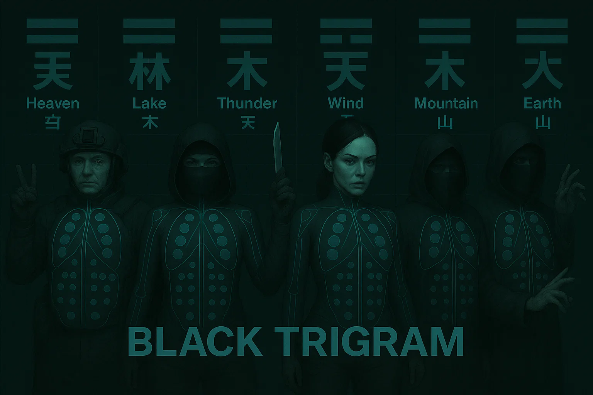
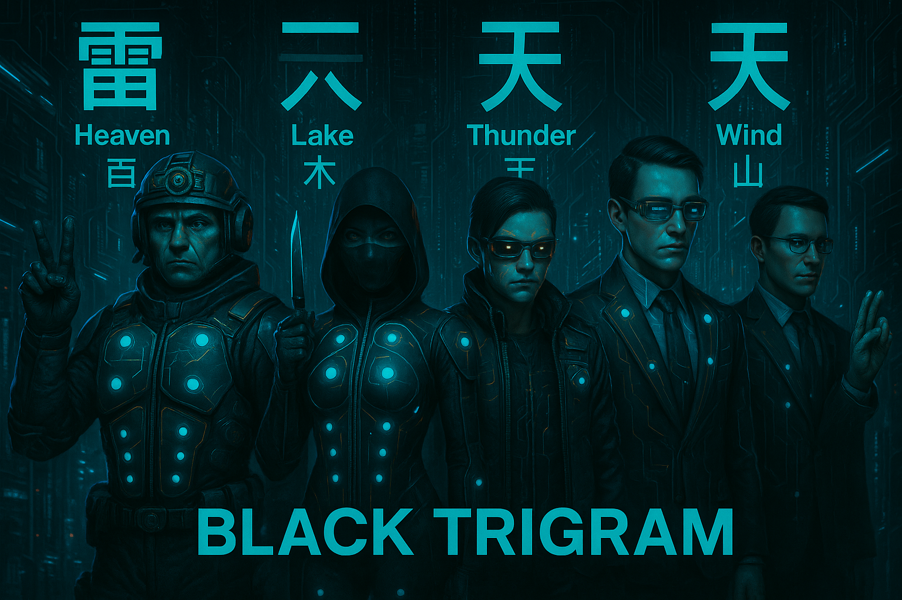
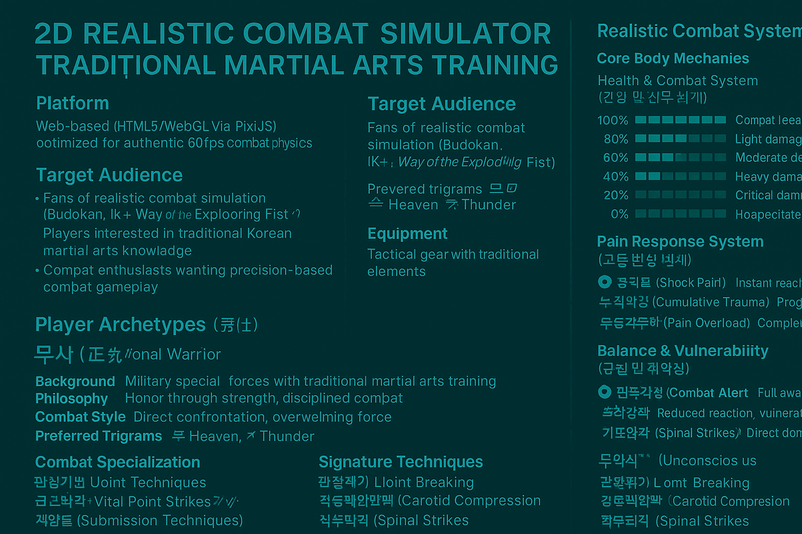
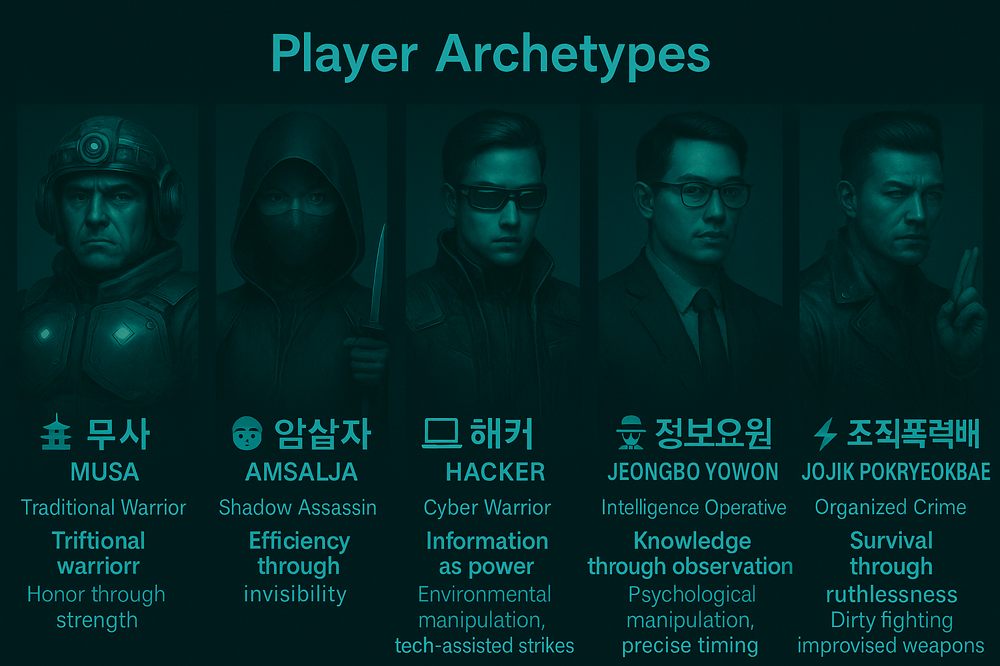

<div align="center">

# 🥋 Black Trigram (흑괘)

### _어둠의 무예로 완벽한 일격을 추구하라_

_"Master the dark arts through the pursuit of the perfect strike"_
**[🎮 Enter the Dojang](https://blacktrigram.com/)**



[](https://github.com/Hack23/blacktrigram/releases)
[](https://github.com/Hack23/blacktrigram/raw/master/LICENSE.md)
[](https://scorecard.dev/viewer/?uri=github.com/Hack23/blacktrigram)
[](https://bestpractices.coreinfrastructure.org/projects/10777)
[](https://github.com/Hack23/blacktrigram/attestations)
[](https://github.com/Hack23/blacktrigram/actions/workflows/scorecards.yml)
[](https://github.com/Hack23/blacktrigram/actions/workflows/test-and-report.yml)

[](https://sonarcloud.io/summary/new_code?id=Hack23_blacktrigram)
[](https://sonarcloud.io/summary/new_code?id=Hack23_blacktrigram)
[](https://sonarcloud.io/summary/new_code?id=Hack23_blacktrigram)
[](https://sonarcloud.io/summary/new_code?id=Hack23_blacktrigram)
[](https://sonarcloud.io/summary/new_code?id=Hack23_blacktrigram)
[](https://isitmaintained.com/project/Hack23/blacktrigram "Average time to resolve an issue")
[](https://deepwiki.com/Hack23/blacktrigram)
[](https://isitmaintained.com/project/Hack23/blacktrigram "Percentage of issues still open")
[](https://app.fossa.io/projects/git%2Bgithub.com%2FHack23%2Fblacktrigram?ref=badge_shield)
[](https://cla-assistant.io/Hack23/blacktrigram)

**📋 Test Documentation:**
[](E2ETestPlan.md)
[](UnitTestPlan.md)

_A realistic 2D precision combat game inspired by Korean martial arts philosophy and the I Ching_

</div>

---

## ⚡ Combat Mastery

**Black Trigram** is a **realistic combat simulator** that teaches authentic Korean martial arts through precise anatomical targeting. Master traditional vital-point techniques via modern 2D combat mechanics across 5 distinct fighter archetypes.

### 🎯 Combat Disciplines

<table>
<tr>
<td align="center" width="25%">

**🎯 정격자**
_Jeonggyeokja_
**Precision Striker**

_Every strike targets anatomical weak points_

</td>
<td align="center" width="25%">

**⚔️ 비수**
_Bisu_
**Lethal Technique**

_Decisive unarmed combat methods_

</td>
<td align="center" width="25%">

**🥷 암살자**
_Amsalja_
**Shadow Assassin**

_Silent takedown techniques_

</td>
<td align="center" width="25%">

**💀 급소격**
_Geupsogyeok_
**Vital Point Strike**

_70 anatomical targets for incapacitation_

</td>
</tr>
</table>

---

## 📸 Concept

<div align="center">





</div>

---

## 🌟 Authentic Combat Features

### 🥋 Player Archetypes

Master combat through 5 distinct fighting philosophies:

<div align="center">

| Archetype |                           Name                            |        Combat Philosophy        |                   Special Focus                   |
| :-------: | :-------------------------------------------------------: | :-----------------------------: | :-----------------------------------------------: |
|    🏯     |         **무사 (Musa)**<br/>_Traditional Warrior_         |     Honor through strength      |      Military discipline, overwhelming force      |
|    🥷     |        **암살자 (Amsalja)**<br/>_Shadow Assassin_         | Efficiency through invisibility |       Stealth approaches, instant takedowns       |
|    💻     |           **해커 (Hacker)**<br/>_Cyber Warrior_           |      Information as power       | Environmental manipulation, tech-assisted strikes |
|    🕵️     | **정보요원 (Jeongbo Yowon)**<br/>_Intelligence Operative_ |  Knowledge through observation  |    Psychological manipulation, precise timing     |
|    ⚡     | **조직폭력배 (Jojik Pokryeokbae)**<br/>_Organized Crime_  |  Survival through ruthlessness  |        Dirty fighting, improvised weapons         |

</div>

### 🎯 Anatomical Targeting System

Master **70 authentic vital points** for combat effectiveness:

<div align="center">

| Trigram |           Name            |      Combat Focus      |        Combat Effects         |
| :-----: | :-----------------------: | :--------------------: | :---------------------------: |
|    ☰    | **건 (Geon)** – _Heaven_  |  Bone-striking force   | Fractures, structural damage  |
|    ☱    |   **태 (Tae)** – _Lake_   |   Joint manipulation   |  Dislocations, mobility loss  |
|    ☲    |   **리 (Li)** – _Fire_    | Precise nerve strikes  | Temporary paralysis, numbness |
|    ☳    | **진 (Jin)** – _Thunder_  |  Stunning techniques   |   Disorientation, knockouts   |
|    ☴    |   **손 (Son)** – _Wind_   |  Continuous pressure   |    Gradual incapacitation     |
|    ☵    |  **감 (Gam)** – _Water_   | Blood flow restriction |    Circulation disruption     |
|    ☶    | **간 (Gan)** – _Mountain_ |   Defensive counters   |    Counter-attacks, blocks    |
|    ☷    |  **곤 (Gon)** – _Earth_   |   Ground techniques    |       Throws, takedowns       |

</div>

### 💪 Realistic Body Mechanics

- **🩸 Authentic Trauma** – Realistic injury visualization and blood
- **🦴 Bone Impact Audio** – Genuine bone contact and fracture sounds
- **🫁 Breathing Disruption** – Respiratory system targeting
- **⚖️ Balance System** – Realistic stance and momentum physics
- **🧠 Consciousness States** – Progressive awareness impairment
- **😵 Pain Response** – Physiological pain affecting performance

### 🎯 Combat Specializations

- **🎯 Anatomical Precision** – 70 target points for tactical advantage
- **🇰🇷 Traditional Korean Arts** – Authentic techniques from 태권도, 합기도, 택견
- **⚫ Advanced Techniques** – Professional combat methods from 5 distinct archetypes
- **🥋 Combat Application** – Real martial arts effectiveness

---

## 🚀 Technical Excellence

Built for **combat realism** and **authentic simulation**:

<div align="center">

### 🎮 Combat Physics Engine


### ⚡ Performance Optimized


### 🎨 Visual Effects


</div>

### 🎯 Combat Components

- **VitalPointTargeter** – Interactive anatomical targeting system
- **CombatTracker** – Real-time damage and status monitoring
- **TechniqueCalculator** – Precise combat effectiveness calculations
- **CombatAnalyzer** – Post-match technique analysis

---

## 🎮 Combat Controls

### ⌨️ Combat Input System

- **🏃 Movement**: `WASD` or `Arrow Keys` – Tactical positioning and footwork
- **⚔️ Techniques**: `1–8` (Trigram-based combat techniques)
- **🛡️ Guard**: `Spacebar` – Defensive positioning and blocks
- **🎯 Vital Strike**: `Mouse` – Targeted vital-point attacks
- **🔄 Archetype Switch**: `Tab` – Change between 5 fighter types

### 🩸 Combat Feedback

- **💥 Impact Effects**: Bone contact sounds and visual trauma
- **🩸 Injury System**: Realistic bleeding and damage progression
- **😵 Incapacitation**: Visual indicators of combat effectiveness
- **⚖️ Balance**: Physical stance and vulnerability windows

---

## 🎭 Training Modules

### 🎯 해부학 연구 (Anatomical Study)

- **📚 급소학습 (Vital Point Study)** – 70 anatomical target points
- **🎯 정밀타격 (Precision Striking)** – Accurate targeting techniques
- **⚫ 고급기법 (Advanced Techniques)** – Professional combat methods
- **🥋 실전응용 (Practical Application)** – Combat effectiveness training

### ⚔️ 무술 기법 (Martial Techniques)

- **🥋 기본기 (Fundamentals)** – Basic striking and positioning
- **🔢 팔괘술 (Eight Trigram Arts)** – Traditional Korean combat philosophy
- **🔗 연계기법 (Combination Techniques)** – Flowing technique sequences
- **🎯 정밀술 (Precision Arts)** – Exact targeting and timing

### 🥊 실전 훈련 (Combat Training)

- **👤 일대일 (One-on-One)** – Single opponent combat simulation
- **🏢 환경전투 (Environmental Combat)** – Using surroundings tactically
- **🧘 정신수양 (Mental Cultivation)** – Psychological combat preparation
- **🏃 연속대전 (Continuous Combat)** – Multiple opponent scenarios

### 🎭 원형 특화 (Archetype Mastery)

- **🏯 무사도 (Warrior's Way)** – Traditional warrior discipline training
- **🥷 암영술 (Shadow Arts)** – Stealth and assassination techniques
- **💻 사이버전 (Cyber Warfare)** – Tech-enhanced combat methods
- **🕵️ 정보전 (Intelligence Warfare)** – Psychological and strategic combat
- **⚡ 거리술 (Street Arts)** – Underground survival combat

---

## 📝 Architecture & Development Insights

Explore in-depth technical analysis and architectural insights about Black Trigram through blog posts by our development team.

### ⭐ Simon Moon's Architecture Chronicles

<div align="center">

_System Architect | Pattern Recognition Expert | Philosopher-Engineer_

[**View Agent Profile**](https://github.com/Hack23/homepage/blob/master/.github/agents/simon-moon.md)

</div>

Simon Moon reveals the hidden structures and sacred geometry in Black Trigram's architecture through the Law of Fives and numerological patterns.

<table>
<tr>
<td width="33%" valign="top">

#### 🥋 Black Trigram Architecture

**[Five Fighters, Sacred Geometry](https://hack23.com/blog-trigram-architecture.html)**

Five fighter archetypes discovered through combat domain analysis. Cultural authenticity meeting mechanical depth with zero backend architecture.

</td>
<td width="33%" valign="top">

#### ⚔️ Black Trigram Combat System

**[70 Vital Points & Physics](https://hack23.com/blog-trigram-combat.html)**

Traditional Korean martial arts mapped to 70 biomechanical vital points. Five collision systems with anatomical precision and respect for cultural tradition.

</td>
<td width="33%" valign="top">

#### 🥽 Black Trigram Future Vision

**[VR Martial Arts & Immersive Combat](https://hack23.com/blog-trigram-future.html)**

Five-year evolution roadmap from 2D fighter to VR martial arts training platform. Korean martial arts preservation through immersive technology.

</td>
</tr>
</table>

### 🔍 George Dorn's Code Analysis

<div align="center">

_Developer | Repository Inspector | Code Archaeologist_

[**View Agent Profile**](https://github.com/Hack23/homepage/blob/master/.github/agents/george-dorn.md)

</div>

George Dorn provides detailed repository deep-dives based on actual code inspection, not assumptions. Each analysis includes cloned repositories, file counts, dependency reviews, and verified metrics.

<table>
<tr>
<td width="50%" valign="top">

#### 💻 Black Trigram Code Analysis

**[Repository Deep-Dive](https://hack23.com/blog-george-dorn-trigram-code.html)**

**Stack:** TypeScript 5.9, React 19, PixiJS 8, Vite 7  
**Metrics:** 132 TypeScript files, 70 vital points system, 5 fighter archetypes

Examined package.json dependencies, explored src/ structure, verified combat system implementation, and reviewed AI integrations.

</td>
<td width="50%" valign="top">

#### 🎮 Black Trigram Implementation Reality

**[Combat Code: TypeScript vs. Martial Arts Physics](https://hack23.com/blog-trigram-architecture.html#george-dorn-implementation)**

George's technical commentary reveals collision detection challenges, performance optimization for 60fps combat, and Easter eggs hidden throughout the codebase.

**Easter Eggs:** Land exactly 23 hits → FNORD victory screen. Konami code unlocks "Hagbard Mode". Health at 23% → UI pulses urgently.

</td>
</tr>
</table>

<div align="center">

### 🌟 Explore More Insights

**[📚 Full Security Blog](https://hack23.com/blog.html)** — 50+ posts covering cybersecurity, ISMS policies, and software architecture through radical transparency

_"Code is reality made computational. If it doesn't work, nothing else matters."_ — **George Dorn**

</div>

---

## 🔐 Commitment to Transparency and Security

At Hack23 AB, we believe that true security comes through transparency and demonstrable practices. Our Information Security Management System (ISMS) is publicly available, showcasing our commitment to security excellence and organizational transparency.

<table>
  <tr>
    <td width="50%">
      <div align="center">
        <h3>📋 Public ISMS Repository</h3>
        <p>Complete Information Security Management System documentation</p>
        <a href="https://github.com/Hack23/ISMS-PUBLIC">
          
        </a>
      </div>
    </td>
    <td width="50%">
      <div align="center">
        <h3>🔒 Information Security Policy</h3>
        <p>Enterprise-grade security framework and governance</p>
        <a href="https://github.com/Hack23/ISMS-PUBLIC/blob/main/Information_Security_Policy.md">
          
        </a>
      </div>
    </td>
  </tr>
</table>

**📊 ISMS Reference Mapping**: For a complete mapping of all ISMS policies referenced by Black Trigram, see [ISMS_REFERENCE_MAPPING.md](./ISMS_REFERENCE_MAPPING.md)

### 🏆 Security Through Transparency

Our approach to cybersecurity consulting is built on a foundation of transparent practices:

- **🔍 Open Documentation**: Complete ISMS framework available for review
- **📋 Policy Transparency**: Detailed security policies and procedures publicly accessible  
- **🎯 Demonstrable Expertise**: Our own security implementation serves as a live demonstration
- **🔄 Continuous Improvement**: Public documentation enables community feedback and enhancement

<div align="center">
  <p><em>"Our commitment to transparency extends to our security practices - demonstrating that true security comes from robust processes, continuous improvement, and a culture where security considerations are integrated into every business decision."</em></p>
  <p><strong>— James Pether Sörling, CEO/Founder</strong></p>
</div>

---


## 🔧 Development Features

### 🎯 Anatomical Data Integration

```typescript
// Authentic vital point data with combat applications
interface VitalPoint {
  name: { korean: string; english: string; technique: string };
  location: AnatomicalPosition;
  effectiveness: CombatEffectiveness;
  difficulty: PrecisionRequired;
  method: CombatTechnique[];
  archetypeBonus: ArchetypeModifier[]; // Special bonuses for different fighter types
}
```

### 🩸 Combat Mechanics System

```typescript
// Realistic body mechanics for authentic combat
interface CombatState {
  health: number; // Physical condition remaining
  consciousness: number; // Awareness and responsiveness
  pain: number; // Pain levels affecting performance
  balance: CombatStability; // Physical stability in combat
  stamina: number; // Energy and endurance
  technique: number; // Skill and precision level
  archetype: PlayerArchetype; // Current fighter specialization
}

// Player archetype system
type PlayerArchetype = "musa" | "amsalja" | "hacker" | "jeongbo" | "jojik";
```

---

## 🚀 Quick Start

### 🌐 Enter the Dojang

**[🎮 Begin Combat Training](https://hack23.github.io/blacktrigram/)**

### 🔧 Local Development

```bash
# Clone repository
git clone https://github.com/Hack23/blacktrigram.git
cd blacktrigram

# Install dependencies
npm install

# Start combat simulation
npm run dev

# Build for deployment
npm run build

# Run combat testing
npm run test
npm run test:combat
```

---

## 📚 Documentation & Further Reading

Game/frontend will be open source with commercial backend supporting multiplayer functionality, rankings and subscriptions to fund development and runtime of backend. Will enable progressions and persistent state of game.


🔗 **Architecture & Design**

- [📐 ARCHITECTURE.md](https://github.com/Hack23/blacktrigram/blob/main/ARCHITECTURE.md)
  _High-level C4 models, container/component views, and system context._
- [📈 FUTURE_ARCHITECTURE.md](https://github.com/Hack23/blacktrigram/blob/main/FUTURE_ARCHITECTURE.md)
  _Vision for upcoming architectural enhancements and PWA integration._
- [API Docs](https://blacktrigram.com/api/)
  _Detailed API reference for all components, types, and functions in the application._


🔗 **Combat & Mechanics**

- [🥋 COMBAT_ARCHITECTURE.md](https://github.com/Hack23/blacktrigram/blob/main/COMBAT_ARCHITECTURE.md)
  _In-depth battleflow, trigram integration, vital-point targeting, and damage pipeline._
- [🗺️ game-design.md](https://github.com/Hack23/blacktrigram/blob/main/game-design.md)
  _Overall game mechanics, archetype breakdowns, and design decisions._
- [📊 game-status.md](https://github.com/Hack23/blacktrigram/blob/main/game-status.md)
  _Current progress, feature roadmap, and milestone tracking._

🔗 **Assets & Media**

- [🖼️ ART_ASSETS.md](https://github.com/Hack23/blacktrigram/blob/main/ART_ASSETS.md)
  _Guidelines for sprite sheets, particle textures, color palettes, and UI icons._
- [🎵 AUDIO_ASSETS.md](https://github.com/Hack23/blacktrigram/blob/main/AUDIO_ASSETS.md)
  _List of traditional Korean instrument loops, impact SFX, and mixing notes._
- [🎵 VIDEO_ASSETS.md](https://github.com/Hack23/blacktrigram/blob/main/VIDEO_ASSETS.md)
  _Black Trigram: The Path of Shadows 🌑⚡🗡️ .Scene 1: Initiation Under Neon Skies 🌑🗡️🌆_


🔒 **CI/CD & Security Features**

- [🔒 development.md](https://github.com/Hack23/blacktrigram/blob/main/development.md)
  _The development implements comprehensive security measures._
- [🤖 Copilot MCP Setup](.github/COPILOT_MCP_SETUP.md)
  _Model Context Protocol servers for enhanced Copilot capabilities._
- **🛡️ Supply Chain Security** - OSSF Scorecard analysis and dependency review
- **🔍 Static Analysis** - CodeQL scanning for vulnerabilities
- **📦 Dependency Protection** - Automated dependency vulnerability checks
- **🔐 Runner Hardening** - All CI/CD runners are hardened with audit logging
- **📋 Security Policies** - GitHub security advisories and vulnerability reporting
- **🏷️ Pinned Dependencies** - All GitHub Actions pinned to specific SHA hashes
- **📄 SBOM Generation** - Software Bill of Materials for transparency
- **🔏 Build Attestations** - Cryptographic proof of build integrity
- **🏆 Artifact Verification** - SLSA-compliant build provenance
- **🕷️ ZAP Security Scanning** - OWASP ZAP dynamic application security testing
- **⚡ Lighthouse Performance** - Automated performance and accessibility audits


---

## 🎯 Combat Philosophy

> **"어둠 속에서 완벽한 일격을 찾아라"** > _"In darkness, seek the perfect strike"_

Each technique focuses on:

- **정확한 타격 (Precise Targeting)** – Exact anatomical vulnerable points
- **최대 효과 (Maximum Effectiveness)** – One-strike incapacitation
- **전투 심리 (Combat Psychology)** – Mental preparation for combat
- **전통 지식 (Traditional Knowledge)** – Authentic Korean martial arts
- **원형 특화 (Archetype Specialization)** – Unique approach per fighter type

---

## 🏆 Combat Achievements

### 🎯 Combat Mastery

- **🎓 급소대가 (Vital Point Master)** – Master all 70 vital-point targets
- **🩸 전투전문가 (Combat Expert)** – Execute optimal combat techniques
- **⚫ 고수 (Advanced Practitioner)** – Complete advanced technique training
- **🔪 완벽한 무사 (Perfect Warrior)** – Achieve flawless combat records

### 🥋 Martial Proficiency

- **🎯 정밀타격사 (Precision Striker)** – Perfect vital-point targeting accuracy
- **⚖️ 균형대사 (Balance Master)** – Master all stance & footwork patterns
- **🧘 정신수양사 (Mental Cultivator)** – Complete psychological combat training
- **🇰🇷 무도학자 (Martial Scholar)** – Understand Korean martial arts philosophy

### 🎭 Archetype Mastery

- **🏯 무사완성 (Warrior Perfection)** – Master traditional warrior discipline
- **🥷 그림자대사 (Shadow Master)** – Perfect stealth & assassination arts
- **💻 사이버무사 (Cyber Warrior)** – Tech-enhanced combat mastery
- **🕵️ 정보대가 (Intelligence Master)** – Psychological warfare expertise
- **⚡ 거리왕 (Street King)** – Underground combat supremacy

---

<div align="center">

## 🌟 Ready to Master Korean Martial Arts?

**[🎮 Enter the Dojang](https://hack23.github.io/blacktrigram/)**

_Experience authentic Korean combat techniques with anatomical precision across 5 unique fighting archetypes_

---

### Built with 🎯 Combat Precision and 🇰🇷 Traditional Authenticity

**🥋 무도의 길을 걸어라 (Walk the Path of Martial Arts) 🥋**

</div>

## 🥋 Black Trigram Project Classification

### 🎯 Project Classification
[](https://github.com/Hack23/ISMS-PUBLIC/blob/main/CLASSIFICATION.md#project-type-classifications)
[](https://github.com/Hack23/ISMS-PUBLIC/blob/main/CLASSIFICATION.md#project-type-classifications)

### 🔒 Security Classification
[](https://github.com/Hack23/ISMS-PUBLIC/blob/main/CLASSIFICATION.md#confidentiality-levels)
[](https://github.com/Hack23/ISMS-PUBLIC/blob/main/CLASSIFICATION.md#integrity-levels)
[](https://github.com/Hack23/ISMS-PUBLIC/blob/main/CLASSIFICATION.md#availability-levels)

### ⏱️ Business Continuity
[-lightgreen?style=for-the-badge&logo=clock&logoColor=white)](https://github.com/Hack23/ISMS-PUBLIC/blob/main/CLASSIFICATION.md#rto-classifications)
[-lightblue?style=for-the-badge&logo=database&logoColor=white)](https://github.com/Hack23/ISMS-PUBLIC/blob/main/CLASSIFICATION.md#rpo-classifications)

### 💰 Business Impact Analysis Matrix

| Impact Category | Financial | Operational | Reputational | Regulatory |
|-----------------|-----------|-------------|--------------|------------|
| **🔒 Confidentiality** | [](https://github.com/Hack23/ISMS-PUBLIC/blob/main/CLASSIFICATION.md#financial-impact-levels) | [](https://github.com/Hack23/ISMS-PUBLIC/blob/main/CLASSIFICATION.md#operational-impact-levels) | [](https://github.com/Hack23/ISMS-PUBLIC/blob/main/CLASSIFICATION.md#reputational-impact-levels) | [](https://github.com/Hack23/ISMS-PUBLIC/blob/main/CLASSIFICATION.md#regulatory-impact-levels) |
| **✅ Integrity** | [](https://github.com/Hack23/ISMS-PUBLIC/blob/main/CLASSIFICATION.md#financial-impact-levels) | [](https://github.com/Hack23/ISMS-PUBLIC/blob/main/CLASSIFICATION.md#operational-impact-levels) | [](https://github.com/Hack23/ISMS-PUBLIC/blob/main/CLASSIFICATION.md#reputational-impact-levels) | [](https://github.com/Hack23/ISMS-PUBLIC/blob/main/CLASSIFICATION.md#regulatory-impact-levels) |
| **⏱️ Availability** | [](https://github.com/Hack23/ISMS-PUBLIC/blob/main/CLASSIFICATION.md#financial-impact-levels) | [](https://github.com/Hack23/ISMS-PUBLIC/blob/main/CLASSIFICATION.md#operational-impact-levels) | [](https://github.com/Hack23/ISMS-PUBLIC/blob/main/CLASSIFICATION.md#reputational-impact-levels) | [](https://github.com/Hack23/ISMS-PUBLIC/blob/main/CLASSIFICATION.md#regulatory-impact-levels) |

### 🛡️ Security Investment Returns
[](https://github.com/Hack23/ISMS-PUBLIC/blob/main/CLASSIFICATION.md#security-investment-returns)
[](https://github.com/Hack23/ISMS-PUBLIC/blob/main/CLASSIFICATION.md#security-investment-returns)
[](https://github.com/Hack23/ISMS-PUBLIC/blob/main/CLASSIFICATION.md#security-investment-returns)

### 🎯 Competitive Differentiation
[](https://github.com/Hack23/ISMS-PUBLIC/blob/main/CLASSIFICATION.md#competitive-differentiation)
[](https://github.com/Hack23/ISMS-PUBLIC/blob/main/CLASSIFICATION.md#competitive-differentiation)
[](https://github.com/Hack23/ISMS-PUBLIC/blob/main/CLASSIFICATION.md#competitive-differentiation)

### 📈 Porter's Five Forces Strategic Impact
[](https://github.com/Hack23/ISMS-PUBLIC/blob/main/CLASSIFICATION.md#porters-five-forces)
[](https://github.com/Hack23/ISMS-PUBLIC/blob/main/CLASSIFICATION.md#porters-five-forces)
[](https://github.com/Hack23/ISMS-PUBLIC/blob/main/CLASSIFICATION.md#porters-five-forces)
[](https://github.com/Hack23/ISMS-PUBLIC/blob/main/CLASSIFICATION.md#porters-five-forces)
[](https://github.com/Hack23/ISMS-PUBLIC/blob/main/CLASSIFICATION.md#porters-five-forces)

---
