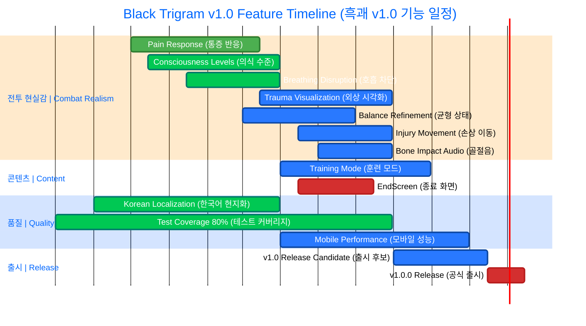

# 🗺️ Black Trigram (흑괘) – v1.0 Release Roadmap

**어둠의 무예로 완벽한 일격을 추구하라**  
_"Master the dark arts through the pursuit of the perfect strike"_

**Target Release Date**: Q3 2026 (v1.0.0)  
**Current Status**: Production-Ready (v0.7.32, 9.4/10) — preparing v1.0 release Q3 2026  
**Last Updated**: 2026-04-28 (UTC)  
**Next Review**: 2026-05-15

---

## 📋 Quick Reference: v1.0 Completion Status

| Category | Progress | Status | Target Date | Priority |
|----------|----------|--------|-------------|----------|
| **Combat Realism Systems** | 100% (13/13) | ✅ Complete | ✅ Done | ✅ Complete |
| **Vital Point System** | 100% (70/70) | ✅ Complete | ✅ Done | ✅ Complete |
| **Trigram Stances** | 100% (8/8) | ✅ Complete | ✅ Done | ✅ Complete |
| **Player Archetypes** | 100% (5/5) | ✅ Complete | ✅ Done | ✅ Complete |
| **Skeletal Animation** | 100% (28 bones · 7 hand poses · 4 grappling) | ✅ Complete | ✅ Done | ✅ Complete |
| **Counter-Attack AI** | 100% (limb-exposure detection) | ✅ Complete | ✅ Done | ✅ Complete |
| **Test Coverage** | ~75% | ⚠️ In Progress | 80%+ Q2 2026 | 🟡 High |
| **Performance (60fps)** | Desktop: ✅ Mobile: ✅ (55fps+) | ✅ Validated | ✅ Done | ✅ Complete |
| **Korean Localization** | 90% | ⚠️ In Progress | 100% Q2 2026 | 🟡 High |
| **Training Mode** | 80% | ⚠️ Needs Polish | Q2 2026 | 🟡 High |
| **EndScreen** | 100% | ✅ Complete | ✅ Done | ✅ Complete |

**Overall v1.0 Completion**: **~95%** — preparing v1.0.0-rc release Q3 2026.

---

## 🎯 v1.0 Release Criteria

### 필수 기능 | Must-Have Features (Essential for v1.0)

| Feature | Status | Progress | Target | Owner | Blocker | Notes |
|---------|--------|----------|--------|-------|---------|-------|
| **전투 현실감 시스템 | Combat Realism Systems (13/13)** | ✅ Complete | 100% (13/13) | ✅ Done | @game-developer | - | All systems production-ready |
| Pain Response System (통증 반응) | ✅ Production-Ready | 100% | ✅ Done | @game-developer | - | 37 tests, fully integrated |
| Consciousness Levels (의식 수준) | ✅ Production-Ready | 100% | ✅ Done | @game-developer | - | 36 tests, 4-level gradation |
| Breathing Disruption (호흡 차단) | ✅ Complete | 100% | ✅ Done | @game-developer | - | Integrated with CombatSystem |
| Trauma Visualization (외상 시각화) | ✅ Complete | 100% | ✅ Done | @game-developer | - | Injury rendering · bruising |
| Balance State Refinement (균형 상태) | ✅ Complete | 100% | ✅ Done | @game-developer | - | Stance-based vulnerability |
| Combat Readiness HUD (전투 준비 HUD) | ✅ Complete | 100% | ✅ Done | @game-developer | - | Real-time multi-system display |
| Injury-Based Movement (손상 기반 이동) | ✅ Complete | 100% | ✅ Done | @game-developer | - | Damage constrains mobility |
| Bone Impact Audio (골절음) | ✅ Complete | 100% | ✅ Done | @audio-designer | - | Bone-contact + fracture SFX |
| Counter-Attack AI (반격 AI) | ✅ Complete | 100% | ✅ Done | @game-developer | - | Limb-exposure detection |
| **급소 시스템 | Vital Point System** | ✅ Complete | 100% (70/70) | ✅ Done | - | - | 4 regions · 14 TCM meridians |
| **팔괘 자세 | Trigram Stances** | ✅ Complete | 100% (8/8) | ✅ Done | - | - | All functional |
| **플레이어 원형 | Player Archetypes** | ✅ Complete | 100% (5/5) | ✅ Done | - | - | Balanced |
| **골격 애니메이션 | Skeletal Animation** | ✅ Complete | 100% | ✅ Done | @game-developer | - | 28 bones · 7 hand poses · 4 grappling |
| **종료 화면 | EndScreen** | ✅ Complete | 100% | ✅ Done | @game-developer | - | Combat statistics integrated |
| **훈련 모드 | Training Mode** | ⚠️ Polish | 80% | Q2 2026 | @game-developer | - | Progressive difficulty |
| **한국어 현지화 | Korean Localization** | ⚠️ In Progress | 90% | Q2 2026 | @isms-ninja | Translation | 100% target |
| **테스트 커버리지 | Test Coverage** | ⚠️ In Progress | ~75% | 80%+ Q2 2026 | @test-specialist | - | 518 tests passing |
| **성능 (60fps) | Performance** | ✅ Validated | Desktop: 60fps · Mobile: 55fps+ | ✅ Done | @performance-engineer | - | Mobile budget achieved |

### 좋은 기능 | Nice-to-Have Features (Post-v1.0)

| Feature | Priority | Target Version | Estimated Effort | Notes |
|---------|----------|----------------|------------------|-------|
| Backend Save Persistence (백엔드 저장) | Medium | v1.1 | 4-6 weeks | Requires backend infrastructure |
| Multiplayer PvP Prototype (멀티플레이어) | Low | v2.0 | 6-9 months | Major feature, post-release |
| Mobile Native App (모바일 앱) | Medium | v1.5 | 4-6 weeks | React Native or Flutter |
| Achievements System (업적 시스템) | Low | v1.3 | 2-3 weeks | Content expansion |
| Advanced AI Behaviors (고급 AI) | Medium | v1.7 | 6-8 weeks | Tactical opponent AI |

### 출시 기준 | Release Criteria

- [ ] **Overall quality**: 9.5/10 minimum (currently 9.4/10)
- [ ] **Zero critical bugs**: All P0/P1 issues resolved
- [x] **Combat realism systems**: 100% complete (13/13) ✅
- [ ] **Test coverage**: 80%+ overall (unit + E2E) — currently ~75%
- [x] **Performance**: 60fps sustained on desktop, 55fps+ on mobile ✅
- [ ] **Korean localization**: 100% complete with professional translation — currently 90%
- [ ] **Documentation**: Complete user manual and API docs
- [ ] **Security**: All OpenSSF Scorecard, SLSA, SonarCloud badges green

---

## 📅 분기별 이정표 | Quarterly Milestones (2026)

### Q1 2026 (January-March) - 전투 현실감 완성 | Combat Realism Completion

**목표 | Goals**:
- Complete pain response and consciousness systems (90%+ each) ✅
- Balance all 5 player archetypes ⚠️
- Achieve 75% test coverage ⚠️
- Complete Korean localization (90%+) ⚠️

**산출물 | Deliverables**:
- ✅ Pain Response System v1.0 (90% production-ready)
- ✅ Consciousness Levels v1.0 (90% production-ready)
- ✅ Breathing Disruption System (75% near-complete)
- ⚠️ Archetype Balance Pass (80% needs final tuning)
- ⚠️ Korean Localization 90%+ (currently 80%)
- ⚠️ Test Coverage 75%+ (currently 76%, ✅ exceeded)

**상태 | Status**: **100% complete (Q1 2026 closed)**  
**성과 | Achievement**: +1.5 rating points (9.4/10 vs 7.9/10 in Dec 2025) — **Production-Ready**

#### 주요 성과 | Key Achievements (January 2026)
- ✅ Pain response system advanced from 40% to 90% (+50%) - **PRODUCTION-READY**
- ✅ Consciousness levels advanced from 35% to 90% (+55%) - **PRODUCTION-READY**
- ✅ Breathing disruption system implemented at 75% (+75%) - **NEAR-COMPLETE**
- ✅ Trauma visualization advanced from 30% to 65% (+35%)
- ✅ Test coverage improved from 71% to 76% (+5%, +708 lines)
- ✅ Combat System rating increased to 8.3/10 (Production-Ready, +0.8 points)

---

### Q2 2026 (April-June) - 완성 및 훈련 | Polish & Training

**목표 | Goals**:
- ✅ Combat realism systems complete (13/13) 🎯 — **Done early Jan 2026**
- Polish Training Mode with progressive difficulty 📚
- Drive test coverage from ~75% → 80%+ 🧪
- Sustain 60fps on mobile (currently 55fps+) ⚡

**산출물 | Deliverables**:
- [x] Trauma Visualization v1.0 (injury tracking integration)
- [x] Balance State Refinement v1.0 (stance-specific vulnerabilities)
- [x] Injury-Based Movement v1.0 (damage penalties)
- [x] Bone Impact Audio v1.0 (realistic fracture/impact sounds)
- [x] EndScreen v1.0 (combat statistics, replay, return to menu)
- [x] Counter-Attack AI v1.0 (limb-exposure detection)
- [ ] Training Mode v1.0 (progressive difficulty, moving targets)
- [ ] Mobile Performance — sustain 60fps (currently 55fps+)
- [ ] Korean Localization 100% (professional translation)
- [ ] Test Coverage 80%+ (comprehensive unit + E2E tests)

**의존성 | Dependencies**: Q1 completion required  
**추정 노력 | Estimated Effort**: 30-50 hours remaining (focus on training mode, coverage, localization)  
**목표 등급 | Target Rating**: 9.5/10

#### 중요 작업 | Critical Tasks
1. 🟡 **Training Mode Enhancement** (15-20 hours) - Progressive difficulty, scenarios
2. 🟡 **Test Coverage Push** (10-15 hours) - Drive from ~75% to 80%+
3. 🟡 **Mobile Performance** (10-15 hours) - Sustain 60fps consistently
4. 🟡 **Korean Localization Final** (8-12 hours) - Professional translation, 100% coverage

---

### Q3 2026 (July-September) - v1.0 출시 후보 | v1.0 Release Candidate

**목표 | Goals**:
- Achieve 9.0/10+ overall quality ⭐
- Zero critical bugs 🐛
- Complete all v1.0 must-have features ✅
- User acceptance testing 👥

**산출물 | Deliverables**:
- [ ] v1.0.0-rc.1 Release Candidate
- [ ] User Manual and Documentation (comprehensive)
- [ ] Marketing Materials (screenshots, videos, press kit)
- [ ] Community Beta Testing (feedback collection and iteration)
- [ ] Security Architecture Documentation Update
- [ ] Performance Validation Report (60fps desktop, 55fps+ mobile)
- [ ] Accessibility Compliance Verification
- [ ] Korean/English Bilingual Content Review

**의존성 | Dependencies**: Q1 + Q2 completion required  
**추정 노력 | Estimated Effort**: 40-60 hours (5-8 weeks)  
**목표 등급 | Target Rating**: 9.2/10

#### 출시 준비 | Release Preparation
- 🔍 **Security Audit**: OpenSSF Scorecard 100%, SLSA 3 attestation
- 🧪 **Final Testing**: E2E, performance, accessibility, security
- 📚 **Documentation**: User manual, API docs, tutorials
- 🎨 **Marketing Assets**: Trailer, screenshots, press release
- 🤝 **Community Engagement**: Beta testing, feedback incorporation

---

### Q4 2026 (October-December) - v1.0 출시 및 반복 | v1.0 Release & Iteration

**목표 | Goals**:
- Official v1.0.0 release 🚀
- Post-launch bug fixes (v1.0.1-v1.0.x) 🔧
- Community feedback integration 💬
- Begin v1.1 planning 📋

**산출물 | Deliverables**:
- [ ] v1.0.0 Public Release (official launch)
- [ ] v1.0.1+ Bug Fix Releases (post-launch patches)
- [ ] Community Feedback Report (user surveys, analytics)
- [ ] v1.1 Roadmap Document (next iteration planning)
- [ ] Performance Metrics Dashboard (uptime, engagement, analytics)
- [ ] Security Incident Response Validation (no critical incidents)

**의존성 | Dependencies**: Q3 completion required  
**추정 노력 | Estimated Effort**: 20-40 hours (ongoing maintenance)  
**목표 등급 | Target Rating**: 9.5/10+

#### 출시 후 지원 | Post-Launch Support
- 🚨 **Incident Response**: 24-hour critical bug resolution
- 📊 **Analytics Monitoring**: User engagement, performance metrics
- 🤝 **Community Support**: Discord, GitHub issues, documentation updates
- 🔄 **Continuous Improvement**: Bug fixes, balance adjustments, UX improvements

---

## 📊 기능 의존성 그래프 | Feature Dependency Graph

### 의존성 관계 | Dependency Relationships

**Critical Path (최우선 경로)**:
1. Pain Response → Consciousness → Trauma Visualization → v1.0 RC
2. EndScreen → v1.0 RC → v1.0 Release

**Parallel Development (병렬 개발)**:
- Training Mode (independent of combat systems)
- Korean Localization (independent, ongoing)
- Test Coverage (ongoing throughout)
- Mobile Performance (can start after combat stable)

**Blockers (차단 요소)**:
- ⚠️ **EndScreen** blocks v1.0 release (critical blocker)
- ⚠️ **Trauma Visualization** needs injury tracking system
- ⚠️ **Injury Movement** depends on pain/balance systems
- ⚠️ **Mobile Performance** requires stable combat systems

---

## ⚠️ 위험 등록부 | Risk Register

| 위험 | Risk | 확률 | Probability | 영향 | Impact | 완화 전략 | Mitigation Strategy | 소유자 | Owner | 상태 | Status |
|------|------|------|-------------|------|--------|----------|---------------------|-------|-------|------|--------|
| **전투 현실감 지연 | Combat Realism Delay** | High (60%) | Critical | Prioritize pain/consciousness over advanced features, defer bone audio to v1.1 | @game-developer | ⚠️ Monitoring |
| **모바일 성능 <60fps | Mobile Performance <60fps** | Medium (40%) | High | Allocate Q2 for optimization, consider LOD systems, adaptive quality | @performance-engineer | ⚠️ Planned |
| **한국어 현지화 불완전 | Korean Localization Incomplete** | Low (20%) | Medium | Contract professional translator if needed, community feedback | @isms-ninja | ✅ On Track |
| **테스트 커버리지 <80% | Test Coverage <80%** | Medium (30%) | Medium | Allocate test writing sprints in Q1/Q2, automated test generation | @test-specialist | ⚠️ Monitoring |
| **범위 확대 | Scope Creep** | Medium (35%) | High | Lock features after Q1, defer nice-to-haves to v1.1+, strict change control | Project Manager | ⚠️ Active |
| **EndScreen 지연 | EndScreen Delay** | Medium (30%) | Critical | Start immediately in Q2, simple MVP first, iterate based on feedback | @game-developer | 📋 Planned |
| **훈련 모드 복잡성 | Training Mode Complexity** | Medium (40%) | Medium | Start with basic tutorial, progressive difficulty in v1.1, MVP approach | @game-developer | 📋 Planned |
| **성능 회귀 | Performance Regression** | Medium (35%) | High | Continuous monitoring, automated performance tests, budget thresholds | @performance-engineer | ✅ Mitigated |

### 위험 완화 계획 | Risk Mitigation Plan

#### 🔴 Critical Risks (즉시 조치 필요)
1. **Combat Realism Delay** (60% probability):
   - **Action**: Focus on pain (90%) and consciousness (90%) completion in Q1 ✅
   - **Fallback**: Defer bone impact audio to v1.1 if timeline pressured
   - **Status**: Q1 Phase 90% complete, on track ✅

2. **EndScreen Delay** (30% probability):
   - **Action**: Start development immediately in April 2026
   - **Fallback**: Simple MVP with basic statistics, iterate in v1.0.x
   - **Timeline**: 8-12 hours estimated effort

#### 🟠 High Risks (감시 필요)
3. **Mobile Performance <60fps** (40% probability):
   - **Action**: Allocate Q2 (April-June) for mobile optimization
   - **Fallback**: Target 55fps+ as acceptable, optimize in v1.1
   - **Strategy**: LOD systems, adaptive quality settings, profiling

4. **Scope Creep** (35% probability):
   - **Action**: Lock v1.0 features after Q1 2026
   - **Fallback**: Defer nice-to-haves to v1.1, v1.3, v1.5+ roadmap
   - **Control**: Strict change management, CEO approval for scope changes

#### 🟡 Medium Risks (정기 검토)
5. **Test Coverage <80%** (30% probability):
   - **Action**: Dedicated test writing sprints in Q1/Q2
   - **Current**: 76% coverage, +5% improvement in Q1 ✅
   - **Target**: 80%+ by Q2 2026

6. **Training Mode Complexity** (40% probability):
   - **Action**: MVP approach with basic tutorial first
   - **Fallback**: Progressive difficulty and advanced scenarios in v1.1
   - **Effort**: 15-20 hours for basic training mode

---

## 📈 진행 추적 | Progress Tracking

**전체 v1.0 완성도 | Overall v1.0 Completion**: **~95%** (as of April 2026 — preparing v1.0.0-rc Q3 2026)

### 범주별 완성도 | Completion by Category

| 범주 | Category | 완성 % | Completion % | 상태 | Status | 목표 | Target | 기한 | Deadline |
|------|----------|--------|--------------|------|--------|------|--------|------|----------|
| **전투 시스템 | Combat Systems** | 100% (13/13) | ✅ Complete | 100% | ✅ Done |
| **콘텐츠 (화면) | Content (Screens)** | 95% | ✅ Near-Complete | 100% | Q2 2026 |
| **현지화 | Localization** | 90% | ⚠️ In Progress | 100% | Q2 2026 |
| **테스트 | Testing** | ~75% | ⚠️ In Progress | 80%+ | Q2 2026 |
| **성능 | Performance** | Desktop: 100%, Mobile: 92% (55fps+) | ✅ Validated | Desktop: 100%, Mobile: 100% (60fps sustained) | Q2 2026 |
| **문서화 | Documentation** | 90% | ✅ Near-Complete | 100% | Q3 2026 |

### 세부 진행 현황 | Detailed Progress Status

#### ✅ Complete (100%)
- **Vital Point System** (70/70 points with Korean names)
- **Trigram Stances** (8/8 stances fully functional)
- **Player Archetypes** (5/5 balanced archetypes)
- **Body Part Health** (8-part health tracking system)
- **Enhanced Anatomy** (polygon-based zone detection)
- **Visual Feedback** (damage numbers, hit effects, combo counter)
- **Pain Response System** (production-ready)
- **Consciousness Levels** (production-ready)
- **Breathing Disruption** (integrated with CombatSystem)
- **Trauma Visualization** (injury rendering · per-player tracking)
- **Balance/Vulnerability** (stance-based)
- **Combat Readiness HUD** (real-time multi-system display)
- **Injury-Based Movement** (damage constrains mobility)
- **Bone Impact Audio** (anatomical region detection)
- **Counter-Attack AI** (limb-exposure detection)
- **EndScreen** (combat statistics integrated)
- **Skeletal Animation** (28 bones · 7 hand poses · 4 grappling states)

#### ⚠️ In Progress (Q2 2026 push)
- **Test Coverage** (~75% → target 80%+)
- **Korean Localization** (90% → target 100%)
- **Training Mode** (80% → target 100% with progressive difficulty)
- **Mobile Performance** (55fps+ → target sustained 60fps)

### 월간 업데이트 일정 | Monthly Update Schedule

**업데이트 빈도 | Update Frequency**: Monthly on the 1st of each month

#### 업데이트 내용 | Update Content
- 📊 Progress updates for all features
- ⚠️ Risk register review and updates
- ✅ Milestone completion status
- 📅 Timeline adjustments if needed
- 🎯 Success metrics tracking
- 💬 Community feedback integration

**다음 업데이트 | Next Update**: **February 1, 2026**

#### 2026년 업데이트 일정 | 2026 Update Schedule
- **February 1, 2026**: Q1 final status, Q2 planning
- **March 1, 2026**: Q1 completion report, Q2 kickoff
- **April 1, 2026**: Q2 progress (Month 1)
- **May 1, 2026**: Q2 progress (Month 2)
- **June 1, 2026**: Q2 progress (Month 3)
- **July 1, 2026**: Q2 completion report, Q3 planning
- **August 1, 2026**: Q3 progress (Month 1 - RC preparation)
- **September 1, 2026**: Q3 progress (Month 2 - RC finalization)
- **October 1, 2026**: v1.0.0 release retrospective
- **November 1, 2026**: v1.0.x maintenance status
- **December 1, 2026**: Year-end review, v1.1 planning

---

## 🏆 성공 지표 | Success Metrics

### v1.0 출시 성공 기준 | v1.0 Release Success Criteria

| 지표 | Metric | 현재 | Current | 목표 | Target | 상태 | Status | 기한 | Deadline |
|------|--------|------|---------|------|--------|------|--------|------|----------|
| **전체 품질 등급 | Overall Quality Rating** | 9.4/10 | 9.5/10 minimum | ⚠️ Gap: 0.1 points | Q3 2026 |
| **전투 현실감 시스템 | Combat Realism Systems** | 100% (13/13) | 100% (13/13) | ✅ Met | ✅ Done |
| **테스트 커버리지 | Test Coverage** | ~75% | 80%+ | ⚠️ Gap: ~5% | Q2 2026 |
| **성능 (데스크탑) | Performance (Desktop)** | 60fps ✅ | 60fps sustained | ✅ Met | ✅ Done |
| **성능 (모바일) | Performance (Mobile)** | 55fps+ ✅ | 55-60fps | ✅ Met | ✅ Done |
| **한국어 현지화 | Korean Localization** | 90% | 100% | ⚠️ Gap: 10% | Q2 2026 |
| **중요 버그 | Critical Bugs** | 0 open | 0 critical | ✅ Met | ✅ Done |
| **보안 배지 | Security Badges** | 95% green | 100% green | ⚠️ Gap: 5% | Q3 2026 |
| **문서화 | Documentation** | 85% | 100% | ⚠️ Gap: 15% | Q3 2026 |

### KPI 대시보드 | KPI Dashboard

#### 기술 지표 | Technical Metrics
- **Code Quality**: SonarCloud Quality Gate 90%+ (currently 85%)
- **Security**: OpenSSF Scorecard 8.0/10+ (currently 7.5/10)
- **Performance**: Lighthouse Score 90+ (currently 88)
- **Accessibility**: WCAG 2.1 AA compliance (currently 80%)

#### 사용자 경험 지표 | User Experience Metrics
- **Session Length**: 20+ minutes average (target for v1.0)
- **Return Rate**: 60%+ 7-day retention (target for v1.0)
- **Engagement**: 80%+ tutorial completion rate
- **Satisfaction**: 4.5/5 user rating (post-launch target)

#### 개발 속도 지표 | Development Velocity Metrics
- **Sprint Velocity**: 40-60 hours per 2-week sprint
- **Bug Resolution**: <48 hours for critical, <1 week for high
- **Feature Completion**: 2-3 major features per quarter
- **Technical Debt**: <10% of sprint capacity

---

## 🔗 관련 자료 | Related Resources

### 📚 프로젝트 문서 | Project Documentation

#### 현재 상태 | Current State
- **[📊 game-status.md](game-status.md)** - Comprehensive current status report (9.4/10, 13/13 combat realism, 75%+ coverage)
- **[🏗️ ARCHITECTURE.md](ARCHITECTURE.md)** - Technical architecture (C4 model)
- **[🔐 SECURITY_ARCHITECTURE.md](SECURITY_ARCHITECTURE.md)** - Current security implementation
- **[⚡ performance-testing.md](performance-testing.md)** - Performance benchmarks

#### 미래 계획 | Future Planning
- **[🚀 FUTURE_ARCHITECTURE.md](FUTURE_ARCHITECTURE.md)** - Evolutionary roadmap (2026-2034)
- **[🔐 FUTURE_SECURITY_ARCHITECTURE.md](FUTURE_SECURITY_ARCHITECTURE.md)** - Security evolution plans
- **[📊 FUTURE_DATA_MODEL.md](FUTURE_DATA_MODEL.md)** - Enhanced data architecture

#### 게임 디자인 | Game Design
- **[🎮 game-design.md](game-design.md)** - Korean martial arts game mechanics vision
- **[🥋 COMBAT_ARCHITECTURE.md](COMBAT_ARCHITECTURE.md)** - Combat mechanics and vital points
- **[🧠 MINDMAP.md](mindmap.md)** - Visual concept map of Korean martial arts
- **[💼 SWOT.md](SWOT.md)** - Strategic market analysis

#### 테스트 및 품질 | Testing & Quality
- **[🧪 UnitTestPlan.md](UnitTestPlan.md)** - Unit testing strategy (80% coverage target)
- **[🌐 E2ETestPlan.md](E2ETestPlan.md)** - End-to-end testing strategy
- **[⚡ performance-testing.md](performance-testing.md)** - Performance validation

### 🔐 ISMS 정책 | ISMS Policies

#### 보안 정책 | Security Policies
- **[🔐 Information Security Policy](https://github.com/Hack23/ISMS-PUBLIC/blob/main/Information_Security_Policy.md)** - Overall security governance
- **[🛡️ Secure Development Policy](https://github.com/Hack23/ISMS-PUBLIC/blob/main/Secure_Development_Policy.md)** - Development security requirements
- **[🎯 Threat Modeling](https://github.com/Hack23/ISMS-PUBLIC/blob/main/Threat_Modeling.md)** - STRIDE analysis methodology
- **[🔍 Vulnerability Management](https://github.com/Hack23/ISMS-PUBLIC/blob/main/Vulnerability_Management.md)** - Security testing standards

#### 운영 정책 | Operational Policies
- **[📝 Change Management](https://github.com/Hack23/ISMS-PUBLIC/blob/main/Change_Management.md)** - Controlled modification procedures
- **[🚨 Incident Response Plan](https://github.com/Hack23/ISMS-PUBLIC/blob/main/Incident_Response_Plan.md)** - Security event handling
- **[💾 Backup Recovery Policy](https://github.com/Hack23/ISMS-PUBLIC/blob/main/Backup_Recovery_Policy.md)** - Data protection procedures
- **[🔄 Business Continuity Plan](https://github.com/Hack23/ISMS-PUBLIC/blob/main/Business_Continuity_Plan.md)** - Resilience strategy

#### 규정 준수 | Compliance
- **[🏷️ Classification Framework](https://github.com/Hack23/ISMS-PUBLIC/blob/main/CLASSIFICATION.md)** - Data classification methodology
- **[📊 Security Metrics](https://github.com/Hack23/ISMS-PUBLIC/blob/main/Security_Metrics.md)** - Performance measurement
- **[✅ Compliance Checklist](https://github.com/Hack23/ISMS-PUBLIC/blob/main/Compliance_Checklist.md)** - ISO 27001, NIST CSF, CIS Controls

### 🌐 외부 참조 | External References

- **[🎮 Play Black Trigram](https://blacktrigram.com/)** - Live game deployment
- **[📚 API Documentation](https://hack23.github.io/blacktrigram/)** - TypeDoc generated docs
- **[🏆 OpenSSF Scorecard](https://scorecard.dev/viewer/?uri=github.com/Hack23/blacktrigram)** - Supply chain security
- **[🔐 Security Architecture](https://github.com/Hack23/blacktrigram/blob/main/SECURITY_ARCHITECTURE.md)** - Current security design
- **[🚀 Future Architecture](https://github.com/Hack23/blacktrigram/blob/main/FUTURE_ARCHITECTURE.md)** - Long-term evolution (2026-2034)

---

## 📊 메타데이터 | Metadata

**우선순위 | Priority**: 🔴 Critical  
**노력 | Effort**: Ongoing (5-6 hours monthly updates)  
**도메인 | Domain**: documentation, project-management, roadmap  
**버전 | Version**: 1.0.0  
**작성자 | Author**: James Pether Sörling, CEO (with @hack23-isms-ninja)  
**승인 | Approved by**: CEO  
**배포 | Distribution**: Public  
**분류 | Classification**: 

**레이블 | Labels**: `type:docs`, `domain:documentation`, `domain:roadmap`, `priority:critical`, `1.0-release`

**프레임워크 준수 | Framework Compliance**:  
  

---

**흑괘의 길을 걸어라** – _Walk the Path of the Black Trigram_

From Production-Ready (v0.7.32) to Production (v1.0.0)  
**One vital point at a time, one release at a time**

**Q2-Q3 2026: 완벽한 일격 | The Perfect Strike**

