# 🎯 Black Trigram (흑괘) — State Diagrams

This document provides comprehensive state machine diagrams for the Black Trigram Korean martial arts combat simulator, documenting all state transitions, conditions, and system behaviors.

## 📚 Related Documentation

| Document | Focus | Description |
|----------|-------|-------------|
| [Architecture](ARCHITECTURE.md) | 🏛️ System | C4 model and system structure |
| [DATA_MODEL](DATA_MODEL.md) | 📊 Data | Game data structures and interfaces |
| [FLOWCHART](FLOWCHART.md) | 🔄 Flows | Process flows and data movement |
| [Combat Architecture](COMBAT_ARCHITECTURE.md) | ⚔️ Combat | Detailed combat system design |

---

## 🎮 Game State Machine

### **Top-Level Game States**

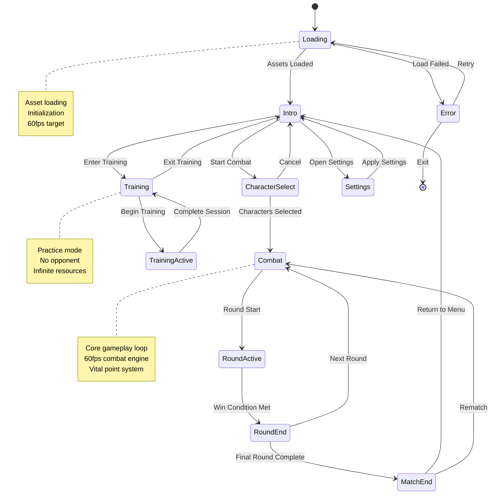

---

## ⚔️ Combat State Machine

### **Combat Phase States**

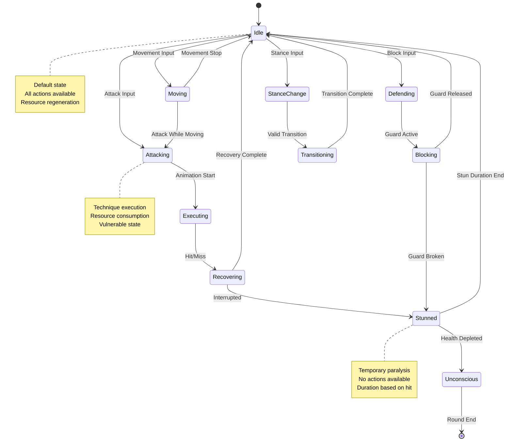

### **Player Combat Status**

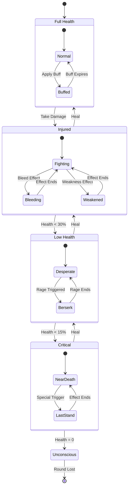

---

## 🎯 Trigram Stance System

### **Eight Trigram Stance Transitions**

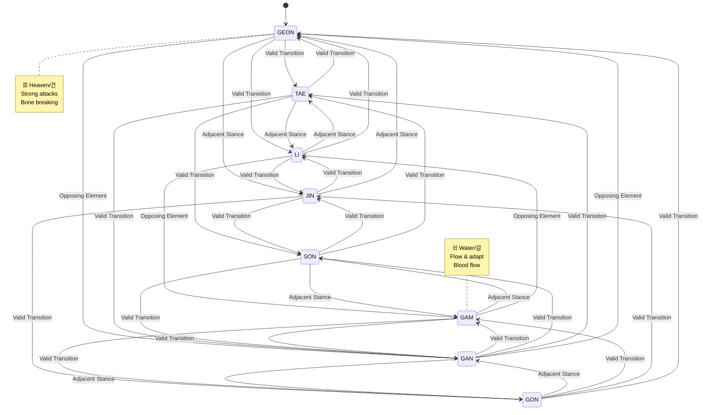

### **Stance Properties State**

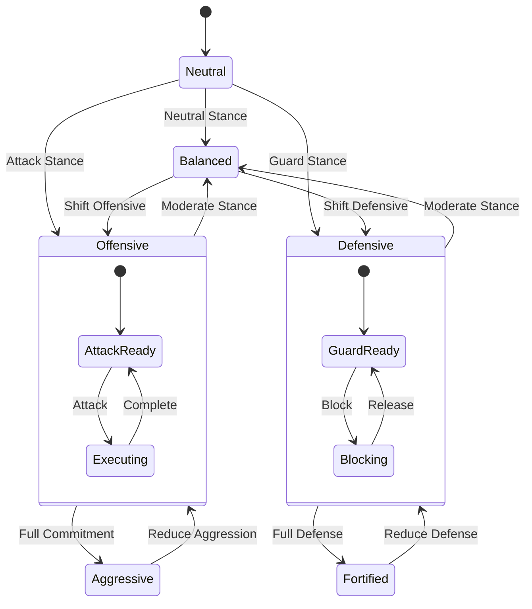

---

## 💥 Hit Detection State Machine

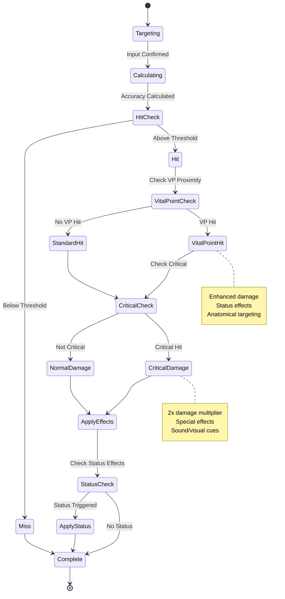

---

## 🎨 Visual Effect State Machine

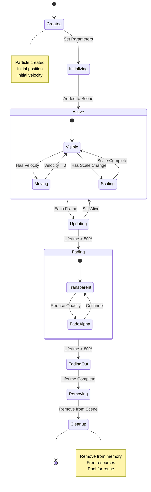

---

## 🎵 Audio State Machine

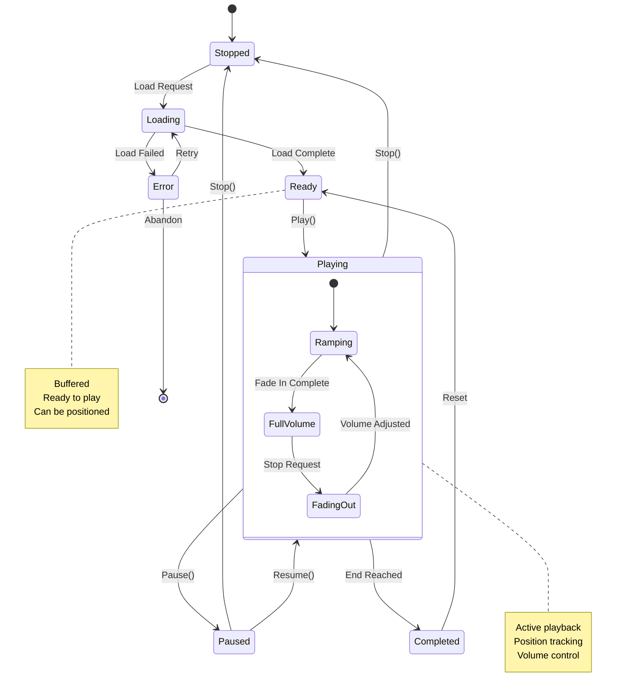

---

## 🔄 Resource Management State

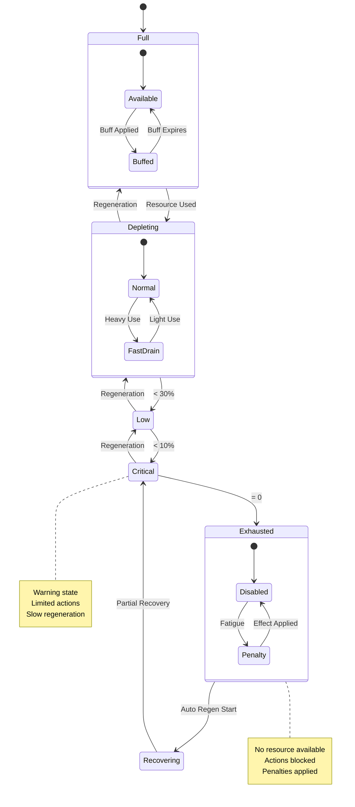

---

## 🧠 AI Behavior State Machine

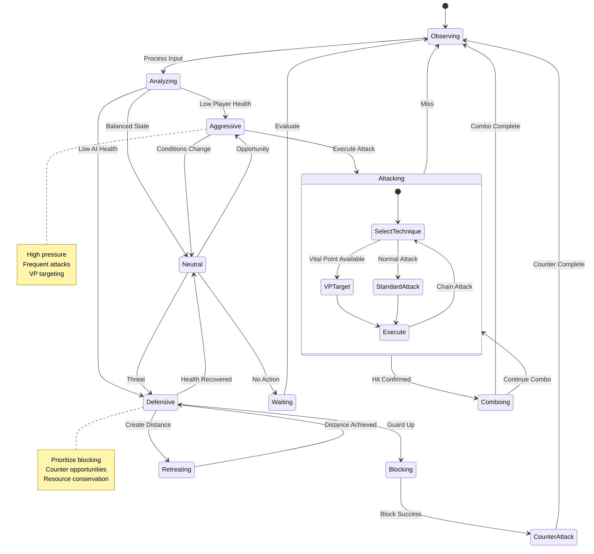

---

## 🎯 Status Effect Lifecycle

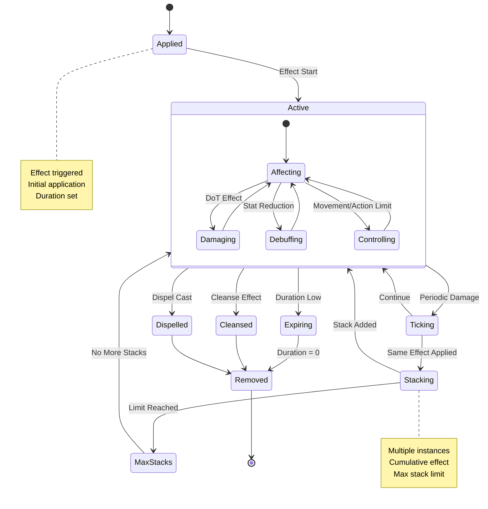

---

## 🏆 Match Flow State Machine

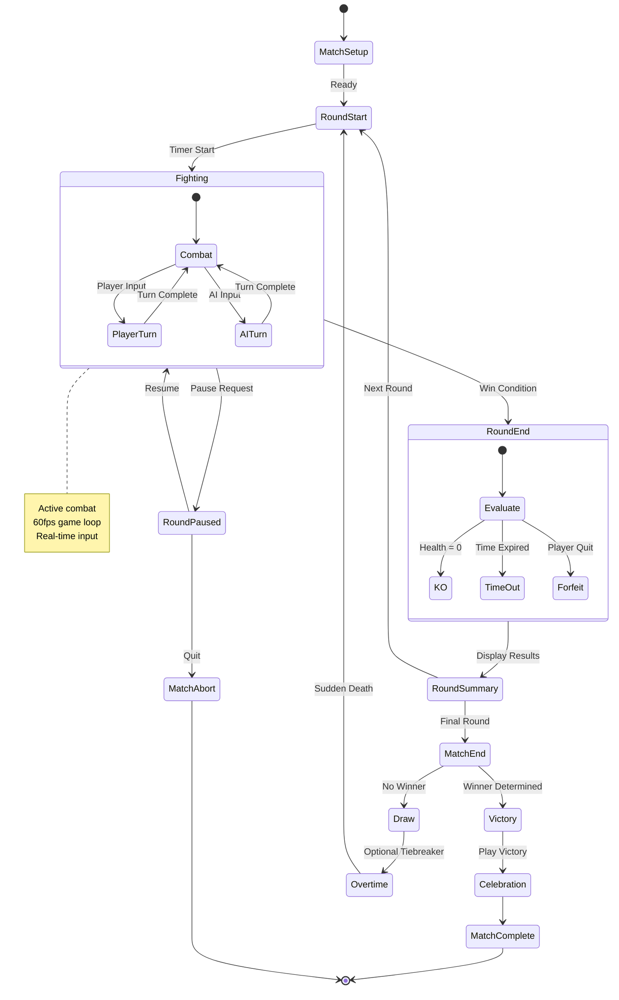

---

**📋 Document Control:**  
**✅ Approved by:** CEO  
**📤 Distribution:** Public  
**🏷️ Classification:** Public  
**📅 Effective Date:** 2025-11-14  
**⏰ Next Review:** 2026-11-14  
**🎯 Compliance:** ISO 27001 (A.8.9), NIST CSF (PR.IP-1)
