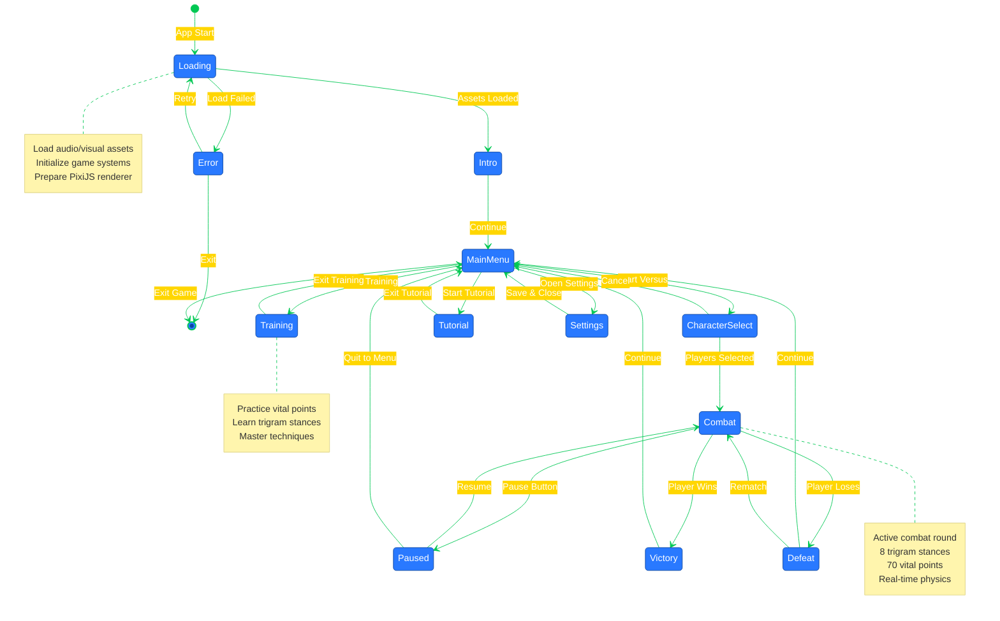
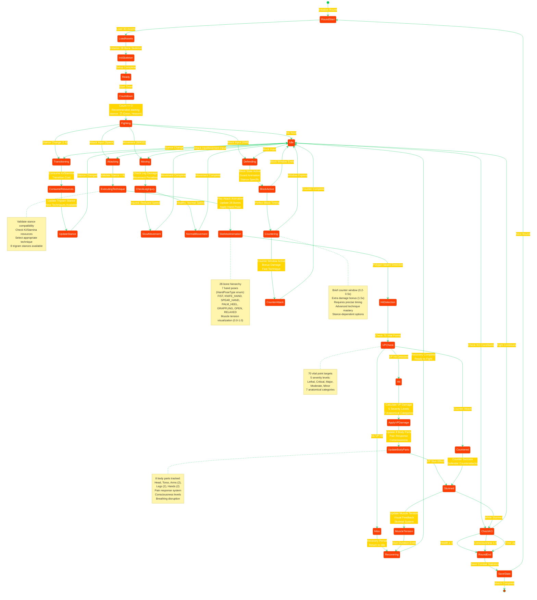
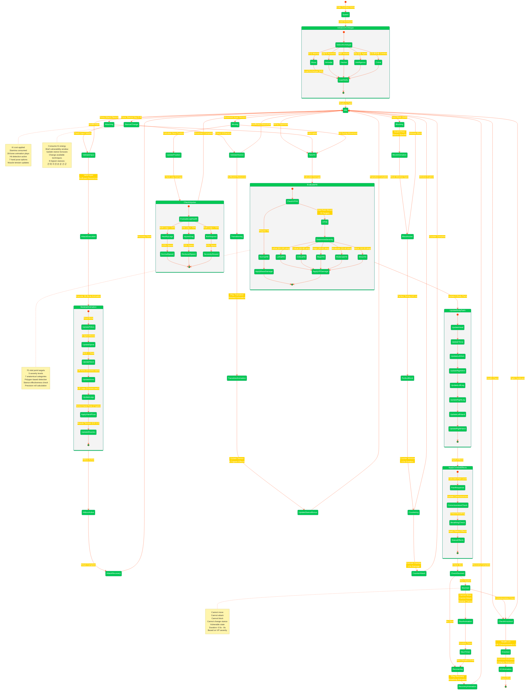
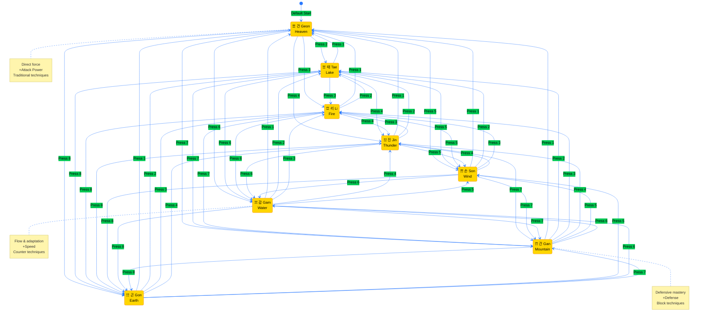
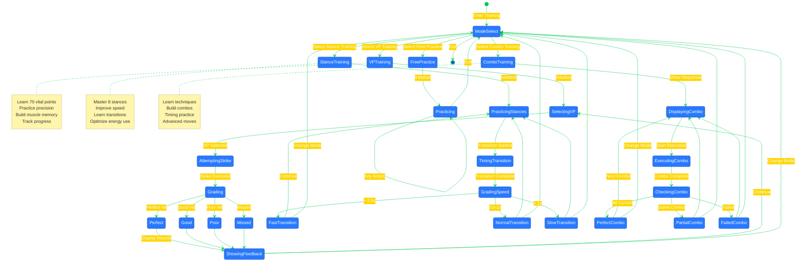
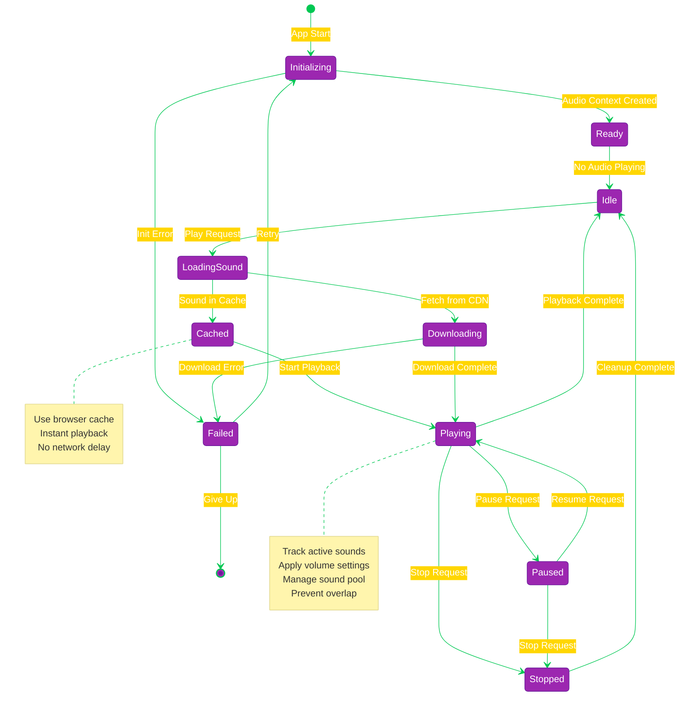
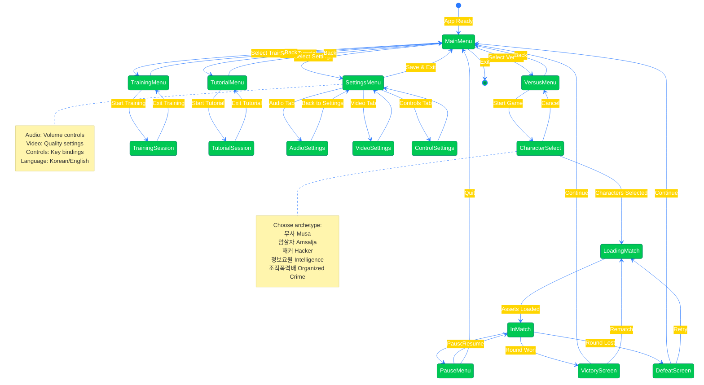
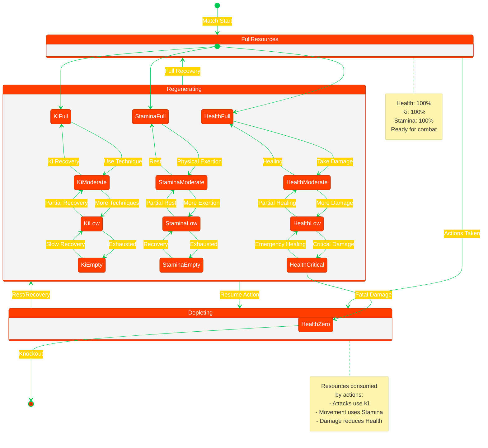

# 🎮 Black Trigram (흑괘) State Diagrams

**🔐 ISMS Alignment:** This document follows [Hack23 Secure Development Policy](https://github.com/Hack23/ISMS-PUBLIC/blob/main/Secure_Development_Policy.md) architecture documentation requirements.

## 📚 Related Documentation

| Document                                      | Focus            | Description                                    |
| --------------------------------------------- | ---------------- | ---------------------------------------------- |
| [Architecture](ARCHITECTURE.md)               | 🏛️ Structure     | C4 model showing system components             |
| [Data Model](DATA_MODEL.md)                   | 📊 Data          | Type system and data structures                |
| [Flowchart](FLOWCHART.md)                     | 🔄 Process Flow  | Game flow and user journeys                    |
| [Combat Architecture](COMBAT_ARCHITECTURE.md) | ⚔️ Combat System | Detailed combat mechanics implementation       |
| [Future State Diagram](FUTURE_STATEDIAGRAM.md)| 🔮 Evolution     | Planned state machine enhancements             |

---

## 🎯 Overview

This document provides comprehensive state machine diagrams for Black Trigram (흑괘), documenting all game states, combat states, and their valid transitions. State diagrams use Korean cyberpunk color scheme consistent with the game's aesthetic.

---

## 🎮 Main Game State Machine

### **Top-Level Game States**

---

## ⚔️ Combat State Machine

### **Combat Round States (70 Vital Points + 28-Bone Animation)**

### **Player Combat States (5 Archetypes + Skeletal System)**

---

## 🎯 Trigram Stance State Machine

### **Eight Trigram Transitions**

---

## 🥋 Training Mode States

### **Training Session State Machine**

---

## 🎵 Audio State Machine

### **Audio System States**

---

## 🔄 UI State Machine

### **Menu Navigation States**

---

## 📊 Resource Management States

### **Player Resource States**

---

**흑괘의 길을 걸어라** - _Walk the Path of the Black Trigram through State Transitions_

These state diagrams document all valid state transitions for Black Trigram game systems, ensuring comprehensive understanding of state management for authentic Korean martial arts combat simulation.
