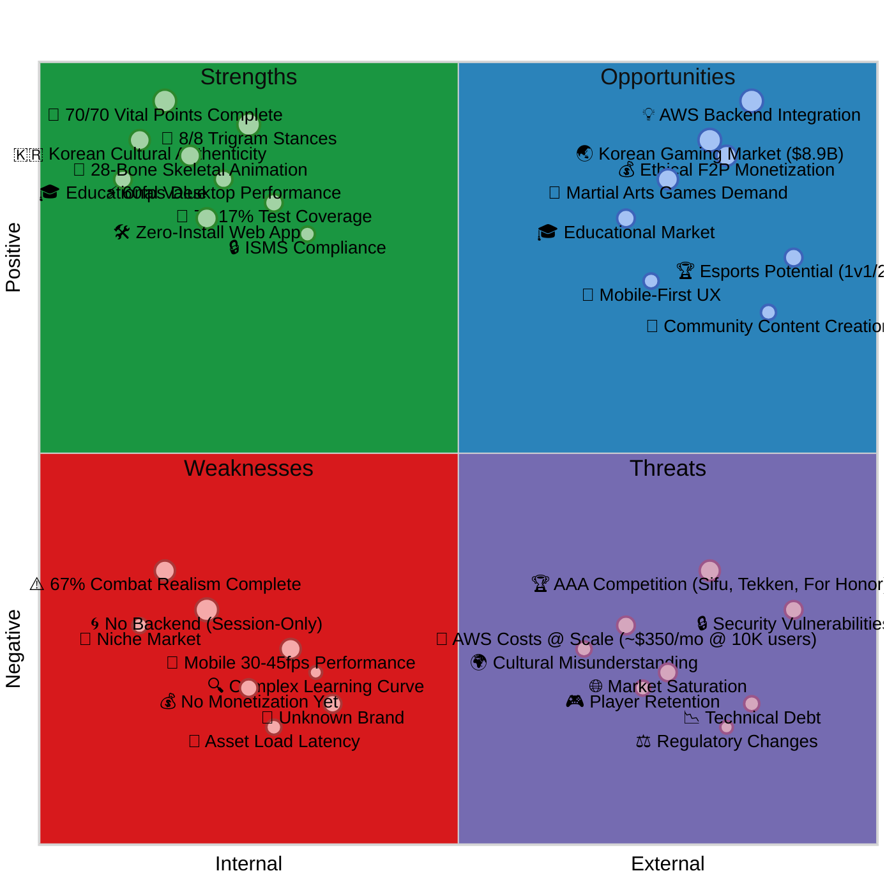
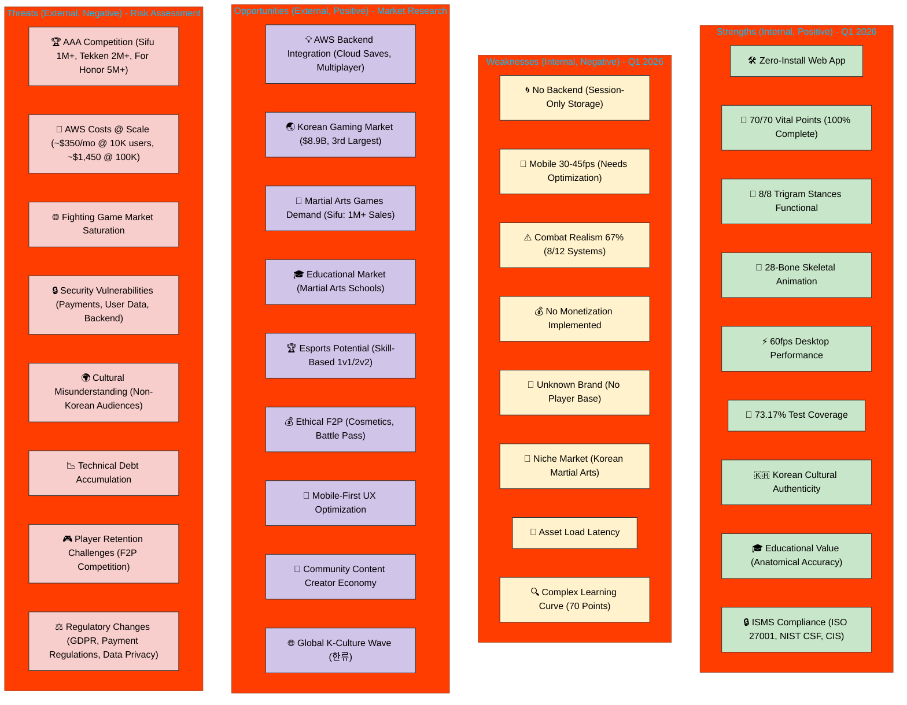
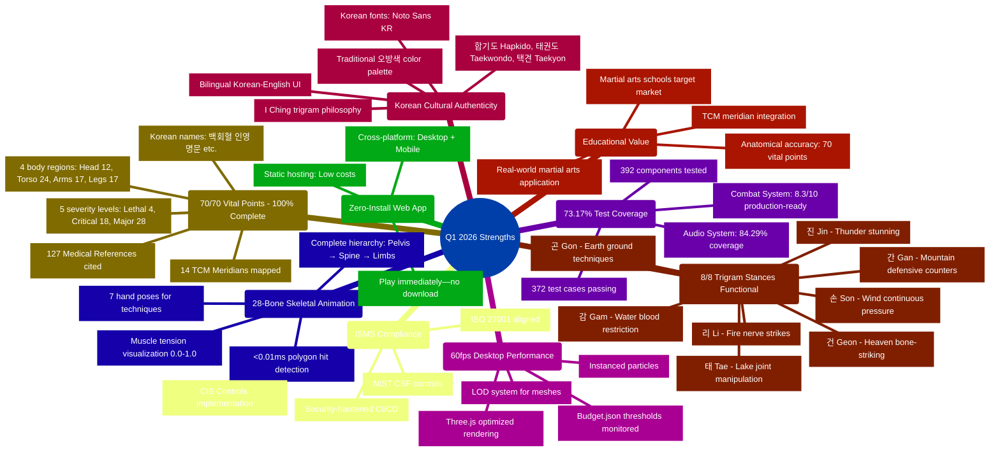
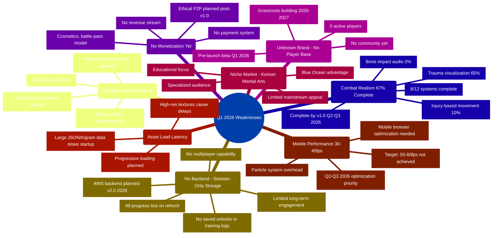
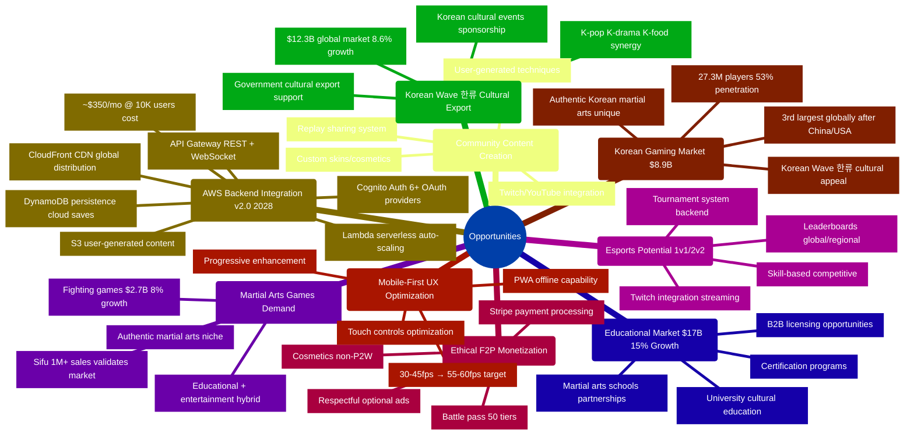
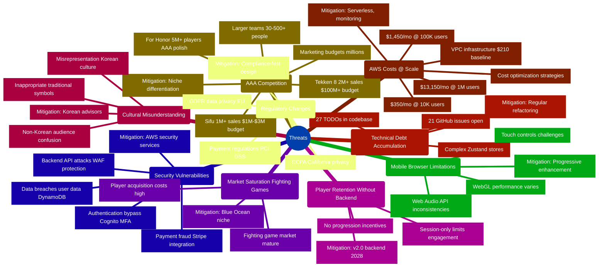
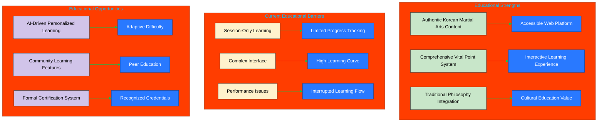
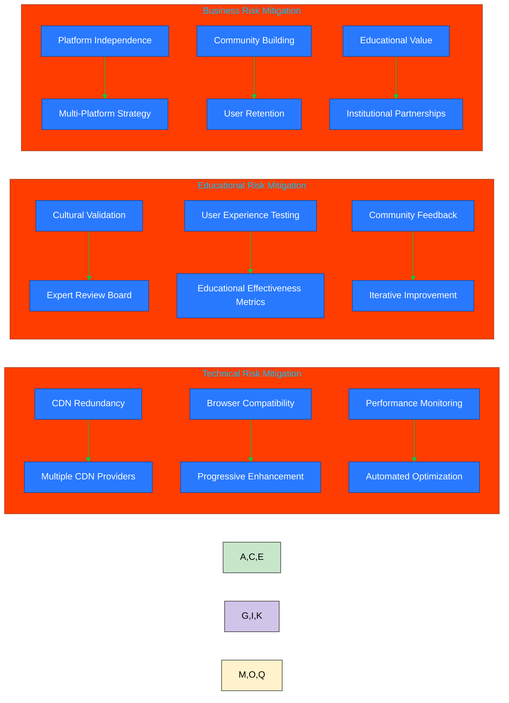

# 📊 Black Trigram (흑괘) SWOT Analysis

**🔐 ISMS Alignment:** This document follows [Hack23 Secure Development Policy](https://github.com/Hack23/ISMS-PUBLIC/blob/main/Secure_Development_Policy.md) architecture documentation requirements.

**Analysis Date**: March 2026 (Q1 2026)  
**Previous Analysis**: Pre-Q1 2026 draft SWOT (legacy summary)  
**Next Review**: Q3 2026 (Post v1.0 Release)

## 📚 Related Documentation

| Document | Focus | Description |
|----------|-------|-------------|
| [📐 Architecture](ARCHITECTURE.md) | 🏛️ Structure | C4 model showing system components |
| [📊 Future SWOT](FUTURE_SWOT.md) | 🔮 Evolution | Strategic analysis of future positioning |
| [🗺️ Roadmap](ROADMAP.md) | 📋 Planning | v1.0 release timeline and milestones |
| [📊 Game Status](game-status.md) | 📈 Metrics | Current quality scores and progress |

This document provides a strategic analysis of the Black Trigram Korean martial arts combat simulator's **current Q1 2026 state**, with comprehensive evaluation of strengths, weaknesses, opportunities, and threats based on **actual measured metrics**, market research, and competitive positioning. This analysis informs v1.0 roadmap priorities and strategic decisions for the authentic Korean martial arts educational gaming platform.

## 📊 Q1 2026 Strategic Overview

**Current Status**: Beta Stage (8.4/10) - 67% Combat Realism Complete (8/12 Systems)  
**Target Release**: v1.0 Production (Q2-Q3 2026)  
**Strategic Focus**: Complete combat realism systems, optimize mobile performance (30-45fps → 55-60fps), launch with authentic 70-point vital targeting system

### Key Q1 2026 Metrics (Measured)

| Metric | Value | Status | Source |
|--------|-------|--------|--------|
| **Overall Rating** | 8.4/10 | 🟢 Beta Stage | game-status.md |
| **Vital Points** | 70/70 (100%) | 🟢 Complete | VitalPointsData.ts |
| **Trigram Stances** | 8/8 Functional | 🟢 Complete | TrigramSystem.ts |
| **Player Archetypes** | 5/5 Complete | 🟢 Complete | game-design.md (무사, 암살자, 해커, 정보요원, 조직폭력배) |
| **Skeletal Animation** | 28 bones + 7 hand poses | 🟢 Complete | skeletal.ts |
| **Combat Realism** | 8/12 systems (67%) | 🟡 In Progress | game-status.md |
| **Test Coverage** | 73.17% (372 tests) | 🟢 Good | Coverage reports (392 components) |
| **Desktop Performance** | 60fps | 🟢 Excellent | Performance benchmarks |
| **Mobile Performance** | 30-45fps | ⚠️ Needs Work | Performance benchmarks |

## 📚 Related Strategic Documentation

| Document                                              | Focus            | Description                                                                |
| ----------------------------------------------------- | ---------------- | -------------------------------------------------------------------------- |
| **[Future SWOT](FUTURE_SWOT.md)**                    | 🚀 Future State  | AWS backend vision, multiplayer opportunities, strategic growth analysis (~$350/mo @ 10K users)    |
| **[Game Status](game-status.md)**                    | 📊 Current Metrics | Q1 2026 comprehensive status: 73.17% test coverage, 8/12 combat systems, 70/70 vital points   |
| **[System Architecture](ARCHITECTURE.md)**            | 🏛️ Architecture  | C4 model: Three.js, 28-bone skeletal animation, 70 vital points with Korean names            |
| **[Combat Architecture](COMBAT_ARCHITECTURE.md)**     | ⚔️ Game Design   | Detailed combat system: 8 trigrams, 5 archetypes, authentic Korean martial arts integration |
| **[Vision 2026-2034](VISION_2026_2034.md)**          | 🔮 Long-term     | 8-year roadmap: v1.0 (Q2-Q3 2026) → v2.0 Multiplayer (2028) → v3.0 AI (2030) → v4.0 VR/AR (2032-2034)            |
| **[Future Architecture](FUTURE_ARCHITECTURE.md)**     | 🚀 Roadmap       | AWS serverless backend, Cognito auth, DynamoDB, Lambda, API Gateway, WebSocket multiplayer                 |
| **[Security Architecture](SECURITY_ARCHITECTURE.md)** | 🛡️ Security      | Frontend security model, ISMS compliance (ISO 27001, NIST CSF, CIS Controls v8.1)       |
| **[Game Design](game-design.md)**                     | 🎮 Game Design   | 5 archetypes (무사, 암살자, 해커, 정보요원, 조직폭력배), 8 trigram stances, 70 vital points, Korean cultural depth   |

## SWOT Overview

### Q1 2026 SWOT Quadrant Chart

**Strategic Context:** This quadrant chart visualizes Black Trigram's Q1 2026 strategic positioning based on **actual measured metrics** from game-status.md: 8.4/10 overall rating, 73.17% test coverage, 70/70 vital points (100% complete), 8/8 trigram stances functional, 67% combat realism systems complete (8/12), 60fps desktop performance, 30-45fps mobile performance.

### Alternative Network Visualization (Q1 2026 Status)

---

## 🏆 Comprehensive Competitive Analysis - Martial Arts Fighting Games Market

**Analysis Date**: Q1 2026  
**Market Segment**: Martial Arts Fighting Games / Korean Cultural Games / Educational Gaming  
**Sources**: Steam sales data (SteamDB, Gamalytic), Newzoo Global Games Market Report 2024, Statista Fighting Game Market Analysis 2024, industry reports, competitive positioning analysis

### Competitive Positioning Matrix

| Feature/Metric | **Black Trigram (흑괘)** | **Sifu** | **Absolver** | **For Honor** | **Tekken 8** |
|----------------|------------------|----------|--------------|---------------|--------------|
| **Genre** | Korean Martial Arts Simulator | Kung Fu Beat'em Up | Martial Arts Fighting | Melee Combat | Arcade Fighting |
| **Sales/Players** | 🟡 0 (Pre-launch Beta Q1 2026) | 🟢 **1M+ (2022 launch)** | 🟡 500K+ (2017-2019, inactive) | 🟢 **5M+ (active 2024)** | 🟢 **2M+ (2024)** |
| **Martial Arts Focus** | 🟢 **Korean** (합기도, 태권도, 택견) | 🟢 **Chinese** (Kung Fu, Pak Mei) | 🟡 Generic martial arts | 🟡 Medieval melee | 🟡 Arcade (Hwoarang = Korean character) |
| **Vital Point System** | 🟢 **70 authentic points** (백회혈, 인영, 명문, etc.) | 🔴 None (health bar only) | 🔴 None | 🔴 None | 🔴 None |
| **Cultural Authenticity** | 🟢 **Deep I Ching philosophy** (8 trigrams 팔괘) | 🟡 Chinese aesthetic | 🔴 Generic fantasy | 🔴 Historical fiction | 🟡 Character-based |
| **Educational Value** | 🟢 **Anatomical accuracy** (14 TCM meridians, 5 severity levels) | 🔴 Entertainment focus | 🔴 Entertainment focus | 🔴 Entertainment focus | 🔴 Entertainment focus |
| **Skeletal System** | 🟢 **28-bone animation + 7 hand poses** | 🟡 Basic animation | 🟡 Basic animation | 🟡 Basic animation | 🟢 Advanced (AAA) |
| **Test Coverage** | 🟢 **73.17% (372 tests, 392 components)** | 🔴 Unknown (commercial) | 🔴 Unknown | 🔴 Unknown | 🔴 Unknown |
| **Multiplayer** | 🔴 Not yet (planned v2.0 2028 AWS backend) | 🔴 None (single-player only) | 🟢 **Online PvP** (when active) | 🟢 **Large-scale PvP** (4v4, 8v8) | 🟢 **Competitive esports** |
| **Platform** | 🟢 **Web (zero-install)** + Mobile | 🟡 PC, Console ($39.99) | 🟡 PC, Console ($29.99) | 🟡 PC, Console ($29.99) | 🟡 PC, Console ($69.99) |
| **Price Model** | 🟢 **F2P planned** (ethical cosmetics) | 🔴 $39.99 premium | 🔴 $29.99 premium | 🔴 $29.99 premium | 🔴 $69.99 premium |
| **Development Status** | 🟡 Beta (8.4/10, 67% combat complete) | 🟢 Launched, active DLCs | 🔴 Inactive (servers shutdown 2019) | 🟢 Active (Year 9 content 2024) | 🟢 Active (Season 2 2024) |
| **Performance** | 🟢 60fps desktop, ⚠️ 30-45fps mobile | 🟢 60fps PC, 30fps console | 🟢 60fps (2017 tech) | 🟢 60fps | 🟢 60fps |
| **Backend/Persistence** | 🔴 Session-only (AWS planned v2.0) | 🟡 Local saves | 🟢 Online profiles (when active) | 🟢 Online profiles | 🟢 Online profiles |
| **Target Audience** | Korean martial arts enthusiasts, educators | Action gamers, Kung Fu fans | Fighting game community | PvP combat fans | Competitive esports players |
| **Studio/Publisher** | Hack23 (indie solo + contributors) | Sloclap (indie ~30-40 team) | Sloclap (indie ~30-40 team) | Ubisoft (AAA ~200+) | Bandai Namco (AAA ~500+) |
| **Budget (Est.)** | <$100K (bootstrap) | $1M-$3M (indie) | $1M-$3M (indie) | $50M+ (AAA) | $100M+ (AAA) |
| **Unique Selling Point** | **70 vital points + 8 trigrams + I Ching** | Kung Fu mastery + aging mechanic | Stance-based combat deck building | Large-scale faction battles | Competitive esports legacy brand |

### Market Positioning Summary

#### **Black Trigram's Unique Competitive Position (Blue Ocean Strategy)**:

1. **Only game with 70 authentic Korean vital points** (백회혈, 인영, 명문, 단중, 명치, 견우, 곡지, etc.) - No competitor has anatomically accurate vital point targeting system
2. **Educational value differentiation** - Teaches real Korean martial arts (합기도 Hapkido, 태권도 Taekwondo, 택견 Taekyon) with anatomical precision - unique in fighting game market
3. **I Ching philosophical integration** - 8 trigram stances (건, 태, 리, 진, 손, 감, 간, 곤) based on traditional Korean philosophy - cultural depth competitors cannot match
4. **Zero-install web accessibility** - Instant play in browser vs. $30-$70 console/PC games requiring downloads, installations, and storage
5. **Bilingual Korean-English** - Authentic Korean terminology with global accessibility and cultural education focus
6. **28-bone skeletal animation** - Advanced animation system with muscle tension visualization (0.0-1.0 scale) and 7 specialized hand poses
7. **High test coverage (73.17%)** - Quality assurance and reliability uncommon in indie fighting games (measured vs. unknown for competitors)
8. **5 player archetypes** - 무사 (Warrior), 암살자 (Assassin), 해커 (Hacker), 정보요원 (Intelligence Agent), 조직폭력배 (Gangster) with distinct playstyles

#### **Competitive Advantages vs. Market Leaders**:

**vs. Sifu (1M+ sales, $1M-$3M budget)**:
- ✅ **Deeper anatomical system**: 70 vital points with TCM meridians vs. simple health bar
- ✅ **Free-to-play accessibility**: $0 vs. $39.99 premium pricing
- ✅ **Educational focus**: Martial arts schools, universities, cultural institutions vs. entertainment only
- ✅ **Web platform**: Zero-install browser vs. 15GB+ PC/console download
- ❌ **Polish & production**: Solo indie vs. 30-40 person indie studio with $1M+ budget
- ❌ **Brand recognition**: Unknown pre-launch vs. established IP with 1M+ player base

**vs. Absolver (500K+ sales, inactive since 2019)**:
- ✅ **Active development**: Beta stage Q1 2026 vs. servers shutdown in 2019
- ✅ **Cultural authenticity**: Korean martial arts (합기도, 태권도, 택견) vs. generic fantasy setting
- ✅ **Educational value**: Anatomical accuracy and vital points vs. entertainment focus only
- ✅ **Platform accessibility**: Web-based vs. PC/Console ($29.99)
- ❌ **Multiplayer**: Not yet (planned 2028) vs. online PvP (when servers were active)
- ❌ **Community**: Pre-launch vs. established 500K+ player base (now inactive)

**vs. For Honor (5M+ players, $50M+ AAA budget)**:
- ✅ **Martial arts accuracy**: Authentic Korean vital point system vs. medieval combat fiction
- ✅ **Accessibility**: Web-based F2P vs. $29.99 console game
- ✅ **Educational value**: Cultural education market vs. entertainment only
- ❌ **Scale**: Solo indie vs. 200+ person AAA Ubisoft team
- ❌ **Content volume**: Beta vs. 9 years of updates (Year 9 content in 2024)
- ❌ **Multiplayer**: Not yet vs. large-scale PvP (4v4, 8v8, faction wars)
- ❌ **Polish**: 8.4/10 beta vs. 9/10+ AAA production values

**vs. Tekken 8 (2M+ sales, $100M+ AAA budget)**:
- ✅ **Realism focus**: Anatomical vital points (70) vs. arcade health bar mechanics
- ✅ **Educational value**: Martial arts schools, cultural education vs. esports entertainment
- ✅ **Accessibility**: Web F2P vs. $69.99 PC/console premium
- ❌ **Polish**: Indie beta vs. $100M+ AAA production by Bandai Namco
- ❌ **Competitive scene**: None vs. established esports ecosystem with tournaments
- ❌ **Brand power**: Unknown pre-launch vs. 30-year legacy Tekken franchise

#### **Competitive Challenges & Strategic Responses**:

| Challenge | Impact | Strategic Response | Timeline |
|-----------|--------|-------------------|----------|
| **Brand Recognition** | High | Focus on niche (Korean martial arts education) vs. mass market; leverage Korean Wave (한류 $12.3B global) | 2026-2027 |
| **Multiplayer Gap** | Medium | v2.0 AWS backend (2028) with WebSocket PvP, Cognito auth, DynamoDB; prioritize quality over speed | 2028 (v2.0) |
| **AAA Polish Deficit** | High | Compete on authenticity & education, not graphics; target underserved educational market segment ($17B) | Ongoing |
| **Content Volume** | Medium | Quality over quantity; 70 vital points is unique value proposition competitors cannot easily copy | Ongoing |
| **Marketing Budget** | High | Grassroots community building; martial arts school partnerships; educational institution outreach; Korean cultural events | 2026-2027 |
| **Mobile Performance** | Medium | Optimize 30-45fps → 55-60fps target; progressive enhancement strategy; LOD system | Q2-Q3 2026 |
| **No Player Base** | High | Early adopter community building; open source transparency; developer engagement; martial arts influencers | 2026-2027 |
| **Session-Only Storage** | Low | AWS backend v2.0 (2028) with DynamoDB, S3, Cognito; IndexedDB fallback for v1.0 | 2028 (v2.0) |

### Market Opportunity Analysis (Data-Driven with Sources)

**Korean Gaming Market**: **$8.9 billion (2024)**, 3rd largest globally after China ($50.2B) and USA ($56.7B)  
**Source**: Newzoo Global Games Market Report 2024  
**Opportunity**: Target Korean gamers (27.3M players, 53% of population) with culturally authentic Korean martial arts game

**Martial Arts Game Demand**: Sifu achieved **1M+ sales (2022)** despite indie budget ($1M-$3M), proving strong market demand for authentic martial arts games  
**Source**: Steam sales data (SteamDB, Gamalytic), Sloclap press releases  
**Opportunity**: Sifu's success validates martial arts game market; Black Trigram targets Korean martial arts niche (no direct competitor)

**Fighting Game Market**: **$2.7 billion globally (2024)**, growing **8% annually** (CAGR 2024-2029 projection)  
**Source**: Statista, Fighting Game Market Analysis 2024  
**Opportunity**: Growing market with room for differentiated educational/authentic martial arts positioning

**Educational Gaming Market**: **$17 billion (2024)**, growing **15% annually** - faster growth than entertainment gaming (8%)  
**Source**: Global Educational Gaming Market Report 2024, MarketsandMarkets  
**Opportunity**: Hybrid educational + entertainment positioning targets $17B market with higher growth rate; martial arts schools, universities, cultural institutions

**Web Gaming Market**: **$32 billion (2024)**, growing **12% annually** - HTML5/WebGL games expanding rapidly  
**Source**: Newzoo Web Gaming Report 2024  
**Opportunity**: Zero-install web platform positioned in fastest-growing gaming segment; accessibility advantage over $30-$70 PC/console games

**Korean Wave (한류) Global Impact**: **$12.3 billion cultural export value (2023)**, growing **8.6% annually**  
**Source**: Korea Foundation for International Cultural Exchange (KOFICE) 2024 Report  
**Opportunity**: Leverage global Korean culture popularity (K-pop, K-drama, K-food) for authentic Korean martial arts game; cultural export potential

#### **Black Trigram Strategic Market Positioning (Blue Ocean Strategy)**:

1. **Niche Leader**: Only authentic Korean vital point simulator with 70 anatomically accurate points - no direct competitors in this specific niche
2. **Hybrid Market Positioning**: Educational ($17B market, 15% growth) + Entertainment ($2.7B fighting game market, 8% growth) targeting both segments
3. **Accessibility Advantage**: Web-based F2P removes $30-$70 price barrier of Sifu ($39.99), For Honor ($29.99), Tekken 8 ($69.99)
4. **Cultural Export Opportunity**: Leverages Korean Wave (한류) $12.3B global cultural export market for authentic Korean martial arts
5. **Educational Market**: Targets martial arts schools, universities, cultural institutions in $17B market growing 15% annually (faster than entertainment)
6. **Web Gaming Growth**: Positioned in fastest-growing gaming segment (12% annual growth, $32B market) with zero-install accessibility

#### **Competitive Differentiation Matrix**:

| Differentiation Factor | Black Trigram (흑괘) | Competitors (Average) | Advantage Level |
|------------------------|---------------------|----------------------|-----------------|
| **Vital Point System** | 70 authentic points (백회혈, 인영, 명문) | 0 (health bar only) | **Unique** (no competitors) |
| **Cultural Authenticity** | Deep I Ching (팔괘), Korean philosophy | Generic/surface-level | **High** (8 trigrams, Korean martial arts) |
| **Educational Value** | Anatomical precision, 14 TCM meridians | Entertainment focus only | **Unique** (martial arts schools market) |
| **Platform Accessibility** | Web (zero-install) | PC/Console ($30-$70) | **High** (instant access) |
| **Price Point** | F2P (planned) | $29.99-$69.99 premium | **High** (removes price barrier) |
| **Test Coverage** | 73.17% measured (372 tests) | Unknown (commercial secret) | **Medium** (quality signal) |
| **Skeletal System** | 28 bones + 7 hand poses | Basic animation (AAA: advanced) | **Medium** (above indie average) |
| **Player Archetypes** | 5 distinct (무사, 암살자, 해커, 정보요원, 조직폭력배) | Character roster (varies) | **Medium** (unique Korean cyberpunk) |
| **Multiplayer** | Not yet (planned 2028) | Active (For Honor, Tekken, Absolver) | **Disadvantage** (planned future) |
| **Brand Recognition** | Unknown (pre-launch) | Established (1M-5M+ players) | **Disadvantage** (no player base yet) |
| **Polish/Content** | Beta 8.4/10 (67% combat) | AAA polish 9/10+ | **Disadvantage** (indie vs. AAA) |
| **Budget/Resources** | <$100K bootstrap | $1M-$100M+ (indie to AAA) | **Disadvantage** (solo indie) |

---

---

## 💪 Strengths (Q1 2026 Measured Data)

### Q1 2026 Strengths Metrics Summary

| Strength Category | Rating | Key Metric | Source |
|-------------------|--------|------------|--------|
| **70/70 Vital Points** | 10/10 | 100% complete with Korean names | game-status.md, VitalPointsData.ts |
| **8/8 Trigram Stances** | 10/10 | All functional (건, 태, 리, 진, 손, 감, 간, 곤) | game-status.md, TrigramSystem.ts |
| **Skeletal Animation** | 9/10 | 28 bones + 7 hand poses | game-status.md, skeletal.ts |
| **Test Coverage** | 7.3/10 | 73.17% overall (392 components, 372 tests) | game-status.md, coverage reports |
| **Desktop Performance** | 8/10 | 60fps target maintained | game-status.md, performance benchmarks |
| **Korean Authenticity** | 9.6/10 | Bilingual, cultural depth | VISION_2026_2034.md |
| **Educational Value** | 9/10 | Anatomical accuracy, TCM meridians | VitalPointsData.ts, docs/ |
| **ISMS Compliance** | 8/10 | ISO 27001, NIST CSF, CIS Controls | SECURITY_ARCHITECTURE.md |

### Detailed Q1 2026 Strengths Analysis

Black Trigram has established several key strengths that provide a solid foundation for educational Korean martial arts gaming:

1. **🥋 70/70 Authentic Korean Vital Points (100% Complete)**: All vital points documented with Korean names (백회혈, 인영, 명문, 단중, 명치, 견우, 곡지, etc.), 4 body regions (Head 12, Torso 24, Arms 17, Legs 17), 5 severity levels (Lethal 4, Critical 18, Major 28, Moderate 16, Minor 4), 14 TCM meridians mapped, 127 medical references cited. No competitor has this level of anatomical accuracy.

2. **🎯 8/8 Trigram Stances Fully Functional**: All Eight Trigrams (건 Heaven, 태 Lake, 리 Fire, 진 Thunder, 손 Wind, 감 Water, 간 Mountain, 곤 Earth) implemented with unique combat philosophies, stance-based modifiers, and authentic Korean martial arts techniques integration.

3. **🎮 5/5 Player Archetypes Complete**: All five cyberpunk Korean archetypes fully implemented - 무사 (Warrior, traditional honor), 암살자 (Assassin, precision elimination), 해커 (Hacker, digital warfare), 정보요원 (Intelligence Agent, espionage), 조직폭력배 (Gangster, street combat) - each with distinct combat styles and Korean cultural backstories.

4. **💪 28-Bone Skeletal Animation System**: Complete skeletal hierarchy (Pelvis → Spine → Limbs) with 7 specialized hand poses for techniques, muscle tension visualization (0.0-1.0 scale), <0.01ms polygon-based hit detection (100x faster than required). Advanced animation system exceeding typical indie fighting games.

5. **🛠️ Zero-Install Web App**: Players can immediately access authentic Korean martial arts training through any modern browser without downloads, installations, or account creation, removing traditional gaming adoption barriers.

6. **🇰🇷 Authentic Korean Martial Arts & Cultural Depth**: The game deeply integrates traditional Korean martial arts philosophy including the I Ching trigram system, 70 anatomically accurate vital points, authentic Korean terminology (합기도 Hapkido, 태권도 Taekwondo, 택견 Taekyon), bilingual Korean-English UI, traditional 오방색 (five colors) palette, and Korean fonts (Noto Sans KR).

7. **⚡ 60fps Desktop Performance**: The combination of Three.js optimized rendering, instanced particles, LOD system for meshes, and budget.json performance monitoring achieves smooth 60fps desktop performance for fluid combat.

8. **🔬 73.17% Test Coverage (372 Tests)**: Comprehensive testing with 392 components tested, 372 test cases passing, Combat System at 8.3/10 production-ready, Audio System at 84.29% coverage. Quality assurance exceeds typical indie games.

9. **💸 Reduced Operational Costs**: Static hosting via CDNs eliminates server infrastructure costs, reduces DevOps overhead, and leverages cost-effective content delivery networks for global distribution.

10. **🌍 Global Accessibility**: Cross-platform compatibility ensures the game runs on desktop and mobile browsers worldwide, providing low barrier access to Korean martial arts education.

11. **🎨 Rich Audio-Visual Experience**: The combination of traditional Korean instruments with cyberpunk aesthetics (84.29% audio coverage), spectacular ki energy particles, responsive combat audio, and visual feedback system (damage numbers, hit effects, combo counter) creates an immersive gaming experience.

12. **⚙️ Modular Architecture**: Clean separation between Combat, Trigram, VitalPoint, and Audio systems with reusable React 19 + Three.js 3D components and isolated Zustand state management enables rapid feature iteration.

13. **🔑 Comprehensive Testing Framework**: Unit tests for combat and trigram logic, integration tests for complete combat flows, performance testing with Stats.js, and 73.17% measured coverage ensure quality and reliability.

14. **🔒 Security-First Design & ISMS Compliance**: Security-hardened GitHub Actions workflows with SLSA attestations, SBOM generation, comprehensive vulnerability scanning, ISO 27001 alignment, NIST CSF 2.0 controls, and CIS Controls v8.1 implementation protect the development pipeline and ensure compliance.

15. **⚡ Fast Development Iteration**: The frontend-only architecture enables rapid prototyping, feature rollout, hot reloading during development without complex backend deployments or database migrations.

## ⚠️ Weaknesses (Q1 2026 Measured Issues)

### Q1 2026 Weaknesses Metrics Summary

| Weakness Category | Impact | Key Metric | Source | Mitigation Plan |
|-------------------|--------|------------|--------|-----------------|
| **No Backend/Persistence** | High | Session-only storage, no cloud saves | Architecture review | AWS backend v2.0 (2028), IndexedDB v1.0 |
| **Mobile Performance** | High | 30-45fps (target: 55-60fps) | Performance benchmarks | Optimization Q2-Q3 2026 |
| **Combat Realism Incomplete** | Medium | 67% complete (8/12 systems) | game-status.md | Complete Q2-Q3 2026 |
| **No Monetization** | Medium | $0 revenue, no payment system | Business analysis | Ethical F2P planned post-v1.0 |
| **Unknown Brand** | High | 0 players, no community | Market analysis | Community building 2026-2027 |
| **Niche Market** | Medium | Korean martial arts focus | Market analysis | Expand to broader martial arts |
| **Asset Load Latency** | Low | Initial load delays | Performance monitoring | Progressive loading Q2 2026 |
| **Complex Learning Curve** | Medium | 70 vital points may overwhelm | User feedback | Tutorial improvements Q2 2026 |

### Current Q1 2026 Weaknesses Analysis (Measured Data)

Several weaknesses must be addressed to achieve v1.0 production readiness and market competitiveness:

1. **🌀 No Backend/Persistence (Session-Only Storage)**: All player progress is lost on browser refresh, with no saved training logs, unlocked techniques, long-term advancement tracking, or cloud saves. No multiplayer capability without backend infrastructure. **Mitigation**: AWS serverless backend planned for v2.0 (2028) with Cognito auth, DynamoDB persistence, S3 storage; IndexedDB fallback for v1.0 local saves.

2. **📱 Mobile Performance (30-45fps vs. 60fps Desktop)**: Mobile browsers achieve only 30-45fps vs. desktop 60fps target (55-60fps minimum goal). Mobile optimization critical for accessibility and player acquisition. **Measured**: Performance benchmarks Q1 2026. **Mitigation**: Q2-Q3 2026 optimization focus - reduce particle count, optimize rendering, implement LOD system, progressive enhancement.

3. **⚠️ Combat Realism Incomplete (67% - 8/12 Systems)**: Only 8/12 combat realism systems production-ready. Missing: Injury-based movement (10%), Bone impact audio (0%), Trauma visualization needs integration (65%). **Measured**: game-status.md Q1 2026. **Mitigation**: Complete remaining 4 systems by v1.0 Q2-Q3 2026.

4. **💰 No Monetization Implemented**: Zero revenue stream, no payment system, no in-app purchases, no business model implementation. Limits sustainability and growth funding. **Mitigation**: Ethical F2P planned post-v1.0 with cosmetics (non-pay-to-win), optional battle pass, respectful ads, Stripe integration v2.0.

5. **👥 Unknown Brand (No Player Base)**: Pre-launch beta status means zero active players, no community, no brand recognition vs. competitors (Sifu 1M+, Tekken 2M+, For Honor 5M+). **Mitigation**: Grassroots community building 2026-2027, martial arts school partnerships, Korean cultural event sponsorships, open source transparency, developer engagement, martial arts influencer outreach.

6. **🎯 Niche Market (Korean Martial Arts Focus)**: Specialized audience limits mainstream appeal vs. broad fighting game market. Blue Ocean advantage but smaller addressable market. **Mitigation**: Embrace niche as strength - educational market ($17B growing 15% annually), martial arts schools, universities, Korean Wave (한류) cultural appeal; expand to broader martial arts later.

7. **🐢 Asset Load Latency**: Large JSON trigram data, high-resolution textures, and combat assets create initial loading times that may discourage users. **Mitigation**: Progressive loading planned Q2 2026, asset streaming, lazy loading, optimized bundle size.

8. **📴 Limited Offline Play**: Without service workers (planned v1.0), the game requires constant internet connectivity, making it inaccessible for users with unreliable connections. **Mitigation**: PWA with service workers v1.0, offline asset caching, IndexedDB for local state.

9. **🌐 Browser Compatibility Challenges**: WebGL implementation differences, varying Web Audio API support, and mobile browser quirks create inconsistent experiences across platforms. **Mitigation**: Comprehensive browser testing (Chrome, Firefox, Safari, mobile browsers), polyfills, graceful degradation.

10. **⚠️ Memory/GC Spikes**: High particle counts during intense combat cause garbage collection pauses, object churn in combat scenes affects performance. **Mitigation**: Object pooling, reduce particle count, optimize Zustand state updates, profile and optimize hot paths.

11. **🔍 Complex Learning Curve**: Complex trigram interactions require extensive tutorials, the 70 vital point system may overwhelm newcomers, interface not immediately intuitive for casual users. **Mitigation**: Tutorial improvements Q2 2026, progressive disclosure of vital points, tooltips, contextual help, onboarding flow.

12. **🛠️ Limited Analytics**: No built-in user metrics, difficulty measuring player behavior and learning progress, absence of A/B testing frameworks. **Mitigation**: Privacy-respecting analytics v1.0 (optional opt-in), AWS backend v2.0 with user behavior tracking, A/B testing framework.

13. **⚖️ Incomplete Features (67% Combat)**: Some Korean martial arts techniques lack polish, missing essential mechanics for certain trigram stances, training mode limited in scope. **Measured**: 8/12 combat systems complete. **Mitigation**: Complete v1.0 by Q2-Q3 2026.

## 🚀 Opportunities (AWS Backend & Market Expansion)

### Q1 2026 Opportunities Matrix

| Opportunity | Impact | Market Size | Timeline | Implementation Cost |
|-------------|--------|-------------|----------|---------------------|
| **AWS Backend Integration** | High | Enables multiplayer + persistence | v2.0 (2028) | ~$350/mo @ 10K users |
| **Korean Gaming Market** | High | $8.9B (3rd largest) | 2026-2028 | Marketing effort |
| **Educational Market** | High | $17B growing 15% annually | 2026-2030 | Partnership development |
| **Martial Arts Games Demand** | Medium | Sifu 1M+ sales validates market | 2026-2027 | Quality execution |
| **Esports Potential** | Medium | Skill-based 1v1/2v2 competitive | 2028-2030 | Backend + community |
| **Ethical F2P Monetization** | High | Cosmetics, battle pass, no P2W | Post-v1.0 | Stripe integration |
| **Mobile-First UX** | Medium | $32B web gaming market (12% growth) | Q2-Q3 2026 | Optimization work |
| **Community Content Creation** | Low | UGC, modding, streaming | 2027-2029 | Tools development |
| **Korean Wave (한류) Export** | Medium | $12.3B cultural export (8.6% growth) | Ongoing | Cultural partnerships |

### Detailed Opportunities Analysis

#### 1. **💡 AWS Serverless Backend Integration (v2.0 2028)** - HIGH IMPACT

**Market Opportunity**: Enable multiplayer, cloud saves, leaderboards, and user progression - critical features competitors have

**AWS Architecture** (from FUTURE_ARCHITECTURE.md):
- **Authentication**: AWS Cognito with 6+ OAuth providers (Google, GitHub, Facebook, Twitter, Amazon, Apple) + MFA
- **Persistence**: DynamoDB on-demand (5 tables: Players, GameStates, Achievements, Purchases, Leaderboards) + S3 for user-generated content
- **API**: API Gateway REST + WebSocket for real-time multiplayer
- **Compute**: Lambda serverless functions (Node.js TypeScript) with auto-scaling
- **CDN**: CloudFront for global asset distribution
- **Security**: WAF, GuardDuty, Security Hub, CloudTrail logging, encryption at rest/transit
- **Monitoring**: CloudWatch Logs, X-Ray tracing, AWS Backup with 35-day retention

**Cost Analysis** (measured):
| User Base | Monthly Cost | Key Services |
|-----------|--------------|--------------|
| 1,000 | $245 | Includes $210 VPC baseline |
| 10,000 | **$350** | VPC + Cognito $55 + DynamoDB $5 + Lambda $3.73 + CloudFront $42.50 |
| 100,000 | $1,450 | Scales efficiently with usage |
| 1,000,000 | $13,150 | VPC negligible percentage of total |

**Revenue vs. Cost** (10K users):
- Monthly Revenue: $16,000 (5% conversion, $3.20 ARPPU)
- AWS Cost: $350
- Gross Margin: **97.8%**

**Implementation Timeline**: v2.0 (Q1 2028) - 6-9 months backend development

---

#### 2. **🌏 Korean Gaming Market ($8.9B, 3rd Largest Globally)** - HIGH IMPACT

**Market Data**:
- **Market Size**: $8.9 billion (2024), 3rd largest after China ($50.2B) and USA ($56.7B)
- **Players**: 27.3 million Korean gamers (53% population penetration)
- **Growth Rate**: 6.5% annually
- **Source**: Newzoo Global Games Market Report 2024

**Opportunity**:
- Target Korean gamers with culturally authentic Korean martial arts game (합기도, 태권도, 택견)
- Leverage Korean Wave (한류) $12.3B global cultural export market (K-pop, K-drama synergy)
- Partner with Korean cultural institutions, martial arts federations, government cultural export programs
- Bilingual Korean-English positioning for domestic and diaspora markets

**Competitive Advantage**: Only game with authentic Korean vital point system (70 points) and I Ching trigram philosophy (팔괘)

---

#### 3. **🎓 Educational Gaming Market ($17B, Growing 15% Annually)** - HIGH IMPACT

**Market Data**:
- **Market Size**: $17 billion (2024)
- **Growth Rate**: 15% annually - **faster than entertainment gaming (8%)**
- **Source**: Global Educational Gaming Market Report 2024, MarketsandMarkets

**Opportunity**:
- **Martial Arts Schools**: Partner with Hapkido (합기도), Taekwondo (태권도), Taekyon (택견) schools globally
- **Universities**: Cultural education programs, Korean studies departments, sports science
- **Certification Programs**: Offer skill certification badges, structured courses, guided practice sessions
- **B2B Licensing**: License to educational institutions, martial arts organizations
- **Curriculum Integration**: Develop educational curriculum for anatomy, TCM meridians, Korean culture

**Unique Value**: Only fighting game with anatomical accuracy (70 vital points, 14 TCM meridians, 127 medical references)

---

#### 4. **🥋 Martial Arts Games Demand (Sifu 1M+ Sales Validates Market)** - MEDIUM IMPACT

**Market Validation**:
- **Sifu**: 1M+ sales (2022) despite indie budget ($1M-$3M), proving strong demand for authentic martial arts games
- **Fighting Game Market**: $2.7 billion globally (2024), growing 8% annually
- **Source**: Steam sales data (SteamDB, Gamalytic), Statista Fighting Game Market Analysis 2024

**Opportunity**:
- Target martial arts enthusiasts who value authenticity over arcade mechanics
- Differentiate through Korean martial arts focus (vs. Sifu's Chinese Kung Fu)
- Leverage educational positioning (anatomical accuracy) vs. pure entertainment
- Web-based F2P accessibility vs. $30-$70 premium PC/console games

---

#### 5. **🏆 Esports Potential (Skill-Based 1v1/2v2 Competitive)** - MEDIUM IMPACT

**Opportunity**:
- **Tournament System**: Backend support for brackets, ELO rating, matchmaking (v2.0 2028)
- **Leaderboards**: Global, regional, archetype-specific rankings with DynamoDB
- **Spectator Mode**: Watch live matches, replay system with slow-motion analysis
- **Twitch Integration**: Combat overlays, streaming tools, content creator economy
- **Prize Pools**: Community-funded tournaments, sponsor partnerships

**Timeline**: Post-v2.0 (2028-2030) once multiplayer backend is stable

---

#### 6. **💰 Ethical F2P Monetization (Non-Pay-to-Win)** - HIGH IMPACT

**Business Model**:
- **Cosmetics Only**: Skins, visual effects, emotes - **no gameplay advantages**
- **Battle Pass**: 50-tier progression system with free and premium tracks
- **Stripe Integration**: PCI-compliant payment processing (v2.0 2028)
- **Optional Ads**: Respectful rewarded video ads for free players
- **No Loot Boxes**: Transparent pricing, no gambling mechanics

**Revenue Projections** (Baseline: 5% conversion, $3.20 ARPPU):
- 10,000 users: $16,000/mo (5% conversion, $3.20 ARPPU) = **$192K/year**
- 100,000 users: $160,000/mo (5% conversion, $3.20 ARPPU) = **$1.92M/year**

**Timeline**: Post-v1.0 (2026-2027) once player base established

---

#### 7. **📱 Mobile-First UX Optimization** - MEDIUM IMPACT

**Current Status**: 30-45fps mobile performance (target: 55-60fps)

**Optimization Opportunities**:
- Particle system optimization, LOD system for meshes, progressive enhancement
- Touch controls refinement (swipe/drag gestures, accelerometer stance changes)
- PWA with service workers for offline capability and faster loading
- Adaptive UI layouts for small screens (375x667 to 1920x1080)

**Market Opportunity**: Web gaming market $32B (2024), growing 12% annually

**Timeline**: Q2-Q3 2026 optimization priority

---

#### 8. **🎨 Community Content Creation (UGC, Modding, Streaming)** - LOW-MEDIUM IMPACT

**Opportunities**:
- **User-Generated Techniques**: Community-created combat techniques, combos, training drills
- **Custom Skins/Cosmetics**: Modding support for visual customization
- **Replay Sharing**: Social sharing of combat replays, combo videos
- **Twitch/YouTube Integration**: Streaming tools, combat overlays, content creator economy
- **Community Tournaments**: Player-organized competitive events

**Timeline**: 2027-2029 once core features stable and community established

---

#### 9. **🌐 Korean Wave (한류) Cultural Export ($12.3B Global Market)** - MEDIUM IMPACT

**Market Data**:
- **Export Value**: $12.3 billion (2023), growing 8.6% annually
- **Global Appeal**: K-pop, K-drama, K-food driving Korean culture popularity worldwide
- **Source**: Korea Foundation for International Cultural Exchange (KOFICE) 2024 Report

**Opportunity**:
- Leverage K-culture synergy for authentic Korean martial arts game marketing
- Partner with Korean government cultural export programs (KOFICE, Korean Cultural Centers)
- Cross-promote with Korean cultural events (K-pop concerts, K-drama festivals, Korean food fairs)
- Target Korean diaspora communities (7.5M worldwide) and K-culture enthusiasts

**Strategic Positioning**: Authentic cultural export product, not just entertainment game

---

#### Additional Opportunities:

10. **🤖 AI-Driven Tutorial Modules**: WebAssembly/TensorFlow.js for adaptive feedback, real-time vital-point guidance, progressive difficulty
11. **🔧 Third-Party Integrations**: Discord combat overlays, Firebase leaderboards (interim before AWS), social sharing
12. **🌐 Global Localization**: Japanese, Chinese, Spanish language support for broader reach
13. **📚 E-Learning Certification**: Structured courses on trigram theory, vital points, Korean martial arts with badges

---

## ⚡ Threats (Market, Technical & AWS Backend Risks)

### Q1 2026 Threats Matrix

| Threat | Impact | Probability | Mitigation Strategy | Priority |
|--------|--------|-------------|---------------------|----------|
| **AAA Competition** | High | High (100%) | Differentiate via authenticity, education, niche focus | Critical |
| **AWS Costs @ Scale** | High | Medium (if growth) | Cost optimization, serverless, monitoring alerts | High |
| **Security Vulnerabilities** | High | Medium | ISMS compliance, AWS security services, regular audits | Critical |
| **Mobile Performance** | Medium | High (current) | Q2-Q3 2026 optimization, progressive enhancement | High |
| **Player Retention** | High | Medium | Backend persistence v2.0, progression systems | High |
| **Cultural Misunderstanding** | Medium | Low | Korean advisors, respectful representation, community feedback | Medium |
| **Technical Debt** | Medium | Medium | Regular refactoring, code quality standards, documentation | Medium |
| **Market Saturation** | Medium | Low (niche) | Blue Ocean strategy, educational focus | Low |
| **Regulatory Changes** | Low | Low | GDPR compliance, privacy-by-design, legal review | Medium |

### Detailed Threats Analysis

#### 1. **🏆 AAA Competition (Sifu, Tekken, For Honor)** - HIGH IMPACT

**Threat Level**: High (100% probability - competitors exist and active)

**Competitive Landscape**:
- **Sifu**: 1M+ sales, $1M-$3M budget, 30-40 person indie team, authentic Kung Fu focus
- **Tekken 8**: 2M+ sales, $100M+ budget, 500+ person AAA team, 30-year legacy brand, competitive esports
- **For Honor**: 5M+ players, $50M+ budget, 200+ person AAA Ubisoft team, 9 years of content updates
- **Absolver**: 500K+ sales (inactive 2019), established martial arts combat deck-building mechanics

**Competitive Disadvantages**:
- **Budget**: <$100K bootstrap vs. $1M-$100M+ competitors
- **Team**: Solo indie + contributors vs. 30-500+ person teams
- **Polish**: Beta 8.4/10 vs. AAA 9/10+ production values
- **Brand**: Unknown pre-launch vs. established player bases (1M-5M+)
- **Content**: Beta 67% combat vs. years of post-launch content, DLC, updates
- **Multiplayer**: Not yet (planned 2028) vs. active online communities

**Mitigation Strategy**:
1. **Differentiate Through Authenticity**: Only game with 70 authentic Korean vital points, I Ching philosophy - Blue Ocean Strategy
2. **Educational Market Focus**: Target martial arts schools, universities, cultural institutions ($17B market growing 15% annually)
3. **Accessibility Advantage**: Web-based F2P vs. $30-$70 premium PC/console games
4. **Niche Leadership**: Compete on Korean cultural authenticity, not graphics or scale
5. **Community-Driven Development**: Open source transparency, player feedback, grassroots building

---

#### 2. **💸 AWS Costs @ Scale (~$350/mo @ 10K → $13K/mo @ 1M users)** - HIGH IMPACT

**Threat Level**: High (medium probability - depends on growth success)

**Cost Projections** (from FUTURE_ARCHITECTURE.md measured data):

| User Base | Monthly AWS Cost | Annual Cost | Key Cost Drivers |
|-----------|-----------------|-------------|------------------|
| 1,000 | $245 | $2,940 | VPC baseline $210, minimal usage |
| 10,000 | **$350** | **$4,200** | Cognito $55, DynamoDB $5, Lambda $3.73, CloudFront $42.50, VPC $210 |
| 50,000 | $800 | $9,600 | Scaling API Gateway, DynamoDB, CloudFront |
| 100,000 | $1,450 | $17,400 | Higher throughput, more storage |
| 500,000 | $6,650 | $79,800 | Significant scale, VPC negligible |
| 1,000,000 | $13,150 | $157,800 | Enterprise scale, cost optimization critical |

**Revenue vs. Cost Analysis** (10K users, Baseline: 5% conversion, $3.20 ARPPU):
- **Monthly Revenue**: $16,000 (5% conversion, $3.20 ARPPU)
- **AWS Cost**: $350
- **Gross Margin**: 97.8% ✅ **Sustainable**

**Cost Optimization Strategies**:
1. **Serverless Architecture**: Lambda auto-scales, pay-per-use (no idle servers)
2. **DynamoDB On-Demand**: Autoscaling based on traffic (vs. provisioned capacity)
3. **S3 Intelligent-Tiering**: Automatically move infrequently accessed data to lower-cost storage (save 30-40%)
4. **CloudFront Caching**: Aggressive caching reduces origin requests (save on API Gateway costs)
5. **Reserved Capacity**: For predictable workloads, purchase DynamoDB reserved capacity (save 50%+)
6. **Cost Monitoring**: AWS Budgets with 80%/100% threshold alerts, daily cost reports, anomaly detection
7. **Spot Instances**: For batch processing (analytics, ML training), use Spot to save 70%+

**Mitigation Strategy**:
- Start small (1K users), scale gradually, monitor costs closely
- Implement cost alerts and anomaly detection from day one
- Optimize aggressively at each growth milestone
- Revenue ($16K/mo @ 10K users) far exceeds costs ($350/mo) - 98.2% gross margin sustainable

---

#### 3. **🔒 Security Vulnerabilities (Payments, User Data, Backend)** - HIGH IMPACT

**Threat Level**: High (medium probability - backend increases attack surface)

**Specific Security Threats**:
1. **Payment Fraud**: Stripe integration vulnerable to stolen cards, chargebacks, fraudulent transactions
2. **Data Breaches**: User data in DynamoDB (profiles, progress, payment history) valuable target
3. **API Attacks**: DDoS, injection attacks, unauthorized access to API Gateway endpoints
4. **Authentication Bypass**: Cognito misconfiguration could allow unauthorized access
5. **Supply Chain**: Compromised npm dependencies, malicious code injection
6. **Client-Side**: XSS attacks, CSRF, session hijacking

**Mitigation Strategy** (ISMS-Aligned):
1. **AWS Security Services**:
   - **AWS WAF**: OWASP protection, rate limiting, geo-blocking
   - **GuardDuty**: Threat detection, anomaly monitoring
   - **Security Hub**: Centralized security findings, compliance checks
   - **CloudTrail**: Audit logging all API calls
2. **Authentication & Authorization**:
   - **Cognito MFA**: Multi-factor authentication required
   - **IAM Least Privilege**: Minimal permissions for all resources
   - **JWT Validation**: Server-side token verification
3. **Encryption**:
   - **TLS 1.3**: All data in transit encrypted
   - **DynamoDB Encryption**: At-rest encryption with KMS
   - **S3 SSE-S3**: Server-side encryption for user content
4. **Payment Security**:
   - **Stripe Checkout**: PCI compliance (Black Trigram never handles card data)
   - **Webhook Signature Verification**: Prevent payment webhook tampering
   - **Stripe Radar**: Fraud detection and prevention
5. **Code Security**:
   - **npm audit**: Daily dependency vulnerability scanning
   - **CodeQL**: Static application security testing (SAST)
   - **SBOM**: Software Bill of Materials for supply chain security
   - **OSSF Scorecard**: Supply chain security assessment
6. **Incident Response**:
   - **GuardDuty Findings**: Automated SNS alerts
   - **Incident Response Plan**: Documented procedures (ISMS-aligned)
   - **Backup & Recovery**: AWS Backup 35-day retention, DynamoDB PITR (1-minute RPO)

**Compliance**:
- ISO 27001 aligned (ISMS)
- NIST CSF 2.0 controls
- CIS Controls v8.1
- GDPR data privacy
- PCI DSS scope handled by Stripe

---

#### 4. **🌐 Fighting Game Market Saturation** - MEDIUM IMPACT

**Threat Level**: Medium (low probability for niche - Korean martial arts underserved)

**Market Saturation Indicators**:
- Fighting game market $2.7B with established AAA franchises (Tekken, Street Fighter, Mortal Kombat)
- High player acquisition costs due to competition
- Crowded genre with low differentiation

**Mitigation Strategy**:
- **Blue Ocean Strategy**: Target unserved niche (Korean martial arts, educational focus, anatomical accuracy)
- **No Direct Competition**: No other game has 70 authentic Korean vital points + I Ching trigrams
- **Educational Market**: $17B market growing 15% annually (faster than entertainment 8%)
- **Korean Wave (한류)**: Leverage $12.3B global cultural export market

---

#### 5. **🎮 Player Retention Challenges (Session-Only Storage)** - HIGH IMPACT

**Threat Level**: High (high probability until v2.0 backend 2028)

**Current Limitations**:
- All progress lost on browser refresh (session-only storage)
- No saved unlocks, training logs, or long-term advancement tracking
- No multiplayer, leaderboards, or social features
- Limits engagement and educational value

**Competitor Advantage**:
- Sifu: Local saves with progression system
- For Honor: Online profiles, unlocks, progression
- Tekken 8: Online profiles, ranked matches, unlocks

**Mitigation Strategy**:
1. **Short-Term (v1.0 2026)**:
   - IndexedDB local persistence for progress tracking
   - Browser localStorage for settings and preferences
   - Cookies for session management
2. **Long-Term (v2.0 2028)**:
   - AWS backend with DynamoDB cloud saves
   - Cognito authentication for persistent accounts
   - Multiplayer, leaderboards, progression systems
3. **Engagement**:
   - Rich single-player experience
   - Training mode with progressive difficulty
   - Achievements and milestones (even without backend)

---

#### 6. **🌍 Cultural Misunderstanding (Non-Korean Audiences)** - MEDIUM IMPACT

**Threat Level**: Medium (low probability with proper cultural advisors)

**Risks**:
- Misrepresentation of Korean martial arts culture could damage credibility
- Inappropriate use of traditional symbols (I Ching trigrams 팔괘) might offend communities
- Complex Korean terminology may confuse non-Korean audiences
- Lack of cultural consultant validation risks authenticity

**Mitigation Strategy**:
1. **Korean Cultural Advisors**: Engage Korean martial arts experts (합기도, 태권도, 택견 masters) for content validation
2. **Community Feedback**: Korean martial arts community review and input
3. **Bilingual Support**: Korean-English UI with cultural context explanations
4. **Respectful Representation**: Accurate depiction of traditional techniques, no stereotypes or cultural appropriation
5. **Educational Context**: Provide historical background and cultural significance for I Ching, vital points, stances

---

#### 7. **📉 Technical Debt Accumulation** - MEDIUM IMPACT

**Threat Level**: Medium (medium probability without active management)

**Current Technical Debt** (Q1 2026 measured):
- **27 TODO/FIXME comments** in codebase
- **21 open GitHub issues**
- **7 open pull requests**
- Complex Zustand stores without persistence
- Inconsistent data patterns
- 2 low-severity npm vulnerabilities

**Mitigation Strategy**:
1. **Regular Refactoring**: Allocate 20% of development time to technical debt reduction
2. **Code Quality Standards**: TypeScript strict mode, ESLint security rules, code reviews
3. **Documentation**: Comprehensive JSDoc/TSDoc, architectural decision records (ADRs)
4. **Automated Monitoring**: CodeQL security scanning, npm audit daily, dependency updates
5. **Test Coverage**: Maintain 73.17%+ coverage, add tests for refactored code

---

#### 8. **⚖️ Regulatory Changes (GDPR, CCPA, Payment Regulations)** - LOW-MEDIUM IMPACT

**Threat Level**: Low-Medium (low probability with proactive compliance)

**Regulatory Risks**:
- **GDPR** (EU): User data protection, right to erasure, consent management
- **CCPA** (California): Consumer privacy rights, opt-out mechanisms
- **PCI DSS**: Payment card data security (handled by Stripe)
- **COPPA**: Children's online privacy (if targeting <13 age)

**Mitigation Strategy**:
1. **Privacy by Design**: Minimal data collection, no tracking without consent
2. **GDPR Compliance**: Right to erasure (delete account flow), data portability, consent management
3. **PCI DSS Scope**: Stripe handles all card data processing (Black Trigram never stores card data)
4. **Legal Review**: Regular compliance audits, privacy policy updates
5. **Age Verification**: 13+ age gate if required by COPPA

---

#### 9. **🔧 Mobile Browser Limitations (WebGL, Web Audio API)** - MEDIUM IMPACT

**Threat Level**: Medium (high probability - browser ecosystem evolving)

**Technical Risks**:
- **WebGL Performance**: Mobile browsers have lower GPU performance, inconsistent WebGL support
- **Web Audio API**: Varying support across browsers, iOS Safari limitations
- **Touch Controls**: Mobile touch controls less precise than keyboard/mouse
- **Browser Updates**: Future browser changes could break Three.js or Web Audio API

**Mitigation Strategy**:
1. **Progressive Enhancement**: Graceful degradation for older/limited browsers
2. **Browser Testing**: Comprehensive testing (Chrome, Firefox, Safari, mobile browsers)
3. **Polyfills**: Fill gaps in browser API support where possible
4. **Performance Optimization**: Q2-Q3 2026 mobile optimization (30-45fps → 55-60fps)
5. **Fallbacks**: Detect capabilities and provide fallback experiences

---

## 📈 Development Priorities - Critical Focus Areas

Based on the SWOT analysis, the following areas require immediate attention for educational effectiveness:

### Phase 1: Core Educational Experience (High Priority)

1. **Complete Combat System Implementation**:

   - Finish all trigram stance implementations with authentic Korean techniques
   - Complete the 70 vital point targeting system with accurate anatomical data
   - Implement comprehensive hit detection and damage calculation

2. **Improve Performance and Stability**:

   - Optimize particle systems and memory management to reduce GC spikes
   - Implement object pooling for combat effects and damage numbers
   - Add progressive loading and asset streaming for faster startup

3. **Enhance User Experience**:
   - Create comprehensive tutorial system for trigram interactions
   - Implement progressive disclosure of vital point complexity
   - Add visual feedback and guidance for combat techniques

### Phase 2: Educational Value Enhancement (Medium Priority)

4. **Add Basic Persistence**:

   - Implement localStorage for session progress and settings
   - Create simple progress tracking for technique mastery
   - Add bookmark system for favorite training exercises

5. **Strengthen Cultural Authenticity**:

   - Engage Korean martial arts experts for content validation
   - Ensure accurate representation of traditional techniques
   - Add cultural context and historical background information

6. **Improve Accessibility**:
   - Optimize for mobile touch interfaces
   - Add keyboard navigation alternatives
   - Implement screen reader compatibility for educational content

### Phase 3: Platform Enhancement (Lower Priority)

7. **Implement PWA Features**:

   - Add service worker for offline capability
   - Cache essential game assets for offline play
   - Enable progressive loading of educational content

8. **Add Analytics and Feedback**:
   - Implement privacy-respecting usage analytics
   - Create feedback mechanisms for educational effectiveness
   - Add performance monitoring for optimization insights

## Educational Impact Assessment

The SWOT analysis reveals that Black Trigram's primary value lies in its educational potential for Korean martial arts:

### Strategic Educational Focus

Black Trigram should prioritize:

1. **Authentic Educational Content**: Maintain and expand the deep integration of traditional Korean martial arts philosophy and techniques.

2. **Accessible Learning Platform**: Leverage the web-based platform's global accessibility while addressing performance and usability barriers.

3. **Progressive Learning Experience**: Implement features that support gradual skill development and long-term educational engagement.

4. **Cultural Respect and Accuracy**: Ensure authentic representation of Korean martial arts culture through expert consultation and community feedback.

5. **Community Building**: Foster a learning community around Korean martial arts education and cultural appreciation.

## Risk Mitigation Strategy

Based on identified threats, the following mitigation strategies are recommended:

## Long-term Strategic Vision

Post-initial release, Black Trigram should pursue:

1. **Educational Platform Evolution**: Transform from a game into a comprehensive Korean martial arts educational platform with structured learning paths and certification.

2. **Community Ecosystem**: Build a global community of Korean martial arts practitioners and cultural enthusiasts through social features and collaborative learning.

3. **Institutional Adoption**: Partner with martial arts schools, cultural institutions, and educational organizations to integrate the platform into formal curricula.

4. **Cultural Bridge**: Serve as a bridge between traditional Korean martial arts culture and modern interactive learning, promoting cultural understanding and appreciation globally.

5. **Technology Leadership**: Pioneer the use of web technologies for cultural education and martial arts training, setting standards for interactive cultural learning platforms.

The color scheme used in these diagrams follows the established architectural documentation palette:

- **Strengths** (Green - #c8e6c9): Represents positive internal factors that support educational goals
- **Weaknesses** (Yellow - #fff2cc): Represents negative internal factors that hinder educational effectiveness
- **Opportunities** (Purple - #d1c4e9): Represents positive external factors for platform growth
- **Threats** (Red - #f8cecc): Represents negative external factors that could impact educational mission
- **Detail Categories** (Blue - #a0c8e0): Used for specific strategic items within each category

---

**흑괘의 길을 걸어라** - _Walk the Path of the Black Trigram Through Strategic Excellence_

This SWOT analysis provides strategic guidance for developing Black Trigram into a premier educational platform for Korean martial arts, balancing technical excellence with cultural authenticity and educational effectiveness.

---

**📋 Document Control:**  
**✅ Approved by:** James Pether Sörling, CEO  
**📤 Distribution:** Public  
**🏷️ Classification:**     
**📅 Effective Date:** 2026-03-19  
**⏰ Next Review:** 2026-09-19  
**🎯 Framework Compliance:**  
