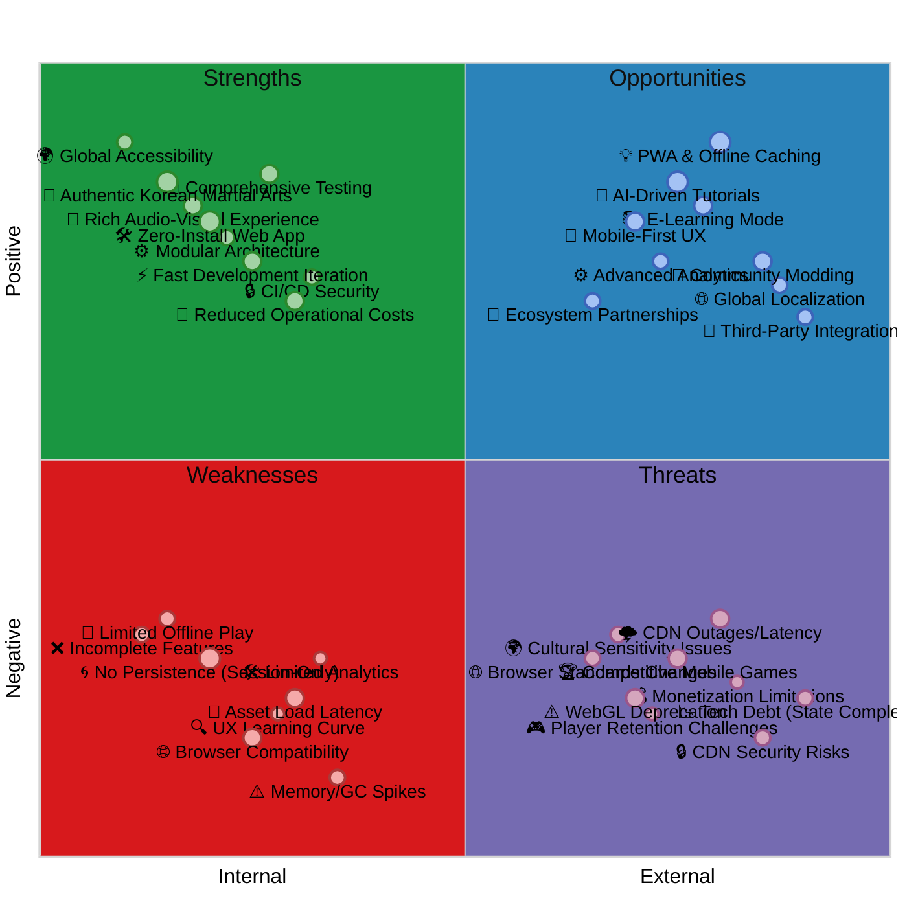
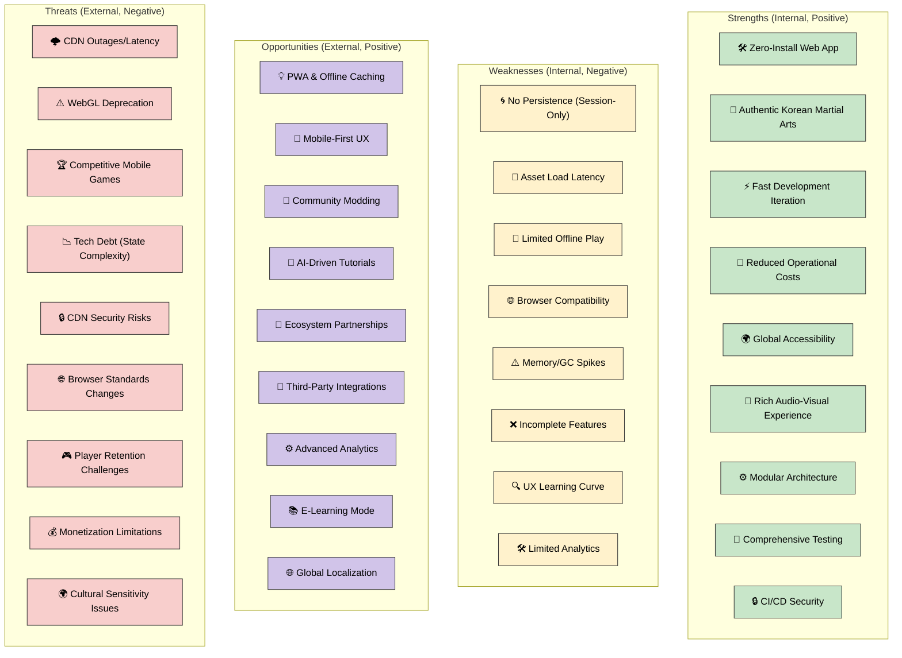
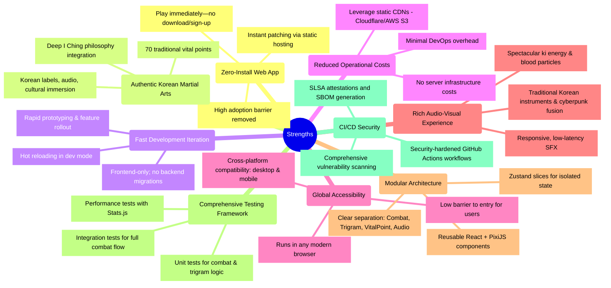
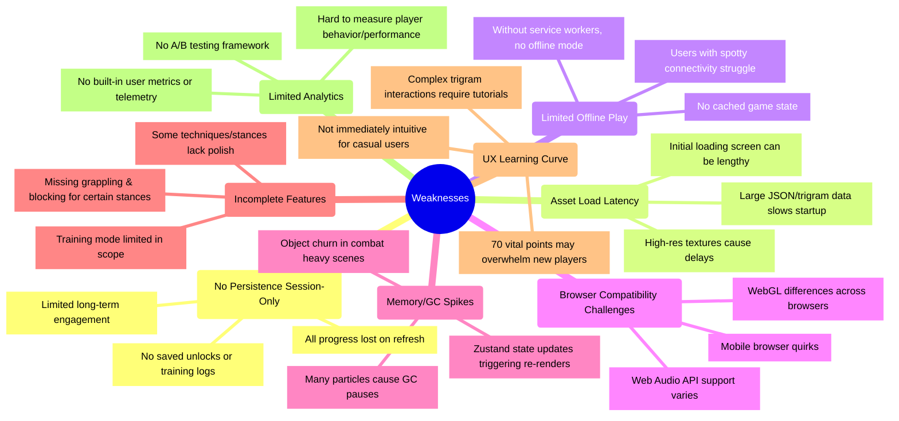
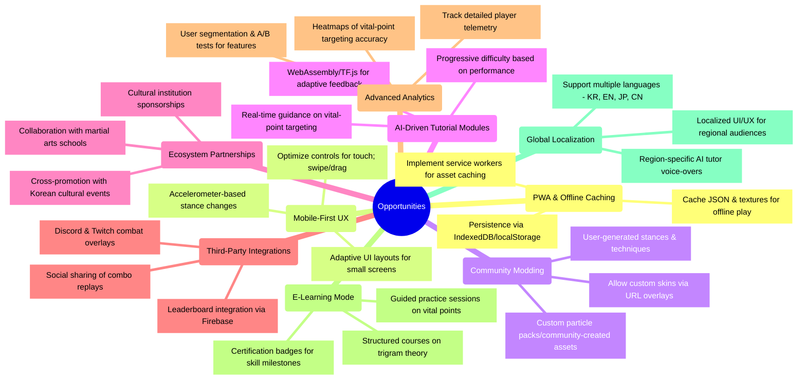
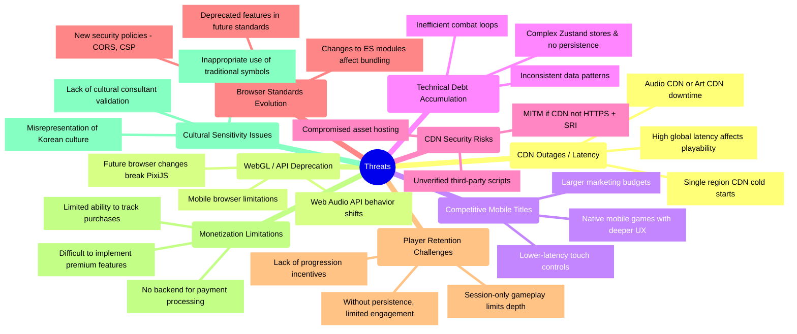
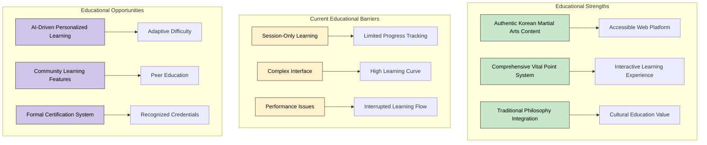
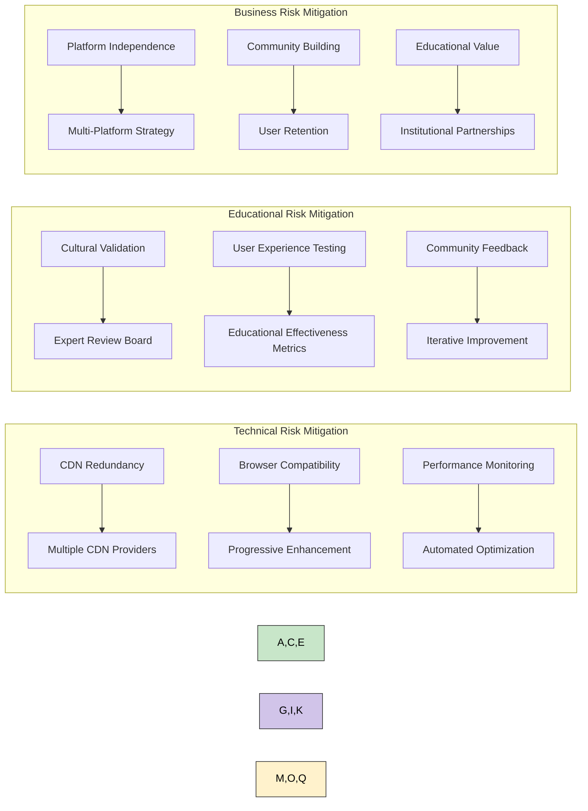

# 📊 Black Trigram (흑괘) SWOT Analysis

This document provides a strategic analysis of the Black Trigram Korean martial arts combat simulator's current strengths, weaknesses, opportunities, and threats. This analysis informs development priorities and strategic decisions for the educational gaming platform.

## 📚 Related Architecture Documentation

| Document                                              | Focus            | Description                                                                |
| ----------------------------------------------------- | ---------------- | -------------------------------------------------------------------------- |
| **[System Architecture](ARCHITECTURE.md)**            | 🏛️ Architecture  | C4 model showing frontend-only PixiJS + React architecture                 |
| **[Combat Architecture](COMBAT_ARCHITECTURE.md)**     | ⚔️ Game Design   | Detailed combat system implementation with Korean martial arts integration |
| **[Game Design](game-design.md)**                     | 🎮 Game Design   | Korean martial arts combat mechanics and player archetypes                 |
| **[Security Architecture](SECURITY_ARCHITECTURE.md)** | 🛡️ Security      | Frontend security model and CI/CD security practices                       |
| **[Audio Assets](AUDIO_ASSETS.md)**                   | 🎵 Assets        | Korean traditional instrument integration and combat audio                 |
| **[Art Assets](ART_ASSETS.md)**                       | 🎨 Assets        | Korean cyberpunk visual design and UI iconography                          |
| **[Future Architecture](FUTURE_ARCHITECTURE.md)**     | 🔮 Future Vision | Planned features and scalability considerations                            |
| **[Development Guide](development.md)**               | 🔧 Development   | Security features, testing strategy, and development environment           |
| **[CI/CD Workflows](WORKFLOWS.md)**                   | 🔄 DevOps        | Security-hardened CI/CD workflows and automation                           |

## SWOT Overview

### Traditional SWOT Quadrant Chart

**Strategic Focus:** This quadrant chart provides a visual representation of Black Trigram's strengths, weaknesses, opportunities, and threats arranged by their internal/external nature and positive/negative impact on the Korean martial arts gaming platform.

### Alternative Network Visualization

<!-- Quadrant charts are not well supported in GitHub Markdown, so providing an alternative mermaid diagram -->

## Strengths

### Current Strengths Analysis

Black Trigram has established several key strengths that provide a solid foundation for educational Korean martial arts gaming:

1. **🛠️ Zero-Install Web App**: Players can immediately access authentic Korean martial arts training through any modern browser without downloads, installations, or account creation, removing traditional gaming adoption barriers.

2. **🥋 Authentic Korean Martial Arts**: The game deeply integrates traditional Korean martial arts philosophy including the I Ching trigram system, 70 anatomically accurate vital points, and authentic Korean terminology with cultural immersion.

3. **⚡ Fast Development Iteration**: The frontend-only architecture enables rapid prototyping, feature rollout, and hot reloading during development without complex backend deployments or database migrations.

4. **💸 Reduced Operational Costs**: Static hosting via CDNs eliminates server infrastructure costs, reduces DevOps overhead, and leverages cost-effective content delivery networks for global distribution.

5. **🌍 Global Accessibility**: Cross-platform compatibility ensures the game runs on desktop and mobile browsers worldwide, providing low barrier access to Korean martial arts education.

6. **🎨 Rich Audio-Visual Experience**: The combination of traditional Korean instruments with cyberpunk aesthetics, spectacular ki energy particles, and responsive combat audio creates an immersive gaming experience.

7. **⚙️ Modular Architecture**: Clean separation between Combat, Trigram, VitalPoint, and Audio systems with reusable React + PixiJS components and isolated Zustand state management.

8. **🔑 Comprehensive Testing Framework**: Unit tests for combat and trigram logic, integration tests for complete combat flows, and performance testing with Stats.js ensure quality and reliability.

9. **🔒 CI/CD Security**: Security-hardened GitHub Actions workflows with SLSA attestations, SBOM generation, and comprehensive vulnerability scanning protect the development pipeline.

## Weaknesses

### Current Weaknesses Analysis

Several weaknesses must be addressed to improve the educational gaming experience:

1. **🌀 No Persistence (Session-Only)**: All player progress is lost on browser refresh, with no saved training logs, unlocked techniques, or long-term advancement tracking, limiting engagement and educational value.

2. **🐢 Asset Load Latency**: Large JSON trigram data, high-resolution textures, and combat assets create lengthy initial loading times that may discourage users before they experience the game.

3. **📴 Limited Offline Play**: Without service workers, the game requires constant internet connectivity, making it inaccessible for users with unreliable connections or those wanting offline practice.

4. **🌐 Browser Compatibility Challenges**: WebGL implementation differences, varying Web Audio API support, and mobile browser quirks create inconsistent experiences across platforms.

5. **⚠️ Memory/GC Spikes**: High particle counts during intense combat cause garbage collection pauses, object churn in combat scenes affects performance, and frequent Zustand state updates trigger unnecessary re-renders.

6. **❌ Incomplete Features**: Some Korean martial arts techniques and stances lack complete implementation, missing essential grappling and blocking mechanics for certain trigram stances, and limited training mode scope.

7. **🔍 UX Learning Curve**: Complex trigram interactions require extensive tutorials, the 70 vital point system may overwhelm newcomers, and the interface isn't immediately intuitive for casual users unfamiliar with martial arts.

8. **🛠️ Limited Analytics**: No built-in user metrics, difficulty measuring player behavior and learning progress, and absence of A/B testing frameworks to optimize the educational experience.

## Opportunities

### Future Opportunities Analysis

Looking beyond the current implementation, several opportunities exist for expanding Black Trigram's educational impact:

1. **💡 PWA & Offline Caching**: Implementing service workers for asset caching, enabling offline play with cached JSON and textures, and adding persistence via IndexedDB would significantly improve accessibility and user experience.

2. **📱 Mobile-First UX**: Optimizing controls for touch interfaces with swipe/drag gestures, creating adaptive UI layouts for small screens, and implementing accelerometer-based stance changes would enhance mobile gaming.

3. **🎨 Community Modding**: Allowing custom skins via URL overlays, supporting community-created particle packs, and enabling user-generated stances and techniques would foster community engagement and content creation.

4. **🤖 AI-Driven Tutorial Modules**: Integrating WebAssembly/TensorFlow.js for adaptive feedback, providing real-time guidance on vital-point targeting, and implementing progressive difficulty based on performance would personalize the learning experience.

5. **🌱 Ecosystem Partnerships**: Collaborating with martial arts schools for educational content, securing cultural institution sponsorships, and cross-promoting with Korean cultural events would increase authenticity and reach.

6. **🔧 Third-Party Integrations**: Creating Discord and Twitch combat overlays, integrating leaderboards via Firebase, and enabling social sharing of combo replays would build community and competitive elements.

7. **⚙️ Advanced Analytics**: Tracking detailed player telemetry, generating heatmaps of vital-point targeting accuracy, and implementing user segmentation with A/B testing would optimize the educational experience.

8. **📚 E-Learning Mode**: Developing structured courses on trigram theory, creating guided practice sessions on vital points, and offering certification badges for skill milestones would formalize the educational aspects.

9. **🌐 Global Localization**: Supporting multiple languages (Korean, English, Japanese, Chinese), creating localized UI/UX for regional audiences, and providing region-specific AI tutor voice-overs would expand global accessibility.

## Threats

### Current Threats Analysis

Several external threats could impact Black Trigram's success as an educational platform:

1. **🌩️ CDN Outages/Latency**: Audio CDN or art CDN downtime could make the game unplayable, high global latency affects real-time combat responsiveness, and single-region CDN cold starts create inconsistent user experiences.

2. **⚠️ WebGL/API Deprecation**: Future browser changes could break PixiJS compatibility, Web Audio API behavior shifts might affect combat audio, and mobile browser limitations could reduce platform support.

3. **🏆 Competitive Mobile Games**: Native mobile games offer deeper UX experiences, provide lower-latency touch controls, and often have larger marketing budgets for user acquisition.

4. **📉 Technical Debt (State Complexity)**: Complex Zustand stores without persistence create maintenance burdens, inconsistent data patterns increase bugs, and inefficient combat loops affect performance.

5. **🔒 CDN Security Risks**: Man-in-the-middle attacks if CDN lacks HTTPS and Subresource Integrity, compromised asset hosting could inject malicious content, and unverified third-party scripts pose security risks.

6. **🌐 Browser Standards Changes**: Changes to ES modules could affect bundling strategies, new security policies like CORS and CSP might break functionality, and deprecated features in future standards require ongoing updates.

7. **🎮 Player Retention Challenges**: Without persistence, player engagement remains limited, lack of progression incentives reduces long-term interest, and session-only gameplay limits educational depth.

8. **💰 Monetization Limitations**: No backend infrastructure prevents payment processing, limited ability to track purchases hampers business models, and implementing premium features becomes difficult without user accounts.

9. **🌍 Cultural Sensitivity Issues**: Misrepresentation of Korean martial arts culture could damage credibility, inappropriate use of traditional symbols might offend communities, and lack of cultural consultant validation risks authenticity.

## Development Priorities - Critical Focus Areas

Based on the SWOT analysis, the following areas require immediate attention for educational effectiveness:

### Phase 1: Core Educational Experience (High Priority)

1. **Complete Combat System Implementation**:

   - Finish all trigram stance implementations with authentic Korean techniques
   - Complete the 70 vital point targeting system with accurate anatomical data
   - Implement comprehensive hit detection and damage calculation

2. **Improve Performance and Stability**:

   - Optimize particle systems and memory management to reduce GC spikes
   - Implement object pooling for combat effects and damage numbers
   - Add progressive loading and asset streaming for faster startup

3. **Enhance User Experience**:
   - Create comprehensive tutorial system for trigram interactions
   - Implement progressive disclosure of vital point complexity
   - Add visual feedback and guidance for combat techniques

### Phase 2: Educational Value Enhancement (Medium Priority)

4. **Add Basic Persistence**:

   - Implement localStorage for session progress and settings
   - Create simple progress tracking for technique mastery
   - Add bookmark system for favorite training exercises

5. **Strengthen Cultural Authenticity**:

   - Engage Korean martial arts experts for content validation
   - Ensure accurate representation of traditional techniques
   - Add cultural context and historical background information

6. **Improve Accessibility**:
   - Optimize for mobile touch interfaces
   - Add keyboard navigation alternatives
   - Implement screen reader compatibility for educational content

### Phase 3: Platform Enhancement (Lower Priority)

7. **Implement PWA Features**:

   - Add service worker for offline capability
   - Cache essential game assets for offline play
   - Enable progressive loading of educational content

8. **Add Analytics and Feedback**:
   - Implement privacy-respecting usage analytics
   - Create feedback mechanisms for educational effectiveness
   - Add performance monitoring for optimization insights

## Educational Impact Assessment

The SWOT analysis reveals that Black Trigram's primary value lies in its educational potential for Korean martial arts:

### Strategic Educational Focus

Black Trigram should prioritize:

1. **Authentic Educational Content**: Maintain and expand the deep integration of traditional Korean martial arts philosophy and techniques.

2. **Accessible Learning Platform**: Leverage the web-based platform's global accessibility while addressing performance and usability barriers.

3. **Progressive Learning Experience**: Implement features that support gradual skill development and long-term educational engagement.

4. **Cultural Respect and Accuracy**: Ensure authentic representation of Korean martial arts culture through expert consultation and community feedback.

5. **Community Building**: Foster a learning community around Korean martial arts education and cultural appreciation.

## Risk Mitigation Strategy

Based on identified threats, the following mitigation strategies are recommended:

## Long-term Strategic Vision

Post-initial release, Black Trigram should pursue:

1. **Educational Platform Evolution**: Transform from a game into a comprehensive Korean martial arts educational platform with structured learning paths and certification.

2. **Community Ecosystem**: Build a global community of Korean martial arts practitioners and cultural enthusiasts through social features and collaborative learning.

3. **Institutional Adoption**: Partner with martial arts schools, cultural institutions, and educational organizations to integrate the platform into formal curricula.

4. **Cultural Bridge**: Serve as a bridge between traditional Korean martial arts culture and modern interactive learning, promoting cultural understanding and appreciation globally.

5. **Technology Leadership**: Pioneer the use of web technologies for cultural education and martial arts training, setting standards for interactive cultural learning platforms.

The color scheme used in these diagrams follows the established architectural documentation palette:

- **Strengths** (Green - #c8e6c9): Represents positive internal factors that support educational goals
- **Weaknesses** (Yellow - #fff2cc): Represents negative internal factors that hinder educational effectiveness
- **Opportunities** (Purple - #d1c4e9): Represents positive external factors for platform growth
- **Threats** (Red - #f8cecc): Represents negative external factors that could impact educational mission
- **Detail Categories** (Blue - #a0c8e0): Used for specific strategic items within each category

---

**흑괘의 길을 걸어라** - _Walk the Path of the Black Trigram Through Strategic Excellence_

This SWOT analysis provides strategic guidance for developing Black Trigram into a premier educational platform for Korean martial arts, balancing technical excellence with cultural authenticity and educational effectiveness.
