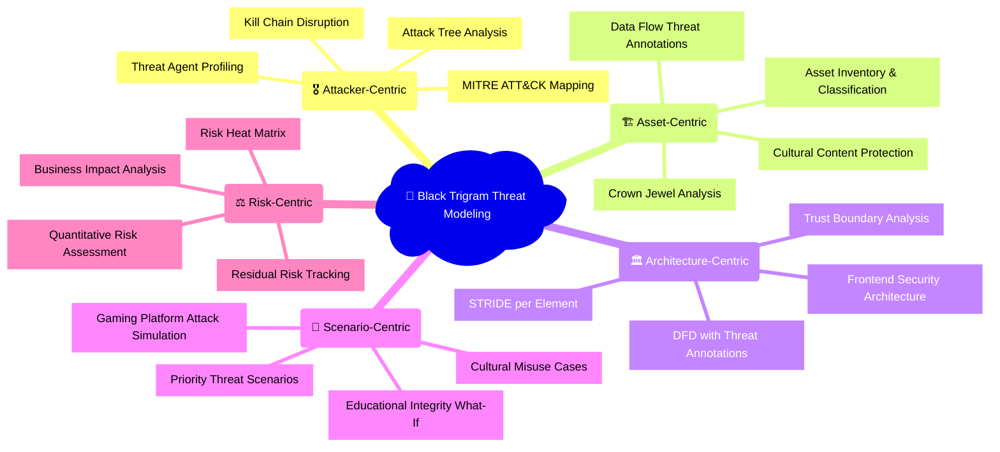
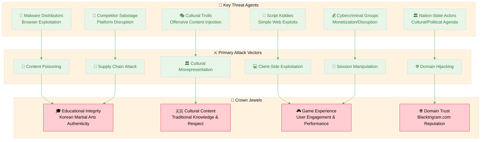
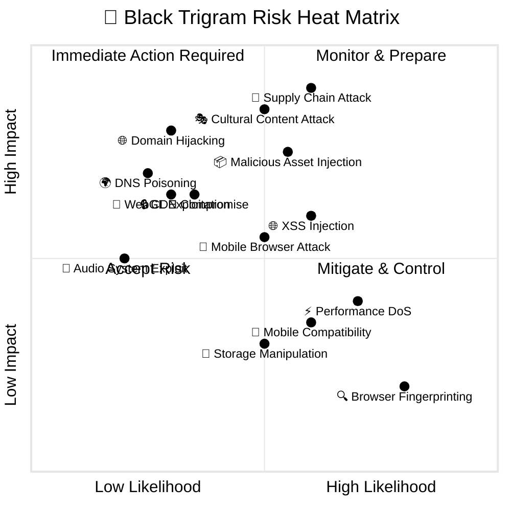
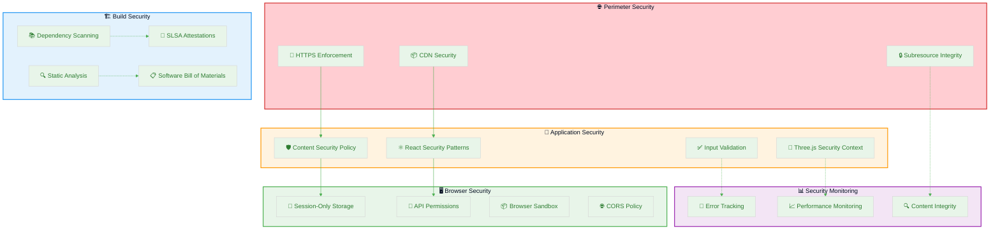
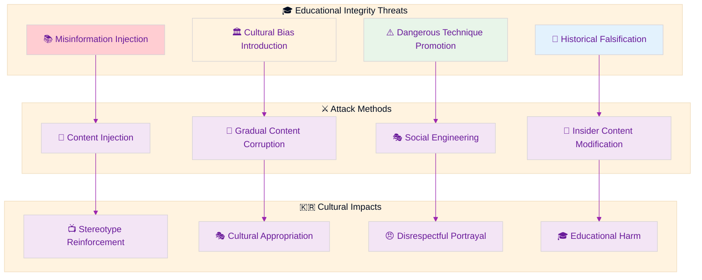
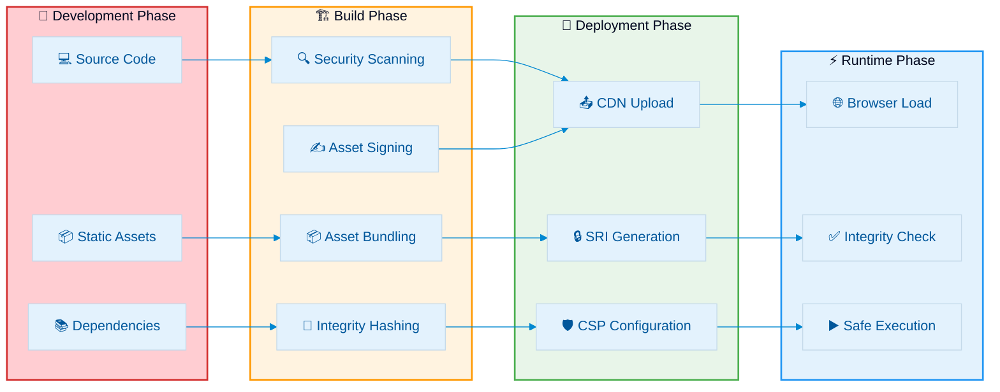
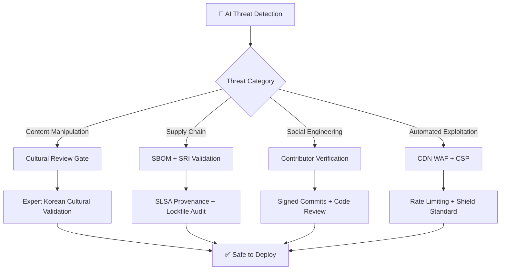
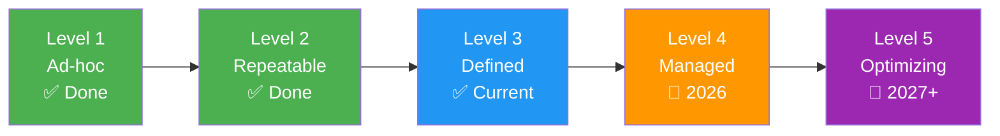

  

<h1 align="center">🎯 Black Trigram (흑괘) — Threat Model</h1>

  <strong>🛡️ Proactive Security Through Structured Threat Analysis</strong> 
  <em>🔍 STRIDE • MITRE ATT&CK • Frontend-Only Architecture • Educational Gaming Security</em>

  
  
  
  

**📋 Document Owner:** CEO | **📄 Version:** 2.0 | **📅 Last Updated:** 2026-03-19 (UTC)  
**🔄 Review Cycle:** Annual | **⏰ Next Review:** 2027-03-19  
**🏷️ Classification:** Public (Open Source Educational Gaming Platform)

---

## 🎯 Purpose & Scope

Establish a comprehensive threat model for the Black Trigram Korean martial arts combat simulator. This systematic threat analysis integrates multiple threat modeling frameworks to ensure proactive security through structured analysis of the frontend-only educational gaming platform.

### **🌟 Transparency Commitment**

This threat model demonstrates **🛡️ cybersecurity consulting expertise** through public documentation of advanced threat assessment methodologies for browser-based gaming platforms, showcasing our **🏆 competitive advantage** via systematic risk management and **🤝 customer trust** through transparent security practices.

_— Based on Hack23 AB's commitment to security through transparency and excellence_

### **📚 Framework Integration**

- **🎭 STRIDE per architecture element:** Systematic threat categorization for frontend components
- **🎖️ MITRE ATT&CK mapping:** Client-side attack technique integration
- **🏗️ Asset-centric analysis:** Educational content and user experience protection
- **🎯 Scenario-centric modeling:** Real-world gaming platform attack simulation
- **⚖️ Risk-centric assessment:** Educational value and cultural sensitivity impact

### **🎯 Multi-Strategy Threat Modeling Integration**

This threat model implements all five strategies defined in [Hack23 AB Threat Modeling Policy §4](https://github.com/Hack23/ISMS-PUBLIC/blob/main/Threat_Modeling.md#threat-modeling-strategies):

### **🔍 Scope Definition**

**Included Systems:**

- 🌐 React + Three.js frontend application
- 🎨 Static asset delivery (CDN-based)
- 🎵 Audio streaming and management
- 🔐 Browser-based session management
- 🏭️ CI/CD security pipeline (GitHub Actions)
- 📦 Dependency management and supply chain

**Out of Scope:**

- Backend services (none exist - frontend-only architecture)
- User data persistence (session-only by design)
- Third-party CDN infrastructure security (external dependency)
- End-user device security beyond browser environment

### **🔗 Policy Alignment**

Integrated with [🎯 Hack23 AB Threat Modeling Policy](https://github.com/Hack23/ISMS-PUBLIC/blob/main/Threat_Modeling.md) methodology and frameworks.

---

## 📊 System Classification & Operating Profile

### **🏷️ Security Classification Matrix**

| Dimension              | Level                                                                                                                                                                      | Rationale                                                              | Business Impact                                                                                                                                                                  |
| ---------------------- | -------------------------------------------------------------------------------------------------------------------------------------------------------------------------- | ---------------------------------------------------------------------- | -------------------------------------------------------------------------------------------------------------------------------------------------------------------------------- |
| **🔐 Confidentiality** |    | Open source educational content, no personal data collection           |       |
| **🔒 Integrity**       |         | Educational content accuracy and Korean cultural authenticity critical |  |
| **⚡ Availability**    |  | Educational gaming platform; tolerates maintenance windows             |           |

### **⚖️ Regulatory & Compliance Profile**

| Compliance Area                      | Classification                | Implementation Status                                 |
| ------------------------------------ | ----------------------------- | ----------------------------------------------------- |
| **📋 Regulatory Exposure**           | Low                           | No personal data collection, educational content only |
| **🇪🇺 CRA (EU Cyber Resilience Act)** | Standard classification       | Non-commercial OSS, self-assessment approach          |
| **📊 Educational Standards**         | Cultural sensitivity required | Korean martial arts authenticity and respect          |
| **🔄 RPO / RTO**                     | RPO: Daily / RTO: Medium      | Session-only data, CDN-based recovery                 |

---

## 💎 Critical Assets & Protection Goals

### **🏗️ Asset-Centric Threat Analysis**

Following [Hack23 AB Asset-Centric Threat Modeling](https://github.com/Hack23/ISMS-PUBLIC/blob/main/Threat_Modeling.md#asset-centric-threat-modeling) methodology:

| Asset Category           | Why Valuable                               | Threat Goals                                   | Key Controls                                         | Business Value                                                                                                                                                                   |
| ------------------------ | ------------------------------------------ | ---------------------------------------------- | ---------------------------------------------------- | -------------------------------------------------------------------------------------------------------------------------------------------------------------------------------- |
| **🎮 Game Integrity**    | Educational value and user experience      | Content manipulation, gameplay disruption      | CSP headers, SRI, input validation                   |       |
| **🇰🇷 Cultural Content**  | Korean martial arts authenticity           | Cultural misrepresentation, offensive content  | Content validation, cultural consultation            |    |
| **🧠 Source Code**       | Game logic and educational algorithms      | IP theft, malicious injection                  | Private repo, dependency scanning, SLSA provenance   |  |
| **📦 Static Assets**     | Visual and audio experience                | Asset tampering, malicious content injection   | CDN integrity, asset signing, SRI validation         |                 |
| **🎵 Audio Content**     | Traditional Korean music authenticity      | Copyright violation, cultural appropriation    | License compliance, cultural validation              |          |
| **🏗️ Build Pipeline**    | Security baseline and deployment integrity | Supply chain attacks, malicious code injection | Hardened workflows, attestations, dependency pinning |      |
| **👤 User Session Data** | Temporary game state and preferences       | Session hijacking, data manipulation           | Session-only design, secure storage APIs             |      |
| **🌐 Domain Reputation** | Blacktrigram.com brand trust               | Domain hijacking, DNS manipulation             | DNSSEC, CAA records, domain monitoring               |           |

### **🔐 Crown Jewel Analysis**

---

## 🌐 Data Flow & Architecture Analysis

### **🏛️ Architecture-Centric STRIDE Analysis**

Following [Architecture-Centric Threat Modeling](https://github.com/Hack23/ISMS-PUBLIC/blob/main/Threat_Modeling.md#architecture-centric-threat-modeling) methodology:

```mermaid
%%{
  init: {
    'theme': 'base',
    'themeVariables': {
      'primaryColor': '#e3f2fd',
      'primaryTextColor': '#01579b',
      'lineColor': '#0288d1',
      'secondaryColor': '#f1f8e9',
      'tertiaryColor': '#fff8e1'
    }
  }
}%%
flowchart TB
    subgraph TRUST_BOUNDARY_1["🌐 Internet Trust Boundary"]
        USER[👤 Player/Learner]
        ATTACKER[🎭 Potential Attacker]
    end

    subgraph TRUST_BOUNDARY_2["📦 CDN Trust Boundary"]
        STATIC_CDN[📄 Static Asset CDN]
        AUDIO_CDN[🎵 Audio Asset CDN]
        APP_CDN[🌐 Application CDN]
    end

    subgraph TRUST_BOUNDARY_3["🖥️ Browser Trust Boundary"]
        BROWSER[🌐 Web Browser]
        REACT_APP[⚛️ React Application]
        THREE_RENDERER[🎨 Three.js Renderer]
        AUDIO_ENGINE[🎵 Audio Engine]
        LOCAL_STORAGE[💾 Browser Storage]
    end

    subgraph TRUST_BOUNDARY_4["🏗️ Build Trust Boundary"]
        GITHUB[📦 GitHub Repository]
        CI_CD[🔧 GitHub Actions]
        DEPENDENCIES[📚 NPM Dependencies]
        ATTESTATIONS[🔏 SLSA Attestations]
    end

    subgraph TRUST_BOUNDARY_5["🌐 Domain Trust Boundary"]
        DNS[🌍 DNS Resolution]
        DOMAIN[🏷️ blacktrigram.com]
        TLS[🔒 TLS Certificate]
    end

    USER -->|🎯 T1: Malicious Input| BROWSER
    ATTACKER -->|🎯 T2: XSS/Client Attacks| REACT_APP
    STATIC_CDN -->|🎯 T3: Asset Tampering| BROWSER
    AUDIO_CDN -->|🎯 T4: Malicious Audio| AUDIO_ENGINE
    APP_CDN -->|🎯 T5: Code Injection| REACT_APP
    REACT_APP -->|🎯 T6: Data Exposure| LOCAL_STORAGE
    CI_CD -->|🎯 T7: Supply Chain| GITHUB
    DEPENDENCIES -->|🎯 T8: Dependency Poisoning| CI_CD
    DNS -->|🎯 T9: DNS Poisoning| DOMAIN
    DOMAIN -->|🎯 T10: Domain Hijacking| TLS
    ATTESTATIONS -->|🎯 T11: Attestation Bypass| CI_CD

    style TRUST_BOUNDARY_1 fill:#ffebee,stroke:#f44336,stroke-width:3px,stroke-dasharray: 5 5
    style TRUST_BOUNDARY_2 fill:#fff3e0,stroke:#ff9800,stroke-width:3px,stroke-dasharray: 5 5
    style TRUST_BOUNDARY_3 fill:#e8f5e9,stroke:#4caf50,stroke-width:3px,stroke-dasharray: 5 5
    style TRUST_BOUNDARY_4 fill:#e3f2fd,stroke:#2196f3,stroke-width:3px,stroke-dasharray: 5 5
    style TRUST_BOUNDARY_5 fill:#f3e5f5,stroke:#9c27b0,stroke-width:3px,stroke-dasharray: 5 5
```

### **🎭 STRIDE per Element Analysis**

| Element                  | S                  | T                   | R               | I                    | D                  | E                     | Notable Mitigations                         |
| ------------------------ | ------------------ | ------------------- | --------------- | -------------------- | ------------------ | --------------------- | ------------------------------------------- |
| **🌐 Web Browser**       | Content spoof      | DOM manipulation    | Limited         | Same-origin bypass   | Crash/hang         | CSP bypass            | CSP headers, SRI, HTTPS enforcement         |
| **⚛️ React App**         | Component hijack   | State tampering     | Action denial   | Data leakage         | Component failure  | Virtual DOM escape    | Input sanitization, React security patterns |
| **🎨 Three.js Renderer** | Asset spoof        | Texture tampering   | Render denial   | GPU data leak        | WebGL crash        | Sandbox escape        | Asset validation, WebGL security context    |
| **🎵 Audio Engine**      | Audio spoof        | Buffer overflow     | Playback denial | Audio fingerprinting | Audio system crash | Browser privilege esc | Audio validation, Howler.js security        |
| **💾 Browser Storage**   | Data substitution  | Storage tampering   | Access denial   | Data extraction      | Storage exhaustion | Storage pollution     | Session-only design, size limits            |
| **📦 Static CDN**        | Asset substitution | Content injection   | CDN outage      | Metadata exposure    | DDoS               | Cache poisoning       | SRI, HTTPS, CDN security                    |
| **🔧 CI/CD Pipeline**    | Workflow spoof     | Build tampering     | Deploy denial   | Secret exposure      | Pipeline DoS       | Runner compromise     | Hardened workflows, attestations            |
| **🌍 DNS System**        | DNS response spoof | Record tampering    | Query denial    | Zone enumeration     | DNS flood          | Cache poisoning       | DNSSEC, monitoring                          |
| **🏷️ Domain**            | Domain spoof       | Registration hijack | Transfer denial | WHOIS exposure       | Domain lock        | Registrar compromise  | Domain monitoring, locks                    |

---

## 🎖️ MITRE ATT&CK Framework Integration

### **🔍 Attacker-Centric Analysis**

Following [MITRE ATT&CK-Driven Analysis](https://github.com/Hack23/ISMS-PUBLIC/blob/main/Threat_Modeling.md#mitre-attck-driven-analysis) methodology:

| Phase                       | Technique                    | ID                                                          | Black Trigram Context                                     | Control                                 | Detection                               |
| --------------------------- | ---------------------------- | ----------------------------------------------------------- | --------------------------------------------------------- | --------------------------------------- | --------------------------------------- |
| **🔍 Initial Access**       | Drive-by Compromise          | [T1189](https://attack.mitre.org/techniques/T1189/)         | Malicious ads or compromised websites leading to game     | Ad blockers, browser security           | Traffic analysis, browser monitoring    |
| **🔍 Initial Access**       | Supply Chain Compromise      | [T1195](https://attack.mitre.org/techniques/T1195/)         | Compromised NPM dependencies or CDN assets                | Dependency scanning, SRI, SLSA          | Dependency monitoring, integrity checks |
| **🔍 Initial Access**       | External Remote Services     | [T1133](https://attack.mitre.org/techniques/T1133/)         | Compromise of GitHub or CDN services                      | MFA, access controls, monitoring        | Service access logs, anomaly detection  |
| **⚡ Execution**            | User Execution               | [T1204](https://attack.mitre.org/techniques/T1204/)         | Malicious game interactions or asset loading              | Input validation, CSP                   | User behavior analysis                  |
| **⚡ Execution**            | JavaScript                   | [T1059.007](https://attack.mitre.org/techniques/T1059/007/) | Malicious JavaScript execution in browser                 | CSP, SRI, content validation            | Script execution monitoring             |
| **🔄 Persistence**          | Browser Session Hijacking    | [T1185](https://attack.mitre.org/techniques/T1185/)         | Session token manipulation in browser storage             | Session-only design, secure storage     | Session monitoring                      |
| **🔄 Persistence**          | Browser Extensions           | [T1176](https://attack.mitre.org/techniques/T1176/)         | Malicious browser extensions affecting gameplay           | Extension security warnings             | Browser extension monitoring            |
| **⬆️ Privilege Escalation** | Web Shell                    | [T1505.003](https://attack.mitre.org/techniques/T1505/003/) | Not applicable - no server-side code                      | N/A                                     | N/A                                     |
| **🎭 Defense Evasion**      | Obfuscated Files             | [T1027](https://attack.mitre.org/techniques/T1027/)         | Minified malicious JavaScript in assets                   | Static analysis, content validation     | Code analysis, anomaly detection        |
| **🎭 Defense Evasion**      | Domain Fronting              | [T1090.004](https://attack.mitre.org/techniques/T1090/004/) | CDN abuse for malicious content delivery                  | CDN security controls, monitoring       | Traffic pattern analysis                |
| **🔑 Credential Access**    | Brute Force                  | [T1110](https://attack.mitre.org/techniques/T1110/)         | Not applicable - no authentication system                 | N/A - no credentials                    | N/A                                     |
| **🔑 Credential Access**    | Browser Credential Dumping   | [T1555.003](https://attack.mitre.org/techniques/T1555/003/) | Extracting saved credentials from browser                 | No credential storage                   | Browser security monitoring             |
| **🔍 Discovery**            | Application Window Discovery | [T1010](https://attack.mitre.org/techniques/T1010/)         | Browser fingerprinting through game canvas                | Canvas fingerprint protection           | Canvas access monitoring                |
| **🔍 Discovery**            | System Information Discovery | [T1082](https://attack.mitre.org/techniques/T1082/)         | Browser and device fingerprinting                         | Fingerprint resistance                  | System access monitoring                |
| **🏛️ Collection**           | Audio Capture                | [T1123](https://attack.mitre.org/techniques/T1123/)         | Microphone access through Web Audio API                   | Microphone permission controls          | Audio permission monitoring             |
| **🏛️ Collection**           | Screen Capture               | [T1113](https://attack.mitre.org/techniques/T1113/)         | Screenshot capture during gameplay                        | Screen capture permissions              | Screen access monitoring                |
| **📤 Exfiltration**         | Exfil Over Web Service       | [T1567](https://attack.mitre.org/techniques/T1567/)         | Data exfiltration through game telemetry                  | No telemetry collection                 | N/A - no data to exfiltrate             |
| **📤 Exfiltration**         | Exfil Over DNS               | [T1048.003](https://attack.mitre.org/techniques/T1048/003/) | DNS tunneling for data exfiltration                       | DNS monitoring                          | DNS query analysis                      |
| **💥 Impact**               | Defacement                   | [T1491](https://attack.mitre.org/techniques/T1491/)         | Malicious content injection or cultural misrepresentation | Content validation, cultural review     | Content monitoring                      |
| **💥 Impact**               | Endpoint Denial of Service   | [T1499](https://attack.mitre.org/techniques/T1499/)         | Client-side DoS through resource exhaustion               | Resource limits, performance monitoring | Performance anomaly detection           |

### **🌳 Attack Tree Analysis**

```mermaid
%%{
  init: {
    'theme': 'base',
    'themeVariables': {
      'primaryColor': '#ffebee',
      'primaryTextColor': '#c62828',
      'lineColor': '#f44336',
      'secondaryColor': '#e8f5e9',
      'tertiaryColor': '#fff3e0'
    }
  }
}%%
flowchart TD
    GOAL[🎯 Compromise Black Trigram<br/>Educational Gaming Platform]

    GOAL --> PATH1[🚪 External Web Attack]
    GOAL --> PATH2[🔒 Client-Side Abuse]
    GOAL --> PATH3[🔗 Supply Chain Compromise]
    GOAL --> PATH4[🌐 Infrastructure Attack]
    GOAL --> PATH5[🏛️ Cultural/Social Attack]

    PATH1 --> EXT1[🌐 Web Application Exploit]
    PATH1 --> EXT2[🔌 CDN/Asset Abuse]
    PATH1 --> EXT3[📧 Social Engineering]

    EXT1 --> EXT1A[🔍 XSS/CSRF Attack]
    EXT1 --> EXT1B[💉 Content Injection]
    EXT1A --> EXT1A1[🎯 Session Hijacking]
    EXT1B --> EXT1B1[📊 Data Corruption]

    EXT2 --> EXT2A[📦 Malicious Asset Injection]
    EXT2 --> EXT2B[🎵 Audio Content Tampering]
    EXT2A --> EXT2A1[🦠 Malware Distribution]
    EXT2B --> EXT2B1[🎭 Cultural Offensive Content]

    PATH2 --> CLI1[🖥️ Browser Exploitation]
    PATH2 --> CLI2[👤 User Session Abuse]
    CLI1 --> CLI1A[🎨 WebGL/Canvas Attack]
    CLI1 --> CLI1B[🔊 Audio System Exploit]
    CLI2 --> CLI2A[💾 Storage Manipulation]
    CLI2 --> CLI2B[🎮 Gameplay Disruption]

    PATH3 --> SUP1[📚 NPM Dependency Attack]
    PATH3 --> SUP2[🔧 Build Pipeline Compromise]
    SUP1 --> SUP1A[🦠 Malicious Package Injection]
    SUP2 --> SUP2A[🏗️ CI/CD Tampering]

    PATH4 --> INF1[🌐 DNS/Domain Attack]
    PATH4 --> INF2[📦 CDN Infrastructure]
    INF1 --> INF1A[🏷️ Domain Hijacking]
    INF1 --> INF1B[🌍 DNS Poisoning]
    INF2 --> INF2A[📄 Asset Tampering]
    INF2 --> INF2B[🔒 CDN Compromise]

    PATH5 --> CUL1[🇰🇷 Cultural Misrepresentation]
    PATH5 --> CUL2[🎭 Community Manipulation]
    CUL1 --> CUL1A[🏛️ Offensive Content Injection]
    CUL1 --> CUL1B[📚 Educational Misinformation]
    CUL2 --> CUL2A[👥 Social Media Campaign]
    CUL2 --> CUL2B[🗣️ Reputation Attack]

    style GOAL fill:#d32f2f,color:#fff
    style PATH1 fill:#ff5722,color:#fff
    style PATH2 fill:#ff9800,color:#fff
    style PATH3 fill:#ffc107,color:#000
    style PATH4 fill:#9c27b0,color:#fff
    style PATH5 fill:#e91e63,color:#fff
```

### **🔗 Kill Chain Disruption Analysis**

Following [Hack23 AB Threat Modeling Policy §4.1.4](https://github.com/Hack23/ISMS-PUBLIC/blob/main/Threat_Modeling.md) — mapping defensive controls to each Cyber Kill Chain phase for the frontend-only architecture:

| Kill Chain Phase | Black Trigram Attack Vector | Defensive Control | Detection Mechanism | Disruption Effectiveness |
|---|---|---|---|---|
| **1. Reconnaissance** | Scanning for frontend vulnerabilities, technology fingerprinting | Minimize exposed metadata, generic error pages, security headers | Web analytics anomaly detection, CDN access logs |  |
| **2. Weaponization** | Crafting XSS payloads, malicious asset packages, supply chain exploits | N/A — occurs externally; mitigate via proactive dependency monitoring | Threat intelligence feeds, CVE monitoring, GitHub Security Advisories |  |
| **3. Delivery** | Compromised CDN assets, malicious NPM packages, phishing links | CSP headers, SRI validation, dependency pinning, SLSA attestations | Dependency scanning (Dependabot), SRI mismatch alerts, CDN integrity monitoring |  |
| **4. Exploitation** | XSS execution, DOM manipulation, WebGL/Canvas exploits | React security patterns, strict CSP, input sanitization, Three.js security context | CSP violation reporting, error boundary triggers, performance anomaly detection |  |
| **5. Installation** | Persistent browser storage manipulation, service worker hijacking | Session-only design, no persistent data, minimal browser API permissions | Storage quota monitoring, service worker integrity validation |  |
| **6. Command & Control** | Exfiltration via DNS tunneling, WebSocket abuse, beacon injection | No outbound data channels by design, strict CORS, no telemetry collection | Network monitoring (CDN logs), CORS violation alerts |  |
| **7. Actions on Objectives** | Content defacement, cultural misrepresentation, user device exploitation | Content integrity validation, cultural review process, browser sandbox | Content monitoring, community reporting, performance budget alerts |  |

**Key Insight:** Black Trigram's frontend-only architecture provides natural kill chain disruption at phases 5-6, as there is no persistent installation vector and no command & control channel by design. The primary attack surface is concentrated at phases 3-4 (delivery and exploitation), where CSP, SRI, and supply chain security controls provide strong defense.

---

## 🎯 Priority Threat Scenarios

### **🔴 Critical Threat Scenarios**

Following [Risk-Centric Threat Modeling](https://github.com/Hack23/ISMS-PUBLIC/blob/main/Threat_Modeling.md#risk-centric-threat-modeling) methodology:

| #     | Scenario                               | MITRE Tactic                                               | Impact Focus                           | Likelihood | Risk                                                                                                                                               | Key Mitigations                                  | Residual Action                           |
| ----- | -------------------------------------- | ---------------------------------------------------------- | -------------------------------------- | ---------- | -------------------------------------------------------------------------------------------------------------------------------------------------- | ------------------------------------------------ | ----------------------------------------- |
| **1** | **🔗 Supply Chain Dependency Attack**  | [Initial Access](https://attack.mitre.org/tactics/TA0001/) | Educational integrity & user safety    | Medium     |  | SBOM, dependency scanning, SLSA attestations     | Implement automated dependency monitoring |
| **2** | **🎭 Cultural Content Manipulation**   | [Impact](https://attack.mitre.org/tactics/TA0040/)         | Korean cultural authenticity & respect | Medium     |  | Content validation, cultural consultation        | Establish cultural advisory board         |
| **3** | **📦 Malicious Asset Injection**       | [Initial Access](https://attack.mitre.org/tactics/TA0001/) | User device security & game integrity  | Medium     |       | SRI, CSP headers, asset validation               | Implement runtime asset verification      |
| **4** | **🌐 Domain Hijacking/DNS Attack**     | [Initial Access](https://attack.mitre.org/tactics/TA0001/) | Platform availability & user trust     | Low        |       | DNSSEC, domain monitoring, registrar locks       | Add domain monitoring automation          |
| **5** | **🌐 Cross-Site Scripting (XSS)**      | [Execution](https://attack.mitre.org/tactics/TA0002/)      | User data & browser security           | Medium     |   | React security patterns, CSP, input sanitization | Add XSS testing to CI/CD                  |
| **6** | **🎨 WebGL/Canvas Exploitation**       | [Execution](https://attack.mitre.org/tactics/TA0002/)      | Browser stability & user security      | Low        |   | Three.js security practices, WebGL limits        | Monitor WebGL security advisories         |
| **7** | **📱 Mobile Browser Exploitation**     | [Execution](https://attack.mitre.org/tactics/TA0002/)      | Mobile user security & performance     | Medium     |   | Mobile-specific security headers, testing        | Enhance mobile security testing           |
| **8** | **⚡ Denial of Service (Performance)** | [Impact](https://attack.mitre.org/tactics/TA0040/)         | User experience & accessibility        | Medium     |     | Performance monitoring, resource limits          | Implement performance budgets             |

### **⚖️ Risk Heat Matrix**

---

## 📊 Comprehensive Threat Agent Analysis

### **🔍 Detailed Threat Actor Classification**

Following [Hack23 AB Threat Agent Classification](https://github.com/Hack23/ISMS-PUBLIC/blob/main/Threat_Modeling.md#threat-agent-classification) methodology:

| Threat Agent                    | Category | Black Trigram Context                                        | MITRE Techniques                                                                                                                    | Risk Level                                                                                                                                         | Motivation                      |
| ------------------------------- | -------- | ------------------------------------------------------------ | ----------------------------------------------------------------------------------------------------------------------------------- | -------------------------------------------------------------------------------------------------------------------------------------------------- | ------------------------------- |
| **🐛 Script Kiddies**           | External | Basic web application attacks using automated tools          | [XSS](https://attack.mitre.org/techniques/T1059/007), [Client-side DoS](https://attack.mitre.org/techniques/T1499)                  |   | Fame, learning, disruption      |
| **🎭 Cultural Trolls**          | External | Targeting Korean cultural content for offensive manipulation | [Defacement](https://attack.mitre.org/techniques/T1491), [Content Injection](https://attack.mitre.org/techniques/T1059/007)         |       | Cultural hatred, trolling       |
| **🦠 Malware Distributors**     | External | Using gaming platform to distribute malware to users         | [Drive-by Compromise](https://attack.mitre.org/techniques/T1189), [Supply Chain](https://attack.mitre.org/techniques/T1195)         |       | Financial gain, botnet building |
| **🏢 Competitor Sabotage**      | External | Other gaming companies attempting platform disruption        | [DoS](https://attack.mitre.org/techniques/T1499), [Supply Chain](https://attack.mitre.org/techniques/T1195)                         |   | Market competition              |
| **🏛️ Nation-State Actors**      | External | State actors targeting Korean cultural representation        | [Domain Fronting](https://attack.mitre.org/techniques/T1090/004), [DNS Manipulation](https://attack.mitre.org/techniques/T1048/003) |  | Political/cultural influence    |
| **💰 Cybercriminal Groups**     | External | Professional criminals targeting user devices through gaming | [Exploit Kits](https://attack.mitre.org/techniques/T1189), [Browser Exploits](https://attack.mitre.org/techniques/T1059/007)        |       | Financial gain, data theft      |
| **🔒 Accidental Insiders**      | Internal | Unintentional security issues in development process         | [Accidental Exposure](https://attack.mitre.org/techniques/T1552), [Misconfigurations](https://attack.mitre.org/techniques/T1611)    |     | No malicious intent             |
| **🎯 Malicious Insiders**       | Internal | Compromised developer accounts or malicious code injection   | [Supply Chain](https://attack.mitre.org/techniques/T1195), [Code Injection](https://attack.mitre.org/techniques/T1059/007)          |       | Various motivations             |
| **🤝 Third-Party CDN/Services** | External | Compromise of external services used by the platform         | [Third-party Service](https://attack.mitre.org/techniques/T1199), [Supply Chain](https://attack.mitre.org/techniques/T1195)         |   | Indirect compromise             |

### **🌐 Current Threat Landscape — ENISA TL 2024 Integration**

Following [Hack23 AB Threat Modeling Policy §3.1](https://github.com/Hack23/ISMS-PUBLIC/blob/main/Threat_Modeling.md) alignment with [ENISA Threat Landscape 2024](https://www.enisa.europa.eu/publications/enisa-threat-landscape-2024) priority threat categories:

| ENISA Priority Threat | Relevance to Black Trigram | Black Trigram Controls | Risk Level | Coverage |
|---|---|---|---|---|
| **1. Threats Against Availability** | CDN/hosting DoS, client-side resource exhaustion, performance degradation attacks | CloudFront CDN, resource limits, performance monitoring, error boundaries |  | ✅ Mitigated |
| **2. Ransomware** | Low relevance — no server-side data, no persistent user data; supply chain risk via compromised dependencies | Session-only design, no data persistence, SBOM, dependency scanning |  | ✅ Mitigated by Design |
| **3. Threats Against Data** | Limited — no user data collection; educational content integrity at risk | No PII collection, session-only storage, content integrity validation |  | ✅ Mitigated by Design |
| **4. Malware** | Drive-by downloads via compromised assets, malicious JavaScript injection through supply chain | CSP headers, SRI validation, dependency scanning, SLSA attestations |  | ✅ Mitigated |
| **5. Social Engineering** | Phishing targeting developers for CI/CD access, fake Korean cultural content submissions | MFA on all accounts, branch protection, code review requirements |  | ✅ Mitigated |
| **6. Information Manipulation** | Cultural misrepresentation of Korean martial arts, educational misinformation injection | Cultural expert validation, content review process, community reporting |  | ✅ Mitigated |
| **7. Supply Chain Attacks** | Compromised NPM packages, malicious GitHub Actions, CDN asset tampering | SBOM generation, SLSA provenance, dependency pinning, SRI, hardened CI/CD |  | ✅ Mitigated |

---

## 🛡️ Comprehensive Security Control Framework

### **🔒 Defense-in-Depth Architecture**

Aligned with [Security Architecture](SECURITY_ARCHITECTURE.md) implementation:

### **🎭 STRIDE → Control Mapping**

| STRIDE Category               | Example Threat         | Primary Control                         | Secondary Control              | Monitoring                    |
| ----------------------------- | ---------------------- | --------------------------------------- | ------------------------------ | ----------------------------- |
| **🎭 Spoofing**               | Asset substitution     | SRI validation, HTTPS                   | Asset signing, CDN security    | Content integrity monitoring  |
| **🔧 Tampering**              | DOM/state manipulation | React security patterns, CSP            | Input validation, sanitization | DOM mutation monitoring       |
| **❌ Repudiation**            | Action denial          | Session logs (client-side)              | Error tracking, audit trails   | Behavior analysis             |
| **📤 Information Disclosure** | Data extraction        | Session-only design, no data collection | Browser permissions, CORS      | Privacy compliance monitoring |
| **⚡ Denial of Service**      | Performance attacks    | Resource limits, error boundaries       | Performance monitoring         | Performance budget alerts     |
| **⬆️ Elevation of Privilege** | Browser sandbox escape | Browser security model, CSP             | API permission controls        | Privilege usage monitoring    |

---

## 🎯 Educational Gaming-Specific Threats

### **🇰🇷 Cultural Sensitivity Threat Analysis**

Following cultural authenticity requirements from [CRA Assessment](CRA-ASSESSMENT.md):

#### **🏛️ Cultural Misrepresentation Scenarios**

| Cultural Element               | Threat                                           | Impact                                      | Mitigation                                  | Validation                            |
| ------------------------------ | ------------------------------------------------ | ------------------------------------------- | ------------------------------------------- | ------------------------------------- |
| **☯️ Trigram Philosophy**      | Misinterpretation of I Ching concepts            | Loss of educational value, cultural offense | Expert consultation, academic review        | Korean martial arts expert validation |
| **🥋 Martial Arts Techniques** | Inaccurate or dangerous technique representation | Injury risk, cultural appropriation         | Traditional master review, safety warnings  | Certified instructor verification     |
| **🎵 Traditional Music**       | Inappropriate use or modification                | Copyright violation, cultural disrespect    | Licensed content, cultural context          | Music scholar review                  |
| **📚 Korean Terminology**      | Incorrect translations or usage                  | Educational misinformation, disrespect      | Native speaker validation, academic sources | Linguistic expert review              |
| **🏛️ Historical Context**      | Anachronistic or false historical claims         | Misinformation, cultural insensitivity      | Historical research, expert consultation    | Academic historian validation         |

#### **🎮 Educational Integrity Threats**

---

## 🌐 Frontend-Specific Security Architecture

### **🖥️ Browser Security Model Integration**

Following frontend-only architecture from [Architecture](ARCHITECTURE.md):

#### **📦 Asset Security Pipeline**

#### **🔒 Browser Security Controls**

| Security Layer                 | Control Implementation                           | Threat Coverage                        | Validation Method                   |
| ------------------------------ | ------------------------------------------------ | -------------------------------------- | ----------------------------------- |
| **🛡️ Content Security Policy** | Restrictive CSP headers with nonce-based scripts | XSS, code injection, data exfiltration | CSP violation reporting             |
| **🔒 Subresource Integrity**   | SHA-384 hashes for all external assets           | Asset tampering, CDN compromise        | Browser integrity validation        |
| **🌐 HTTPS Enforcement**       | Strict Transport Security, secure contexts       | MITM attacks, downgrade attacks        | Certificate transparency monitoring |
| **📦 Same-Origin Policy**      | Strict CORS configuration                        | Cross-origin attacks, data theft       | CORS preflight validation           |
| **💾 Storage Security**        | Session-only data, no persistence                | Data theft, privacy violations         | Storage audit tools                 |
| **🔑 API Permissions**         | Minimal browser API usage                        | Privilege escalation, fingerprinting   | Permission monitoring               |

---

## 🔄 Continuous Validation & Assessment

### **🎪 Educational Gaming Threat Workshop**

Following [Hack23 AB Workshop Framework](https://github.com/Hack23/ISMS-PUBLIC/blob/main/Threat_Modeling.md#threat-modeling-workshop) with gaming-specific adaptations:

#### **🎯 Black Trigram-Specific Workshop Scope**

- **🇰🇷 Cultural Sensitivity Assessment:** Korean martial arts authenticity, respectful representation
- **🎓 Educational Value Protection:** Learning objective preservation, misinformation prevention
- **🎮 Gaming Security Patterns:** Frontend game security, WebGL safety, asset integrity
- **👥 User Safety Considerations:** Age-appropriate content, physical safety warnings

#### **👥 Gaming Platform Team Assembly**

- **🥋 Korean Martial Arts Expert:** Traditional technique validation, cultural authenticity
- **🎓 Educational Technology Specialist:** Learning effectiveness, age-appropriate design
- **🛡️ Frontend Security Expert:** Browser security, WebGL safety, client-side protection
- **🎨 Creative Content Manager:** Asset integrity, cultural sensitivity, visual design
- **⚖️ Legal/Cultural Compliance Officer:** Cultural representation, copyright, educational standards

#### **📊 Gaming-Specific Analysis Framework**

**🇰🇷 Cultural Authenticity Assessment:**

- How might cultural misrepresentation damage educational value and community trust?
- What validation processes ensure respectful and accurate Korean cultural representation?
- How do we prevent cultural appropriation while maintaining educational accessibility?
- What expert review processes validate traditional Korean martial arts content?

**🎓 Educational Integrity Evaluation:**

- How could misinformation injection compromise the educational mission?
- What safeguards prevent dangerous or inappropriate technique demonstration?
- How do we maintain age-appropriate content while preserving martial arts authenticity?
- What validation ensures accurate historical and philosophical context?

**🎮 Gaming Platform Security Analysis:**

- How do we protect users from malicious content injection via game assets?
- What browser security measures prevent exploitation through WebGL/Canvas?
- How do we ensure asset integrity without compromising performance?
- What monitoring detects unusual behavior or security anomalies?

---

## 📊 Educational Gaming Threat Catalog

### **🎓 Education-Specific Threat Documentation**

Each educational threat entry includes cultural and learning impact assessment:

#### **🔴 Critical Educational Threats**

##### **🇰🇷 Cultural Misrepresentation Attack**

- **🎯 Educational Tactic:** Cultural Authenticity Undermining
- **🔧 MITRE Technique:** [Data Manipulation (T1565)](https://attack.mitre.org/techniques/T1565/)
- **🏛️ Educational Component:** Korean martial arts cultural content and traditional knowledge
- **📝 Threat Description:** Deliberate introduction of culturally inaccurate or offensive content to damage educational value and cultural respect
- **👥 Threat Agent:** Cultural trolls, competitors, misguided contributors, politically motivated actors
- **🔐 Black Trigram at Risk:** Integrity (cultural authenticity), Availability (community trust), Confidentiality (educational methodology)
- **🔑 Controls:** Cultural expert validation, content review processes, community moderation
- **🎭 STRIDE Attribute:** Tampering, Information Disclosure, Repudiation
- **🛡️ Security Measures:** Expert consultation panels, cultural authenticity validation, version control for content changes
- **⚡ Priority:** **Critical**
- **🏛️ Cultural Impact:** Korean cultural disrespect, educational misinformation, community alienation
- **❓ Assessment Questions:** Are cultural experts involved in content validation? Can cultural modifications be tracked and reversed? Are offensive content detection systems in place?

##### **⚠️ Dangerous Technique Promotion**

- **🎯 Educational Tactic:** Physical Safety Undermining
- **🔧 MITRE Technique:** [Supply Chain Compromise (T1195)](https://attack.mitre.org/techniques/T1195/)
- **🏛️ Educational Component:** Martial arts technique demonstration and educational content
- **📝 Threat Description:** Introduction of dangerous, modified, or inappropriate martial arts techniques that could cause physical harm to learners
- **👥 Threat Agent:** Malicious contributors, inexperienced practitioners, liability-seeking actors
- **🔐 Black Trigram at Risk:** Integrity (technique accuracy), Availability (platform liability), Confidentiality (safety protocols)
- **🔑 Controls:** Master instructor validation, safety warning systems, technique review boards
- **🎭 STRIDE Attribute:** Tampering, Spoofing, Elevation of Privilege
- **🛡️ Security Measures:** Certified instructor review, safety disclaimer systems, technique modification tracking
- **⚡ Priority:** **Critical**
- **🏛️ Safety Impact:** Physical injury risk, liability exposure, educational credibility damage
- **❓ Assessment Questions:** Are all techniques validated by certified instructors? Are safety warnings prominent and clear? Can dangerous content be quickly identified and removed?

---

## 📅 Educational Context Assessment Lifecycle

### **🎓 Educational Validation Schedule**

| Assessment Type                      | Educational Trigger               | Frequency              | Validation Scope                 | Community Transparency                 |
| ------------------------------------ | --------------------------------- | ---------------------- | -------------------------------- | -------------------------------------- |
| **🇰🇷 Cultural Content Review**       | New cultural content addition     | Per content release    | Korean authenticity and respect  | Public cultural advisory board reports |
| **🥋 Technique Safety Assessment**   | New martial arts content          | Per technique addition | Physical safety and accuracy     | Certified instructor validation logs   |
| **👥 Community Feedback Assessment** | User reports or cultural concerns | Monthly/as needed      | Content accuracy and sensitivity | Public feedback response documentation |
| **📚 Educational Value Assessment**  | Learning objective changes        | Per major release      | Pedagogical effectiveness        | Educational outcome reporting          |
| **🌐 Global Cultural Assessment**    | International expansion           | Per new region         | Regional cultural adaptation     | Cultural sensitivity documentation     |

---

## 🏆 Educational Gaming Security Excellence

### **📈 Cultural Sensitivity Maturity Framework**

Following [Hack23 AB Maturity Levels](https://github.com/Hack23/ISMS-PUBLIC/blob/main/Threat_Modeling.md#threat-modeling-maturity-levels) with educational adaptations:

#### **🟢 Level 1: Cultural Foundation**

- **🇰🇷 Basic Cultural Respect:** Core Korean content validated by native speakers
- **⚠️ Safety Awareness:** Basic safety warnings and disclaimers
- **👥 Community Guidelines:** Clear content standards and reporting mechanisms
- **📚 Educational Standards:** Basic learning objectives documented
- **🛡️ Content Security:** Basic protection against malicious content injection

#### **🟡 Level 2: Cultural Process Integration**

- **📅 Cultural Review Cycle:** Regular cultural authenticity assessments
- **📝 Expert Consultation:** Established relationships with Korean martial arts experts
- **🔧 Safety Validation Tools:** Automated safety warning systems
- **🔄 Community Engagement:** Active community feedback integration

#### **🟠 Level 3: Cultural Excellence**

- **🔍 Comprehensive Cultural STRIDE:** Systematic threat assessment for all cultural content
- **⚖️ Cultural Risk Assessment:** Impact on Korean cultural representation and educational value
- **🛡️ Cultural Protection Strategies:** Comprehensive safeguards against cultural misrepresentation
- **🎓 Educational Security Integration:** Learning objective protection embedded in security

#### **🔴 Level 4: Advanced Cultural Intelligence**

- **🌐 Proactive Cultural Monitoring:** Real-time cultural sensitivity and authenticity validation
- **📊 Educational Effectiveness Tracking:** Comprehensive learning outcome measurement
- **📈 Cultural Trust Metrics:** Community confidence and cultural respect measurement
- **🔄 Expert Validation Networks:** Global Korean martial arts expert collaboration

#### **🟣 Level 5: Cultural Innovation Leadership**

- **🔮 Predictive Cultural Protection:** Anticipation of cultural sensitivity issues
- **🤖 AI-Enhanced Cultural Validation:** Machine learning for cultural authenticity verification
- **📊 Global Cultural Intelligence:** International cultural best practice collaboration
- **🔬 Educational Innovation:** Advanced pedagogical security and effectiveness research

---

## 🌟 Educational Gaming Security Best Practices

### **🎓 Educational Platform Security Principles**

#### **🇰🇷 Cultural Authenticity by Design**

- **🔍 Expert Validation:** All Korean cultural content reviewed by certified experts
- **⚖️ Respectful Representation:** Systematic prevention of cultural appropriation or misrepresentation
- **📊 Community Verification:** Public feedback mechanisms for cultural accuracy
- **🛡️ Cultural Protection:** Proactive safeguards against offensive or inaccurate content

#### **👥 Educational Safety Security**

- **🤝 Expert Consultation:** Regular collaboration with Korean martial arts masters
- **📢 Transparent Validation:** Public documentation of expert review processes
- **🔍 Open Source Methodology:** Community access to educational validation methods
- **📈 Learning Effectiveness Measurement:** Regular assessment of educational outcomes

#### **🔄 Continuous Educational Improvement**

- **⚡ Proactive Cultural Threat Detection:** Early identification of cultural sensitivity issues
- **📊 Evidence-Based Educational Security:** Data-driven educational content decisions
- **🤝 International Cultural Cooperation:** Collaboration with global Korean cultural organizations
- **💡 Innovation in Educational Security:** Leading development of culturally sensitive educational platforms

---

## 📈 AI-Enabled Threat Evolution

### **🤖 AI Model Evolution — Threat Landscape Perspective (2026–2037)**

Following [Hack23 AB Threat Modeling Policy — AI-Enabled Threats](https://github.com/Hack23/ISMS-PUBLIC/blob/main/Threat_Modeling.md), this section addresses the evolving AI threat landscape relevant to Black Trigram's frontend-only educational gaming platform.

#### **🔴 Near-Term AI Threats (2026–2028)**

| AI Threat Vector | Black Trigram Impact | Likelihood | Severity | Mitigation |
|---|---|---|---|---|
| **AI-generated phishing targeting game communities** | Social engineering against contributors and players via Discord/GitHub | Medium | Medium | Contributor verification processes, signed commits, community awareness training |
| **AI-powered automated vulnerability scanning against CDN** | Automated reconnaissance and exploitation of CDN-hosted static assets | Medium | Low | CDN WAF rules, rate limiting, CloudFront Shield Standard, SRI integrity validation |
| **Deepfake content injection into game assets** | Manipulated Korean cultural content (images, audio, 3D models) injected via supply chain | Low | High | Asset integrity hashes (SRI SHA-384), SBOM for all assets, manual cultural review gates |
| **AI-assisted social engineering targeting contributors** | AI-crafted PRs with subtle malicious code, convincing impersonation of maintainers | Medium | High | Branch protection, mandatory code review, CODEOWNERS enforcement, GPG-signed commits |

#### **🟡 Mid-Term AI Threats (2028–2032)**

| AI Threat Vector | Black Trigram Impact | Likelihood | Severity | Mitigation Strategy |
|---|---|---|---|---|
| **AI-generated zero-day exploit chains** | Automated discovery of browser/WebGL exploit chains targeting game rendering | Low | High | Browser sandbox reliance, CSP strict-dynamic, regular dependency updates |
| **LLM-poisoned dependency packages** | AI-crafted malicious npm packages mimicking legitimate game libraries | Medium | High | Lockfile pinning, dependency scanning (Dependabot, Socket.dev), SLSA provenance verification |
| **AI-driven cultural manipulation** | Automated generation of culturally offensive Korean content to damage reputation | Low | Critical | Expert review pipeline, community reporting, automated content similarity checks |
| **Automated CI/CD pipeline compromise** | AI agents targeting GitHub Actions workflows with crafted inputs | Low | Medium | Workflow permissions minimization, pinned action SHAs, OpenSSF Scorecard monitoring |

#### **🟠 Long-Term AI Threats (2032–2037)**

| AI Threat Vector | Black Trigram Impact | Likelihood | Severity | Preparedness |
|---|---|---|---|---|
| **Autonomous attack agents** | Self-directed AI systems that identify, exploit, and persist in browser environments | Low | Critical | Defense-in-depth architecture, zero-trust browser model, minimal attack surface |
| **AI-generated counterfeit game clones** | Complete AI replication of Black Trigram with malware injection | Low | High | Open source licensing enforcement, brand protection, community verification |
| **Quantum-assisted cryptographic attacks** | Breaking SRI hashes and TLS in transit | Very Low | Critical | Monitor NIST PQC standards, prepare migration to quantum-safe algorithms |

#### **🛡️ AI Threat Countermeasures for Educational Gaming**

**Key Principle:** Black Trigram's frontend-only, stateless architecture inherently limits the AI threat surface — no backend APIs, no user databases, no authentication systems to compromise. AI threats primarily target the supply chain and cultural content integrity.

---

## 🎯 Threat Modeling Maturity Assessment

### **📊 Threat Modeling Maturity Levels**

Following [Hack23 AB Threat Modeling Policy — Maturity Framework](https://github.com/Hack23/ISMS-PUBLIC/blob/main/Threat_Modeling.md), this section tracks Black Trigram's progressive implementation of threat modeling practices.

| Maturity Level | Name | Description | Black Trigram Status | Evidence |
|---|---|---|---|---|
| **Level 1** | **Ad-hoc** | Threat modeling performed reactively, no documented process | ✅ Completed | Initial project setup phase (pre-v0.1) |
| **Level 2** | **Repeatable** | Basic threat modeling with documented outcomes, applied to major changes | ✅ Completed | STRIDE analysis in early THREAT_MODEL.md versions, security reviews on PRs |
| **Level 3** | **Defined** | Comprehensive threat model documented with multiple frameworks (STRIDE, MITRE ATT&CK), integrated into SDLC | ✅ Current State | This document (v2.0), CI/CD security gates, SBOM generation, CodeQL scanning |
| **Level 4** | **Managed** | Metrics-driven threat assessment, automated threat detection, quantitative risk measurement | 🎯 Target (2026) | Planned: automated DAST in CI, threat metrics dashboard, risk score tracking |
| **Level 5** | **Optimizing** | Continuous threat intelligence integration, predictive threat analysis, AI-assisted threat modeling | 🔮 Future (2027+) | Planned: threat intelligence feeds, automated threat model updates, ML-based anomaly detection |

#### **📈 Maturity Progression Roadmap**

#### **🎯 Level 3 → Level 4 Gap Analysis**

| Capability | Level 3 (Current) | Level 4 (Target) | Gap | Action Plan |
|---|---|---|---|---|
| **Threat identification** | Manual STRIDE + MITRE ATT&CK analysis | Automated threat surface scanning | Automation gap | Integrate OWASP ZAP into CI for CDN-deployed previews |
| **Risk quantification** | Qualitative risk heat matrix | Quantitative risk scores with metrics | Metrics gap | Define KRIs (Key Risk Indicators) for supply chain and content integrity |
| **Threat intelligence** | Annual ENISA TL review | Continuous threat feed integration | Timeliness gap | Subscribe to GitHub Advisory Database API, automate CVE correlation |
| **Validation cadence** | Quarterly review cycle | Continuous automated validation | Frequency gap | Implement nightly dependency audit, weekly SBOM diff checks |
| **Cultural threat monitoring** | Expert review gates | Automated cultural content scanning | Automation gap | Develop Korean cultural content validation heuristics |

---

## 🎪 Threat Modeling Workshop Framework

### **📋 Pre-Workshop Preparation**

Following [Hack23 AB Threat Modeling Policy — Workshop Framework](https://github.com/Hack23/ISMS-PUBLIC/blob/main/Threat_Modeling.md), Black Trigram conducts structured threat modeling workshops tailored to the educational gaming context.

#### **📝 Pre-Workshop Checklist**

| # | Preparation Item | Owner | Status |
|---|---|---|---|
| 1 | Review current THREAT_MODEL.md and identify areas needing update | Security Lead | ☐ Before each workshop |
| 2 | Gather latest ENISA Threat Landscape and GitHub Advisory DB updates | Security Lead | ☐ Before each workshop |
| 3 | Collect CDN access logs and CSP violation reports from the past quarter | DevOps Lead | ☐ Before each workshop |
| 4 | Review all dependency updates and SBOM changes since last workshop | Development Lead | ☐ Before each workshop |
| 5 | Prepare updated architecture diagrams (ARCHITECTURE.md, DATA_MODEL.md) | Architecture Lead | ☐ Before each workshop |
| 6 | Identify new Korean cultural content additions requiring threat review | Cultural Expert | ☐ Before each workshop |
| 7 | Review open GitHub Security Advisories and Dependabot alerts | Security Lead | ☐ Before each workshop |
| 8 | Prepare MITRE ATT&CK navigator layer with current coverage | Security Lead | ☐ Before each workshop |

#### **👥 Workshop Participants**

| Role | Responsibility | Required |
|---|---|---|
| **Security Lead** | Facilitates STRIDE analysis, maintains threat model | ✅ Required |
| **Development Lead** | Provides implementation context, identifies new attack surfaces | ✅ Required |
| **Korean Cultural Expert** | Validates cultural threat scenarios, reviews content integrity | ✅ Required |
| **DevOps/CI Lead** | Reviews supply chain and deployment pipeline threats | ✅ Required |
| **Community Representative** | Provides player perspective on social engineering threats | Recommended |

### **📅 Workshop Agenda — Educational Gaming Threat Review**

| Time | Activity | Duration | Output |
|---|---|---|---|
| **09:00** | 🎯 Opening: Review previous threat model, metrics, and action items | 30 min | Status dashboard update |
| **09:30** | 🌐 Threat landscape update: ENISA TL, AI threats, gaming-specific trends | 30 min | Updated threat landscape section |
| **10:00** | 🏗️ Architecture review: New components, data flows, trust boundaries | 45 min | Updated architecture-centric analysis |
| **10:45** | ☕ Break | 15 min | — |
| **11:00** | 🎭 STRIDE per element: Walk through each frontend component | 60 min | Updated STRIDE analysis table |
| **12:00** | 🍽️ Lunch | 60 min | — |
| **13:00** | 🇰🇷 Cultural threat deep-dive: Korean content integrity, deepfake risks | 45 min | Updated cultural threat catalog |
| **13:45** | 🔗 Supply chain analysis: Dependency review, SBOM changes, npm risks | 45 min | Updated kill chain analysis |
| **14:30** | ☕ Break | 15 min | — |
| **14:45** | 🎖️ MITRE ATT&CK mapping update: New techniques, coverage gaps | 45 min | Updated ATT&CK navigator layer |
| **15:30** | ⚖️ Risk scoring: Re-assess risk heat matrix, update priorities | 30 min | Updated risk heat matrix |
| **16:00** | 📋 Action items: Assign mitigations, set deadlines, update maturity level | 30 min | Action item register |
| **16:30** | ✅ Close: Summarize findings, confirm next workshop date | 15 min | Workshop summary report |

### **📤 Post-Workshop Action Items**

| # | Action | Owner | Deadline | Tracking |
|---|---|---|---|---|
| 1 | Update THREAT_MODEL.md with all workshop findings | Security Lead | 1 week post-workshop | GitHub PR |
| 2 | File GitHub issues for new mitigations identified | Development Lead | 1 week post-workshop | GitHub Issues |
| 3 | Update MITRE ATT&CK navigator layer export | Security Lead | 2 weeks post-workshop | Repository commit |
| 4 | Validate cultural content changes flagged in workshop | Cultural Expert | 2 weeks post-workshop | Review gate sign-off |
| 5 | Update risk heat matrix and risk register | Security Lead | 2 weeks post-workshop | Risk Register update |
| 6 | Implement priority security controls from gap analysis | Development Lead | Next sprint | Sprint tracking |
| 7 | Schedule follow-up review for critical findings | Security Lead | 1 month post-workshop | Calendar invite |
| 8 | Publish workshop summary to team (sanitized for public) | Security Lead | 1 week post-workshop | Team communication |

#### **📊 Workshop Effectiveness Metrics**

| Metric | Target | Measurement |
|---|---|---|
| **Threats identified per workshop** | ≥ 5 new or updated threats | Count of threat model changes |
| **Action item completion rate** | ≥ 90% within deadline | Issue tracking completion |
| **Time to mitigation** | ≤ 30 days for High/Critical | Days from identification to control implementation |
| **Participant coverage** | All required roles present | Attendance record |
| **Maturity progression** | Advance 1 sub-level per year | Maturity assessment score |

---

## 📋 ISMS Compliance Framework Mapping

Following [Hack23 AB Threat Modeling Policy §2.1](https://github.com/Hack23/ISMS-PUBLIC/blob/main/Threat_Modeling.md) classification-driven approach, this threat model maps to three compliance frameworks:

### **ISO 27001:2022 Control Alignment**

| ISO 27001 Control | Threat Model Coverage | Implementation Status | Evidence |
|---|---|---|---|
| **A.5.1 - Policies for information security** | Overall threat modeling methodology | ✅ Implemented | This document, ISMS policy references |
| **A.8.1 - User endpoint devices** | Browser security controls, WebGL safety | ✅ Implemented | CSP, SRI, browser sandbox controls |
| **A.8.4 - Access to source code** | Supply chain threats, code injection | ✅ Implemented | Branch protection, code review, SLSA |
| **A.8.6 - Capacity management** | DoS threats, resource exhaustion | ✅ Implemented | Performance monitoring, resource limits |
| **A.8.11 - Data masking** | Information disclosure prevention | ✅ Implemented | Session-only design, no data collection |
| **A.8.16 - Monitoring activities** | Security event detection | ✅ Implemented | CDN logs, CSP violation reporting, error tracking |
| **A.8.23 - Web filtering** | Malicious content prevention | ✅ Implemented | CSP headers, input validation, content review |
| **A.8.24 - Use of cryptography** | Asset integrity, transport security | ✅ Implemented | HTTPS, SRI (SHA-384), TLS 1.3 |
| **A.8.25 - Secure development lifecycle** | Supply chain, code injection | ✅ Implemented | SBOM, dependency scanning, SAST, code review |
| **A.8.27 - Secure system architecture** | Defense in depth, trust boundaries | ✅ Implemented | Frontend-only design, CSP layers, SRI validation |
| **A.8.28 - Secure coding** | XSS, injection attacks, tampering | ✅ Implemented | React security patterns, input validation |

### **NIST CSF 2.0 Framework Alignment**

| NIST CSF Function | Category | Black Trigram Implementation | Evidence |
|---|---|---|---|
| **GOVERN (GV)** | GV.OC - Organizational Context | Threat model documents risk appetite for educational gaming | This document, risk matrix |
| **GOVERN (GV)** | GV.RM - Risk Management Strategy | STRIDE and MITRE ATT&CK risk identification | Threat scenarios, risk heat matrix |
| **IDENTIFY (ID)** | ID.AM - Asset Management | Critical assets and crown jewels identified and classified | Asset-centric analysis section |
| **IDENTIFY (ID)** | ID.RA - Risk Assessment | Risk heat matrix with likelihood/impact ratings | Priority threat scenarios, quantitative assessment |
| **PROTECT (PR)** | PR.DS - Data Security | Session-only design, no PII collection | Frontend architecture, CSP controls |
| **PROTECT (PR)** | PR.IP - Information Protection | Secure development, SRI, CSP, dependency scanning | Build security pipeline, SLSA attestations |
| **PROTECT (PR)** | PR.PT - Platform Security | Browser security model, CDN protection | Content Security Policy, HTTPS enforcement |
| **DETECT (DE)** | DE.AE - Anomalies and Events | CSP violation detection, performance anomaly monitoring | Error tracking, CDN monitoring |
| **DETECT (DE)** | DE.CM - Continuous Monitoring | Dependency vulnerability scanning, integrity validation | Dependabot, SRI checks, SAST |
| **RESPOND (RS)** | RS.MA - Management | Incident response for content integrity and supply chain | Security policy, vulnerability reporting |
| **RECOVER (RC)** | RC.RP - Recovery Planning | CDN-based recovery, session-only design simplifies recovery | Architecture design, CDN multi-region |

### **CIS Controls v8.1 Alignment**

| CIS Control | Black Trigram Implementation | Evidence |
|---|---|---|
| **2 - Inventory and Control of Software Assets** | SBOM for all dependencies, automated scanning | Package-lock.json, dependency scanning |
| **3 - Data Protection** | HTTPS enforcement, SRI for asset integrity | TLS 1.3, SHA-384 integrity hashes |
| **4 - Secure Configuration** | Hardened CSP, security headers, strict CORS | index.html security headers, CDN config |
| **6 - Access Control Management** | Branch protection, code review requirements | GitHub repository settings, CODEOWNERS |
| **7 - Continuous Vulnerability Management** | Dependabot, CodeQL, dependency scanning | GitHub Security tab, CI/CD pipeline |
| **8 - Audit Log Management** | CDN access logs, CSP violation reports | CloudFront logs, browser reporting |
| **14 - Security Awareness and Training** | Secure coding guidelines, threat model documentation | This document, CONTRIBUTING.md |
| **16 - Application Software Security** | Input validation, React security patterns, CSP | SAST results, E2E security tests |

---

## 📚 Related Documents

### 🔐 ISMS Threat Modeling & Risk Management

- [🎯 Threat Modeling Policy](https://github.com/Hack23/ISMS-PUBLIC/blob/main/Threat_Modeling.md) - STRIDE methodology and standards
- [📉 Risk Assessment Methodology](https://github.com/Hack23/ISMS-PUBLIC/blob/main/Risk_Assessment_Methodology.md) - Risk quantification framework
- [📊 Risk Register](https://github.com/Hack23/ISMS-PUBLIC/blob/main/Risk_Register.md) - Enterprise risk tracking
- [🏷️ Classification Framework](https://github.com/Hack23/ISMS-PUBLIC/blob/main/CLASSIFICATION.md) - Business impact analysis

### 🔐 ISMS Security Policies

- [🔐 Information Security Policy](https://github.com/Hack23/ISMS-PUBLIC/blob/main/Information_Security_Policy.md) - Overall security governance
- [🛠️ Secure Development Policy](https://github.com/Hack23/ISMS-PUBLIC/blob/main/Secure_Development_Policy.md) - Security-integrated SDLC
- [🔍 Vulnerability Management](https://github.com/Hack23/ISMS-PUBLIC/blob/main/Vulnerability_Management.md) - Security testing procedures
- [🚨 Incident Response Plan](https://github.com/Hack23/ISMS-PUBLIC/blob/main/Incident_Response_Plan.md) - Security incident handling
- [🔓 Open Source Policy](https://github.com/Hack23/ISMS-PUBLIC/blob/main/Open_Source_Policy.md) - Open source governance

### 🛡️ Black Trigram Security Documentation

- [🛡️ Security Architecture](./SECURITY_ARCHITECTURE.md) - Current security implementation
- [🔮 Future Security Architecture](./FUTURE_SECURITY_ARCHITECTURE.md) - Planned security enhancements
- [📋 CRA Assessment](./CRA-ASSESSMENT.md) - EU Cyber Resilience Act compliance
- [🔒 Security Policy](./SECURITY.md) - Vulnerability reporting
- [🗺️ ISMS Reference Mapping](./ISMS_REFERENCE_MAPPING.md) - Complete ISMS policy mapping

### 🔄 Development & Operations

- [🔄 Workflows](./WORKFLOWS.md) - Security-hardened CI/CD pipelines
- [🔧 Development Guide](./development.md) - Security features and testing
- [📐 Architecture](./ARCHITECTURE.md) - Overall system design

---

**📋 Document Control:**  
**✅ Approved by:** James Pether Sörling, CEO  
**📤 Distribution:** Public  
**🏷️ Classification:**   
**📅 Effective Date:** 2026-03-19  
**⏰ Next Review:** 2027-03-19  
**🎯 Framework Compliance:**     
