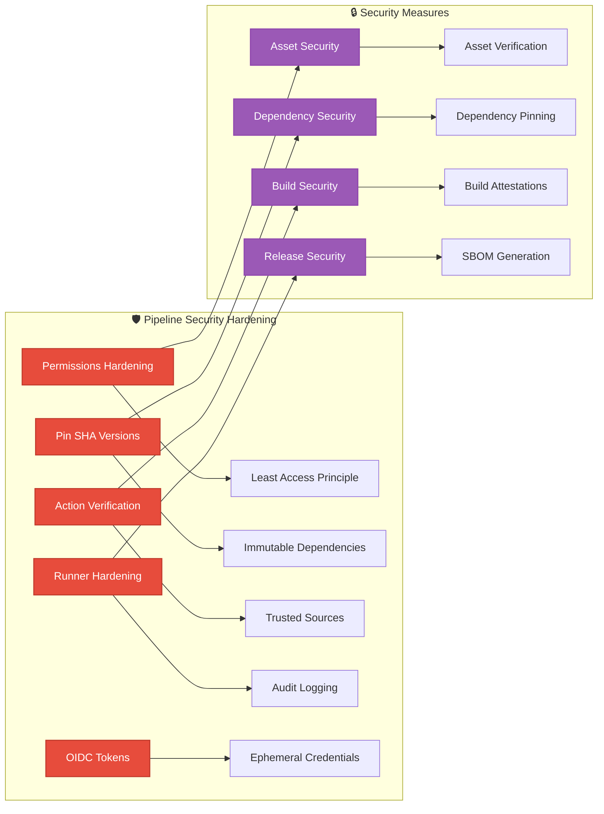
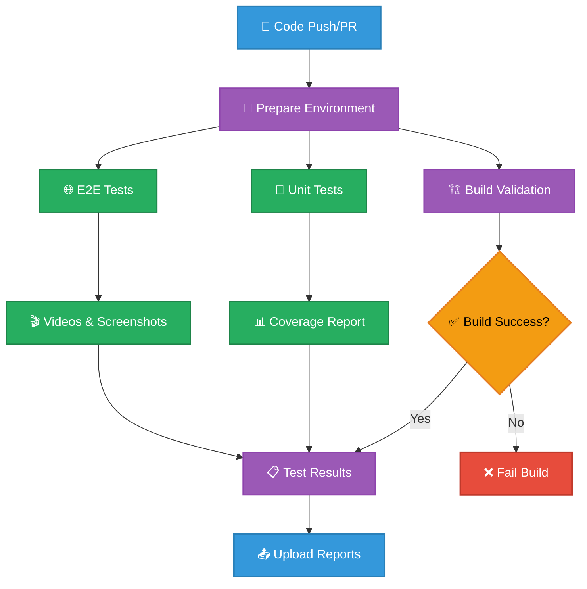
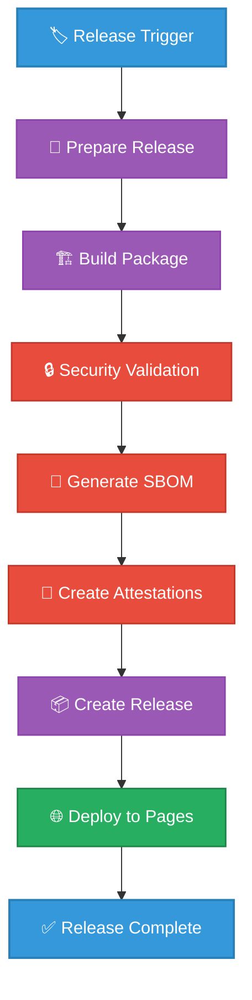
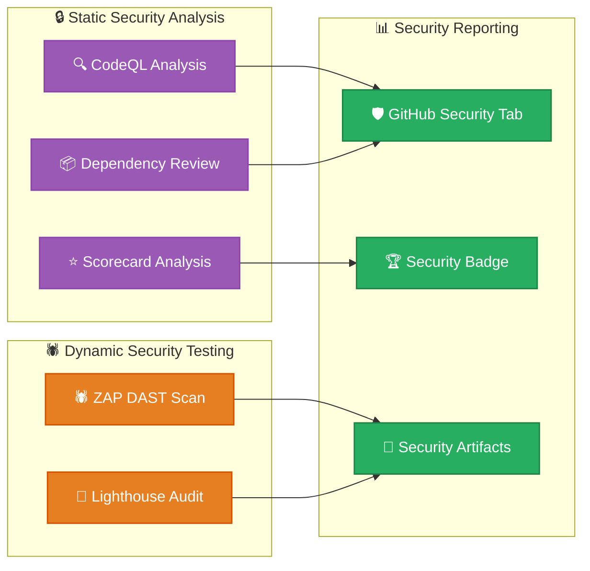
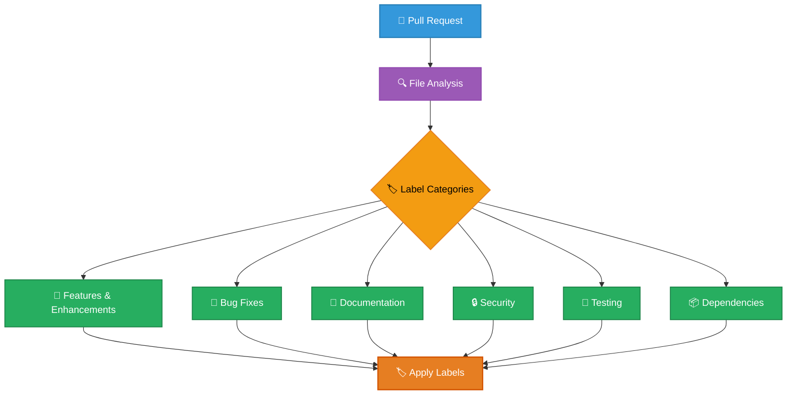
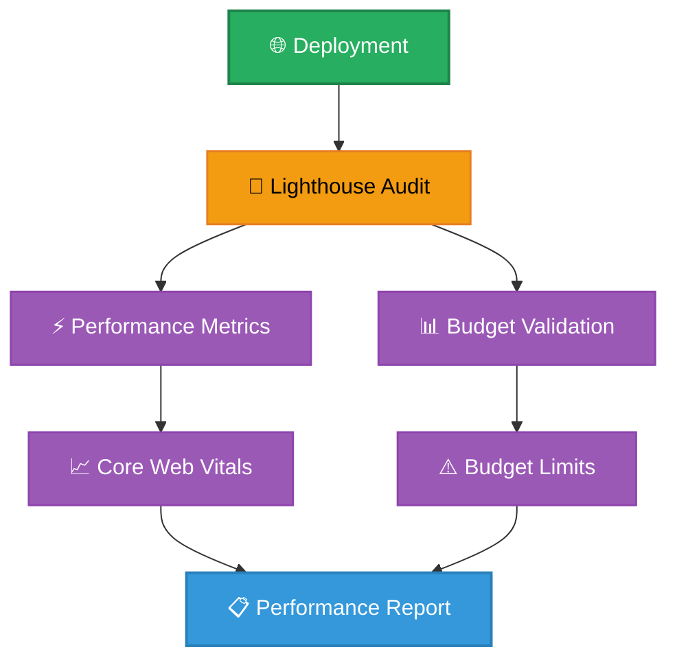
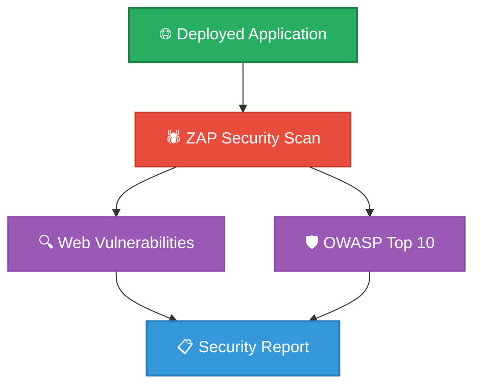
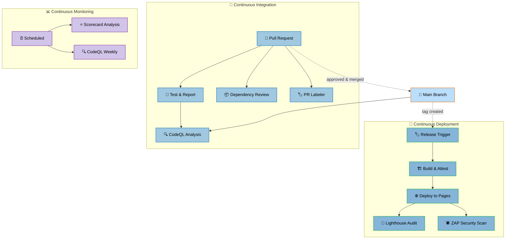

# 🔧 Black Trigram (흑괘) CI/CD Workflows

This document details the continuous integration and deployment workflows used in the Black Trigram project. The workflows automate testing, security scanning, and release procedures to ensure code quality and security compliance.

## 📚 Related Architecture Documentation

| Document                                          | Focus            | Description                                                                |
| ------------------------------------------------- | ---------------- | -------------------------------------------------------------------------- |
| **[System Architecture](ARCHITECTURE.md)**        | 🏛️ Architecture  | C4 model showing frontend-only PixiJS + React architecture                 |
| **[Combat Architecture](COMBAT_ARCHITECTURE.md)** | ⚔️ Game Design   | Detailed combat system implementation with Korean martial arts integration |
| **[Game Design](game-design.md)**                 | 🎮 Game Design   | Korean martial arts combat mechanics and player archetypes                 |
| **[Audio Assets](AUDIO_ASSETS.md)**               | 🎵 Assets        | Korean traditional instrument integration and combat audio                 |
| **[Art Assets](ART_ASSETS.md)**                   | 🎨 Assets        | Korean cyberpunk visual design and UI iconography                          |
| **[Future Architecture](FUTURE_ARCHITECTURE.md)** | 🔮 Future Vision | Planned features and scalability considerations                            |
| **[Development Guide](development.md)**           | 🔧 Development   | Security features, testing strategy, and development environment           |

## 🔄 Workflow Overview

The Black Trigram project uses GitHub Actions for automation with the following security-hardened workflows:

1. **🧪 Test and Report** - Comprehensive testing with unit tests and E2E tests
2. **🚀 Build, Attest and Release** - Secure releases with SLSA attestations
3. **🔍 CodeQL Analysis** - Security scanning for JavaScript/TypeScript vulnerabilities
4. **📦 Dependency Review** - Vulnerability scanning for dependencies
5. **⭐ Scorecard Analysis** - OSSF security scorecard for supply chain security
6. **🏷️ PR Labeler** - Automated labeling for pull requests
7. **🔒 Setup Labels** - Repository label management
8. **🔆 Lighthouse Performance** - Performance auditing using budget.json
9. **🕷️ ZAP Security Scan** - Dynamic security testing of deployed application

## 🔐 Security Hardening Practices

Black Trigram implements industry best practices for securing CI/CD pipelines, with StepSecurity hardening for all workflows:

### Specific Hardening Measures

Every workflow in the Black Trigram project implements:

1. **🔒 Permissions Restriction**: Explicit least-privilege permissions
2. **📌 SHA Pinning**: All actions pinned to specific SHA hashes
3. **🛡️ Runner Hardening**: StepSecurity harden-runner for audit logging
4. **📄 SBOM Generation**: Software Bill of Materials for transparency
5. **🔏 Build Attestations**: Cryptographic proof of build integrity
6. **⏱️ Timeout Limits**: Resource exhaustion prevention
7. **🔑 OIDC Tokens**: Secure authentication without long-lived secrets

## 🧪 Test and Report Workflow

The Test and Report workflow ensures comprehensive quality validation:

### Testing Components

The comprehensive testing approach covers:

- **🏗️ Build Validation**: Ensures application builds successfully
- **🧪 Unit Testing**: Vitest with coverage reporting
- **🌐 E2E Testing**: Cypress with video recording and screenshots
- **📊 Test Reporting**: JUnit XML and coverage reports
- **🎬 Artifact Collection**: Test videos, screenshots, and reports

## 🚀 Build, Attest and Release Workflow

The secure release workflow handles version management, build attestations, and deployment with SLSA compliance:

### Release Management Features

- **🏷️ Tag-based Releases**: Automatic releases on tag push
- **📋 Manual Releases**: Workflow dispatch with version input
- **🔒 Security Attestations**: SLSA Level 3 build provenance
- **📄 SBOM Generation**: Software Bill of Materials in SPDX format
- **📦 Artifact Management**: Built application with security attestations
- **🌐 GitHub Pages**: Automated deployment to GitHub Pages

## 🔍 Security Analysis Workflows

Multiple security scanning workflows protect the application:

### 🔍 CodeQL Analysis

Comprehensive static analysis for JavaScript/TypeScript vulnerabilities:

- **🚨 Vulnerability Detection**: Identifies security issues in code
- **📊 Weekly Scanning**: Scheduled analysis for continuous monitoring
- **🔒 SARIF Reports**: Results uploaded to GitHub Security tab

### 📦 Dependency Review

Automated scanning for dependency vulnerabilities:

- **⚠️ CVE Detection**: Identifies known vulnerabilities in dependencies
- **📋 PR Comments**: Automatic comments on pull requests with findings
- **🚫 Blocking**: Can block merges with vulnerable dependencies

### ⭐ OSSF Scorecard

Supply chain security assessment:

- **🏆 Security Score**: Public transparency with security badge
- **📦 Dependency Management**: Checks for pinned versions and updates
- **🔐 Code Signing**: Validates commit signing and release integrity
- **🛡️ Branch Protection**: Verifies branch protection settings

## 🏷️ Automated Labeling System

Intelligent pull request labeling for development workflows:

### Label Categories

The labeler automatically applies labels based on file changes:

- **🚀 feature** - New features and enhancements
- **🐛 bug** - Bug fixes and patches
- **📝 documentation** - Documentation updates
- **🔒 security** - Security improvements and fixes
- **🧪 testing** - Test improvements and coverage
- **📦 dependencies** - Dependency updates
- **🎨 ui** - User interface changes
- **🏗️ infrastructure** - Build and CI/CD changes

## 🔆 Performance Monitoring

Lighthouse performance auditing using the budget.json configuration:

### Performance Budget (budget.json)

The Lighthouse workflow tests against specific performance budgets:

- **⚡ Interactive**: 6000ms budget
- **🎨 First Contentful Paint**: 3500ms budget
- **📏 Largest Contentful Paint**: 4000ms budget
- **⏱️ Total Blocking Time**: 1600ms budget
- **📐 Cumulative Layout Shift**: 0.1 budget
- **🚀 Speed Index**: 5000ms budget

### Resource Budgets

- **📜 Scripts**: 180KB budget
- **🖼️ Images**: 200KB budget
- **🎨 Stylesheets**: 50KB budget
- **📄 Document**: 20KB budget
- **🔤 Fonts**: 50KB budget
- **📦 Total**: 500KB budget

## 🕷️ Dynamic Security Testing

ZAP security scanning of the deployed application:

### Security Testing Focus

- **🔍 Vulnerability Scanning**: OWASP ZAP full scan of deployed application
- **🛡️ OWASP Top 10**: Testing against common web vulnerabilities
- **🌐 Dynamic Testing**: Live application security assessment
- **📋 Issue Creation**: Optional GitHub issue creation for vulnerabilities

## Workflow Integration & Dependencies

The complete CI/CD pipeline shows how all workflows interact:

## 🔐 Security Compliance

### OSSF Scorecard Integration

- **Automated scoring** of supply chain security practices
- **Public transparency** with security badge
- **Continuous monitoring** of security posture

### Supply Chain Protection

- **Pinned dependencies** - All GitHub Actions pinned to SHA hashes
- **Dependency scanning** - Automated vulnerability detection
- **SLSA compliance** - Build integrity and provenance
- **Signed artifacts** - Cryptographic verification of releases

### Build Attestations

Every release includes:

- **📄 SBOM**: Software Bill of Materials in SPDX format
- **🔏 Build Provenance**: SLSA-compliant attestations
- **🔐 Artifact Signing**: Cryptographic signatures
- **✅ Verification**: GitHub CLI verification commands

---

**흑괘의 길을 걸어라** - _Walk the Path of the Black Trigram_

The CI/CD workflows ensure that every aspect of the application meets the highest standards of quality, security, and reliability through automated testing, security scanning, and secure release management.
