# 🔧 Black Trigram (흑괘) CI/CD Workflows

This document details the continuous integration and deployment workflows used in the Black Trigram project. The workflows automate testing, security scanning, and release procedures to ensure code quality and security compliance aligned with Hack23 AB's [Secure Development Policy](https://github.com/Hack23/ISMS-PUBLIC/blob/main/Secure_Development_Policy.md) and [Change Management](https://github.com/Hack23/ISMS-PUBLIC/blob/main/Change_Management.md) standards.

**Current TypeScript version: 6.0.3**  
**Current Product Version: 0.7.33**  
**Last Updated: 2026-04-28**

## 🔐 ISMS Policy Alignment

Black Trigram's CI/CD workflows implement security controls mandated by Hack23 AB's ISMS framework:

| **ISMS Policy**                                                                                                  | **Workflow Implementation**                                                |
| ---------------------------------------------------------------------------------------------------------------- | -------------------------------------------------------------------------- |
| [🛠️ Secure Development Policy](https://github.com/Hack23/ISMS-PUBLIC/blob/main/Secure_Development_Policy.md)     | SAST (CodeQL), SCA (Dependency Review), DAST (ZAP), performance testing    |
| [📝 Change Management](https://github.com/Hack23/ISMS-PUBLIC/blob/main/Change_Management.md)                     | Automated testing gates, security scanning, PR review requirements         |
| [🔍 Vulnerability Management](https://github.com/Hack23/ISMS-PUBLIC/blob/main/Vulnerability_Management.md)       | Dependabot, CodeQL, OSSF Scorecard, security advisories                    |
| [🔓 Open Source Policy](https://github.com/Hack23/ISMS-PUBLIC/blob/main/Open_Source_Policy.md)                   | SLSA attestations, SBOM generation, license compliance (FOSSA)             |
| [🔐 Information Security Policy](https://github.com/Hack23/ISMS-PUBLIC/blob/main/Information_Security_Policy.md) | Security-hardened runners, SHA-pinned actions, least privilege permissions |

## 📚 Related Architecture Documentation

<div class="documentation-map">

| Document                                          | Focus            | Description                                                                       |
| ------------------------------------------------- | ---------------- | --------------------------------------------------------------------------------- |
| **[System Architecture](ARCHITECTURE.md)**        | 🏛️ Architecture  | C4 model showing frontend-only Three.js (@react-three/fiber) + React architecture |
| **[Combat Architecture](COMBAT_ARCHITECTURE.md)** | ⚔️ Game Design   | Detailed combat system implementation with Korean martial arts integration        |
| **[Game Design](game-design.md)**                 | 🎮 Game Design   | Korean martial arts combat mechanics and player archetypes                        |
| **[Audio Assets](AUDIO_ASSETS.md)**               | 🎵 Assets        | Korean traditional instrument integration and combat audio                        |
| **[Art Assets](ART_ASSETS.md)**                   | 🎨 Assets        | Korean cyberpunk visual design and UI iconography                                 |
| **[Future Architecture](FUTURE_ARCHITECTURE.md)** | 🔮 Future Vision | Planned features and scalability considerations                                   |
| **[Development Guide](development.md)**           | 🔧 Development   | Security features, testing strategy, and development environment                  |

</div>

## 🔄 Workflow Overview

The Black Trigram project uses GitHub Actions for automation with the following security-hardened workflows:

1. **🧪 Test and Report** - Comprehensive testing with unit tests and E2E tests
2. **🚀 Build, Attest and Release** - Secure releases with SLSA attestations
3. **☁️ AWS S3 Deployment** - Automated deployment to CloudFront + S3 multi-region
4. **🔍 CodeQL Analysis** - Security scanning for JavaScript/TypeScript vulnerabilities
5. **📦 Dependency Review** - Vulnerability scanning for dependencies
6. **⭐ Scorecard Analysis** - OSSF security scorecard for supply chain security
7. **🏷️ PR Labeler** - Automated labeling for pull requests
8. **🔒 Setup Labels** - Repository label management
9. **🔆 Lighthouse Performance** - Performance auditing using budget.json
10. **🕷️ ZAP Security Scan** - Dynamic security testing of deployed application
11. **🤖 Copilot Setup Steps** - GitHub Copilot environment preparation with MCP servers
12. **♿ Accessibility Test** - WCAG 2.1 Level AA compliance validation
13. **📦 Audit Assets** - Asset reference validation and integrity checking
14. **📸 Screenshot Analysis** - Automated UI/UX screenshot capture and analysis
15. **🧹 Knip - Unused Code Detection** - Static detection of unused files, exports, types, and dependencies on every PR

## 🔐 Security Hardening Practices

Black Trigram implements industry best practices for securing CI/CD pipelines, with StepSecurity hardening for all workflows:

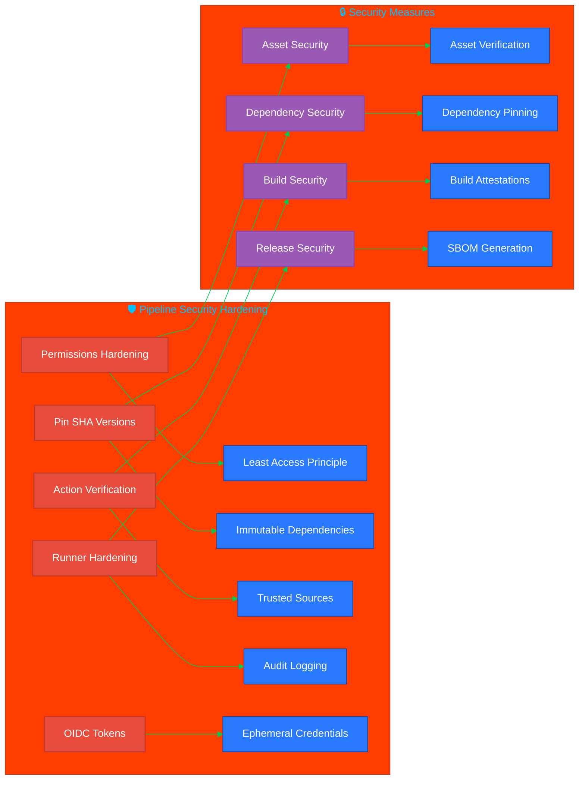

### Specific Hardening Measures

Every workflow in the Black Trigram project implements:

1. **🔒 Permissions Restriction**: Explicit least-privilege permissions
2. **📌 SHA Pinning**: All actions pinned to specific SHA hashes
3. **🛡️ Runner Hardening**: StepSecurity harden-runner for audit logging
4. **📄 SBOM Generation**: Software Bill of Materials for transparency
5. **🔏 Build Attestations**: Cryptographic proof of build integrity
6. **⏱️ Timeout Limits**: Resource exhaustion prevention
7. **🔑 OIDC Tokens**: Secure authentication without long-lived secrets

## 🗃️ Cache Strategy

All workflows use a consistent, non-redundant caching strategy to maximize build speed while minimizing cache storage consumption.

### Cache Action Version

All explicit caches use a single pinned version:

```yaml
uses: actions/cache@27d5ce7f107fe9357f9df03efb73ab90386fccae # v5.0.5
```

### npm / Node Modules

`actions/setup-node` is configured with `cache: "npm"` in every job that installs Node dependencies. This uses GitHub's built-in npm cache keyed on `package-lock.json` and is the **only** npm cache mechanism used — no additional `actions/cache` step for `~/.npm` is added, which would create a redundant second cache entry for the same data.

### Special Tool Caches

Explicit `actions/cache` steps are used **only** for build artifacts that `setup-node` does not cover:

| Cache | Path | Key pattern | Used in |
|---|---|---|---|
| Vite build cache | `node_modules/.vite` | `v2-{OS}-vite-{lockfile-hash}` | build-validation, release build |
| Cypress binary | `~/.cache/Cypress` | `v2-cypress-{OS}-{lockfile-hash}` | e2e-tests, release prepare |
| Playwright browsers | `~/.cache/ms-playwright` | `v2-playwright-{OS}-{lockfile-hash}` | screenshot-analysis |
| APT packages (Chrome) | `/var/cache/apt/archives` | `v2-{OS}-apt-chrome-{workflow-hash}` | e2e-tests, release prepare |
| APT packages (Playwright) | `/var/cache/apt/archives` | `v2-{OS}-apt-playwright-{workflow-hash}` | screenshot-analysis |
| APT packages (graphviz) | `/var/cache/apt/archives` | `v2-{OS}-apt-graphviz-{workflow-hash}` | report |

> **Important — Vite cache ordering**: The Vite build cache step is placed **after** `npm ci`. `npm ci` deletes and recreates `node_modules`, so any cache restored before it would be immediately discarded. By restoring after `npm ci`, the cached `.vite` directory is placed into the freshly-created `node_modules/` and is available for the subsequent build step.

### Cache Key Versioning

All cache keys are prefixed with `v2-`. Incrementing this prefix (e.g. to `v3-`) immediately expires every existing cache entry on the next run, without needing to manually delete caches via the GitHub UI. The old `v1`/unversioned entries expire naturally after 7 days of no access.

## 🛡️ Resilience Against External Registry Failures

Browser and system-package installations can hang or fail when third-party registries are slow or unavailable. The following measures are applied across all affected workflows:

### apt-get Resilience

- `DEBIAN_FRONTEND=noninteractive` is set to prevent interactive prompts that cause indefinite hangs.
- `-qq` flag is used with `apt-get update` to suppress unnecessary output.
- `--no-install-recommends` limits the install surface and reduces download size.
- All `apt-get` install steps are wrapped in a `timeout-minutes:` step-level limit.

### Chrome Installation Resilience

The deprecated `apt-key add` method (which reads from stdin and can block) is replaced with the modern signed-keyring approach:

```bash
# Modern method — non-blocking, uses gpg directly
curl -fsSL --retry 3 --retry-delay 5 --connect-timeout 30 \
  https://dl.google.com/linux/linux_signing_key.pub \
  | sudo gpg --dearmor -o /usr/share/keyrings/google-chrome-keyring.gpg
echo "deb [arch=amd64 signed-by=/usr/share/keyrings/google-chrome-keyring.gpg] \
  https://dl.google.com/linux/chrome/deb/ stable main" \
  | sudo tee /etc/apt/sources.list.d/google-chrome.list > /dev/null
```

`curl` is invoked with `--retry 3 --retry-delay 5 --connect-timeout 30` so transient network failures are retried automatically.

### Playwright Installation Resilience

`npx playwright install chromium --with-deps` is given a `timeout-minutes: 20` step-level timeout so a slow CDN or broken download does not cause the entire job to hang indefinitely. The timeout is set to 20 minutes (not 10) because on a cache miss, Playwright must download Chromium (~200 MB) plus install OS-level dependencies via apt, which can exceed 10 minutes on slow CDN or congested GitHub Actions runners. The Playwright browser cache (`~/.cache/ms-playwright`) is restored before this step so a successful cache hit skips the download entirely.

## 🧪 Test and Report Workflow

The Test and Report workflow ensures comprehensive quality validation:

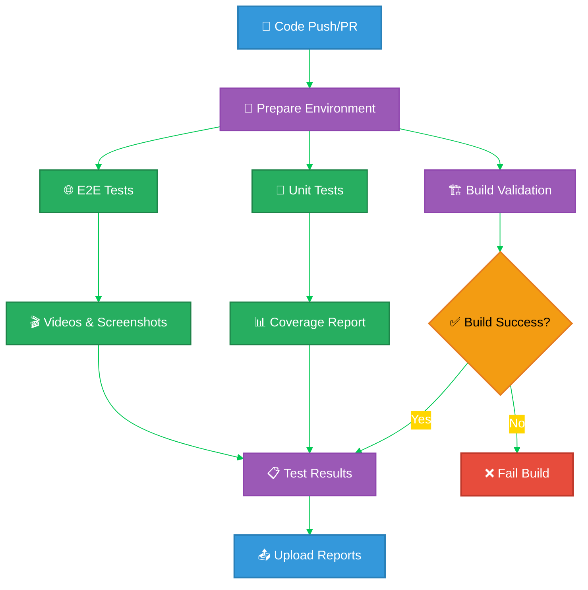

### Testing Components

The comprehensive testing approach covers:

- **🏗️ Build Validation**: Ensures application builds successfully
- **🧪 Unit Testing**: Vitest with coverage reporting
- **🌐 E2E Testing**: Cypress with video recording and screenshots
- **📊 Test Reporting**: JUnit XML and coverage reports
- **🎬 Artifact Collection**: Test videos, screenshots, and reports

## 🚀 Build, Attest and Release Workflow

The secure release workflow handles version management, build attestations, and deployment with SLSA compliance:

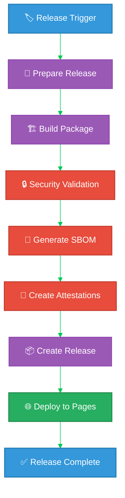

### Release Management Features

- **🏷️ Tag-based Releases**: Automatic releases on tag push
- **📋 Manual Releases**: Workflow dispatch with version input
- **🔒 Security Attestations**: SLSA Level 3 build provenance
- **📄 SBOM Generation**: Software Bill of Materials in SPDX format
- **📦 Artifact Management**: Built application with security attestations
- **🌐 GitHub Pages**: Automated deployment to GitHub Pages (DR)

## ☁️ AWS S3 Deployment Workflow

The AWS deployment workflow handles automatic deployment to CloudFront + S3 multi-region infrastructure with disaster recovery failover to GitHub Pages.

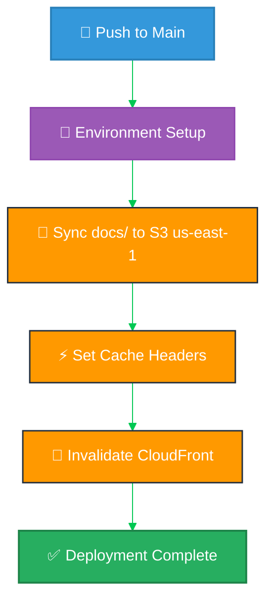

**Note**: GitHub Pages disaster recovery is deployed separately via `release.yml` on tagged releases, not as part of the main AWS deployment workflow.

### AWS Deployment Features

- **☁️ CloudFront CDN**: Global content delivery with edge caching
- **💾 S3 Storage**: Primary deployment to us-east-1 with S3 replication (if configured at infrastructure level)
- **⚡ Cache Optimization**: Aggressive caching for static assets (1 year)
  - CSS/JS: `max-age=31536000, immutable`
  - Images: `max-age=31536000, immutable`
  - HTML: `max-age=3600, must-revalidate`
  - Fonts: `max-age=31536000, immutable`
- **🔄 CloudFront Invalidation**: Automatic cache invalidation on deployment
- **📡 Route53 Integration**: DNS management with health checks
- **🔐 AWS IAM**: OIDC authentication with role-based access
- **📄 GitHub Pages DR**: Deployed separately on tagged releases (via `release.yml`) for disaster recovery
- **🛡️ Security**: StepSecurity harden-runner with egress policy

### Deployment Architecture

The workflow deploys to a multi-tier infrastructure:

1. **Primary**: CloudFront → S3 (us-east-1)
2. **Disaster Recovery**: GitHub Pages (release-based), activated via Route53 failover

### AWS Credentials

The workflow uses AWS OIDC (OpenID Connect) for secure authentication:

- **Role**: `GithubWorkFlowRole` in AWS IAM
- **Region**: `us-east-1` (primary)
- **S3 Bucket**: `blacktrigram-frontend-us-east-1-172017021075`
- **CloudFormation Stack**: `blacktrigram-frontend`

## 🔍 Security Analysis Workflows

Multiple security scanning workflows protect the application:

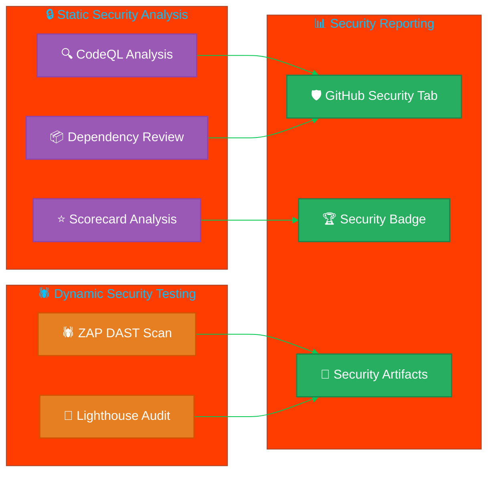

### 🔍 CodeQL Analysis

Comprehensive static analysis for JavaScript/TypeScript vulnerabilities:

- **🚨 Vulnerability Detection**: Identifies security issues in code
- **📊 Weekly Scanning**: Scheduled analysis for continuous monitoring
- **🔒 SARIF Reports**: Results uploaded to GitHub Security tab

### 📦 Dependency Review

Automated scanning for dependency vulnerabilities:

- **⚠️ CVE Detection**: Identifies known vulnerabilities in dependencies
- **📋 PR Comments**: Automatic comments on pull requests with findings
- **🚫 Blocking**: Can block merges with vulnerable dependencies

### ⭐ OSSF Scorecard

Supply chain security assessment:

- **🏆 Security Score**: Public transparency with security badge
- **📦 Dependency Management**: Checks for pinned versions and updates
- **🔐 Code Signing**: Validates commit signing and release integrity
- **🛡️ Branch Protection**: Verifies branch protection settings

## 🏷️ Automated Labeling System

Intelligent pull request labeling for development workflows:


### Label Categories

The labeler automatically applies labels based on file changes:

- **🚀 feature** - New features and enhancements
- **🐛 bug** - Bug fixes and patches
- **📝 documentation** - Documentation updates
- **🔒 security** - Security improvements and fixes
- **🧪 testing** - Test improvements and coverage
- **📦 dependencies** - Dependency updates
- **🎨 ui** - User interface changes
- **🏗️ infrastructure** - Build and CI/CD changes

## 🔆 Performance Monitoring

Lighthouse performance auditing using the budget.json configuration:

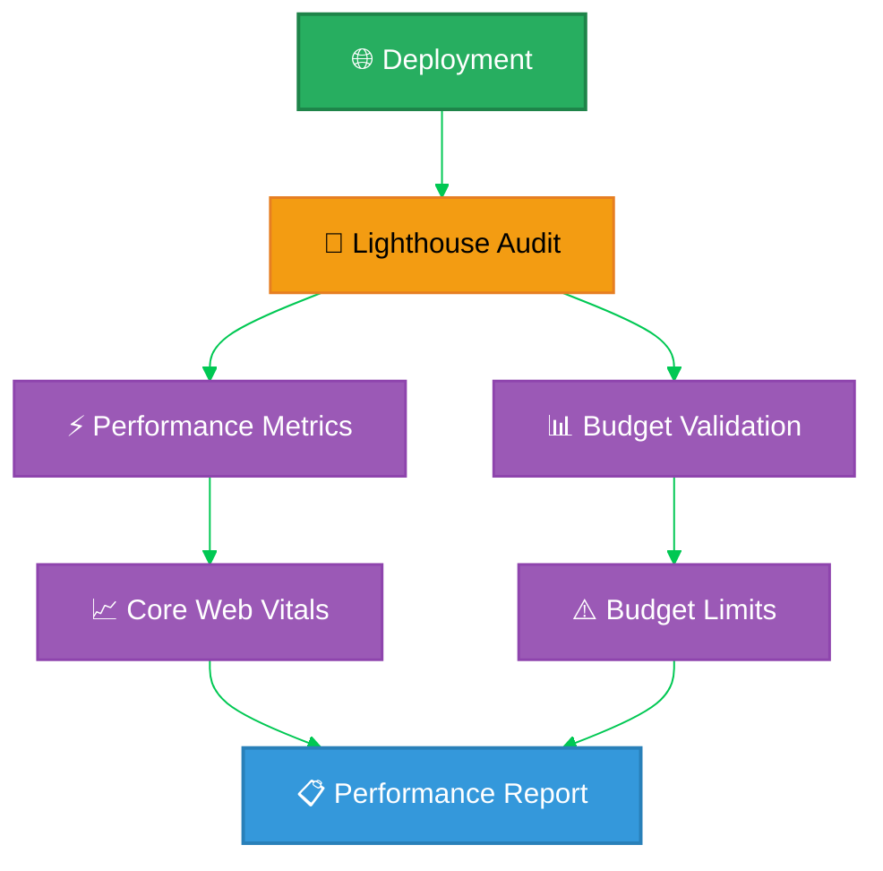

### Performance Budget (budget.json)

The Lighthouse workflow tests against specific performance budgets:

- **⚡ Interactive**: 6000ms budget
- **🎨 First Contentful Paint**: 3500ms budget
- **📏 Largest Contentful Paint**: 4000ms budget
- **⏱️ Total Blocking Time**: 1600ms budget
- **📐 Cumulative Layout Shift**: 0.1 budget
- **🚀 Speed Index**: 5000ms budget

### Resource Budgets

- **📜 Scripts**: 180KB budget
- **🖼️ Images**: 200KB budget
- **🎨 Stylesheets**: 50KB budget
- **📄 Document**: 20KB budget
- **🔤 Fonts**: 50KB budget
- **📦 Total**: 500KB budget

## 🕷️ Dynamic Security Testing

ZAP security scanning of the deployed application:


### Security Testing Focus

- **🔍 Vulnerability Scanning**: OWASP ZAP full scan of deployed application
- **🛡️ OWASP Top 10**: Testing against common web vulnerabilities
- **🌐 Dynamic Testing**: Live application security assessment
- **📋 Issue Creation**: Optional GitHub issue creation for vulnerabilities

## 🤖 Copilot Setup Steps Workflow

GitHub Copilot environment preparation with Model Context Protocol (MCP) servers:

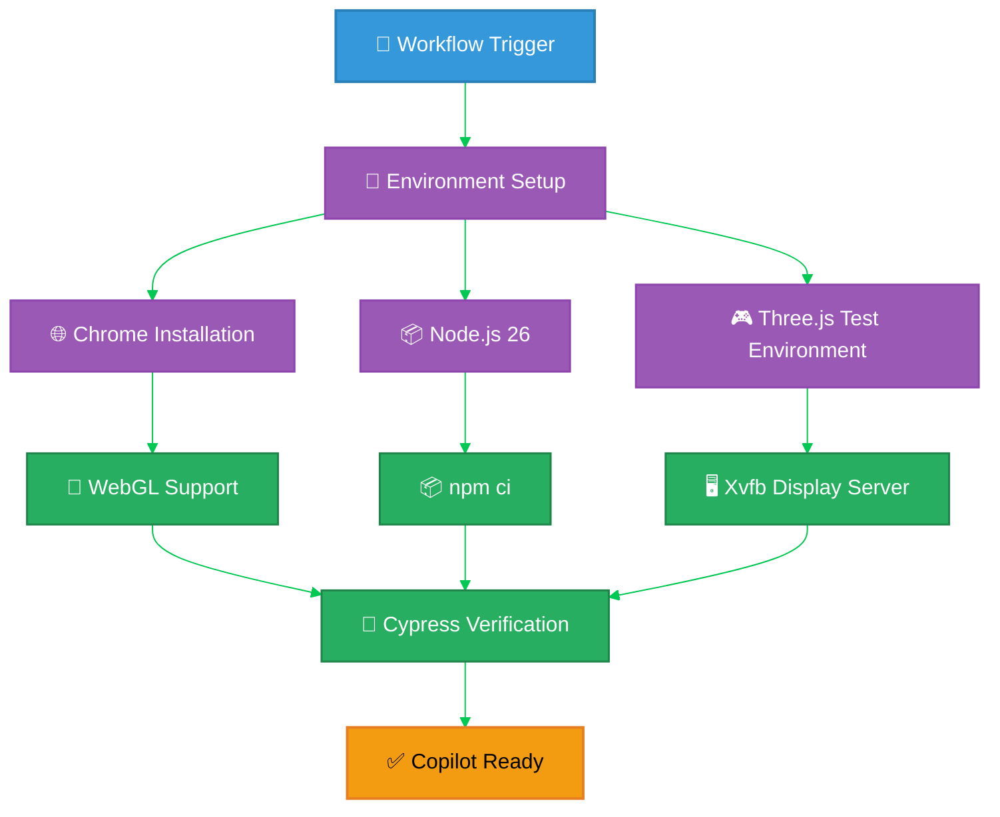

### Copilot Environment Features

- **🌐 Complete Three.js Test Environment**: Chrome with WebGL, Xvfb for headless rendering
- **📦 Node.js 26**: Active CI baseline with npm caching for faster builds
- **🎮 Gaming Test Infrastructure**: Fonts, graphics libraries, Korean language support
- **🔧 MCP Server Integration**: GitHub, filesystem, git, memory, sequential-thinking, playwright servers
- **🔒 Security Hardening**: StepSecurity harden-runner with egress policy auditing
- **📊 Environment Validation**: Comprehensive display of setup status and version info
- **⚡ Performance Optimized**: APT package caching, dependency caching, build artifact caching

### MCP Servers Available

The workflow sets up the following MCP servers for enhanced Copilot capabilities:

- **github**: Repository data, issues, PRs, workflows (with PAT for cross-repo access)
- **filesystem**: Secure filesystem access for reading/editing project files
- **git**: Git operations and repository history context
- **memory**: Conversation history and context between agent sessions
- **sequential-thinking**: Step-by-step problem-solving capabilities
- **playwright**: Browser automation for testing and debugging (enabled)
- **brave-search**: Documentation search (disabled by default)
- **aws**: AWS infrastructure operations (disabled by default)

## ♿ Accessibility Testing Workflow

WCAG 2.1 Level AA compliance validation for Korean-English bilingual UI:

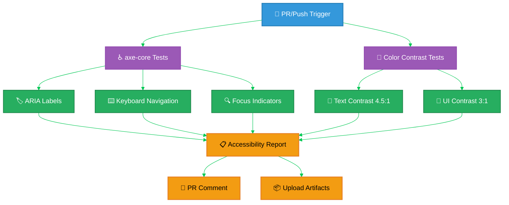

### Accessibility Standards

Black Trigram implements comprehensive accessibility testing for inclusive gaming:

- **♿ WCAG 2.1 Level AA Compliance**: Full conformance with international accessibility standards
- **🎨 Color Contrast**: 4.5:1 for text, 3:1 for UI components on Korean cyberpunk theme
- **⌨️ Keyboard Navigation**: Full game control without mouse (WASD, 1-8 stances, Space, B, V)
- **🏷️ Bilingual ARIA**: Korean-English labels for all interactive elements
- **🔍 Focus Management**: Visible focus indicators meeting 3:1 contrast
- **🎮 Gaming-Specific**: Dialog semantics, progress bars, timers with proper ARIA roles

### Components Tested

- **VirtualDPad**: Mobile touch controls with button groups
- **StanceWheel**: Eight trigram stance selector with radiogroup semantics
- **PauseMenu**: Dialog with escape key and modal behavior
- **HealthBar/StaminaBar**: Progress bars with live regions
- **CombatTimer**: Timer with countdown announcements
- **BilingualText**: Korean-English dual labels with proper language tagging

## 📦 Asset Audit Workflow

Automated validation of asset references and integrity:

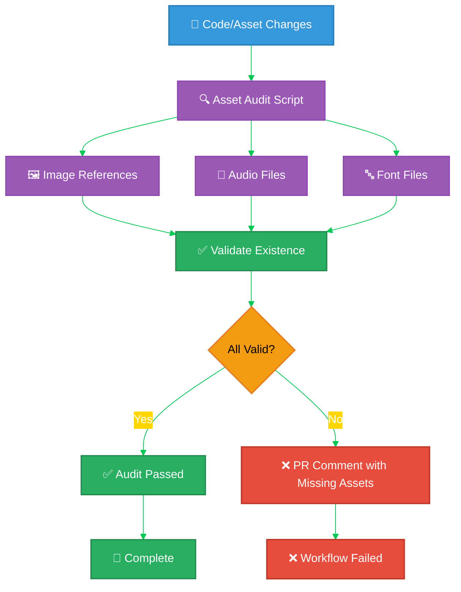

### Asset Validation Features

- **🖼️ Image References**: Validates all image imports and public asset references
- **🎵 Audio Files**: Checks audio file existence for Howler.js integration
- **🔤 Font Files**: Validates Korean and English font availability
- **📦 Dependency Tracking**: Ensures assets match code references
- **🔍 Automated Detection**: Runs on code and asset changes
- **💬 PR Feedback**: Automatic comments on pull requests for missing assets

## 📸 Screenshot Analysis Workflow

Automated UI/UX screenshot capture for visual regression and documentation:

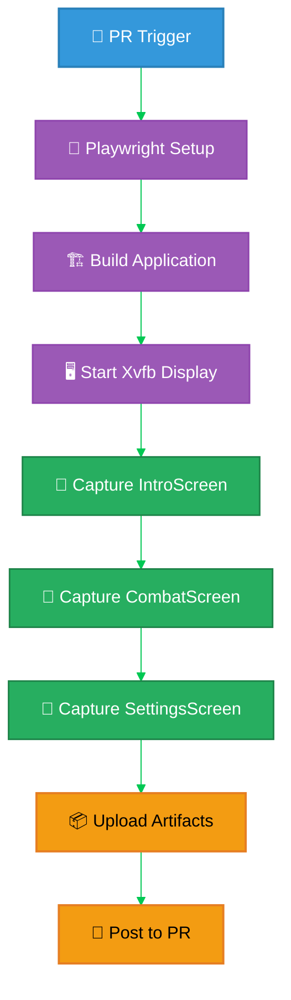

### Screenshot Capabilities

- **📸 Automated Capture**: Playwright-based screenshot generation for all game screens
- **🎮 Three.js Rendering**: WebGL rendering with SwiftShader in headless environment
- **🖥️ Multiple Resolutions**: Desktop (1280x1024) and mobile (375x667) screenshots
- **🎨 Visual Documentation**: Automatic UI/UX documentation for PRs
- **📊 Retention**: 30-day artifact retention for comparison
- **🇰🇷 Korean UI**: Captures bilingual Korean-English interface elements
- **🔍 PR Integration**: Posts screenshots directly to pull request for review

## 🧹 Knip - Unused Code Detection

Automated detection of unused files, exports, types, and dependencies on every pull request:

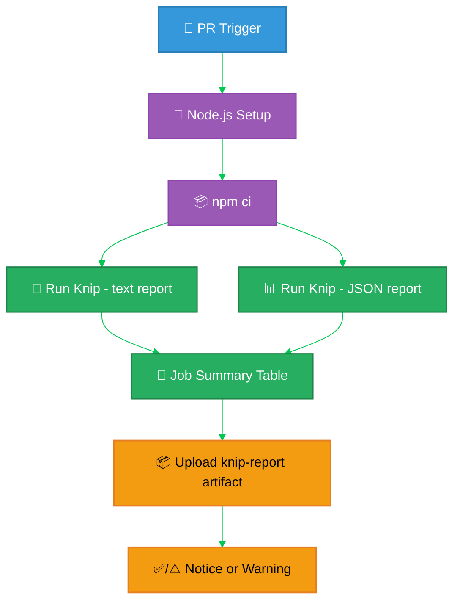

### Knip Capabilities

- **🗄️ Unused Files**: Source files not reachable from any entry point
- **📤 Unused Exports**: Exported symbols never imported elsewhere
- **🔤 Unused Types & Enum Members**: Type aliases, interfaces, and enum members with no consumers
- **♻️ Duplicate Exports**: Symbols exported multiple times (e.g. named + default)
- **📦 Unused Dependencies**: `dependencies` / `devDependencies` declared in `package.json` but never imported
- **🔍 Unlisted Dependencies**: Imports not declared in `package.json`
- **📊 Job Summary**: Markdown table summarising counts per category, posted to the GitHub Actions run summary
- **📁 Artifact Retention**: 14-day retention of `knip-report.txt` and `knip-report.json` for review
- **⚠️ Advisory Mode**: Surfaces findings as warnings without blocking PRs while the codebase is being cleaned up; promote to a hard gate once findings are at zero

### Knip Configuration (`knip.json`)

The project uses a comprehensive `knip.json` that covers:

- **Application entry points**: `src/main.tsx`, `src/index.ts`, all public library subpath entries (`src/audio/index.ts`, `src/systems/*/index.ts`, `src/components/**/index.ts`, etc.)
- **Build & tool configs**: `vite.config.ts`, `vite.lib.config.ts`, `vitest.config.ts`, `cypress.config.ts`, `eslint.config.js`, `vite-plugins/**/*.ts`, `generate-sitemaps.js`
- **Automation scripts**: `scripts/**/*.{ts,js,cjs,mjs}` (audits, asset generation, screenshot capture, validation — invoked from `package.json` scripts and CI workflows)
- **Cypress entries**: `cypress.config.ts`, `cypress/e2e/**/*.{spec,cy}.{ts,tsx}`, `cypress/support/**/*.ts`, `cypress/plugins/**/*.{ts,js}`
- **Test files**: `src/**/*.{test,spec}.{ts,tsx}`, `src/**/__tests__/**/*.{ts,tsx}`, `src/test/setup.ts`
- **Plugin integration**: TypeScript (`tsconfig*.json`), Vite, Vitest, Cypress, ESLint plugin configs are wired up so knip understands their conventions
- **Ignored dependencies**: Reporters and peer-dep adapters that aren't imported directly (`mochawesome*`, `cypress-junit-reporter`, `vite-bundle-analyzer`, `typedoc-plugin-*`, `postprocessing` peer)

### Local Usage

Developers can run knip locally before pushing:

```bash
npm run knip                          # full report
npm run find:unused                   # alias for npm run knip
npm run knip -- --reporter json > knip-report.json
```

## Workflow Integration & Dependencies

The complete CI/CD pipeline shows how all workflows interact:

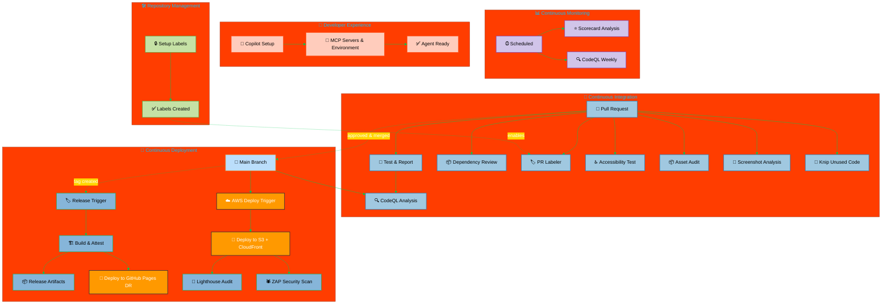

## 🔐 Security Compliance

### OSSF Scorecard Integration

- **Automated scoring** of supply chain security practices
- **Public transparency** with security badge
- **Continuous monitoring** of security posture

### Supply Chain Protection

- **Pinned dependencies** - All GitHub Actions pinned to SHA hashes
- **Dependency scanning** - Automated vulnerability detection
- **SLSA compliance** - Build integrity and provenance
- **Signed artifacts** - Cryptographic verification of releases

### Build Attestations

Every release includes:

- **📄 SBOM**: Software Bill of Materials in SPDX format
- **🔏 Build Provenance**: SLSA-compliant attestations
- **🔐 Artifact Signing**: Cryptographic signatures
- **✅ Verification**: GitHub CLI verification commands

---

**흑괘의 길을 걸어라** - _Walk the Path of the Black Trigram_

The CI/CD workflows ensure that every aspect of the application meets the highest standards of quality, security, and reliability through automated testing, security scanning, and secure release management.

---

## 📚 Related Documents

### 🔐 ISMS Policies

- [🛠️ Secure Development Policy](https://github.com/Hack23/ISMS-PUBLIC/blob/main/Secure_Development_Policy.md) - Security-integrated SDLC standards
- [📝 Change Management](https://github.com/Hack23/ISMS-PUBLIC/blob/main/Change_Management.md) - Risk-controlled change processes
- [🔍 Vulnerability Management](https://github.com/Hack23/ISMS-PUBLIC/blob/main/Vulnerability_Management.md) - Security testing procedures
- [🔓 Open Source Policy](https://github.com/Hack23/ISMS-PUBLIC/blob/main/Open_Source_Policy.md) - Open source governance and licensing
- [🔐 Information Security Policy](https://github.com/Hack23/ISMS-PUBLIC/blob/main/Information_Security_Policy.md) - Overall security governance

### 🛡️ Black Trigram Security Documentation

- [🛡️ Security Architecture](./SECURITY_ARCHITECTURE.md) - Current security implementation
- [🎯 Threat Model](./THREAT_MODEL.md) - STRIDE analysis and attack trees
- [🔒 Security Policy](./SECURITY.md) - Vulnerability reporting
- [🗺️ ISMS Reference Mapping](./ISMS_REFERENCE_MAPPING.md) - Complete ISMS policy mapping

### 🔧 Development Documentation

- [🔧 Development Guide](./development.md) - Security features and testing strategy
- [📐 Architecture](./ARCHITECTURE.md) - Overall system design
- [⚔️ Combat Architecture](./COMBAT_ARCHITECTURE.md) - Combat system implementation
- [🧪 Unit Test Plan](./UnitTestPlan.md) - Unit testing strategy
- [🎯 E2E Test Plan](./E2ETestPlan.md) - End-to-end testing documentation

---

**📋 Document Control:**  
**✅ Approved by:** James Pether Sörling, CEO  
**📤 Distribution:** Public  
**🏷️ Classification:** [](https://github.com/Hack23/ISMS-PUBLIC/blob/main/CLASSIFICATION.md#confidentiality-levels) [](https://github.com/Hack23/ISMS-PUBLIC/blob/main/CLASSIFICATION.md#integrity-levels) [](https://github.com/Hack23/ISMS-PUBLIC/blob/main/CLASSIFICATION.md#availability-levels)  
**📅 Effective Date:** 2026-04-28  
**⏰ Next Review:** 2026-10-28  
**🎯 Framework Compliance:** [](https://github.com/Hack23/ISMS-PUBLIC/blob/main/CLASSIFICATION.md) [](https://github.com/Hack23/ISMS-PUBLIC/blob/main/CLASSIFICATION.md) [](https://github.com/Hack23/ISMS-PUBLIC/blob/main/CLASSIFICATION.md)
