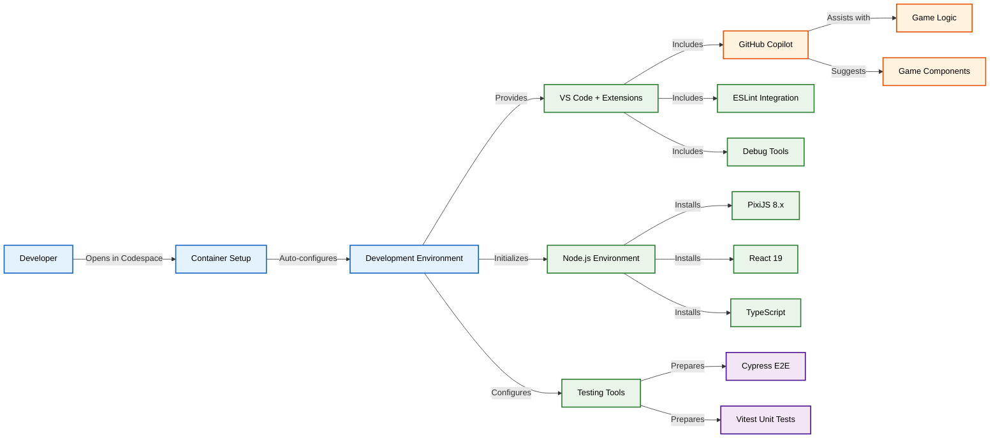
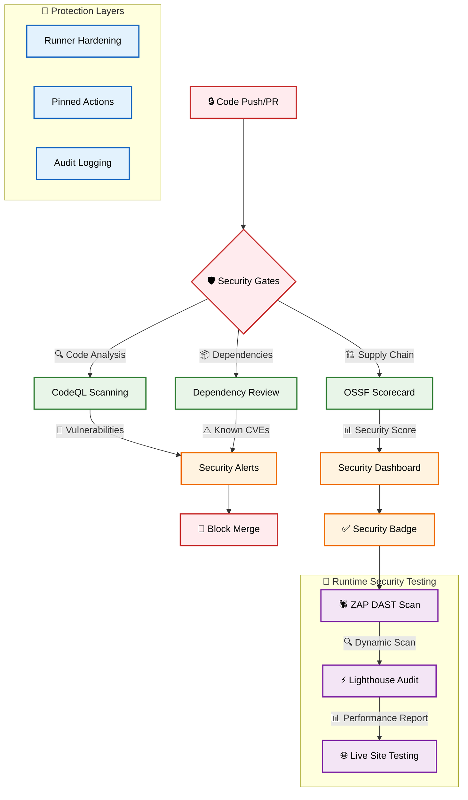
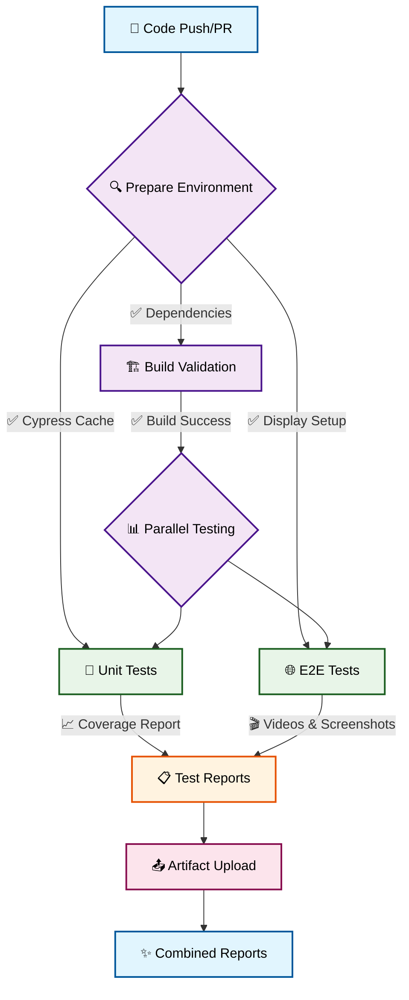
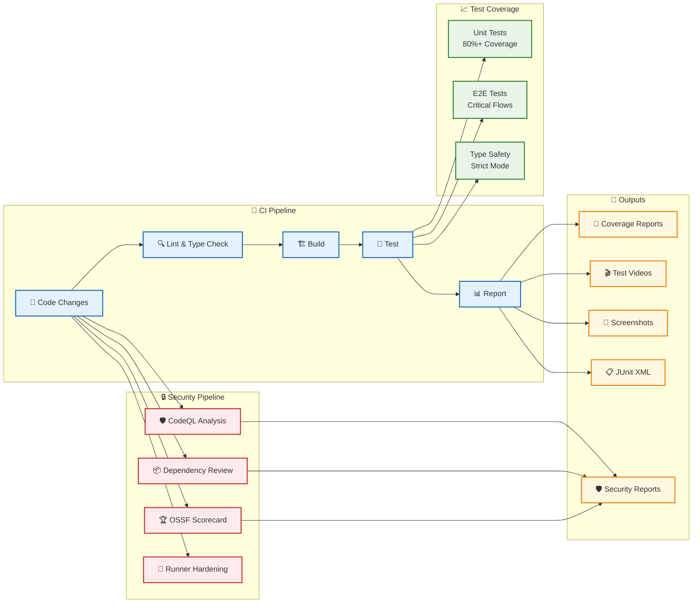
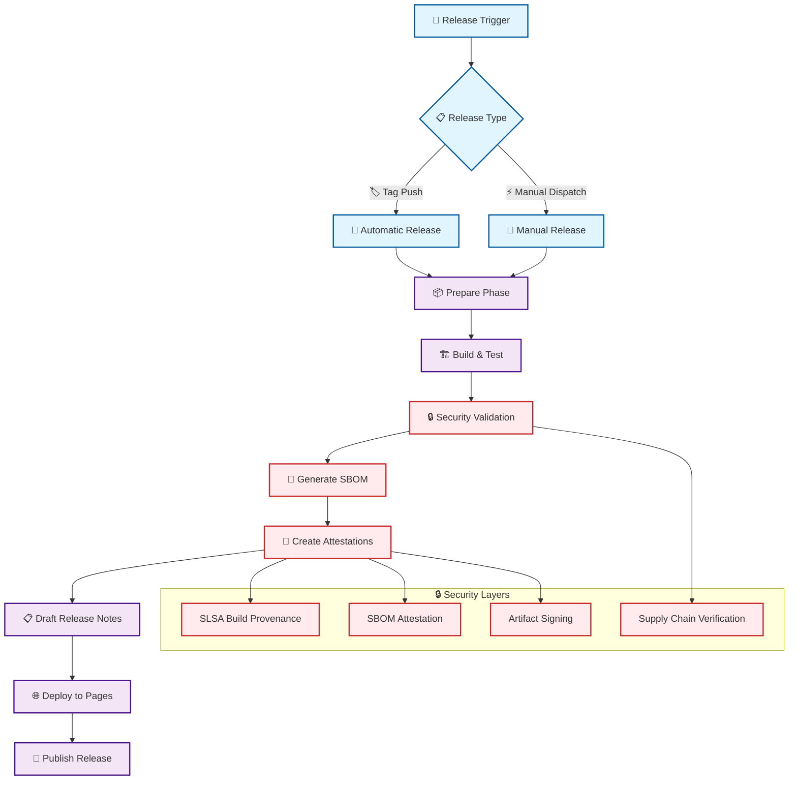
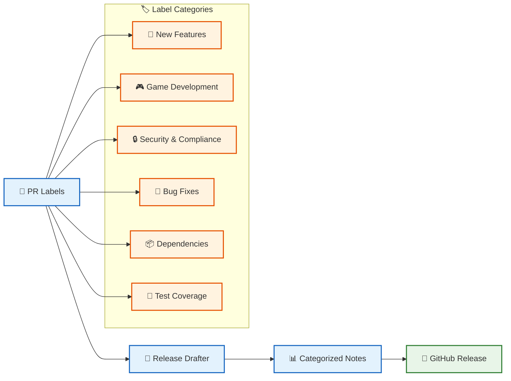
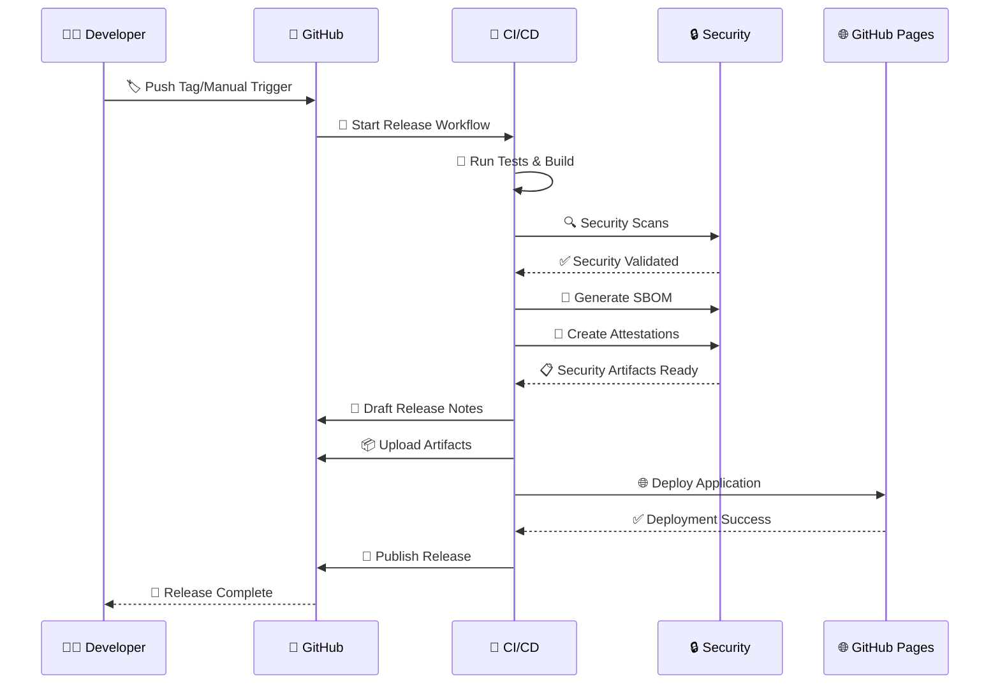

# 🔒 Security Features

This development guide describes comprehensive security measures implemented per Hack23 AB's [Secure Development Policy](https://github.com/Hack23/ISMS-PUBLIC/blob/main/Secure_Development_Policy.md) and [Vulnerability Management](https://github.com/Hack23/ISMS-PUBLIC/blob/main/Vulnerability_Management.md) procedures.

## 🔐 ISMS-Aligned Security Controls

Black Trigram implements security controls mandated by Hack23 AB's Information Security Management System (ISMS):

| **Security Domain** | **Controls Implemented** | **ISMS Policy Reference** |
|---------------------|-------------------------|---------------------------|
| **🛡️ Supply Chain Security** | OSSF Scorecard, Dependency Review, SLSA attestations | [Secure Development Policy](https://github.com/Hack23/ISMS-PUBLIC/blob/main/Secure_Development_Policy.md) |
| **🔍 Static Security Testing** | CodeQL SAST, SonarCloud quality gates | [Vulnerability Management](https://github.com/Hack23/ISMS-PUBLIC/blob/main/Vulnerability_Management.md) |
| **🕷️ Dynamic Security Testing** | OWASP ZAP DAST scanning | [Vulnerability Management](https://github.com/Hack23/ISMS-PUBLIC/blob/main/Vulnerability_Management.md) |
| **📦 Dependency Management** | Dependabot, SBOM generation, license compliance | [Open Source Policy](https://github.com/Hack23/ISMS-PUBLIC/blob/main/Open_Source_Policy.md) |
| **🔐 CI/CD Hardening** | SHA-pinned actions, runner hardening, audit logging | [Change Management](https://github.com/Hack23/ISMS-PUBLIC/blob/main/Change_Management.md) |
| **⚡ Performance Security** | Lighthouse audits, performance budgets | [Secure Development Policy](https://github.com/Hack23/ISMS-PUBLIC/blob/main/Secure_Development_Policy.md) |
| **🏆 Artifact Integrity** | Cryptographic signatures, build provenance | [Information Security Policy](https://github.com/Hack23/ISMS-PUBLIC/blob/main/Information_Security_Policy.md) |

## Security Implementation Details

- **🛡️ Supply Chain Security** - OSSF Scorecard analysis and dependency review
- **🔍 Static Analysis** - CodeQL scanning for vulnerabilities
- **📦 Dependency Protection** - Automated dependency vulnerability checks
- **🔐 Runner Hardening** - All CI/CD runners are hardened with audit logging
- **📋 Security Policies** - GitHub security advisories and vulnerability reporting
- **🏷️ Pinned Dependencies** - All GitHub Actions pinned to specific SHA hashes
- **📄 SBOM Generation** - Software Bill of Materials for transparency
- **🔏 Build Attestations** - Cryptographic proof of build integrity
- **🏆 Artifact Verification** - SLSA-compliant build provenance
- **🕷️ ZAP Security Scanning** - OWASP ZAP dynamic application security testing
- **⚡ Lighthouse Performance** - Automated performance and accessibility audits

## Features

- ⚡ **Vite** - Fast build tool and dev server
- ⚛️ **React 19** - Modern React with hooks
- 🔷 **TypeScript** - Strict typing with latest standards
- 🧪 **Vitest** - Fast unit testing with coverage
- 🌲 **Cypress** - Reliable E2E testing
- 📦 **ESLint** - Code linting with TypeScript rules
- 🔄 **GitHub Actions** - Automated testing and reporting
- 🎮 **PixiJS 8.x** - High-performance WebGL renderer for 2D games
- 🎵 **Howler.js** - Audio library for games

## Development Environment

This template includes a fully configured development environment:

- **🚀 GitHub Codespaces** - Zero-configuration development environment
- **🤖 GitHub Copilot** - AI-assisted development with code suggestions
- **💬 Copilot Chat** - In-editor AI assistance for debugging and explanations
- **🔧 VS Code Extensions** - Pre-configured extensions for game development
- **🔒 Secure Container** - Hardened development container with security features
- **🔌 MCP Servers** - Model Context Protocol servers for enhanced Copilot capabilities ([learn more](.github/COPILOT_MCP_SETUP.md))

### 🚀 Codespaces Setup

This repository is fully configured for GitHub Codespaces, providing:

- **One-click setup** - Start coding immediately with zero configuration
- **Pre-installed dependencies** - All tools and libraries ready to use
- **Configured test environment** - Cypress and Vitest ready to run
- **GitHub Copilot integration** - AI-powered code assistance with MCP servers
- **Optimized performance** - Container configured for game development
- **Enhanced AI capabilities** - MCP servers for GitHub, Playwright, filesystem, and sequential thinking

> 📖 **Learn more**: See [Copilot MCP Setup Guide](.github/COPILOT_MCP_SETUP.md) for detailed information about MCP server configuration and usage.



## Security Workflows



## Test & Report Workflow



## Quick Start

```bash
# Using GitHub Codespaces
# Click "Code" button on repository and select "Open with Codespaces"

# Or local development:
# Install dependencies
npm install

# Start development server
npm run dev

# Build for production
npm run build

# Run unit tests
npm run test

# Run E2E tests
npm run test:e2e
```

## PixiJS 8.x Integration

This template uses PixiJS 8.x for high-performance 2D game rendering:

- Modern WebGL-based rendering
- Optimized sprite batching
- Integrated with React via @pixi/react
- Sound support via @pixi/sound and Howler.js
- Responsive game canvas
- Touch and mouse input handling

## Testing

### Unit Tests

- Uses Vitest with jsdom environment
- Configured for React Testing Library
- Coverage reports generated automatically
- Run with: `npm run test`

### E2E Tests

- Uses Cypress for end-to-end testing
- Starts dev server automatically
- Screenshots and videos on failure
- Run with: `npm run test:e2e`

### CI/CD Pipeline



### Security Workflows

- **CodeQL Analysis**: Automated vulnerability scanning on push/PR
- **Dependency Review**: Checks for known vulnerabilities in dependencies
- **OSSF Scorecard**: Supply chain security assessment with public scoring
- **Runner Hardening**: All CI/CD runners use hardened security policies

## 🚀 Release Management

This template includes a comprehensive, security-first release workflow with automated versioning, security attestations, and deployment.

### Release Flow



### 🏷️ Release Types

#### Automatic Releases (Tag-based)

```bash
# Create and push a tag to trigger automatic release
git tag v1.0.0
git push origin v1.0.0
```

#### Manual Releases (Workflow Dispatch)

- Navigate to **Actions** → **Build, Attest and Release**
- Click **Run workflow**
- Specify version (e.g., `v1.0.1`) and pre-release status
- The workflow handles version bumping and tagging automatically

### 📋 Automated Release Notes

Release notes are automatically generated using semantic labeling:



#### Release Note Categories

- **🚀 New Features** - Major feature additions
- **🎮 Game Development** - Game logic, graphics, audio improvements
- **🎨 UI/UX Improvements** - Interface and design updates
- **🏗️ Infrastructure & Performance** - Build and performance optimizations
- **🔄 Code Quality & Refactoring** - Code improvements and testing
- **🔒 Security & Compliance** - Security updates and fixes
- **📝 Documentation** - Documentation improvements
- **📦 Dependencies** - Dependency updates
- **🐛 Bug Fixes** - Bug fixes and patches

### 🔒 Security Attestations & SBOM

#### Software Bill of Materials (SBOM)

Every release includes a comprehensive SBOM in SPDX format:

```json
{
  "SPDXID": "SPDXRef-DOCUMENT",
  "name": "game-v1.0.0",
  "packages": [
    {
      "SPDXID": "SPDXRef-Package-react",
      "name": "react",
      "versionInfo": "19.1.0",
      "licenseConcluded": "MIT"
    }
  ]
}
```

#### Build Provenance Attestations

SLSA-compliant build attestations provide cryptographic proof:

```json
{
  "_type": "https://in-toto.io/Statement/v0.1",
  "predicateType": "https://slsa.dev/provenance/v0.2",
  "subject": [
    {
      "name": "game-v1.0.0.zip",
      "digest": {
        "sha256": "abc123..."
      }
    }
  ],
  "predicate": {
    "builder": {
      "id": "https://github.com/actions/runner"
    },
    "buildType": "https://github.com/actions/workflow@v1"
  }
}
```

#### Verification Commands

```bash
# Verify build provenance
gh attestation verify game-v1.0.0.zip \
  --owner Hack23 --repo game

# Verify SBOM attestation
gh attestation verify game-v1.0.0.zip \
  --owner Hack23 --repo game \
  --predicate-type https://spdx.dev/Document
```

### 📦 Release Artifacts

Each release includes multiple artifacts with full traceability:

```
📦 Release v1.0.0
├── 🎮 game-v1.0.0.zip                    # Built application
├── 📄 game-v1.0.0.spdx.json             # Software Bill of Materials
├── 🔏 game-v1.0.0.zip.intoto.jsonl      # Build provenance attestation
└── 📋 game-v1.0.0.spdx.json.intoto.jsonl # SBOM attestation
```

### 🌐 Deployment Pipeline



### 🔐 Security Compliance

#### OSSF Scorecard Integration

- **Automated scoring** of supply chain security practices
- **Public transparency** with security badge
- **Continuous monitoring** of security posture

#### Supply Chain Protection

- **Pinned dependencies** - All GitHub Actions pinned to SHA hashes
- **Dependency scanning** - Automated vulnerability detection
- **SLSA compliance** - Build integrity and provenance
- **Signed artifacts** - Cryptographic verification of releases

### 📊 Release Metrics

Track release quality and security with built-in metrics:

- **🔒 Security Score** - OSSF Scorecard rating
- **📈 Test Coverage** - Unit and E2E test coverage
- **🏷️ Vulnerability Count** - Known security issues
- **📦 Dependency Health** - Outdated/vulnerable dependencies
- **🚀 Build Success Rate** - CI/CD pipeline reliability


All security workflows will automatically protect your game from common vulnerabilities and supply chain attacks, while providing full transparency through SBOM and attestations.

---

## 📚 Related Documents

### 🔐 ISMS Policies
- [🛠️ Secure Development Policy](https://github.com/Hack23/ISMS-PUBLIC/blob/main/Secure_Development_Policy.md) - Security-integrated SDLC standards
- [🔍 Vulnerability Management](https://github.com/Hack23/ISMS-PUBLIC/blob/main/Vulnerability_Management.md) - Security testing procedures
- [🔓 Open Source Policy](https://github.com/Hack23/ISMS-PUBLIC/blob/main/Open_Source_Policy.md) - Open source governance and licensing
- [📝 Change Management](https://github.com/Hack23/ISMS-PUBLIC/blob/main/Change_Management.md) - Risk-controlled change processes
- [🔐 Information Security Policy](https://github.com/Hack23/ISMS-PUBLIC/blob/main/Information_Security_Policy.md) - Overall security governance

### 🛡️ Black Trigram Security Documentation
- [🛡️ Security Architecture](./SECURITY_ARCHITECTURE.md) - Current security implementation
- [🎯 Threat Model](./THREAT_MODEL.md) - STRIDE analysis and attack trees
- [🔒 Security Policy](./SECURITY.md) - Vulnerability reporting
- [🔄 Workflows](./WORKFLOWS.md) - Security-hardened CI/CD pipelines

### 🧪 Testing Documentation
- [🧪 Unit Test Plan](./UnitTestPlan.md) - Comprehensive unit testing strategy
- [🎯 E2E Test Plan](./E2ETestPlan.md) - End-to-end testing documentation
- [⚡ Performance Testing](./performance-testing.md) - Lighthouse & load testing

### 🏗️ Architecture Documentation
- [📐 Architecture](./ARCHITECTURE.md) - Overall system design
- [⚔️ Combat Architecture](./COMBAT_ARCHITECTURE.md) - Combat system implementation

---

**📋 Document Control:**  
**✅ Approved by:** James Pether Sörling, CEO  
**📤 Distribution:** Public  
**🏷️ Classification:** [](https://github.com/Hack23/ISMS-PUBLIC/blob/main/CLASSIFICATION.md#confidentiality-levels) [](https://github.com/Hack23/ISMS-PUBLIC/blob/main/CLASSIFICATION.md#integrity-levels) [](https://github.com/Hack23/ISMS-PUBLIC/blob/main/CLASSIFICATION.md#availability-levels)  
**📅 Effective Date:** 2025-01-15  
**⏰ Next Review:** 2025-04-15  
**🎯 Framework Compliance:** [](https://github.com/Hack23/ISMS-PUBLIC/blob/main/CLASSIFICATION.md) [](https://github.com/Hack23/ISMS-PUBLIC/blob/main/CLASSIFICATION.md) [](https://github.com/Hack23/ISMS-PUBLIC/blob/main/CLASSIFICATION.md)

Happy gaming! 🎮🔒
