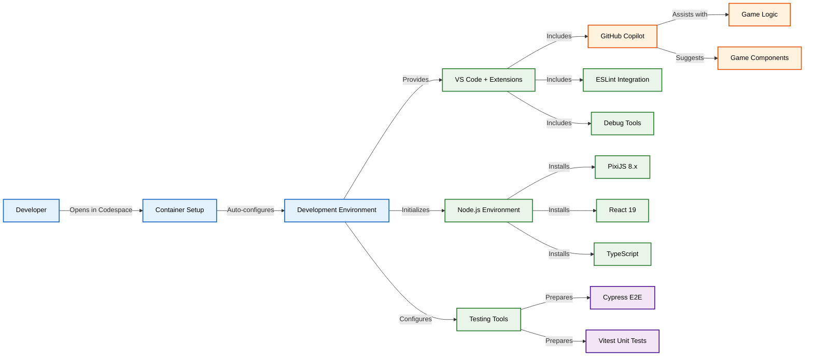
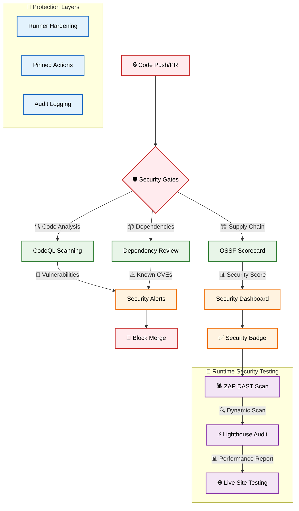
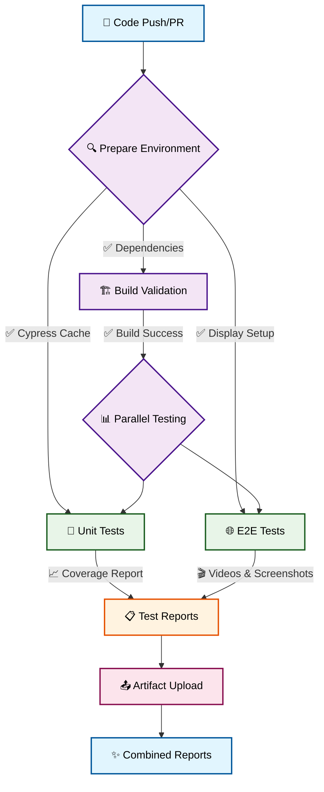
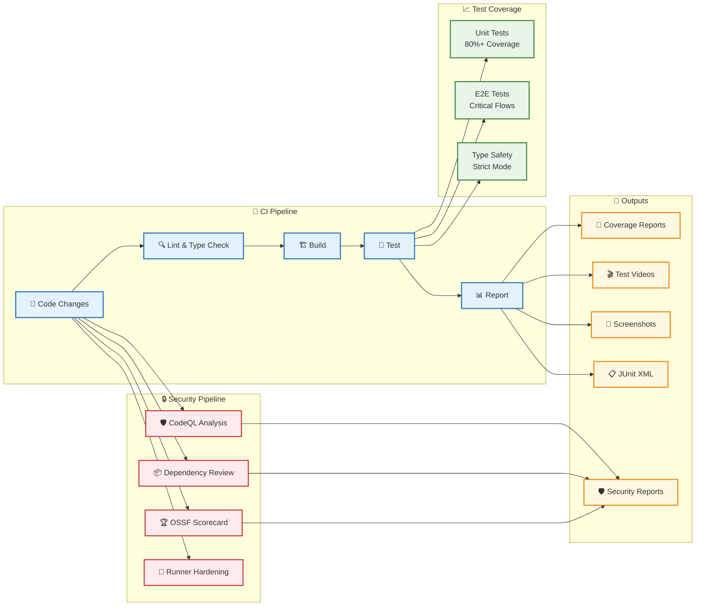
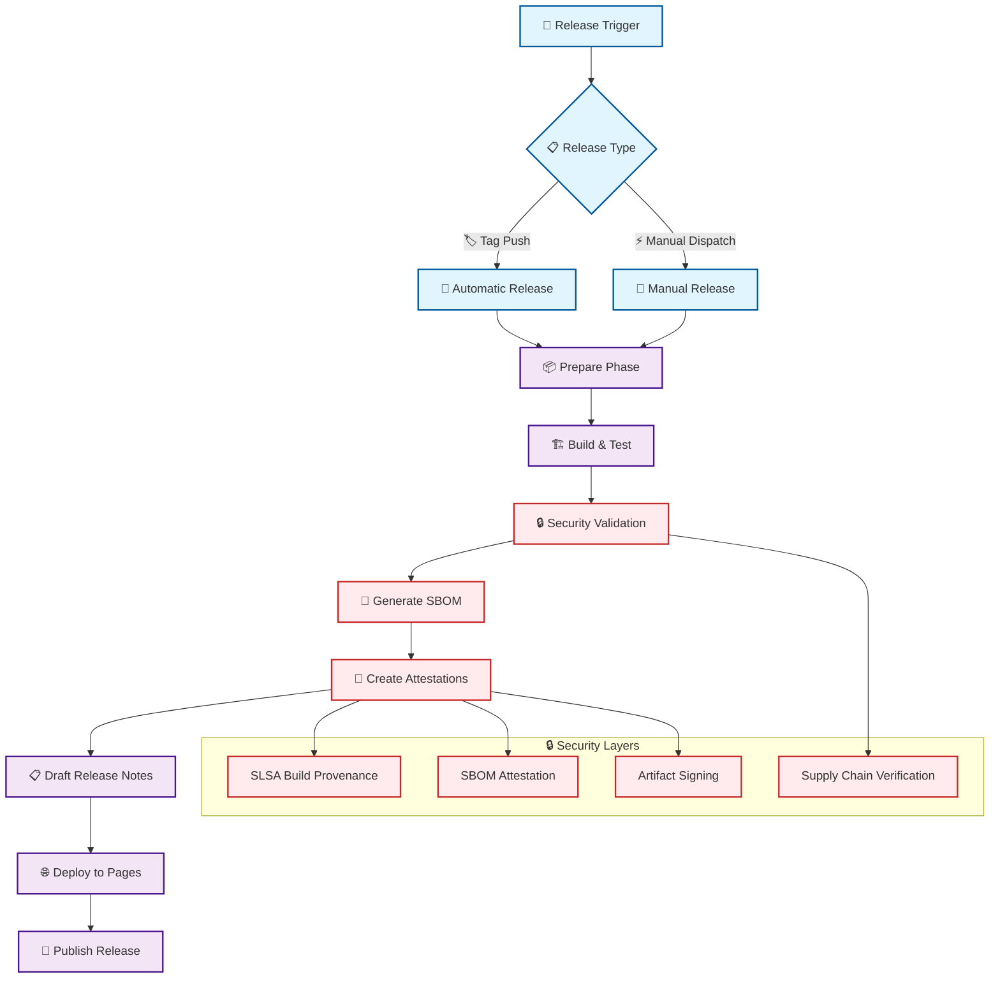
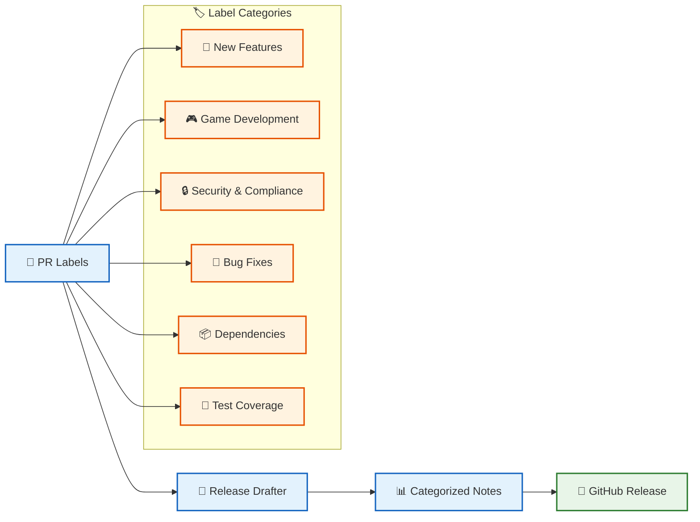
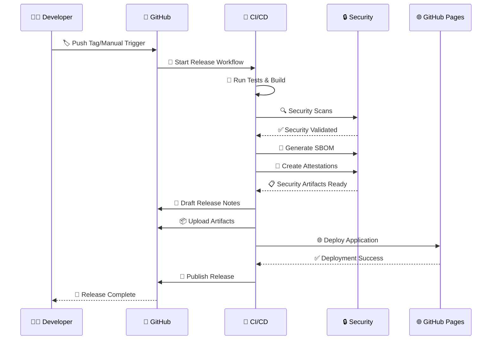

# 🔒 Security Features

This development guide describes comprehensive security measures implemented per Hack23 AB's [Secure Development Policy](https://github.com/Hack23/ISMS-PUBLIC/blob/main/Secure_Development_Policy.md) and [Vulnerability Management](https://github.com/Hack23/ISMS-PUBLIC/blob/main/Vulnerability_Management.md) procedures.

## 🔐 ISMS-Aligned Security Controls

Black Trigram implements security controls mandated by Hack23 AB's Information Security Management System (ISMS):

| **Security Domain** | **Controls Implemented** | **ISMS Policy Reference** |
|---------------------|-------------------------|---------------------------|
| **🛡️ Supply Chain Security** | OSSF Scorecard, Dependency Review, SLSA attestations | [Secure Development Policy](https://github.com/Hack23/ISMS-PUBLIC/blob/main/Secure_Development_Policy.md) |
| **🔍 Static Security Testing** | CodeQL SAST, SonarCloud quality gates | [Vulnerability Management](https://github.com/Hack23/ISMS-PUBLIC/blob/main/Vulnerability_Management.md) |
| **🕷️ Dynamic Security Testing** | OWASP ZAP DAST scanning | [Vulnerability Management](https://github.com/Hack23/ISMS-PUBLIC/blob/main/Vulnerability_Management.md) |
| **📦 Dependency Management** | Dependabot, SBOM generation, license compliance | [Open Source Policy](https://github.com/Hack23/ISMS-PUBLIC/blob/main/Open_Source_Policy.md) |
| **🔐 CI/CD Hardening** | SHA-pinned actions, runner hardening, audit logging | [Change Management](https://github.com/Hack23/ISMS-PUBLIC/blob/main/Change_Management.md) |
| **⚡ Performance Security** | Lighthouse audits, performance budgets | [Secure Development Policy](https://github.com/Hack23/ISMS-PUBLIC/blob/main/Secure_Development_Policy.md) |
| **🏆 Artifact Integrity** | Cryptographic signatures, build provenance | [Information Security Policy](https://github.com/Hack23/ISMS-PUBLIC/blob/main/Information_Security_Policy.md) |

## Security Implementation Details

- **🛡️ Supply Chain Security** - OSSF Scorecard analysis and dependency review
- **🔍 Static Analysis** - CodeQL scanning for vulnerabilities
- **📦 Dependency Protection** - Automated dependency vulnerability checks
- **🔐 Runner Hardening** - All CI/CD runners are hardened with audit logging
- **📋 Security Policies** - GitHub security advisories and vulnerability reporting
- **🏷️ Pinned Dependencies** - All GitHub Actions pinned to specific SHA hashes
- **📄 SBOM Generation** - Software Bill of Materials for transparency
- **🔏 Build Attestations** - Cryptographic proof of build integrity
- **🏆 Artifact Verification** - SLSA-compliant build provenance
- **🕷️ ZAP Security Scanning** - OWASP ZAP dynamic application security testing
- **⚡ Lighthouse Performance** - Automated performance and accessibility audits

## 🎯 Tech Stack (Q1 2026)

Black Trigram is built with modern web technologies optimized for 3D game development:

### Core Framework
- ⚛️ **React 19.2.3** - Modern React with hooks and concurrent features
- 🔷 **TypeScript 5.9.3** - Strict typing with latest ECMAScript standards
- ⚡ **Vite 7.x** - Next-generation frontend tooling with lightning-fast HMR
- 🎮 **Three.js 0.182.0** - WebGL-based 3D rendering library
- 🔮 **@react-three/fiber 9.5.0** - React renderer for Three.js
- 🎨 **@react-three/drei 10.7.7** - Useful helpers for React Three Fiber

### Testing Infrastructure
- 🧪 **Vitest 4.0.16** - Blazing fast unit test framework with coverage
- 🌲 **Cypress 15.8.2** - End-to-end testing with Chrome
- 🎯 **Testing Library 16.3.1** - React component testing utilities
- 📊 **Coverage v8** - Built-in code coverage via V8

### Development Tools
- 📦 **ESLint 9.x** - Modern linting with TypeScript support
- 🔄 **GitHub Actions** - Automated CI/CD pipelines
- 🔍 **TypeDoc 0.28.16** - API documentation generation
- 🎨 **Knip 5.x** - Find unused files, dependencies, and exports

### Korean Localization
- 🇰🇷 **Noto Sans KR** - Primary Korean font (Google Fonts)
- 🎭 **Bilingual UI** - Korean-English dual language support
- 📝 **Typography System** - Specialized constants for Korean text rendering

## Development Environment

This template includes a fully configured development environment:

- **🚀 GitHub Codespaces** - Zero-configuration development environment
- **🤖 GitHub Copilot** - AI-assisted development with code suggestions
- **💬 Copilot Chat** - In-editor AI assistance for debugging and explanations
- **🔧 VS Code Extensions** - Pre-configured extensions for game development
- **🔒 Secure Container** - Hardened development container with security features
- **🔌 MCP Servers** - Model Context Protocol servers for enhanced Copilot capabilities ([learn more](.github/COPILOT_MCP_SETUP.md))

### 🚀 Codespaces Setup

This repository is fully configured for GitHub Codespaces, providing:

- **One-click setup** - Start coding immediately with zero configuration
- **Pre-installed dependencies** - All tools and libraries ready to use
- **Configured test environment** - Cypress and Vitest ready to run
- **GitHub Copilot integration** - AI-powered code assistance with MCP servers
- **Optimized performance** - Container configured for game development
- **Enhanced AI capabilities** - MCP servers for GitHub, Playwright, filesystem, and sequential thinking

> 📖 **Learn more**: See [Copilot MCP Setup Guide](.github/COPILOT_MCP_SETUP.md) for detailed information about MCP server configuration and usage.



## Security Workflows



## Test & Report Workflow



## 🚀 Quick Start

### Prerequisites
- **Node.js**: v24.x (LTS)
- **npm**: v10.x (included with Node.js)
- **Git**: Latest version
- **Google Chrome**: For E2E testing (installed automatically in CI)

### Local Development Setup

```bash
# 1. Clone the repository
git clone https://github.com/Hack23/blacktrigram.git
cd blacktrigram

# 2. Install dependencies (uses exact versions from package-lock.json)
npm ci

# 3. Verify installation
npm run check     # TypeScript validation
npm run lint      # Code quality check

# 4. Start development server (opens at http://localhost:5173)
npm run dev

# Server will start with:
# - Hot Module Replacement (HMR) enabled
# - Host: 0.0.0.0 (accessible from network)
# - Port: 5173 (configurable in vite.config.ts)
```

### Using GitHub Codespaces

Black Trigram is fully configured for zero-setup cloud development:

1. Click the **Code** button on the repository
2. Select **Open with Codespaces**
3. Wait for container initialization (~2-3 minutes)
4. Start coding immediately with pre-configured environment

**Codespaces includes:**
- ✅ Node.js 24 pre-installed
- ✅ All dependencies pre-cached
- ✅ VS Code extensions configured
- ✅ GitHub Copilot integration with MCP servers
- ✅ Chrome and Cypress ready for testing
- ✅ Korean fonts (Noto Sans KR) pre-installed

> 📖 **Learn more**: See [Copilot MCP Setup Guide](.github/COPILOT_MCP_SETUP.md) for enhanced AI capabilities

## 🔧 Build Procedures

Black Trigram uses Vite 7 for blazing-fast development and optimized production builds.

### Development Build

```bash
# Start development server with hot reload
npm run dev

# Output:
# VITE v7.x ready in XXXms
# ➜ Local:   http://localhost:5173/
# ➜ Network: http://192.168.x.x:5173/
# ➜ press h + enter to show help

# Features enabled in development:
# - Hot Module Replacement (HMR)
# - Source maps for debugging
# - React Fast Refresh
# - Three.js dev warnings
# - Korean font loading diagnostics
```

### Production Build

```bash
# Standard production build
npm run build

# Build process:
# 1. TypeScript compilation (tsc -b)
# 2. Vite bundling with tree-shaking
# 3. Asset optimization (images, fonts)
# 4. CSS minification
# 5. Service worker version injection

# Output directory: dist/
# - dist/index.html
# - dist/assets/*.js (minified with 6-char hash)
# - dist/assets/*.css (single bundle)
# - dist/assets/images/ (optimized images)
# - dist/sw.js (service worker with version)

# Alternative build commands:
npm run build:analyze      # Build + bundle size analysis
npm run build:production   # Production with explicit NODE_ENV
npm run build:fast         # Incremental TypeScript build
npm run build:stats        # Build + detailed bundle statistics
```

### Preview Production Build

```bash
# Preview the production build locally
npm run preview

# Starts server at http://localhost:4173
# Mimics production environment:
# - Serves from dist/ directory
# - Production caching headers
# - Brotli/gzip compression
# - No HMR (production behavior)
```

### Build Optimization

The build is optimized for:
- **Bundle Size**: JavaScript ~180KB (minified+gzipped), Total ~500KB including all assets
- **Korean Text**: UTF-8 charset with Noto Sans KR
- **Three.js**: Tree-shaking for unused modules
- **Assets**: Inline small assets (<1KB), hash for caching
- **Performance**: Target 60fps in production

## 🧪 Testing Infrastructure

Black Trigram uses a comprehensive testing strategy aligned with Hack23 AB's [Secure Development Policy](https://github.com/Hack23/ISMS-PUBLIC/blob/main/Secure_Development_Policy.md).

### Unit Tests (Vitest)

Vitest 4.0 provides fast, modern unit testing with built-in coverage:

```bash
# Run all unit tests
npm test
# or
npm run test

# Run with coverage report
npm run coverage

# Run system-specific tests
npm run test:systems              # Combat system tests
npm run test:systems:watch        # Watch mode for development
npm run test:systems:ui           # Interactive UI mode
npm run test:systems:coverage     # Systems with coverage

# Run specific test files
npx vitest src/systems/CombatSystem.test.ts
npx vitest src/components/ui/
```

**Test Configuration** (`vitest.config.ts`):
- **Environment**: jsdom (DOM simulation)
- **Setup**: `src/test/test-setup.ts` (Audio/Three.js mocks)
- **Globals**: Enabled (describe, it, expect)
- **Timeout**: 10s (for complex combat calculations)
- **Reporters**: JUnit XML, HTML, console

**Coverage Thresholds** (per ISMS policy):
- **Systems**: 90% lines, 90% branches, 92% functions
- **Overall Target**: 80% lines, 70% branches (long-term)
- **Reports**: `build/coverage/index.html`

### End-to-End Tests (Cypress)

Cypress 15.8 provides reliable browser-based E2E testing:

```bash
# Run all E2E tests (headless Chrome)
npm run test:e2e

# Run specific E2E test suites
npm run test:e2e:screens          # Screen-specific tests
npm run test:e2e:smoke            # Critical path tests (app.cy.ts, game-journey.cy.ts)
npm run test:e2e:webgl            # WebGL/Three.js verification

# CI variants (headless mode)
npm run test:e2e:ci               # All E2E tests for CI
npm run test:e2e:screens:ci       # Screen tests for CI
npm run test:e2e:smoke:ci         # Smoke tests for CI
```

**Test Configuration** (`cypress.config.ts`):
- **Base URL**: http://localhost:5173
- **Browser**: Chrome (with WebGL SwiftShader)
- **Viewport**: 1280x800 (desktop), 375x667 (mobile)
- **Retries**: 1 in CI, 0 in development
- **Video**: Enabled (saved only on failure)
- **Screenshots**: On failure

**Three.js Optimizations**:
```javascript
// Browser launch flags for WebGL rendering:
--enable-unsafe-swiftshader       // Software rendering
--enable-webgl-draft-extensions   // Draft WebGL features
--max-gum-fps=60                  // Cap at 60fps
--js-flags=--max-old-space-size=4096  // 4GB heap
```

**E2E Test Reports**:
- **JUnit XML**: `build/cypress/junit/*.xml`
- **Mochawesome HTML**: `build/cypress/mochawesome/index.html`
- **Videos**: `build/cypress/videos/` (failures only)
- **Screenshots**: `build/cypress/screenshots/`

### Test Strategy

**1. Unit Tests** (Vitest):
- ✅ Combat system logic
- ✅ Damage calculations
- ✅ Korean text utilities
- ✅ Component rendering
- ✅ Audio system mocks
- ✅ Three.js scene setup

**2. E2E Tests** (Cypress):
- ✅ Full user journeys
- ✅ Screen navigation
- ✅ WebGL/Three.js rendering
- ✅ Korean text display
- ✅ Audio playback
- ✅ Touch controls (mobile)
- ✅ 60fps performance validation

**3. Performance Tests** (Lighthouse):
- ✅ Lighthouse CI workflow (`.github/workflows/lighthouse-performance.yml`)
- ✅ Performance budget monitoring (`budget.json`)
- ✅ 60fps Three.js rendering validation
- ✅ Core Web Vitals tracking

### Test Documentation

See comprehensive test plans:
- 📘 [Unit Test Plan](./UnitTestPlan.md) - Unit testing strategy
- 📘 [E2E Test Plan](./E2ETestPlan.md) - End-to-end testing strategy
- 📘 [Screen-Specific E2E Strategy](./cypress/e2e/screens/README.md) - Per-screen Cypress E2E testing approach

### CI/CD Pipeline



**GitHub Actions Workflows**:

1. **Test & Report** (`.github/workflows/test-and-report.yml`)
   - Triggers: Push to main, Pull requests
   - Jobs: Prepare → Build → Unit Tests → E2E Tests → Coverage
   - Artifacts: Test reports, coverage, screenshots, videos

2. **CodeQL Security** (`.github/workflows/codeql.yml`)
   - Triggers: Push, Pull requests, Schedule (weekly)
   - Analysis: JavaScript/TypeScript SAST
   - Output: Security alerts in GitHub Security tab

3. **OSSF Scorecard** (`.github/workflows/scorecards.yml`)
   - Triggers: Push to main, Schedule (weekly)
   - Checks: Supply chain security best practices
   - Badge: Public security score

4. **Lighthouse Performance** (`.github/workflows/lighthouse-performance.yml`)
   - Triggers: Push, Pull requests
   - Tests: Performance, Accessibility, Best Practices, SEO
   - Budget: Monitored via `budget.json`

5. **OWASP ZAP** (`.github/workflows/zap-scan.yml`)
   - Triggers: Push, Pull requests
   - Scan: Dynamic application security testing (DAST)
   - Report: Vulnerability findings

**Security Gates**:
- ✅ All GitHub Actions pinned to SHA hashes (supply chain security)
- ✅ Runner hardening with StepSecurity
- ✅ Required status checks before merge
- ✅ Automated dependency updates (Dependabot)
- ✅ License compliance checks

### Performance Testing

Black Trigram targets 60fps for all Three.js rendering:

**1. Lighthouse CI** (Automated)
```bash
# Triggered automatically in CI pipeline
# Manual run via GitHub Actions workflow dispatch
```

**Performance Budget Thresholds** (from `budget.json`):
- 🎯 **Time to Interactive (TTI)**: <6.0s
- 🎯 **First Contentful Paint (FCP)**: <3.5s
- 🎯 **Largest Contentful Paint (LCP)**: <4.0s
- 🎯 **Total Blocking Time (TBT)**: <1.6s
- 🎯 **Cumulative Layout Shift (CLS)**: <0.1
- 🎯 **Speed Index**: <5.0s

**Target Goals** (stricter than CI budgets):
- ⭐ **Performance Score**: >90 (Lighthouse)
- ⭐ **FCP Target**: <1.8s (best practice)
- ⭐ **LCP Target**: <2.5s (best practice)
- ⭐ **TBT Target**: <300ms (best practice)

**2. Manual FPS Validation**
```bash
# Run performance E2E test
npm run test:e2e -- --spec "cypress/e2e/performance-threejs.cy.ts"

# Validates:
# - 60fps during idle scenes
# - Minimum 30fps during intense combat
# - Frame time < 16.67ms (60fps)
# - No frame drops during animations
```

**3. Performance Budget Monitoring**

Budget configuration in `budget.json`:

```json
// Actual budget.json values
{
  "timings": [
    {
      "metric": "interactive",
      "budget": 6000        // 6s - Time to Interactive
    },
    {
      "metric": "first-contentful-paint",
      "budget": 3500        // 3.5s
    },
    {
      "metric": "largest-contentful-paint",
      "budget": 4000        // 4s
    },
    {
      "metric": "total-blocking-time",
      "budget": 1600        // 1.6s
    },
    {
      "metric": "speed-index",
      "budget": 5000        // 5s
    }
  ],
  "resourceSizes": [
    {
      "resourceType": "script",
      "budget": 180         // 180KB (minified+gzipped)
    },
    {
      "resourceType": "total",
      "budget": 500         // 500KB total
    }
  ]
}
```

**Note**: CI budgets are lenient to account for slower CI environments. Aim for the stricter target goals listed above in development.

**Performance Optimization Tools**:
- `npm run build:analyze` - Bundle size visualization
- `npm run build:stats` - Detailed bundle statistics (Vite build analysis)
- Chrome DevTools Performance profiler
- Three.js stats panel (development mode)

**See Also**: Lighthouse CI workflow and `budget.json` performance budget configuration.

## 🇰🇷 Korean Font Development

Black Trigram uses **Noto Sans KR** for authentic Korean typography in a cyberpunk aesthetic.

### Font Configuration

**Primary Font Stack** (`src/types/constants/typography.ts`):
```typescript
export const FONT_FAMILY = {
  PRIMARY: '"Noto Sans KR", "Malgun Gothic", Arial, sans-serif',
  SECONDARY: '"Nanum Gothic", Arial, sans-serif',
  MONO: '"Nanum Gothic Coding", monospace',
  KOREAN_BATTLE: '"Noto Sans KR", Impact, sans-serif',
  CYBER: '"Orbitron", "Noto Sans KR", monospace',
  SYMBOL: '"Arial Unicode MS", Arial, sans-serif',
  KOREAN: '"Noto Sans KR", "Malgun Gothic", Arial, sans-serif',
} as const;
```

**Font Loading** (`index.html`):
```html
<!-- Noto Sans KR loaded from Google Fonts -->
<link rel="preconnect" href="https://fonts.googleapis.com">
<link rel="preconnect" href="https://fonts.gstatic.com" crossorigin>
<link href="https://fonts.googleapis.com/css2?family=Noto+Sans+KR:wght@400;700&display=swap" rel="stylesheet">
```

### Bilingual Text Patterns

**Component Pattern**:
```typescript
interface BilingualTextProps {
  korean: string;
  english: string;
  fontSize?: number;
  fontWeight?: number;
}

// Usage in Three.js Html overlays
<Html center position={[0, 2, 0]}>
  <div style={{
    fontSize: 18,
    color: KOREAN_COLORS.ACCENT_GOLD,
    fontFamily: FONT_FAMILY.KOREAN,
    fontWeight: 'bold',
  }}>
    {korean} | {english}
  </div>
</Html>
```

**Text Size Guidelines**:
- **Titles**: 36px Korean, 32px English
- **Subtitles**: 28px Korean, 24px English
- **Body**: 16px Korean, 14px English
- **Small**: 12px Korean, 10px English

**Font Weights** (currently loaded):
- **Regular**: 400 (body text, default weight)
- **Bold**: 700 (titles, important UI)

> **Note**: Only weights 400 and 700 are currently loaded from Google Fonts for Noto Sans KR to optimize page load performance. If you need additional weights (e.g., 300 Light, 500 Medium, 600 Semibold, 900 Heavy), update the font import in `index.html`, but be aware this will increase initial page load size by ~20-30KB per weight.

### Testing Korean Text

**Unit Tests**:
```bash
# Test Korean text utilities
npx vitest src/utils/koreanTextHelpers.test.ts

# Test bilingual components
npx vitest src/components/ui/base/BilingualText.test.tsx
```

**E2E Tests**:
```bash
# Verify Korean text rendering in all screens
npm run test:e2e:screens
```

**Manual Verification**:
1. Start dev server: `npm run dev`
2. Check text rendering in different screens
3. Verify font fallback on systems without Noto Sans KR
4. Test on mobile devices (iOS Safari, Android Chrome)

### Korean Localization Checklist

When adding new text:
- ✅ Use `FONT_FAMILY.KOREAN` from constants
- ✅ Provide both Korean and English text
- ✅ Follow bilingual text pattern: `"한글 | English"`
- ✅ Use appropriate font weights (bold for titles)
- ✅ Test on various screen sizes
- ✅ Verify accessibility (contrast, readability)
- ✅ Add `data-testid` for E2E testing

### Common Issues

**Issue**: Korean text not displaying
- **Solution**: Check `index.html` has Google Fonts link
- **Solution**: Verify font family in component styles
- **Solution**: Clear browser cache and reload

**Issue**: Korean text too small/large
- **Solution**: Use `KOREAN_TEXT_SIZES` constants
- **Solution**: Adjust based on viewport (`isMobile` flag)

**Issue**: Font loading slow
- **Solution**: Use `font-display: swap` in Google Fonts URL
- **Solution**: Preload critical fonts in `index.html`

## 🛠️ Development Workflows

### Daily Development

```bash
# 1. Start development
npm run dev

# 2. Make changes to code
# - Files auto-reload via HMR
# - TypeScript errors shown in terminal
# - Console errors shown in browser

# 3. Run tests frequently
npm test                    # Unit tests
npm run test:e2e:smoke      # Quick E2E validation

# 4. Check code quality
npm run check               # TypeScript errors
npm run lint                # ESLint warnings

# 5. Commit changes (follow conventional commits)
git add .
git commit -m "feat: add new combat technique"
git push
```

### Before Creating PR

```bash
# 1. Run all checks
npm run check
npm run lint
npm test
npm run coverage

# 2. Build production bundle
npm run build

# 3. Preview production build
npm run preview

# 4. Run E2E tests
npm run test:e2e

# 5. Check for unused code
npm run find:unused

# 6. Verify license compliance
npm run test:licenses
```

### Common Commands Reference

| Command | Purpose | When to Use |
|---------|---------|-------------|
| `npm run dev` | Start dev server | Daily development |
| `npm run build` | Production build | Before deployment |
| `npm run preview` | Preview prod build | Test production locally |
| `npm run check` | TypeScript check | Before commit |
| `npm run lint` | Lint code | Before commit |
| `npm test` | Unit tests | After code changes |
| `npm run coverage` | Test coverage | Before PR |
| `npm run test:e2e` | E2E tests | Before PR |
| `npm run test:systems` | Combat tests | Combat system changes |
| `npm run docs` | Generate API docs | After API changes |
| `npm run find:unused` | Find dead code | Code cleanup |
| `npm run test:licenses` | License check | Adding dependencies |

## 🔧 Troubleshooting

### Build Issues

**Issue**: `npm ci` fails with dependency errors
```bash
# Solution 1: Clear npm cache
npm cache clean --force
rm -rf node_modules package-lock.json
npm install

# Solution 2: Use exact Node.js version
nvm install 24
nvm use 24
npm ci
```

**Issue**: TypeScript compilation errors
```bash
# Check for errors
npm run check

# Common fixes:
# - Update import paths
# - Add missing type definitions
# - Check tsconfig.json settings
```

**Issue**: Vite build fails
```bash
# Check vite.config.ts for syntax errors
# Clear .vite cache
rm -rf node_modules/.vite
npm run build
```

### Test Issues

**Issue**: Vitest tests fail with import errors
```bash
# Solution: Check vitest.config.ts aliases
# Verify test setup file: src/test/test-setup.ts
```

**Issue**: Cypress tests timeout
```bash
# Solution 1: Increase timeout in cypress.config.ts
# Solution 2: Check dev server is running (npm run dev)
# Solution 3: Clear Cypress cache
npx cypress cache clear
npm run cypress:install
```

**Issue**: Three.js WebGL errors in tests
```bash
# Solution: Verify Chrome is installed
google-chrome --version

# Solution: Check browser flags in cypress.config.ts
# --enable-unsafe-swiftshader flag enables software rendering
```

### Performance Issues

**Issue**: Dev server slow to start
```bash
# Solution 1: Clear cache
rm -rf node_modules/.vite
npm run dev

# Solution 2: Reduce optimizeDeps in vite.config.ts
# Solution 3: Use build:fast for incremental builds
npm run build:fast
```

**Issue**: Low FPS in Three.js scenes
```bash
# Solution 1: Check browser DevTools Performance tab
# Solution 2: Reduce particle counts
# Solution 3: Use instancing for repeated geometries
# Solution 4: Enable hardware acceleration in browser
```

**Issue**: Large bundle size
```bash
# Analyze bundle
npm run build:analyze

# Common causes:
# - Unused Three.js modules (check tree-shaking)
# - Large assets not optimized
# - Duplicate dependencies
```

### Korean Font Issues

**Issue**: Korean characters show as boxes (□)
```bash
# Solution 1: Check Google Fonts link in index.html
# Solution 2: Verify font-family in CSS
# Solution 3: Check browser console for font loading errors
```

**Issue**: Korean text rendering quality poor
```bash
# Solution: Use appropriate font weights (400-700)
# Solution: Add -webkit-font-smoothing: antialiased
# Solution: Ensure UTF-8 charset in HTML
```

### IDE/Editor Issues

**Issue**: VS Code TypeScript errors not updating
```bash
# Solution: Restart TypeScript server
# CMD/CTRL + Shift + P → "TypeScript: Restart TS Server"
```

**Issue**: ESLint not working in VS Code
```bash
# Solution: Install ESLint extension
# Solution: Check .vscode/settings.json
# Solution: Run: eslint --init (if missing config)
```

**Issue**: GitHub Copilot not suggesting Korean text
```bash
# Solution: Add Korean context in comments
# Example: // 한글 텍스트: "안녕하세요"
# Solution: Use bilingual variable names when appropriate
```

### Environment Issues

**Issue**: Different behavior in CI vs local
```bash
# Solution 1: Check Node.js version matches (v24)
node --version

# Solution 2: Use npm ci instead of npm install
npm ci

# Solution 3: Check environment variables
cat .env.production
```

**Issue**: Codespaces environment not working
```bash
# Solution 1: Rebuild container
# CMD/CTRL + Shift + P → "Codespaces: Rebuild Container"

# Solution 2: Check .devcontainer/devcontainer.json
# Solution 3: Verify MCP servers in .github/copilot-mcp.json
```

## 📚 Additional Resources

### Documentation

- **Architecture**: [ARCHITECTURE.md](./ARCHITECTURE.md) - System design and C4 models
- **Combat System**: [COMBAT_ARCHITECTURE.md](./COMBAT_ARCHITECTURE.md) - Combat mechanics
- **Game Design**: [game-design.md](./game-design.md) - Game mechanics and archetypes
- **Controls**: [CONTROLS.md](./CONTROLS.md) - Input system documentation
- **API Docs**: [https://hack23.github.io/blacktrigram/](https://hack23.github.io/blacktrigram/) - TypeDoc API reference

### Testing

- **Unit Tests**: [UnitTestPlan.md](./UnitTestPlan.md) - Unit testing strategy
- **E2E Tests**: [E2ETestPlan.md](./E2ETestPlan.md) - End-to-end testing strategy
- **Screen Tests**: [cypress/e2e/screens/README.md](./cypress/e2e/screens/README.md) - Per-screen approach

### Contributing

- **Contributing Guide**: [CONTRIBUTING.md](./CONTRIBUTING.md) - How to contribute
- **Code of Conduct**: [CODE_OF_CONDUCT.md](./CODE_OF_CONDUCT.md) - Community guidelines
- **Security Policy**: [SECURITY.md](./SECURITY.md) - Vulnerability reporting

### Security

- **ISMS Policies**: [https://github.com/Hack23/ISMS-PUBLIC](https://github.com/Hack23/ISMS-PUBLIC)
- **Security Architecture**: [SECURITY_ARCHITECTURE.md](./SECURITY_ARCHITECTURE.md)
- **Threat Model**: [THREAT_MODEL.md](./THREAT_MODEL.md)
- **CRA Assessment**: [CRA-ASSESSMENT.md](./CRA-ASSESSMENT.md)

### GitHub Resources

- **GitHub Actions**: [.github/workflows/](./.github/workflows/)
- **Copilot Setup**: [.github/COPILOT_MCP_SETUP.md](./.github/COPILOT_MCP_SETUP.md)
- **Custom Agents**: [.github/agents/README.md](./.github/agents/README.md)

### Release Flow



### 🏷️ Release Types

#### Automatic Releases (Tag-based)

```bash
# Create and push a tag to trigger automatic release
git tag v1.0.0
git push origin v1.0.0
```

#### Manual Releases (Workflow Dispatch)

- Navigate to **Actions** → **Build, Attest and Release**
- Click **Run workflow**
- Specify version (e.g., `v1.0.1`) and pre-release status
- The workflow handles version bumping and tagging automatically

### 📋 Automated Release Notes

Release notes are automatically generated using semantic labeling:



#### Release Note Categories

- **🚀 New Features** - Major feature additions
- **🎮 Game Development** - Game logic, graphics, audio improvements
- **🎨 UI/UX Improvements** - Interface and design updates
- **🏗️ Infrastructure & Performance** - Build and performance optimizations
- **🔄 Code Quality & Refactoring** - Code improvements and testing
- **🔒 Security & Compliance** - Security updates and fixes
- **📝 Documentation** - Documentation improvements
- **📦 Dependencies** - Dependency updates
- **🐛 Bug Fixes** - Bug fixes and patches

### 🔒 Security Attestations & SBOM

#### Software Bill of Materials (SBOM)

Every release includes a comprehensive SBOM in SPDX format:

```json
{
  "SPDXID": "SPDXRef-DOCUMENT",
  "name": "game-v1.0.0",
  "packages": [
    {
      "SPDXID": "SPDXRef-Package-react",
      "name": "react",
      "versionInfo": "19.1.0",
      "licenseConcluded": "MIT"
    }
  ]
}
```

#### Build Provenance Attestations

SLSA-compliant build attestations provide cryptographic proof:

```json
{
  "_type": "https://in-toto.io/Statement/v0.1",
  "predicateType": "https://slsa.dev/provenance/v0.2",
  "subject": [
    {
      "name": "game-v1.0.0.zip",
      "digest": {
        "sha256": "abc123..."
      }
    }
  ],
  "predicate": {
    "builder": {
      "id": "https://github.com/actions/runner"
    },
    "buildType": "https://github.com/actions/workflow@v1"
  }
}
```

#### Verification Commands

```bash
# Verify build provenance
gh attestation verify game-v1.0.0.zip \
  --owner Hack23 --repo game

# Verify SBOM attestation
gh attestation verify game-v1.0.0.zip \
  --owner Hack23 --repo game \
  --predicate-type https://spdx.dev/Document
```

### 📦 Release Artifacts

Each release includes multiple artifacts with full traceability:

```
📦 Release v1.0.0
├── 🎮 game-v1.0.0.zip                    # Built application
├── 📄 game-v1.0.0.spdx.json             # Software Bill of Materials
├── 🔏 game-v1.0.0.zip.intoto.jsonl      # Build provenance attestation
└── 📋 game-v1.0.0.spdx.json.intoto.jsonl # SBOM attestation
```

### 🌐 Deployment Pipeline



### 🔐 Security Compliance

#### OSSF Scorecard Integration

- **Automated scoring** of supply chain security practices
- **Public transparency** with security badge
- **Continuous monitoring** of security posture

#### Supply Chain Protection

- **Pinned dependencies** - All GitHub Actions pinned to SHA hashes
- **Dependency scanning** - Automated vulnerability detection
- **SLSA compliance** - Build integrity and provenance
- **Signed artifacts** - Cryptographic verification of releases

### 📊 Release Metrics

Track release quality and security with built-in metrics:

- **🔒 Security Score** - OSSF Scorecard rating
- **📈 Test Coverage** - Unit and E2E test coverage
- **🏷️ Vulnerability Count** - Known security issues
- **📦 Dependency Health** - Outdated/vulnerable dependencies
- **🚀 Build Success Rate** - CI/CD pipeline reliability


All security workflows will automatically protect your game from common vulnerabilities and supply chain attacks, while providing full transparency through SBOM and attestations.

---

## 📚 Related Documents

### 🔐 ISMS Policies
- [🛠️ Secure Development Policy](https://github.com/Hack23/ISMS-PUBLIC/blob/main/Secure_Development_Policy.md) - Security-integrated SDLC standards
- [🔍 Vulnerability Management](https://github.com/Hack23/ISMS-PUBLIC/blob/main/Vulnerability_Management.md) - Security testing procedures
- [🔓 Open Source Policy](https://github.com/Hack23/ISMS-PUBLIC/blob/main/Open_Source_Policy.md) - Open source governance and licensing
- [📝 Change Management](https://github.com/Hack23/ISMS-PUBLIC/blob/main/Change_Management.md) - Risk-controlled change processes
- [🔐 Information Security Policy](https://github.com/Hack23/ISMS-PUBLIC/blob/main/Information_Security_Policy.md) - Overall security governance

### 🛡️ Black Trigram Security Documentation
- [🛡️ Security Architecture](./SECURITY_ARCHITECTURE.md) - Current security implementation
- [🔮 Future Security Architecture](./FUTURE_SECURITY_ARCHITECTURE.md) - Planned security enhancements
- [🎯 Threat Model](./THREAT_MODEL.md) - STRIDE analysis and attack trees
- [📋 CRA Assessment](./CRA-ASSESSMENT.md) - EU Cyber Resilience Act compliance
- [🔒 Security Policy](./SECURITY.md) - Vulnerability reporting
- [🗺️ ISMS Reference Mapping](./ISMS_REFERENCE_MAPPING.md) - Complete ISMS policy mapping
- [🔄 Workflows](./WORKFLOWS.md) - Security-hardened CI/CD pipelines

### 🧪 Testing Documentation
- [🧪 Unit Test Plan](./UnitTestPlan.md) - Comprehensive unit testing strategy
- [🎯 E2E Test Plan](./E2ETestPlan.md) - End-to-end testing documentation
- [⚡ Lighthouse Performance](./budget.json) - Performance budget configuration

### 🏗️ Architecture Documentation
- [📐 Architecture](./ARCHITECTURE.md) - Overall system design
- [⚔️ Combat Architecture](./COMBAT_ARCHITECTURE.md) - Combat system implementation

---

---

**📋 Document Control:**  
**✅ Approved by:** James Pether Sörling, CEO  
**📤 Distribution:** Public  
**🏷️ Classification:** [](https://github.com/Hack23/ISMS-PUBLIC/blob/main/CLASSIFICATION.md#confidentiality-levels) [](https://github.com/Hack23/ISMS-PUBLIC/blob/main/CLASSIFICATION.md#integrity-levels) [](https://github.com/Hack23/ISMS-PUBLIC/blob/main/CLASSIFICATION.md#availability-levels)  
**📅 Last Updated:** 2026-01-13 (Q1 2026 Update)  
**⏰ Next Review:** 2026-04-13  
**🎯 Framework Compliance:** [](https://github.com/Hack23/ISMS-PUBLIC/blob/main/CLASSIFICATION.md) [](https://github.com/Hack23/ISMS-PUBLIC/blob/main/CLASSIFICATION.md) [](https://github.com/Hack23/ISMS-PUBLIC/blob/main/CLASSIFICATION.md)

---

**🎮 Happy Developing!** Build amazing Korean martial arts experiences with Black Trigram! 🥋✨
