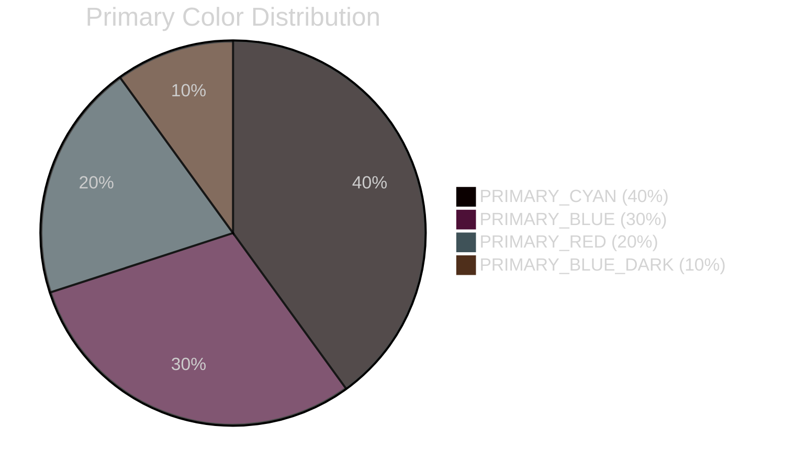
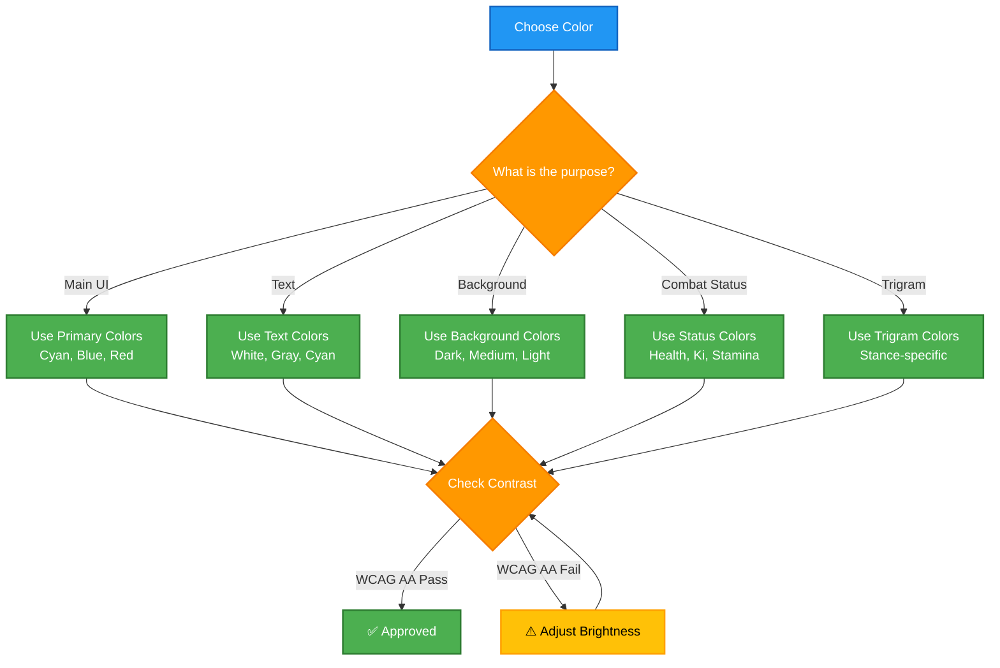
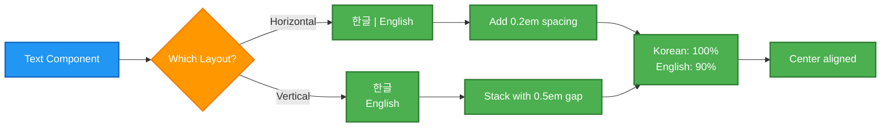
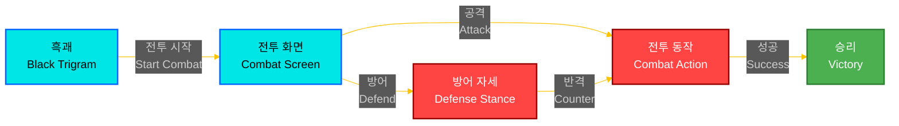

<p align="center">
  
</p>

<h1 align="center">🎨 Black Trigram — Korean Theming Guide</h1>

<p align="center">
  <strong>🇰🇷 Cyberpunk Korean Aesthetic Standards</strong><br>
  <em>🎯 Color Palette, Typography, and Visual Design System</em>
</p>

<p align="center">
  <a href="#"></a>
  <a href="#"></a>
  <a href="#"></a>
  <a href="#"></a>
</p>

**📋 Document Owner:** Design Team | **📄 Version:** 1.0 | **📅 Last Updated:** 2026-01-01 (UTC)  
**🔄 Review Cycle:** Quarterly | **⏰ Next Review:** 2026-04-01

---

## 🎯 **Purpose**

This guide defines the complete **Korean cyberpunk aesthetic system** for Black Trigram, combining traditional Korean design principles (오방색 - Five Directional Colors) with modern cyberpunk neon aesthetics to create a unique, culturally respectful, and visually striking interface.

---

## 🎨 **Color Palette**

### **Primary Cyberpunk Colors (사이버펑크 네온 색상)**

```typescript
// Primary UI colors - Neon cyberpunk aesthetic
export const PRIMARY_COLORS = {
  PRIMARY_CYAN: 0x00e6e6,      // 네온 시안 - Main UI accent
  PRIMARY_BLUE: 0x0066ff,      // 네온 파랑 - Interactive elements
  PRIMARY_BLUE_DARK: 0x003399, // 어두운 파랑 - Hover states
  PRIMARY_RED: 0xff4444,       // 네온 빨강 - Danger/warnings
};
```

**Visual Examples:**



### **Secondary Colors (보조 색상)**

```typescript
// Secondary accent colors
export const SECONDARY_COLORS = {
  SECONDARY_MAGENTA: 0xff33ff,  // Bright magenta for vital points
  SECONDARY_PURPLE: 0xaa44ff,   // Purple for special effects
  SECONDARY_YELLOW: 0xffff33,   // Yellow for highlights
  SECONDARY_ORANGE: 0xff7733,   // Orange for warnings
  SECONDARY_BROWN_DARK: 0x8b4513, // Dark brown for earth tones
};
```

### **Korean Traditional Colors (오방색 - Five Directional Colors)**

Traditional Korean philosophy associates colors with cardinal directions:

```typescript
// Traditional Korean directional colors
export const CARDINAL_COLORS = {
  EAST: 0x00ff88,   // 동방 청색 (Blue-Green) - Spring, Wood element
  WEST: 0xffffff,   // 서방 백색 (White) - Autumn, Metal element
  SOUTH: 0xff4444,  // 남방 적색 (Red) - Summer, Fire element
  NORTH: 0x000000,  // 북방 흑색 (Black) - Winter, Water element
  CENTER: 0xffc400, // 중앙 황색 (Yellow) - Earth element
};
```

**Cultural Context:**
- **동방 (East)**: Associated with spring, growth, and renewal
- **서방 (West)**: Associated with autumn, harvest, and completion
- **남방 (South)**: Associated with summer, energy, and passion
- **북방 (North)**: Associated with winter, rest, and wisdom
- **중앙 (Center)**: Associated with balance, stability, and harmony

### **UI Background Colors (배경 색상)**

```typescript
// Dark backgrounds for cyberpunk aesthetic
export const BACKGROUND_COLORS = {
  UI_BACKGROUND_DARK: 0x0a0a0a,    // Very dark - maximum contrast
  UI_BACKGROUND_MEDIUM: 0x1a1a1a,  // Dark gray - panels
  UI_BACKGROUND_LIGHT: 0x2a2a2a,   // Medium dark - cards
  UI_BORDER: 0x5a6578,             // Border color - 3:1 contrast
  UI_BORDER_LIGHT: 0x6a6a8a,       // Light border - hover states
};
```

### **Text Colors (텍스트 색상) - WCAG AA Compliant**

All text colors meet **4.5:1 contrast ratio** on dark backgrounds:

```typescript
// Text colors with accessibility compliance
export const TEXT_COLORS = {
  TEXT_PRIMARY: 0xffffff,    // White - 20.3:1 contrast
  TEXT_SECONDARY: 0xcccccc,  // Light gray - 13.1:1 contrast
  TEXT_TERTIARY: 0xaaaaaa,   // Medium gray - 8.5:1 contrast
  TEXT_ACCENT: 0x00e6e6,     // Cyan - 15.8:1 contrast
  TEXT_WARNING: 0xffbb00,    // Warning - 13.4:1 contrast
  TEXT_ERROR: 0xff4444,      // Error - 8.2:1 contrast
};
```

### **Trigram Stance Colors (팔괘 색상)**

Each of the Eight Trigrams (팔괘) has unique color representation:

```typescript
// Eight Trigram stance colors
export const TRIGRAM_COLORS = {
  GEON_PRIMARY: 0xffd700,   // ☰ 건 (Heaven) - Gold
  TAE_PRIMARY: 0x87ceeb,    // ☱ 태 (Lake) - Sky Blue
  LI_PRIMARY: 0xff4500,     // ☲ 리 (Fire) - Orange Red
  JIN_PRIMARY: 0x9370db,    // ☳ 진 (Thunder) - Medium Purple
  SON_PRIMARY: 0x32cd32,    // ☴ 손 (Wind) - Lime Green
  GAM_PRIMARY: 0x1e90ff,    // ☵ 감 (Water) - Dodger Blue
  GAN_PRIMARY: 0x8b4513,    // ☶ 간 (Mountain) - Saddle Brown
  GON_PRIMARY: 0x2f4f4f,    // ☷ 곤 (Earth) - Dark Slate Gray
};
```

### **Combat Status Colors (전투 상태 색상)**

```typescript
// Health bar colors with thresholds
export const HEALTH_COLORS = {
  HEALTH_FULL: 0x00ff00,      // Green - 100-75%
  HEALTH_MEDIUM: 0xffff00,    // Yellow - 75-50%
  HEALTH_LOW: 0xff6600,       // Orange - 50-25%
  HEALTH_CRITICAL: 0xff0000,  // Red - <25%
};

// Ki (energy) colors
export const KI_COLORS = {
  KI_FULL: 0x00ffff,      // Cyan - full energy
  KI_MEDIUM: 0x0099cc,    // Medium cyan
  KI_LOW: 0x006699,       // Dark cyan
  KI_EMPTY: 0x003366,     // Very dark cyan
};

// Stamina colors
export const STAMINA_COLORS = {
  STAMINA_FULL: 0xffff00,      // Yellow - full stamina
  STAMINA_MEDIUM: 0xffcc00,    // Gold
  STAMINA_LOW: 0xff9900,       // Orange
  STAMINA_EMPTY: 0xff6600,     // Dark orange
};
```

### **Combat Effect Colors (전투 효과 색상)**

```typescript
// Visual feedback for combat actions
export const COMBAT_EFFECT_COLORS = {
  CRITICAL_HIT: 0xff4444,       // Bright red - critical strikes
  BLOCKED_ATTACK: 0x909090,     // Gray - blocked attacks
  PERFECT_STRIKE: 0xffc400,     // Gold - perfect timing
  VITAL_POINT_HIT: 0xff33ff,    // Magenta - vital point strikes
  CONSCIOUSNESS_PURPLE: 0x9370db, // Purple - consciousness level
  PAIN_INDICATOR: 0xff6b6b,     // Light red - pain feedback
  BLOODLOSS_INDICATOR: 0xcc0000, // Dark red - blood loss
};
```

### **Color Usage Guidelines**



---

## ✍️ **Typography System**

### **Font Families (글꼴)**

```typescript
// Korean and English font stacks
export const FONT_FAMILY = {
  PRIMARY: '"Noto Sans KR", "Malgun Gothic", Arial, sans-serif',
  SECONDARY: '"Nanum Gothic", Arial, sans-serif',
  MONO: '"Nanum Gothic Coding", monospace',
  KOREAN_BATTLE: '"Noto Sans KR", Impact, sans-serif',
  CYBER: '"Orbitron", "Noto Sans KR", monospace',
  SYMBOL: '"Arial Unicode MS", Arial, sans-serif',
  KOREAN: '"Noto Sans KR", "Malgun Gothic", Arial, sans-serif',
};
```

**Font Selection Guidelines:**

| **Purpose** | **Font Family** | **Usage Example** |
|-------------|-----------------|-------------------|
| **Primary UI** | Noto Sans KR | Body text, buttons, labels |
| **Korean Battle Text** | Noto Sans KR + Impact | Combat techniques, power moves |
| **Cyberpunk Elements** | Orbitron + Noto Sans KR | Titles, headers, special effects |
| **Code/Monospace** | Nanum Gothic Coding | Debug info, technical displays |
| **Symbols** | Arial Unicode MS | Trigram symbols (☰☱☲☳☴☵☶☷) |

### **Font Sizes (글꼴 크기)**

```typescript
// Responsive font size scale
export const FONT_SIZES = {
  tiny: 10,      // Small annotations
  small: 12,     // Captions, helper text
  medium: 16,    // Body text (default)
  large: 20,     // Subheadings
  xlarge: 24,    // Headings
  xxlarge: 28,   // Large headings
  huge: 32,      // Display text
  title: 36,     // Screen titles
  subtitle: 28,  // Screen subtitles
};
```

**Responsive Scaling:**

```typescript
// Mobile font sizes (80% of base)
const mobileFontSize = calculateResponsiveFontSize(FONT_SIZES.medium, true);
// Returns: 12.8 (rounded to 13)

// Desktop font sizes (100% of base)
const desktopFontSize = calculateResponsiveFontSize(FONT_SIZES.medium, false);
// Returns: 16
```

### **Font Weights (글꼴 굵기)**

```typescript
// Font weight scale
export const FONT_WEIGHTS = {
  light: 300,     // Light text for secondary content
  normal: 400,    // Normal weight (default)
  regular: 400,   // Alias for normal
  medium: 500,    // Medium weight for emphasis
  semibold: 600,  // Semi-bold for subheadings
  bold: 700,      // Bold for headings
  heavy: 900,     // Heavy for display text
};
```

### **Typography Usage Examples**

```typescript
// Title with Korean theming
<h1 style={{
  fontFamily: FONT_FAMILY.KOREAN_BATTLE,
  fontSize: FONT_SIZES.title,
  fontWeight: FONT_WEIGHTS.bold,
  color: hexToRgbaString(KOREAN_COLORS.ACCENT_GOLD),
}}>
  흑괘 | Black Trigram
</h1>

// Body text with readability
<p style={{
  fontFamily: FONT_FAMILY.PRIMARY,
  fontSize: FONT_SIZES.medium,
  fontWeight: FONT_WEIGHTS.normal,
  color: hexToRgbaString(KOREAN_COLORS.TEXT_PRIMARY),
  lineHeight: 1.6,
}}>
  전통 한국 무술 기술을 활용한 전투 게임
</p>

// Cyberpunk header
<div style={{
  fontFamily: FONT_FAMILY.CYBER,
  fontSize: FONT_SIZES.xlarge,
  fontWeight: FONT_WEIGHTS.bold,
  color: hexToRgbaString(KOREAN_COLORS.PRIMARY_CYAN),
  textTransform: 'uppercase',
  letterSpacing: '0.1em',
}}>
  SYSTEM READY
</div>
```

---

## 🌐 **Bilingual Text Pattern (이중 언어 패턴)**

### **Standard Format**

**Horizontal Layout:** `"한글 | English"`

```typescript
// Horizontal bilingual text
<BaseText
  korean="공격"
  english="Attack"
  layout="horizontal"
  size="medium"
/>
// Renders: "공격 | Attack"
```

**Vertical Layout:**

```typescript
// Vertical bilingual text
<BaseText
  korean="전투 시작"
  english="Combat Start"
  layout="vertical"
  size="large"
/>
// Renders:
// 전투 시작
// Combat Start
```

### **Bilingual Pattern Guidelines**



**Usage Examples:**

```typescript
// Button with bilingual text
<BaseButton
  korean="확인"
  english="Confirm"
  onClick={handleConfirm}
/>

// Header title
<h1>흑괘 | Black Trigram</h1>

// Menu item
<MenuItem korean="대전" english="Combat" />

// Status label
<span>체력 | Health: 75%</span>
```

### **Korean-English Font Size Ratio**

```typescript
// Korean text is typically 100% of base size
const koreanFontSize = 16;

// English text is 90% to maintain visual balance
const englishFontSize = 16 * 0.9; // 14.4px

// Usage in CSS
const bilingualStyle = {
  '.korean': {
    fontSize: '1em',
    fontWeight: FONT_WEIGHTS.medium,
  },
  '.english': {
    fontSize: '0.9em',
    fontWeight: FONT_WEIGHTS.normal,
  },
};
```

---

## 📐 **Spacing and Layout**

### **UI Spacing Scale**

```typescript
// Consistent spacing system
export const SPACING = {
  XS: 4,    // Extra small - tight spacing
  SM: 8,    // Small - compact elements
  MD: 16,   // Medium - default spacing
  LG: 24,   // Large - generous spacing
  XL: 32,   // Extra large - section spacing
  XXL: 48,  // Extra extra large - major sections
};
```

### **Border Radius**

```typescript
// Border radius scale
export const BORDER_RADIUS = {
  NONE: 0,      // Sharp corners
  SM: 4,        // Subtle rounding
  MD: 8,        // Standard rounding
  LG: 12,       // Generous rounding
  XL: 16,       // Large rounding
  ROUND: 9999,  // Fully rounded (pills)
};
```

### **Layout Constants**

```typescript
// Standard UI dimensions
export const UI_DIMENSIONS = {
  HEADER_HEIGHT: 80,
  FOOTER_HEIGHT: 60,
  SIDEBAR_WIDTH: 250,
  CONTENT_PADDING: 20,

  // Button sizes
  BUTTON_SMALL: { width: 80, height: 32 },
  BUTTON_MEDIUM: { width: 120, height: 40 },
  BUTTON_LARGE: { width: 200, height: 50 },

  // Modal sizes
  MODAL_SMALL: { width: 400, height: 300 },
  MODAL_MEDIUM: { width: 600, height: 450 },
  MODAL_LARGE: { width: 800, height: 600 },
};
```

---

## 🎭 **Visual Effects**

### **Shadows and Glows**

```typescript
// Shadow definitions
export const SHADOWS = {
  SM: '0 1px 2px 0 rgba(0, 0, 0, 0.05)',
  MD: '0 4px 6px -1px rgba(0, 0, 0, 0.1)',
  LG: '0 10px 15px -3px rgba(0, 0, 0, 0.1)',
  XL: '0 20px 25px -5px rgba(0, 0, 0, 0.1)',
  
  // Korean-themed glows
  CYBER: '0 0 20px rgba(0, 255, 255, 0.3)',
  KOREAN_GLOW: '0 0 15px rgba(255, 215, 0, 0.4)',
};
```

**Example Usage:**

```typescript
// Cyberpunk glow effect
const glowStyle = {
  boxShadow: SHADOWS.CYBER,
  border: `2px solid ${KOREAN_COLORS.PRIMARY_CYAN}`,
};

// Korean gold glow
const koreanGlowStyle = {
  boxShadow: SHADOWS.KOREAN_GLOW,
  color: KOREAN_COLORS.ACCENT_GOLD,
};
```

### **Animation Curves**

```typescript
// Animation timing functions
export const UI_ANIMATIONS = {
  FAST: '150ms ease-out',       // Quick interactions
  NORMAL: '250ms ease-in-out',  // Standard transitions
  SLOW: '400ms ease-in-out',    // Smooth, deliberate
  BOUNCE: '300ms cubic-bezier(0.68, -0.55, 0.265, 1.55)', // Playful bounce
};
```

### **Cyberpunk UI Effects**

```typescript
// Advanced visual effects
export const CYBERPUNK_UI_EFFECTS = {
  GLOW_INTENSITY: 0.3,       // Neon glow intensity
  PULSE_SPEED: 2.0,          // Pulse animation speed (seconds)
  FLICKER_FREQUENCY: 0.1,    // Flicker effect frequency
  SCAN_LINE_OPACITY: 0.1,    // Scan line opacity
  NOISE_INTENSITY: 0.05,     // Static noise intensity
};
```

---

## 🎨 **Mermaid Diagram Color Schemes**

### **Classification Colors (Standard for ISMS Documentation)**

```yaml
# Severity/Risk level colors
Critical/Extreme:  #D32F2F  # Red
High/Very High:    #FF9800  # Orange  
Medium/Moderate:   #FFC107  # Amber
Low/Standard:      #4CAF50  # Green
Public/Minimal:    #9E9E9E  # Grey
```

### **Process Type Colors**

```yaml
# Business process colors
Finance:     #1565C0  # Dark Blue
Operations:  #8D6E63  # Brown
Legal:       #C62828  # Dark Red
Sales:       #2E7D32  # Dark Green
Marketing:   #7B1FA2  # Purple
Security:    #D32F2F  # Red
Technical:   #455A64  # Blue Grey
```

### **Diagram Example with Korean Theme**



---

## 📚 **Icon and Emoji Standards**

### **Common UI Icons**

```typescript
// Icon standards for different element types
export const UI_ICONS = {
  // Combat actions
  ATTACK: '⚔️',
  DEFEND: '🛡️',
  DODGE: '💨',
  COUNTER: '🔄',
  
  // Status indicators
  HEALTH: '❤️',
  KI: '⚡',
  STAMINA: '💪',
  CONSCIOUSNESS: '🧠',
  
  // Trigram symbols
  GEON: '☰',  // Heaven
  TAE: '☱',   // Lake
  LI: '☲',    // Fire
  JIN: '☳',   // Thunder
  SON: '☴',   // Wind
  GAM: '☵',   // Water
  GAN: '☶',   // Mountain
  GON: '☷',   // Earth
  
  // Navigation
  BACK: '⬅️',
  FORWARD: '➡️',
  UP: '⬆️',
  DOWN: '⬇️',
  MENU: '☰',
  CLOSE: '✖️',
  
  // Status
  SUCCESS: '✅',
  ERROR: '❌',
  WARNING: '⚠️',
  INFO: 'ℹ️',
};
```

### **Usage Guidelines**

1. **Always use semantic icons** - Icons should match their purpose
2. **Pair icons with text** - Don't rely on icons alone for meaning
3. **Maintain consistent size** - Use uniform icon sizes within sections
4. **Consider colorblindness** - Don't rely solely on color to convey meaning

---

## 🎯 **Component Styling Examples**

### **Button Variants**

```typescript
// Primary button - main actions
const primaryButton = {
  background: KOREAN_COLORS.PRIMARY_CYAN,
  color: KOREAN_COLORS.BLACK_SOLID,
  border: `2px solid ${KOREAN_COLORS.PRIMARY_CYAN}`,
  fontWeight: FONT_WEIGHTS.bold,
  boxShadow: SHADOWS.CYBER,
};

// Secondary button - alternative actions
const secondaryButton = {
  background: KOREAN_COLORS.UI_BACKGROUND_MEDIUM,
  color: KOREAN_COLORS.TEXT_PRIMARY,
  border: `2px solid ${KOREAN_COLORS.UI_BORDER}`,
  fontWeight: FONT_WEIGHTS.medium,
};

// Danger button - destructive actions
const dangerButton = {
  background: KOREAN_COLORS.ACCENT_RED,
  color: KOREAN_COLORS.WHITE_SOLID,
  border: `2px solid ${KOREAN_COLORS.ACCENT_RED}`,
  fontWeight: FONT_WEIGHTS.bold,
  boxShadow: '0 0 15px rgba(255, 68, 68, 0.4)',
};
```

### **Panel Variants**

```typescript
// Default panel
const defaultPanel = {
  background: KOREAN_COLORS.UI_BACKGROUND_MEDIUM,
  border: 'none',
  borderRadius: BORDER_RADIUS.MD,
  padding: SPACING.LG,
};

// Bordered panel
const borderedPanel = {
  background: KOREAN_COLORS.UI_BACKGROUND_MEDIUM,
  border: `2px solid ${KOREAN_COLORS.UI_BORDER}`,
  borderRadius: BORDER_RADIUS.MD,
  padding: SPACING.LG,
};

// Elevated panel with glow
const elevatedPanel = {
  background: KOREAN_COLORS.UI_BACKGROUND_LIGHT,
  border: `2px solid ${KOREAN_COLORS.PRIMARY_CYAN}`,
  borderRadius: BORDER_RADIUS.LG,
  padding: SPACING.XL,
  boxShadow: SHADOWS.CYBER,
};
```

---

## ✅ **Best Practices**

### **✅ Do's**

1. **Always use KOREAN_COLORS constants** - Never hardcode color values
2. **Maintain WCAG AA contrast** - Use approved text/background combinations
3. **Use bilingual text pattern** - "한글 | English" format
4. **Apply Korean theming consistently** - Use `useKoreanTheme` hook
5. **Test on mobile devices** - Verify 80% font scaling works
6. **Use semantic colors** - Match colors to their purpose (red=danger, green=success)
7. **Include cultural context** - Respect Korean design principles

### **❌ Don'ts**

1. ❌ Hardcode hex colors in components
2. ❌ Use English-only text (always provide Korean)
3. ❌ Ignore WCAG contrast requirements
4. ❌ Mix multiple font families without reason
5. ❌ Use colors inconsistently (e.g., red for success)
6. ❌ Forget responsive font sizing for mobile
7. ❌ Misuse traditional Korean colors (오방색)

---

## 📚 **Related Documents**

- [🏗️ UI/UX Architecture](./UI_UX_ARCHITECTURE.md) - Component hierarchy and design patterns
- [🌐 Three.js UI Integration](./THREEJS_UI_INTEGRATION.md) - 3D UI implementation patterns
- [📱 Mobile Controls](./MOBILE_CONTROLS.md) - Mobile-specific theming considerations
- [♿ Accessibility Guide](./ACCESSIBILITY_GUIDE.md) - WCAG compliance and color contrast
- [📐 Responsive Design](./RESPONSIVE_DESIGN.md) - Responsive theming system
- [🎨 ISMS Style Guide](https://github.com/Hack23/ISMS-PUBLIC/blob/main/STYLE_GUIDE.md) - Hack23 documentation standards

---

**📋 Document Control:**  
**✅ Approved by:** Design Team  
**📤 Distribution:** Public  
**🏷️ Classification:** [](https://github.com/Hack23/ISMS-PUBLIC/blob/main/CLASSIFICATION.md#confidentiality-levels)  
**📅 Effective Date:** 2026-01-01  
**⏰ Next Review:** 2026-04-01  
**🎯 Framework Compliance:** [](https://github.com/Hack23/ISMS-PUBLIC/blob/main/CLASSIFICATION.md) [](https://github.com/Hack23/ISMS-PUBLIC/blob/main/Secure_Development_Policy.md)

---

**🥋 흑괘의 길을 걸어라** - _Walk the Path of the Black Trigram_
